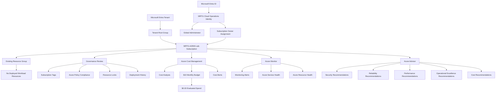

# Lab 13 - MRTG Azure Fundamentals Capstone

## Objective

Perform a structured final review of the Microsoft Azure environment used throughout the **MRTG Azure Fundamentals: The Bridge** project.

By completing this capstone, I:

- Reviewed Azure Portal access
- Validated the Azure subscription status and administrative role
- Reviewed resource groups and deployed resources
- Reviewed Microsoft Entra ID
- Reviewed Azure role-based access control
- Reviewed subscription-level tags
- Reviewed Azure Policy compliance
- Reviewed Azure resource locks
- Reviewed the management-group hierarchy
- Reviewed Azure Resource Manager deployment history
- Reviewed Azure Cost Management
- Validated the existing monthly budget
- Reviewed cost alerts
- Reviewed Azure Monitor
- Reviewed Azure Service Health
- Reviewed Azure Resource Health
- Reviewed Azure Advisor
- Reviewed active Azure Advisor security recommendations
- Confirmed that no resources or configurations were changed
- Confirmed that evaluated Azure spend remained `$0.00`

This was a discovery and validation lab. No Azure resources, identities, role assignments, tags, policies, locks, deployments, alerts, monitoring configurations, or billing settings were created, modified, or deleted.

---

## Business Problem Solved

Organizations need a repeatable process for reviewing a cloud environment before:

- Closing a project
- Transferring administrative ownership
- Approving additional development
- Beginning a security review
- Preparing for an audit
- Confirming cleanup
- Evaluating operational readiness

Without a structured final review, administrators may overlook:

- Unexpected resources
- Unapproved deployments
- Excessive permissions
- Missing ownership metadata
- Policy compliance findings
- Unprotected critical resources
- Cost exposure
- Active Azure service incidents
- Monitoring gaps
- Security recommendations
- Unnecessary cloud spending

Monroe Redstone Technology Group needed to verify that its Azure Fundamentals environment remained documented, controlled, secure, and cost-conscious at the completion of the project.

This capstone demonstrated how an Azure administrator can review identity, governance, cost, monitoring, and operational information without changing the environment.

---

## Scenario

MRTG completed the Azure Fundamentals lab series and required a final assessment of the Azure environment.

The MRTG Cloud Operations review evaluated:

- Azure Portal access
- Subscription status
- Resource organization
- Deployed resources
- Microsoft Entra ID
- Azure RBAC
- Subscription tags
- Azure Policy compliance
- Resource locks
- Management groups
- Deployment history
- Cost Analysis
- Budgets
- Cost alerts
- Azure Monitor
- Service Health
- Resource Health
- Azure Advisor
- Advisor security recommendations

The goal was to verify the final state of the environment before completing the project.

No configuration changes were made during the capstone.

---

## Azure Services and Resources Used

| Azure Service, Resource, or Feature | Purpose |
|---|---|
| Azure Portal | Provided the central interface for reviewing the Azure environment |
| Azure Subscription | Provided the administrative, billing, governance, and resource boundary |
| Azure Resource Manager | Provided resource, resource-group, deployment, and hierarchy management |
| Azure Resource Groups | Provided logical resource organization |
| Microsoft Entra ID | Provided identity and directory management |
| Azure RBAC | Provided subscription-level authorization |
| Azure Tags | Provided organizational metadata capabilities |
| Azure Policy | Provided resource compliance evaluation |
| Azure Resource Locks | Provided protection against accidental deletion or modification |
| Azure Management Groups | Provided subscription hierarchy and inherited governance |
| Azure Deployments | Provided Azure Resource Manager deployment-history visibility |
| Azure Cost Management | Provided cost analysis, budget, and cost-alert capabilities |
| Azure Monitor | Provided centralized monitoring and observability |
| Azure Service Health | Provided subscription-specific Azure service-event information |
| Azure Resource Health | Provided health information for individual Azure resources |
| Azure Advisor | Provided cost, security, reliability, performance, and operational recommendations |

---

## Why These Services Were Used

### Azure Portal

The Azure Portal provided the central interface for the capstone review.

It supported access to:

- Subscriptions
- Resource groups
- Resources
- Microsoft Entra ID
- Access control
- Tags
- Azure Policy
- Resource locks
- Management groups
- Deployments
- Cost Management
- Azure Monitor
- Service Health
- Resource Health
- Azure Advisor

### Azure Subscription

The Azure subscription was reviewed because it acts as a boundary for:

- Billing
- Resource deployment
- Azure RBAC
- Azure Policy
- Cost Management
- Budgets
- Monitoring
- Service quotas
- Administration

The review confirmed that `MRTG-AZ900-Lab-Subscription` remained active.

### Azure Resource Manager

Azure Resource Manager provides the Azure management and deployment layer.

It supports:

- Resource organization
- Resource groups
- Deployments
- Azure RBAC
- Tags
- Resource locks
- Policy integration
- Resource inventory

The capstone used Azure Resource Manager interfaces to review the final state of the subscription.

### Microsoft Entra ID

Microsoft Entra ID was reviewed as the identity foundation for Azure.

The tenant review provided visibility into:

- Users
- Groups
- Applications
- Devices
- Directory roles
- Tenant licensing
- Hybrid identity status

No Microsoft Entra configuration was changed.

### Azure RBAC

Azure RBAC was reviewed to validate the current subscription-level authorization assignment.

The review confirmed one Owner assignment at the subscription scope.

No assignment was added, removed, or modified.

### Azure Tags

The subscription Tags page was reviewed to determine whether organizational metadata had been applied at subscription scope.

No subscription-level tags were configured.

### Azure Policy

Azure Policy was reviewed to understand the subscription's current compliance state.

The Policy Compliance interface displayed:

- Overall resource compliance of `0%`
- One noncompliant evaluated item
- One noncompliant initiative
- Fifteen noncompliant policies

No assignment, initiative, exemption, or remediation task was created.

### Azure Resource Locks

Resource Locks were reviewed to determine whether deletion or modification protection existed at subscription scope.

No Delete or ReadOnly locks were configured.

### Azure Management Groups

Management Groups were reviewed to validate the subscription hierarchy.

The subscription remained directly beneath the Tenant Root Group.

No management group was created, renamed, or deleted, and the subscription was not moved.

### Azure Deployments

The subscription Deployments page was reviewed to identify Azure Resource Manager deployment history.

No deployments were displayed.

### Azure Cost Management

Azure Cost Management was reviewed to validate:

- Current cost
- Forecast availability
- Monthly budget
- Evaluated spend
- Cost-alert status

The final evaluated spend remained `$0.00`.

### Azure Monitor

Azure Monitor was reviewed to validate the subscription's monitoring summary and alert state.

No monitoring resources or configurations were created.

### Azure Service Health

Service Health was reviewed to determine whether an Azure platform event affected the subscription.

No active service issues were reported.

### Azure Resource Health

Resource Health was reviewed to determine whether individual resources were available for health evaluation.

No supported workload resources were deployed, so no resources were available for selection.

### Azure Advisor

Azure Advisor was reviewed to identify optimization and security recommendations.

The overview displayed:

- Security score of `100%`
- Seven active security recommendations
- No active cost recommendations
- No active reliability recommendations
- No active Operational Excellence recommendations
- No active performance recommendations

No recommendation was implemented or dismissed.

---

## Environment

| Item | Value |
|---|---|
| Organization | Monroe Redstone Technology Group |
| Project | MRTG Azure Fundamentals: The Bridge |
| Lab | Lab 13 - MRTG Azure Fundamentals Capstone |
| Cloud Platform | Microsoft Azure |
| Management Interface | Azure Portal |
| Subscription | `MRTG-AZ900-Lab-Subscription` |
| Subscription Status | Active |
| Subscription Role | Owner |
| Parent Management Group | Tenant Root Group |
| Microsoft Entra License | Microsoft Entra ID Free |
| Microsoft Entra Users Displayed | One |
| Microsoft Entra Groups Displayed | Zero |
| Microsoft Entra Applications Displayed | Zero |
| Microsoft Entra Devices Displayed | Zero |
| Microsoft Entra Connect | Not enabled |
| Existing Resource Groups | One |
| Resource Group Region | Central US |
| Deployed Workload Resources | None |
| Subscription Tags | None |
| Resource Locks | None |
| Deployments | None |
| Monthly Budget | `$10.00` |
| Forecasted Spend | `0` |
| Evaluated Spend | `$0.00` |
| Budget Progress | `0.00%` |
| Cost Alerts | None |
| Active Azure Service Issues | None |
| Registered Resources for Resource Health | None |
| Azure Advisor Security Score | `100%` |
| Active Advisor Recommendations | Seven security recommendations |
| Resources Created During Capstone | None |
| Resources Modified During Capstone | None |
| Resources Deleted During Capstone | None |
| Configuration Changes | None |
| Documentation Platform | GitHub |
| Lab Type | Discovery and validation |
| Estimated Incremental Cost | `$0.00` |

---

## Architecture / Concept Diagram



---

## Steps Performed

### Step 1: Open the Azure Portal

1. Opened the Azure Portal.
2. Reviewed:
   - Portal navigation
   - Global search
   - Common Azure service shortcuts
   - Azure credit information
   - Access to the MRTG Azure environment
3. Did not begin a resource-creation workflow.
4. Redacted the user email address.


**Validation:** The Azure Portal was accessible and displayed the MRTG Azure environment.

---

### Step 2: Review the Azure Subscription

1. Opened **Subscriptions**.
2. Selected `MRTG-AZ900-Lab-Subscription`.
3. Confirmed:
   - Subscription status was Active
   - Current role was Owner
   - Current cost was `$0.00`
   - Secure Score was displayed as `100%`
   - Parent management group was Tenant Root Group
4. Did not modify subscription settings.
5. Confirmed that the subscription ID was not exposed.


**Validation:** The subscription was Active, assigned beneath the Tenant Root Group, and displayed `$0.00` current cost.

---

### Step 3: Review Resource Groups

1. Opened **Resource groups**.
2. Confirmed that one resource group existed.
3. Confirmed that the resource group:
   - Belonged to `MRTG-AZ900-Lab-Subscription`
   - Was located in Central US
4. Did not create, modify, move, tag, or delete a resource group.
5. Redacted the resource-group name.


**Validation:** The Azure Portal displayed one existing resource group in Central US.

---

### Step 4: Review All Resources

1. Opened **All resources** at subscription scope.
2. Confirmed that no deployed workload resources were displayed.
3. Confirmed that no active resources such as the following remained deployed:
   - Virtual machines
   - Storage accounts
   - Virtual networks
   - Databases
   - App Services
   - Monitoring workspaces
4. Did not create, modify, or delete a resource.


**Validation:** No deployed Azure workload resources were displayed.

---

### Step 5: Review Microsoft Entra ID

1. Opened Microsoft Entra ID.
2. Reviewed the tenant overview.
3. Confirmed:
   - Microsoft Entra ID Free was in use
   - One user was displayed
   - No groups were displayed
   - No applications were displayed
   - No registered devices were displayed
   - Microsoft Entra Connect was not enabled
   - The MRTG administrative identity held the Global Administrator role
4. Did not modify any identity or tenant setting.
5. Redacted:
   - Directory name
   - Tenant ID
   - Primary domain
   - User email address


**Validation:** The Microsoft Entra tenant configuration was reviewed without exposing sensitive identity information.

---

### Step 6: Review Subscription IAM and Azure RBAC

1. Opened the subscription.
2. Opened **Access control (IAM)**.
3. Opened **Role assignments**.
4. Confirmed one Owner assignment at subscription scope.
5. Reviewed the assignment type and scope.
6. Did not add, remove, or modify a role assignment.
7. Redacted sensitive identity information.


**Validation:** The existing subscription Owner assignment was visible and remained unchanged.

---

### Step 7: Review Subscription Tags

1. Opened the subscription **Tags** page.
2. Confirmed that no subscription-level tags were configured.
3. Confirmed that no tag names or values were displayed.
4. Did not create, modify, delete, or save a tag.


**Validation:** No subscription-level tags were configured.

---

### Step 8: Review Azure Policy Compliance

1. Opened Azure Policy.
2. Opened **Compliance** at subscription scope.
3. Reviewed:
   - Overall resource compliance
   - Noncompliant resources
   - Noncompliant initiatives
   - Noncompliant policies
4. Observed:
   - Overall resource compliance of `0%`
   - One noncompliant evaluated item
   - One noncompliant initiative
   - Fifteen noncompliant policies
5. Did not:
   - Create a policy assignment
   - Create an initiative
   - Create an exemption
   - Start remediation
   - Modify the existing assignment


**Validation:** Existing policy-compliance findings were reviewed without changing Azure Policy configuration.

---

### Step 9: Review Resource Locks

1. Opened subscription **Resource locks**.
2. Confirmed that no resource locks were configured.
3. Confirmed that no:
   - Delete lock
   - ReadOnly lock
   was present.
4. Did not create, modify, or delete a lock.


**Validation:** No subscription-level resource locks were configured.

---

### Step 10: Review Management Groups

1. Opened **Management groups**.
2. Reviewed the hierarchy:

```text
Tenant Root Group
└── MRTG-AZ900-Lab-Subscription
```

3. Confirmed that the Tenant Root Group contained one subscription.
4. Did not:
   - Create a management group
   - Rename a management group
   - Delete a management group
   - Move the subscription
5. Redacted sensitive tenant identifiers.


**Validation:** The MRTG subscription remained directly beneath the Tenant Root Group.

---

### Step 11: Review Azure Deployments

1. Opened subscription **Deployments**.
2. Reviewed the Azure Resource Manager deployment-history interface.
3. Confirmed that no deployment records were displayed.
4. Did not:
   - Begin a deployment
   - Redeploy a template
   - Delete deployment history
   - Create a resource


**Validation:** No subscription-level deployments were displayed.

---

### Step 12: Review Cost Analysis

1. Opened Azure Cost Management.
2. Opened **Cost Analysis** at subscription scope.
3. Confirmed:
   - No cost was reported
   - No cost breakdown was displayed by service
   - No cost breakdown was displayed by location
   - No cost breakdown was displayed by resource group
   - Forecast data was unavailable because no cost history existed
4. Did not save, export, subscribe to, or modify Cost Management information.
5. Redacted sensitive scope information.


**Validation:** Azure Cost Analysis displayed no reported cost for the selected period.

---

### Step 13: Review the Monthly Budget

1. Opened the subscription-level **Budgets** page.
2. Located `mrtg-az900-monthly-budget`.
3. Confirmed:

| Setting | Value |
|---|---|
| Reset Period | Monthly |
| Budget Amount | `$10.00` |
| Forecasted Spend | `0` |
| Evaluated Spend | `$0.00` |
| Progress | `0.00%` |

4. Did not create, modify, or delete a budget.
5. Redacted the subscription ID.


**Validation:** The existing monthly budget remained active with `$0.00` evaluated spend.

---

### Step 14: Review Cost Alerts

1. Opened subscription-level **Cost alerts**.
2. Confirmed that no cost alerts were displayed.
3. Did not:
   - Create a cost alert
   - Dismiss an alert
   - Reactivate an alert
   - Modify notification settings


**Validation:** No active cost alerts were displayed.

---

### Step 15: Review Azure Monitor

1. Opened Azure Monitor.
2. Reviewed the subscription monitoring summary.
3. Observed:
   - No Azure service incidents
   - No monitoring issues during the previous 24 hours
   - No critical alerts
   - No error alerts
   - No warning alerts
   - No informational alerts
   - No verbose alerts
   - No recommendations in the monitoring summary
   - No active or planned maintenance
4. Did not create:
   - A monitoring resource
   - An alert rule
   - An action group
   - A workbook
   - A dashboard
   - A diagnostic setting


**Validation:** Azure Monitor displayed no active alert or monitoring issue for the reviewed subscription.

---

### Step 16: Review Azure Service Health

1. Opened Azure Service Health.
2. Confirmed that `MRTG-AZ900-Lab-Subscription` was selected.
3. Confirmed that no active service issues were reported.
4. Reviewed the regional health map.
5. Did not create a Service Health alert.
6. Did not modify Service Health configuration.


**Validation:** No active Azure service issue affected the selected subscription.

---

### Step 17: Review Azure Resource Health

1. Opened Azure Resource Health.
2. Confirmed that no registered resources were available for selection.
3. Documented that this was expected because no supported workload resources were deployed.
4. Did not create a Resource Health alert.
5. Did not change monitoring configuration.


**Validation:** No deployed workload resource was available for Resource Health evaluation.

---

### Step 18: Review Azure Advisor

1. Opened Azure Advisor.
2. Reviewed the subscription overview.
3. Observed:
   - Security score of `100%`
   - Seven active security recommendations
   - No active cost recommendations
   - No active reliability recommendations
   - No active Operational Excellence recommendations
   - No active performance recommendations
4. Did not implement a recommendation.


**Validation:** Azure Advisor displayed category-level recommendations and a security score for the subscription.

---

### Step 19: Review Azure Advisor Recommendations

1. Opened **All Recommendations**.
2. Reviewed seven active security recommendations involving:
   - Microsoft Defender for Storage
   - Additional subscription Owner assignment
   - Microsoft Defender Cloud Security Posture Management
   - Microsoft Defender for Resource Manager
   - High-severity security-alert email notifications
   - Subscription Owner notifications
   - Security contact information
3. Reviewed High, Medium, and Low impact levels.
4. Confirmed that each recommendation affected one subscription.
5. Did not:
   - Apply a recommendation
   - Postpone a recommendation
   - Dismiss a recommendation
   - Enable a Defender plan
   - Add a subscription Owner
   - Change notification settings
   - Change security contact information


**Validation:** Seven active Azure Advisor security recommendations were reviewed without changing the environment.

---

## Capstone Review Summary

| Review Area | Final State |
|---|---|
| Subscription | Active |
| Subscription role | Owner |
| Parent management group | Tenant Root Group |
| Existing resource groups | One |
| Deployed workload resources | None |
| Microsoft Entra users | One |
| Microsoft Entra groups | None |
| Microsoft Entra applications | None |
| Microsoft Entra devices | None |
| Microsoft Entra Connect | Not enabled |
| Subscription tags | None |
| Policy compliance | `0%` displayed |
| Noncompliant initiative | One |
| Noncompliant policies | Fifteen |
| Resource locks | None |
| Deployments | None |
| Current cost | `$0.00` |
| Monthly budget | `$10.00` |
| Evaluated spend | `$0.00` |
| Budget progress | `0.00%` |
| Cost alerts | None |
| Monitoring alerts | None displayed |
| Active service issues | None |
| Resource Health resources | None |
| Advisor security score | `100%` |
| Advisor security recommendations | Seven |
| Capstone configuration changes | None |

---

## Azure Control Layers

Azure administration depends on multiple control layers.

| Control Layer | Azure Capability | Primary Purpose |
|---|---|---|
| Identity | Microsoft Entra ID | Authenticate users, applications, devices, and workloads |
| Authorization | Azure RBAC | Determine permitted Azure resource actions |
| Hierarchy | Management Groups and Subscriptions | Organize governance and administrative boundaries |
| Resource Organization | Resource Groups and Tags | Organize workloads and metadata |
| Configuration Governance | Azure Policy | Audit or enforce resource standards |
| Resource Protection | Resource Locks | Reduce accidental deletion or modification |
| Deployment Management | Azure Resource Manager | Deploy and manage Azure resources |
| Financial Governance | Azure Cost Management | Monitor and analyze spending |
| Monitoring | Azure Monitor | Collect and analyze telemetry |
| Platform Health | Azure Service Health | Report Azure platform events |
| Resource Health | Azure Resource Health | Report individual resource health |
| Optimization | Azure Advisor | Identify improvement opportunities |

---

## Validation

| Validation Item | Expected Result | Actual Result |
|---|---|---|
| Azure Portal access | MRTG environment is available | Passed |
| Subscription status | Subscription is Active | Passed |
| Subscription role | Owner role is visible | Passed |
| Current subscription cost | Cost is `$0.00` | Passed |
| Resource groups | Existing resource group is documented | Passed |
| Deployed resources | No workload resources are found | Passed |
| Microsoft Entra ID | Tenant configuration is reviewed | Passed |
| Subscription IAM | Existing Owner assignment is documented | Passed |
| Subscription tags | No subscription tags are configured | Passed |
| Azure Policy compliance | Existing findings are documented | Passed |
| Resource locks | No locks are configured | Passed |
| Management-group hierarchy | Subscription is beneath Tenant Root Group | Passed |
| Deployment history | No deployments are displayed | Passed |
| Cost Analysis | No cost is reported | Passed |
| Monthly budget | `$10.00` budget is active | Passed |
| Evaluated spend | Spend is `$0.00` | Passed |
| Budget progress | Progress is `0.00%` | Passed |
| Cost alerts | No alerts are displayed | Passed |
| Azure Monitor | No active monitoring issues are displayed | Passed |
| Service Health | No active service issues are displayed | Passed |
| Resource Health | No registered workload resources are available | Passed |
| Azure Advisor | Security score and categories are displayed | Passed |
| Advisor recommendations | Seven security recommendations are documented | Passed |
| New resources | No resources are created | Passed |
| Resource modifications | No resources are modified | Passed |
| Configuration changes | No configuration changes are made | Passed |
| Incremental cost | Capstone remains within the `$0.00` estimate | Passed |

---

## Completion Checklist

- [x] Opened the Azure Portal
- [x] Reviewed the Azure subscription
- [x] Confirmed that the subscription was Active
- [x] Confirmed that the current role was Owner
- [x] Confirmed that the subscription cost was `$0.00`
- [x] Reviewed resource groups
- [x] Reviewed all Azure resources
- [x] Confirmed that no workload resources were deployed
- [x] Reviewed Microsoft Entra ID
- [x] Reviewed the Global Administrator assignment
- [x] Reviewed subscription Access control (IAM)
- [x] Reviewed the Owner role assignment
- [x] Reviewed subscription tags
- [x] Reviewed Azure Policy compliance
- [x] Reviewed resource locks
- [x] Reviewed management groups
- [x] Reviewed deployment history
- [x] Reviewed Cost Analysis
- [x] Reviewed the monthly budget
- [x] Reviewed evaluated spend
- [x] Reviewed cost alerts
- [x] Reviewed Azure Monitor
- [x] Reviewed Azure Service Health
- [x] Reviewed Azure Resource Health
- [x] Reviewed Azure Advisor
- [x] Reviewed Azure Advisor recommendations
- [x] Confirmed that no resources were created
- [x] Confirmed that no resources were modified
- [x] Confirmed that no resources were deleted
- [x] Confirmed that no role assignments were changed
- [x] Confirmed that no tags were changed
- [x] Confirmed that no policies were changed
- [x] Confirmed that no locks were changed
- [x] Confirmed that no deployments were started
- [x] Confirmed that no monitoring configurations were changed
- [x] Confirmed that no billing settings were changed
- [x] Confirmed that evaluated spend remained `$0.00`
- [x] Redacted sensitive identifiers from screenshots

---

## AZ-900 Exam Objective Coverage

This capstone reinforced concepts from all major AZ-900 objective areas.

### Describe Cloud Concepts

- Cloud computing
- Shared responsibility
- Public, private, and hybrid cloud models
- Consumption-based pricing
- High availability
- Scalability
- Elasticity
- Reliability
- Predictability
- Security
- Governance
- Manageability

### Describe Azure Architecture and Services

- Azure regions
- Availability zones
- Resource groups
- Subscriptions
- Management groups
- Azure Resource Manager
- Microsoft Entra ID
- Azure RBAC
- Compute services
- Networking services
- Storage services

### Describe Azure Management and Governance

- Azure Portal
- Azure Policy
- Resource locks
- Tags
- Cost Management
- Budgets
- Cost alerts
- Azure Monitor
- Service Health
- Resource Health
- Azure Advisor
- Azure Resource Manager deployments

### How This Lab Supports the Objectives

This capstone connected the full Azure Fundamentals series to a structured Azure environment review.

It demonstrated:

- How subscriptions provide administrative and billing boundaries
- How Microsoft Entra ID and Azure RBAC work together
- How Azure resources are organized
- How Azure Policy reports compliance
- How resource locks provide protection
- How management groups provide hierarchy
- How deployment history supports administration
- How Cost Management validates spending
- How Azure Monitor supports operational visibility
- How Service Health and Resource Health answer different health questions
- How Azure Advisor provides improvement recommendations

---

## Mini Objective Coverage

By completing this capstone, I can:

- Review an Azure subscription
- Validate subscription status and role
- Review resource groups and deployed resources
- Review Microsoft Entra tenant information
- Distinguish Microsoft Entra roles from Azure RBAC roles
- Review subscription role assignments
- Review subscription tags
- Interpret Azure Policy compliance results
- Review resource locks
- Review the management-group hierarchy
- Review Azure Resource Manager deployment history
- Validate Azure spending
- Review Azure budgets and cost alerts
- Review Azure Monitor
- Review Azure Service Health
- Review Azure Resource Health
- Review Azure Advisor categories
- Review Azure Advisor recommendations
- Identify Azure governance gaps
- Document empty portal states accurately
- Validate an Azure environment without changing it
- Confirm final project cost

---

## IAM / Security Relevance

The capstone reinforced the relationship between Azure identity, authorization, governance, monitoring, and security operations.

### Microsoft Entra ID

Microsoft Entra ID provides the Azure identity foundation.

The tenant review displayed:

- One administrative identity
- Global Administrator access
- Microsoft Entra ID Free
- No groups
- No applications
- No registered devices
- No hybrid identity synchronization

### Azure RBAC

Azure RBAC determines what authenticated identities can do within Azure.

The subscription contained one Owner assignment.

The Owner role can:

- Manage Azure resources
- Delete Azure resources
- Modify resource configuration
- Assign Azure roles
- Remove role assignments

Permanent Owner access should be limited and reviewed in production.

### Microsoft Entra Roles and Azure RBAC Roles

The capstone demonstrated two separate role systems.

| Role System | Reviewed Role | Purpose |
|---|---|---|
| Microsoft Entra administrative roles | Global Administrator | Manages tenant and directory capabilities |
| Azure RBAC | Owner | Manages Azure resources and access at the assigned scope |

An identity may hold one, both, or neither role.

### Least Privilege

Production improvements would include:

- Reducing permanent Global Administrator assignments
- Reducing permanent Owner assignments
- Using specialized roles
- Assigning access through groups
- Using Privileged Identity Management
- Performing regular access reviews
- Using separate administrative accounts
- Maintaining emergency-access accounts

### Separation of Duties

Production responsibilities should be separated across:

- Identity administration
- Subscription administration
- Security operations
- Billing administration
- Policy administration
- Monitoring administration
- Deployment administration
- Audit review

This reduces the risk that one identity can perform a change, modify permissions, remove evidence, and approve the same action.

### Advisor Security Recommendations

Azure Advisor identified recommendations involving:

- Microsoft Defender protections
- Subscription Owner redundancy
- Security-alert notifications
- Security contact information

These findings demonstrated that Azure can identify subscription-level security opportunities even without deployed workload resources.

### Monitoring and Security

Azure Monitor, Service Health, Resource Health, and Azure Advisor support security operations through:

- Administrative visibility
- Alerting
- Service-incident awareness
- Resource-health information
- Configuration recommendations
- Operational evidence
- Incident-investigation data

### Security Takeaway

Azure security depends on multiple layers:

- Authentication
- Authorization
- Governance
- Resource protection
- Monitoring
- Operational review
- Cost visibility

---

## Governance Notes

### Management-Group Hierarchy

The subscription was located directly beneath the Tenant Root Group.

This was sufficient for a single-subscription lab.

A larger environment could use additional management groups for:

- Platform services
- Production
- Non-production
- Sandbox
- Sensitive workloads
- Business units
- Geographic requirements

### Azure Policy

The subscription displayed noncompliant policy findings.

A production governance process should:

1. Review the existing initiative assignment.
2. Identify the reason for each finding.
3. Determine whether each finding applies.
4. Test changes in a non-production environment.
5. Document approved exceptions.
6. Remediate approved findings.
7. Monitor compliance continuously.

A `0%` compliance result should not be interpreted without reviewing:

- Scope
- Evaluation state
- Resource applicability
- Existing assignments
- Policy definitions
- Remediation requirements

### Resource Locks

No resource locks were configured.

Production environments should consider:

- Delete locks for critical resources
- ReadOnly locks for highly controlled configurations
- Lock ownership
- Change approval before lock removal
- Emergency lock-removal procedures
- Lock inheritance

### Tags

No subscription-level tags were configured.

A production subscription tagging standard could include:

| Tag | Example Value |
|---|---|
| `Environment` | `Production` |
| `Owner` | `CloudOperations` |
| `Department` | `IT` |
| `CostCenter` | `CC-1001` |
| `Application` | `IdentityPlatform` |
| `DataClassification` | `Confidential` |
| `ManagedBy` | `InfrastructureAsCode` |

Tags provide metadata but do not replace Azure RBAC, Azure Policy, encryption, or resource locks.

### Deployments

No subscription-level deployments were displayed.

Production deployments should use:

- Infrastructure as Code
- Source control
- Pull requests
- Peer review
- Deployment validation
- Approved service connections
- Environment-specific parameters
- Deployment-history monitoring

### Governance Takeaway

Governance is not one service.

It combines:

- Hierarchy
- Identity
- Authorization
- Policy
- Resource protection
- Metadata
- Deployment control
- Monitoring
- Cost management

---

## Cost Considerations

### Estimated Capstone Cost

```text
Estimated incremental cost: $0.00
```

### Final Cost Validation

| Cost Item | Result |
|---|---|
| Current Cost | `$0.00` |
| Monthly Budget | `$10.00` |
| Forecasted Spend | `0` |
| Evaluated Spend | `$0.00` |
| Budget Progress | `0.00%` |
| Active Cost Alerts | None |
| Workload Resources | None |
| Incremental Capstone Cost | `$0.00` |

### Why Cost Remained at Zero

The capstone did not create or enable:

- Virtual machines
- Storage accounts
- Virtual networks
- Databases
- App Services
- Log Analytics workspaces
- Application Insights
- Alert rules
- Action groups
- Azure Policy remediation
- Microsoft Defender plans
- Resource locks
- Management groups
- Azure deployments

### Production Cost Controls

A production Azure environment should use:

- Subscription budgets
- Resource-group budgets
- Cost alerts
- Forecast alerts
- Required cost-center tags
- Azure Advisor cost recommendations
- Scheduled spending reviews
- Reserved-capacity analysis
- Savings Plans evaluation
- Resource-lifecycle management
- Automated non-production shutdown
- Cost-allocation reporting

### Budget Limitation

Azure budgets:

- Monitor actual and forecasted spending
- Generate notifications
- Do not stop resources
- Do not delete resources
- Do not prevent deployments
- Do not disable subscriptions
- Do not enforce a hard spending limit
- Do not replace regular cost review

---

## Troubleshooting Notes

### Issue 1: Resource Group Name Required Redaction

**Symptom**

The Resource Groups page displayed the existing resource-group name.

**Resolution**

The resource-group name was covered with solid opaque redaction before publication.

**Result**

The screenshot documented the resource-group inventory without exposing the selected name.

---

### Issue 2: Microsoft Entra ID Exposed Tenant Information

**Symptom**

The Microsoft Entra ID overview displayed:

- Tenant name
- Tenant ID
- Primary domain
- User email address

**Resolution**

Sensitive values were redacted.

**Result**

The tenant overview remained useful for public documentation.

---

### Issue 3: Subscription IAM Displayed Directory Information

**Symptom**

The subscription IAM interface displayed identity or directory details.

**Resolution**

Sensitive identity and directory information was removed before the screenshot was saved.

**Result**

The Azure RBAC role and scope remained visible without exposing the administrative identity.

---

### Issue 4: Resource Locks Were Difficult to Locate

**Symptom**

The Resource Locks page was not immediately visible.

**Resolution**

Opened the subscription and navigated to:

```text
Settings
└── Resource locks
```

**Result**

The subscription lock state was reviewed successfully.

---

### Issue 5: All Resources Returned No Items

**Symptom**

The All Resources page displayed no workload resources.

**Explanation**

No deployed workload resources remained in the subscription.

**Result**

The empty state was valid evidence of the final environment.

---

### Issue 6: Cost Forecast Was Unavailable

**Symptom**

Cost Analysis did not display a forecast.

**Explanation**

No historical spending data existed for forecasting.

**Result**

The absence of forecast data was documented accurately.

---

### Issue 7: Resource Health Displayed No Resources

**Symptom**

Resource Health displayed no resources available for evaluation.

**Explanation**

No supported workload resources were deployed.

**Result**

The empty state was treated as an expected result.

---

### Issue 8: Azure Monitor Displayed No Issues

**Symptom**

Azure Monitor displayed no alerts or active issues.

**Explanation**

No monitoring condition was active, and no workload monitoring resources were deployed.

**Result**

The no-issue state was documented as valid evidence.

---

### Issue 9: Service Health Displayed No Active Incidents

**Symptom**

Service Health displayed no active incidents.

**Explanation**

No Azure platform event affected the subscription at the time of review.

**Result**

The subscription health state was validated.

---

### Issue 10: Advisor Displayed a 100% Score With Recommendations

**Symptom**

Azure Advisor displayed a security score of `100%` while also displaying seven active security recommendations.

**Explanation**

Different Azure views can use different:

- Scopes
- Evaluation methods
- Recommendation sources
- Refresh schedules
- Scoring calculations

**Resolution**

The detailed recommendation list was reviewed instead of relying only on the summary score.

**Result**

The apparent difference was documented without changing the environment.

---

### Issue 11: Policy Compliance Displayed 0%

**Symptom**

Azure Policy displayed `0%` overall resource compliance.

**Risk**

The percentage could be misinterpreted without reviewing the assignment, resource state, and policy applicability.

**Resolution**

The existing initiative and policy findings were documented without creating an exemption or starting remediation.

**Result**

The compliance state was recorded accurately without changing the environment.

---

## What I Would Do Differently in Production

A production Azure environment would require stronger identity, governance, monitoring, deployment, and financial controls.

### Identity and Access

- Use separate standard-user and administrative accounts
- Reduce permanent Global Administrator assignments
- Reduce permanent Owner assignments
- Use Privileged Identity Management
- Require multifactor authentication
- Implement Conditional Access
- Maintain emergency-access accounts
- Perform recurring access reviews
- Use groups for role assignments
- Use managed identities for applications and automation

### Governance

- Build a formal management-group hierarchy
- Apply Azure Policy at appropriate scopes
- Test policies in Audit mode before using Deny
- Use policy initiatives for organizational standards
- Define a tagging strategy
- Apply resource locks to critical resources
- Document exemptions
- Document remediation decisions
- Store governance definitions in source control

### Resource Organization

- Separate production, development, testing, and security workloads
- Use standardized resource-group naming
- Use standardized resource naming
- Apply ownership and cost-center metadata
- Establish regional deployment standards
- Define cleanup procedures

### Deployment Management

- Store Bicep or ARM templates in source control
- Require peer review
- Use deployment validation
- Use dedicated deployment identities
- Monitor deployment history
- Use CI/CD pipelines
- Protect production deployments with approvals
- Maintain rollback plans

### Monitoring

- Deploy an approved Log Analytics workspace architecture
- Configure diagnostic settings
- Create action groups
- Create alerts for critical services
- Configure Service Health alerts
- Configure Resource Health alerts
- Define log-retention requirements
- Protect monitoring resources through Azure RBAC
- Evaluate Microsoft Sentinel integration

### Security

- Review all Azure Advisor security recommendations
- Evaluate Microsoft Defender for Cloud plans
- Configure security contact information
- Configure high-severity alert notifications
- Review subscription Owner redundancy
- Enable centralized security monitoring
- Document accepted risks and exceptions

### Cost Management

- Retain the existing monthly budget
- Add actual and forecast thresholds
- Apply cost-center tags
- Review Azure Advisor cost recommendations
- Use automated shutdown for non-production resources
- Review spending on a defined schedule
- Require approval for high-cost resources
- Remove abandoned resources promptly

The capstone intentionally remained discovery-only because its purpose was final environment validation.

---

## Lessons Learned

- Azure administration requires multiple control layers.
- Microsoft Entra ID provides authentication and tenant administration.
- Azure RBAC provides Azure resource authorization.
- Global Administrator and Owner are separate roles.
- The subscription is an important administrative, billing, governance, and monitoring boundary.
- Resource groups organize resources by purpose and lifecycle.
- Management groups provide governance above subscriptions.
- Azure Policy reports whether resource configurations meet assigned standards.
- Policy-compliance percentages require context.
- Resource locks can reduce accidental deletion or modification.
- Tags provide organizational metadata but do not provide access control.
- Deployment history supports troubleshooting and auditing.
- Azure Cost Management provides spending visibility.
- Budgets provide monitoring and notifications rather than hard spending limits.
- Azure Monitor provides centralized observability.
- Service Health and Resource Health answer different operational questions.
- Azure Advisor can identify subscription-level security recommendations without deployed workloads.
- Empty portal states can provide valid evidence.
- Summary scores should be reviewed with detailed findings.
- Screenshot redaction is part of professional cloud documentation.
- Cost validation should continue throughout the resource lifecycle.

### Technical Takeaway

The capstone demonstrated how Microsoft Entra ID, Azure RBAC, Azure Policy, Resource Locks, Management Groups, Cost Management, Azure Monitor, and Azure Advisor work together to support Azure administration.

### Business Takeaway

A structured cloud review improves accountability, identifies governance gaps, validates cost controls, and supports project closure or operational handoff.

### Security Takeaway

Strong Azure security requires identity, authorization, governance, monitoring, privileged-access control, and regular review.

### Exam Takeaway

For AZ-900, remember:

- Microsoft Entra ID manages identities and authentication.
- Azure RBAC controls Azure resource access.
- Management groups organize subscriptions.
- Resource groups organize resources.
- Azure Policy audits or enforces resource standards.
- Resource locks protect against accidental deletion or modification.
- Tags provide metadata.
- Cost Management provides spending visibility.
- Budgets provide notifications rather than hard spending caps.
- Azure Monitor provides centralized observability.
- Service Health reports Azure service events.
- Resource Health reports individual resource health.
- Azure Advisor provides improvement recommendations.

---

## Cleanup

### Resources Retained

| Resource or Configuration | Reason |
|---|---|
| Microsoft Entra tenant | Required for Azure identity management |
| MRTG Azure subscription | Retained as project evidence and for future Azure labs |
| Tenant Root Group hierarchy | Existing Azure governance structure |
| Existing Owner assignment | Required for current subscription administration |
| Existing resource group | Retained as foundational project evidence |
| Existing monthly budget | Required for ongoing cost visibility |
| Existing policy assignment | Pre-existing Azure configuration |
| Lab 13 documentation | Retained as capstone evidence |
| Lab 13 screenshots | Retained as validation evidence |

### Resources Removed

No resources or configurations were created during the capstone.

### Cleanup Validation

- [x] No Azure resources were created
- [x] No Azure resources were modified
- [x] No Azure resources were deleted
- [x] No resource groups were created
- [x] No Microsoft Entra identities were created
- [x] No role assignments were created or modified
- [x] No tags were created or modified
- [x] No policy assignments were created or modified
- [x] No policy initiatives were created
- [x] No policy exemptions were created
- [x] No remediation tasks were created
- [x] No resource locks were created or modified
- [x] No management groups were created
- [x] No subscriptions were moved
- [x] No deployments were started
- [x] No budgets were created or modified
- [x] No cost alerts were created
- [x] No alert rules were created
- [x] No action groups were created
- [x] No diagnostic settings were created
- [x] No Service Health alerts were created
- [x] No Resource Health alerts were created
- [x] No Azure Advisor recommendations were implemented
- [x] No Microsoft Defender plans were enabled
- [x] No monitoring configurations were changed
- [x] Evaluated spend remained `$0.00`
- [x] Screenshot data was sanitized

---

## Outcome

Lab 13 completed the **MRTG Azure Fundamentals: The Bridge** project.

The capstone validated:

- Azure Portal access
- Active subscription status
- Subscription-level Owner access
- Microsoft Entra ID configuration
- Azure RBAC assignments
- Resource organization
- Azure Policy compliance
- Resource-lock status
- Management-group hierarchy
- Deployment history
- Cost Analysis
- Monthly budget protection
- Cost-alert status
- Azure Monitor status
- Azure Service Health
- Azure Resource Health
- Azure Advisor recommendations

The environment contained:

- No deployed workload resources
- No subscription-level tags
- No resource locks
- No deployment records
- No active cost alerts
- No active Azure service incidents
- No unexpected spending

The final evaluated spend remained:

```text
$0.00
```

---

## Screenshot Inventory

| Screenshot | Description |
|---|---|
| `01-azure-portal-capstone-start.png` | Azure Portal home page and capstone starting point |
| `02-subscription-overview.png` | Active subscription status, Owner role, cost, Secure Score, and management group |
| `03-resource-groups-capstone-review.png` | Resource-group review with sensitive name redacted |
| `04-all-resources-capstone-review.png` | All Resources page showing no deployed workload resources |
| `05-microsoft-entra-id-capstone-review.png` | Microsoft Entra ID tenant review with sensitive identifiers redacted |
| `06-subscription-iam-capstone-review.png` | Subscription-level Owner role assignment |
| `07-subscription-tags-capstone-review.png` | Subscription Tags page showing no configured tags |
| `08-policy-compliance-capstone-review.png` | Azure Policy compliance findings |
| `09-resource-locks-capstone-review.png` | Subscription Resource Locks page showing no locks |
| `10-management-groups-capstone-review.png` | Tenant Root Group and subscription hierarchy |
| `11-deployments-capstone-review.png` | Subscription Deployments page showing no deployments |
| `12-cost-analysis-capstone-review.png` | Subscription Cost Analysis showing no reported cost |
| `13-budget-capstone-review.png` | `$10.00` monthly budget with `$0.00` evaluated spend |
| `14-cost-alerts-capstone-review.png` | Cost Alerts page showing no active alerts |
| `15-azure-monitor-capstone-review.png` | Azure Monitor subscription overview |
| `16-service-health-capstone-review.png` | Service Health showing no active service issues |
| `17-resource-health-capstone-review.png` | Resource Health showing no registered workload resources |
| `18-azure-advisor-capstone-review.png` | Azure Advisor overview and security score |
| `19-azure-advisor-recommendations-capstone-review.png` | Seven active Azure Advisor security recommendations |

---

## Screenshots

### Azure Portal Capstone Start


### Subscription Overview


### Resource Groups Capstone Review


### All Resources Capstone Review


### Microsoft Entra ID Capstone Review


### Subscription IAM Capstone Review


### Subscription Tags Capstone Review


### Policy Compliance Capstone Review


### Resource Locks Capstone Review


### Management Groups Capstone Review


### Deployments Capstone Review


### Cost Analysis Capstone Review


### Budget Capstone Review


### Cost Alerts Capstone Review


### Azure Monitor Capstone Review


### Service Health Capstone Review


### Resource Health Capstone Review


### Azure Advisor Capstone Review


### Azure Advisor Recommendations Capstone Review


---

## Series Completion

Lab 13 completes the **MRTG Azure Fundamentals: The Bridge** project.

The completed series includes:

| Lab | Title |
|---:|---|
| 01 | Azure Environment and Cost Protection |
| 02 | Cloud Computing and Shared Responsibility |
| 03 | Cloud Models, Benefits, and Service Types |
| 04 | Azure Architecture and Resource Hierarchy |
| 05 | Azure Compute Services |
| 06 | Azure Networking Foundation |
| 07 | Azure Storage Services |
| 08 | Microsoft Entra ID, RBAC, and Zero Trust |
| 09 | Azure Cost Management and Resource Organization |
| 10 | Azure Governance, Policy, and Compliance |
| 11 | Azure Management and Deployment Tools |
| 12 | Azure Monitoring, Health, and Optimization |
| 13 | MRTG Azure Fundamentals Capstone |

The project established a documented foundation for future work involving:

- Microsoft Entra ID
- Identity and Access Management
- Azure security
- Azure administration
- Azure governance
- Azure monitoring
- Hybrid identity
- Infrastructure as Code
- SC-900
- SC-300
- AZ-104
