# MRTG Azure Fundamentals: The Bridge


## Project Overview

**MRTG Azure Fundamentals: The Bridge** is a 13-lab Microsoft Azure portfolio project built around the foundational concepts covered by the AZ-900 certification.

The series connects Microsoft Learn concepts with practical exploration in the Azure Portal while emphasizing:

- Cloud computing fundamentals
- Azure architecture
- Compute, networking, and storage services
- Microsoft Entra ID
- Azure role-based access control
- Zero Trust
- Cost management
- Azure governance
- Azure Policy
- Management and deployment tools
- Azure monitoring and health services
- Security recommendations
- Professional technical documentation

The lab environment was developed under the fictional enterprise organization:

```text
Monroe Redstone Technology Group
```

The project serves as a bridge between foundational IT support experience and future work involving:

- Identity and Access Management
- Microsoft Entra ID
- Azure administration
- Cloud security
- Azure governance
- Hybrid identity
- Infrastructure as Code
- Security operations

---

## Project Status

```text
Project Build                    | Complete
Labs Completed                   | 13 of 13
Screenshots Reviewed             | Complete
Sensitive Information Redacted  | Complete
Lab READMEs Polished             | Complete
Documentation Standardized      | Complete
Documentation Consistency Review | Complete
Capstone Review                  | Complete
Final Evaluated Azure Spend      | $0.00
```

The complete lab series, capstone, screenshot review, and documentation consistency review are finished.

---

## AI-Assisted Learning and Documentation

This project was completed through hands-on work in Microsoft Azure.

I used ChatGPT as a supporting tool during the lab series to help with:

- Organizing lab objectives
- Explaining Azure concepts
- Developing troubleshooting approaches
- Reviewing documentation for completeness
- Improving grammar, clarity, and consistency
- Formatting GitHub README files
- Standardizing documentation sections
- Identifying information that should be redacted
- Reviewing whether documentation matched the completed lab work

I personally:

- Completed all activities in the Azure Portal
- Made all administrative and configuration decisions
- Captured and reviewed every screenshot
- Redacted sensitive information
- Validated the results of each lab
- Reviewed and edited the final documentation
- Confirmed that the README content matched the actual Azure environment
- Completed the final documentation consistency review

AI-generated suggestions were treated as guidance rather than authoritative technical instructions.

Information was reviewed against:

- Microsoft Learn
- The Azure Portal
- The observed results of each lab
- The final state of the Azure environment

ChatGPT did not access, configure, or operate the Azure environment. Its role was limited to supporting my learning, troubleshooting process, and documentation workflow.

---

## Project Objectives

The objectives of this project were to:

- Build a practical understanding of Microsoft Azure fundamentals
- Connect Microsoft Learn concepts to the Azure Portal
- Review core Azure services without unnecessary resource deployment
- Apply identity, security, governance, and cost-awareness principles
- Develop repeatable cloud documentation practices
- Practice identifying and redacting sensitive cloud information
- Produce a structured GitHub portfolio project
- Prepare for the Microsoft Azure Fundamentals AZ-900 exam
- Establish a foundation for future SC-900, AI-901, SC-300, and AZ-104 projects

---

## Project Principles

### Cost-Aware Learning

The project was designed to minimize unnecessary Azure spending.

The environment used:

- A `$10.00` monthly Azure budget
- Cost Analysis reviews
- Budget validation
- Cost-alert reviews
- Discovery-only labs where deployment was not required
- Final cost validation throughout the series

The final evaluated Azure spend remained:

```text
$0.00
```

### Security-First Documentation

Screenshots were reviewed before publication.

Sensitive information was excluded or redacted, including:

- Email addresses
- User principal names
- Tenant IDs
- Subscription IDs
- Directory names
- Microsoft Entra domains
- `onmicrosoft.com` domains
- Object IDs
- Principal IDs
- Request IDs
- Correlation IDs
- Billing-account names
- Billing-profile information
- Payment information
- Invoice information
- Personal names
- Other environment-specific identifiers

### Discovery Before Deployment

Many labs were intentionally completed as discovery-only exercises.

This approach allowed Azure services to be reviewed without creating:

- Unnecessary resources
- Persistent workloads
- Premium service charges
- Orphaned resources
- Additional security exposure
- Cleanup complexity

### Governance and Least Privilege

The project consistently considered:

- Microsoft Entra authentication
- Azure RBAC
- Least privilege
- Scope inheritance
- Zero Trust
- Resource organization
- Cost ownership
- Azure Policy
- Resource locks
- Monitoring
- Administrative accountability

---

## Architecture and Governance Model

```mermaid
flowchart TD
    Tenant[Microsoft Entra Tenant] --> Root[Tenant Root Group]
    Root --> Subscription[MRTG-AZ900-Lab-Subscription]

    Subscription --> ResourceGroups[Azure Resource Groups]
    ResourceGroups --> Resources[Azure Resources]

    Tenant --> Identity[Microsoft Entra ID]
    Identity --> Users[Users]
    Identity --> Groups[Groups]
    Identity --> Roles[Directory Roles]

    Identity --> Authentication[Authentication]
    Authentication --> MFA[Multifactor Authentication]
    Authentication --> ConditionalAccess[Conditional Access]

    Subscription --> RBAC[Azure Role-Based Access Control]
    RBAC --> Principals[Users, Groups, and Workload Identities]
    RBAC --> Definitions[Role Definitions]
    RBAC --> Scope[Management Group, Subscription, Resource Group, or Resource]

    Subscription --> Governance[Azure Governance]
    Governance --> Policy[Azure Policy]
    Governance --> Tags[Azure Tags]
    Governance --> Locks[Resource Locks]

    Subscription --> Management[Azure Management]
    Management --> Portal[Azure Portal]
    Management --> CLI[Azure CLI]
    Management --> PowerShell[Azure PowerShell]
    Management --> ARM[Azure Resource Manager]
    Management --> IaC[Bicep and ARM Templates]

    Subscription --> Monitoring[Azure Monitor]
    Monitoring --> Metrics[Metrics]
    Monitoring --> Logs[Logs and Log Analytics]
    Monitoring --> Alerts[Alerts]
    Monitoring --> Health[Service Health and Resource Health]

    Subscription --> Cost[Azure Cost Management]
    Cost --> Analysis[Cost Analysis]
    Cost --> Budget[$10 Monthly Budget]
    Cost --> Advisor[Azure Advisor]

    Budget --> Validation[$0.00 Evaluated Spend]
```



---

## Lab Series

| Lab | Title | Primary Focus | Status |
|---:|---|---|:---:|
| 01 | [Azure Environment and Cost Protection](labs/lab-01-azure-environment-and-cost-protection/) | Subscription setup, resource organization, budgets, and cost protection | Complete |
| 02 | [Cloud Computing and Shared Responsibility](labs/lab-02-cloud-computing-and-shared-responsibility/) | Cloud concepts, shared responsibility, and consumption-based pricing | Complete |
| 03 | [Cloud Models, Benefits, and Service Types](labs/lab-03-cloud-models-benefits-and-service-types/) | Cloud benefits, deployment models, IaaS, PaaS, and SaaS | Complete |
| 04 | [Azure Architecture and Resource Hierarchy](labs/lab-04-azure-architecture-and-resource-hierarchy/) | Regions, availability zones, resource hierarchy, and Azure Resource Manager | Complete |
| 05 | [Azure Compute Services](labs/lab-05-azure-compute-services/) | Virtual machines, App Service, Functions, containers, AKS, and Azure Virtual Desktop | Complete |
| 06 | [Azure Networking Foundation](labs/lab-06-azure-networking-foundation/) | VNets, subnets, NSGs, routing, DNS, VPN, ExpressRoute, and traffic distribution | Complete |
| 07 | [Azure Storage Services](labs/lab-07-azure-storage-services/) | Storage accounts, blobs, files, queues, tables, disks, tiers, and redundancy | Complete |
| 08 | [Microsoft Entra ID, RBAC, and Zero Trust](labs/lab-08-entra-id-rbac-and-zero-trust/) | Identity, authentication, authorization, Azure RBAC, least privilege, and Zero Trust | Complete |
| 09 | [Azure Cost Management and Resource Organization](labs/lab-09-azure-cost-management-and-resource-organization/) | Cost Analysis, budgets, cost alerts, resource groups, and tags | Complete |
| 10 | [Azure Governance, Policy, and Compliance](labs/lab-10-azure-governance-policy-and-compliance/) | Azure Policy, compliance, remediation, locks, management groups, and Microsoft Purview | Complete |
| 11 | [Azure Management and Deployment Tools](labs/lab-11-azure-management-and-deployment-tools/) | Azure Portal, Cloud Shell, CLI, PowerShell, ARM templates, Bicep, and Azure Arc | Complete |
| 12 | [Azure Monitoring, Health, and Optimization](labs/lab-12-azure-monitoring-health-and-optimization/) | Azure Monitor, Metrics, Logs, Alerts, Service Health, Resource Health, and Advisor | Complete |
| 13 | [MRTG Azure Fundamentals Capstone](labs/lab-13-mrtg-azure-fundamentals-capstone/) | Final identity, governance, cost, monitoring, and operational review | Complete |

---

## Learning Path

```mermaid
flowchart LR
    Lab01[Lab 01\nEnvironment and Cost] --> Lab02[Lab 02\nCloud Computing]
    Lab02 --> Lab03[Lab 03\nCloud Models]
    Lab03 --> Lab04[Lab 04\nAzure Architecture]
    Lab04 --> Lab05[Lab 05\nCompute]
    Lab05 --> Lab06[Lab 06\nNetworking]
    Lab06 --> Lab07[Lab 07\nStorage]
    Lab07 --> Lab08[Lab 08\nEntra ID and RBAC]
    Lab08 --> Lab09[Lab 09\nCost and Organization]
    Lab09 --> Lab10[Lab 10\nGovernance]
    Lab10 --> Lab11[Lab 11\nManagement Tools]
    Lab11 --> Lab12[Lab 12\nMonitoring]
    Lab12 --> Lab13[Lab 13\nCapstone]
```



---

## AZ-900 Objective Coverage

The project supports the major Microsoft Azure Fundamentals objective areas.

### Describe Cloud Concepts

The series covered:

- Cloud computing
- Shared responsibility
- Public cloud
- Private cloud
- Hybrid cloud
- Consumption-based pricing
- Capital expenditure
- Operational expenditure
- High availability
- Scalability
- Elasticity
- Reliability
- Predictability
- Security
- Governance
- Manageability
- Infrastructure as a Service
- Platform as a Service
- Software as a Service

### Describe Azure Architecture and Services

The series covered:

- Azure geographies
- Azure regions
- Availability zones
- Region pairs
- Sovereign regions
- Azure datacenters
- Management groups
- Subscriptions
- Resource groups
- Azure resources
- Azure Resource Manager
- Azure compute services
- Azure networking services
- Azure storage services
- Microsoft Entra ID
- Authentication
- Authorization
- Azure RBAC
- Zero Trust

### Describe Azure Management and Governance

The series covered:

- Azure Portal
- Azure Cloud Shell
- Azure CLI
- Azure PowerShell
- ARM templates
- Bicep
- Infrastructure as Code
- Azure Arc
- Azure Policy
- Policy initiatives
- Policy compliance
- Resource locks
- Microsoft Purview
- Azure Cost Management
- Cost Analysis
- Azure budgets
- Cost alerts
- Azure Advisor
- Azure Monitor
- Metrics
- Logs
- Log Analytics
- Alerts
- Application Insights
- Service Health
- Resource Health

---

## Identity and Access Management Relevance

Identity and Access Management was a major theme throughout the project.

The lab series reinforced the relationship between:

```text
Identity
+
Authentication
+
Authorization
+
Scope
+
Governance
+
Monitoring
=
Controlled Azure Access
```

### Microsoft Entra ID

Microsoft Entra ID provides identity and access capabilities for:

- Users
- Groups
- Applications
- Devices
- Service principals
- Managed identities
- Workload identities

### Authentication

Authentication verifies who or what is requesting access.

The project reviewed:

- Password authentication
- Microsoft Authenticator
- Multifactor authentication
- Passwordless authentication
- Passkeys
- Security keys
- Conditional Access signals

### Authorization

Authorization determines what an authenticated identity can access or perform.

The project reviewed:

- Microsoft Entra administrative roles
- Azure RBAC
- Built-in Azure roles
- Role definitions
- Security principals
- Scope
- Permission inheritance
- Least privilege

### Azure RBAC Assignment Model

```text
Security Principal
+
Role Definition
+
Scope
=
Azure Role Assignment
```

### Zero Trust

The project reviewed the three Zero Trust principles:

- Verify explicitly
- Use least-privilege access
- Assume breach

### Privileged Access

The project identified the security impact of roles such as:

- Global Administrator
- Owner
- Contributor
- Reader
- User Access Administrator

Production recommendations included:

- Separate administrative accounts
- Privileged Identity Management
- Just-in-Time role activation
- Multifactor authentication
- Conditional Access
- Group-based assignments
- Regular access reviews
- Emergency-access accounts
- Monitoring of privileged activity

---

## Governance and Compliance

The project reviewed Azure governance through several complementary controls.

| Governance Capability | Purpose |
|---|---|
| Management Groups | Organize subscriptions and support inherited governance |
| Azure Policy | Audit or enforce resource standards |
| Policy Initiatives | Group related policies |
| Policy Compliance | Display compliance results |
| Policy Remediation | Correct supported noncompliant configurations |
| Resource Locks | Reduce accidental deletion or modification |
| Azure Tags | Add organizational metadata |
| Azure RBAC | Control identity authorization |
| Microsoft Purview | Support data governance, classification, lineage, risk, and compliance |
| Cost Management | Support financial governance |

### Azure Policy and Azure RBAC

```text
Azure RBAC:
Is the identity authorized to perform the action?

Azure Policy:
Is the requested resource configuration permitted or compliant?
```

These controls solve different problems and are commonly used together.

### Governance Review Findings

The final capstone review observed:

- One subscription beneath the Tenant Root Group
- One existing resource group
- No deployed workload resources
- No subscription-level tags
- No resource locks
- No deployment history
- Existing Azure Policy findings
- No policy remediation performed
- No governance configuration changes

---

## Cost Management

Cost awareness was included throughout the project.

### Cost Controls Reviewed

- Azure Cost Management
- Cost Analysis
- Azure budgets
- Budget notifications
- Cost alerts
- Azure Pricing Calculator
- Azure Advisor cost recommendations
- Resource tags
- Cost-center metadata
- Resource cleanup

### Final Cost State

| Cost Item | Result |
|---|---|
| Monthly Budget | `$10.00` |
| Forecasted Spend | `0` |
| Evaluated Spend | `$0.00` |
| Budget Progress | `0.00%` |
| Active Cost Alerts | None |
| Deployed Workload Resources | None |
| Final Project Spend | `$0.00` |

### Budget Limitation

Azure budgets:

- Track actual and forecasted spending
- Generate notifications
- Do not stop resources
- Do not delete resources
- Do not prevent deployments
- Do not enforce a hard spending cap
- Do not replace regular cost review

---

## Monitoring and Operational Awareness

The project reviewed the major Azure monitoring and health services.

| Service | Purpose |
|---|---|
| Azure Monitor | Centralized observability |
| Azure Monitor Metrics | Numerical time-series monitoring |
| Azure Monitor Logs | Detailed telemetry analysis |
| Log Analytics Workspace | Log storage, retention, and access boundary |
| Azure Monitor Alerts | Signal evaluation and alert generation |
| Action Groups | Notifications and automated alert actions |
| Application Insights | Application performance monitoring |
| Azure Service Health | Personalized Azure service-event information |
| Azure Resource Health | Individual resource-health information |
| Azure Advisor | Optimization and security recommendations |

### Final Monitoring Review

The capstone observed:

- No active monitoring alerts
- No active Azure service issues
- No Resource Health entries
- No deployed monitoring workspaces
- No alert rules
- No action groups
- Seven active Azure Advisor security recommendations
- No monitoring configuration changes

---

## Azure Advisor Findings

The final Azure Advisor review displayed seven active security recommendations involving:

- Microsoft Defender for Storage
- Additional subscription Owner redundancy
- Microsoft Defender Cloud Security Posture Management
- Microsoft Defender for Resource Manager
- Email notifications for high-severity alerts
- Subscription Owner notifications
- Security contact information

These recommendations were reviewed for educational purposes.

No recommendation was:

- Implemented
- Dismissed
- Postponed
- Modified

The review demonstrated that Azure Advisor can identify subscription-level improvements even when no workload resources are deployed.

---

## Documentation Standard

Each lab README follows a consistent portfolio structure.

The standard includes:

1. Objective
2. Business Problem Solved
3. Scenario
4. Azure Services and Resources Used
5. Why These Services Were Used
6. Environment
7. Architecture or Concept Diagram
8. Steps Performed
9. Validation
10. Completion Checklist
11. AZ-900 Exam Objective Coverage
12. Mini Objective Coverage
13. IAM and Security Relevance
14. Governance Notes
15. Cost Considerations
16. Troubleshooting Notes
17. What I Would Do Differently in Production
18. Lessons Learned
19. Cleanup
20. Outcome
21. Screenshot Inventory
22. Screenshots
23. Next Lab or Series Completion

### Screenshot Standards

Screenshots were:

- Named with lowercase descriptive filenames
- Numbered in lab order
- Stored in each lab's `screenshots/` directory
- Referenced directly in the related README
- Reviewed before publication
- Redacted where sensitive information was visible
- Documented through a Screenshot Inventory

### Redaction Standard

Redactions used solid opaque rectangles rather than blur.

This prevents underlying text from remaining partially readable.

---

## Skills Demonstrated

### Microsoft Azure

- Azure Portal navigation
- Subscription review
- Resource-group organization
- Azure architecture
- Azure compute-service identification
- Azure networking concepts
- Azure storage concepts
- Cost Management
- Azure Policy
- Azure Monitor
- Azure Advisor
- Service Health
- Resource Health
- Azure Resource Manager

### Identity and Access Management

- Microsoft Entra ID
- Authentication
- Authorization
- Multifactor authentication
- Conditional Access concepts
- Azure RBAC
- Scope inheritance
- Least privilege
- Zero Trust
- Privileged-access awareness
- Separation of duties

### Governance

- Management groups
- Resource groups
- Azure tags
- Azure Policy
- Policy definitions
- Policy initiatives
- Policy compliance
- Resource locks
- Microsoft Purview concepts
- Cost governance
- Resource-lifecycle awareness

### Administration and Automation

- Azure Cloud Shell concepts
- Azure CLI concepts
- Azure PowerShell concepts
- ARM templates
- Bicep
- Infrastructure as Code
- Azure Arc
- Deployment-history review

### Monitoring and Operations

- Azure Monitor
- Metrics
- Logs
- Log Analytics
- Alert concepts
- Application Insights
- Service Health
- Resource Health
- Azure Advisor
- Operational-review procedures

### Documentation

- Technical writing
- Markdown
- GitHub repository organization
- Screenshot documentation
- Sensitive-data redaction
- Validation evidence
- Troubleshooting documentation
- Architecture diagrams
- Consistent documentation standards
- Final documentation review
- Responsible use of AI-assisted documentation tools

---

## Repository Structure

```text
mrtg-az900-the-bridge/
├── README.md
├── LICENSE
├── labs/
│   ├── lab-01-azure-environment-and-cost-protection/
│   │   ├── README.md
│   │   └── screenshots/
│   ├── lab-02-cloud-computing-and-shared-responsibility/
│   │   ├── README.md
│   │   └── screenshots/
│   ├── lab-03-cloud-models-benefits-and-service-types/
│   │   ├── README.md
│   │   └── screenshots/
│   ├── lab-04-azure-architecture-and-resource-hierarchy/
│   │   ├── README.md
│   │   └── screenshots/
│   ├── lab-05-azure-compute-services/
│   │   ├── README.md
│   │   └── screenshots/
│   ├── lab-06-azure-networking-foundation/
│   │   ├── README.md
│   │   └── screenshots/
│   ├── lab-07-azure-storage-services/
│   │   ├── README.md
│   │   └── screenshots/
│   ├── lab-08-entra-id-rbac-and-zero-trust/
│   │   ├── README.md
│   │   └── screenshots/
│   ├── lab-09-cost-management-and-resource-organization/
│   │   ├── README.md
│   │   └── screenshots/
│   ├── lab-10-governance-policy-and-compliance/
│   │   ├── README.md
│   │   └── screenshots/
│   ├── lab-11-management-and-deployment-tools/
│   │   ├── README.md
│   │   └── screenshots/
│   ├── lab-12-monitoring-health-and-optimization/
│   │   ├── README.md
│   │   └── screenshots/
│   └── lab-13-azure-fundamentals-capstone/
│       ├── README.md
│       └── screenshots/
└── templates/
    └── lab-readme-template.md
```

---

## Project Outcomes

The completed project demonstrates:

- Understanding of foundational Azure concepts
- Practical familiarity with the Azure Portal
- Understanding of Microsoft Entra ID
- Understanding of Azure RBAC
- Understanding of Azure compute, networking, and storage services
- Understanding of Azure governance services
- Understanding of Azure management tools
- Understanding of Azure monitoring and health services
- Cost-conscious cloud administration
- Security-aware documentation
- Professional GitHub portfolio organization
- Completion of a structured 13-lab Azure series
- Completion of a final capstone review
- Completion of a full documentation consistency review
- Transparent and responsible use of ChatGPT as a learning and documentation assistant

The project remained within its intended cost boundary and finished with:

```text
Evaluated Azure spend: $0.00
```

---

## Lessons Learned

- Azure administration requires multiple control layers.
- Microsoft Entra ID and Azure RBAC serve different but related purposes.
- Authentication does not automatically grant authorization.
- Azure RBAC scope affects the reach of permissions.
- Least privilege should be applied to users, administrators, applications, and automation.
- Resource groups should align with workload purpose and lifecycle.
- Tags improve ownership and cost reporting but do not provide access control.
- Azure Policy and Azure RBAC solve different governance problems.
- Resource locks reduce accidental changes but do not replace backups or permissions.
- Azure budgets provide monitoring rather than hard spending limits.
- Azure Portal, CLI, PowerShell, and Infrastructure as Code use Azure Resource Manager.
- Metrics and Logs serve different monitoring needs.
- Service Health and Resource Health answer different operational questions.
- Azure Advisor recommendations require context and review.
- Empty Azure Portal states can provide valid evidence.
- Sensitive identifiers should be redacted before documentation is published.
- Documentation consistency is part of professional project delivery.
- AI tools can support learning and documentation, but technical work and validation remain the responsibility of the practitioner.

---

## Series Completion

The **MRTG Azure Fundamentals: The Bridge** project is complete.

```text
13 Labs Completed
13 Lab READMEs Completed
All Screenshots Reviewed
Sensitive Information Redacted
Documentation Standardized
Documentation Consistency Review Completed
Capstone Completed
Final Evaluated Spend: $0.00
```

This project established the Azure foundation for the next stage of the MRTG learning path:

```text
AZ-900
   ↓
SC-900
   ↓
AI-901
   ↓
SC-300
   ↓
AZ-104
   ↓
Hybrid Identity and Cloud Security Projects
```

---

## License

This project is licensed under the terms of the [MIT License](LICENSE).
