# Lab 01 - Azure Environment and Cost Protection

## Objective

Establish a secure, organized, and cost-conscious Microsoft Azure lab environment for the MRTG Azure Fundamentals series.

By completing this lab, I:

- Secured the dedicated MRTG Microsoft account
- Activated and validated an Azure subscription
- Reviewed free-service and credit usage
- Established subscription-level cost visibility
- Created a monthly Azure budget
- Configured budget alert thresholds
- Defined resource naming and tagging standards
- Created the first governed Azure resource group
- Validated tags, activity logging, and final cost-protection controls

---

## Business Problem Solved

Cloud resources can be deployed quickly, but an unmanaged Azure environment can create security, ownership, governance, and financial risk.

Monroe Redstone Technology Group needed an Azure foundation that:

- Protects the primary administrative identity
- Provides visibility into cloud spending
- Establishes a budget before workloads are deployed
- Identifies resource ownership and purpose
- Uses consistent naming and tagging
- Separates lab resources from unrelated environments
- Supports reliable auditing and cleanup
- Reduces the risk of unexpected Azure charges

This lab established those controls before deploying compute, networking, storage, identity, or monitoring workloads.

---

## Scenario

Monroe Redstone Technology Group is beginning its adoption of Microsoft Azure.

Before evaluating Azure compute, networking, storage, identity, governance, and monitoring services, MRTG must establish a controlled Azure environment.

The organization must:

- Secure its dedicated cloud-operations account
- Confirm that its Azure subscription is active
- Configure cost monitoring and budget alerts
- Establish naming and tagging standards
- Create an organized resource-group structure
- Verify that no unexpected billable resources are running
- Document any issues encountered during setup

The completed environment supports the remaining labs in the AZ-900 series.

---

## Azure Services Used

| Azure Service or Feature | Purpose |
|---|---|
| Microsoft account security | Protects the administrative account used for Azure access |
| Microsoft Authenticator | Provides additional sign-in verification |
| Azure portal | Provides the browser-based Azure management interface |
| Azure subscription | Establishes the billing, access-control, and resource-management boundary |
| Azure Cost Management | Provides cost visibility, budgets, alerts, and spending review |
| Azure budgets | Creates spending thresholds and email notifications |
| Azure Resource Manager | Provides Azure resource deployment and management structure |
| Azure resource groups | Organizes related Azure resources by purpose and lifecycle |
| Azure tags | Adds ownership, project, environment, and cleanup metadata |
| Azure Activity Log | Records administrative operations inside Azure |

---

## Why These Services Were Used

### Microsoft Account Security

The dedicated MRTG Microsoft account is the identity used to access the Azure lab environment.

It was secured first because:

- Administrative identity is the starting point for cloud access
- Account compromise could expose Azure resources and billing
- Two-step verification reduces password-only risk
- Microsoft Authenticator provides a stronger verification method
- Recovery options help prevent account lockout

### Azure Portal

The Azure portal provides a graphical management interface for creating, reviewing, and administering Azure resources.

It was selected because:

- It supports visual exploration of Azure services
- It is appropriate for foundational AZ-900 labs
- It exposes subscription, governance, and cost-management features
- It provides immediate configuration and validation feedback

### Azure Subscription

An Azure subscription provides:

- A billing boundary
- An access-control scope
- A resource-deployment boundary
- A cost-management scope
- A governance scope

The dedicated lab subscription separates MRTG training activity from unrelated Azure environments.

### Azure Cost Management

Azure Cost Management provides visibility into Azure usage and estimated spending.

It was selected to:

- Establish a cost baseline
- Review free-service usage
- Create a monthly budget
- Configure threshold notifications
- Identify unexpected resource charges
- Support cost-conscious deployment decisions

Azure budgets provide alerts. They do not automatically stop resources or prevent charges.

### Resource Groups

Resource groups provide logical containers for resources that share a common purpose or lifecycle.

The first resource group establishes:

- A consistent naming pattern
- A defined deployment location
- A common governance scope
- A centralized cleanup boundary
- A foundation for subsequent lab resources

### Azure Tags

Tags provide key-value metadata for Azure resources and resource groups.

They were selected to support:

- Project identification
- Lab identification
- Environment classification
- Ownership
- Cost allocation
- Management-method tracking
- Cleanup scheduling

Tags do not provide access control and do not replace Azure RBAC or Azure Policy.

---

## Environment

| Component | Configuration |
|---|---|
| Organization | Monroe Redstone Technology Group |
| Project | MRTG Azure Fundamentals: The Bridge |
| Lab | Lab 01 |
| Microsoft account | Dedicated MRTG cloud-operations account |
| Account display name | MRTG Cloud Operations |
| Subscription | `MRTG-AZ900-Lab-Subscription` |
| Primary region | `Central US` |
| Environment | Lab |
| Management interface | Azure portal |
| Authentication protection | Microsoft Authenticator and two-step verification |
| Budget | `$10.00` monthly |
| Documentation platform | GitHub |

### Resource Naming Convention

```text
<resource-type>-<organization>-<project>-<lab>-<region>-<instance>
```

### Resource Group Name

```text
rg-mrtg-az900-lab01-centralus-001
```

### Required Tags

| Tag | Value |
|---|---|
| `Project` | `MRTG-AZ900-The-Bridge` |
| `Lab` | `Lab-01` |
| `Environment` | `Lab` |
| `Owner` | `MRTG-Cloud-Operations` |
| `CostCenter` | `Training` |
| `ManagedBy` | `Azure-Portal` |
| `DeleteAfter` | `2026-07-31` |

---

## Architecture / Concept Diagram

```text
+-----------------------------------------------------------+
| Dedicated MRTG Microsoft Account                          |
| Display Name: MRTG Cloud Operations                       |
| Two-Step Verification + Microsoft Authenticator           |
+-----------------------------+-----------------------------+
                              |
                              | Authenticated access
                              v
+-----------------------------------------------------------+
| Microsoft Azure Tenant                                    |
|                                                           |
|  +-----------------------------------------------------+  |
|  | MRTG-AZ900-Lab-Subscription                        |  |
|  |                                                     |  |
|  |  +----------------------+  +---------------------+  |  |
|  |  | Cost Management      |  | Activity Log        |  |  |
|  |  |                      |  |                     |  |  |
|  |  | Monthly Budget: $10  |  | Administrative     |  |  |
|  |  | Alert Thresholds     |  | Operations          |  |  |
|  |  +----------------------+  +---------------------+  |  |
|  |                                                     |  |
|  |  +------------------------------------------------+ |  |
|  |  | rg-mrtg-az900-lab01-centralus-001             | |  |
|  |  |                                                | |  |
|  |  | Region: Central US                             | |  |
|  |  | Standard MRTG Tags                             | |  |
|  |  | Initial Resources: None                        | |  |
|  |  +------------------------------------------------+ |  |
|  +-----------------------------------------------------+  |
+-----------------------------------------------------------+
```

---

## Steps Performed

### Step 1: Secure the Dedicated Microsoft Account

1. Signed in to the dedicated MRTG Microsoft account.
2. Opened the Microsoft account security settings.
3. Confirmed that security verification methods were configured.
4. Confirmed that two-step verification was enabled.
5. Confirmed that Microsoft Authenticator sign-in notifications were active.
6. Confirmed that passwordless account mode remained off for this lab.
7. Verified that sensitive recovery details were not exposed in the documentation.

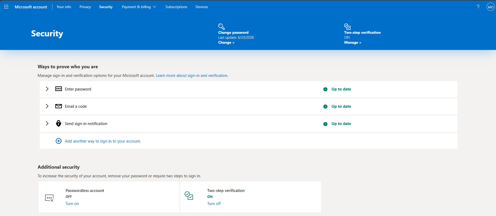

**Screenshot evidence:** The security overview confirms that account proofing methods are configured and up to date.

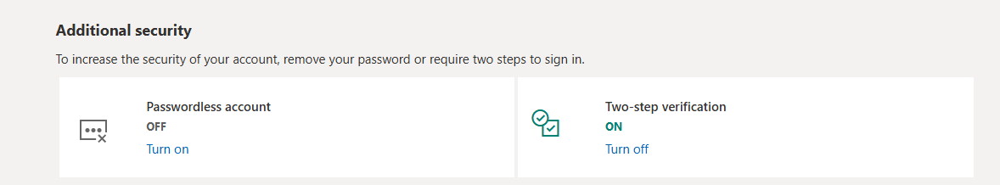

**Screenshot evidence:** Two-step verification is enabled for the dedicated MRTG account.


**Screenshot evidence:** Microsoft Authenticator sign-in notification is active and up to date.

---

### Step 2: Register the Azure Account

1. Opened the Azure account registration workflow.
2. Selected personal-use registration for the lab subscription.
3. Entered accurate profile, phone, and notification information.
4. Redacted personal information from documentation screenshots.
5. Completed the Azure registration process.
6. Confirmed access to the Azure welcome screen.

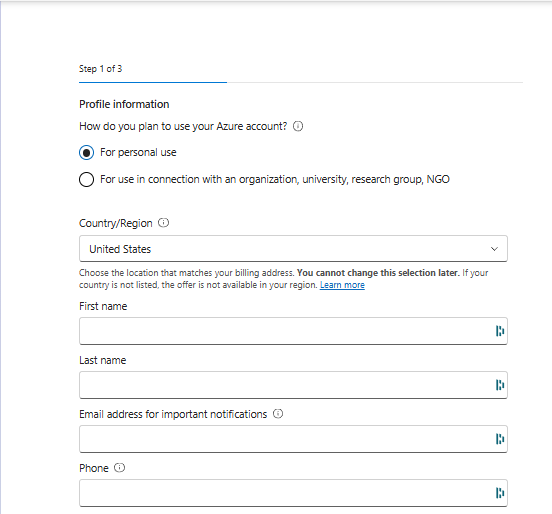

**Screenshot evidence:** Azure registration was started with personal fields redacted.

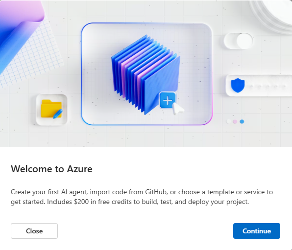

**Screenshot evidence:** Azure registration completed and the Azure welcome screen appeared.

---

### Step 3: Sign In to the Azure Portal

1. Opened the Azure portal.
2. Signed in with the dedicated MRTG Microsoft account.
3. Completed the required identity-verification challenge.
4. Confirmed that the Azure portal loaded successfully.
5. Verified that the account context displayed the MRTG lab environment.

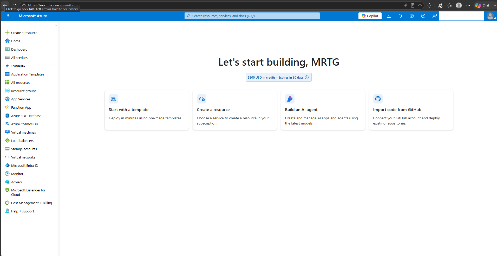

**Screenshot evidence:** The Azure portal home page confirms successful access to the MRTG Azure environment.

---

### Step 4: Validate the Azure Subscription

1. Searched for **Subscriptions** in the Azure portal.
2. Opened the subscription list.
3. Confirmed that one Azure subscription was available.
4. Confirmed that the subscription status was active.
5. Confirmed that the account role was Owner.
6. Redacted the subscription ID and directory details.

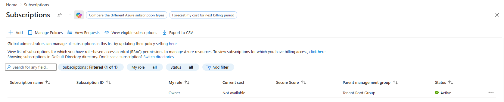

**Screenshot evidence:** The Azure subscription exists, the role is Owner, and the subscription status is Active.

---

### Step 5: Rename the Subscription

1. Opened the active Azure subscription.
2. Renamed the subscription to match the MRTG naming standard.
3. Confirmed that the updated name appeared in the subscription list.

```text
MRTG-AZ900-Lab-Subscription
```

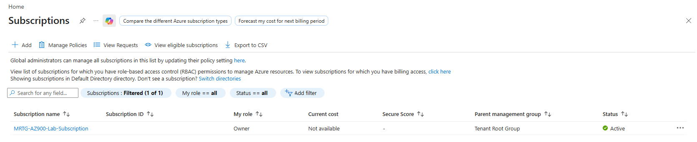

**Screenshot evidence:** The subscription was renamed to `MRTG-AZ900-Lab-Subscription` and remained active.

---

### Step 6: Review Free-Service and Credit Usage

1. Opened the subscription overview.
2. Reviewed spending rate and forecast.
3. Reviewed free-service usage.
4. Confirmed that no active resource usage was emitted yet.
5. Confirmed that Microsoft Defender for Cloud coverage was not upgraded.
6. Confirmed that the current cost and forecast both showed `0.00`.

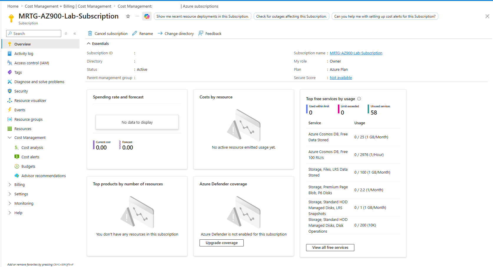

**Screenshot evidence:** The subscription overview showed current cost at `0.00`, forecast at `0.00`, available free services, no active resource usage, and no Defender upgrade enabled.

---

### Step 7: Review Cost Analysis

1. Opened **Cost Management**.
2. Selected **Cost analysis**.
3. Confirmed the scope was set to `MRTG-AZ900-Lab-Subscription`.
4. Attempted to load the current-month accumulated-cost view.
5. Observed that Cost Analysis was unavailable for this subscription view.
6. Documented the issue and continued using Cost Management overview and budget validation evidence.

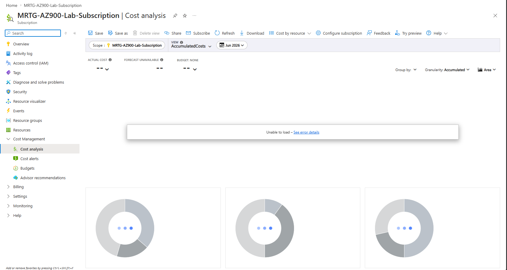

**Screenshot evidence:** Cost Analysis displayed an unavailable state, which was documented as a troubleshooting item.

---

### Step 8: Create the Monthly Budget

1. Opened **Budgets** under the subscription-level Cost Management scope.
2. Selected **Create budget**.
3. Entered the budget configuration.

```text
Budget name: mrtg-az900-monthly-budget
Reset period: Monthly
Budget amount: 10.00
Scope: MRTG-AZ900-Lab-Subscription
Creation date: 2026-06-01
Expiration date: 2028-05-31
```

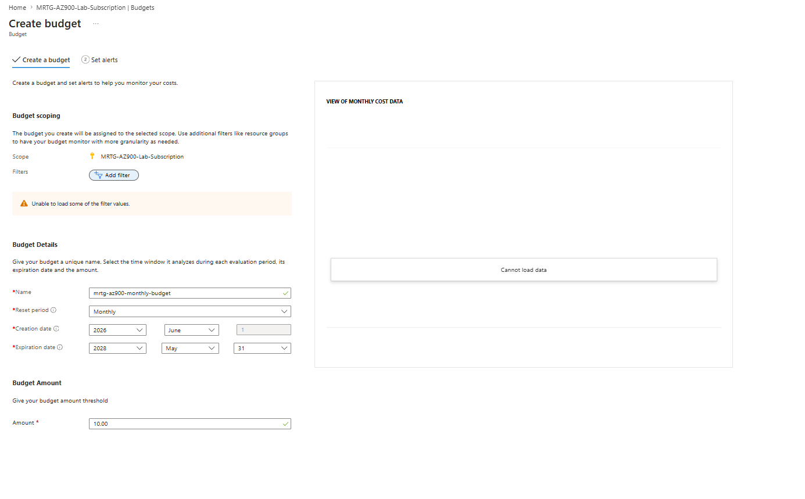

**Screenshot evidence:** The budget configuration shows a monthly budget named `mrtg-az900-monthly-budget` with a budget amount of `10.00`.

---

### Step 9: Configure Budget Alerts

1. Opened the budget alert configuration screen.
2. Added actual-cost alert thresholds.
3. Added a forecasted-cost alert threshold.
4. Added the alert recipient email address.
5. Redacted the recipient email address before documentation.

```text
Actual cost: 50 percent
Actual cost: 80 percent
Actual cost: 100 percent
Forecasted cost: 100 percent
```

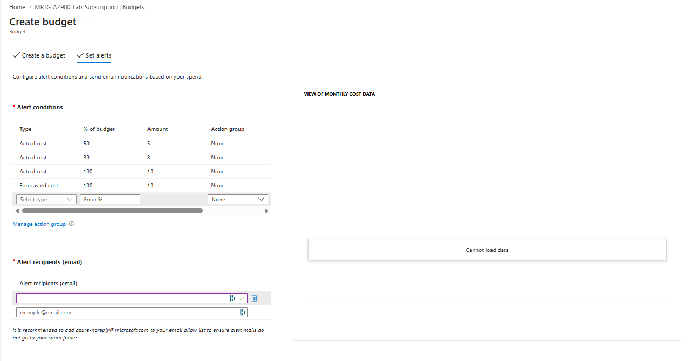

**Screenshot evidence:** The budget includes actual-cost alerts at 50, 80, and 100 percent, plus a forecasted-cost alert at 100 percent.

---

### Step 10: Validate Budget Creation

1. Created the budget.
2. Returned to the budget list.
3. Confirmed that the budget appeared under the MRTG subscription.
4. Confirmed that evaluated spend was `0`.
5. Confirmed that budget progress was `0.00%`.
6. Redacted the scope column where subscription identifiers could appear.

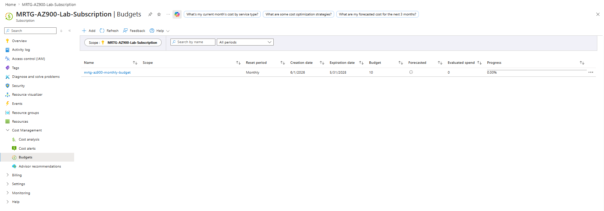

**Screenshot evidence:** The budget exists, is monthly, has a budget amount of `10`, evaluated spend is `0`, and progress is `0.00%`.

---

### Step 11: Create the First Resource Group

1. Opened **Resource groups**.
2. Selected **Create**.
3. Entered the resource group configuration.

```text
Subscription: MRTG-AZ900-Lab-Subscription
Resource group: rg-mrtg-az900-lab01-centralus-001
Region: Central US
```

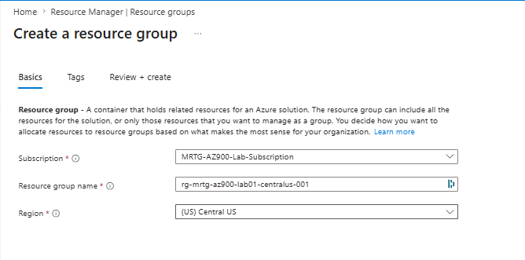

**Screenshot evidence:** The resource group configuration shows the correct subscription, resource group name, and region.

---

### Step 12: Apply Resource Group Tags

1. Opened the **Tags** tab during resource group creation.
2. Added all required MRTG tags.
3. Confirmed that tag names did not include trailing colons.
4. Confirmed that tag names used no spaces for `CostCenter` and `ManagedBy`.

```text
Project: MRTG-AZ900-The-Bridge
Lab: Lab-01
Environment: Lab
Owner: MRTG-Cloud-Operations
CostCenter: Training
ManagedBy: Azure-Portal
DeleteAfter: 2026-07-31
```

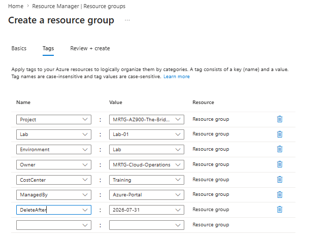

**Screenshot evidence:** The resource group was configured with the complete MRTG tag set before deployment.

---

### Step 13: Validate Resource Group Deployment Settings

1. Opened **Review + create**.
2. Reviewed the subscription, resource group name, and region.
3. Reviewed the full tag set.
4. Confirmed that the configuration was ready to create.
5. Created the resource group.

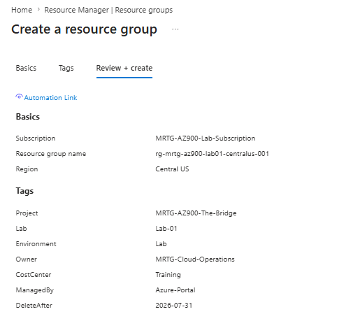

**Screenshot evidence:** The final deployment review shows the correct resource group settings and tag configuration.

---

### Step 14: Confirm Resource Group Creation

1. Opened the completed resource group.
2. Confirmed the resource group name.
3. Confirmed the subscription name.
4. Confirmed the location was Central US.
5. Confirmed that no deployments were listed.
6. Confirmed that no resources existed inside the resource group yet.
7. Redacted the subscription ID.

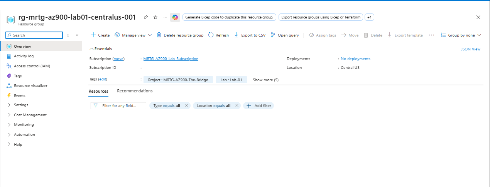

**Screenshot evidence:** The resource group exists in Central US, contains no deployed resources, and displays the expected MRTG tags.

---

### Step 15: Validate Tags After Deployment

1. Opened the Azure **Tags** view.
2. Confirmed that all seven MRTG tags were present.
3. Confirmed that the tag names matched the project standard.
4. Confirmed that the tag values matched the Lab 01 governance plan.

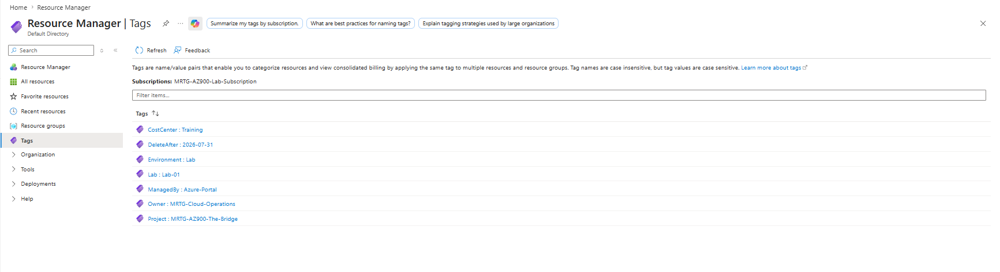

**Screenshot evidence:** The deployed resource group retained the full MRTG tag set.

---

### Step 16: Review the Activity Log

1. Opened the resource group **Activity log**.
2. Filtered activity to the Lab 01 resource group.
3. Confirmed that the resource group update operation succeeded.
4. Verified that Azure recorded the management operation.

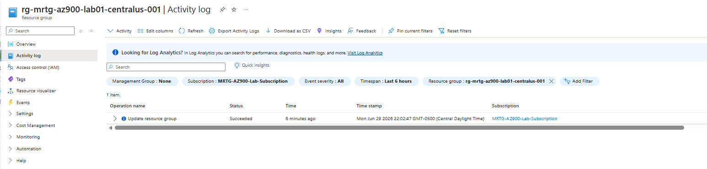

**Screenshot evidence:** The Activity Log shows a successful `Update resource group` operation for the Lab 01 resource group.

---

### Step 17: Perform Final Cost Protection Validation

1. Returned to the budget list.
2. Confirmed that the monthly budget still existed.
3. Confirmed that the budget amount was `10`.
4. Confirmed that evaluated spend was `0`.
5. Confirmed that budget progress was `0.00%`.
6. Confirmed that the resource group contained no billable workloads.


**Screenshot evidence:** Final cost-protection validation confirms that the budget exists and evaluated spend remains at `0`.

---

## Validation

| Validation Check | Expected Result | Observed Result | Status |
|---|---|---|---|
| Account access | MRTG account can access the Azure portal | Azure portal loaded successfully | Passed |
| Account security | Two-step verification and Authenticator are active | Two-step verification and sign-in notification were active | Passed |
| Subscription status | Azure subscription is active | Subscription status showed Active | Passed |
| Subscription role | MRTG account has administrative access | Role showed Owner | Passed |
| Subscription name | Standard MRTG subscription name is displayed | `MRTG-AZ900-Lab-Subscription` was displayed | Passed |
| Free-service usage | Free-service tracking is visible | Free-service usage panel was visible | Passed |
| Cost overview | Current cost and forecast are visible | Cost overview showed `0.00` current cost and forecast | Passed |
| Cost Analysis | Cost Analysis loads current-month data | Cost Analysis was unavailable | Documented |
| Budget | `$10.00` monthly budget exists | Budget was created successfully | Passed |
| Budget alerts | 50, 80, and 100 percent alerts exist | Actual and forecasted thresholds were configured | Passed |
| Resource group | Resource group exists in Central US | Resource group was created successfully | Passed |
| Tags | All seven MRTG tags are present | All required tags were validated | Passed |
| Activity Log | Resource group operation is recorded | Successful update operation was recorded | Passed |
| Final cost state | No unexpected spending is present | Evaluated spend showed `0` and progress showed `0.00%` | Passed |

---

## Completion Checklist

- [x] Dedicated MRTG account secured
- [x] Two-step verification enabled
- [x] Microsoft Authenticator configured
- [x] Azure registration completed
- [x] Azure portal access confirmed
- [x] Subscription status confirmed
- [x] Subscription renamed
- [x] Free-service usage reviewed
- [x] Cost Management overview reviewed
- [x] Cost Analysis issue documented
- [x] Monthly budget created
- [x] Budget thresholds configured
- [x] Resource group created
- [x] Required tags applied
- [x] Tags validated after deployment
- [x] Activity Log reviewed
- [x] Final cost validation completed
- [x] Screenshots sanitized and uploaded
- [x] No sensitive information committed

---

## AZ-900 Exam Objective Coverage

### Primary Exam Domain

```text
Describe Azure management and governance
```

### Secondary Exam Domain

```text
Describe Azure architecture and services
```

### Skills Measured

This lab supports the ability to:

- Describe Azure subscriptions
- Describe resource groups
- Describe the hierarchy of resource groups, subscriptions, and management groups
- Describe the purpose of Azure tags
- Describe Azure Cost Management capabilities
- Describe the purpose of budgets and alerts
- Describe factors that can affect costs in Azure
- Describe Azure management tools
- Describe the purpose of the Azure portal
- Describe the purpose of the Azure Activity Log

### How This Lab Supports the Objectives

This lab demonstrates that an Azure subscription is more than a billing account. It is also an access-control, governance, and resource-management boundary.

The lab provides practical exposure to:

- Subscription validation
- Subscription naming
- Cost Management review
- Budget configuration
- Budget alert thresholds
- Resource-group organization
- Resource tagging
- Azure portal navigation
- Azure Resource Manager scopes
- Administrative activity logging

---

## Mini Objective Coverage

By completing this lab, I can now:

- Describe the purpose of an Azure subscription
- Explain why subscriptions act as billing and access boundaries
- Describe the purpose of resource groups
- Explain how Azure tags support organization and cost reporting
- Use Azure Cost Management to review spending information
- Explain the difference between a budget alert and a spending limit
- Identify the role of the Azure portal
- Recognize the relationship between identity, subscription access, and governance
- Explain why cost controls should be established before workloads are deployed
- Document Azure portal issues without blocking the lab

---

## IAM / Security Relevance

This lab begins the Azure IAM lifecycle by securing the identity that controls the subscription.

The dedicated MRTG account acts as the initial administrative identity for the lab environment. Protecting this account is critical because access to the account can provide access to subscription resources, billing information, role assignments, and governance settings.

### On-Premises Connection

| On-Premises Concept | Azure Concept |
|---|---|
| Administrative user account | Azure administrative identity |
| Domain authentication | Microsoft account or Microsoft Entra authentication |
| Group-based authorization | Azure RBAC role assignments |
| Organizational unit | Resource group as a logical organization boundary |
| Group Policy | Azure Policy |
| Windows Event Log | Azure Activity Log |
| Delegated administration | Scoped Azure RBAC assignment |
| Security baseline | Subscription governance baseline |

### Security Analysis

- Authentication confirms the identity signing in to Azure.
- Authorization determines what the identity can perform.
- Subscription ownership provides extensive administrative control.
- Two-step verification reduces the risk of password-only compromise.
- Resource groups provide scopes for future role assignments.
- The Activity Log creates accountability for management operations.
- Tags provide ownership metadata but do not grant or deny access.
- Budget alerts help detect unexpected resource activity that could indicate misuse or misconfiguration.

### Sensitive Information Controls

The following information was redacted or avoided in screenshots:

- Passwords
- Authenticator QR codes
- Verification codes
- Recovery codes
- Payment-card information
- Billing addresses
- Phone numbers
- Backup email addresses
- Subscription IDs
- Tenant IDs
- Object IDs
- Request IDs
- Access tokens
- Security keys

---

## Governance Notes

### Governance Decisions

| Decision | Implementation | Reason |
|---|---|---|
| Account separation | Dedicated MRTG Microsoft account | Separates lab activity from personal cloud activity |
| Account protection | Two-step verification and Microsoft Authenticator | Reduces risk of account compromise |
| Subscription naming | `MRTG-AZ900-Lab-Subscription` | Clearly identifies the subscription purpose |
| Resource naming | MRTG naming convention | Improves consistency and resource identification |
| Resource organization | Dedicated Lab 01 resource group | Establishes a logical deployment and cleanup boundary |
| Primary region | `Central US` | Provides regional consistency across the lab series |
| Tagging | Seven standard MRTG tags | Supports ownership, reporting, and lifecycle tracking |
| Cost monitoring | Subscription-level Cost Management | Provides centralized spending visibility |
| Budget | `$10.00` monthly budget | Provides early notification of unexpected spending |
| Cleanup date | `2026-07-31` | Establishes a defined resource-review deadline |
| Audit review | Azure Activity Log | Confirms administrative operations |

### Tagging Limitation

Tags do not automatically inherit from a resource group to its resources unless Azure Policy or automation applies them.

Resources created in later labs must be checked individually for the required tags.

---

## Cost Considerations

### Potential Cost Factors

- Azure service selected
- Resource size and service tier
- Deployment region
- Runtime
- Storage capacity
- Data transfer
- Transactions
- Monitoring-data ingestion
- Backup and retention
- Premium security features
- Resources left deployed after a lab

### Cost Controls Applied

- Reviewed Cost Management before deploying workloads
- Reviewed free-service usage
- Created a `$10.00` monthly budget
- Configured multiple alert thresholds
- Reviewed budget progress after creation
- Created only an empty resource group
- Applied cost-ownership tags
- Added a cleanup date
- Avoided paid workloads during environment setup
- Avoided enabling optional premium services
- Confirmed Microsoft Defender for Cloud was not upgraded

### Budget Limitation

The Azure budget created in this lab:

- Monitors actual or forecasted costs
- Generates notifications when thresholds are reached
- Does not automatically stop resources
- Does not prevent spending
- Does not replace regular Cost Management reviews

### Estimated Lab Cost

```text
Estimated cost: $0.00
```

Creating an empty resource group and configuring a budget do not create a billable workload. Charges can begin when billable Azure resources or services are deployed.

---

## Troubleshooting Notes

### Issue 1: Cost Analysis Was Unavailable

**Symptom:**

Azure Cost Analysis displayed an `Unable to load` message.

**Likely Cause:**

The subscription offer type did not support the Cost Analysis view at the time of the lab, or the newly created subscription had not fully populated cost-analysis data yet.

**Resolution:**

The Cost Management overview and budget pages were used instead. The overview showed current cost as `0.00`, forecast as `0.00`, no active resource usage, and available free-service usage. The budget page confirmed that the budget existed, evaluated spend was `0`, and progress was `0.00%`.

**Result:**

The lab continued with budget configuration and resource-group creation.

---

### Issue 2: Budget Filter Values Did Not Fully Load

**Symptom:**

The budget creation page displayed a message stating that some filter values could not be loaded.

**Likely Cause:**

The Cost Management experience was partially unavailable for the newly created subscription or subscription offer type.

**Resolution:**

No filters were required for this lab. The budget was created at the subscription scope without additional filters.

**Result:**

The budget was created successfully.

---

### Issue 3: Tag Name Formatting Needed Correction

**Symptom:**

Initial tag names were entered with trailing colons.

**Likely Cause:**

The portal visually separates tag names and values with a colon, which made it easy to accidentally include the colon in the tag key.

**Resolution:**

The colons were removed from the tag names before creating the resource group.

**Result:**

The final tags were created with clean tag names:

```text
Project
Lab
Environment
Owner
CostCenter
ManagedBy
DeleteAfter
```

---

## What I Would Do Differently in Production

A production Azure environment would use additional controls, including:

- A verified organizational domain
- Microsoft Entra work accounts instead of a consumer Outlook account
- Separate administrator and standard-user identities
- Microsoft Entra groups for role assignments
- Least-privilege Azure RBAC
- Privileged Identity Management
- Conditional Access
- Emergency-access accounts
- Multiple subscriptions for workload separation
- Management groups
- Azure Policy enforcement
- Required-tag policies
- Automated tag inheritance
- Resource locks
- Centralized logging and alerting
- Formal billing ownership
- Department-level cost allocation
- Infrastructure as code
- Peer-reviewed deployments
- Formal change management
- Automated resource-cleanup workflows

The lab uses a simplified design because its purpose is foundational learning and AZ-900 preparation.

---

## Lessons Learned

- Azure governance should begin before workloads are deployed.
- A subscription is a billing, access-control, and governance boundary.
- Resource groups organize resources with a shared purpose or lifecycle.
- Tags provide useful metadata but do not enforce security.
- Budget alerts do not automatically stop Azure spending.
- Administrative identities require strong authentication protection.
- Cost and usage data may not appear immediately.
- Azure portal experiences can vary by subscription type.
- Consistent naming improves administration and documentation.
- Azure Activity Log provides evidence of management operations.
- Every deployed resource requires an ownership and cleanup plan.

### Technical Takeaway

Azure Resource Manager organizes resources through scopes that include management groups, subscriptions, resource groups, and individual resources.

### Business Takeaway

Establishing cost visibility, ownership, and organizational standards early reduces financial and operational risk.

### Security Takeaway

The identity controlling an Azure subscription must be protected because account compromise can expose resources, permissions, governance settings, and billing information.

### Exam Takeaway

For AZ-900, remember:

- Subscriptions are billing and access boundaries.
- Resource groups organize related resources.
- Tags provide metadata.
- Cost Management provides spending visibility, budgets, and alerts.
- Budgets do not stop resources or enforce a hard spending cap.

---

## Cleanup

### Resources Retained

| Resource or Configuration | Reason |
|---|---|
| MRTG Azure subscription | Required for the remaining labs |
| Monthly budget | Required for ongoing cost monitoring |
| MRTG naming standard | Required for project consistency |
| MRTG tagging standard | Required for governance and cost tracking |
| `rg-mrtg-az900-lab01-centralus-001` | Retained as the foundational Lab 01 resource group |

### Resources Removed

No billable Azure workloads were created during this lab.

### Cleanup Validation

- [x] No unexpected Azure resources are running
- [x] No unattached disks exist
- [x] No unused public IP addresses exist
- [x] No premium services were unintentionally enabled
- [x] The subscription budget remains active
- [x] Budget progress shows `0.00%`
- [x] Cost Management was reviewed
- [x] Sensitive registration information was not committed
- [x] All screenshots were sanitized

---

## Outcome

This lab established the security, cost-management, naming, tagging, and resource-organization foundation for the MRTG Azure Fundamentals series.

The completed environment includes:

- A protected MRTG cloud-operations account
- Two-step verification
- Microsoft Authenticator sign-in notification
- An active Azure subscription
- A standardized subscription name
- Free-service usage visibility
- A `$10.00` monthly budget
- Actual-cost alert thresholds
- Forecasted-cost alert threshold
- A documented naming convention
- A documented tagging standard
- A governed Azure resource group
- A validated tag set
- An initial administrative audit trail
- A verified zero-workload cost state

---

## Screenshot Inventory

| Screenshot | Description |
|---|---|
| `01-microsoft-account-security-overview.png` | Microsoft account security overview |
| `02-two-step-verification-enabled.png` | Two-step verification enabled |
| `03-authenticator-method-confirmed.png` | Microsoft Authenticator sign-in notification confirmed |
| `04-azure-account-registration-started.png` | Azure registration started with sensitive fields redacted |
| `05-azure-account-registration-completed.png` | Azure welcome screen after registration |
| `06-azure-portal-signed-in.png` | Azure portal signed in |
| `07-active-azure-subscription.png` | Active Azure subscription confirmed |
| `08-subscription-renamed.png` | Subscription renamed to MRTG standard |
| `09-free-service-usage-overview.png` | Free-service usage and current cost overview |
| `10-cost-analysis-unavailable.png` | Cost Analysis unavailable state documented |
| `11-budget-configuration.png` | Monthly budget configuration |
| `12-budget-alerts-configured.png` | Budget alert thresholds configured |
| `13-budget-created.png` | Budget successfully created |
| `14-resource-group-configuration.png` | Resource group creation settings |
| `15-resource-group-tags.png` | Resource group tags configured |
| `16-resource-group-validation-passed.png` | Resource group review and create page |
| `17-resource-group-created.png` | Resource group created |
| `18-resource-group-tags-validated.png` | Tags validated after deployment |
| `19-resource-group-activity-log.png` | Activity Log operation reviewed |
| `20-final-cost-protection-validation.png` | Final budget and cost-protection validation |

---

## Next Lab

The next lab is:

```text
Lab 02 - Cloud Computing and Shared Responsibility
```

The next lab will build on this foundation by examining:

- Cloud computing concepts
- The shared-responsibility model
- Consumption-based pricing
- Serverless computing
- Customer and provider responsibilities across cloud service models
