# Lab 01 - Azure Environment and Cost Protection

## Objective

Establish a secure, organized, governed, and cost-conscious Microsoft Azure lab environment for the **MRTG Azure Fundamentals: The Bridge** project.

By completing this lab, I:

- Secured the dedicated MRTG Microsoft account
- Activated and validated an Azure subscription
- Reviewed Azure credit and free-service usage
- Established subscription-level cost visibility
- Created a monthly Azure budget
- Configured budget notification thresholds
- Defined resource naming and tagging standards
- Created the first governed Azure resource group
- Validated tags, administrative activity, and cost-protection controls

This lab established the foundation required for the remaining Azure Fundamentals labs.

---

## Business Problem Solved

Cloud resources can be deployed quickly, but an unmanaged Azure environment can create security, ownership, governance, and financial risk.

Monroe Redstone Technology Group needed an Azure foundation that:

- Protects the primary administrative identity
- Provides visibility into cloud spending
- Establishes a budget before workloads are deployed
- Identifies resource ownership and purpose
- Uses consistent naming and tagging standards
- Separates lab resources from unrelated environments
- Supports reliable auditing and cleanup
- Reduces the risk of unexpected Azure charges

This lab established those controls before deploying compute, networking, storage, identity, governance, or monitoring workloads.

---

## Scenario

Monroe Redstone Technology Group is beginning its adoption of Microsoft Azure.

Before evaluating Azure compute, networking, storage, identity, governance, and monitoring services, MRTG must establish a controlled Azure environment.

The organization must:

- Secure its dedicated cloud-operations account
- Confirm that its Azure subscription is active
- Configure cost monitoring and budget notifications
- Establish naming and tagging standards
- Create an organized resource group structure
- Verify that no unexpected billable resources are running
- Document any issues encountered during setup

The completed environment supports the remaining labs in the AZ-900 series.

---

## Azure Services and Resources Used

| Azure Service, Resource, or Feature | Purpose |
|---|---|
| Microsoft account security | Protected the administrative account used for Azure access |
| Microsoft Authenticator | Provided additional sign-in verification |
| Azure Portal | Provided the browser-based Azure management interface |
| Azure Subscription | Established the billing, access-control, governance, and resource-management boundary |
| Azure Cost Management | Provided cost visibility, budgets, notifications, and spending review |
| Azure Budgets | Established monthly spending thresholds and email notifications |
| Azure Resource Manager | Provided the Azure resource deployment and management hierarchy |
| Azure Resource Group | Organized related Azure resources by purpose and lifecycle |
| Azure Tags | Added ownership, project, environment, and cleanup metadata |
| Azure Activity Log | Recorded subscription and resource management operations |

---

## Why These Services Were Used

### Microsoft Account Security

The dedicated MRTG Microsoft account is the identity used to access the Azure lab environment.

It was secured first because:

- Administrative identity is the starting point for cloud access
- Account compromise could expose Azure resources and billing information
- Two-step verification reduces password-only risk
- Microsoft Authenticator provides an additional verification method
- Recovery methods help reduce the risk of account lockout

### Azure Portal

The Azure Portal provides a graphical management interface for creating, reviewing, and administering Azure resources.

It was selected because:

- It supports visual exploration of Azure services
- It is appropriate for foundational AZ-900 labs
- It exposes subscription, governance, and Cost Management features
- It provides immediate configuration and validation feedback

### Azure Subscription

An Azure subscription provides:

- A billing boundary
- An access-control scope
- A resource-deployment boundary
- A Cost Management scope
- A governance scope

The dedicated lab subscription separates MRTG training activity from unrelated Azure environments.

### Azure Cost Management

Azure Cost Management provides visibility into Azure usage and estimated spending.

It was selected to:

- Establish a cost baseline
- Review free-service usage
- Create a monthly budget
- Configure notification thresholds
- Identify unexpected charges
- Support cost-conscious deployment decisions

Azure budgets provide notifications. They do not automatically stop resources or prevent charges.

### Azure Resource Group

Resource groups provide logical containers for resources that share a common purpose or lifecycle.

The first resource group established:

- A consistent naming pattern
- A defined deployment location
- A common governance scope
- A centralized cleanup boundary
- A foundation for later lab resources

### Azure Tags

Tags provide key-value metadata for Azure resources and resource groups.

They were selected to support:

- Project identification
- Lab identification
- Environment classification
- Ownership
- Cost allocation
- Management-method tracking
- Cleanup scheduling

Tags do not provide access control and do not replace Azure RBAC, Azure Policy, or resource locks.

### Azure Activity Log

The Azure Activity Log records administrative operations performed against Azure resources and subscriptions.

It was reviewed to:

- Confirm that the resource group operation succeeded
- Validate that Azure recorded the management event
- Demonstrate basic operational auditing
- Establish evidence for troubleshooting and accountability

---

## Environment

| Item | Value |
|---|---|
| Organization | Monroe Redstone Technology Group |
| Project | MRTG Azure Fundamentals: The Bridge |
| Lab | Lab 01 - Azure Environment and Cost Protection |
| Cloud Platform | Microsoft Azure |
| Management Interface | Azure Portal |
| Administrative Identity | Dedicated MRTG cloud-operations account |
| Account Display Name | MRTG Cloud Operations |
| Authentication Protection | Microsoft Authenticator and two-step verification |
| Subscription | `MRTG-AZ900-Lab-Subscription` |
| Primary Region | `Central US` |
| Environment | Lab |
| Monthly Budget | `$10.00` |
| Resource Group | `rg-mrtg-az900-lab01-centralus-001` |
| Documentation Platform | GitHub |
| Learning Platform | Microsoft Learn |
| Estimated Cost | `$0.00` |

### Resource Naming Convention

```text
<resource-type>-<organization>-<project>-<lab>-<region>-<instance>
```

### Resource Group Name

```text
rg-mrtg-az900-lab01-centralus-001
```

### Required Tags

| Tag | Value |
|---|---|
| `Project` | `MRTG-AZ900-The-Bridge` |
| `Lab` | `Lab-01` |
| `Environment` | `Lab` |
| `Owner` | `MRTG-Cloud-Operations` |
| `CostCenter` | `Training` |
| `ManagedBy` | `Azure-Portal` |
| `DeleteAfter` | `2026-07-31` |

---

## Architecture / Concept Diagram

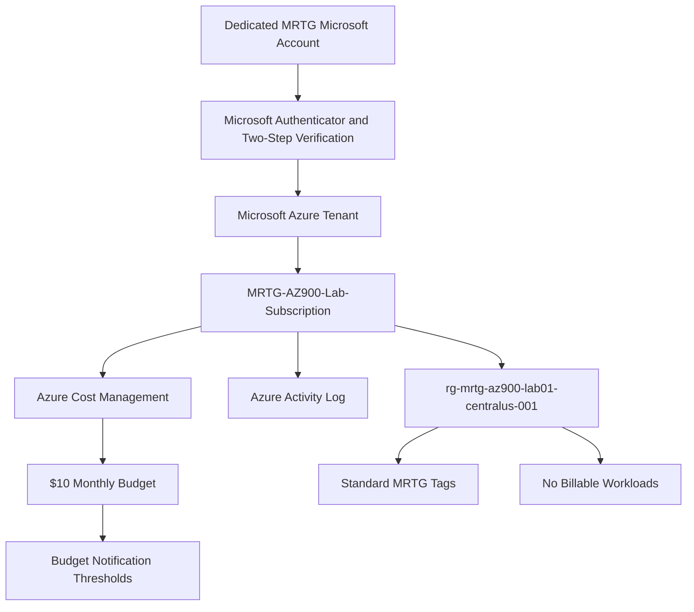
```mermaid
flowchart TD
    Account[Dedicated MRTG Microsoft Account]
    Auth[Microsoft Authenticator and Two-Step Verification]
    Tenant[Microsoft Azure Tenant]
    Subscription[MRTG-AZ900-Lab-Subscription]
    Cost[Azure Cost Management]
    Budget[$10 Monthly Budget]
    Alerts[Budget Notification Thresholds]
    Activity[Azure Activity Log]
    RG[rg-mrtg-az900-lab01-centralus-001]
    Tags[Standard MRTG Tags]
    Resources[No Billable Workloads]

    Account --> Auth
    Auth --> Tenant
    Tenant --> Subscription

    Subscription --> Cost
    Cost --> Budget
    Budget --> Alerts

    Subscription --> Activity
    Subscription --> RG

    RG --> Tags
    RG --> Resources
```

---

## Steps Performed

### Step 1: Secure the Dedicated Microsoft Account

1. Signed in to the dedicated MRTG Microsoft account.
2. Opened the Microsoft account security settings.
3. Confirmed that security verification methods were configured.
4. Confirmed that two-step verification was enabled.
5. Confirmed that Microsoft Authenticator sign-in notifications were active.
6. Confirmed that passwordless account mode remained disabled for this lab.
7. Verified that sensitive recovery information was not exposed in the documentation.

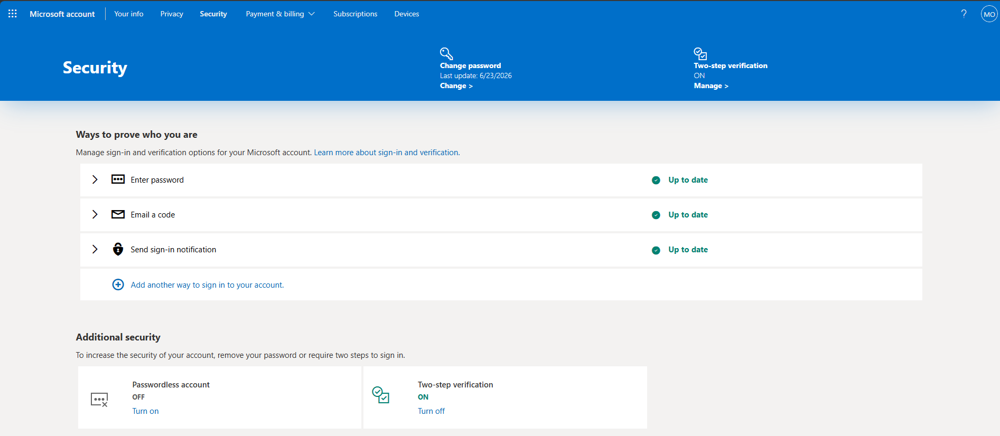

**Validation:** The security overview confirmed that account verification methods were configured and current.

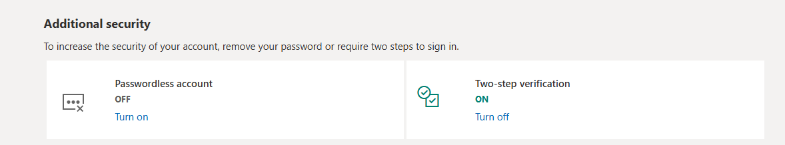

**Validation:** Two-step verification was enabled for the dedicated MRTG account.


**Validation:** Microsoft Authenticator sign-in notification was active and current.

---

### Step 2: Register the Azure Account

1. Opened the Azure account registration workflow.
2. Selected personal-use registration for the lab subscription.
3. Entered the required profile, phone, and notification information.
4. Redacted personal information from documentation screenshots.
5. Completed the Azure registration process.
6. Confirmed access to the Azure welcome screen.

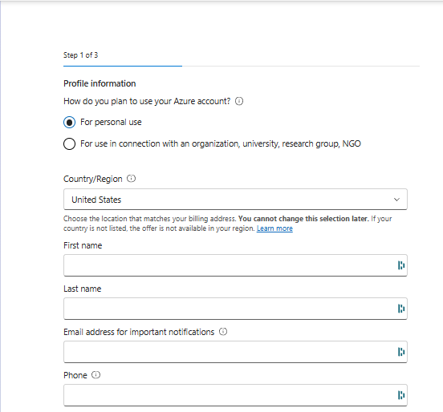

**Validation:** Azure registration was started with personal fields redacted.

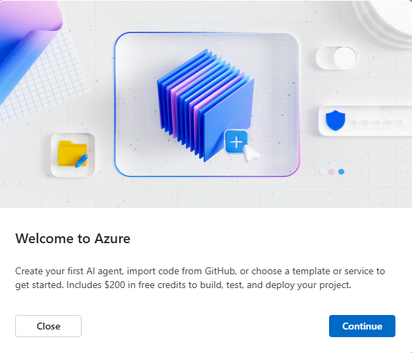

**Validation:** Azure registration completed and the Azure welcome screen appeared.

---

### Step 3: Sign In to the Azure Portal

1. Opened the Azure Portal.
2. Signed in with the dedicated MRTG Microsoft account.
3. Completed the required identity verification.
4. Confirmed that the Azure Portal loaded successfully.
5. Verified that the account context displayed the MRTG lab environment.

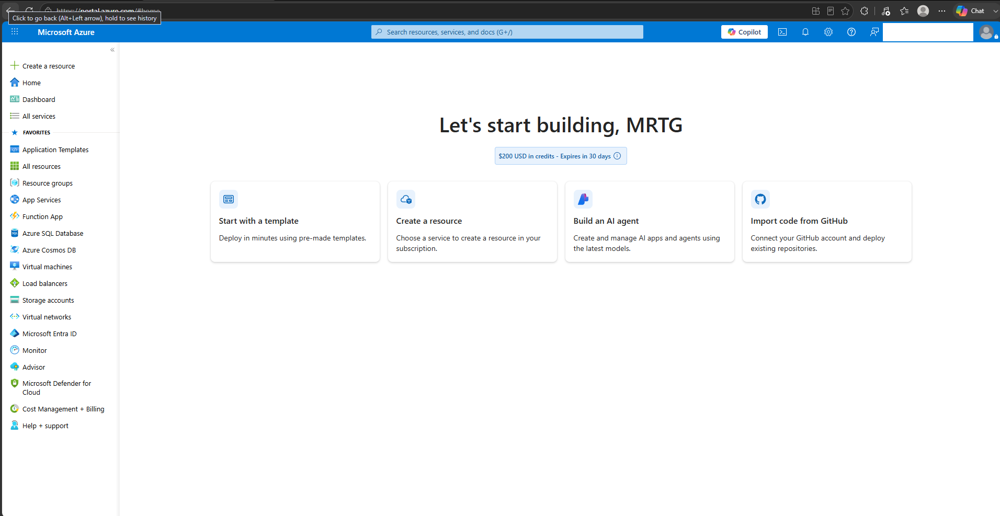

**Validation:** The Azure Portal home page confirmed successful access to the MRTG Azure environment.

---

### Step 4: Validate the Azure Subscription

1. Searched for **Subscriptions** in the Azure Portal.
2. Opened the subscription list.
3. Confirmed that one Azure subscription was available.
4. Confirmed that the subscription status was Active.
5. Confirmed that the account role was Owner.
6. Redacted the subscription ID and directory details.

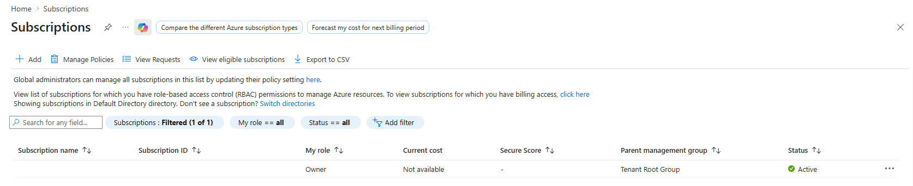

**Validation:** The subscription existed, the role was Owner, and the subscription status was Active.

---

### Step 5: Rename the Subscription

1. Opened the active Azure subscription.
2. Renamed the subscription to match the MRTG naming standard.
3. Confirmed that the updated name appeared in the subscription list.

```text
MRTG-AZ900-Lab-Subscription
```

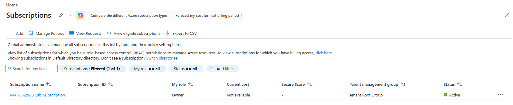

**Validation:** The subscription was renamed to `MRTG-AZ900-Lab-Subscription` and remained Active.

---

### Step 6: Review Free-Service and Credit Usage

1. Opened the subscription overview.
2. Reviewed the spending rate and forecast.
3. Reviewed free-service usage.
4. Confirmed that no active resource usage was present.
5. Confirmed that Microsoft Defender for Cloud coverage was not upgraded.
6. Confirmed that the current cost and forecast both displayed `0.00`.

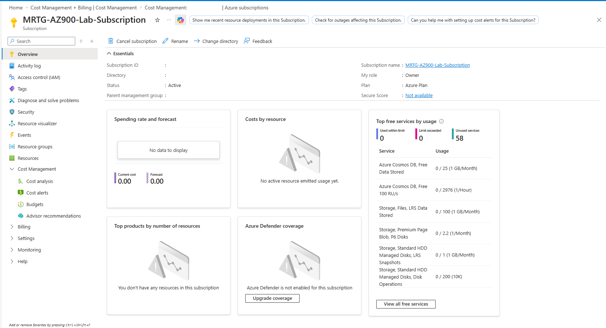

**Validation:** The subscription overview showed current cost at `0.00`, forecast at `0.00`, available free services, no active resource usage, and no Defender upgrade enabled.

---

### Step 7: Review Cost Analysis

1. Opened **Cost Management**.
2. Selected **Cost Analysis**.
3. Confirmed that the scope was set to `MRTG-AZ900-Lab-Subscription`.
4. Attempted to load the current-month accumulated-cost view.
5. Observed that Cost Analysis was unavailable in the selected subscription view.
6. Documented the issue.
7. Continued using the Cost Management overview and budget pages for cost validation.

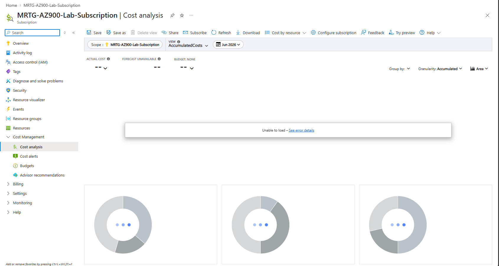

**Validation:** Cost Analysis displayed an unavailable state, and the limitation was documented without blocking the lab.

---

### Step 8: Create the Monthly Budget

1. Opened **Budgets** under the subscription-level Cost Management scope.
2. Selected **Create budget**.
3. Entered the budget configuration.

```text
Budget name: mrtg-az900-monthly-budget
Reset period: Monthly
Budget amount: 10.00
Scope: MRTG-AZ900-Lab-Subscription
Creation date: 2026-06-01
Expiration date: 2028-05-31
```

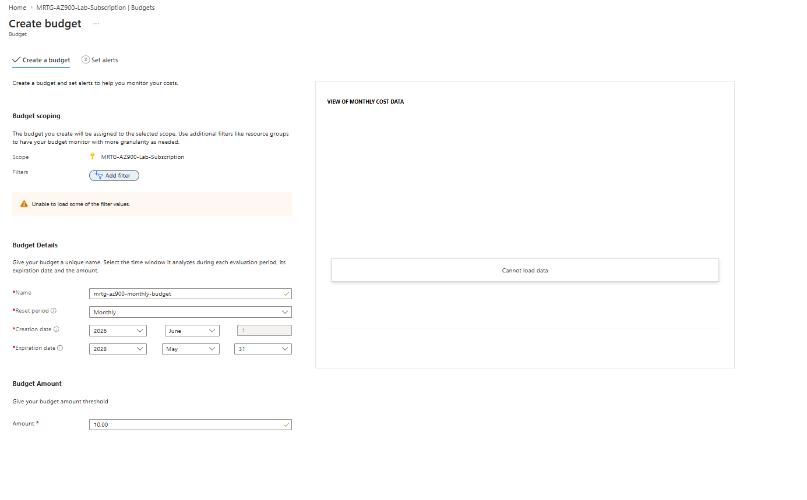

**Validation:** The configuration showed a monthly budget named `mrtg-az900-monthly-budget` with a budget amount of `$10.00`.

---

### Step 9: Configure Budget Notifications

1. Opened the budget notification configuration.
2. Added actual-cost notification thresholds.
3. Added a forecasted-cost notification threshold.
4. Added the recipient email address.
5. Redacted the recipient email address before publishing the screenshot.

```text
Actual cost: 50 percent
Actual cost: 80 percent
Actual cost: 100 percent
Forecasted cost: 100 percent
```

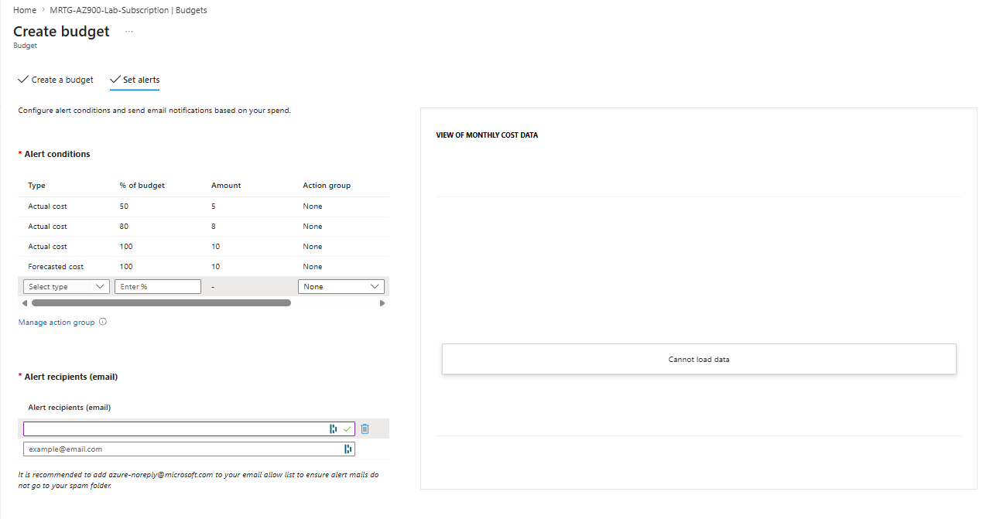

**Validation:** The budget included actual-cost thresholds at 50, 80, and 100 percent and a forecasted-cost threshold at 100 percent.

---

### Step 10: Validate Budget Creation

1. Created the budget.
2. Returned to the budget list.
3. Confirmed that the budget appeared under the MRTG subscription.
4. Confirmed that evaluated spend was `0`.
5. Confirmed that budget progress was `0.00%`.
6. Redacted the scope column where subscription identifiers could appear.

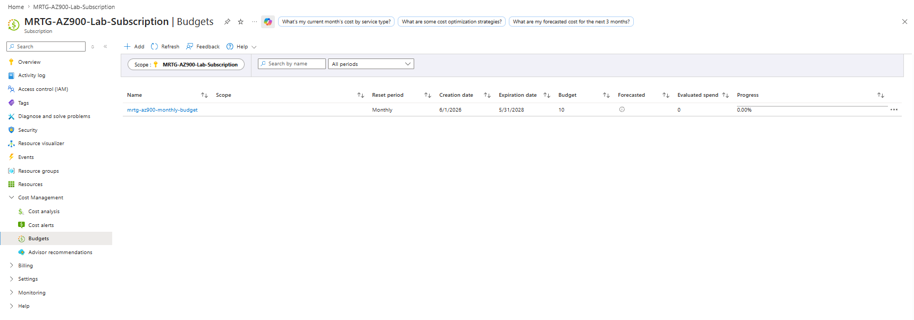

**Validation:** The monthly budget existed with a `$10.00` amount, `0` evaluated spend, and `0.00%` progress.

---

### Step 11: Create the First Resource Group

1. Opened **Resource groups**.
2. Selected **Create**.
3. Entered the resource group configuration.

```text
Subscription: MRTG-AZ900-Lab-Subscription
Resource group: rg-mrtg-az900-lab01-centralus-001
Region: Central US
```

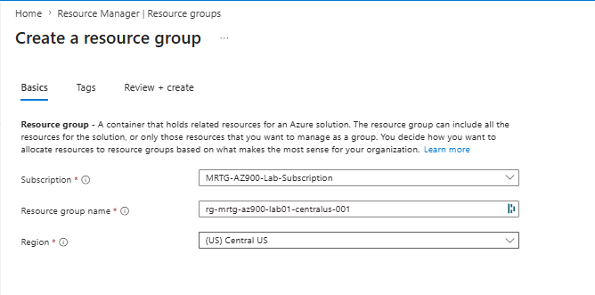

**Validation:** The resource group configuration showed the correct subscription, name, and region.

---

### Step 12: Apply Resource Group Tags

1. Opened the **Tags** tab during resource group creation.
2. Added all required MRTG tags.
3. Confirmed that tag names did not include trailing colons.
4. Confirmed that `CostCenter` and `ManagedBy` contained no spaces.

```text
Project: MRTG-AZ900-The-Bridge
Lab: Lab-01
Environment: Lab
Owner: MRTG-Cloud-Operations
CostCenter: Training
ManagedBy: Azure-Portal
DeleteAfter: 2026-07-31
```

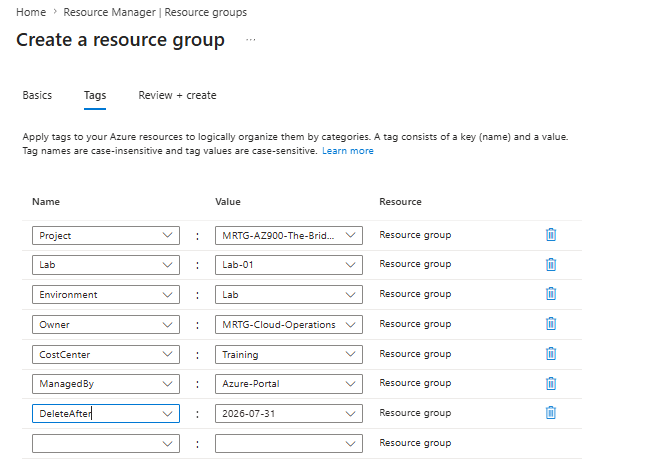

**Validation:** The resource group was configured with the complete MRTG tag set before deployment.

---

### Step 13: Validate Resource Group Deployment Settings

1. Opened **Review + create**.
2. Reviewed the subscription, resource group name, and region.
3. Reviewed the complete tag set.
4. Confirmed that validation passed.
5. Created the resource group.

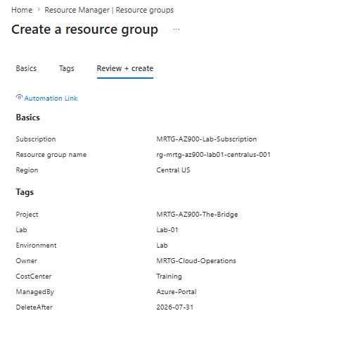

**Validation:** The final deployment review showed the correct resource group settings and tag configuration.

---

### Step 14: Confirm Resource Group Creation

1. Opened the completed resource group.
2. Confirmed the resource group name.
3. Confirmed the subscription name.
4. Confirmed that the location was Central US.
5. Confirmed that no deployments were listed.
6. Confirmed that no workload resources existed inside the resource group.
7. Redacted the subscription ID.

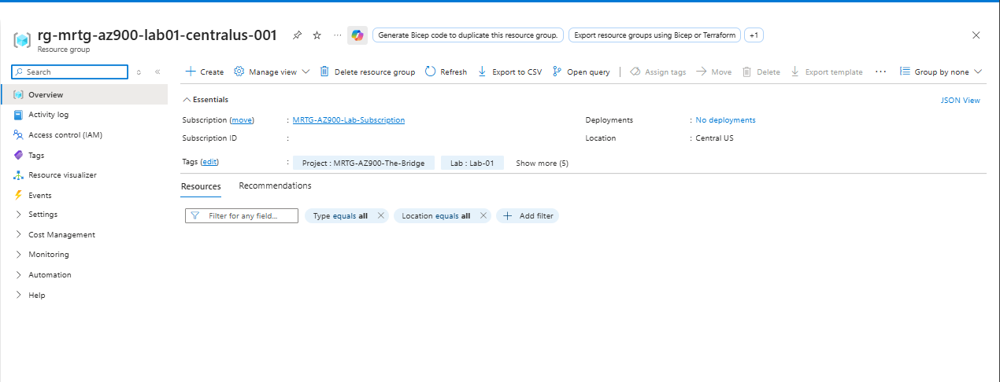

**Validation:** The resource group existed in Central US, contained no deployed workload resources, and displayed the expected MRTG tags.

---

### Step 15: Validate Tags After Deployment

1. Opened the Azure **Tags** view.
2. Confirmed that all seven MRTG tags were present.
3. Confirmed that the tag names matched the project standard.
4. Confirmed that the tag values matched the Lab 01 governance plan.

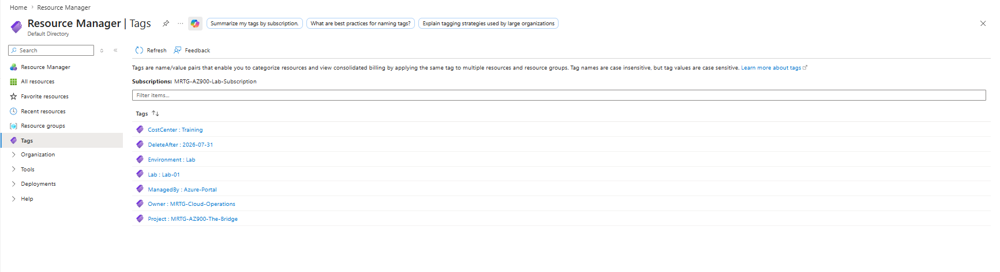

**Validation:** The deployed resource group retained the complete MRTG tag set.

---

### Step 16: Review the Azure Activity Log

1. Opened the resource group **Activity Log**.
2. Filtered activity to the Lab 01 resource group.
3. Confirmed that the resource group update operation succeeded.
4. Verified that Azure recorded the management operation.

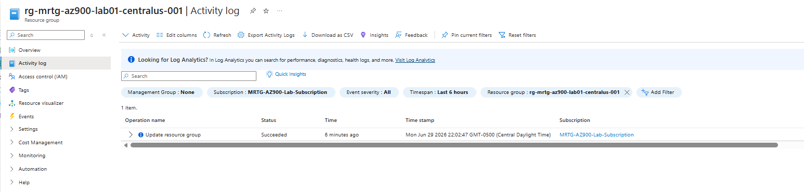

**Validation:** The Activity Log showed a successful `Update resource group` operation for the Lab 01 resource group.

---

### Step 17: Perform Final Cost-Protection Validation

1. Returned to the budget list.
2. Confirmed that the monthly budget still existed.
3. Confirmed that the budget amount was `$10.00`.
4. Confirmed that evaluated spend was `$0.00`.
5. Confirmed that budget progress was `0.00%`.
6. Confirmed that the resource group contained no billable workloads.


**Validation:** The final review confirmed that the monthly budget remained active and evaluated spend remained at `$0.00`.

---

## Validation

| Validation Item | Expected Result | Actual Result |
|---|---|---|
| Account access | MRTG account can access the Azure Portal | Passed |
| Account security | Two-step verification and Microsoft Authenticator are active | Passed |
| Azure registration | Registration completes successfully | Passed |
| Subscription status | Subscription is Active | Passed |
| Subscription role | MRTG identity has Owner access | Passed |
| Subscription name | Standard MRTG subscription name is displayed | Passed |
| Free-service usage | Free-service tracking is visible | Passed |
| Cost overview | Current cost and forecast are visible | Passed |
| Cost Analysis | Cost Analysis loads current-month information | Documented limitation |
| Monthly budget | `$10.00` monthly budget exists | Passed |
| Budget notifications | Required actual and forecast thresholds exist | Passed |
| Resource group | Resource group exists in Central US | Passed |
| Tags | All seven MRTG tags are present | Passed |
| Activity Log | Resource group operation is recorded | Passed |
| Final cost state | No unexpected spending is present | Passed |
| Billable workloads | No billable workloads are deployed | Passed |

---

## Completion Checklist

- [x] Dedicated MRTG account secured
- [x] Two-step verification enabled
- [x] Microsoft Authenticator configured
- [x] Azure registration completed
- [x] Azure Portal access confirmed
- [x] Subscription status confirmed
- [x] Subscription role confirmed
- [x] Subscription renamed
- [x] Free-service usage reviewed
- [x] Cost Management overview reviewed
- [x] Cost Analysis limitation documented
- [x] Monthly budget created
- [x] Budget notification thresholds configured
- [x] Resource group created
- [x] Required tags applied
- [x] Tags validated after deployment
- [x] Azure Activity Log reviewed
- [x] Final cost validation completed
- [x] Screenshots sanitized
- [x] No sensitive information committed
- [x] No billable workload resources deployed

---

## AZ-900 Exam Objective Coverage

### Primary Exam Domain

```text
Describe Azure management and governance
```

### Secondary Exam Domain

```text
Describe Azure architecture and services
```

### Skills Measured

This lab supports the ability to:

- Describe Azure subscriptions
- Describe Azure resource groups
- Describe the hierarchy of resources, resource groups, subscriptions, and management groups
- Describe the purpose of Azure tags
- Describe Azure Cost Management capabilities
- Describe the purpose of budgets and notifications
- Describe factors that can affect Azure costs
- Describe Azure management tools
- Describe the purpose of the Azure Portal
- Describe the purpose of the Azure Activity Log

### How This Lab Supports the Objectives

This lab demonstrated that an Azure subscription is more than a billing account. It is also an access-control, governance, Cost Management, and resource-management boundary.

The lab provided practical exposure to:

- Subscription validation
- Subscription naming
- Cost Management review
- Budget configuration
- Budget notification thresholds
- Resource group organization
- Resource tagging
- Azure Portal navigation
- Azure Resource Manager scopes
- Administrative activity logging

---

## Mini Objective Coverage

By completing this lab, I can:

- Describe the purpose of an Azure subscription
- Explain why subscriptions act as billing and access boundaries
- Describe the purpose of Azure resource groups
- Explain how Azure tags support organization and cost reporting
- Use Azure Cost Management to review spending information
- Explain the difference between a budget notification and a spending limit
- Identify the role of the Azure Portal
- Recognize the relationship between identity, subscription access, and governance
- Explain why cost controls should be established before workloads are deployed
- Document Azure Portal issues without blocking a project

---

## IAM / Security Relevance

This lab begins the Azure IAM lifecycle by securing the identity that controls the subscription.

The dedicated MRTG account acts as the initial administrative identity for the lab environment. Protecting this account is critical because access to the identity can provide access to subscription resources, billing information, role assignments, and governance settings.

### On-Premises Connection

| On-Premises Concept | Azure Concept |
|---|---|
| Administrative user account | Azure administrative identity |
| Domain authentication | Microsoft account or Microsoft Entra authentication |
| Group-based authorization | Azure RBAC role assignments |
| Organizational unit | Resource group as a logical organization boundary |
| Group Policy | Azure Policy |
| Windows Event Log | Azure Activity Log |
| Delegated administration | Scoped Azure RBAC assignment |
| Security baseline | Subscription governance baseline |

### Security Analysis

- Authentication confirms the identity signing in to Azure.
- Authorization determines what the identity can perform.
- Subscription ownership provides extensive administrative control.
- Two-step verification reduces the risk of password-only compromise.
- Resource groups provide scopes for future Azure RBAC assignments.
- The Azure Activity Log creates accountability for management operations.
- Tags provide ownership metadata but do not grant or deny access.
- Budget notifications can help identify unexpected resource activity or misconfiguration.

### Sensitive Information Controls

The following information was redacted or avoided in screenshots:

- Passwords
- Authenticator QR codes
- Verification codes
- Recovery codes
- Payment-card information
- Billing addresses
- Phone numbers
- Recovery email addresses
- Subscription IDs
- Tenant IDs
- Directory names
- `onmicrosoft.com` domains
- Object IDs
- Principal IDs
- Request IDs
- Correlation IDs
- Access tokens
- Security keys

---

## Governance Notes

### Governance Decisions

| Decision | Implementation | Reason |
|---|---|---|
| Account separation | Dedicated MRTG Microsoft account | Separated lab activity from personal cloud activity |
| Account protection | Two-step verification and Microsoft Authenticator | Reduced the risk of account compromise |
| Subscription naming | `MRTG-AZ900-Lab-Subscription` | Clearly identified the subscription purpose |
| Resource naming | MRTG naming convention | Improved consistency and resource identification |
| Resource organization | Dedicated Lab 01 resource group | Established a logical deployment and cleanup boundary |
| Primary region | `Central US` | Established regional consistency |
| Tagging | Seven standard MRTG tags | Supported ownership, reporting, and lifecycle tracking |
| Cost monitoring | Subscription-level Azure Cost Management | Provided centralized spending visibility |
| Monthly budget | `$10.00` | Provided early notification of unexpected spending |
| Cleanup date | `2026-07-31` | Established a defined resource-review deadline |
| Audit review | Azure Activity Log | Confirmed that administrative operations were recorded |

### Tagging Limitation

Tags do not automatically inherit from a resource group to its resources unless Azure Policy or automation applies them.

Resources created in later labs must be reviewed individually for the required tags.

### Subscription Scope

The subscription provides a governance boundary for:

- Azure RBAC
- Azure Policy
- Cost Management
- Budgets
- Resource deployment
- Activity logging
- Resource organization

---

## Cost Considerations

### Potential Cost Factors

- Azure service selected
- Resource size and service tier
- Deployment region
- Runtime
- Storage capacity
- Data transfer
- Transactions
- Monitoring data ingestion
- Backup and retention
- Premium security features
- Resources left deployed after a lab

### Cost Controls Applied

- Reviewed Cost Management before deploying workloads
- Reviewed free-service usage
- Created a `$10.00` monthly budget
- Configured multiple notification thresholds
- Reviewed budget progress after creation
- Created only an empty resource group
- Applied cost-ownership tags
- Added a cleanup date
- Avoided paid workloads during environment setup
- Avoided enabling optional premium services
- Confirmed that Microsoft Defender for Cloud was not upgraded

### Budget Limitation

The Azure budget created in this lab:

- Monitors actual or forecasted costs
- Generates notifications when thresholds are reached
- Does not automatically stop resources
- Does not prevent spending
- Does not replace regular Cost Management reviews

### Estimated Lab Cost

```text
Estimated cost: $0.00
```

Creating an empty resource group and configuring a budget do not create billable workloads. Charges can begin when billable Azure resources or services are deployed.

---

## Troubleshooting Notes

### Issue 1: Cost Analysis Was Unavailable

**Symptom**

Azure Cost Analysis displayed an unavailable or unable-to-load message.

**Possible Cause**

The newly created subscription may not have completed cost-data processing, or the Cost Analysis experience may have been temporarily unavailable for the subscription offer.

**Resolution**

The Cost Management overview and budget pages were used instead.

The available interfaces showed:

- Current cost of `0.00`
- Forecast of `0.00`
- No active resource usage
- Available free-service information
- A successfully created monthly budget
- Evaluated spend of `0`
- Budget progress of `0.00%`

**Result**

The issue was documented, and the lab continued without creating billable workloads.

---

### Issue 2: Budget Filter Values Did Not Fully Load

**Symptom**

The budget creation page displayed a message stating that some filter values could not be loaded.

**Possible Cause**

The Cost Management experience may not have fully populated for the newly created subscription.

**Resolution**

No additional filters were required. The budget was created at the subscription scope.

**Result**

The budget was created successfully.

---

### Issue 3: Tag Name Formatting Needed Correction

**Symptom**

Initial tag names were entered with trailing colons.

**Cause**

The Azure Portal visually separates tag names and values with a colon, making it possible to accidentally include the colon in the tag key.

**Resolution**

The colons were removed before creating the resource group.

**Result**

The final tags were created with the following standardized names:

```text
Project
Lab
Environment
Owner
CostCenter
ManagedBy
DeleteAfter
```

---

## What I Would Do Differently in Production

A production Azure environment would use additional controls, including:

### Identity and Access

- Use Microsoft Entra work accounts instead of a consumer Microsoft account
- Use a verified organizational domain
- Separate administrative and standard-user identities
- Use Microsoft Entra groups for Azure RBAC assignments
- Apply least-privilege access
- Use Privileged Identity Management
- Configure Conditional Access
- Maintain emergency-access accounts
- Perform regular access reviews

### Governance

- Build a formal management group hierarchy
- Use separate subscriptions for workload separation
- Apply Azure Policy assignments
- Require approved tags through policy
- Use automated tag inheritance where appropriate
- Apply resource locks to critical resources
- Document policy exemptions and remediation decisions

### Operations

- Configure centralized logging and alerting
- Use formal billing ownership
- Implement department-level cost allocation
- Use Infrastructure as Code
- Require peer-reviewed deployments
- Apply formal change-management procedures
- Automate resource cleanup
- Document operational ownership and escalation paths

The lab used a simplified design because its purpose was foundational learning and AZ-900 preparation.

---

## Lessons Learned

- Azure governance should begin before workloads are deployed.
- A subscription is a billing, access-control, governance, and resource-management boundary.
- Resource groups organize resources with a shared purpose or lifecycle.
- Tags provide useful metadata but do not enforce security.
- Budget notifications do not automatically stop Azure spending.
- Administrative identities require strong authentication protection.
- Cost and usage data may not appear immediately.
- Azure Portal experiences can vary by subscription state or offer.
- Consistent naming improves administration and documentation.
- The Azure Activity Log provides evidence of management operations.
- Every deployed resource requires an owner and cleanup plan.

### Technical Takeaway

Azure Resource Manager organizes resources through scopes that include management groups, subscriptions, resource groups, and individual resources.

### Business Takeaway

Establishing cost visibility, ownership, and organizational standards before deployment reduces financial and operational risk.

### Security Takeaway

The identity controlling an Azure subscription must be protected because account compromise can expose resources, permissions, governance settings, and billing information.

### Exam Takeaway

For AZ-900, remember:

- Subscriptions are billing and access-control boundaries.
- Resource groups organize related resources.
- Tags provide organizational metadata.
- Azure Cost Management provides spending visibility, budgets, and notifications.
- Budgets do not stop resources or enforce a hard spending limit.

---

## Cleanup

### Resources Retained

| Resource or Configuration | Reason |
|---|---|
| MRTG Azure subscription | Required for the remaining labs |
| Monthly Azure budget | Required for ongoing cost monitoring |
| MRTG naming standard | Required for project consistency |
| MRTG tagging standard | Required for governance and cost tracking |
| `rg-mrtg-az900-lab01-centralus-001` | Retained as the foundational Lab 01 resource group |

### Resources Removed

No billable Azure workloads were created during this lab.

### Cleanup Validation

- [x] No unexpected Azure resources were running
- [x] No unattached disks existed
- [x] No unused public IP addresses existed
- [x] No premium services were unintentionally enabled
- [x] The monthly budget remained active
- [x] Budget progress showed `0.00%`
- [x] Azure Cost Management was reviewed
- [x] Sensitive registration information was not committed
- [x] All screenshots were sanitized

---

## Outcome

This lab established the security, Cost Management, naming, tagging, and resource-organization foundation for the **MRTG Azure Fundamentals: The Bridge** project.

The completed environment included:

- A protected MRTG cloud-operations account
- Two-step verification
- Microsoft Authenticator sign-in notification
- An active Azure subscription
- A standardized subscription name
- Free-service usage visibility
- A `$10.00` monthly budget
- Actual-cost notification thresholds
- A forecasted-cost notification threshold
- A documented naming convention
- A documented tagging standard
- A governed Azure resource group
- A validated tag set
- An initial administrative audit trail
- A verified zero-workload cost state

The final evaluated spend remained:

```text
$0.00
```

---

## Screenshot Inventory

| Screenshot | Description |
|---|---|
| `01-microsoft-account-security-overview.png` | Microsoft account security overview |
| `02-two-step-verification-enabled.png` | Two-step verification enabled |
| `03-authenticator-method-confirmed.png` | Microsoft Authenticator sign-in notification confirmed |
| `04-azure-account-registration-started.png` | Azure registration started with sensitive fields redacted |
| `05-azure-account-registration-completed.png` | Azure welcome screen after registration |
| `06-azure-portal-signed-in.png` | Azure Portal signed in |
| `07-active-azure-subscription.png` | Active Azure subscription confirmed |
| `08-subscription-renamed.png` | Subscription renamed to the MRTG standard |
| `09-free-service-usage-overview.png` | Free-service usage and current cost overview |
| `10-cost-analysis-unavailable.png` | Cost Analysis unavailable state documented |
| `11-budget-configuration.png` | Monthly budget configuration |
| `12-budget-alerts-configured.png` | Budget notification thresholds configured |
| `13-budget-created.png` | Monthly budget successfully created |
| `14-resource-group-configuration.png` | Resource group creation settings |
| `15-resource-group-tags.png` | Resource group tags configured |
| `16-resource-group-validation-passed.png` | Resource group validation and creation review |
| `17-resource-group-created.png` | Resource group successfully created |
| `18-resource-group-tags-validated.png` | Tags validated after deployment |
| `19-resource-group-activity-log.png` | Azure Activity Log operation reviewed |
| `20-final-cost-protection-validation.png` | Final budget and cost-protection validation |

---

## Screenshots

### Microsoft Account Security Overview


### Two-Step Verification Enabled


### Microsoft Authenticator Method Confirmed


### Azure Account Registration Started


### Azure Account Registration Completed


### Azure Portal Signed In


### Active Azure Subscription


### Azure Subscription Renamed


### Azure Free-Service Usage Overview


### Cost Analysis Unavailable


### Azure Budget Configuration


### Azure Budget Notifications Configured


### Azure Budget Created


### Resource Group Configuration


### Resource Group Tags


### Resource Group Validation Passed


### Resource Group Created


### Resource Group Tags Validated


### Resource Group Activity Log


### Final Cost-Protection Validation


---

## Next Lab

The next lab is:

```text
Lab 02 - Cloud Computing and Shared Responsibility
```

The next lab builds on this foundation by examining:

- Cloud computing concepts
- The shared-responsibility model
- Consumption-based pricing
- Serverless computing
- Customer and provider responsibilities across cloud service models
