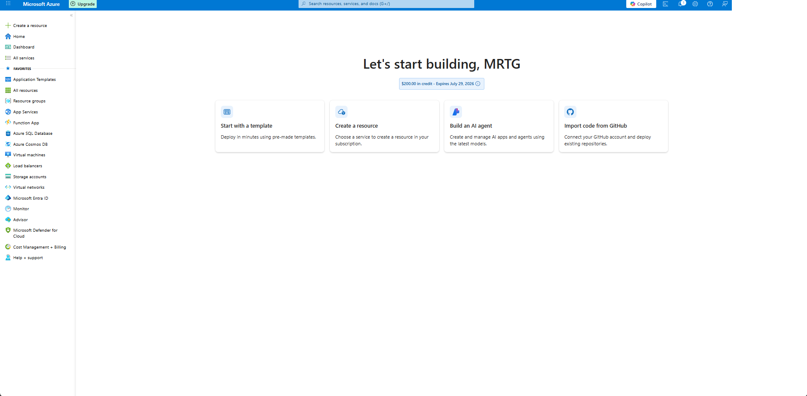
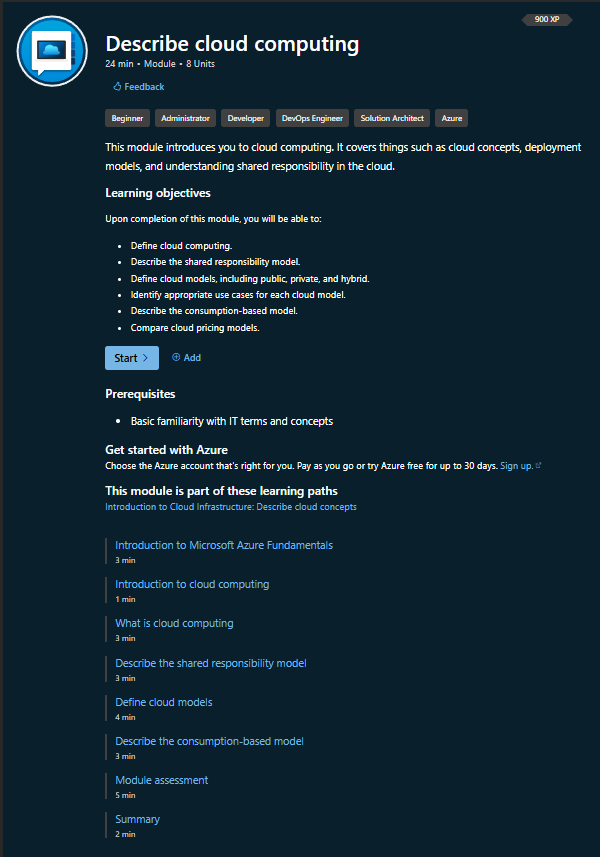
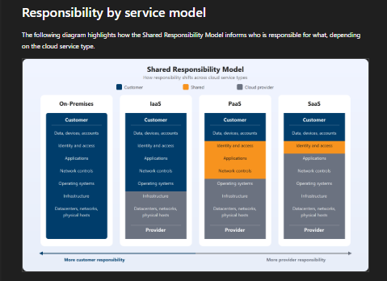
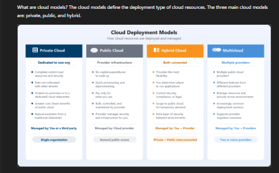
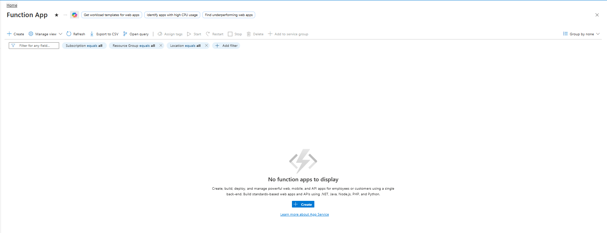
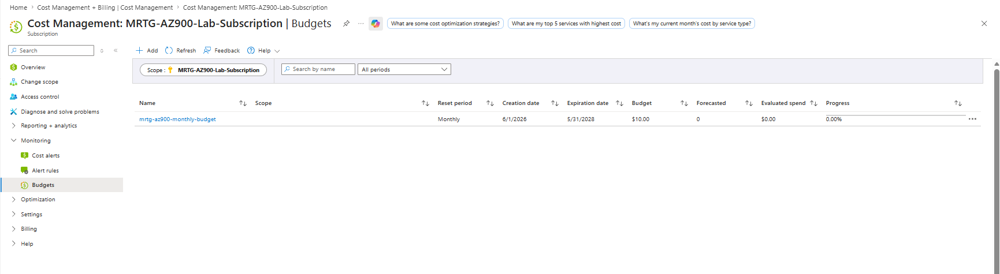

# Lab 02 - Cloud Computing and Shared Responsibility

## Objective

Explain foundational cloud computing concepts and document how the shared responsibility model changes across cloud deployment models and cloud service models.

By completing this lab, I:

- Reviewed Azure cloud computing fundamentals
- Documented the shared responsibility model
- Compared on-premises, IaaS, PaaS, and SaaS responsibility boundaries
- Reviewed private, public, hybrid, and multicloud deployment models
- Identified Azure Function App as a serverless compute option
- Connected consumption-based pricing to Azure Cost Management
- Confirmed that no billable resources were deployed during the lab

---

## Business Problem Solved

Cloud adoption changes how organizations manage infrastructure, identity, security, cost, and operations.

Monroe Redstone Technology Group needed to understand which responsibilities remain with the customer and which responsibilities shift to the cloud provider before deploying additional Azure services.

This lab helped answer:

- What is cloud computing?
- What responsibilities does Microsoft manage?
- What responsibilities does the customer still manage?
- How do responsibilities change between IaaS, PaaS, and SaaS?
- How do private, public, hybrid, and multicloud models differ?
- Why does cloud usage require cost awareness?
- How does serverless computing reduce infrastructure management?

Moving to the cloud does not remove responsibility. It changes where responsibility sits.

---

## Scenario

MRTG established a secure and cost-conscious Azure subscription in Lab 01.

Before deploying compute, networking, storage, identity, governance, or monitoring services, the organization must understand the cloud operating model.

MRTG needs to document:

- Cloud computing concepts
- Shared responsibility
- Cloud deployment models
- Cloud service models
- Consumption-based pricing
- Serverless service discovery
- Cost validation after service exploration

No paid Azure resources are created in this lab.

---

## Azure Services and Resources Used

| Service or Resource | Purpose |
|---|---|
| Azure portal | Confirmed continued access to the MRTG Azure environment |
| Microsoft Learn | Reviewed official Azure fundamentals cloud concepts |
| Azure Function App | Identified a serverless compute option without deploying it |
| Azure Cost Management | Reviewed budget and consumption-based cost awareness |
| Azure budgets | Confirmed spend remained at `$0.00` after the lab |

---

## Why These Services Were Used

### Azure Portal

The Azure portal was used to confirm access to the existing MRTG subscription and to locate Azure services without creating resources.

### Microsoft Learn

Microsoft Learn was used as the official study source for the cloud computing concepts covered by AZ-900.

### Azure Function App

Azure Function App was used as the serverless service example because it represents event-driven compute where the cloud provider manages much of the underlying infrastructure.

The service was located but not deployed.

### Azure Cost Management

Cost Management was reviewed to reinforce the connection between cloud usage and consumption-based pricing.

This confirmed that exploring services without deploying resources did not increase Azure spend.

---

## Environment

| Component | Configuration |
|---|---|
| Organization | Monroe Redstone Technology Group |
| Project | MRTG Azure Fundamentals: The Bridge |
| Lab | Lab 02 |
| Subscription | `MRTG-AZ900-Lab-Subscription` |
| Primary region | Not applicable |
| Resource group | No new resource group created |
| Azure services deployed | None |
| Estimated cost | `$0.00` |
| Documentation platform | GitHub |

---

## Architecture / Concept Diagram

```text
+-----------------------------------------------------------+
| MRTG Azure Fundamentals Lab Environment                   |
|                                                           |
|  +-----------------------------------------------------+  |
|  | Azure Portal Access                                |  |
|  |                                                     |  |
|  |  - Subscription available                           |  |
|  |  - Azure services discoverable                      |  |
|  |  - No new resources deployed                        |  |
|  +-----------------------------------------------------+  |
|                                                           |
|  +-----------------------------------------------------+  |
|  | Cloud Concept Review                               |  |
|  |                                                     |  |
|  |  - Cloud computing                                  |  |
|  |  - Shared responsibility                            |  |
|  |  - Cloud deployment models                          |  |
|  |  - Cloud service models                             |  |
|  |  - Consumption-based pricing                        |  |
|  |  - Serverless computing                             |  |
|  +-----------------------------------------------------+  |
|                                                           |
|  +-----------------------------------------------------+  |
|  | Cost Validation                                    |  |
|  |                                                     |  |
|  |  - Budget active                                    |  |
|  |  - Evaluated spend: $0.00                           |  |
|  |  - Progress: 0.00%                                  |  |
|  +-----------------------------------------------------+  |
+-----------------------------------------------------------+
```

---

## Steps Performed

### Step 1: Confirm Azure Portal Access

1. Signed in to the Azure portal with the dedicated MRTG lab account.
2. Confirmed that the Azure portal loaded successfully.
3. Confirmed that Azure services were visible in the left navigation.
4. Confirmed that no new resources were created from the portal home page.
5. Redacted account and directory information before documentation.



**Screenshot evidence:** The Azure portal home page confirms continued access to the MRTG Azure environment.

---

### Step 2: Review Cloud Computing Concepts

1. Opened Microsoft Learn.
2. Located the **Describe cloud computing** module.
3. Reviewed the learning objectives.
4. Confirmed the module covered:
   - Cloud computing
   - Shared responsibility
   - Cloud models
   - Consumption-based pricing
   - Cloud pricing models



**Screenshot evidence:** Microsoft Learn shows the cloud computing module and its AZ-900-relevant learning objectives.

---

### Step 3: Document the Shared Responsibility Model

1. Opened the shared responsibility model section.
2. Reviewed how responsibilities change across service models.
3. Compared on-premises, IaaS, PaaS, and SaaS.
4. Identified which layers are managed by the customer, shared, or managed by the cloud provider.



**Screenshot evidence:** The shared responsibility model shows that customer responsibility decreases as provider-managed responsibility increases.

---

### Step 4: Review Cloud Deployment Models

1. Opened the cloud models section.
2. Reviewed the major cloud deployment models.
3. Compared:
   - Private cloud
   - Public cloud
   - Hybrid cloud
   - Multicloud
4. Documented how each model changes ownership, management, and connectivity.



**Screenshot evidence:** The cloud deployment model diagram compares private, public, hybrid, and multicloud deployment models.

---

### Step 5: Identify a Serverless Azure Service

1. Returned to the Azure portal.
2. Opened the **Function App** service page.
3. Confirmed that no function apps existed in the environment.
4. Confirmed that the service was discoverable without deploying anything.
5. Did not click **Create**.
6. Did not deploy a function app.



**Screenshot evidence:** Azure Function App was identified as a serverless compute option, and no function apps were deployed.

---

### Step 6: Review Consumption-Based Pricing Through Cost Management

1. Opened Azure Cost Management.
2. Reviewed the MRTG subscription budget.
3. Confirmed that the monthly budget remained active.
4. Confirmed that evaluated spend remained `$0.00`.
5. Confirmed that budget progress remained `0.00%`.
6. Redacted subscription identifiers before documentation.


**Screenshot evidence:** The Cost Management budget page shows the active `$10.00` budget, `$0.00` evaluated spend, and `0.00%` progress.

---

### Step 7: Perform Final Lab Validation

1. Confirmed that no Azure resources were deployed during the lab.
2. Confirmed that no billable workloads were created.
3. Confirmed that the budget still showed `$0.00` evaluated spend.
4. Confirmed that the lab remained within the expected `$0.00` cost estimate.



**Screenshot evidence:** Final validation confirms that cost remained at `$0.00` after cloud concept review and serverless service discovery.

---

## Cloud Computing Summary

Cloud computing is the delivery of computing services over the internet.

These services can include:

- Compute
- Storage
- Networking
- Databases
- Identity
- Security
- Analytics
- Monitoring
- Application hosting

Instead of buying and maintaining physical infrastructure, organizations can consume cloud services on demand.

---

## Shared Responsibility Model

The shared responsibility model defines which security and operational responsibilities belong to the cloud provider and which responsibilities belong to the customer.

The general pattern is:

```text
The more the provider manages, the less infrastructure the customer manages.
The customer still remains responsible for data, identity, access, and configuration.
```

### Responsibility by Model

| Model | Customer Responsibility | Provider Responsibility |
|---|---|---|
| On-premises | Highest | Lowest |
| IaaS | High | Moderate |
| PaaS | Moderate | High |
| SaaS | Lowest | Highest |

### Key Takeaway

Cloud does not eliminate security responsibility.

It shifts some responsibilities to the provider while leaving important responsibilities with the customer.

---

## Cloud Service Models

### Infrastructure as a Service

Infrastructure as a Service provides virtualized infrastructure such as virtual machines, storage, and networking.

With IaaS, the customer usually manages:

- Operating systems
- Applications
- Data
- Identity
- Access
- Network controls
- Guest operating system updates

Azure example:

```text
Azure Virtual Machines
```

### Platform as a Service

Platform as a Service provides a managed platform for building and running applications.

With PaaS, the customer usually manages:

- Application code
- Data
- Identity
- Access
- Application configuration

Azure example:

```text
Azure App Service
```

### Software as a Service

Software as a Service provides a complete application managed by the provider.

With SaaS, the customer usually manages:

- Users
- Data
- Access
- Configuration
- Security settings

Microsoft example:

```text
Microsoft 365
```

---

## Cloud Deployment Models

### Private Cloud

A private cloud is dedicated to a single organization.

It may be hosted on-premises or by a third party, but it is not shared with the general public.

### Public Cloud

A public cloud is operated by a cloud provider and shared across many customers.

Azure is an example of a public cloud platform.

### Hybrid Cloud

A hybrid cloud connects private cloud or on-premises infrastructure with public cloud services.

This model is common in regulated environments where some workloads remain on-premises while others move to the cloud.

### Multicloud

A multicloud environment uses services from more than one cloud provider.

This may be done for redundancy, vendor flexibility, specialized services, or organizational requirements.

---

## Serverless Computing

Serverless computing allows developers or administrators to run code without managing the underlying servers.

The servers still exist, but the cloud provider manages much of the infrastructure.

Azure Function App was used as the serverless discovery example in this lab.

### Serverless Characteristics

Serverless services commonly provide:

- Event-driven execution
- Automatic scaling
- Reduced infrastructure management
- Usage-based billing
- Faster deployment for small workloads and automation tasks

### Important Limitation

Serverless does not mean there are no servers.

It means the customer does not manage the server infrastructure directly.

---

## Consumption-Based Pricing

Cloud services commonly use a consumption-based pricing model.

This means cost can increase based on:

- Resources deployed
- Resource size
- Runtime
- Storage consumed
- Network traffic
- Transactions
- Monitoring data
- Backup and retention
- Premium features

### Cost Note

Although the Azure account showed promotional credit availability, this lab was designed not to consume Azure credit.

No billable resources were deployed.

The credit was treated as a safety buffer, not as a spending target.

---

## Validation

| Validation Check | Expected Result | Observed Result | Status |
|---|---|---|---|
| Azure portal access | Portal loads successfully | Portal loaded successfully | Passed |
| Cloud concepts reviewed | Microsoft Learn module located | Describe cloud computing module reviewed | Passed |
| Shared responsibility reviewed | Model shows customer and provider responsibility | Shared responsibility diagram reviewed | Passed |
| Service models compared | IaaS, PaaS, and SaaS differences documented | Responsibility boundaries documented | Passed |
| Deployment models compared | Private, public, hybrid, and multicloud reviewed | Cloud deployment model diagram reviewed | Passed |
| Serverless service identified | Azure serverless service located | Function App page opened | Passed |
| No serverless resource deployed | No function apps created | Function App showed no apps to display | Passed |
| Consumption pricing reviewed | Cost Management reviewed | Budget page reviewed | Passed |
| Final cost state | Spend remains `$0.00` | Evaluated spend showed `$0.00` | Passed |

---

## Completion Checklist

- [x] Azure portal access confirmed
- [x] Microsoft Learn cloud concepts reviewed
- [x] Shared responsibility model documented
- [x] IaaS, PaaS, and SaaS responsibility boundaries compared
- [x] Private, public, hybrid, and multicloud models reviewed
- [x] Azure Function App identified as a serverless service
- [x] No Function App created
- [x] No paid Azure resources deployed
- [x] Cost Management reviewed
- [x] Budget remained active
- [x] Evaluated spend remained `$0.00`
- [x] Screenshots sanitized and uploaded
- [x] No sensitive subscription identifiers committed

---

## AZ-900 Exam Objective Coverage

### Primary Exam Domain

```text
Describe cloud concepts
```

### Secondary Exam Domain

```text
Describe Azure management and governance
```

### Skills Measured

This lab supports the ability to:

- Describe cloud computing
- Describe the shared responsibility model
- Describe public, private, and hybrid cloud models
- Describe the consumption-based model
- Describe IaaS, PaaS, and SaaS
- Identify use cases for each cloud service model
- Describe serverless computing
- Describe cloud pricing models
- Describe cost monitoring through Azure Cost Management

### How This Lab Supports the Objectives

This lab connects the theory of cloud computing to practical Azure navigation.

It shows that cloud adoption affects:

- Security ownership
- Identity responsibility
- Infrastructure management
- Application responsibility
- Cost behavior
- Service selection
- Operational planning

---

## Mini Objective Coverage

By completing this lab, I can now:

- Define cloud computing
- Explain the shared responsibility model
- Compare on-premises, IaaS, PaaS, and SaaS
- Identify which responsibilities remain with the customer
- Explain private, public, hybrid, and multicloud models
- Describe consumption-based pricing
- Explain why serverless does not mean server-free
- Identify Azure Function App as a serverless compute service
- Validate that service discovery can be performed without deploying resources
- Connect cost awareness to cloud operations

---

## IAM / Security Relevance

Cloud computing has a direct connection to IAM because identity and access remain customer responsibilities across every cloud model.

Even when Microsoft manages more infrastructure, the customer is still responsible for:

- User accounts
- Authentication configuration
- Authorization decisions
- Role assignments
- Data access
- Conditional Access rules
- Privileged access
- Identity lifecycle management
- Security monitoring
- Governance configuration

### IAM Responsibility Pattern

| Cloud Model | IAM Responsibility |
|---|---|
| On-premises | Customer manages identity platform, access, infrastructure, and security controls |
| IaaS | Customer manages identities, access, OS-level permissions, and application access |
| PaaS | Customer manages identities, access, application permissions, and data protection |
| SaaS | Customer manages users, groups, access policies, data, and security settings |

### Security Takeaway

The cloud provider may manage the infrastructure, but the customer still owns identity decisions.

For government and regulated environments, this is critical because access control, auditability, least privilege, and data protection remain organizational responsibilities.

---

## Governance Notes

### Governance Decisions

| Decision | Implementation | Reason |
|---|---|---|
| No resource deployment | Service discovery only | Prevents unnecessary cost |
| Microsoft Learn used | Official concept review | Aligns lab with AZ-900 objectives |
| Function App not created | Serverless discovery only | Avoids billable services |
| Cost Management reviewed | Budget and spend checked | Reinforces consumption-based pricing |
| Existing budget retained | `$10.00` monthly budget | Maintains cost visibility |
| Screenshots sanitized | Sensitive data redacted | Prevents exposure of account or subscription details |

### Governance Lesson

Cloud governance begins before deployment.

Understanding responsibility boundaries helps prevent incorrect assumptions about security, cost, and ownership.

---

## Cost Considerations

### Estimated Lab Cost

```text
Estimated cost: $0.00
```

### Why Cost Stayed at Zero

This lab did not create:

- Virtual machines
- Function apps
- App Service plans
- Storage accounts
- Databases
- Virtual networks
- Public IP addresses
- Log Analytics workspaces
- Defender upgrades
- Backup services

### Cost Controls Used

- Used service discovery instead of deployment
- Avoided clicking **Create** for Function App
- Reviewed the active budget
- Confirmed evaluated spend remained `$0.00`
- Confirmed budget progress remained `0.00%`
- Treated promotional credit as a safety buffer

### Important Cost Reminder

Azure budgets generate alerts.

They do not stop resources automatically and do not guarantee a hard spending cap.

---

## Troubleshooting Notes

### Issue 1: Avoiding Accidental Resource Creation

**Symptom:**

Azure portal service pages often include prominent **Create** buttons.

**Risk:**

Clicking through a create workflow can deploy billable resources if configuration is completed.

**Resolution:**

The Function App page was opened only for service discovery. No function app was created.

**Result:**

The lab remained at `$0.00` evaluated spend.

---

### Issue 2: Sensitive Directory and Subscription Information Appeared in the Portal

**Symptom:**

Azure pages can show account names, directory names, subscription IDs, and scope values.

**Risk:**

Publishing screenshots without redaction can expose cloud environment identifiers.

**Resolution:**

Sensitive account, directory, and subscription values were redacted before upload.

**Result:**

Screenshots were safe for public GitHub documentation.

---

## What I Would Do Differently in Production

A production environment would include more formal planning and controls, including:

- Microsoft Entra work accounts instead of consumer accounts
- Management groups
- Multiple subscriptions for workload separation
- Azure Policy assignments
- Required tagging policies
- Cost alerts by environment or department
- Role-based access control with least privilege
- Privileged Identity Management
- Conditional Access
- Centralized logging
- Formal cloud responsibility matrix
- Documented service ownership
- Approved service catalog
- Cloud cost review process
- Change-management approval before deployment

The lab intentionally stayed lightweight because its purpose was AZ-900 concept validation.

---

## Lessons Learned

- Cloud computing shifts responsibility, but it does not remove responsibility.
- The customer always remains responsible for data, identity, and access.
- IaaS gives the customer more control and more responsibility.
- SaaS gives the provider more control, but the customer still manages users, data, and configuration.
- PaaS sits between IaaS and SaaS.
- Serverless reduces infrastructure management but does not eliminate security responsibility.
- Consumption-based pricing requires cost awareness before deployment.
- Azure services can be explored without creating billable resources.
- Budgets are alerts, not spending locks.
- Promotional credit should be treated as a safety buffer, not a reason to deploy carelessly.

### Technical Takeaway

The shared responsibility model is one of the most important cloud security concepts because it defines who manages each layer of the environment.

### Business Takeaway

Organizations need clear responsibility boundaries before moving workloads to the cloud.

### Security Takeaway

Identity and access remain customer responsibilities across all cloud service models.

### Exam Takeaway

For AZ-900, remember:

- IaaS means more customer responsibility.
- SaaS means more provider responsibility.
- PaaS sits in the middle.
- The customer always owns data, accounts, identities, and access decisions.
- Consumption-based pricing means usage drives cost.
- Serverless means servers are abstracted, not removed.

---

## Cleanup

### Resources Retained

| Resource or Configuration | Reason |
|---|---|
| MRTG Azure subscription | Required for future labs |
| Monthly budget | Required for ongoing cost visibility |
| Existing Lab 01 resource group | Retained as the foundational lab resource group |
| Lab 02 screenshots | Required for documentation evidence |

### Resources Removed

No Azure resources were created during this lab.

### Cleanup Validation

- [x] No Function App was created
- [x] No virtual machines were created
- [x] No storage accounts were created
- [x] No public IP addresses were created
- [x] No databases were created
- [x] No premium services were enabled
- [x] Budget remained active
- [x] Evaluated spend remained `$0.00`
- [x] Screenshot data was sanitized

---

## Outcome

This lab documented the cloud computing foundation needed before deploying additional Azure services.

The completed lab demonstrates:

- Continued Azure portal access
- Understanding of the shared responsibility model
- Understanding of cloud deployment models
- Understanding of IaaS, PaaS, and SaaS responsibility boundaries
- Awareness of serverless computing through Azure Function App
- Awareness of consumption-based pricing
- Cost validation through Azure Cost Management
- No deployed billable resources
- Final evaluated spend of `$0.00`

---

## Screenshot Inventory

| Screenshot | Description |
|---|---|
| `01-azure-portal-home.png` | Azure portal home with MRTG lab environment |
| `02-microsoft-learn-cloud-concepts.png` | Microsoft Learn cloud computing module |
| `03-shared-responsibility-model.png` | Shared responsibility model by service model |
| `04-cloud-deployment-models.png` | Private, public, hybrid, and multicloud models |
| `05-serverless-services-search.png` | Azure Function App service discovery |
| `06-cost-management-consumption-review.png` | Cost Management budget and consumption review |
| `07-final-lab02-validation.png` | Final cost validation showing `$0.00` evaluated spend |

---

## Next Lab

The next lab is:

```text
Lab 03 - Cloud Models, Benefits, and Service Types
```

The next lab will build on this foundation by examining:

- High availability
- Scalability
- Elasticity
- Reliability
- Predictability
- Security and governance benefits
- Manageability benefits
- Cloud service type selection
