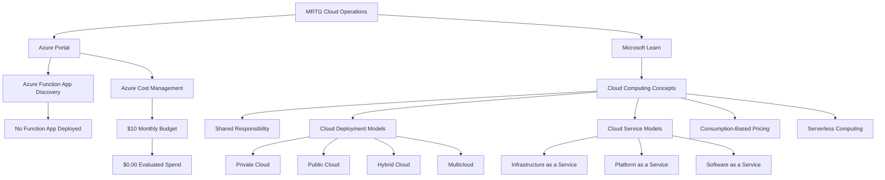
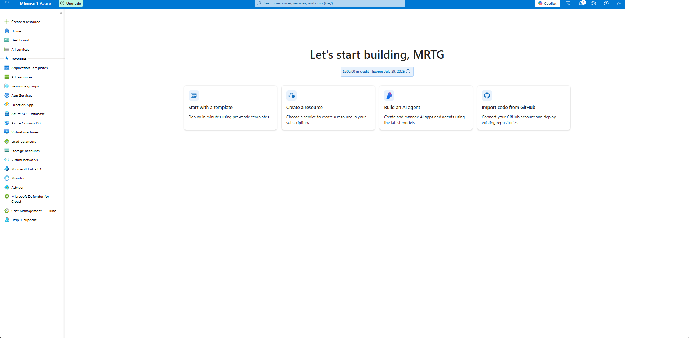
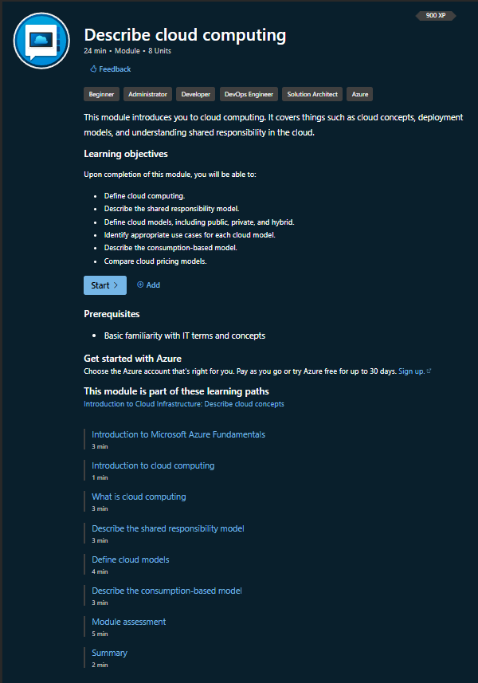
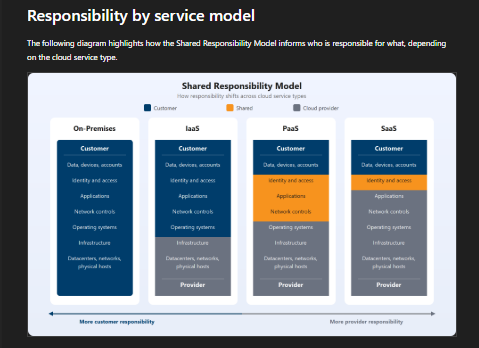
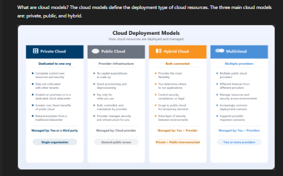
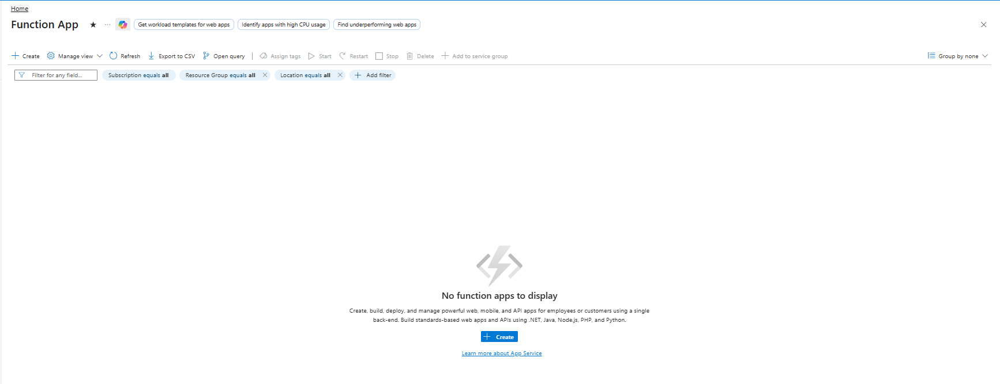
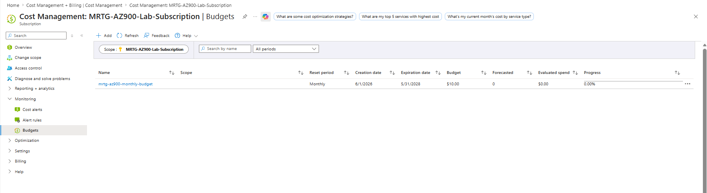

# Lab 02 - Cloud Computing and Shared Responsibility

## Objective

Explain foundational cloud computing concepts and document how customer and cloud-provider responsibilities change across cloud deployment models and service models.

By completing this lab, I:

- Reviewed Azure cloud computing fundamentals
- Documented the shared responsibility model
- Compared on-premises, IaaS, PaaS, and SaaS responsibility boundaries
- Reviewed private, public, hybrid, and multicloud deployment models
- Identified Azure Function App as a serverless compute option
- Connected consumption-based pricing to Azure Cost Management
- Confirmed that no billable resources were deployed
- Validated that evaluated Azure spend remained `$0.00`

This was a discovery-only lab. No Azure resources or configurations were created or modified.

---

## Business Problem Solved

Cloud adoption changes how organizations manage infrastructure, identity, security, cost, applications, and operations.

Monroe Redstone Technology Group needed to understand which responsibilities remain with the customer and which responsibilities shift to Microsoft before deploying additional Azure services.

This lab addressed the following questions:

- What is cloud computing?
- What responsibilities does Microsoft manage?
- What responsibilities remain with the customer?
- How do responsibilities change between IaaS, PaaS, and SaaS?
- How do private, public, hybrid, and multicloud models differ?
- Why does cloud usage require continuous cost awareness?
- How does serverless computing reduce infrastructure-management requirements?

Moving to the cloud does not eliminate organizational responsibility. It changes where individual responsibilities are assigned.

---

## Scenario

MRTG established a secure and cost-conscious Azure subscription in Lab 01.

Before deploying compute, networking, storage, identity, governance, or monitoring services, the organization must understand the cloud operating model.

MRTG needs to document:

- Cloud computing concepts
- Shared responsibility
- Cloud deployment models
- Cloud service models
- Consumption-based pricing
- Serverless computing
- Azure service discovery
- Cost validation after service exploration

No paid Azure services or workload resources are deployed during this lab.

---

## Azure Services and Resources Used

| Azure Service, Resource, or Platform | Purpose |
|---|---|
| Azure Portal | Confirmed continued access to the MRTG Azure environment |
| Microsoft Learn | Provided certification-aligned cloud computing instruction |
| Azure Function App | Demonstrated an Azure serverless compute option without deployment |
| Azure Cost Management | Connected cloud consumption to cost visibility |
| Azure Budgets | Confirmed that evaluated spend remained `$0.00` |

---

## Why These Services Were Used

### Azure Portal

The Azure Portal was used to confirm access to the existing MRTG subscription and locate Azure services without deploying resources.

It supported:

- Azure service discovery
- Subscription access validation
- Serverless service identification
- Cost Management review
- Confirmation that no workload resources were created

### Microsoft Learn

Microsoft Learn was used as the primary certification-aligned learning source for the cloud concepts covered by AZ-900.

It provided structured coverage of:

- Cloud computing
- Shared responsibility
- Cloud deployment models
- Cloud service models
- Consumption-based pricing
- Serverless computing

### Azure Function App

Azure Function App was reviewed as a serverless compute example.

Azure Functions supports event-driven code execution while Microsoft manages much of the underlying infrastructure.

The service was located in the Azure Portal, but no Function App was deployed.

### Azure Cost Management

Azure Cost Management was reviewed to reinforce the relationship between cloud usage and consumption-based pricing.

The Cost Management review confirmed that exploring Azure services without deploying resources did not increase Azure spending.

### Azure Budgets

The existing monthly budget was reviewed to validate the final cost state.

The budget showed:

- Budget amount of `$10.00`
- Evaluated spend of `$0.00`
- Budget progress of `0.00%`

---

## Environment

| Item | Value |
|---|---|
| Organization | Monroe Redstone Technology Group |
| Project | MRTG Azure Fundamentals: The Bridge |
| Lab | Lab 02 - Cloud Computing and Shared Responsibility |
| Cloud Platform | Microsoft Azure |
| Management Interface | Azure Portal |
| Learning Platform | Microsoft Learn |
| Subscription | `MRTG-AZ900-Lab-Subscription` |
| Primary Region | Not applicable |
| New Resource Group | None |
| Azure Resources Deployed | None |
| Monthly Budget | `$10.00` |
| Evaluated Spend | `$0.00` |
| Budget Progress | `0.00%` |
| Documentation Platform | GitHub |
| Lab Type | Discovery-only |
| Estimated Cost | `$0.00` |

---

## Architecture / Concept Diagram


```mermaid
flowchart TD
    User[MRTG Cloud Operations] --> Portal[Azure Portal]
    User --> Learn[Microsoft Learn]

    Learn --> Concepts[Cloud Computing Concepts]
    Concepts --> Responsibility[Shared Responsibility]
    Concepts --> DeploymentModels[Cloud Deployment Models]
    Concepts --> ServiceModels[Cloud Service Models]
    Concepts --> Consumption[Consumption-Based Pricing]
    Concepts --> Serverless[Serverless Computing]

    DeploymentModels --> Private[Private Cloud]
    DeploymentModels --> Public[Public Cloud]
    DeploymentModels --> Hybrid[Hybrid Cloud]
    DeploymentModels --> Multicloud[Multicloud]

    ServiceModels --> IaaS[Infrastructure as a Service]
    ServiceModels --> PaaS[Platform as a Service]
    ServiceModels --> SaaS[Software as a Service]

    Portal --> Functions[Azure Function App Discovery]
    Functions --> NoDeployment[No Function App Deployed]

    Portal --> Cost[Azure Cost Management]
    Cost --> Budget[$10 Monthly Budget]
    Budget --> Validation[$0.00 Evaluated Spend]
```

---

## Steps Performed

### Step 1: Confirm Azure Portal Access

1. Signed in to the Azure Portal with the dedicated MRTG lab account.
2. Confirmed that the Azure Portal loaded successfully.
3. Confirmed that Azure services were visible in the navigation menu.
4. Confirmed that no resources were created from the portal home page.
5. Redacted account and directory information before publishing the screenshot.



**Validation:** The Azure Portal home page confirmed continued access to the MRTG Azure environment.

---

### Step 2: Review Cloud Computing Concepts

1. Opened Microsoft Learn.
2. Located the **Describe cloud computing** learning module.
3. Reviewed the module objectives.
4. Confirmed that the module included:
   - Cloud computing
   - Shared responsibility
   - Cloud deployment models
   - Consumption-based pricing
   - Cloud pricing models



**Validation:** Microsoft Learn displayed the cloud computing module and its AZ-900-aligned learning objectives.

---

### Step 3: Document the Shared Responsibility Model

1. Opened the shared responsibility section in Microsoft Learn.
2. Reviewed how responsibilities change across service models.
3. Compared on-premises, IaaS, PaaS, and SaaS environments.
4. Identified which layers are:
   - Managed by the customer
   - Shared between the customer and provider
   - Managed by the cloud provider
5. Documented the effect of each service model on operational responsibility.



**Validation:** The shared responsibility model showed that customer infrastructure responsibility generally decreases as provider-managed responsibility increases.

---

### Step 4: Review Cloud Deployment Models

1. Opened the cloud deployment models section.
2. Reviewed the major cloud deployment models.
3. Compared:
   - Private cloud
   - Public cloud
   - Hybrid cloud
   - Multicloud
4. Documented how each model affects ownership, management, location, connectivity, and control.



**Validation:** The cloud deployment model content compared private, public, hybrid, and multicloud environments.

---

### Step 5: Identify a Serverless Azure Service

1. Returned to the Azure Portal.
2. Opened the **Function App** service page.
3. Confirmed that no Function Apps existed in the environment.
4. Confirmed that the service could be reviewed without deploying a resource.
5. Did not select **Create**.
6. Did not deploy a Function App, hosting plan, storage account, or supporting resource.



**Validation:** Azure Function App was identified as a serverless compute option, and no Function Apps were deployed.

---

### Step 6: Review Consumption-Based Pricing Through Cost Management

1. Opened Azure Cost Management.
2. Reviewed the existing MRTG subscription budget.
3. Confirmed that the monthly budget remained active.
4. Confirmed that evaluated spend remained `$0.00`.
5. Confirmed that budget progress remained `0.00%`.
6. Redacted sensitive subscription information before publishing the screenshot.



**Validation:** The budget page showed the active `$10.00` monthly budget, `$0.00` evaluated spend, and `0.00%` progress.

---

### Step 7: Perform Final Lab Validation

1. Confirmed that no Azure resources were deployed during the lab.
2. Confirmed that no billable workloads were created.
3. Confirmed that no Function App was deployed.
4. Confirmed that the monthly budget remained active.
5. Confirmed that evaluated spend remained `$0.00`.
6. Confirmed that the lab remained within its expected cost estimate.


**Validation:** Final validation confirmed that evaluated spend remained `$0.00` after completing the cloud concept review and serverless service discovery.

---

## Cloud Computing Summary

Cloud computing is the delivery of computing services over the internet.

These services can include:

- Compute
- Storage
- Networking
- Databases
- Identity
- Security
- Analytics
- Monitoring
- Application hosting
- Backup and recovery

Instead of purchasing, installing, and maintaining all physical infrastructure directly, organizations can consume cloud services on demand.

Cloud computing can provide:

- Faster resource provisioning
- Flexible scaling
- Consumption-based pricing
- Global service availability
- Reduced infrastructure-management requirements
- Access to managed platforms and applications

---

## Shared Responsibility Model

The shared responsibility model defines which security and operational responsibilities belong to the cloud provider and which remain with the customer.

The general pattern is:

```text
The more infrastructure the provider manages, the less infrastructure the customer manages.

The customer still remains responsible for data, identities, access, and configuration.
```

### Responsibilities That Always Remain With the Customer

Regardless of the cloud service model, the customer remains responsible for areas such as:

- Data
- User accounts
- Identities
- Access management
- Endpoint devices
- Configuration decisions
- Data classification
- Regulatory requirements

### Responsibility by Service Model

| Service Model | Customer Responsibility | Provider Responsibility |
|---|---|---|
| On-premises | Highest | None or minimal |
| IaaS | High | Moderate |
| PaaS | Moderate | High |
| SaaS | Lower | Highest |

### Key Takeaway

Cloud computing does not eliminate security or operational responsibility.

It transfers selected infrastructure responsibilities to the cloud provider while leaving important identity, data, access, and configuration responsibilities with the customer.

---

## Cloud Service Models

### Infrastructure as a Service

Infrastructure as a Service provides virtualized infrastructure such as virtual machines, disks, and networking.

With IaaS, the customer typically manages:

- Operating systems
- Operating system updates
- Applications
- Data
- Identities
- Access
- Guest operating system security
- Application configuration
- Selected network controls

The cloud provider manages:

- Physical datacenters
- Physical networking
- Physical servers
- Hypervisor infrastructure

Azure example:

```text
Azure Virtual Machines
```

### Platform as a Service

Platform as a Service provides a managed platform for building, deploying, and running applications.

With PaaS, the customer typically manages:

- Application code
- Application configuration
- Data
- Identities
- Access
- Application security

The cloud provider manages more of the underlying:

- Operating system
- Runtime
- Middleware
- Physical infrastructure
- Platform availability

Azure example:

```text
Azure App Service
```

### Software as a Service

Software as a Service provides a complete application managed by the provider.

With SaaS, the customer typically manages:

- Users
- Groups
- Data
- Access policies
- Application settings
- Security configuration
- Data-retention decisions

The provider manages the application platform and underlying infrastructure.

Microsoft example:

```text
Microsoft 365
```

---

## Cloud Deployment Models

### Private Cloud

A private cloud is dedicated to a single organization.

It may be hosted:

- On-premises
- In an organization-owned datacenter
- By a third-party provider

A private cloud can provide greater control but usually requires more direct infrastructure management.

### Public Cloud

A public cloud is operated by a cloud provider and offers services to multiple customers through shared provider infrastructure.

Microsoft Azure is a public cloud platform.

Individual customer data, identities, subscriptions, and workloads remain logically separated.

### Hybrid Cloud

A hybrid cloud connects private cloud or on-premises infrastructure with public cloud services.

Hybrid cloud can support:

- Gradual cloud migration
- Regulatory requirements
- Legacy applications
- Local data-processing requirements
- Disaster recovery
- Hybrid identity
- Cloud-based management of on-premises resources

### Multicloud

A multicloud environment uses services from more than one cloud provider.

Organizations may adopt multicloud for:

- Vendor flexibility
- Redundancy
- Specialized provider services
- Geographic availability
- Merger and acquisition requirements
- Organizational policy

Multicloud can also increase management, identity, governance, security, and cost complexity.

---

## Serverless Computing

Serverless computing allows developers and administrators to run code without directly managing the underlying servers.

The physical servers still exist, but the cloud provider manages much of the infrastructure.

Azure Function App was reviewed as the serverless compute example for this lab.

### Serverless Characteristics

Serverless services commonly provide:

- Event-driven execution
- Automatic scaling
- Reduced infrastructure management
- Usage-based billing
- Short-lived execution
- Faster deployment for automation and small workloads

### Common Serverless Use Cases

- Processing uploaded files
- Responding to messages or events
- Running scheduled automation
- Processing queue messages
- Connecting cloud services
- Executing lightweight application logic
- Responding to monitoring events

### Important Limitation

Serverless does not mean that servers do not exist.

It means that the customer does not directly provision, maintain, patch, or manage the underlying server infrastructure.

The customer still remains responsible for:

- Code
- Data
- Identities
- Permissions
- Application configuration
- Security settings
- Monitoring
- Cost management

---

## Consumption-Based Pricing

Cloud services commonly use a consumption-based pricing model.

This means that cost can increase based on actual usage.

Potential cost factors include:

- Resources deployed
- Resource size
- Runtime
- Storage consumed
- Network traffic
- Transactions
- Requests
- Monitoring data
- Backup and retention
- Premium features
- Geographic region
- Licensing

### Capital Expenditure and Operational Expenditure

Traditional on-premises infrastructure often requires capital expenditure for:

- Servers
- Networking equipment
- Datacenter space
- Power
- Cooling
- Hardware replacement

Cloud services commonly shift more spending toward operational expenditure based on usage.

### Cost Note

Although the Azure account included promotional credit, this lab was designed not to consume that credit.

No billable resources were deployed.

The credit was treated as a safety buffer rather than a spending target.

---

## Validation

| Validation Item | Expected Result | Actual Result |
|---|---|---|
| Azure Portal access | Portal loads successfully | Passed |
| Microsoft Learn access | Cloud computing module is available | Passed |
| Cloud computing concepts | Core concepts are reviewed | Passed |
| Shared responsibility | Customer and provider boundaries are documented | Passed |
| Service models | IaaS, PaaS, and SaaS are compared | Passed |
| Deployment models | Private, public, hybrid, and multicloud are compared | Passed |
| Serverless service | Azure Function App is located | Passed |
| Function App deployment | No Function App is created | Passed |
| Billable resources | No billable workloads are deployed | Passed |
| Cost Management | Existing monthly budget is reviewed | Passed |
| Evaluated spend | Spend remains `$0.00` | Passed |
| Budget progress | Progress remains `0.00%` | Passed |
| Estimated cost | Lab remains within the `$0.00` estimate | Passed |

---

## Completion Checklist

- [x] Azure Portal access confirmed
- [x] Microsoft Learn cloud concepts reviewed
- [x] Cloud computing documented
- [x] Shared responsibility model documented
- [x] On-premises responsibility reviewed
- [x] IaaS responsibility reviewed
- [x] PaaS responsibility reviewed
- [x] SaaS responsibility reviewed
- [x] Private cloud reviewed
- [x] Public cloud reviewed
- [x] Hybrid cloud reviewed
- [x] Multicloud reviewed
- [x] Azure Function App identified as a serverless service
- [x] No Function App created
- [x] No paid Azure resources deployed
- [x] Azure Cost Management reviewed
- [x] Monthly budget remained active
- [x] Evaluated spend remained `$0.00`
- [x] Budget progress remained `0.00%`
- [x] Screenshots sanitized
- [x] No sensitive subscription identifiers committed

---

## AZ-900 Exam Objective Coverage

### Primary Exam Domain

```text
Describe cloud concepts
```

### Secondary Exam Domain

```text
Describe Azure management and governance
```

### Skills Measured

This lab supports the ability to:

- Describe cloud computing
- Describe the shared responsibility model
- Describe public, private, and hybrid cloud models
- Describe the consumption-based model
- Compare capital expenditure and operational expenditure
- Describe Infrastructure as a Service
- Describe Platform as a Service
- Describe Software as a Service
- Identify use cases for each cloud service model
- Describe serverless computing
- Describe cloud pricing models
- Describe cost monitoring through Azure Cost Management

### How This Lab Supports the Objectives

This lab connected cloud computing theory to practical Azure navigation.

It demonstrated that cloud adoption affects:

- Security ownership
- Identity responsibility
- Infrastructure management
- Application responsibility
- Data responsibility
- Cost behavior
- Service selection
- Operational planning

---

## Mini Objective Coverage

By completing this lab, I can:

- Define cloud computing
- Explain the shared responsibility model
- Compare on-premises, IaaS, PaaS, and SaaS
- Identify responsibilities that always remain with the customer
- Compare private, public, hybrid, and multicloud models
- Describe consumption-based pricing
- Compare capital and operational expenditure
- Explain why serverless does not mean server-free
- Identify Azure Function App as a serverless compute service
- Validate that Azure services can be explored without deployment
- Connect cloud usage to Azure Cost Management
- Explain why cloud service selection affects security and operational responsibility

---

## IAM / Security Relevance

Cloud computing has a direct connection to identity and access management because identity and access remain customer responsibilities across every cloud service model.

Even when Microsoft manages more infrastructure, the customer remains responsible for:

- User accounts
- Authentication configuration
- Authorization decisions
- Role assignments
- Data access
- Conditional Access
- Privileged access
- Identity lifecycle management
- Application permissions
- Security monitoring
- Governance configuration

### IAM Responsibility Pattern

| Environment or Service Model | IAM Responsibility |
|---|---|
| On-premises | Customer manages the identity platform, infrastructure, accounts, permissions, and security controls |
| IaaS | Customer manages identities, Azure access, operating system permissions, and application access |
| PaaS | Customer manages identities, application access, data permissions, and application configuration |
| SaaS | Customer manages users, groups, access policies, data, and application security settings |

### Authentication and Authorization

Authentication confirms who an identity is.

Authorization determines what the authenticated identity is permitted to do.

Cloud providers can supply authentication and authorization technologies, but the customer must configure and govern them correctly.

### Least Privilege

The shared responsibility model reinforces least privilege because customers remain responsible for:

- Determining who needs access
- Selecting the correct role
- Assigning access at the appropriate scope
- Removing access when it is no longer required
- Reviewing privileged accounts
- Monitoring administrative activity

### Security Takeaway

The cloud provider may manage the physical infrastructure and platform, but the customer still owns identity, access, data, and configuration decisions.

This is particularly important in government, defense, healthcare, financial, and other regulated environments.

---

## Governance Notes

### Governance Decisions

| Decision | Implementation | Reason |
|---|---|---|
| Discovery-only lab | Azure services were reviewed without deployment | Prevented unnecessary cost and configuration changes |
| Microsoft Learn used | Official certification-aligned content reviewed | Supported AZ-900 preparation |
| Function App not created | Serverless service was reviewed only | Avoided unnecessary supporting resources |
| Cost Management reviewed | Budget and spending state validated | Reinforced consumption-based pricing |
| Existing budget retained | `$10.00` monthly budget | Maintained ongoing cost visibility |
| Screenshots sanitized | Sensitive information redacted | Protected account and subscription information |

### Governance Lesson

Cloud governance begins before deployment.

Understanding responsibility boundaries helps prevent incorrect assumptions about:

- Security ownership
- Data protection
- Identity management
- Cost responsibility
- Service configuration
- Compliance obligations
- Operational support

### Shared Responsibility Documentation

A production organization should maintain a responsibility matrix that identifies:

- Service owner
- Data owner
- Identity owner
- Security owner
- Platform owner
- Application owner
- Cost owner
- Incident-response responsibilities
- Backup responsibilities
- Compliance responsibilities

---

## Cost Considerations

### Estimated Lab Cost

```text
Estimated cost: $0.00
```

### Why Cost Remained at Zero

This lab did not create:

- Virtual machines
- Function Apps
- App Service plans
- Storage accounts
- Databases
- Virtual networks
- Public IP addresses
- Log Analytics workspaces
- Microsoft Defender upgrades
- Backup services

### Cost Controls Used

- Used service discovery instead of deployment
- Avoided selecting **Create** for Function App
- Reviewed the active monthly budget
- Confirmed that evaluated spend remained `$0.00`
- Confirmed that budget progress remained `0.00%`
- Treated promotional credit as a safety buffer
- Avoided optional premium services

### Budget Limitation

Azure budgets:

- Monitor actual and forecasted costs
- Generate notifications at configured thresholds
- Do not automatically stop resources
- Do not prevent additional spending
- Do not replace regular Cost Management reviews

---

## Troubleshooting Notes

### Issue 1: Avoiding Accidental Resource Creation

**Symptom**

Azure service pages often display prominent **Create** buttons.

**Risk**

Completing a resource-creation workflow can deploy billable resources and supporting dependencies.

A Function App deployment may require additional resources such as:

- A hosting plan
- A storage account
- Monitoring configuration
- Networking configuration

**Resolution**

The Function App page was opened only for service discovery.

No creation workflow was completed.

**Result**

No Function App or supporting resource was deployed, and evaluated spend remained `$0.00`.

---

### Issue 2: Sensitive Directory and Subscription Information Appeared

**Symptom**

Azure Portal pages can display:

- Account names
- Email addresses
- Directory names
- Subscription IDs
- Tenant IDs
- Scope values

**Risk**

Publishing screenshots without review can expose cloud-environment identifiers.

**Resolution**

Sensitive account, directory, and subscription values were redacted before screenshots were committed.

**Result**

The documentation was suitable for a public GitHub portfolio.

---

## What I Would Do Differently in Production

A production environment would include additional planning and controls.

### Identity and Access

- Use Microsoft Entra work accounts instead of consumer accounts
- Separate administrative and standard-user identities
- Apply least-privilege Azure RBAC
- Use Microsoft Entra groups for role assignments
- Use Privileged Identity Management
- Configure Conditional Access
- Maintain emergency-access accounts
- Perform regular access reviews

### Governance

- Build a formal management group hierarchy
- Use multiple subscriptions for workload separation
- Apply Azure Policy assignments
- Require approved resource tags
- Maintain a cloud responsibility matrix
- Define service and data ownership
- Use an approved cloud-service catalog
- Document compliance requirements

### Cost Management

- Establish department and application budgets
- Configure cost-notification thresholds
- Apply cost-center tags
- Review spending on a scheduled basis
- Define approval requirements for higher-cost services
- Assign financial ownership for each workload

### Operations

- Configure centralized logging
- Create monitoring and security alerts
- Define incident-response responsibilities
- Establish change-management approval
- Document service-level requirements
- Create backup and recovery standards
- Use Infrastructure as Code for deployments

The lab intentionally remained lightweight because its purpose was foundational learning and AZ-900 preparation.

---

## Lessons Learned

- Cloud computing shifts responsibility, but it does not remove responsibility.
- Customers always remain responsible for data, identity, access, and configuration.
- IaaS gives customers more control and more management responsibility.
- SaaS gives the provider more infrastructure responsibility, but the customer still manages users, data, and security settings.
- PaaS sits between IaaS and SaaS.
- Serverless computing reduces infrastructure management but does not eliminate security responsibility.
- Consumption-based pricing requires cost awareness before deployment.
- Azure services can be explored without creating billable resources.
- Budgets provide notifications rather than hard spending limits.
- Promotional credit should be treated as a safety buffer rather than a reason to deploy unnecessary services.

### Technical Takeaway

The shared responsibility model defines who manages each layer of a cloud environment.

Responsibility changes based on the selected service model.

### Business Takeaway

Organizations need clearly documented responsibility boundaries before moving workloads, data, and applications to the cloud.

### Security Takeaway

Identity, access, data, and configuration remain customer responsibilities across cloud service models.

### Exam Takeaway

For AZ-900, remember:

- IaaS means more customer responsibility.
- SaaS means more provider responsibility.
- PaaS sits between IaaS and SaaS.
- Customers remain responsible for data, accounts, identities, and access decisions.
- Consumption-based pricing means usage drives cost.
- Serverless means server infrastructure is abstracted, not eliminated.

---

## Cleanup

### Resources Retained

| Resource or Configuration | Reason |
|---|---|
| MRTG Azure subscription | Required for the remaining labs |
| Monthly Azure budget | Required for ongoing cost visibility |
| Existing Lab 01 resource group | Retained as the foundational resource group |
| Lab 02 documentation | Retained as project evidence |
| Lab 02 screenshots | Retained as validation evidence |

### Resources Removed

No Azure resources were created during this lab.

### Cleanup Validation

- [x] No Function App was created
- [x] No App Service plan was created
- [x] No virtual machine was created
- [x] No storage account was created
- [x] No public IP address was created
- [x] No database was created
- [x] No premium service was enabled
- [x] Monthly budget remained active
- [x] Evaluated spend remained `$0.00`
- [x] Budget progress remained `0.00%`
- [x] Screenshot data was sanitized

---

## Outcome

This lab documented the cloud computing foundation required before deploying additional Azure services.

The completed lab demonstrated:

- Continued Azure Portal access
- Understanding of cloud computing
- Understanding of the shared responsibility model
- Understanding of cloud deployment models
- Understanding of IaaS, PaaS, and SaaS responsibility boundaries
- Awareness of serverless computing through Azure Function App
- Awareness of consumption-based pricing
- Cost validation through Azure Cost Management
- No deployed billable resources
- Final evaluated spend of `$0.00`

---

## Screenshot Inventory

| Screenshot | Description |
|---|---|
| `01-azure-portal-home.png` | Azure Portal home page for the MRTG environment |
| `02-microsoft-learn-cloud-concepts.png` | Microsoft Learn cloud computing module |
| `03-shared-responsibility-model.png` | Shared responsibility model across service models |
| `04-cloud-deployment-models.png` | Private, public, hybrid, and multicloud deployment models |
| `05-serverless-services-search.png` | Azure Function App service discovery |
| `06-cost-management-consumption-review.png` | Cost Management budget and consumption review |
| `07-final-lab02-validation.png` | Final cost validation showing `$0.00` evaluated spend |

---

## Screenshots

### Azure Portal Home


### Microsoft Learn Cloud Concepts


### Shared Responsibility Model


### Cloud Deployment Models


### Serverless Service Discovery


### Cost Management Consumption Review


### Final Lab 02 Validation


---

## Next Lab

The next lab is:

```text
Lab 03 - Cloud Models, Benefits, and Service Types
```

The next lab builds on this foundation by examining:

- High availability
- Scalability
- Elasticity
- Reliability
- Predictability
- Security and governance benefits
- Manageability benefits
- Cloud service type selection
