# Lab 03 - Cloud Models, Benefits, and Service Types

## Objective

Document the major benefits of cloud computing and compare cloud service models using Microsoft Learn and Azure portal service discovery.

By completing this lab, I:

- Reviewed the benefits of using cloud services
- Documented high availability, scalability, reliability, and predictability
- Reviewed security, governance, and manageability benefits
- Compared IaaS, PaaS, and SaaS responsibility boundaries
- Identified Azure Virtual Machines as an IaaS example
- Identified Azure App Service as a PaaS example
- Reviewed SaaS responsibility patterns through Microsoft Learn
- Confirmed that no billable Azure resources were deployed
- Validated that Azure spend remained at `$0.00`

---

## Business Problem Solved

Cloud adoption is not only about moving workloads from on-premises infrastructure to Azure. Organizations need to understand why cloud services are useful, how responsibilities change, and which service model fits a workload.

Monroe Redstone Technology Group needed to evaluate cloud benefits and service types before deploying more Azure services.

This lab helped answer:

- Why does high availability matter?
- What is the difference between scalability and elasticity?
- How does reliability support business continuity?
- How does predictability help with performance and cost planning?
- How do security and governance improve cloud control?
- What does manageability look like in Azure?
- When should IaaS, PaaS, or SaaS be used?
- How can cloud services be explored without creating cost?

This foundation supports better technical decisions before deploying real workloads.

---

## Scenario

MRTG completed Lab 01 by creating a secure and cost-conscious Azure foundation.

MRTG completed Lab 02 by documenting cloud computing concepts and the shared responsibility model.

In Lab 03, MRTG reviews cloud benefits and service types to understand how cloud platforms support availability, scaling, reliability, governance, and operational control.

The organization also compares IaaS, PaaS, and SaaS to understand which services provide the most control, which reduce infrastructure management, and which shift more responsibility to the cloud provider.

No Azure resources are created in this lab.

---

## Azure Services and Resources Used

| Service or Resource | Purpose |
|---|---|
| Microsoft Learn | Reviewed official AZ-900 cloud benefit and service model content |
| Azure portal | Confirmed Azure service discovery without deployment |
| Azure Virtual Machines | Identified an IaaS service example |
| Azure App Service | Identified a PaaS service example |
| Azure Cost Management | Validated budget and spending status |
| Azure budgets | Confirmed evaluated spend remained `$0.00` |

---

## Why These Services Were Used

### Microsoft Learn

Microsoft Learn was used as the official source for AZ-900 cloud benefit concepts.

It provided coverage for:

- High availability
- Scalability
- Reliability
- Predictability
- Security
- Governance
- Manageability
- IaaS
- PaaS
- SaaS

### Azure Portal

The Azure portal was used to identify real Azure service examples without deploying resources.

This supports practical skill transfer by connecting official cloud concepts to actual Azure services.

### Azure Virtual Machines

Azure Virtual Machines were used as the IaaS example.

Virtual machines provide more control over the workload stack, but they also leave more operational responsibility with the customer.

### Azure App Service

Azure App Service was used as the PaaS example.

App Service reduces infrastructure management because Microsoft manages much of the underlying platform.

### Azure Cost Management

Cost Management was reviewed to confirm that Lab 03 remained cost-safe.

The final budget validation showed:

```text
Budget: $10.00
Evaluated spend: $0.00
Progress: 0.00%
```

---

## Environment

| Component | Configuration |
|---|---|
| Organization | Monroe Redstone Technology Group |
| Project | MRTG Azure Fundamentals: The Bridge |
| Lab | Lab 03 |
| Subscription | `MRTG-AZ900-Lab-Subscription` |
| Resource group created | No |
| Azure resources deployed | None |
| Azure services explored | Virtual Machines, App Services, Cost Management |
| Estimated cost | `$0.00` |
| Documentation platform | GitHub |

---

## Architecture / Concept Diagram

```text
+-----------------------------------------------------------+
| MRTG Azure Fundamentals Lab 03                            |
| Cloud Models, Benefits, and Service Types                 |
+-----------------------------------------------------------+
                              |
                              v
+-----------------------------------------------------------+
| Microsoft Learn Concept Review                            |
|                                                           |
|  - High availability                                      |
|  - Scalability                                            |
|  - Reliability                                            |
|  - Predictability                                         |
|  - Security and governance                                |
|  - Manageability                                          |
|  - IaaS, PaaS, and SaaS                                   |
+-----------------------------------------------------------+
                              |
                              v
+-----------------------------------------------------------+
| Azure Portal Service Discovery                            |
|                                                           |
|  - Azure Virtual Machines identified as IaaS              |
|  - Azure App Service identified as PaaS                   |
|  - No resources created                                   |
+-----------------------------------------------------------+
                              |
                              v
+-----------------------------------------------------------+
| Cost Management Validation                                |
|                                                           |
|  - Budget active                                          |
|  - Evaluated spend: $0.00                                 |
|  - Progress: 0.00%                                        |
+-----------------------------------------------------------+
```

---

## Steps Performed

### Step 1: Review Cloud Benefits

1. Opened Microsoft Learn.
2. Located the module for describing the benefits of using cloud services.
3. Reviewed the learning objectives.
4. Confirmed that the module covered:
   - High availability and scalability
   - Reliability and predictability
   - Security and governance
   - Manageability
   - Sustainability considerations

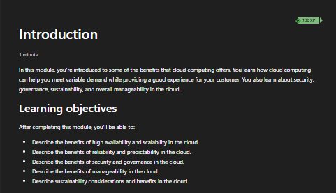

**Screenshot evidence:** Microsoft Learn shows the Lab 03 cloud benefits module and its AZ-900-relevant learning objectives.

---

### Step 2: Review High Availability

1. Opened the high availability section.
2. Reviewed how availability relates to uptime.
3. Reviewed how service-level agreements can represent expected uptime.
4. Documented that higher availability can reduce downtime but may increase cost.

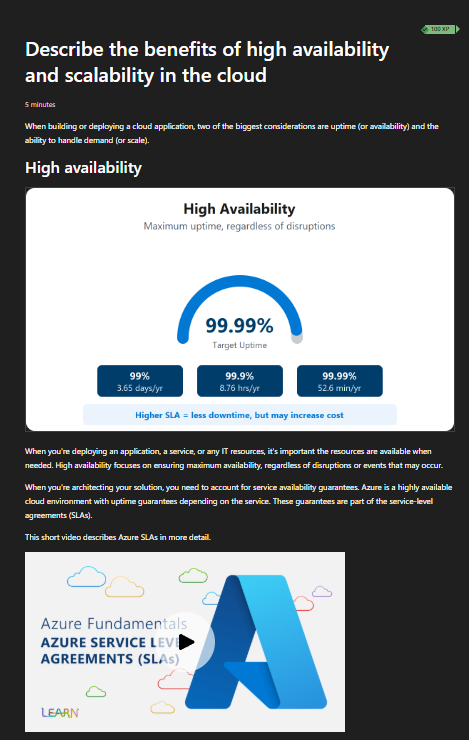

**Screenshot evidence:** Microsoft Learn describes high availability as maximum uptime regardless of disruptions.

---

### Step 3: Review Scalability

1. Opened the scalability section.
2. Reviewed vertical scaling.
3. Reviewed horizontal scaling.
4. Documented how scaling changes capacity to meet demand.
5. Connected scalability to consumption-based pricing.

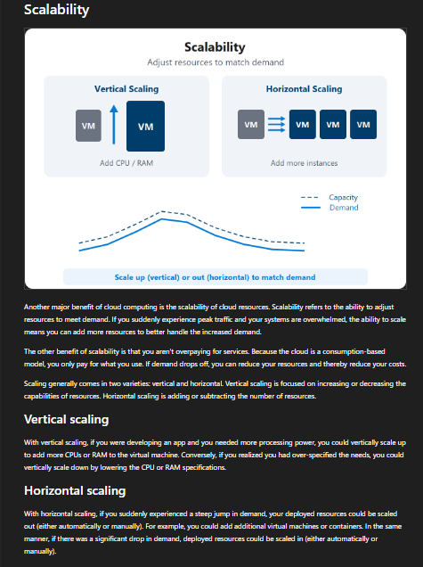

**Screenshot evidence:** Microsoft Learn shows vertical scaling and horizontal scaling as methods for adjusting resources to match demand.

---

### Step 4: Review Reliability

1. Opened the reliability section.
2. Reviewed how reliability supports recovery from failure.
3. Reviewed the idea of using decentralized design across regions.
4. Connected reliability to business continuity and fault tolerance.

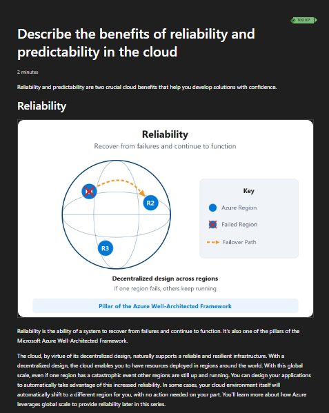

**Screenshot evidence:** Microsoft Learn describes reliability as the ability to recover from failures and continue functioning.

---

### Step 5: Review Predictability

1. Opened the predictability section.
2. Reviewed performance predictability.
3. Reviewed cost predictability.
4. Documented how predictability helps with planning, monitoring, and forecasting.

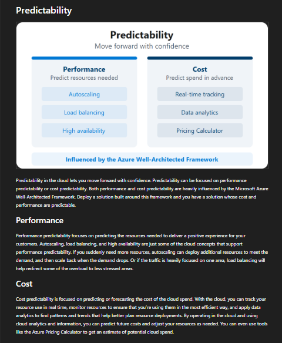

**Screenshot evidence:** Microsoft Learn shows predictability as a cloud benefit that supports performance planning and cost planning.

---

### Step 6: Review Security and Governance

1. Opened the security and governance section.
2. Reviewed governance templates and standards.
3. Reviewed compliance, auditing, and remediation concepts.
4. Reviewed how security and governance help control cloud environments.
5. Connected the concept to regulated IT environments.

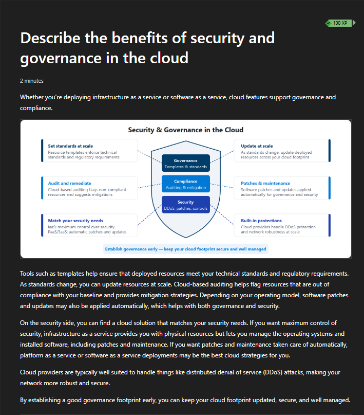

**Screenshot evidence:** Microsoft Learn shows security and governance features such as standards, auditing, compliance, patching, and built-in protections.

---

### Step 7: Review Management of the Cloud

1. Opened the manageability section.
2. Reviewed management of cloud resources.
3. Documented management features such as:
   - Auto-scale
   - Templates
   - Health monitoring
   - Alerts

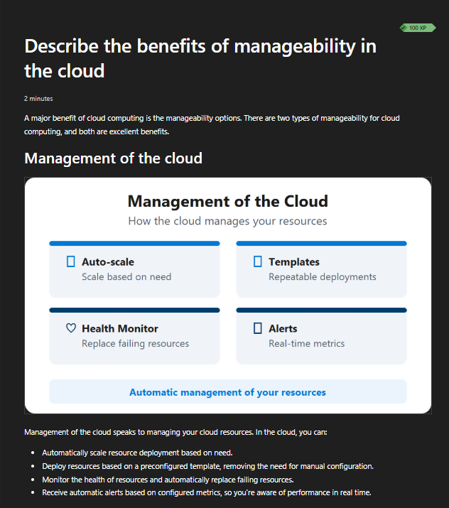

**Screenshot evidence:** Microsoft Learn shows cloud management capabilities that help manage resources automatically.

---

### Step 8: Review Management in the Cloud

1. Continued reviewing manageability concepts.
2. Reviewed tools used to manage cloud resources.
3. Documented common management options:
   - Web portal
   - CLI
   - APIs
   - PowerShell

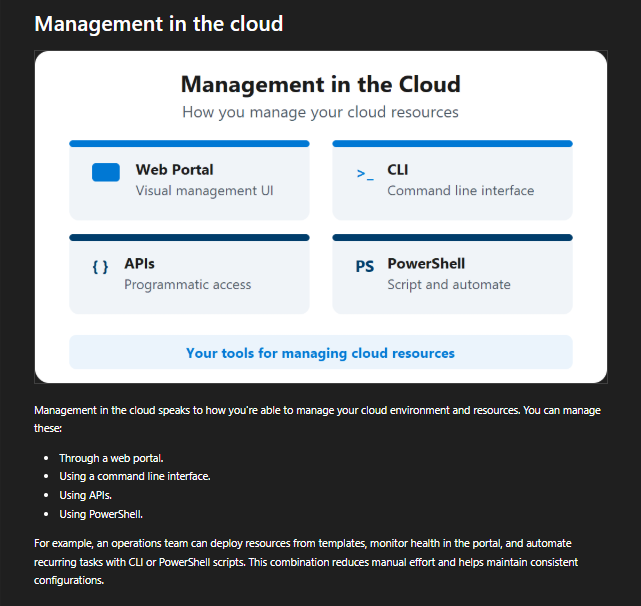

**Screenshot evidence:** Microsoft Learn shows common cloud management tools, including the portal, CLI, APIs, and PowerShell.

---

### Step 9: Compare Cloud Service Models

1. Opened the cloud service model section.
2. Reviewed the responsibility comparison across IaaS, PaaS, and SaaS.
3. Documented which layers the customer manages and which layers the provider manages.

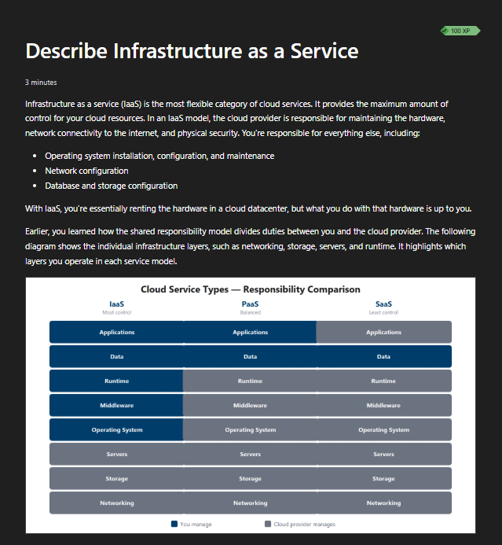

**Screenshot evidence:** Microsoft Learn compares responsibility boundaries across IaaS, PaaS, and SaaS.

---

### Step 10: Review IaaS Responsibility Focus

1. Opened the IaaS section.
2. Reviewed how IaaS provides the most control.
3. Documented that IaaS also creates the most customer responsibility.
4. Reviewed common IaaS scenarios such as lift-and-shift migration and testing environments.

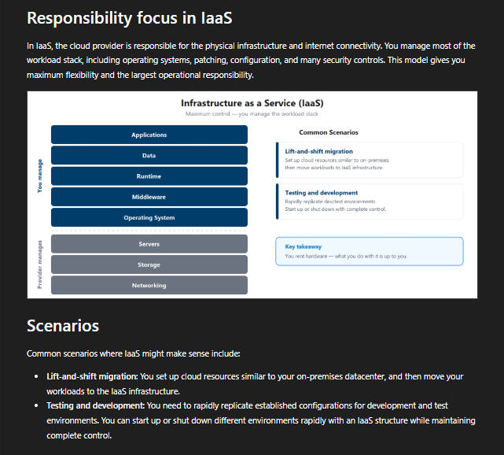

**Screenshot evidence:** Microsoft Learn shows that IaaS gives the customer control over most of the workload stack.

---

### Step 11: Review PaaS Responsibility Focus

1. Opened the PaaS section.
2. Reviewed how PaaS provides a managed platform for applications.
3. Documented that the customer focuses more on applications and data.
4. Reviewed common PaaS scenarios such as development frameworks and analytics.

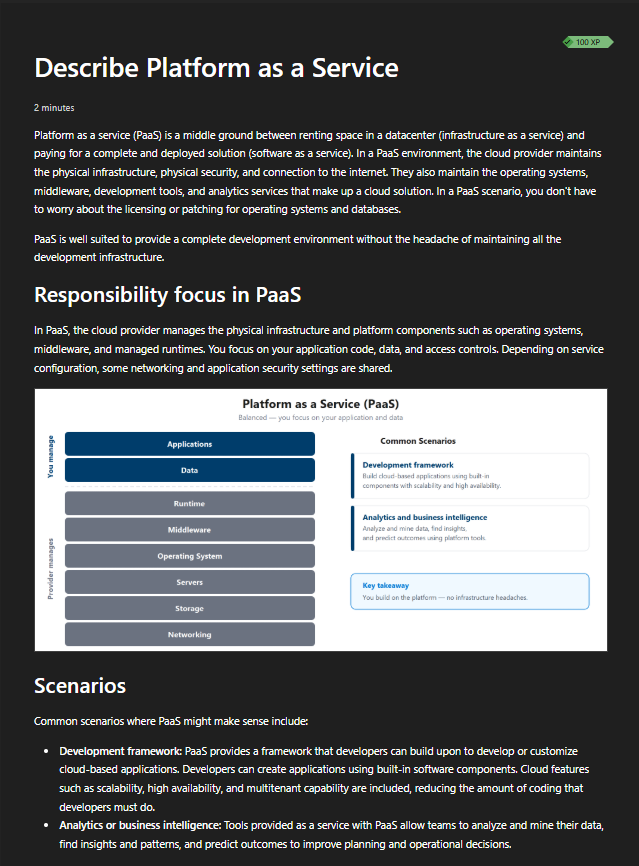

**Screenshot evidence:** Microsoft Learn shows that PaaS balances provider-managed infrastructure with customer-managed applications and data.

---

### Step 12: Review SaaS Responsibility Focus

1. Opened the SaaS section.
2. Reviewed how SaaS provides a fully developed application experience.
3. Documented that the customer still manages data, identity, and access settings.
4. Reviewed common SaaS examples such as email, messaging, and productivity applications.

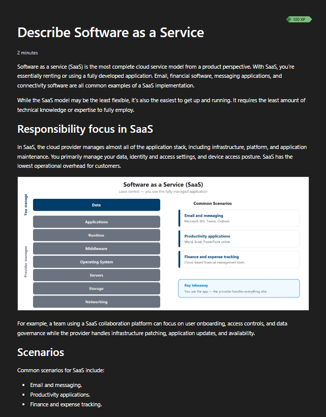

**Screenshot evidence:** Microsoft Learn shows that SaaS has the lowest operational overhead while the customer still manages data and access-related responsibilities.

---

### Step 13: Identify Azure Virtual Machines as an IaaS Example

1. Opened the Azure portal.
2. Searched for **Virtual machines**.
3. Opened the Virtual Machines service page.
4. Confirmed that no virtual machines existed.
5. Did not create a virtual machine.
6. Redacted account and directory information.

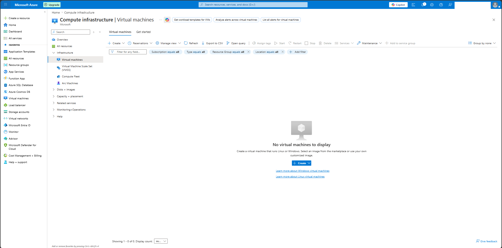

**Screenshot evidence:** The Azure portal shows the Virtual Machines service page with no virtual machines deployed.

---

### Step 14: Identify Azure App Service as a PaaS Example

1. Opened the Azure portal.
2. Searched for **App Services**.
3. Opened the App Services service page.
4. Confirmed that no app services existed.
5. Did not create an app service.
6. Redacted account and directory information.

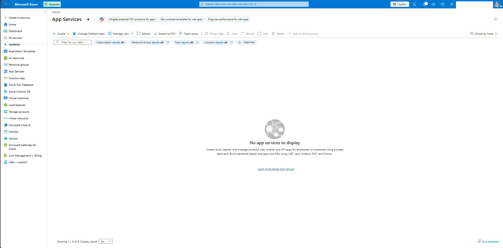

**Screenshot evidence:** The Azure portal shows the App Services page with no app services deployed.

---

### Step 15: Perform Final Cost Validation

1. Opened Azure Cost Management.
2. Reviewed the subscription budget.
3. Confirmed that the monthly budget remained active.
4. Confirmed that evaluated spend remained `$0.00`.
5. Confirmed that progress remained `0.00%`.
6. Confirmed that no billable resources were created during the lab.

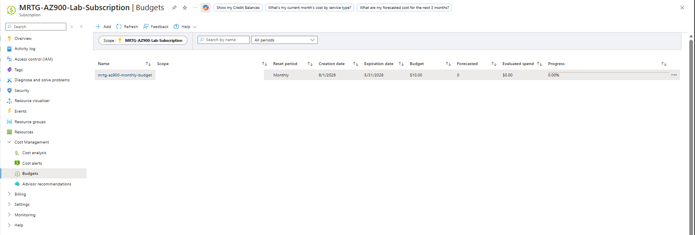

**Screenshot evidence:** The final Cost Management screenshot shows the budget is active, evaluated spend is `$0.00`, and progress is `0.00%`.

---

## Cloud Benefits Summary

### High Availability

High availability is the ability of a system to remain accessible and operational.

In Azure, high availability can be supported through:

- Service-level agreements
- Redundancy
- Regional design
- Availability zones
- Load balancing
- Failover planning

### Scalability

Scalability is the ability to increase or decrease resources to meet demand.

There are two common types:

| Scaling Type | Description |
|---|---|
| Vertical scaling | Increase or decrease the power of an existing resource |
| Horizontal scaling | Add or remove resource instances |

### Elasticity

Elasticity is related to scalability, but it focuses on automatic adjustment.

A scalable system can change capacity.

An elastic system can automatically change capacity based on demand.

### Reliability

Reliability is the ability of a system to recover from failure and continue functioning.

Reliability supports:

- Business continuity
- Fault tolerance
- Disaster recovery
- Resilient architecture
- Regional redundancy

### Predictability

Predictability helps organizations plan for performance and cost.

Predictability can include:

- Performance forecasting
- Autoscaling behavior
- Load balancing
- Cost tracking
- Pricing estimates
- Real-time monitoring

### Security and Governance

Security and governance help organizations control cloud environments.

Examples include:

- Standards
- Templates
- Compliance controls
- Auditing
- Remediation
- Patching
- Security controls
- Built-in protections

### Manageability

Manageability refers to how cloud resources are controlled, monitored, and automated.

Cloud resources can be managed through:

- Azure portal
- CLI
- APIs
- PowerShell
- Templates
- Monitoring
- Alerts
- Automation

---

## Cloud Service Models

### Infrastructure as a Service

Infrastructure as a Service provides cloud-based infrastructure such as virtual machines, storage, and networking.

With IaaS, the customer usually manages:

- Applications
- Data
- Runtime
- Middleware
- Operating system
- Some network configuration
- Some security configuration

The provider usually manages:

- Physical servers
- Physical storage
- Physical networking
- Datacenter facilities

Azure example:

```text
Azure Virtual Machines
```

### Platform as a Service

Platform as a Service provides a managed platform for building and hosting applications.

With PaaS, the customer usually manages:

- Applications
- Data
- Identity
- Access
- Application configuration

The provider usually manages:

- Runtime
- Middleware
- Operating system
- Servers
- Storage
- Networking
- Platform availability

Azure example:

```text
Azure App Service
```

### Software as a Service

Software as a Service provides a complete application that is managed mostly by the provider.

With SaaS, the customer usually manages:

- Users
- Data
- Identity
- Access
- Configuration
- Security settings

The provider usually manages:

- Application platform
- Runtime
- Middleware
- Operating system
- Servers
- Storage
- Networking
- Application maintenance

Common examples:

```text
Email and messaging
Productivity applications
Finance and expense tracking
```

---

## Service Model Comparison

| Service Model | Customer Control | Customer Responsibility | Provider Responsibility | Example |
|---|---|---|---|---|
| IaaS | Highest | Highest | Lower | Azure Virtual Machines |
| PaaS | Medium | Medium | Medium to high | Azure App Service |
| SaaS | Lowest | Lowest operational responsibility | Highest | Microsoft 365-style productivity services |

### Key Takeaway

IaaS gives more control but requires more management.

PaaS reduces infrastructure management and lets teams focus on applications and data.

SaaS reduces operational overhead the most, but the customer still owns identity, access, data, and configuration decisions.

---

## CapEx vs OpEx

Cloud computing changes how organizations think about spending.

### Capital Expenditure

Capital expenditure is money spent up front on physical infrastructure.

Examples include:

- Servers
- Storage hardware
- Network equipment
- Datacenter space
- Hardware refresh cycles

### Operational Expenditure

Operational expenditure is ongoing spending based on usage or service consumption.

Examples include:

- Cloud compute usage
- Storage usage
- Network transfer
- Managed services
- Licensing
- Monitoring and backup costs

### Cloud Cost Takeaway

Cloud computing often shifts spending from large up-front purchases to ongoing usage-based costs.

This creates flexibility, but it also requires cost monitoring and governance.

---

## Service Selection Guidance

| Requirement | Best Fit | Reason |
|---|---|---|
| Maximum control over operating system | IaaS | Customer controls the VM operating system and workload stack |
| Lift-and-shift migration | IaaS | Existing server workloads can often move to virtual machines |
| Application hosting without OS management | PaaS | Provider manages the platform and infrastructure |
| Fast development environment | PaaS | Developers can focus on application code |
| Fully managed productivity application | SaaS | Provider manages most application and infrastructure layers |
| Lowest infrastructure management | SaaS | Customer focuses mainly on users, data, access, and configuration |
| Regulated workload requiring detailed control | Often IaaS or PaaS | Depends on compliance, audit, identity, and data requirements |

---

## Validation

| Validation Check | Expected Result | Observed Result | Status |
|---|---|---|---|
| Microsoft Learn cloud benefits reviewed | Cloud benefits module is located | Module introduction and objectives were reviewed | Passed |
| High availability reviewed | High availability concept is documented | High availability content was captured | Passed |
| Scalability reviewed | Scaling concepts are documented | Vertical and horizontal scaling were captured | Passed |
| Reliability reviewed | Reliability concept is documented | Reliability content was captured | Passed |
| Predictability reviewed | Performance and cost predictability are documented | Predictability content was captured | Passed |
| Security and governance reviewed | Governance and security benefits are documented | Security and governance content was captured | Passed |
| Manageability reviewed | Management options are documented | Management of the cloud and in the cloud were captured | Passed |
| IaaS, PaaS, and SaaS compared | Service models are compared | Responsibility comparison was captured | Passed |
| IaaS example identified | Azure IaaS service located | Azure Virtual Machines page was opened | Passed |
| PaaS example identified | Azure PaaS service located | Azure App Service page was opened | Passed |
| No VM created | No virtual machines deployed | Virtual Machines page showed no VMs | Passed |
| No App Service created | No app services deployed | App Services page showed no app services | Passed |
| Final cost validation | Spend remains `$0.00` | Evaluated spend showed `$0.00` | Passed |

---

## Completion Checklist

- [x] Reviewed Microsoft Learn cloud benefits module
- [x] Documented high availability
- [x] Documented scalability
- [x] Documented elasticity
- [x] Documented reliability
- [x] Documented predictability
- [x] Documented security and governance
- [x] Documented manageability
- [x] Compared IaaS, PaaS, and SaaS
- [x] Identified Azure Virtual Machines as IaaS
- [x] Identified Azure App Service as PaaS
- [x] Reviewed SaaS responsibility focus
- [x] Did not create virtual machines
- [x] Did not create app services
- [x] Did not deploy paid Azure resources
- [x] Validated budget remained active
- [x] Validated evaluated spend remained `$0.00`
- [x] Sanitized screenshots before upload
- [x] Avoided exposing tenant, subscription, or account details

---

## AZ-900 Exam Objective Coverage

### Primary Exam Domain

```text
Describe cloud concepts
```

### Secondary Exam Domain

```text
Describe Azure architecture and services
```

### Skills Measured

This lab supports the ability to:

- Describe the benefits of high availability
- Describe the benefits of scalability
- Describe the benefits of elasticity
- Describe the benefits of reliability
- Describe the benefits of predictability
- Describe the benefits of security and governance
- Describe the benefits of manageability
- Describe Infrastructure as a Service
- Describe Platform as a Service
- Describe Software as a Service
- Identify use cases for IaaS, PaaS, and SaaS
- Describe consumption-based pricing
- Describe the difference between CapEx and OpEx
- Identify Azure service examples for cloud service models

### How This Lab Supports the Objectives

This lab connects official AZ-900 concepts to real Azure services.

It demonstrates:

- How cloud benefits support business outcomes
- How service models change responsibility boundaries
- How Azure portal service discovery supports cloud administration
- How Cost Management validates that no billable resources were deployed

---

## Mini Objective Coverage

By completing this lab, I can now:

- Explain high availability in simple terms
- Explain the difference between vertical and horizontal scaling
- Explain elasticity as automatic scaling behavior
- Explain reliability as recovery from failure
- Explain predictability for performance and cost planning
- Describe how governance supports standards and compliance
- Describe how manageability supports operations and automation
- Compare IaaS, PaaS, and SaaS
- Identify Azure Virtual Machines as IaaS
- Identify Azure App Service as PaaS
- Explain why SaaS still requires customer-managed identity and data controls
- Validate cost impact after service discovery

---

## IAM / Security Relevance

Cloud service models directly affect IAM and security responsibility.

Even when the cloud provider manages more infrastructure, the customer remains responsible for identity, access, data, and configuration decisions.

### IAM Responsibility by Service Model

| Service Model | IAM Responsibility |
|---|---|
| IaaS | Customer manages OS access, application access, identity integration, local permissions, and role assignments |
| PaaS | Customer manages application access, data access, identity integration, and service configuration |
| SaaS | Customer manages users, groups, roles, access policies, data governance, and security settings |

### Why This Matters for Regulated IT

In government, defense, healthcare, finance, and other regulated environments, cloud responsibility boundaries must be understood clearly.

Important areas include:

- Least privilege
- Role-based access control
- Identity lifecycle management
- Audit logging
- Data protection
- Compliance evidence
- Security baselines
- Governance standards
- Privileged access
- Configuration control

### Security Takeaway

The provider may manage the infrastructure, but the customer still owns access decisions.

Identity is never something to ignore just because a workload moved to the cloud.

---

## Governance Notes

### Governance Decisions

| Decision | Implementation | Reason |
|---|---|---|
| Used Microsoft Learn | Official AZ-900 concept source | Aligns the lab with exam objectives |
| Used Azure portal discovery | Practical Azure service identification | Connects theory to real Azure navigation |
| Did not create resources | Service discovery only | Prevents unnecessary cost |
| Reviewed Cost Management | Final cost validation | Confirms spend stayed at `$0.00` |
| Redacted sensitive details | Account and directory details covered | Prevents public exposure |
| Retained budget | `$10.00` monthly budget | Maintains cost visibility |

### Governance Lesson

Understanding cloud benefits is not enough.

Organizations also need clear ownership, cost controls, identity controls, and service selection standards before deploying workloads.

---

## Cost Considerations

### Estimated Lab Cost

```text
Estimated cost: $0.00
```

### Why Cost Stayed at Zero

This lab did not create:

- Virtual machines
- App services
- App Service plans
- Storage accounts
- Databases
- Public IP addresses
- Virtual networks
- Load balancers
- Log Analytics workspaces
- Defender upgrades
- Backup services

### Cost Controls Used

- Used Microsoft Learn for concept review
- Used Azure portal service discovery only
- Avoided create workflows
- Reviewed the existing budget
- Confirmed evaluated spend remained `$0.00`
- Confirmed budget progress remained `0.00%`

### Cost Reminder

Azure budgets provide notifications.

They do not automatically stop resources, delete resources, or guarantee a hard spending cap.

---

## Troubleshooting Notes

### Issue 1: Azure Portal Service Pages Include Create Buttons

**Symptom:**

Azure service pages such as Virtual Machines and App Services include visible **Create** buttons.

**Risk:**

Clicking through a create workflow can deploy billable resources.

**Resolution:**

The pages were opened only for service discovery. No resources were created.

**Result:**

The lab remained cost-safe.

---

### Issue 2: Sensitive Account Information Appeared in Azure Portal Screenshots

**Symptom:**

Azure portal pages can show account names, directory names, and profile information in the top-right corner.

**Risk:**

Publishing screenshots without redaction can expose cloud environment information.

**Resolution:**

The account and directory area was covered before upload.

**Result:**

Screenshots were safe for public documentation.

---

### Issue 3: Cost Management Scope Can Expose Subscription Identifiers

**Symptom:**

Cost Management pages may show subscription identifiers or scope values.

**Risk:**

Subscription IDs and GUIDs should not be published publicly.

**Resolution:**

Sensitive scope information was redacted where needed.

**Result:**

Cost validation evidence was documented without exposing sensitive identifiers.

---

## What I Would Do Differently in Production

A production environment would include more formal planning and controls, including:

- Cloud adoption framework review
- Formal service selection standards
- Approved service catalog
- Workload classification
- Data classification
- Identity and access design
- Role-based access control
- Conditional Access
- Privileged Identity Management
- Required tagging policy
- Azure Policy assignments
- Management groups
- Separate subscriptions by workload or environment
- Centralized logging
- Security monitoring
- Cost allocation
- Budget ownership
- Change-management approval
- Infrastructure as code
- Compliance mapping

This lab stayed lightweight because its purpose was AZ-900 concept validation and safe Azure service discovery.

---

## Lessons Learned

- Cloud benefits should be tied to business outcomes.
- High availability focuses on uptime.
- Scalability changes capacity to match demand.
- Elasticity automates scaling behavior.
- Reliability helps systems recover from failure.
- Predictability helps with performance and cost planning.
- Security and governance support standards, compliance, and control.
- Manageability improves operational visibility and automation.
- IaaS gives the most control but also the most responsibility.
- PaaS reduces infrastructure management.
- SaaS reduces operational overhead but does not remove customer responsibility.
- Identity, access, data, and configuration remain customer responsibilities.
- Azure services can be explored without creating resources.
- Cost validation should be performed after every lab.

### Technical Takeaway

Cloud service models define how much control the customer has and how much responsibility the provider takes on.

### Business Takeaway

Choosing the right cloud service model affects cost, speed, flexibility, staffing, compliance, and operational risk.

### Security Takeaway

The customer always remains responsible for identity, access, and data protection decisions.

### Exam Takeaway

For AZ-900, remember:

- High availability means staying online.
- Scalability means changing capacity.
- Elasticity means automatic scaling.
- Reliability means recovering from failure.
- Predictability supports performance and cost planning.
- IaaS gives the most control and most customer responsibility.
- PaaS balances control and provider management.
- SaaS provides the least infrastructure responsibility but still requires customer-managed identity, access, and data controls.

---

## Cleanup

### Resources Retained

| Resource or Configuration | Reason |
|---|---|
| MRTG Azure subscription | Required for future labs |
| Monthly budget | Required for ongoing cost visibility |
| Lab 01 resource group | Retained as the foundational lab resource group |
| Lab 03 screenshots | Required for documentation evidence |

### Resources Removed

No Azure resources were created during this lab.

### Cleanup Validation

- [x] No virtual machines were created
- [x] No app services were created
- [x] No App Service plans were created
- [x] No storage accounts were created
- [x] No databases were created
- [x] No public IP addresses were created
- [x] No premium services were enabled
- [x] Budget remained active
- [x] Evaluated spend remained `$0.00`
- [x] Budget progress remained `0.00%`

---

## Outcome

This lab documented the major cloud benefits and cloud service models required for AZ-900.

The completed lab demonstrates:

- Understanding of high availability
- Understanding of scalability and elasticity
- Understanding of reliability
- Understanding of predictability
- Understanding of security and governance benefits
- Understanding of manageability benefits
- Understanding of IaaS, PaaS, and SaaS responsibility boundaries
- Azure Virtual Machines identified as IaaS
- Azure App Service identified as PaaS
- SaaS responsibility focus documented through Microsoft Learn
- No billable Azure resources deployed
- Final evaluated spend of `$0.00`

---

## Screenshot Inventory

| Screenshot | Description |
|---|---|
| `01-microsoft-learn-cloud-benefits.png` | Microsoft Learn cloud benefits module |
| `02-high-availability.png` | High availability concept |
| `03-scalability.png` | Vertical and horizontal scaling |
| `04-reliability.png` | Reliability and failure recovery |
| `05-predictability.png` | Performance and cost predictability |
| `06-security-and-governance.png` | Security and governance benefits |
| `07-management-of-the-cloud.png` | Cloud resource management features |
| `08-management-in-the-cloud.png` | Cloud management tools |
| `09-cloud-service-models-comparison.png` | IaaS, PaaS, and SaaS responsibility comparison |
| `10-iaas-responsibility-focus.png` | IaaS responsibility focus |
| `11-paas-responsibility-focus.png` | PaaS responsibility focus |
| `12-saas-responsibility-focus.png` | SaaS responsibility focus |
| `13-azure-virtual-machines-iaas.png` | Azure Virtual Machines IaaS service discovery |
| `14-azure-app-service-paas.png` | Azure App Service PaaS service discovery |
| `15-cost-management-final-validation.png` | Final Cost Management validation |

---

## Next Lab

The next lab is:

```text
Lab 04 - Azure Architecture and Resource Hierarchy
```

The next lab will build on this foundation by examining:

- Azure regions
- Region pairs
- Availability zones
- Resource groups
- Subscriptions
- Management groups
- Azure Resource Manager
- Resource hierarchy
- Governance scopes
- How Azure structure supports administration and IAM
