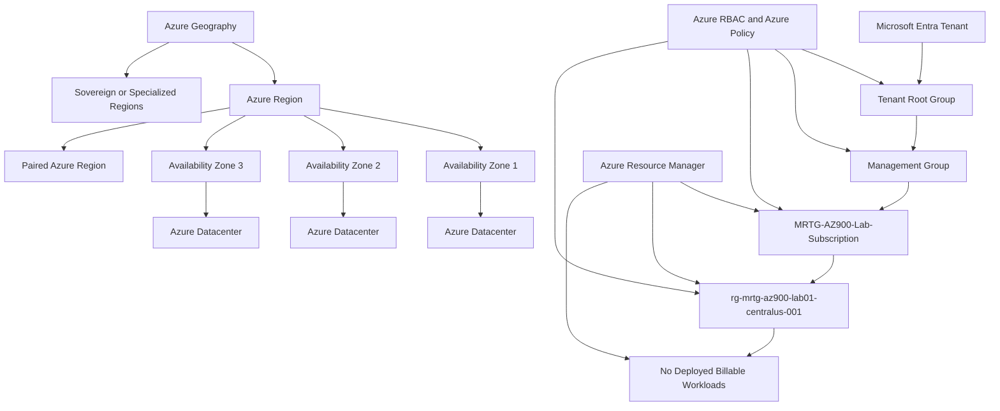

# Lab 04 - Azure Architecture and Resource Hierarchy

## Objective

Document the core architectural components of Microsoft Azure and explain how Azure organizes physical infrastructure, management infrastructure, resources, and governance scopes.

By completing this lab, I:

- Reviewed Azure physical infrastructure
- Documented Azure geographies, regions, availability zones, and datacenters
- Reviewed Azure region pairs and sovereign regions
- Documented Azure resources, resource groups, subscriptions, and management groups
- Reviewed the Azure resource hierarchy
- Validated the existing MRTG Azure subscription
- Validated the existing Lab 01 resource group
- Reviewed the Tenant Root Group hierarchy
- Reviewed Azure Resource Manager as the Azure deployment and management layer
- Confirmed that no billable resources were created
- Validated that evaluated Azure spend remained `$0.00`

This was a discovery-only lab. No Azure resources or configurations were created or modified.

---

## Business Problem Solved

Azure environments can become difficult to manage when an organization does not understand how Azure structures resources, governance, access control, billing, and regional infrastructure.

Monroe Redstone Technology Group needed to understand the Azure architecture model before deploying additional services.

This lab addressed the following questions:

- What is an Azure geography?
- What is an Azure region?
- What is an availability zone?
- What is a region pair?
- Why do sovereign regions exist?
- What is an Azure resource?
- What is a resource group?
- What is an Azure subscription?
- What is a management group?
- What is Azure Resource Manager?
- How do Azure governance scopes relate to IAM and security?

Understanding these concepts helps prevent poor architecture, governance, identity, cost, and resource-organization decisions.

---

## Scenario

MRTG completed the first three Azure Fundamentals labs:

- Lab 01 established the Azure environment and cost controls.
- Lab 02 documented cloud computing and shared responsibility.
- Lab 03 documented cloud benefits and service models.

In Lab 04, MRTG reviews how Azure is structured physically and logically.

The organization needs to understand how:

- Microsoft organizes global Azure infrastructure
- Resources are deployed into Azure regions
- Availability zones support resiliency
- Region pairs support recovery planning
- Resources are organized into resource groups
- Subscriptions provide billing and access boundaries
- Management groups provide higher-level governance
- Azure Resource Manager provides a consistent management layer
- Governance and access can inherit through Azure scopes

No new Azure resources are created during this lab.

---

## Azure Services and Resources Used

| Azure Service, Resource, or Platform | Purpose |
|---|---|
| Microsoft Learn | Provided certification-aligned Azure architecture instruction |
| Azure Portal | Supported practical review of subscriptions, resource groups, and management groups |
| Azure Resource Manager | Demonstrated the Azure deployment and management layer |
| Azure Subscription | Demonstrated a billing, access-control, governance, and resource boundary |
| Azure Resource Group | Demonstrated logical resource organization and lifecycle management |
| Azure Management Groups | Demonstrated governance above the subscription scope |
| Azure Cost Management | Supported final spending validation |
| Azure Budgets | Confirmed that evaluated spend remained `$0.00` |

---

## Why These Services Were Used

### Microsoft Learn

Microsoft Learn was used as the primary certification-aligned source for Azure architecture concepts.

It provided structured coverage of:

- Azure geographies
- Azure regions
- Region pairs
- Sovereign regions
- Availability zones
- Azure datacenters
- Azure resources
- Resource groups
- Subscriptions
- Management groups
- Resource hierarchy

### Azure Portal

The Azure Portal was used to connect Microsoft Learn concepts to the existing MRTG Azure environment.

It supported practical validation of:

- Subscription status
- Subscription role
- Parent management group
- Resource group organization
- Resource group location
- Resource group metadata
- Management group hierarchy
- Cost status

### Azure Resource Manager

Azure Resource Manager is the management and deployment layer for Azure.

It was reviewed because Azure management requests from the following interfaces are processed through Azure Resource Manager:

- Azure Portal
- Azure CLI
- Azure PowerShell
- REST APIs
- Software development kits
- ARM templates
- Bicep

Azure Resource Manager also supports management capabilities such as:

- Azure RBAC
- Resource tags
- Resource locks
- Deployments
- Resource organization
- Policy integration

### Azure Subscription

The existing MRTG subscription was reviewed because subscriptions provide boundaries for:

- Billing
- Cost Management
- Azure RBAC
- Azure Policy
- Resource deployment
- Service quotas
- Administration

### Azure Resource Group

The Lab 01 resource group was reviewed as an example of a logical container for Azure resources sharing a common purpose or lifecycle.

### Azure Management Groups

Management groups were reviewed because they provide governance scopes above subscriptions.

They can help organizations apply consistent:

- Azure Policy assignments
- Azure RBAC assignments
- Governance standards
- Compliance requirements

### Azure Cost Management

Azure Cost Management was reviewed to confirm that architecture and hierarchy discovery did not increase Azure spending.

### Azure Budgets

The existing monthly budget provided evidence that:

- The `$10.00` monthly budget remained active
- Evaluated spend remained `$0.00`
- Budget progress remained `0.00%`

---

## Environment

| Item | Value |
|---|---|
| Organization | Monroe Redstone Technology Group |
| Project | MRTG Azure Fundamentals: The Bridge |
| Lab | Lab 04 - Azure Architecture and Resource Hierarchy |
| Cloud Platform | Microsoft Azure |
| Management Interface | Azure Portal |
| Learning Platform | Microsoft Learn |
| Subscription | `MRTG-AZ900-Lab-Subscription` |
| Subscription Status | Active |
| Subscription Role | Owner |
| Parent Management Group | Tenant Root Group |
| Existing Resource Group | `rg-mrtg-az900-lab01-centralus-001` |
| Resource Group Location | `Central US` |
| New Resource Group | None |
| Azure Resources Created | None |
| Monthly Budget | `$10.00` |
| Evaluated Spend | `$0.00` |
| Budget Progress | `0.00%` |
| Documentation Platform | GitHub |
| Lab Type | Discovery-only |
| Estimated Cost | `$0.00` |

---

## Architecture / Concept Diagram



---

## Steps Performed

### Step 1: Review the Azure Architecture Module

1. Opened Microsoft Learn.
2. Located the **Describe the core architectural components of Azure** module.
3. Reviewed the learning objectives.
4. Confirmed that the module covered:
   - Azure regions
   - Region pairs
   - Sovereign regions
   - Availability zones
   - Azure datacenters
   - Azure resources
   - Resource groups
   - Subscriptions
   - Management groups
   - Resource hierarchy


**Validation:** Microsoft Learn displayed the Azure architecture module and its AZ-900-aligned objectives.

---

### Step 2: Review Azure Physical Infrastructure

1. Opened the Azure physical infrastructure section.
2. Reviewed how Microsoft organizes Azure infrastructure globally.
3. Documented the relationship between:
   - Geography
   - Region
   - Availability zone
   - Datacenter
4. Confirmed that Azure resources are commonly deployed to regions.
5. Confirmed that Microsoft manages the underlying datacenter infrastructure.


**Validation:** Microsoft Learn displayed the relationship between Azure geographies, regions, availability zones, and datacenters.

---

### Step 3: Review Azure Regions

1. Opened the Azure regions section.
2. Documented that an Azure region is a geographic area containing one or more nearby datacenters.
3. Reviewed how datacenters within a region are connected through low-latency networking.
4. Confirmed that many Azure resources require region selection.
5. Documented that some Azure services operate globally rather than within a selected region.


**Validation:** Microsoft Learn described Azure regions as geographic areas containing connected datacenters.

---

### Step 4: Review Availability Zones

1. Opened the availability zones section.
2. Documented that availability zones are physically separate locations within supported Azure regions.
3. Reviewed how each zone can include independent:
   - Power
   - Cooling
   - Networking
4. Connected availability zones to datacenter-level failure protection.
5. Confirmed that not every Azure region or service supports availability zones.


**Validation:** Microsoft Learn displayed availability zones as physically separate locations within an Azure region.

---

### Step 5: Review Availability Zone Service Categories

1. Reviewed how Azure services use availability zones.
2. Documented the difference between:
   - Zonal services
   - Zone-redundant services
   - Non-regional services
3. Connected each service type to resilience planning.
4. Documented that availability architecture depends on the selected Azure service.


**Validation:** Microsoft Learn displayed zonal, zone-redundant, and non-regional service patterns.

---

### Step 6: Review Region Pairs

1. Opened the Azure region-pair section.
2. Documented that Microsoft pairs many regions within the same geography.
3. Reviewed how region pairs can support:
   - Disaster recovery
   - Service restoration
   - Geographic resiliency
   - Data-residency requirements
4. Documented that region pairing does not automatically replicate every Azure service.


**Validation:** Microsoft Learn displayed Azure region pairs and their role in recovery planning.

---

### Step 7: Review Region-Pair Advantages

1. Continued reviewing region-pair behavior.
2. Documented potential advantages such as:
   - Prioritized restoration
   - Planned update sequencing
   - Same-geography pairing
3. Reviewed limitations and exceptions.
4. Documented that organizations must still configure service-specific replication and failover.


**Validation:** Microsoft Learn documented region-pair advantages and limitations.

---

### Step 8: Review Sovereign Regions

1. Opened the sovereign regions section.
2. Documented that sovereign regions are isolated Azure environments designed for legal, compliance, or regulatory requirements.
3. Reviewed examples involving:
   - United States government regions
   - Azure regions in China
4. Connected sovereign regions to government, defense, and regulated workloads.


**Validation:** Microsoft Learn described sovereign regions and their compliance-focused use cases.

---

### Step 9: Review Azure Resources and Resource Groups

1. Opened the Azure management infrastructure section.
2. Reviewed Azure resources and resource groups.
3. Documented that an Azure resource is a manageable item created in Azure.
4. Documented that each resource belongs to one resource group at a time.
5. Reviewed resource group characteristics:
   - Resource groups cannot be nested.
   - Resource groups cannot be renamed after creation.
   - Resources can be moved between resource groups when supported.
   - Deleting a resource group deletes the resources contained within it.
   - Azure RBAC assignments can be applied at resource group scope.


**Validation:** Microsoft Learn documented Azure resources and the primary rules governing resource groups.

---

### Step 10: Review Azure Subscriptions

1. Opened the Azure subscriptions section.
2. Documented that subscriptions are management, billing, governance, and scale boundaries.
3. Reviewed subscriptions as:
   - Billing boundaries
   - Access-control boundaries
4. Documented that organizations can use multiple subscriptions to separate:
   - Environments
   - Departments
   - Projects
   - Billing responsibilities
   - Administrative requirements


**Validation:** Microsoft Learn described Azure subscriptions as billing and access-control boundaries.

---

### Step 11: Review Azure Management Groups

1. Opened the Azure management groups section.
2. Documented that management groups sit above subscriptions.
3. Reviewed how management groups can apply governance across multiple subscriptions.
4. Documented that each Microsoft Entra tenant contains a Tenant Root Group.
5. Connected management groups to Azure Policy and Azure RBAC inheritance.


**Validation:** Microsoft Learn described management groups as higher-level governance containers for subscriptions.

---

### Step 12: Review the Azure Resource Hierarchy

1. Reviewed the Azure management hierarchy.
2. Documented the following structure:
   - Tenant Root Group
   - Management group
   - Subscription
   - Resource group
   - Resource
3. Reviewed how Azure Policy and Azure RBAC can inherit downward through the hierarchy.
4. Connected hierarchy design to least privilege and governance.


**Validation:** Microsoft Learn displayed the Azure resource hierarchy and downward inheritance model.

---

### Step 13: Validate the MRTG Subscription

1. Opened the Azure Portal.
2. Navigated to **Subscriptions**.
3. Confirmed that `MRTG-AZ900-Lab-Subscription` was visible.
4. Confirmed that the subscription role was Owner.
5. Confirmed that the current cost was `0.00`.
6. Confirmed that the subscription was located under the Tenant Root Group.
7. Confirmed that the subscription status was Active.
8. Redacted sensitive account and subscription identifiers.


**Validation:** The Azure Portal showed the MRTG subscription as Active, assigned beneath the Tenant Root Group, and reporting no current cost.

---

### Step 14: Validate the Resource Group List

1. Opened **Resource groups** in the Azure Portal.
2. Confirmed that the existing Lab 01 resource group was present.
3. Confirmed that the resource group belonged to the MRTG subscription.
4. Confirmed that the resource group location was Central US.
5. Confirmed that no new resource group was created.


**Validation:** The Azure Portal displayed the existing Lab 01 resource group within the MRTG subscription.

---

### Step 15: Validate the Lab Resource Group

1. Opened `rg-mrtg-az900-lab01-centralus-001`.
2. Confirmed the resource group name.
3. Confirmed the subscription association.
4. Confirmed that the location was Central US.
5. Confirmed that no deployments were present.
6. Confirmed that the MRTG tags were visible.
7. Confirmed that the resource group acted as a logical resource container.


**Validation:** The resource group displayed its location, subscription association, tags, and empty deployment state.

---

### Step 16: Validate the Management Group Hierarchy

1. Opened **Management groups** in Azure Resource Manager.
2. Reviewed the Tenant Root Group.
3. Confirmed that the MRTG subscription was listed beneath the Tenant Root Group.
4. Confirmed that no additional management groups had been created.
5. Confirmed that no subscription was moved.
6. Redacted sensitive identifiers before publishing the screenshot.


**Validation:** The Azure Portal displayed the MRTG subscription beneath the Tenant Root Group.

---

### Step 17: Review Azure Resource Manager

1. Opened Microsoft documentation for Azure Resource Manager.
2. Reviewed Azure Resource Manager as the deployment and management service for Azure.
3. Documented that Azure Resource Manager provides the management layer for creating, updating, and deleting resources.
4. Reviewed how management requests from the following interfaces pass through Azure Resource Manager:
   - Azure Portal
   - Azure PowerShell
   - Azure CLI
   - REST APIs
   - Software development kits
5. Documented that Azure Resource Manager supports:
   - Access control
   - Tags
   - Locks
   - Deployments
   - Resource organization


**Validation:** Microsoft documentation described Azure Resource Manager as the consistent management layer for Azure resources.

---

### Step 18: Perform Final Cost Validation

1. Opened Azure Cost Management.
2. Reviewed the existing subscription budget.
3. Confirmed that the monthly budget remained active.
4. Confirmed that evaluated spend remained `$0.00`.
5. Confirmed that budget progress remained `0.00%`.
6. Confirmed that no billable resources were created during the lab.
7. Redacted sensitive scope identifiers.


**Validation:** The final Cost Management review showed the active monthly budget, `$0.00` evaluated spend, and `0.00%` progress.

---

## Azure Physical Infrastructure Summary

Azure physical infrastructure describes how Microsoft organizes datacenters and supporting infrastructure globally.

### Geography

An Azure geography is a defined area that can support:

- Data residency
- Regulatory requirements
- Compliance requirements
- Regional service availability

A geography can contain multiple Azure regions.

### Region

An Azure region is a geographic area containing one or more nearby datacenters connected through low-latency networking.

Azure regions support:

- Resource deployment
- Regional service availability
- Data location decisions
- Resiliency planning
- Cost and performance decisions

### Availability Zone

An availability zone is a physically separate location within a supported Azure region.

Availability zones help protect workloads from failures involving:

- Power
- Cooling
- Networking
- Individual datacenter facilities

Applications must be designed to use multiple zones when zone-level resilience is required.

### Datacenter

An Azure datacenter is a physical facility containing:

- Servers
- Storage systems
- Network equipment
- Power infrastructure
- Cooling infrastructure
- Physical security controls

Customers normally select an Azure region or availability option rather than an individual datacenter.

---

## Availability Zone Service Categories

### Zonal Services

A zonal service is deployed to a specific availability zone.

The customer selects the zone where the resource is placed.

### Zone-Redundant Services

A zone-redundant service distributes or replicates service components across multiple availability zones.

The Azure service manages much of the zone distribution.

### Non-Regional Services

Non-regional services are not deployed into a specific Azure region.

These services can operate globally.

---

## Region Pairs Summary

Many Azure regions are paired with another region in the same geography.

Region pairs can support:

- Disaster recovery planning
- Regional resilience
- Platform update sequencing
- Data residency
- Service restoration prioritization

Region pairs do not automatically provide application recovery.

Organizations may still need to configure:

- Data replication
- Backups
- Traffic failover
- Secondary deployments
- Recovery procedures
- Application-level resiliency

---

## Sovereign Regions Summary

Sovereign regions are isolated Azure environments designed for specific legal, governmental, regulatory, or residency requirements.

Examples include:

- Azure Government regions in the United States
- Azure regions in China operated through a local partnership model

Sovereign regions can differ from the global Azure environment in areas such as:

- Available services
- Compliance certifications
- Operational controls
- Identity endpoints
- Portal endpoints
- Service release timelines

Sovereign regions are especially relevant to government, defense, and other regulated environments.

---

## Azure Management Infrastructure Summary

Azure management infrastructure describes how Azure resources are organized, governed, accessed, and billed.

### Azure Resource

An Azure resource is a manageable service instance created in Azure.

Examples include:

- Virtual machines
- Storage accounts
- Virtual networks
- Databases
- App Services
- Key vaults
- Log Analytics workspaces

### Resource Group

A resource group is a logical container for Azure resources.

Resource group characteristics include:

- A resource belongs to one resource group at a time.
- Resource groups cannot be nested.
- Resource groups cannot be renamed after creation.
- Supported resources can be moved between resource groups.
- Deleting a resource group deletes its contained resources.
- Azure RBAC can be assigned at resource group scope.
- Azure Policy can evaluate resources inside the group.
- Tags can be applied to the resource group.

Resources in the same resource group do not need to be located in the same Azure region.

The resource group stores management metadata in its selected location.

### Subscription

An Azure subscription provides boundaries for:

- Billing
- Cost Management
- Azure RBAC
- Azure Policy
- Resource quotas
- Resource deployment
- Administration

Organizations may use multiple subscriptions to separate:

- Production and non-production environments
- Departments
- Business units
- Applications
- Billing ownership
- Regulatory requirements
- Administrative responsibilities

### Management Group

A management group is a governance scope above Azure subscriptions.

Management groups can help apply consistent:

- Azure Policy assignments
- Azure RBAC assignments
- Compliance standards
- Organizational structures

### Azure Resource Manager

Azure Resource Manager is the Azure control plane and management layer.

It provides a consistent way to manage Azure resources through:

- Azure Portal
- Azure CLI
- Azure PowerShell
- REST APIs
- Software development kits
- ARM templates
- Bicep

Azure Resource Manager supports:

- Deployments
- Azure RBAC
- Resource tags
- Resource locks
- Resource organization
- Dependency management
- Template-based infrastructure deployment

---

## Resource Hierarchy

The Azure resource hierarchy is:

```text
Tenant Root Group
└── Management Group
    └── Subscription
        └── Resource Group
            └── Resource
```

### Practical MRTG Hierarchy

```text
Tenant Root Group
└── MRTG-AZ900-Lab-Subscription
    └── rg-mrtg-az900-lab01-centralus-001
        └── No deployed billable workloads
```

### Inheritance

Governance and access assignments can inherit downward through the hierarchy.

Examples include:

- An Azure Policy assignment at management group scope can apply to subscriptions beneath it.
- An Azure RBAC assignment at subscription scope can apply to resource groups and resources beneath it.
- An Azure RBAC assignment at resource group scope can apply to resources inside the group.
- A resource-level assignment applies only to the selected resource.

Inheritance simplifies administration but can also increase risk when broad permissions or policies are assigned at high scopes.

---

## Validation

| Validation Item | Expected Result | Actual Result |
|---|---|---|
| Microsoft Learn architecture module | Core architecture module is available | Passed |
| Azure physical infrastructure | Geography, region, zone, and datacenter relationships are reviewed | Passed |
| Azure regions | Region purpose is documented | Passed |
| Availability zones | Zone isolation and resiliency are documented | Passed |
| Zone service categories | Zonal and zone-redundant patterns are documented | Passed |
| Region pairs | Region-pair purpose and limitations are documented | Passed |
| Sovereign regions | Sovereign-region purpose is documented | Passed |
| Azure resources | Resource concept is documented | Passed |
| Resource groups | Resource group rules are documented | Passed |
| Azure subscriptions | Billing and access boundaries are documented | Passed |
| Management groups | Higher-level governance scope is documented | Passed |
| Resource hierarchy | Azure scope hierarchy is documented | Passed |
| MRTG subscription | Subscription is visible and Active | Passed |
| Resource group list | Existing Lab 01 resource group is visible | Passed |
| Resource group metadata | Location, subscription, and tags are visible | Passed |
| Management group hierarchy | Subscription appears beneath Tenant Root Group | Passed |
| Azure Resource Manager | Azure management layer is documented | Passed |
| Billable resources | No new billable resources are deployed | Passed |
| Monthly budget | Existing budget remains active | Passed |
| Evaluated spend | Spend remains `$0.00` | Passed |
| Budget progress | Progress remains `0.00%` | Passed |
| Estimated cost | Lab remains within the `$0.00` estimate | Passed |

---

## Completion Checklist

- [x] Reviewed the Microsoft Learn Azure architecture module
- [x] Documented Azure geographies
- [x] Documented Azure regions
- [x] Documented availability zones
- [x] Documented Azure datacenters
- [x] Documented availability zone service categories
- [x] Documented region pairs
- [x] Documented region-pair advantages
- [x] Documented sovereign regions
- [x] Documented Azure resources
- [x] Documented Azure resource groups
- [x] Documented Azure subscriptions
- [x] Documented Azure management groups
- [x] Documented the Azure resource hierarchy
- [x] Validated the MRTG subscription in the Azure Portal
- [x] Validated the Lab 01 resource group
- [x] Validated the Tenant Root Group hierarchy
- [x] Reviewed Azure Resource Manager
- [x] Did not create paid Azure resources
- [x] Validated that the monthly budget remained active
- [x] Validated that evaluated spend remained `$0.00`
- [x] Validated that budget progress remained `0.00%`
- [x] Sanitized screenshots before upload
- [x] Avoided exposing sensitive tenant, subscription, account, or scope identifiers

---

## AZ-900 Exam Objective Coverage

### Primary Exam Domain

```text
Describe Azure architecture and services
```

### Secondary Exam Domain

```text
Describe Azure management and governance
```

### Skills Measured

This lab supports the ability to:

- Describe Azure geographies
- Describe Azure regions
- Describe region pairs
- Describe sovereign regions
- Describe availability zones
- Describe Azure datacenters
- Describe Azure resources
- Describe Azure resource groups
- Describe Azure subscriptions
- Describe Azure management groups
- Describe the hierarchy of resources, resource groups, subscriptions, and management groups
- Describe Azure Resource Manager
- Describe Azure governance scopes
- Explain how Azure RBAC and Azure Policy can apply at different scopes

### How This Lab Supports the Objectives

This lab connected Azure architecture concepts to the existing MRTG Azure environment.

It demonstrated:

- How Microsoft organizes Azure physical infrastructure
- How Azure organizes management scopes
- How resources fit into the Azure hierarchy
- How subscriptions act as billing and access-control boundaries
- How resource groups organize related resources
- How management groups support higher-level governance
- How Azure Resource Manager provides a consistent management layer
- How Azure RBAC and Azure Policy relate to scope
- How cost validation supports safe Azure administration

---

## Mini Objective Coverage

By completing this lab, I can:

- Explain what an Azure geography is
- Explain what an Azure region is
- Explain what an availability zone is
- Explain why region pairs matter
- Explain why sovereign regions exist
- Describe the relationship between geographies, regions, availability zones, and datacenters
- Describe an Azure resource
- Describe the purpose of a resource group
- Explain why subscriptions are billing and access-control boundaries
- Explain where management groups fit into Azure governance
- Explain the hierarchy from Tenant Root Group to individual resource
- Explain the role of Azure Resource Manager
- Explain how governance and access can inherit through Azure scopes
- Validate Azure hierarchy through the Azure Portal
- Confirm the cost impact of architecture discovery

---

## IAM / Security Relevance

Azure hierarchy directly affects identity and access management because Azure role assignments are created at defined scopes.

An Azure RBAC assignment can be applied at:

- Management group scope
- Subscription scope
- Resource group scope
- Resource scope

The broader the scope, the more resources the assigned identity can affect.

### IAM Scope Examples

| Scope | Example | Security Impact |
|---|---|---|
| Management group | Assign access across multiple subscriptions | Broad organizational impact |
| Subscription | Assign access across all resource groups in one subscription | Broad subscription impact |
| Resource group | Assign access to resources supporting one workload or project | More targeted impact |
| Resource | Assign access to one specific Azure resource | Narrowest practical impact |

### Authentication and Authorization

Microsoft Entra ID authenticates the identity accessing Azure.

Azure RBAC determines what the authenticated identity can do at the assigned Azure scope.

These are related but separate responsibilities.

### Least Privilege

Least privilege requires organizations to:

- Assign only required permissions
- Use the narrowest practical scope
- Avoid unnecessary subscription-wide access
- Prefer group-based assignments
- Review inherited access
- Remove unused permissions
- Monitor privileged activity

### Security Takeaway

Azure hierarchy is both a resource-organization model and an access-control model.

Poor scope design can result in:

- Excessive permissions
- Weak separation of duties
- Unintended policy inheritance
- Difficult access reviews
- Audit findings
- Increased administrative risk

### Regulated Environment Relevance

In government, defense, healthcare, finance, and other regulated environments, scope design affects:

- Least privilege
- Separation of duties
- Compliance enforcement
- Audit boundaries
- Resource ownership
- Data residency
- Policy inheritance
- Budget ownership
- Incident response
- Privileged access management

---

## Governance Notes

### Governance Decisions

| Decision | Implementation | Reason |
|---|---|---|
| Microsoft Learn used | Certification-aligned architecture content reviewed | Supported AZ-900 preparation |
| Azure Portal validation used | Existing MRTG hierarchy was reviewed | Connected theory to practical administration |
| Existing resource group used | `rg-mrtg-az900-lab01-centralus-001` | Avoided unnecessary resource creation |
| Management groups reviewed | Tenant Root Group hierarchy | Demonstrated governance above subscriptions |
| Azure Resource Manager reviewed | Microsoft documentation | Documented the Azure management layer |
| Cost Management reviewed | Final budget validation | Confirmed the lab remained cost-safe |
| Screenshots sanitized | Sensitive identifiers were redacted | Protected cloud-environment information |

### Governance Lesson

Azure governance begins with structure.

Before deploying resources, organizations should determine:

- Which management group applies
- Which subscription should contain the workload
- Which resource group should contain the resources
- Who owns the workload
- Who can administer it
- Which policies apply
- Which region is approved
- Which cost center is responsible
- How the workload will be monitored
- When the workload should be removed

### Management Group Design

A production management group hierarchy could include:

```text
Tenant Root Group
├── Platform
│   ├── Identity
│   ├── Connectivity
│   └── Management
├── Landing Zones
│   ├── Production
│   └── Non-Production
└── Sandbox
```

The appropriate hierarchy depends on organizational size, regulatory requirements, administrative boundaries, and cloud adoption strategy.

---

## Cost Considerations

### Estimated Lab Cost

```text
Estimated cost: $0.00
```

### Why Cost Remained at Zero

This lab did not create:

- Virtual machines
- Managed disks
- Storage accounts
- App Services
- App Service plans
- Databases
- Public IP addresses
- Virtual networks
- Load balancers
- Log Analytics workspaces
- Microsoft Defender upgrades
- Backup services

### Cost Controls Used

- Used Microsoft Learn for conceptual study
- Used the Azure Portal for discovery and validation
- Used the existing Lab 01 resource group
- Avoided resource-creation workflows
- Reviewed the existing monthly budget
- Confirmed that evaluated spend remained `$0.00`
- Confirmed that budget progress remained `0.00%`

### Regional Cost Considerations

Azure pricing can vary based on:

- Selected region
- Service availability
- Resource type
- Resource size
- Redundancy option
- Data transfer
- Replication configuration
- Sovereign cloud requirements

### Resiliency Cost Considerations

Higher availability and resiliency can require:

- Multiple resource instances
- Multiple availability zones
- Secondary regions
- Replicated storage
- Additional network traffic
- Backup services
- Disaster-recovery services
- Increased monitoring

### Budget Limitation

Azure budgets:

- Monitor actual and forecasted spending
- Generate notifications at configured thresholds
- Do not stop resources
- Do not delete resources
- Do not prevent additional charges
- Do not replace regular Cost Management review

---

## Troubleshooting Notes

### Issue 1: Azure Portal Pages Exposed Sensitive Identifiers

**Symptom**

Azure Portal pages displayed information such as:

- Subscription IDs
- Tenant IDs
- Directory names
- Object IDs
- Scope values
- Account details

**Risk**

Publishing unreviewed screenshots could expose cloud-environment identifiers.

**Resolution**

Sensitive identifiers were redacted before screenshots were committed.

**Result**

The screenshots were suitable for public GitHub documentation.

---

### Issue 2: Management Groups Appeared Minimal

**Symptom**

The Management Groups page displayed only the Tenant Root Group and the MRTG subscription.

**Explanation**

This was expected for a small single-subscription lab environment.

Larger organizations commonly create additional management groups to organize:

- Production
- Development
- Testing
- Shared services
- Security
- Business units
- Geographic environments

**Result**

The screenshot still provided valid evidence of the Azure governance hierarchy.

---

### Issue 3: Resource Groups Have Naming Limitations

**Symptom**

Resource groups cannot be renamed after creation.

**Risk**

An unclear or inconsistent resource group name can create long-term administration and documentation problems.

**Resolution**

The MRTG naming standard was established before the resource group was created.

**Result**

The existing Lab 01 resource group remained clearly identifiable.

---

### Issue 4: Region Pairs Do Not Automatically Provide Recovery

**Symptom**

Region-pair documentation can create the impression that Azure automatically replicates all services to another region.

**Risk**

An organization may assume that disaster recovery is configured when it is not.

**Resolution**

The lab documented that replication, backup, failover, and secondary deployment requirements depend on the selected Azure service.

**Result**

Region pairs were treated as an architectural consideration rather than an automatic disaster-recovery solution.

---

## What I Would Do Differently in Production

A production Azure environment would require formal architecture, identity, governance, resiliency, and cost planning.

### Architecture

- Use a documented cloud-adoption framework
- Design a management group hierarchy
- Develop a subscription strategy
- Separate production and non-production environments
- Classify workloads
- Define approved Azure regions
- Define data-residency requirements
- Evaluate sovereign cloud requirements
- Use availability zones where appropriate
- Define disaster-recovery architecture
- Establish recovery-time objectives
- Establish recovery-point objectives
- Test failover procedures

### Identity and Access

- Use Microsoft Entra work accounts
- Separate administrative and standard-user identities
- Assign Azure RBAC through groups
- Use the narrowest practical scopes
- Use Privileged Identity Management
- Configure Conditional Access
- Maintain emergency-access accounts
- Perform recurring access reviews
- Review inherited permissions

### Governance

- Apply Azure Policy at appropriate scopes
- Use policy initiatives
- Test policies in audit mode
- Require standardized tags
- Apply resource locks to critical resources
- Document policy exemptions
- Establish approved resource types
- Define naming standards
- Document resource ownership
- Establish deployment approval procedures

### Operations

- Use Infrastructure as Code
- Store templates in source control
- Require peer review
- Configure centralized logging
- Configure monitoring and alerting
- Define service ownership
- Create backup standards
- Test disaster recovery
- Maintain configuration documentation
- Establish formal change management

### Cost Management

- Estimate regional service costs
- Assign cost ownership
- Apply cost-center tags
- Configure workload-level budgets
- Review spending regularly
- Evaluate resiliency costs
- Define approval thresholds for premium services
- Track unused and orphaned resources

The lab intentionally remained lightweight because its purpose was foundational architecture review and AZ-900 preparation.

---

## Lessons Learned

- Azure physical infrastructure is organized through geographies, regions, availability zones, and datacenters.
- Azure management infrastructure is organized through management groups, subscriptions, resource groups, and resources.
- Azure regions contain one or more datacenters.
- Availability zones provide physical separation within supported regions.
- Region pairs can support resiliency and recovery planning.
- Region pairs do not automatically replicate every service.
- Sovereign regions support specialized legal, regulatory, and residency requirements.
- Resource groups are logical containers for Azure resources.
- Resources in one resource group can exist in different Azure regions.
- Subscriptions provide billing, access-control, governance, and deployment boundaries.
- Management groups provide governance above subscriptions.
- Azure Resource Manager is the consistent Azure management layer.
- Azure scope affects access and policy inheritance.
- Cost validation should be performed after every lab.

### Technical Takeaway

Azure architecture includes both physical infrastructure and logical management infrastructure.

Physical architecture supports service delivery and resiliency.

Management architecture supports resource organization, access control, governance, billing, and administration.

### Business Takeaway

A well-designed Azure hierarchy helps organizations control ownership, cost, compliance, access, and operational risk.

### Security Takeaway

Azure hierarchy determines where access and governance controls apply, making scope design an important security decision.

### Exam Takeaway

For AZ-900, remember:

- Geographies contain Azure regions.
- Regions contain one or more datacenters.
- Availability zones are physically separate locations within supported regions.
- Region pairs can support resiliency and recovery planning.
- Sovereign regions support specialized legal or regulatory requirements.
- Resource groups contain resources.
- Subscriptions provide billing and access-control boundaries.
- Management groups organize subscriptions.
- Azure Resource Manager is the Azure management and deployment layer.
- The hierarchy is Management Group, Subscription, Resource Group, and Resource.

---

## Cleanup

### Resources Retained

| Resource or Configuration | Reason |
|---|---|
| MRTG Azure subscription | Required for the remaining labs |
| Monthly Azure budget | Required for ongoing cost visibility |
| Lab 01 resource group | Retained as the foundational lab resource group |
| Lab 04 documentation | Retained as project evidence |
| Lab 04 screenshots | Retained as validation evidence |

### Resources Removed

No Azure resources were created during this lab.

### Cleanup Validation

- [x] No virtual machines were created
- [x] No managed disks were created
- [x] No App Services were created
- [x] No storage accounts were created
- [x] No databases were created
- [x] No public IP addresses were created
- [x] No virtual networks were created
- [x] No premium services were enabled
- [x] Monthly budget remained active
- [x] Evaluated spend remained `$0.00`
- [x] Budget progress remained `0.00%`
- [x] Screenshot data was sanitized

---

## Outcome

This lab documented the core architectural components of Azure and validated the MRTG Azure resource hierarchy.

The completed lab demonstrated:

- Understanding of Azure geographies
- Understanding of Azure regions
- Understanding of availability zones
- Understanding of region pairs
- Understanding of sovereign regions
- Understanding of Azure resources and resource groups
- Understanding of subscriptions as billing and access-control boundaries
- Understanding of management groups
- Understanding of Azure Resource Manager
- Understanding of Azure hierarchy and governance scopes
- Practical validation of the MRTG subscription
- Practical validation of the Lab 01 resource group
- Practical validation of the Tenant Root Group hierarchy
- No deployed billable resources
- Final evaluated spend of `$0.00`

---

## Screenshot Inventory

| Screenshot | Description |
|---|---|
| `01-microsoft-learn-azure-architecture.png` | Microsoft Learn Azure architecture module |
| `02-azure-physical-infrastructure.png` | Azure physical infrastructure overview |
| `03-azure-regions-overview.png` | Azure regions overview |
| `04-availability-zones.png` | Azure availability zones |
| `05-availability-zone-service-categories.png` | Zonal, zone-redundant, and non-regional service categories |
| `06-region-pairs.png` | Azure region pairs |
| `07-region-pair-advantages.png` | Region-pair advantages and limitations |
| `08-sovereign-regions.png` | Azure sovereign regions |
| `09-azure-resources-and-resource-groups.png` | Azure resources and resource group rules |
| `10-azure-subscriptions.png` | Azure subscription boundaries |
| `11-azure-management-groups.png` | Azure management groups |
| `12-resource-hierarchy-overview.png` | Management group, subscription, resource group, and resource hierarchy |
| `13-subscription-overview.png` | MRTG subscription overview |
| `14-resource-groups-list.png` | Azure resource groups list |
| `15-lab-resource-group-overview.png` | Lab 01 resource group overview |
| `16-management-groups-view.png` | Tenant Root Group and MRTG subscription hierarchy |
| `17-azure-resource-manager-overview.png` | Azure Resource Manager overview |
| `18-cost-management-final-validation.png` | Final Cost Management validation |

---

## Screenshots

### Microsoft Learn Azure Architecture


### Azure Physical Infrastructure


### Azure Regions Overview


### Availability Zones


### Availability Zone Service Categories


### Region Pairs


### Region-Pair Advantages


### Sovereign Regions


### Azure Resources and Resource Groups


### Azure Subscriptions


### Azure Management Groups


### Resource Hierarchy Overview


### Subscription Overview


### Resource Groups List


### Lab Resource Group Overview


### Management Groups View


### Azure Resource Manager Overview


### Cost Management Final Validation


---

## Next Lab

The next lab is:

```text
Lab 05 - Azure Compute Services
```

The next lab builds on this foundation by examining:

- Azure Virtual Machines
- Azure App Service
- Azure Functions
- Azure Container Instances
- Azure Kubernetes Service
- Compute service selection
- Cost differences across compute options
- Responsibility differences across compute service models
