# Lab 04 - Azure Architecture and Resource Hierarchy

## Objective

Document the core architectural components of Microsoft Azure and explain how Azure organizes physical infrastructure, management infrastructure, resources, and governance scopes.

By completing this lab, I:

- Reviewed Azure physical infrastructure concepts
- Documented Azure geographies, regions, availability zones, and datacenters
- Reviewed Azure region pairs and sovereign regions
- Documented Azure resources, resource groups, subscriptions, and management groups
- Reviewed the Azure resource hierarchy
- Identified the existing MRTG subscription in Azure
- Validated the existing Lab 01 resource group
- Reviewed the Tenant Root Group management group view
- Reviewed Azure Resource Manager as the Azure deployment and management layer
- Confirmed that no billable resources were created during the lab
- Validated that Azure spend remained at `$0.00`

---

## Business Problem Solved

Azure environments can become difficult to manage if the organization does not understand how Azure structures resources, governance, access control, and billing.

Monroe Redstone Technology Group needed to understand the Azure architecture model before deploying additional services.

This lab helped answer:

- What is an Azure region?
- What is an availability zone?
- What is a region pair?
- What are sovereign regions used for?
- What is an Azure resource?
- What is a resource group?
- What is a subscription?
- What is a management group?
- What is Azure Resource Manager?
- How do Azure governance scopes relate to IAM and security?

Understanding this hierarchy helps prevent poor design decisions later.

---

## Scenario

MRTG has completed the first three Azure Fundamentals labs.

- Lab 01 established the Azure environment and cost controls.
- Lab 02 documented cloud computing and shared responsibility.
- Lab 03 documented cloud benefits and service types.

In Lab 04, MRTG reviews how Azure is structured physically and logically.

The organization needs to understand how Azure resources are deployed into regions, organized into resource groups, governed through subscriptions, and managed through management groups.

No Azure resources are created in this lab.

---

## Azure Services and Resources Used

| Service or Resource | Purpose |
|---|---|
| Microsoft Learn | Reviewed official Azure architecture concepts |
| Azure portal | Reviewed practical Azure hierarchy and resource organization |
| Azure Resource Manager | Reviewed the Azure deployment and management layer |
| Azure subscription | Validated the subscription as a billing and access-control boundary |
| Azure resource groups | Validated the existing Lab 01 resource group |
| Azure management groups | Reviewed the Tenant Root Group hierarchy |
| Azure Cost Management | Validated budget and spending status |
| Azure budgets | Confirmed evaluated spend remained `$0.00` |

---

## Why These Services Were Used

### Microsoft Learn

Microsoft Learn was used as the official source for AZ-900 architecture concepts.

It provided coverage for:

- Azure regions
- Region pairs
- Sovereign regions
- Availability zones
- Azure datacenters
- Azure resources
- Resource groups
- Subscriptions
- Management groups
- Resource hierarchy

### Azure Portal

The Azure portal was used to validate how these concepts appear in a real Azure environment.

This provided practical evidence for:

- Subscription visibility
- Resource group organization
- Management group hierarchy
- Cost validation

### Azure Resource Manager

Azure Resource Manager was reviewed because it is the management and deployment layer for Azure resources.

ARM is important because Azure portal, Azure CLI, Azure PowerShell, SDKs, and REST clients all interact with Azure resources through the same management layer.

### Azure Cost Management

Cost Management was reviewed to confirm that Lab 04 stayed cost-safe.

The final budget validation showed:

```text
Budget: $10.00
Evaluated spend: $0.00
Progress: 0.00%
```

---

## Environment

| Component | Configuration |
|---|---|
| Organization | Monroe Redstone Technology Group |
| Project | MRTG Azure Fundamentals: The Bridge |
| Lab | Lab 04 |
| Subscription | `MRTG-AZ900-Lab-Subscription` |
| Existing resource group | `rg-mrtg-az900-lab01-centralus-001` |
| Resource group location | `Central US` |
| Parent management group | `Tenant Root Group` |
| Azure resources created | None |
| Estimated cost | `$0.00` |
| Documentation platform | GitHub |

---

## Architecture / Concept Diagram

```text
+-----------------------------------------------------------+
| Azure Physical Infrastructure                             |
|                                                           |
|  Geography                                                |
|     |                                                     |
|     v                                                     |
|  Region                                                   |
|     |                                                     |
|     v                                                     |
|  Availability Zone                                        |
|     |                                                     |
|     v                                                     |
|  Datacenter                                               |
+-----------------------------------------------------------+

+-----------------------------------------------------------+
| Azure Management Infrastructure                           |
|                                                           |
|  Tenant Root Group                                        |
|     |                                                     |
|     v                                                     |
|  Management Group                                         |
|     |                                                     |
|     v                                                     |
|  Subscription                                             |
|     |                                                     |
|     v                                                     |
|  Resource Group                                           |
|     |                                                     |
|     v                                                     |
|  Resource                                                 |
+-----------------------------------------------------------+

+-----------------------------------------------------------+
| MRTG Lab Environment                                      |
|                                                           |
|  Tenant Root Group                                        |
|     |                                                     |
|     v                                                     |
|  MRTG-AZ900-Lab-Subscription                              |
|     |                                                     |
|     v                                                     |
|  rg-mrtg-az900-lab01-centralus-001                        |
|     |                                                     |
|     v                                                     |
|  No billable workloads deployed                           |
+-----------------------------------------------------------+
```

---

## Steps Performed

### Step 1: Review Azure Architecture Module

1. Opened Microsoft Learn.
2. Located the module **Describe the core architectural components of Azure**.
3. Reviewed the learning objectives.
4. Confirmed that the module covered:
   - Azure regions
   - Region pairs
   - Sovereign regions
   - Availability zones
   - Azure datacenters
   - Azure resources and resource groups
   - Subscriptions
   - Management groups
   - Resource hierarchy

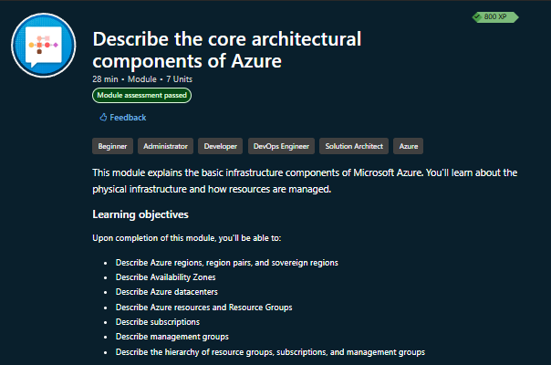

**Screenshot evidence:** Microsoft Learn shows the Azure architecture module and its AZ-900-relevant learning objectives.

---

### Step 2: Review Azure Physical Infrastructure

1. Opened the Azure physical infrastructure section.
2. Reviewed how Azure organizes physical infrastructure.
3. Documented the relationship between:
   - Geography
   - Region
   - Availability zone
   - Datacenter
4. Confirmed that resources are deployed to regions, while Azure manages placement across zones and datacenters.

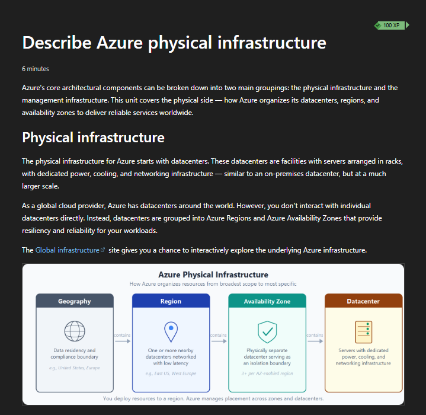

**Screenshot evidence:** Microsoft Learn shows Azure physical infrastructure from geography down to datacenter.

---

### Step 3: Review Azure Regions

1. Reviewed the Azure regions section.
2. Documented that a region is a geographic area containing one or more nearby datacenters.
3. Confirmed that resources are commonly deployed to a selected region.
4. Documented that some services are regional while some global services do not require region selection.

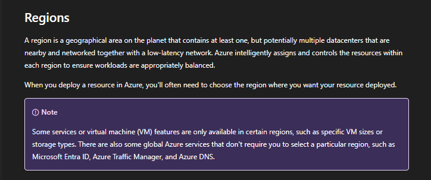

**Screenshot evidence:** Microsoft Learn explains Azure regions as geographic areas containing datacenters connected through low-latency networks.

---

### Step 4: Review Availability Zones

1. Reviewed the availability zones section.
2. Documented that availability zones are physically separate locations within supported Azure regions.
3. Reviewed how zones provide isolation boundaries for resilience.
4. Confirmed that not every Azure region supports availability zones.

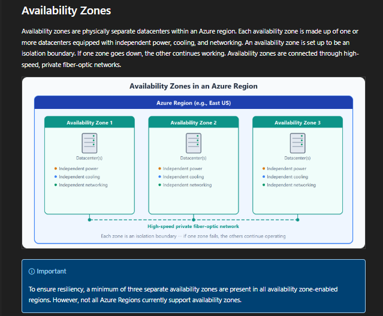

**Screenshot evidence:** Microsoft Learn shows availability zones as separate datacenter locations within an Azure region.

---

### Step 5: Review Availability Zone Service Categories

1. Reviewed how Azure services can support availability zones differently.
2. Documented the difference between:
   - Zonal services
   - Zone-redundant services
   - Non-regional services
3. Connected the concept to workload resiliency planning.

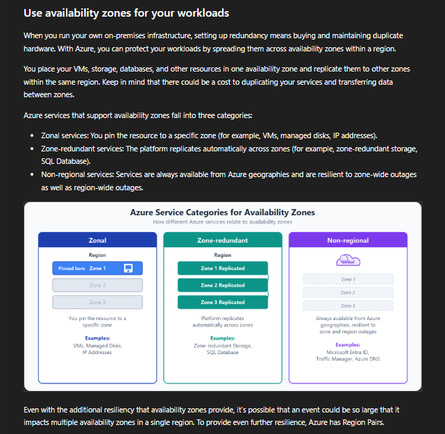

**Screenshot evidence:** Microsoft Learn shows zonal, zone-redundant, and non-regional service patterns.

---

### Step 6: Review Region Pairs

1. Reviewed the region pairs section.
2. Documented how Azure pairs many regions within the same geography.
3. Reviewed how region pairs support resiliency and disaster recovery.
4. Documented that not every service automatically replicates or fails over to a paired region.

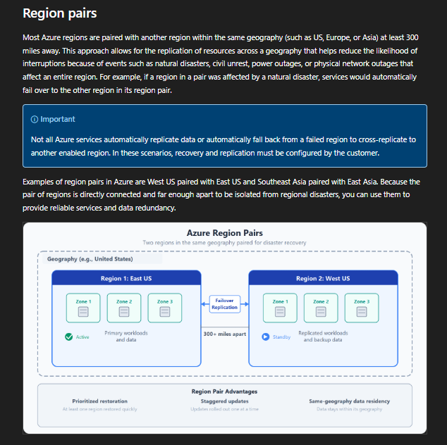

**Screenshot evidence:** Microsoft Learn shows Azure region pairs and how paired regions can support disaster recovery.

---

### Step 7: Review Region Pair Advantages

1. Reviewed additional region pair benefits.
2. Documented advantages such as:
   - Prioritized restoration
   - Planned update sequencing
   - Same-geography data residency
3. Documented that some regions have special pairing behavior.

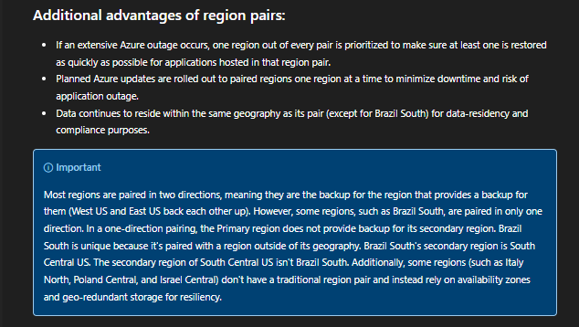

**Screenshot evidence:** Microsoft Learn documents region-pair advantages and limitations.

---

### Step 8: Review Sovereign Regions

1. Reviewed the sovereign regions section.
2. Documented that sovereign regions are isolated Azure instances used for compliance or legal requirements.
3. Reviewed examples such as U.S. government regions and China regions.
4. Connected sovereign regions to regulated IT environments.

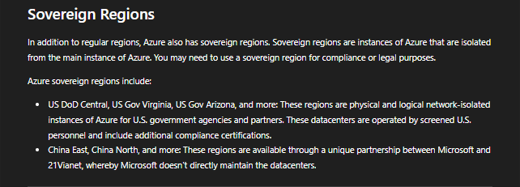

**Screenshot evidence:** Microsoft Learn explains sovereign regions and their use for compliance or legal requirements.

---

### Step 9: Review Azure Resources and Resource Groups

1. Opened the Azure management infrastructure section.
2. Reviewed Azure resources and resource groups.
3. Documented that a resource is a basic Azure building block.
4. Documented that each resource belongs to one resource group.
5. Reviewed resource group rules:
   - Each resource belongs to one resource group at a time.
   - Resource groups cannot be nested.
   - Resource groups cannot be renamed after creation.
   - Deleting a resource group deletes resources inside it.
   - Access permissions can apply to all resources inside a resource group.

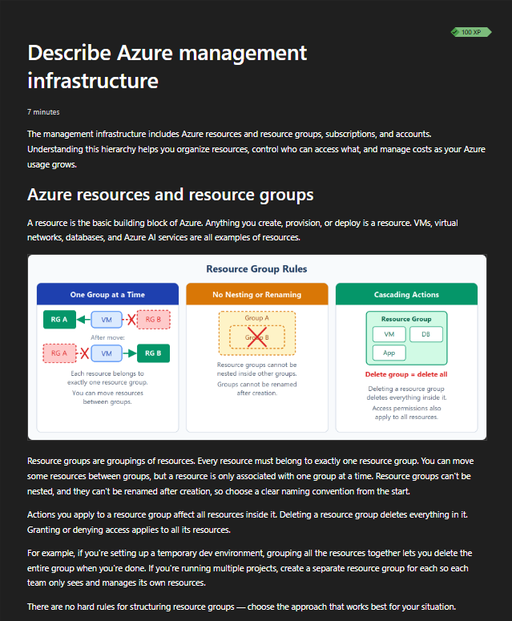

**Screenshot evidence:** Microsoft Learn shows resource group rules and explains resource groups as containers for Azure resources.

---

### Step 10: Review Azure Subscriptions

1. Reviewed the Azure subscriptions section.
2. Documented that subscriptions are units of management, billing, and scale.
3. Reviewed subscriptions as:
   - Billing boundaries
   - Access-control boundaries
4. Documented that different subscriptions can have different access policies, spending limits, and access rules.

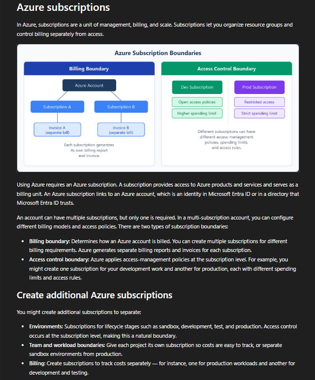

**Screenshot evidence:** Microsoft Learn shows subscriptions as billing and access-control boundaries.

---

### Step 11: Review Azure Management Groups

1. Reviewed the Azure management groups section.
2. Documented that management groups sit above subscriptions.
3. Reviewed how management groups can apply governance conditions across subscriptions.
4. Documented that every Microsoft Entra tenant has a top-level Tenant Root Group.

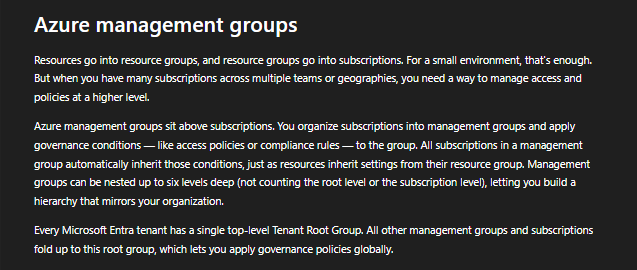

**Screenshot evidence:** Microsoft Learn explains management groups as higher-level containers for subscription governance.

---

### Step 12: Review Resource Hierarchy

1. Reviewed the management group, subscription, and resource group hierarchy.
2. Documented the Azure hierarchy:
   - Tenant Root Group
   - Management group
   - Subscription
   - Resource group
   - Resource
3. Reviewed how policies and access can inherit downward through the hierarchy.

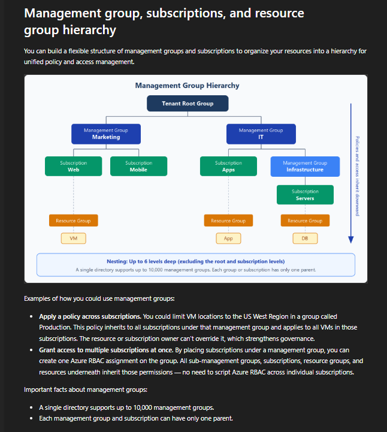

**Screenshot evidence:** Microsoft Learn shows the Azure resource hierarchy and how governance can flow downward.

---

### Step 13: Validate Subscription Overview

1. Opened the Azure portal.
2. Navigated to **Subscriptions**.
3. Confirmed the MRTG subscription was visible.
4. Confirmed the subscription role was `Owner`.
5. Confirmed the current cost was `0.00`.
6. Confirmed the subscription was under the `Tenant Root Group`.
7. Confirmed the subscription status was `Active`.
8. Redacted account and identifier information before documentation.

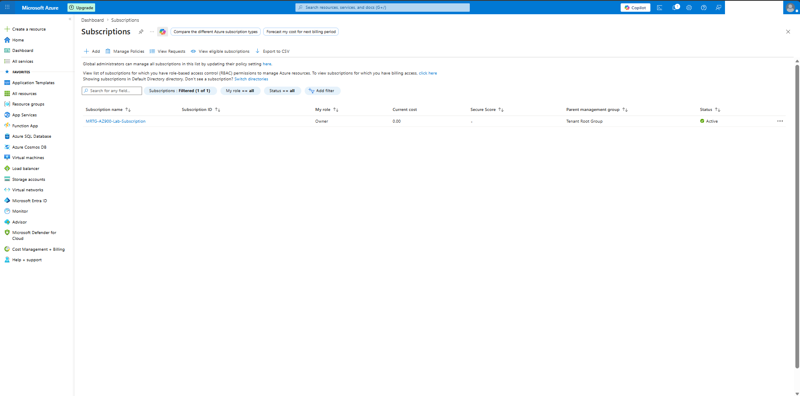

**Screenshot evidence:** The Azure portal shows the MRTG subscription as active, assigned to the Tenant Root Group, and currently at `0.00` cost.

---

### Step 14: Validate Resource Groups List

1. Opened **Resource groups** in the Azure portal.
2. Confirmed the existing Lab 01 resource group was present.
3. Confirmed the resource group belonged to the MRTG subscription.
4. Confirmed the resource group location was `Central US`.

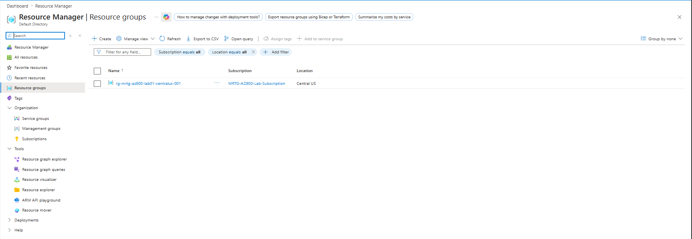

**Screenshot evidence:** The Azure portal shows the existing Lab 01 resource group inside the MRTG subscription.

---

### Step 15: Validate Lab Resource Group Overview

1. Opened the Lab 01 resource group.
2. Confirmed the resource group name.
3. Confirmed the subscription association.
4. Confirmed the resource group location was `Central US`.
5. Confirmed no deployments were present.
6. Confirmed tags were visible.
7. Confirmed the resource group acted as a logical container.

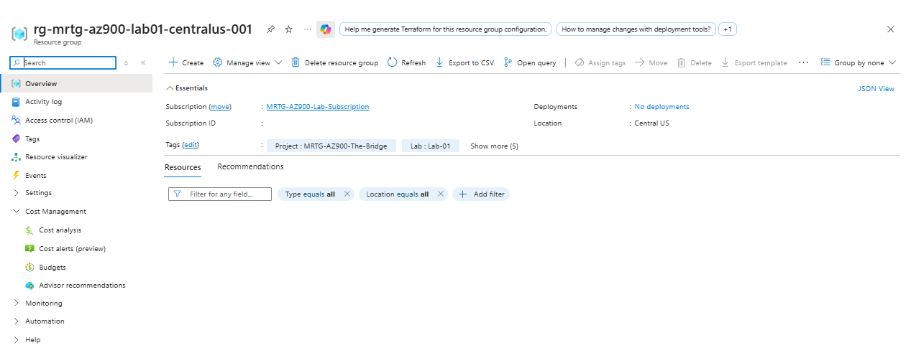

**Screenshot evidence:** The existing Lab 01 resource group is visible with location, subscription association, tags, and no deployments.

---

### Step 16: Validate Management Groups View

1. Opened **Management groups** in Azure Resource Manager.
2. Reviewed the Tenant Root Group.
3. Confirmed the MRTG subscription was listed under the Tenant Root Group.
4. Confirmed no sensitive IDs were exposed in the documentation.

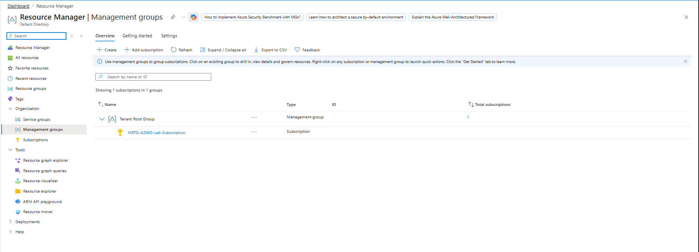

**Screenshot evidence:** The Azure portal shows the MRTG subscription under the Tenant Root Group management hierarchy.

---

### Step 17: Review Azure Resource Manager

1. Opened Microsoft documentation for Azure Resource Manager.
2. Reviewed Azure Resource Manager as the deployment and management service for Azure.
3. Documented that Azure Resource Manager provides the management layer for creating, updating, and deleting resources.
4. Reviewed that requests from the Azure portal, Azure PowerShell, Azure CLI, SDKs, and REST clients go through Azure Resource Manager.
5. Documented that ARM supports management features such as access control, locks, and tags.

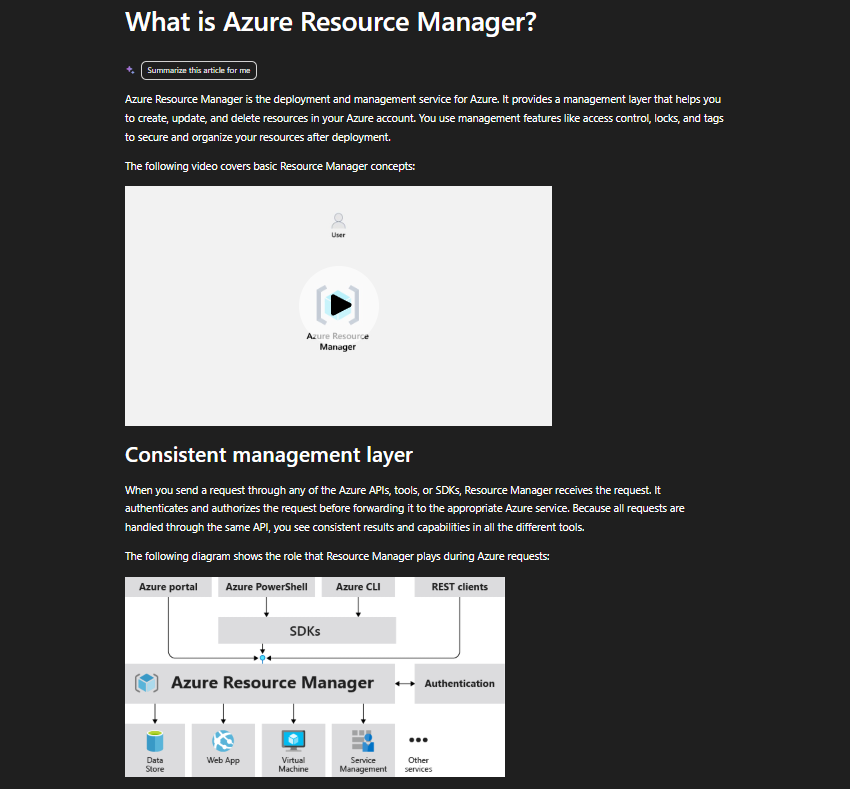

**Screenshot evidence:** Microsoft documentation explains Azure Resource Manager as the consistent management layer for Azure resources.

---

### Step 18: Perform Final Cost Validation

1. Opened Azure Cost Management.
2. Reviewed the subscription budget.
3. Confirmed that the monthly budget remained active.
4. Confirmed that evaluated spend remained `$0.00`.
5. Confirmed that progress remained `0.00%`.
6. Confirmed that no billable resources were created during the lab.
7. Redacted scope identifiers before documentation.

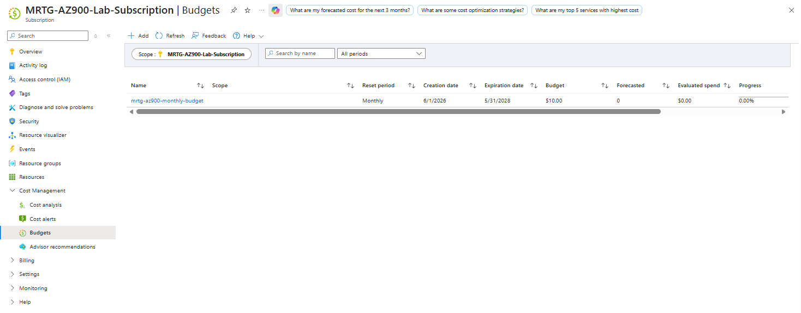

**Screenshot evidence:** The final Cost Management screenshot shows the budget is active, evaluated spend is `$0.00`, and progress is `0.00%`.

---

## Azure Physical Infrastructure Summary

Azure physical infrastructure describes how Microsoft organizes datacenters globally.

### Geography

A geography is a broad area that can support data residency and compliance requirements.

Examples include:

- United States
- Europe
- Asia Pacific

### Region

A region is a geographic area that contains one or more nearby datacenters connected by low-latency networking.

Azure resources are commonly deployed to a selected region.

### Availability Zone

An availability zone is a physically separate location within a supported Azure region.

Availability zones help protect workloads from datacenter-level failures.

### Datacenter

A datacenter is a physical facility that contains servers, networking, power, and cooling infrastructure.

Customers do not usually interact directly with individual Azure datacenters.

---

## Region Pairs Summary

Many Azure regions are paired with another region in the same geography.

Region pairs can help with:

- Disaster recovery planning
- Regional resilience
- Update sequencing
- Data residency
- Recovery prioritization

Important limitation:

Not every Azure service automatically replicates to a paired region. Some services require customer configuration for replication, backup, or failover.

---

## Sovereign Regions Summary

Sovereign regions are isolated Azure environments used for compliance, legal, or regulatory needs.

Examples include:

- U.S. government Azure regions
- China Azure regions operated through a local partner model

Sovereign regions are important for government, defense, regulated industries, and workloads with strict residency or legal requirements.

---

## Azure Management Infrastructure Summary

Azure management infrastructure describes how resources are organized, governed, and controlled.

### Azure Resource

A resource is anything created, deployed, or managed in Azure.

Examples include:

- Virtual machines
- Storage accounts
- Virtual networks
- Databases
- App services
- Key vaults

### Resource Group

A resource group is a logical container for Azure resources.

Resource group rules:

- A resource belongs to one resource group at a time.
- Resource groups cannot be nested.
- Resource groups cannot be renamed after creation.
- Resources can move between resource groups in some cases.
- Deleting a resource group deletes resources inside it.
- Permissions assigned at the resource group scope can apply to resources inside it.

### Subscription

A subscription is a boundary for billing, management, access control, and scale.

Subscriptions can separate:

- Environments
- Departments
- Projects
- Billing responsibilities
- Access-control requirements
- Production and non-production workloads

### Management Group

A management group is a governance scope above subscriptions.

Management groups can help apply:

- Azure Policy
- Access control
- Compliance rules
- Governance standards
- Organizational hierarchy

### Azure Resource Manager

Azure Resource Manager is the Azure deployment and management layer.

ARM provides a consistent way to manage resources through:

- Azure portal
- Azure CLI
- Azure PowerShell
- REST APIs
- SDKs
- Templates

ARM supports management features such as:

- Access control
- Tags
- Locks
- Deployments
- Resource organization

---

## Resource Hierarchy

The Azure resource hierarchy is:

```text
Tenant Root Group
Management Group
Subscription
Resource Group
Resource
```

### Practical MRTG Hierarchy

```text
Tenant Root Group
MRTG-AZ900-Lab-Subscription
rg-mrtg-az900-lab01-centralus-001
No deployed billable workloads
```

### Inheritance Concept

Governance settings can flow downward through the hierarchy.

For example:

- A policy assigned at a management group can apply to subscriptions below it.
- A role assignment at a subscription can apply to resource groups below it.
- A role assignment at a resource group can apply to resources inside it.

This is important for IAM because scope determines how broad an access assignment is.

---

## Validation

| Validation Check | Expected Result | Observed Result | Status |
|---|---|---|---|
| Azure architecture module reviewed | Microsoft Learn module is located | Core architectural components module was reviewed | Passed |
| Physical infrastructure reviewed | Geography, region, zone, and datacenter concepts documented | Physical infrastructure diagram was captured | Passed |
| Regions reviewed | Azure region concept documented | Regions section was captured | Passed |
| Availability zones reviewed | Availability zone concept documented | Availability zones section was captured | Passed |
| Zone service categories reviewed | Zonal and zone-redundant concepts documented | Service categories were captured | Passed |
| Region pairs reviewed | Region-pair concept documented | Region pairs section was captured | Passed |
| Sovereign regions reviewed | Sovereign region concept documented | Sovereign regions section was captured | Passed |
| Resource groups reviewed | Resource group rules documented | Resource group rules were captured | Passed |
| Subscriptions reviewed | Subscription boundaries documented | Subscription boundaries were captured | Passed |
| Management groups reviewed | Management group concept documented | Management groups section was captured | Passed |
| Resource hierarchy reviewed | Hierarchy documented | Resource hierarchy diagram was captured | Passed |
| Subscription validated | Subscription is active | MRTG subscription showed Active | Passed |
| Resource group list validated | Existing lab resource group is visible | Lab 01 resource group was visible | Passed |
| Resource group overview validated | Resource group metadata is visible | Location, tags, and subscription association were visible | Passed |
| Management group view validated | Subscription appears under Tenant Root Group | MRTG subscription appeared under Tenant Root Group | Passed |
| Azure Resource Manager reviewed | ARM management layer documented | ARM overview was captured | Passed |
| Final cost validation | Spend remains `$0.00` | Evaluated spend showed `$0.00` | Passed |

---

## Completion Checklist

- [x] Reviewed Microsoft Learn Azure architecture module
- [x] Documented Azure physical infrastructure
- [x] Documented Azure regions
- [x] Documented availability zones
- [x] Documented availability zone service categories
- [x] Documented region pairs
- [x] Documented region-pair advantages
- [x] Documented sovereign regions
- [x] Documented Azure resources and resource groups
- [x] Documented Azure subscriptions
- [x] Documented Azure management groups
- [x] Documented resource hierarchy
- [x] Validated MRTG subscription in Azure portal
- [x] Validated Lab 01 resource group in Azure portal
- [x] Validated management group view
- [x] Reviewed Azure Resource Manager
- [x] Did not create paid Azure resources
- [x] Validated budget remained active
- [x] Validated evaluated spend remained `$0.00`
- [x] Sanitized screenshots before upload
- [x] Avoided exposing tenant, subscription, account, or scope identifiers

---

## AZ-900 Exam Objective Coverage

### Primary Exam Domain

```text
Describe Azure architecture and services
```

### Secondary Exam Domain

```text
Describe Azure management and governance
```

### Skills Measured

This lab supports the ability to:

- Describe Azure regions
- Describe region pairs
- Describe sovereign regions
- Describe availability zones
- Describe Azure datacenters
- Describe Azure resources
- Describe resource groups
- Describe Azure subscriptions
- Describe management groups
- Describe the hierarchy of resource groups, subscriptions, and management groups
- Describe Azure Resource Manager
- Describe Azure governance scopes
- Explain how access and policy can apply at different scopes

### How This Lab Supports the Objectives

This lab connects Azure architecture concepts to the actual Azure portal.

It demonstrates:

- How Azure organizes physical infrastructure
- How Azure organizes management scopes
- How resources fit into the Azure hierarchy
- How subscriptions act as billing and access boundaries
- How resource groups organize related resources
- How management groups support higher-level governance
- How Azure Resource Manager provides the consistent management layer
- How cost validation supports safe Azure administration

---

## Mini Objective Coverage

By completing this lab, I can now:

- Explain what an Azure region is
- Explain what an availability zone is
- Explain why region pairs matter
- Explain why sovereign regions exist
- Describe the relationship between geographies, regions, availability zones, and datacenters
- Describe what an Azure resource is
- Describe what a resource group does
- Explain why subscriptions are billing and access-control boundaries
- Explain where management groups fit in Azure governance
- Explain the hierarchy from Tenant Root Group to resource
- Explain the role of Azure Resource Manager
- Validate Azure structure in the Azure portal
- Confirm cost impact after architecture review

---

## IAM / Security Relevance

Azure hierarchy directly affects IAM because access is assigned at scopes.

A role assignment can apply at:

- Management group scope
- Subscription scope
- Resource group scope
- Resource scope

The broader the scope, the more resources the identity can affect.

### IAM Scope Examples

| Scope | Example | Security Impact |
|---|---|---|
| Management group | Assign policy or access across many subscriptions | Broadest governance impact |
| Subscription | Assign access across all resource groups in a subscription | High impact |
| Resource group | Assign access to a project or workload group | More targeted |
| Resource | Assign access to a specific resource | Most specific |

### Security Takeaway

Azure hierarchy is not just an organization model.

It is also an access-control model.

Poor scope design can lead to excessive permissions, weak governance, and audit issues.

### Regulated IT Relevance

In government, defense, healthcare, finance, and other regulated environments, Azure scope design affects:

- Least privilege
- Separation of duties
- Compliance enforcement
- Audit boundaries
- Resource ownership
- Data residency
- Policy inheritance
- Budget ownership
- Incident response
- Privileged access management

---

## Governance Notes

### Governance Decisions

| Decision | Implementation | Reason |
|---|---|---|
| Used Microsoft Learn | Official AZ-900 concept source | Aligns the lab with exam objectives |
| Used Azure portal validation | Practical Azure evidence | Connects theory to real Azure administration |
| Used existing resource group | `rg-mrtg-az900-lab01-centralus-001` | Avoids unnecessary resource creation |
| Reviewed management groups | Tenant Root Group view | Demonstrates hierarchy and governance scope |
| Reviewed ARM | Microsoft documentation | Documents Azure management layer |
| Reviewed Cost Management | Final budget validation | Confirms lab remained cost-safe |
| Redacted sensitive details | IDs and account details removed | Prevents public exposure |

### Governance Lesson

Azure governance begins with structure.

Before deploying resources, organizations should understand where resources will live, who owns them, who can access them, and which policies apply.

---

## Cost Considerations

### Estimated Lab Cost

```text
Estimated cost: $0.00
```

### Why Cost Stayed at Zero

This lab did not create:

- Virtual machines
- Storage accounts
- App services
- App Service plans
- Databases
- Public IP addresses
- Virtual networks
- Load balancers
- Log Analytics workspaces
- Defender upgrades
- Backup services

### Cost Controls Used

- Used Microsoft Learn for concept review
- Used Azure portal review only
- Used the existing Lab 01 resource group
- Avoided create workflows
- Reviewed the existing budget
- Confirmed evaluated spend remained `$0.00`
- Confirmed budget progress remained `0.00%`

### Cost Reminder

Azure budgets provide notifications.

They do not automatically stop resources, delete resources, or guarantee a hard spending cap.

---

## Troubleshooting Notes

### Issue 1: Azure Portal Pages Can Expose Identifiers

**Symptom:**

Azure pages may show subscription IDs, tenant IDs, directory names, object IDs, scope values, or account details.

**Risk:**

Publishing screenshots without redaction can expose cloud environment identifiers.

**Resolution:**

Sensitive identifiers were redacted before upload.

**Result:**

Screenshots were safe for public documentation.

---

### Issue 2: Management Groups Can Appear Confusing in Small Environments

**Symptom:**

In a small lab environment, the management group view may only show the Tenant Root Group and one subscription.

**Explanation:**

That is expected. Larger organizations may build deeper management group structures, but small environments may only need the Tenant Root Group.

**Result:**

The screenshot still validates the hierarchy concept.

---

### Issue 3: Azure Resource Groups Have Strict Rules

**Symptom:**

Resource groups cannot be nested or renamed after creation.

**Risk:**

Poor naming choices can create long-term management and documentation problems.

**Resolution:**

MRTG uses a consistent resource group naming standard.

**Result:**

The existing Lab 01 resource group remains clear and easy to identify.

---

## What I Would Do Differently in Production

A production Azure environment would include more formal architecture and governance planning, including:

- Management group design
- Subscription strategy
- Environment separation
- Production and non-production separation
- Workload classification
- Data residency planning
- Region selection standards
- Availability zone strategy
- Disaster recovery planning
- Azure Policy assignments
- Required tagging policies
- Role-based access control design
- Privileged Identity Management
- Conditional Access
- Resource locks
- Centralized logging
- Security monitoring
- Cost allocation
- Budget ownership
- Infrastructure as code
- Change-management approval
- Compliance mapping

This lab stayed lightweight because its purpose was AZ-900 architecture validation and safe Azure hierarchy review.

---

## Lessons Learned

- Azure physical infrastructure is organized through geographies, regions, availability zones, and datacenters.
- Azure management infrastructure is organized through management groups, subscriptions, resource groups, and resources.
- Regions are where many Azure resources are deployed.
- Availability zones help protect against datacenter-level failures.
- Region pairs can support resilience and disaster recovery planning.
- Sovereign regions support special compliance and legal requirements.
- Resource groups are logical containers for Azure resources.
- Subscriptions are billing, management, and access-control boundaries.
- Management groups provide governance above subscriptions.
- Azure Resource Manager is the consistent management layer for Azure resources.
- IAM scope matters because access can inherit downward.
- Cost validation should be performed after every lab.

### Technical Takeaway

Azure architecture is both physical and logical.

Physical architecture supports resiliency.

Management architecture supports governance, access control, and organization.

### Business Takeaway

Good Azure structure helps organizations control cost, ownership, compliance, and operational risk.

### Security Takeaway

Azure hierarchy determines where access and policy apply, so scope design is a security decision.

### Exam Takeaway

For AZ-900, remember:

- Regions contain Azure datacenters.
- Availability zones are physically separate locations inside supported regions.
- Region pairs support resiliency across geographies.
- Resource groups contain resources.
- Subscriptions are billing and access-control boundaries.
- Management groups organize subscriptions.
- The hierarchy is Management Group > Subscription > Resource Group > Resource.
- Azure Resource Manager is the deployment and management layer.

---

## Cleanup

### Resources Retained

| Resource or Configuration | Reason |
|---|---|
| MRTG Azure subscription | Required for future labs |
| Monthly budget | Required for ongoing cost visibility |
| Lab 01 resource group | Retained as the foundational lab resource group |
| Lab 04 screenshots | Required for documentation evidence |

### Resources Removed

No Azure resources were created during this lab.

### Cleanup Validation

- [x] No virtual machines were created
- [x] No app services were created
- [x] No storage accounts were created
- [x] No databases were created
- [x] No public IP addresses were created
- [x] No virtual networks were created
- [x] No premium services were enabled
- [x] Budget remained active
- [x] Evaluated spend remained `$0.00`
- [x] Budget progress remained `0.00%`

---

## Outcome

This lab documented the core architectural components of Azure and validated the MRTG Azure resource hierarchy.

The completed lab demonstrates:

- Understanding of Azure geographies
- Understanding of Azure regions
- Understanding of availability zones
- Understanding of region pairs
- Understanding of sovereign regions
- Understanding of Azure resources and resource groups
- Understanding of subscriptions as billing and access-control boundaries
- Understanding of management groups
- Understanding of Azure Resource Manager
- Understanding of Azure hierarchy and governance scopes
- Practical validation of the MRTG subscription
- Practical validation of the Lab 01 resource group
- Practical validation of the Tenant Root Group view
- No billable Azure resources deployed
- Final evaluated spend of `$0.00`

---

## Screenshot Inventory

| Screenshot | Description |
|---|---|
| `01-microsoft-learn-azure-architecture.png` | Microsoft Learn Azure architecture module |
| `02-azure-physical-infrastructure.png` | Azure physical infrastructure overview |
| `03-azure-regions-overview.png` | Azure regions overview |
| `04-availability-zones.png` | Azure availability zones |
| `05-availability-zone-service-categories.png` | Zonal, zone-redundant, and non-regional service categories |
| `06-region-pairs.png` | Azure region pairs |
| `07-region-pair-advantages.png` | Region-pair advantages and limitations |
| `08-sovereign-regions.png` | Azure sovereign regions |
| `09-azure-resources-and-resource-groups.png` | Azure resources and resource group rules |
| `10-azure-subscriptions.png` | Azure subscription boundaries |
| `11-azure-management-groups.png` | Azure management groups |
| `12-resource-hierarchy-overview.png` | Management group, subscription, resource group, and resource hierarchy |
| `13-subscription-overview.png` | MRTG subscription overview |
| `14-resource-groups-list.png` | Azure resource groups list |
| `15-lab-resource-group-overview.png` | Lab 01 resource group overview |
| `16-management-groups-view.png` | Management groups view in Azure portal |
| `17-azure-resource-manager-overview.png` | Azure Resource Manager overview |
| `18-cost-management-final-validation.png` | Final Cost Management validation |

---

## Next Lab

The next lab is:

```text
Lab 05 - Azure Compute Services
```

The next lab will build on this foundation by examining:

- Azure Virtual Machines
- App Service
- Azure Functions
- Containers
- Azure Kubernetes Service
- Compute service selection
- Cost and responsibility differences across compute options
