# Lab 05 - Azure Compute Services

## Objective

Document core Azure compute services and explain when each compute option should be used.

By completing this lab, I:

- Reviewed Azure compute service categories
- Documented Azure Virtual Machines as an IaaS compute option
- Reviewed VM sizing, VM families, and VM resource requirements
- Reviewed VM scale and resiliency options
- Documented Virtual Machine Scale Sets
- Documented Azure App Service as a PaaS application hosting option
- Documented Azure Functions as a serverless compute option
- Documented Azure Container Apps as a container hosting option
- Documented Azure Kubernetes Service as a managed Kubernetes option
- Documented Azure Virtual Desktop as a cloud-hosted desktop option
- Compared compute services by control, responsibility, and operational effort
- Validated Azure portal service discovery without creating resources
- Confirmed that no billable compute resources were deployed
- Confirmed that evaluated spend remained `$0.00`

---

## Business Problem Solved

Cloud teams need to choose the right compute service before deploying workloads.

Choosing the wrong compute option can create unnecessary cost, operational overhead, security exposure, and management burden.

Monroe Redstone Technology Group needed to understand:

- When to use Azure Virtual Machines
- When to use Virtual Machine Scale Sets
- When to use Azure App Service
- When to use Azure Functions
- When to use containers
- When to use Azure Kubernetes Service
- When to use Azure Virtual Desktop
- How compute choices affect cost, security, IAM, and operational responsibility

This lab helps build a service-selection foundation before creating real compute workloads.

---

## Scenario

MRTG has already established an Azure lab subscription, budget, tagging standard, resource group, and basic architecture understanding.

Before deploying compute resources, MRTG reviews the major Azure compute options and validates that each service is visible in the Azure portal.

No compute resources are created in this lab.

This keeps the lab cost-safe while building the decision-making model needed for later Azure administration labs.

---

## Azure Services and Resources Used

| Service or Resource | Purpose |
|---|---|
| Microsoft Learn | Reviewed official Azure compute service concepts |
| Azure portal | Validated compute service discovery |
| Azure Virtual Machines | Reviewed IaaS compute |
| Virtual Machine Scale Sets | Reviewed VM scaling option |
| Azure App Service | Reviewed PaaS web and API hosting |
| Azure Functions | Reviewed serverless event-driven compute |
| Azure Container Apps | Reviewed managed container hosting |
| Azure Kubernetes Service | Reviewed managed Kubernetes orchestration |
| Azure Virtual Desktop | Reviewed cloud-hosted desktop and app delivery |
| Azure Cost Management | Validated budget and spend |
| Azure budgets | Confirmed evaluated spend remained `$0.00` |

---

## Why These Services Were Used

### Microsoft Learn

Microsoft Learn was used as the official source for AZ-900 compute concepts.

It provided coverage for:

- Compute types
- Virtual Machines
- VM Scale Sets
- VM availability sets
- VM sizing
- Containers
- Azure Container Apps
- Azure Kubernetes Service
- Azure Functions
- Application hosting options
- Azure App Service

### Azure Portal

The Azure portal was used to validate that the compute services exist and can be located in a real Azure environment.

The portal was used only for discovery.

No resources were deployed.

### Azure Cost Management

Cost Management was used to validate that the lab remained cost-safe.

The final budget validation showed:

```text
Budget: $10.00
Evaluated spend: $0.00
Progress: 0.00%
```

---

## Environment

| Component | Configuration |
|---|---|
| Organization | Monroe Redstone Technology Group |
| Project | MRTG Azure Fundamentals: The Bridge |
| Lab | Lab 05 |
| Subscription | `MRTG-AZ900-Lab-Subscription` |
| Resource group used | None created in this lab |
| Compute resources created | None |
| Estimated cost | `$0.00` |
| Documentation platform | GitHub |

---

## Architecture / Concept Diagram

```text
Azure Compute Service Selection

More control                                           Less operational effort
     |                                                           |
     v                                                           v

+----------------------+     +----------------------+     +----------------------+
| Virtual Machines     |     | Containers           |     | App Service          |
| IaaS                 |     | Container hosting    |     | PaaS                 |
| OS control           |     | Portable workloads   |     | Managed web hosting  |
| Patch responsibility |     | App isolation        |     | Less OS management   |
+----------------------+     +----------------------+     +----------------------+

+----------------------+     +----------------------+     +----------------------+
| VM Scale Sets        |     | Azure Functions      |     | Azure Virtual        |
| Scaled VM groups     |     | Serverless compute   |     | Desktop              |
| IaaS scaling         |     | Event driven         |     | Cloud desktops       |
+----------------------+     +----------------------+     +----------------------+

+----------------------+
| AKS                  |
| Managed Kubernetes   |
| Container orchestration |
+----------------------+
```

---

## Steps Performed

### Step 1: Review Azure Compute Services Module

1. Opened Microsoft Learn.
2. Reviewed the Azure compute services module introduction.
3. Confirmed the module covered:
   - Compute types
   - Container instances
   - Virtual Machines
   - Azure Functions
   - VM Scale Sets
   - VM availability sets
   - VM resources
   - Application hosting options
   - Azure AI, machine learning, and IoT service categories

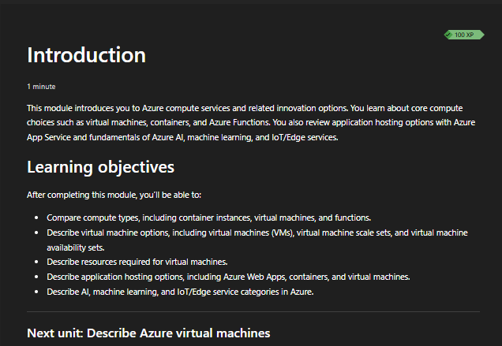

**Screenshot evidence:** Microsoft Learn shows the Azure compute services module and its learning objectives.

---

### Step 2: Review Azure Virtual Machines

1. Reviewed the Azure Virtual Machines section in Microsoft Learn.
2. Documented VMs as an Infrastructure as a Service compute option.
3. Reviewed common VM use cases:
   - Testing and development
   - Cloud application hosting
   - Datacenter extension
   - Disaster recovery
   - Lift-and-shift migration
4. Reviewed VM resource requirements:
   - Size
   - Storage disks
   - Networking

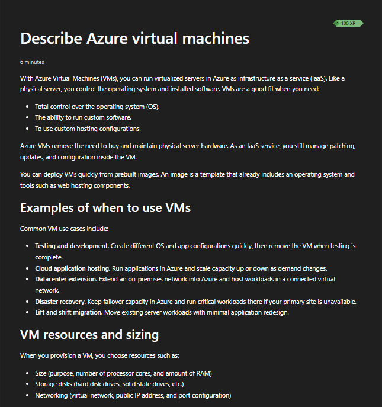

**Screenshot evidence:** Microsoft Learn explains Azure Virtual Machines as IaaS compute with operating system control and management responsibility.

---

### Step 3: Review VM Size Families and Options

1. Reviewed Azure VM size families.
2. Documented common VM families:
   - B-series
   - D-series
   - E-series
   - F-series
   - M-series
   - L-series
   - N-series
3. Reviewed VM configuration options:
   - vCPU
   - RAM
   - Disk
   - Network
   - Premium SSD
   - Hardware generation

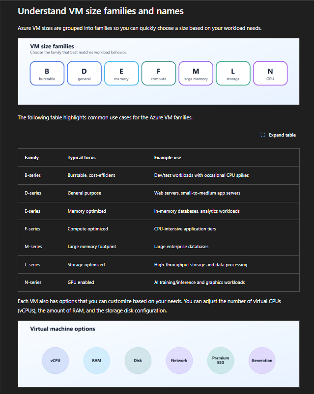

**Screenshot evidence:** Microsoft Learn shows VM families and configurable VM options.

---

### Step 4: Review VM Scale and Resiliency Options

1. Reviewed how VM names and sizes carry useful sizing information.
2. Reviewed VM scale and resiliency options.
3. Documented that VM Scale Sets can create and manage groups of identical, load-balanced VMs.
4. Documented that VM Scale Sets support scaling VM resources in or out based on demand or schedule.

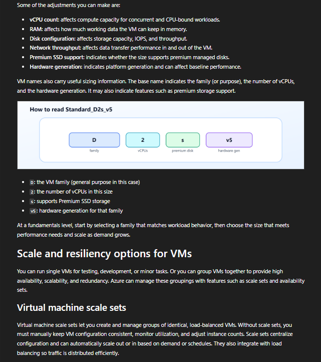

**Screenshot evidence:** Microsoft Learn explains VM sizing and introduces VM Scale Sets.

---

### Step 5: Review VM Availability Sets

1. Reviewed VM availability sets.
2. Documented how availability sets improve VM resiliency inside a region.
3. Reviewed:
   - Update domains
   - Fault domains
4. Documented that availability sets do not remove the cost of VM instances.

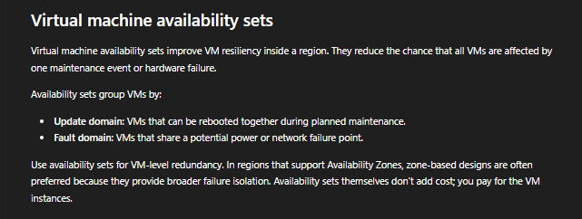

**Screenshot evidence:** Microsoft Learn explains update domains, fault domains, and availability sets.

---

### Step 6: Validate Azure Virtual Machines in the Portal

1. Opened the Azure portal.
2. Navigated to **Virtual machines**.
3. Confirmed that no virtual machines existed.
4. Did not create a VM.
5. Documented the service as the practical IaaS compute example.

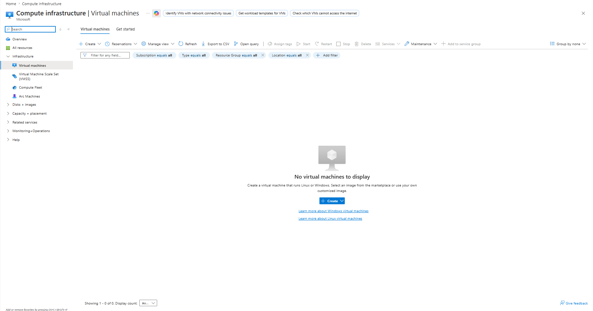

**Screenshot evidence:** The Azure portal shows the Virtual Machines service page with no VMs deployed.

---

### Step 7: Validate Virtual Machine Scale Sets in the Portal

1. Opened **Virtual Machine Scale Set (VMSS)** in the Azure portal.
2. Confirmed that no VM scale sets existed.
3. Did not create a VM scale set.
4. Documented VMSS as the practical scaling option for groups of VMs.

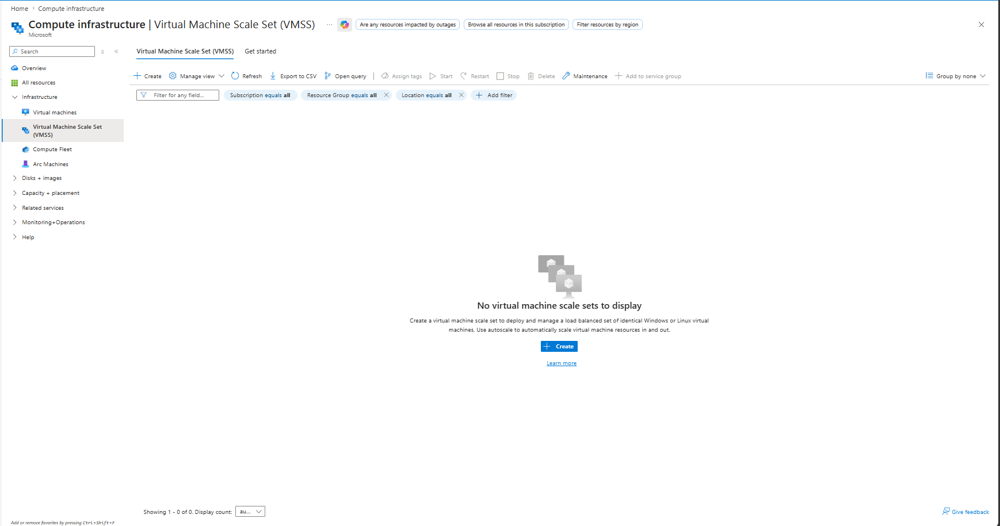

**Screenshot evidence:** The Azure portal shows the Virtual Machine Scale Set page with no VMSS resources deployed.

---

### Step 8: Validate Azure App Service in the Portal

1. Opened **App Services** in the Azure portal.
2. Confirmed that no App Services existed.
3. Did not create an App Service.
4. Documented App Service as a PaaS option for web apps, APIs, and back-end services.

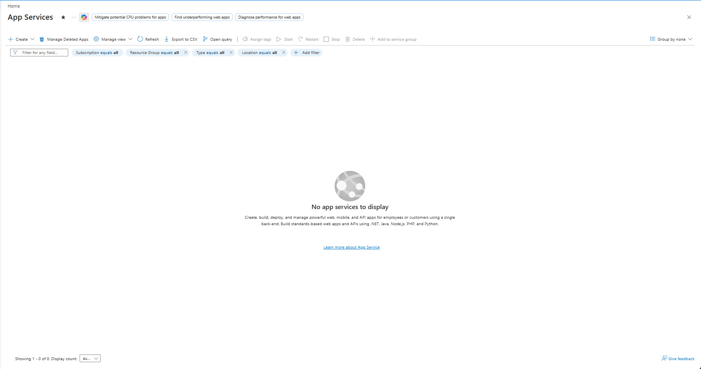

**Screenshot evidence:** The Azure portal shows the App Services page with no app services deployed.

---

### Step 9: Validate Azure Functions in the Portal

1. Opened **Function App** in the Azure portal.
2. Confirmed that no function apps existed.
3. Did not create a Function App.
4. Documented Azure Functions as serverless event-driven compute.

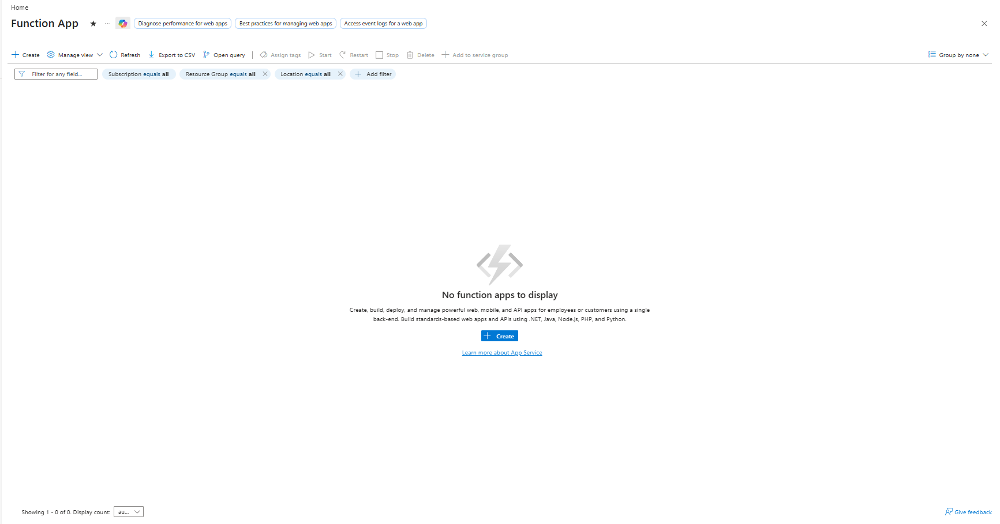

**Screenshot evidence:** The Azure portal shows the Function App page with no function apps deployed.

---

### Step 10: Validate Azure Container Apps in the Portal

1. Opened **Container Apps** in the Azure portal.
2. Confirmed that no container apps existed.
3. Did not create a Container App.
4. Documented Azure Container Apps as a managed container hosting option.

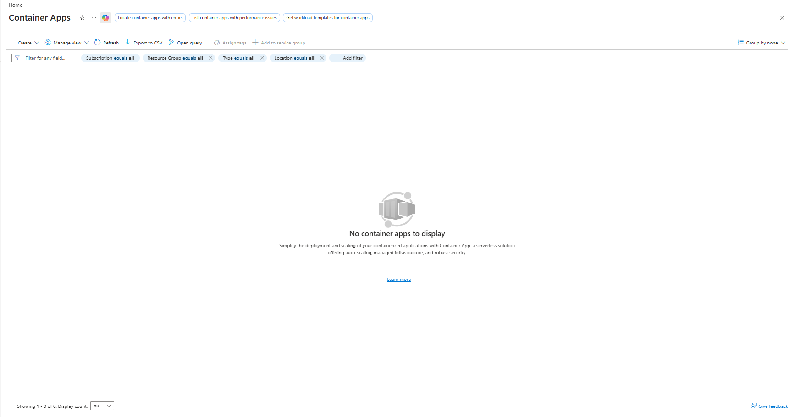

**Screenshot evidence:** The Azure portal shows the Container Apps page with no container apps deployed.

---

### Step 11: Validate Azure Kubernetes Service in the Portal

1. Opened **Kubernetes center** in the Azure portal.
2. Opened the clusters view.
3. Confirmed total clusters showed `0`.
4. Did not create an AKS cluster.
5. Documented AKS as managed Kubernetes for container orchestration.

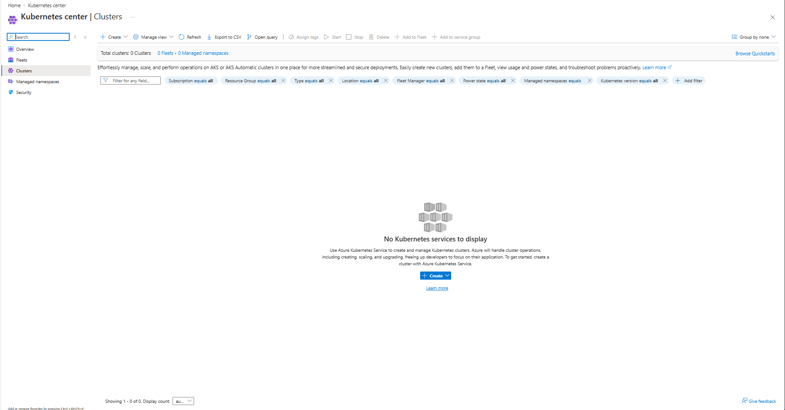

**Screenshot evidence:** The Azure portal shows the Kubernetes clusters page with no Kubernetes services deployed.

---

### Step 12: Validate Azure Virtual Desktop in the Portal

1. Opened **Azure Virtual Desktop** in the Azure portal.
2. Reviewed the overview page.
3. Did not create a host pool.
4. Documented Azure Virtual Desktop as a cloud-hosted desktop and remote app option.

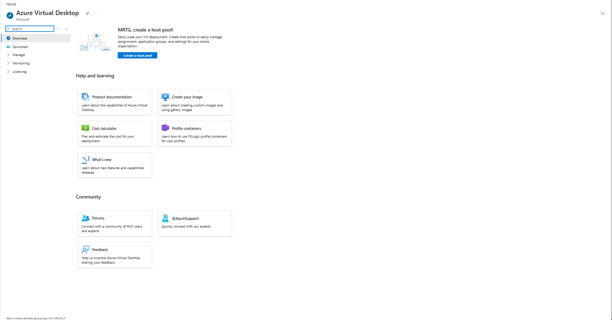

**Screenshot evidence:** The Azure portal shows the Azure Virtual Desktop page without a deployed host pool.

---

### Step 13: Review Azure Containers

1. Reviewed the Azure containers section in Microsoft Learn.
2. Documented containers as lightweight compute environments.
3. Compared containers to virtual machines.
4. Documented that containers can be created, scaled, and stopped dynamically.

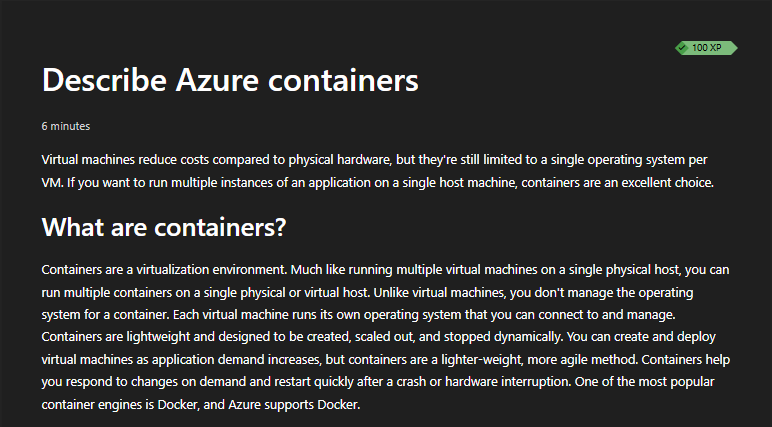

**Screenshot evidence:** Microsoft Learn explains containers as lightweight compute environments compared to VMs.

---

### Step 14: Review Azure Container Services

1. Reviewed Azure Container Instances.
2. Reviewed Azure Container Apps.
3. Documented that Azure Container Instances provides a quick way to run containers without managing VMs.
4. Documented that Azure Container Apps supports managed container hosting, scaling, and load balancing.

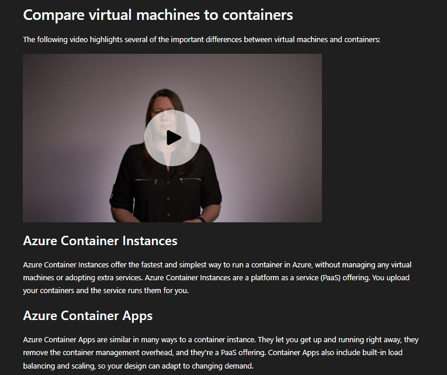

**Screenshot evidence:** Microsoft Learn explains Azure Container Instances and Azure Container Apps as container hosting options.

---

### Step 15: Review Azure Kubernetes Service

1. Reviewed the AKS section in Microsoft Learn.
2. Documented AKS as a container orchestration service.
3. Reviewed the difference between:
   - Azure Container Instances
   - Azure Container Apps
   - Azure Kubernetes Service
4. Documented that AKS is used for deeper container orchestration.

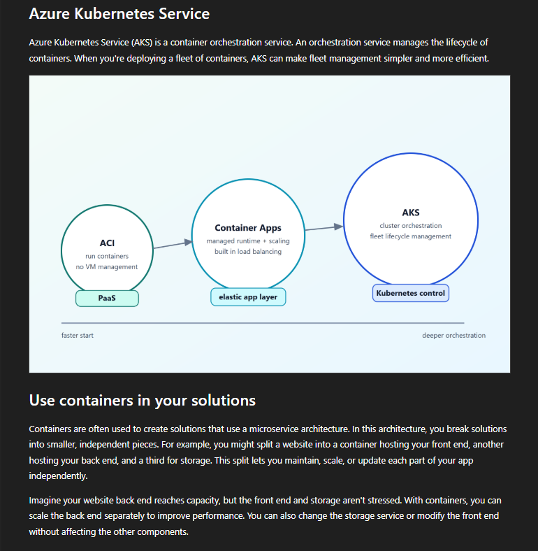

**Screenshot evidence:** Microsoft Learn shows AKS as a managed Kubernetes orchestration option.

---

### Step 16: Review Azure Functions

1. Reviewed the Azure Functions section in Microsoft Learn.
2. Documented Azure Functions as event-driven serverless compute.
3. Reviewed function triggers and outputs.
4. Documented that functions can run in response to events such as HTTP requests, timers, and queue messages.

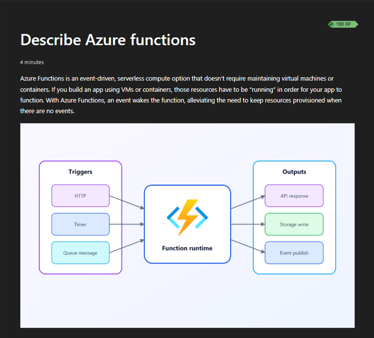

**Screenshot evidence:** Microsoft Learn explains Azure Functions as event-driven compute with triggers and outputs.

---

### Step 17: Review Azure Functions Benefits

1. Reviewed the benefits of Azure Functions.
2. Documented that functions can scale automatically based on demand.
3. Documented that Azure Functions can charge based on active runtime in common serverless models.
4. Reviewed the benefit of not keeping resources provisioned when there are no events.

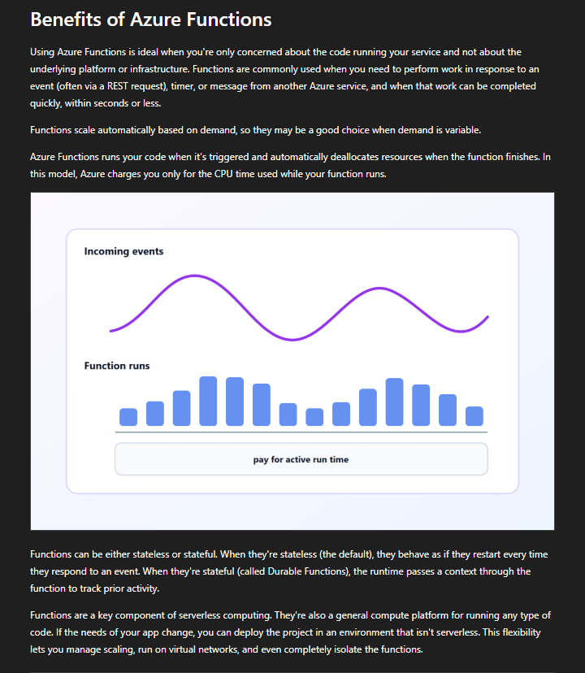

**Screenshot evidence:** Microsoft Learn shows function scaling and pay-for-active-runtime concepts.

---

### Step 18: Review Application Hosting Options

1. Reviewed application hosting options in Microsoft Learn.
2. Compared:
   - Virtual Machines
   - Containers
   - App Service
3. Documented the relationship between control and operational effort.

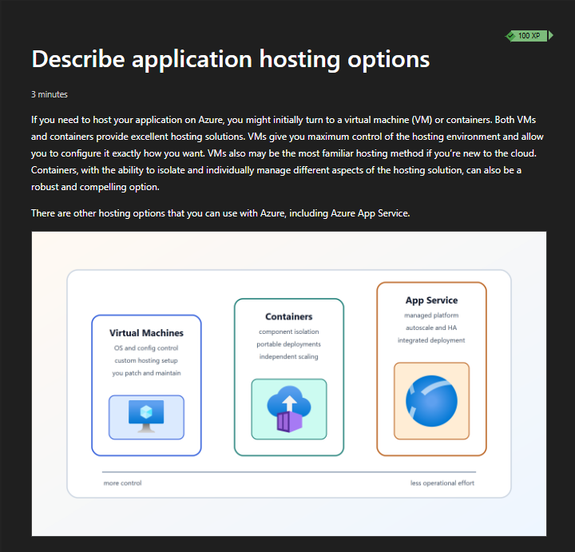

**Screenshot evidence:** Microsoft Learn compares Virtual Machines, containers, and App Service from more control to less operational effort.

---

### Step 19: Review Azure App Service

1. Reviewed the Azure App Service section in Microsoft Learn.
2. Documented App Service as managed hosting for:
   - Web apps
   - API apps
   - WebJobs
   - Mobile apps
3. Documented App Service benefits:
   - Integrated deployment and management
   - Secure endpoints
   - Scaling
   - Built-in load balancing and traffic management

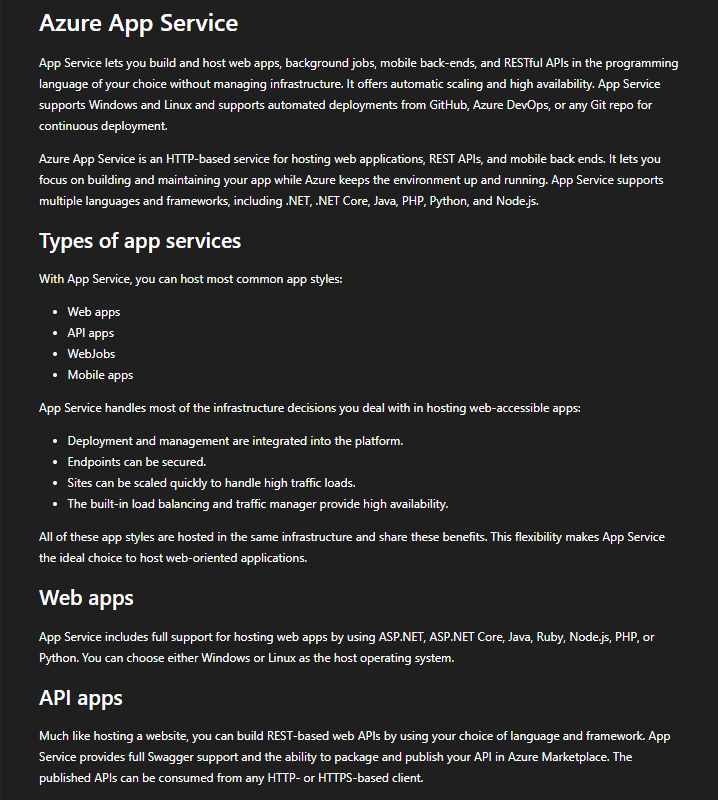

**Screenshot evidence:** Microsoft Learn explains Azure App Service as managed hosting for web apps, APIs, jobs, and mobile back ends.

---

### Step 20: Review WebJobs and Mobile Apps

1. Reviewed additional App Service workload types.
2. Documented WebJobs for background tasks.
3. Documented Mobile Apps for back-end mobile app services.
4. Reviewed that App Service can support multiple application styles.

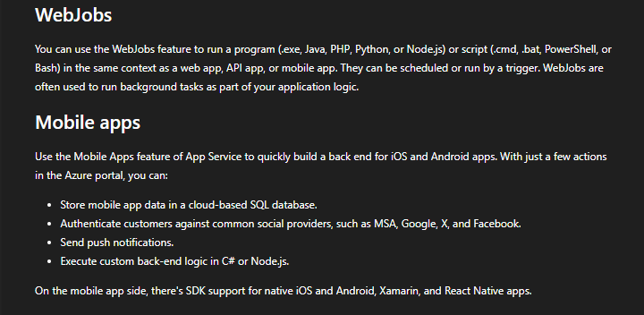

**Screenshot evidence:** Microsoft Learn explains WebJobs and Mobile Apps as App Service workload types.

---

### Step 21: Perform Final Cost Validation

1. Opened Azure Cost Management.
2. Opened the subscription budget.
3. Confirmed that the monthly budget remained active.
4. Confirmed evaluated spend remained `$0.00`.
5. Confirmed progress remained `0.00%`.
6. Confirmed no billable compute resources were created.

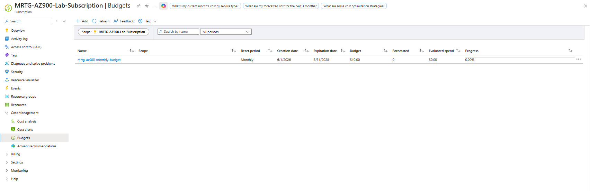

**Screenshot evidence:** The final Cost Management screenshot shows budget amount `$10.00`, evaluated spend `$0.00`, and progress `0.00%`.

---

## Compute Service Summary

| Compute Service | Service Model | Best For | Customer Responsibility |
|---|---|---|---|
| Azure Virtual Machines | IaaS | Full OS control, lift-and-shift, custom software | Highest |
| Virtual Machine Scale Sets | IaaS | Scaling groups of VMs | High |
| Azure App Service | PaaS | Web apps, APIs, jobs, and mobile back ends | Medium |
| Azure Functions | Serverless | Event-driven tasks and automation | Lower |
| Azure Container Apps | Managed container platform | Containerized apps without managing Kubernetes directly | Medium |
| Azure Kubernetes Service | Managed Kubernetes | Complex container orchestration | Medium to high |
| Azure Virtual Desktop | Desktop virtualization | Cloud-hosted desktops and remote apps | Medium |

---

## Compute Mental Model

```text
Virtual Machines
Use when you need the most control.

VM Scale Sets
Use when you need groups of VMs that can scale.

App Service
Use when you need web hosting without managing the OS.

Functions
Use when you need event-driven code that runs on demand.

Container Apps
Use when you need containers without managing Kubernetes directly.

AKS
Use when you need full Kubernetes orchestration.

Azure Virtual Desktop
Use when you need cloud-hosted desktops or remote apps.
```

---

## Control vs Operational Effort

| Option | Control | Operational Effort |
|---|---|---|
| Virtual Machines | Highest | Highest |
| VM Scale Sets | High | High |
| Containers | Medium to high | Medium |
| AKS | High for container orchestration | Medium to high |
| App Service | Medium | Lower |
| Azure Functions | Lower infrastructure control | Lower |
| Azure Virtual Desktop | Medium | Medium |

### Key Takeaway

The more control a service gives you, the more responsibility you usually keep.

The more managed the service is, the less infrastructure you usually manage.

---

## Validation

| Validation Check | Expected Result | Observed Result | Status |
|---|---|---|---|
| Compute module reviewed | Microsoft Learn compute module identified | Module introduction and objectives captured | Passed |
| VM concept reviewed | VMs documented as IaaS | VM overview captured | Passed |
| VM sizing reviewed | VM families and options documented | VM sizing screenshot captured | Passed |
| VM scale and resiliency reviewed | Scale Sets and resiliency options documented | VM scale screenshot captured | Passed |
| Availability sets reviewed | Update and fault domains documented | Availability sets screenshot captured | Passed |
| VM portal page reviewed | No VMs created | VM page showed no VMs | Passed |
| VMSS portal page reviewed | No VMSS resources created | VMSS page showed none | Passed |
| App Service portal page reviewed | No App Services created | App Services page showed none | Passed |
| Function App portal page reviewed | No Function Apps created | Function App page showed none | Passed |
| Container Apps portal page reviewed | No Container Apps created | Container Apps page showed none | Passed |
| AKS portal page reviewed | No clusters created | Kubernetes page showed `0` clusters | Passed |
| Azure Virtual Desktop reviewed | No host pool created | AVD overview captured | Passed |
| Containers reviewed | Container concepts documented | Containers overview captured | Passed |
| Container services reviewed | ACI and Container Apps documented | Container services captured | Passed |
| AKS concept reviewed | AKS documented as orchestration | AKS Learn screenshot captured | Passed |
| Azure Functions reviewed | Functions documented as serverless | Functions overview captured | Passed |
| Application hosting reviewed | VMs, containers, and App Service compared | Hosting options captured | Passed |
| App Service reviewed | App Service workload types documented | App Service overview captured | Passed |
| Final cost validation | Evaluated spend remains `$0.00` | Evaluated spend showed `$0.00` | Passed |

---

## Completion Checklist

- [x] Reviewed Microsoft Learn Azure compute services module
- [x] Reviewed Azure Virtual Machines
- [x] Reviewed VM size families
- [x] Reviewed VM scale and resiliency options
- [x] Reviewed VM availability sets
- [x] Opened Virtual Machines page in Azure portal
- [x] Opened Virtual Machine Scale Sets page in Azure portal
- [x] Opened App Services page in Azure portal
- [x] Opened Function App page in Azure portal
- [x] Opened Container Apps page in Azure portal
- [x] Opened Kubernetes services page in Azure portal
- [x] Opened Azure Virtual Desktop page in Azure portal
- [x] Reviewed Azure containers
- [x] Reviewed Azure Container Instances
- [x] Reviewed Azure Container Apps
- [x] Reviewed Azure Kubernetes Service
- [x] Reviewed Azure Functions
- [x] Reviewed application hosting options
- [x] Reviewed Azure App Service
- [x] Did not create any compute resources
- [x] Validated evaluated spend remained `$0.00`
- [x] Sanitized screenshots before upload

---

## AZ-900 Exam Objective Coverage

### Primary Exam Domain

```text
Describe Azure architecture and services
```

### Supporting Exam Domain

```text
Describe cloud concepts
```

### Skills Measured

This lab supports the ability to:

- Describe Azure compute services
- Describe Azure Virtual Machines
- Describe VM Scale Sets
- Describe VM availability options
- Describe Azure App Service
- Describe Azure Functions
- Describe containers in Azure
- Describe Azure Container Apps
- Describe Azure Kubernetes Service
- Describe Azure Virtual Desktop
- Compare compute service options
- Describe IaaS, PaaS, containers, and serverless compute
- Describe cost and responsibility differences between compute models

---

## Mini Objective Coverage

By completing this lab, I can now:

- Explain when Azure Virtual Machines are useful
- Explain why VMs require more customer management
- Explain how VM sizing affects performance and cost
- Explain what VM Scale Sets do
- Explain what VM availability sets do
- Explain how App Service reduces infrastructure management
- Explain how Azure Functions supports event-driven workloads
- Explain why containers are lighter than VMs
- Explain when Azure Container Apps may be useful
- Explain why AKS is used for container orchestration
- Explain what Azure Virtual Desktop provides
- Compare compute services by control and operational effort
- Validate Azure compute services without deploying resources
- Confirm cost impact after compute service review

---

## IAM / Security Relevance

Compute choices affect IAM and security because each service has different responsibility boundaries.

### Identity and Access Impacts

| Compute Option | IAM / Security Consideration |
|---|---|
| Virtual Machines | Requires OS access control, patching, endpoint security, network hardening, and privileged access control |
| VM Scale Sets | Requires consistent identity, patching, scaling, and access controls across multiple VM instances |
| App Service | Reduces OS management but still requires app identity, access control, secrets management, and deployment security |
| Azure Functions | Requires trigger security, managed identity, least privilege, and event-source control |
| Container Apps | Requires container image security, identity controls, ingress controls, and secrets management |
| AKS | Requires Kubernetes RBAC, Azure RBAC, network policies, image security, and cluster governance |
| Azure Virtual Desktop | Requires user assignment, Conditional Access, session host security, and profile management |

### Security Takeaway

Compute is one of the largest attack-surface decisions in Azure.

Choosing a VM when a managed service would work can increase patching, administrative access, endpoint exposure, and monitoring requirements.

Choosing a managed service can reduce infrastructure responsibility, but it does not remove IAM responsibility.

---

## Governance Notes

### Governance Decisions

| Decision | Implementation | Reason |
|---|---|---|
| Did not deploy compute | Portal discovery only | Prevents accidental cost |
| Reviewed Microsoft Learn | Used official training content | Aligns with AZ-900 objectives |
| Reviewed Azure portal | Validated service availability | Connects theory to real Azure administration |
| Reviewed Cost Management | Checked final spend | Confirms cost-safe lab execution |
| Redacted sensitive data | Removed account and identifier exposure | Keeps public documentation safe |

### Governance Lesson

Compute services should not be deployed casually.

Before creating compute resources, an organization should understand:

- Ownership
- Cost
- Access control
- Network exposure
- Patch responsibility
- Monitoring requirements
- Logging requirements
- Data sensitivity
- Business purpose
- Decommission plan

---

## Cost Considerations

### Estimated Lab Cost

```text
Estimated cost: $0.00
```

### Why Cost Stayed at Zero

This lab did not create:

- Virtual machines
- VM disks
- Public IP addresses
- Network interfaces
- Virtual Machine Scale Sets
- App Service plans
- App Services
- Function Apps
- Storage accounts for functions
- Container Apps
- Container environments
- AKS clusters
- Azure Virtual Desktop host pools
- Session hosts
- Load balancers

### Cost Reminder

Compute resources can become expensive quickly.

Common cost drivers include:

- VM size
- VM runtime
- Managed disks
- Public IP addresses
- App Service plans
- Always-on hosting
- Container replicas
- AKS node pools
- Log ingestion
- Bandwidth
- Premium features

### Budget Validation

Final Cost Management validation showed:

```text
Budget: $10.00
Forecasted: 0
Evaluated spend: $0.00
Progress: 0.00%
```

---

## Troubleshooting Notes

### Issue 1: Compute Create Buttons Are Always Visible

**Symptom:**

Azure portal pages show create buttons even when the lab only requires review.

**Risk:**

Clicking through create workflows can accidentally deploy paid resources.

**Resolution:**

The create buttons were avoided.

**Result:**

No compute resources were deployed.

---

### Issue 2: Some Services Look Similar

**Symptom:**

Azure App Service, Function App, and Container Apps can all appear to host application workloads.

**Explanation:**

They solve different problems:

| Service | Best Use |
|---|---|
| App Service | Long-running web apps and APIs |
| Functions | Event-driven code |
| Container Apps | Containerized apps with managed scaling |

**Result:**

The README includes a compute-selection summary.

---

### Issue 3: VM Options Can Be Overwhelming

**Symptom:**

VMs include many options such as size, disk, network, image, generation, and availability design.

**Explanation:**

VMs provide high control, which creates more decisions.

**Result:**

VMs were documented as high-control, high-responsibility IaaS compute.

---

## What I Would Do Differently in Production

A production Azure compute deployment would include:

- Workload requirements analysis
- Region selection
- Availability zone planning
- Cost estimate
- Naming standard
- Tagging standard
- RBAC design
- Managed identity design
- Network security design
- Private endpoint planning where needed
- Patch management plan
- Monitoring and alerting
- Log Analytics workspace design
- Backup and recovery plan
- Vulnerability management
- Defender for Cloud review
- Change-management approval
- Decommission plan
- Infrastructure as code
- Security baseline enforcement

This lab intentionally avoided deployment because the purpose was service selection and AZ-900 concept validation.

---

## Lessons Learned

- Azure compute includes more than Virtual Machines.
- Virtual Machines provide the most control but require the most management.
- VM sizing affects performance, cost, and workload fit.
- VM Scale Sets help scale groups of VMs.
- Availability sets improve VM resiliency through update and fault domains.
- App Service is a managed PaaS option for web apps, APIs, jobs, and mobile back ends.
- Azure Functions supports event-driven serverless compute.
- Containers are lighter than VMs and support portable application workloads.
- Azure Container Apps can run containers without directly managing Kubernetes.
- AKS provides managed Kubernetes for deeper container orchestration.
- Azure Virtual Desktop provides cloud-hosted desktops and remote apps.
- Compute choices affect cost, security, IAM, and operations.
- Cost validation should happen after every Azure lab.

### Technical Takeaway

Azure compute service selection is a tradeoff between control and operational responsibility.

### Business Takeaway

The right compute choice can reduce cost, simplify operations, and improve reliability.

### Security Takeaway

Compute decisions affect patching, identity, network exposure, logging, and privileged access.

### Exam Takeaway

For AZ-900, remember:

- VMs are IaaS.
- App Service is PaaS.
- Functions are serverless.
- Containers provide lightweight application isolation.
- AKS is managed Kubernetes.
- Azure Virtual Desktop provides cloud-hosted desktops and apps.
- More control usually means more responsibility.

---

## Cleanup

### Resources Retained

| Resource or Configuration | Reason |
|---|---|
| MRTG Azure subscription | Required for future labs |
| Monthly budget | Required for ongoing cost visibility |
| Lab documentation screenshots | Required for portfolio evidence |

### Resources Removed

No Azure compute resources were created during this lab.

### Cleanup Validation

- [x] No virtual machines were created
- [x] No VM Scale Sets were created
- [x] No App Services were created
- [x] No Function Apps were created
- [x] No Container Apps were created
- [x] No AKS clusters were created
- [x] No Azure Virtual Desktop host pools were created
- [x] No public IP addresses were created
- [x] No disks were created
- [x] No compute-related billable resources were deployed
- [x] Evaluated spend remained `$0.00`
- [x] Budget progress remained `0.00%`

---

## Outcome

This lab documented Azure compute service options and connected them to real-world workload selection.

The completed lab demonstrates:

- Understanding of Azure Virtual Machines
- Understanding of VM sizing and families
- Understanding of VM Scale Sets
- Understanding of VM availability sets
- Understanding of Azure App Service
- Understanding of Azure Functions
- Understanding of Azure containers
- Understanding of Azure Container Apps
- Understanding of Azure Kubernetes Service
- Understanding of Azure Virtual Desktop
- Understanding of compute service selection
- Awareness of compute cost risk
- Awareness of compute security responsibility
- Practical Azure portal validation
- No billable compute resources deployed
- Final evaluated spend of `$0.00`

---

## Screenshot Inventory

| Screenshot | Description |
|---|---|
| `01-microsoft-learn-azure-compute-services.png` | Microsoft Learn Azure compute services module |
| `02-azure-virtual-machines-overview.png` | Azure Virtual Machines overview |
| `03-vm-size-families-and-options.png` | VM size families and VM options |
| `04-vm-scale-and-resiliency-options.png` | VM sizing, scale, and resiliency options |
| `05-vm-availability-sets.png` | VM availability sets |
| `06-azure-virtual-machines-iaas.png` | Azure portal Virtual Machines page |
| `07-virtual-machine-scale-sets.png` | Azure portal VM Scale Sets page |
| `08-azure-app-service-paas.png` | Azure portal App Services page |
| `09-azure-functions-serverless.png` | Azure portal Function App page |
| `10-azure-container-apps.png` | Azure portal Container Apps page |
| `11-azure-kubernetes-service.png` | Azure portal Kubernetes services page |
| `12-azure-virtual-desktop.png` | Azure portal Azure Virtual Desktop page |
| `13-azure-containers-overview.png` | Azure containers overview |
| `14-container-services-aci-container-apps.png` | Azure Container Instances and Azure Container Apps |
| `15-azure-kubernetes-service-overview.png` | Azure Kubernetes Service overview |
| `16-azure-functions-overview.png` | Azure Functions overview |
| `17-azure-functions-benefits.png` | Azure Functions benefits |
| `18-application-hosting-options.png` | Application hosting option comparison |
| `19-azure-app-service-overview.png` | Azure App Service overview |
| `20-app-service-webjobs-mobile-apps.png` | App Service WebJobs and Mobile Apps |
| `21-cost-management-final-validation.png` | Final Cost Management validation |

---

## Next Lab

The next lab is:

```text
Lab 06 - Azure Networking Foundation
```

The next lab will build on this compute foundation by examining:

- Virtual networks
- Subnets
- IP addressing
- Network security groups
- Public and private access
- Azure DNS concepts
- Load balancing concepts
- VPN and hybrid connectivity basics
- Network security considerations
