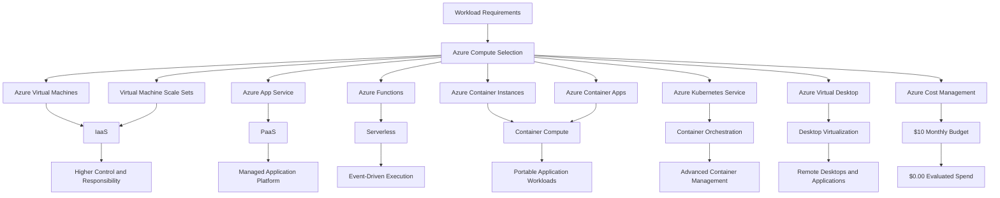

# Lab 05 - Azure Compute Services

## Objective

Document the primary Microsoft Azure compute services and explain when each compute option should be selected based on workload requirements, control, responsibility, scalability, security, and operational effort.

By completing this lab, I:

- Reviewed Azure compute service categories
- Documented Azure Virtual Machines as an IaaS compute option
- Reviewed virtual machine sizes, families, and supporting resources
- Reviewed virtual machine scaling and resiliency options
- Documented Virtual Machine Scale Sets
- Documented Azure App Service as a PaaS application-hosting option
- Documented Azure Functions as a serverless compute option
- Documented Azure Container Instances and Azure Container Apps
- Documented Azure Kubernetes Service as a managed Kubernetes platform
- Documented Azure Virtual Desktop as a cloud-hosted desktop and application-delivery service
- Compared compute services by control, responsibility, cost, and operational effort
- Validated Azure compute-service discovery without deploying resources
- Confirmed that no billable compute resources were created
- Confirmed that evaluated Azure spend remained `$0.00`

This was a discovery-only lab. No Azure compute resources or supporting configurations were created or modified.

---

## Business Problem Solved

Cloud teams must select the correct compute service before deploying workloads.

Choosing the wrong compute option can create:

- Unnecessary cost
- Excessive infrastructure-management requirements
- Additional patching responsibilities
- Increased administrative access
- Security exposure
- Scaling limitations
- Monitoring complexity
- Operational burden
- Vendor or platform constraints

Monroe Redstone Technology Group needed to understand:

- When Azure Virtual Machines should be used
- When Virtual Machine Scale Sets should be used
- When Azure App Service should be selected
- When Azure Functions should be selected
- When containers provide the best workload model
- When Azure Container Apps should be selected
- When Azure Kubernetes Service is appropriate
- When Azure Virtual Desktop should be used
- How compute choices affect cost, IAM, security, resiliency, and operations

This lab established a compute service-selection foundation before deploying production or advanced lab workloads.

---

## Scenario

MRTG has already established:

- A secured Azure administrative identity
- An active Azure subscription
- A monthly budget
- Resource naming and tagging standards
- A foundational resource group
- An understanding of cloud service models
- An understanding of Azure architecture and resource hierarchy

Before deploying compute resources, MRTG must review the major Azure compute options and determine how each service differs in control, responsibility, scalability, and operational effort.

The Azure Portal is used to locate each service and confirm that no compute workloads are currently deployed.

No compute resources are created during this lab.

---

## Azure Services and Resources Used

| Azure Service, Resource, or Platform | Purpose |
|---|---|
| Microsoft Learn | Provided certification-aligned Azure compute instruction |
| Azure Portal | Supported practical compute-service discovery |
| Azure Virtual Machines | Demonstrated Infrastructure as a Service compute |
| Virtual Machine Scale Sets | Demonstrated scalable groups of virtual machines |
| Azure App Service | Demonstrated managed PaaS application hosting |
| Azure Functions | Demonstrated serverless event-driven compute |
| Azure Container Instances | Demonstrated lightweight container execution |
| Azure Container Apps | Demonstrated managed container application hosting |
| Azure Kubernetes Service | Demonstrated managed Kubernetes orchestration |
| Azure Virtual Desktop | Demonstrated cloud-hosted desktop and remote application delivery |
| Azure Cost Management | Supported final spending validation |
| Azure Budgets | Confirmed that evaluated spend remained `$0.00` |

---

## Why These Services Were Used

### Microsoft Learn

Microsoft Learn was used as the primary certification-aligned source for Azure compute concepts.

It provided structured coverage of:

- Azure compute categories
- Azure Virtual Machines
- Virtual machine sizes and families
- Virtual Machine Scale Sets
- Availability sets
- Containers
- Azure Container Instances
- Azure Container Apps
- Azure Kubernetes Service
- Azure Functions
- Azure App Service
- Application-hosting options

### Azure Portal

The Azure Portal was used to connect Microsoft Learn concepts to real Azure services.

It supported:

- Virtual machine service discovery
- Virtual Machine Scale Set discovery
- App Service discovery
- Function App discovery
- Container Apps discovery
- Kubernetes service discovery
- Azure Virtual Desktop discovery
- Confirmation that no compute resources were deployed

The Azure Portal was used only for review and validation.

### Azure Virtual Machines

Azure Virtual Machines were reviewed as the primary IaaS compute option.

Virtual machines provide control over:

- Guest operating system
- Installed applications
- Runtime environment
- Local accounts and permissions
- Operating system configuration
- Workload networking
- Patch scheduling
- Endpoint security

That control also creates greater customer responsibility.

### Virtual Machine Scale Sets

Virtual Machine Scale Sets were reviewed as an option for deploying and managing groups of virtual machines.

Scale Sets can support:

- Multiple identical VM instances
- Automatic scaling
- Load-balanced workloads
- Scheduled scaling
- Increased application availability
- Consistent VM configuration

### Azure App Service

Azure App Service was reviewed as a managed PaaS application-hosting service.

It can support:

- Web applications
- REST APIs
- Mobile application back ends
- Background jobs
- Multiple programming languages
- Integrated scaling
- Managed platform maintenance

App Service reduces the need to manage the guest operating system.

### Azure Functions

Azure Functions was reviewed as an event-driven serverless compute service.

Functions can run in response to:

- HTTP requests
- Timer schedules
- Queue messages
- Storage events
- Application events
- Monitoring events

Azure Functions can reduce infrastructure-management requirements for short-running and event-driven workloads.

### Azure Container Instances

Azure Container Instances was reviewed as a lightweight method for running containers without directly managing virtual machines or Kubernetes infrastructure.

### Azure Container Apps

Azure Container Apps was reviewed as a managed platform for containerized applications.

It can support:

- Container-based application deployment
- Automatic scaling
- Ingress
- Microservices
- Background processing
- Event-driven workloads
- Revision management

### Azure Kubernetes Service

Azure Kubernetes Service was reviewed as a managed Kubernetes platform.

AKS is appropriate when an organization requires:

- Kubernetes orchestration
- Multiple containerized services
- Cluster-level scheduling
- Advanced scaling
- Kubernetes networking
- Kubernetes role-based access control
- Container platform governance

AKS reduces control-plane management but still requires significant platform administration.

### Azure Virtual Desktop

Azure Virtual Desktop was reviewed as a cloud-hosted desktop and remote application-delivery service.

It can support:

- Virtual desktops
- Published remote applications
- Remote workforce access
- Centralized desktop management
- Windows application delivery
- Pooled or personal desktop environments

### Azure Cost Management

Azure Cost Management was reviewed because compute services can generate charges quickly.

The final review confirmed that no billable compute resources had been deployed.

### Azure Budgets

The existing monthly budget provided evidence that:

- The `$10.00` monthly budget remained active
- Evaluated spend remained `$0.00`
- Budget progress remained `0.00%`

---

## Environment

| Item | Value |
|---|---|
| Organization | Monroe Redstone Technology Group |
| Project | MRTG Azure Fundamentals: The Bridge |
| Lab | Lab 05 - Azure Compute Services |
| Cloud Platform | Microsoft Azure |
| Management Interface | Azure Portal |
| Learning Platform | Microsoft Learn |
| Subscription | `MRTG-AZ900-Lab-Subscription` |
| New Resource Group | None |
| Compute Resources Created | None |
| Supporting Resources Created | None |
| Monthly Budget | `$10.00` |
| Evaluated Spend | `$0.00` |
| Budget Progress | `0.00%` |
| Documentation Platform | GitHub |
| Lab Type | Discovery-only |
| Estimated Cost | `$0.00` |

---

## Architecture / Concept Diagram



---

## Steps Performed

### Step 1: Review the Azure Compute Services Module

1. Opened Microsoft Learn.
2. Located the Azure compute services module.
3. Reviewed the module introduction and learning objectives.
4. Confirmed that the module covered:
   - Compute types
   - Azure Virtual Machines
   - Virtual Machine Scale Sets
   - Availability sets
   - Containers
   - Azure Container Instances
   - Azure Container Apps
   - Azure Kubernetes Service
   - Azure Functions
   - Application-hosting options
   - Azure App Service


**Validation:** Microsoft Learn displayed the Azure compute services module and its AZ-900-aligned objectives.

---

### Step 2: Review Azure Virtual Machines

1. Opened the Azure Virtual Machines section in Microsoft Learn.
2. Documented virtual machines as an Infrastructure as a Service compute option.
3. Reviewed common VM use cases:
   - Development and testing
   - Application hosting
   - Datacenter extension
   - Disaster recovery
   - Lift-and-shift migration
   - Legacy workload support
4. Reviewed common VM resource requirements:
   - VM size
   - Operating system image
   - Managed disks
   - Network interface
   - Virtual network
   - Subnet
   - Optional public IP address


**Validation:** Microsoft Learn described Azure Virtual Machines as IaaS compute providing guest operating system control and increased customer responsibility.

---

### Step 3: Review VM Size Families and Options

1. Reviewed Azure virtual machine size families.
2. Documented common VM families:
   - B-series
   - D-series
   - E-series
   - F-series
   - M-series
   - L-series
   - N-series
3. Reviewed VM sizing characteristics:
   - Virtual CPUs
   - Memory
   - Temporary storage
   - Disk support
   - Network performance
   - Premium storage support
   - Hardware generation
4. Documented that selecting a larger VM size generally increases cost.


**Validation:** Microsoft Learn displayed common Azure VM families and configurable resource characteristics.

---

### Step 4: Review VM Scaling and Resiliency Options

1. Reviewed VM naming and size information.
2. Reviewed VM scaling and resiliency options.
3. Documented that Virtual Machine Scale Sets can deploy and manage groups of similar virtual machines.
4. Reviewed scale-out and scale-in behavior.
5. Documented that scaling can occur based on:
   - Demand
   - Performance metrics
   - Schedules
   - Instance requirements


**Validation:** Microsoft Learn introduced Virtual Machine Scale Sets and VM scaling behavior.

---

### Step 5: Review VM Availability Sets

1. Opened the VM availability sets section.
2. Documented how availability sets can improve VM resiliency within an Azure region.
3. Reviewed:
   - Fault domains
   - Update domains
4. Documented that multiple virtual machines are required to benefit from an availability set.
5. Documented that each virtual machine continues to generate its own resource cost.


**Validation:** Microsoft Learn described fault domains, update domains, and availability sets.

---

### Step 6: Validate Azure Virtual Machines in the Portal

1. Opened the Azure Portal.
2. Navigated to **Virtual machines**.
3. Confirmed that no virtual machines existed.
4. Did not select **Create**.
5. Did not deploy a virtual machine or supporting resource.
6. Documented Azure Virtual Machines as the practical IaaS example.


**Validation:** The Azure Portal displayed the Virtual Machines page with no virtual machines deployed.

---

### Step 7: Validate Virtual Machine Scale Sets in the Portal

1. Opened **Virtual Machine Scale Sets** in the Azure Portal.
2. Confirmed that no Scale Sets existed.
3. Did not create a Virtual Machine Scale Set.
4. Did not create supporting virtual machines, networking, or load-balancing resources.
5. Documented Scale Sets as the Azure option for managing scalable groups of virtual machines.


**Validation:** The Azure Portal displayed the Virtual Machine Scale Sets page with no Scale Sets deployed.

---

### Step 8: Validate Azure App Service in the Portal

1. Opened **App Services** in the Azure Portal.
2. Confirmed that no App Services existed.
3. Did not create an App Service.
4. Did not create an App Service plan.
5. Documented App Service as a PaaS option for web applications, APIs, background jobs, and mobile back ends.


**Validation:** The Azure Portal displayed the App Services page with no applications deployed.

---

### Step 9: Validate Azure Functions in the Portal

1. Opened **Function App** in the Azure Portal.
2. Confirmed that no Function Apps existed.
3. Did not create a Function App.
4. Did not create a hosting plan, storage account, or monitoring resource.
5. Documented Azure Functions as event-driven serverless compute.


**Validation:** The Azure Portal displayed the Function App page with no Function Apps deployed.

---

### Step 10: Validate Azure Container Apps in the Portal

1. Opened **Container Apps** in the Azure Portal.
2. Confirmed that no Container Apps existed.
3. Did not create a Container App.
4. Did not create a Container Apps environment.
5. Documented Azure Container Apps as a managed container application platform.


**Validation:** The Azure Portal displayed the Container Apps page with no applications deployed.

---

### Step 11: Validate Azure Kubernetes Service in the Portal

1. Opened the Kubernetes service area in the Azure Portal.
2. Opened the cluster view.
3. Confirmed that the total number of clusters was `0`.
4. Did not create an AKS cluster.
5. Did not create node pools, load balancers, disks, or networking resources.
6. Documented AKS as a managed Kubernetes orchestration platform.


**Validation:** The Azure Portal displayed the Kubernetes cluster view with no clusters deployed.

---

### Step 12: Validate Azure Virtual Desktop in the Portal

1. Opened **Azure Virtual Desktop** in the Azure Portal.
2. Reviewed the service overview.
3. Confirmed that no host pools were created.
4. Did not create session hosts, application groups, or workspaces.
5. Documented Azure Virtual Desktop as a cloud-hosted desktop and remote application platform.


**Validation:** The Azure Portal displayed Azure Virtual Desktop without a deployed host pool.

---

### Step 13: Review Azure Containers

1. Opened the containers section in Microsoft Learn.
2. Documented containers as lightweight application environments.
3. Compared containers with virtual machines.
4. Reviewed how containers share the host operating system while isolating application processes.
5. Documented that containers can be created, scaled, stopped, and replaced dynamically.


**Validation:** Microsoft Learn described containers as lightweight compute environments compared with virtual machines.

---

### Step 14: Review Azure Container Services

1. Reviewed Azure Container Instances.
2. Reviewed Azure Container Apps.
3. Documented that Azure Container Instances provides a quick method for running containers without directly managing virtual machines.
4. Documented that Azure Container Apps supports:
   - Managed container hosting
   - Automatic scaling
   - Ingress
   - Application revisions
   - Microservices
   - Event-driven processing
5. Compared lightweight container execution with managed container application hosting.


**Validation:** Microsoft Learn described Azure Container Instances and Azure Container Apps as container-hosting options with different management capabilities.

---

### Step 15: Review Azure Kubernetes Service

1. Opened the AKS section in Microsoft Learn.
2. Documented AKS as a managed Kubernetes orchestration service.
3. Reviewed the differences between:
   - Azure Container Instances
   - Azure Container Apps
   - Azure Kubernetes Service
4. Documented that AKS is designed for more advanced container orchestration requirements.
5. Reviewed the continued customer responsibility for cluster configuration, workloads, security, networking, and governance.


**Validation:** Microsoft Learn described AKS as a managed Kubernetes platform for container orchestration.

---

### Step 16: Review Azure Functions

1. Opened the Azure Functions section in Microsoft Learn.
2. Documented Azure Functions as event-driven serverless compute.
3. Reviewed function triggers and outputs.
4. Documented common triggers:
   - HTTP requests
   - Timer schedules
   - Queue messages
   - Storage events
   - Event streams
5. Documented that functions are useful for automation and short-running application logic.


**Validation:** Microsoft Learn described Azure Functions as event-driven compute using triggers and outputs.

---

### Step 17: Review Azure Functions Benefits

1. Continued reviewing Azure Functions.
2. Documented that functions can scale automatically based on demand.
3. Reviewed usage-based execution models.
4. Documented that common serverless hosting options can charge based on active execution.
5. Reviewed the benefit of not maintaining continuously running infrastructure for occasional events.


**Validation:** Microsoft Learn displayed Azure Functions scaling and active-execution concepts.

---

### Step 18: Review Application-Hosting Options

1. Opened the application-hosting comparison in Microsoft Learn.
2. Compared:
   - Azure Virtual Machines
   - Containers
   - Azure App Service
3. Documented the relationship between control and operational effort.
4. Reviewed how managed services can reduce operating system and infrastructure-management requirements.


**Validation:** Microsoft Learn compared virtual machines, containers, and App Service by control and management responsibility.

---

### Step 19: Review Azure App Service

1. Opened the Azure App Service section in Microsoft Learn.
2. Documented App Service as managed hosting for:
   - Web applications
   - API applications
   - WebJobs
   - Mobile application back ends
3. Reviewed App Service benefits:
   - Integrated deployment
   - Managed platform maintenance
   - Secure endpoints
   - Scaling
   - Load balancing
   - Traffic management


**Validation:** Microsoft Learn described Azure App Service as a managed hosting platform for web applications, APIs, jobs, and mobile back ends.

---

### Step 20: Review WebJobs and Mobile Apps

1. Reviewed additional App Service workload types.
2. Documented WebJobs as a method for running background tasks.
3. Documented Mobile Apps as back-end services for mobile applications.
4. Reviewed how App Service supports multiple application patterns.


**Validation:** Microsoft Learn described WebJobs and Mobile Apps as App Service workload options.

---

### Step 21: Perform Final Cost Validation

1. Opened Azure Cost Management.
2. Opened the existing subscription budget.
3. Confirmed that the monthly budget remained active.
4. Confirmed that evaluated spend remained `$0.00`.
5. Confirmed that budget progress remained `0.00%`.
6. Confirmed that no billable compute or supporting resources were created.
7. Redacted sensitive subscription and scope information.


**Validation:** The final Cost Management review showed the `$10.00` monthly budget, `$0.00` evaluated spend, and `0.00%` progress.

---

## Compute Service Summary

| Compute Service | Service Model | Best Fit | Customer Responsibility |
|---|---|---|---|
| Azure Virtual Machines | IaaS | Full operating system control, lift-and-shift workloads, and custom software | Highest |
| Virtual Machine Scale Sets | IaaS | Scalable groups of similar virtual machines | High |
| Azure App Service | PaaS | Web applications, APIs, jobs, and mobile back ends | Moderate |
| Azure Functions | Serverless | Event-driven code, automation, and short-running tasks | Lower infrastructure responsibility |
| Azure Container Instances | Container compute | Fast, isolated container execution | Moderate |
| Azure Container Apps | Managed container platform | Containerized applications without direct Kubernetes management | Moderate |
| Azure Kubernetes Service | Managed Kubernetes | Advanced container orchestration | Moderate to high |
| Azure Virtual Desktop | Desktop virtualization | Cloud-hosted desktops and remote applications | Moderate |

---

## Compute Selection Mental Model

```text
Azure Virtual Machines
Use when the workload requires operating system control.

Virtual Machine Scale Sets
Use when groups of virtual machines must scale together.

Azure App Service
Use when web applications or APIs need managed hosting.

Azure Functions
Use when code should run in response to events.

Azure Container Instances
Use for simple or temporary container execution.

Azure Container Apps
Use for managed containerized applications without directly managing Kubernetes.

Azure Kubernetes Service
Use when full Kubernetes orchestration is required.

Azure Virtual Desktop
Use when users need cloud-hosted desktops or remote applications.
```

---

## Control vs Operational Effort

| Compute Option | Customer Control | Operational Effort |
|---|---|---|
| Azure Virtual Machines | Highest | Highest |
| Virtual Machine Scale Sets | High | High |
| Azure Kubernetes Service | High container-platform control | Medium to high |
| Azure Container Instances | Moderate | Moderate |
| Azure Container Apps | Moderate | Lower to moderate |
| Azure App Service | Moderate application control | Lower |
| Azure Functions | Lower infrastructure control | Lower |
| Azure Virtual Desktop | Moderate | Moderate |

### Key Takeaway

More control generally creates more responsibility.

More managed services generally reduce infrastructure-management requirements.

Managed services do not eliminate customer responsibility for:

- Identity
- Access
- Data
- Application configuration
- Network configuration
- Monitoring
- Security
- Cost

---

## Virtual Machine Components

A typical Azure virtual machine deployment can include:

```text
Virtual Machine
├── Operating System Image
├── VM Size
├── Managed Operating System Disk
├── Optional Data Disks
├── Network Interface
├── Virtual Network
├── Subnet
├── Network Security Group
├── Optional Public IP Address
└── Monitoring and Backup Configuration
```

Each supporting resource can introduce additional:

- Cost
- Security requirements
- Management responsibility
- Cleanup requirements
- Monitoring requirements

---

## Virtual Machine Resiliency Options

| Option | Purpose |
|---|---|
| Availability Set | Distributes virtual machines across fault and update domains |
| Availability Zone | Places virtual machines in physically separate locations within a supported region |
| Virtual Machine Scale Set | Deploys and manages multiple scalable VM instances |
| Region Replication | Supports cross-region recovery when designed and configured |
| Backup | Protects VM data and configuration |
| Site Recovery | Supports workload replication and disaster recovery |

High availability requires multiple instances or resilient platform services.

A single virtual machine does not provide application-level high availability by itself.

---

## Container Service Comparison

| Service | Best Fit | Management Level |
|---|---|---|
| Azure Container Instances | Simple or temporary containers | Minimal platform management |
| Azure Container Apps | Managed containerized applications and microservices | Low to moderate |
| Azure Kubernetes Service | Complex container platforms requiring Kubernetes | Moderate to high |

### Container Takeaway

Containers provide application portability and lightweight isolation.

The correct Azure container service depends on:

- Application complexity
- Scaling requirements
- Networking requirements
- Operational expertise
- Kubernetes requirements
- Security requirements
- Deployment model

---

## Validation

| Validation Item | Expected Result | Actual Result |
|---|---|---|
| Microsoft Learn compute module | Compute module is available | Passed |
| Azure Virtual Machines | VM concepts are reviewed | Passed |
| VM sizes and families | VM sizing options are documented | Passed |
| VM scaling | Scale Set behavior is documented | Passed |
| VM availability sets | Fault and update domains are documented | Passed |
| Virtual Machines portal page | No virtual machines are deployed | Passed |
| Virtual Machine Scale Sets portal page | No Scale Sets are deployed | Passed |
| App Services portal page | No App Services are deployed | Passed |
| Function App portal page | No Function Apps are deployed | Passed |
| Container Apps portal page | No Container Apps are deployed | Passed |
| Kubernetes cluster page | No AKS clusters are deployed | Passed |
| Azure Virtual Desktop | No host pools are deployed | Passed |
| Azure containers | Container concepts are reviewed | Passed |
| Container services | ACI and Container Apps are compared | Passed |
| Azure Kubernetes Service | AKS orchestration is reviewed | Passed |
| Azure Functions | Serverless functions are reviewed | Passed |
| Application hosting | VMs, containers, and App Service are compared | Passed |
| Azure App Service | App Service workload types are reviewed | Passed |
| Compute resources | No billable compute resources are created | Passed |
| Supporting resources | No billable dependencies are created | Passed |
| Monthly budget | Existing budget remains active | Passed |
| Evaluated spend | Spend remains `$0.00` | Passed |
| Budget progress | Progress remains `0.00%` | Passed |
| Estimated cost | Lab remains within the `$0.00` estimate | Passed |

---

## Completion Checklist

- [x] Reviewed the Microsoft Learn Azure compute services module
- [x] Reviewed Azure Virtual Machines
- [x] Reviewed VM size families
- [x] Reviewed VM scaling options
- [x] Reviewed Virtual Machine Scale Sets
- [x] Reviewed VM availability sets
- [x] Opened the Virtual Machines page in the Azure Portal
- [x] Opened the Virtual Machine Scale Sets page
- [x] Opened the App Services page
- [x] Opened the Function App page
- [x] Opened the Container Apps page
- [x] Opened the Kubernetes cluster page
- [x] Opened Azure Virtual Desktop
- [x] Reviewed Azure containers
- [x] Reviewed Azure Container Instances
- [x] Reviewed Azure Container Apps
- [x] Reviewed Azure Kubernetes Service
- [x] Reviewed Azure Functions
- [x] Reviewed application-hosting options
- [x] Reviewed Azure App Service
- [x] Reviewed WebJobs and Mobile Apps
- [x] Did not create any compute resources
- [x] Did not create supporting networking or storage resources
- [x] Validated that the monthly budget remained active
- [x] Validated that evaluated spend remained `$0.00`
- [x] Validated that budget progress remained `0.00%`
- [x] Sanitized screenshots before upload
- [x] Avoided exposing sensitive account, tenant, or subscription information

---

## AZ-900 Exam Objective Coverage

### Primary Exam Domain

```text
Describe Azure architecture and services
```

### Supporting Exam Domain

```text
Describe cloud concepts
```

### Skills Measured

This lab supports the ability to:

- Describe Azure compute services
- Describe Azure Virtual Machines
- Describe Virtual Machine Scale Sets
- Describe VM availability options
- Describe Azure App Service
- Describe Azure Functions
- Describe Azure containers
- Describe Azure Container Instances
- Describe Azure Container Apps
- Describe Azure Kubernetes Service
- Describe Azure Virtual Desktop
- Compare Azure compute options
- Compare IaaS, PaaS, containers, and serverless compute
- Describe cost and responsibility differences between compute models

### How This Lab Supports the Objectives

This lab connected Azure compute concepts to practical Azure Portal service discovery.

It demonstrated:

- How Azure compute services support different workload types
- How control and responsibility change between compute models
- How virtual machine sizing affects performance and cost
- How Azure supports compute scaling and resiliency
- How managed platforms reduce infrastructure-management requirements
- How serverless services support event-driven execution
- How container services provide different levels of orchestration
- How Cost Management validates safe lab execution

---

## Mini Objective Coverage

By completing this lab, I can:

- Explain when Azure Virtual Machines are appropriate
- Explain why virtual machines require more customer management
- Explain how VM sizing affects performance and cost
- Explain the purpose of Virtual Machine Scale Sets
- Explain the purpose of VM availability sets
- Explain how Azure App Service reduces infrastructure management
- Explain how Azure Functions supports event-driven workloads
- Explain why containers are lighter than virtual machines
- Explain when Azure Container Instances may be appropriate
- Explain when Azure Container Apps may be appropriate
- Explain why AKS is used for container orchestration
- Explain what Azure Virtual Desktop provides
- Compare compute services by control and operational effort
- Identify supporting resources associated with compute deployment
- Validate Azure compute services without creating resources
- Confirm cost impact after compute-service review

---

## IAM / Security Relevance

Compute choices affect identity and security because each service has different responsibility boundaries and attack surfaces.

### Identity and Access Considerations

| Compute Option | IAM / Security Consideration |
|---|---|
| Azure Virtual Machines | Requires Azure RBAC, operating system access control, privileged account management, patching, endpoint protection, and network hardening |
| Virtual Machine Scale Sets | Requires consistent identity, access, patching, image, and security controls across multiple instances |
| Azure App Service | Requires application identity, deployment security, secrets management, authentication, authorization, and network controls |
| Azure Functions | Requires trigger protection, managed identity, least privilege, secrets management, and event-source control |
| Azure Container Instances | Requires image security, registry access, network controls, and container identity planning |
| Azure Container Apps | Requires ingress controls, managed identity, secrets management, image security, and revision governance |
| Azure Kubernetes Service | Requires Kubernetes RBAC, Azure RBAC, workload identities, network policies, image security, and cluster governance |
| Azure Virtual Desktop | Requires user assignment, Conditional Access, session-host security, profile management, and remote-access monitoring |

### Azure RBAC

Azure RBAC controls management-plane access to compute resources.

Assignments should use:

- The correct role
- The narrowest practical scope
- Group-based access where possible
- Temporary elevation for privileged tasks
- Regular access reviews

### Managed Identities

Managed identities can allow Azure resources and applications to authenticate to supported services without storing credentials in code or configuration files.

Potential use cases include:

- App Service accessing Key Vault
- Azure Functions accessing storage
- Virtual machines accessing Azure resources
- Container Apps accessing supported services
- AKS workloads accessing Azure services

### Privileged Access

Virtual machines and container platforms can create privileged-access paths involving:

- Local administrator accounts
- SSH keys
- Remote Desktop
- Kubernetes administrators
- Deployment credentials
- Service principals
- Secrets
- Registry credentials

These paths require strong authentication, least privilege, monitoring, and lifecycle management.

### Security Takeaway

Compute is one of the most significant attack-surface decisions in Azure.

Selecting a virtual machine when a managed service would meet the requirement can increase:

- Patching responsibility
- Administrative access
- Network exposure
- Endpoint risk
- Logging requirements
- Configuration complexity

Selecting a managed service can reduce infrastructure responsibility, but it does not eliminate IAM, application-security, data-protection, or monitoring responsibilities.

---

## Governance Notes

### Governance Decisions

| Decision | Implementation | Reason |
|---|---|---|
| Discovery-only lab | Compute services were reviewed without deployment | Prevented unnecessary cost |
| Microsoft Learn used | Certification-aligned compute content reviewed | Supported AZ-900 preparation |
| Azure Portal used | Compute services were located in the live environment | Connected theory to practical administration |
| Cost Management reviewed | Monthly budget and spending state validated | Confirmed cost-safe execution |
| Screenshots sanitized | Sensitive identifiers were redacted | Protected environment information |
| No premium services enabled | Optional paid features were avoided | Maintained the `$0.00` cost target |

### Governance Lesson

Compute resources should not be deployed without understanding:

- Business purpose
- Workload owner
- Service owner
- Identity requirements
- Access requirements
- Data classification
- Network exposure
- Patch responsibility
- Monitoring requirements
- Availability requirements
- Backup requirements
- Estimated cost
- Decommission plan

### Compute Deployment Standard

A production compute request should document:

| Requirement | Example |
|---|---|
| Workload owner | Application team |
| Environment | Production |
| Data classification | Confidential |
| Required region | Central US |
| Compute model | PaaS |
| Availability target | 99.9% |
| Authentication method | Microsoft Entra ID |
| Network access | Private |
| Monitoring owner | Cloud Operations |
| Cost center | Application department |
| Cleanup date | Not applicable for production |
| Recovery requirement | Documented RTO and RPO |

---

## Cost Considerations

### Estimated Lab Cost

```text
Estimated cost: $0.00
```

### Why Cost Remained at Zero

This lab did not create:

- Virtual machines
- Managed disks
- Network interfaces
- Public IP addresses
- Virtual networks
- Virtual Machine Scale Sets
- Load balancers
- App Service plans
- App Services
- Function Apps
- Function storage accounts
- Container Instances
- Container Apps
- Container Apps environments
- AKS clusters
- AKS node pools
- Azure Virtual Desktop host pools
- Session hosts
- Log Analytics workspaces

### Common Compute Cost Drivers

- VM size
- VM runtime
- Number of VM instances
- Managed disks
- Disk performance tier
- Operating system licensing
- Public IP addresses
- Load balancers
- App Service plans
- App Service pricing tiers
- Function execution
- Function hosting plans
- Container replicas
- Container CPU and memory
- AKS node pools
- Network traffic
- Monitoring-data ingestion
- Backup and retention
- Premium security features

### Compute Cost Comparison

| Compute Option | Typical Cost Pattern |
|---|---|
| Azure Virtual Machines | VM runtime, disks, networking, licenses, monitoring, and backup |
| Virtual Machine Scale Sets | Multiple VM instances plus supporting resources |
| Azure App Service | App Service plan tier and scaling |
| Azure Functions | Execution, runtime, memory, and supporting services |
| Azure Container Instances | Container CPU, memory, and runtime |
| Azure Container Apps | Application replicas, CPU, memory, and requests |
| Azure Kubernetes Service | Worker nodes, disks, networking, monitoring, and supporting services |
| Azure Virtual Desktop | Session-host VMs, storage, networking, and user licensing requirements |

### Budget Validation

The final Cost Management review showed:

```text
Budget: $10.00
Forecasted spend: 0
Evaluated spend: $0.00
Progress: 0.00%
```

### Budget Limitation

Azure budgets:

- Monitor actual and forecasted costs
- Generate notifications
- Do not automatically stop compute resources
- Do not deallocate virtual machines
- Do not delete workloads
- Do not prevent additional charges
- Do not replace regular Cost Management review

---

## Troubleshooting Notes

### Issue 1: Compute Create Options Were Prominent

**Symptom**

Azure Portal compute pages displayed prominent **Create** options.

**Risk**

Completing a creation workflow could deploy billable compute resources and supporting dependencies.

**Resolution**

Each service page was opened for discovery only.

No creation workflow was completed.

**Result**

No compute or supporting resource was deployed.

---

### Issue 2: Compute Services Appeared Similar

**Symptom**

Azure App Service, Azure Functions, Azure Container Apps, and AKS can all host application workloads.

**Explanation**

They serve different workload and management requirements.

| Service | Best Fit |
|---|---|
| Azure App Service | Long-running web applications and APIs |
| Azure Functions | Event-driven and short-running code |
| Azure Container Apps | Managed containerized applications |
| Azure Kubernetes Service | Advanced Kubernetes orchestration |

**Result**

A compute-selection model was documented to clarify the differences.

---

### Issue 3: Virtual Machine Options Were Extensive

**Symptom**

Virtual machine deployment includes many decisions involving:

- VM size
- Operating system image
- Disk configuration
- Networking
- Availability
- Identity
- Monitoring
- Backup

**Explanation**

Virtual machines provide high control, which creates additional configuration and operational responsibility.

**Result**

Azure Virtual Machines were documented as high-control and high-responsibility IaaS compute.

---

### Issue 4: AKS Is Managed but Still Complex

**Symptom**

The term managed Kubernetes can suggest that Microsoft manages the entire AKS environment.

**Explanation**

Microsoft manages significant portions of the Kubernetes control plane, but the customer remains responsible for areas such as:

- Node pools
- Workloads
- Kubernetes configuration
- Cluster access
- Networking
- Container images
- Secrets
- Monitoring
- Governance

**Result**

AKS was documented as a managed service that still requires substantial platform expertise.

---

## What I Would Do Differently in Production

A production Azure compute deployment would require formal architecture, identity, security, resiliency, operations, and cost planning.

### Architecture

- Document workload requirements
- Select an approved Azure region
- Define availability requirements
- Use availability zones where supported
- Define scaling requirements
- Define recovery-time objectives
- Define recovery-point objectives
- Select the least complex service that meets the requirement
- Document service dependencies
- Test performance and failure scenarios

### Identity and Access

- Use Microsoft Entra work accounts
- Assign Azure RBAC through groups
- Use the narrowest practical scope
- Use managed identities where supported
- Store secrets in Azure Key Vault
- Use Privileged Identity Management
- Configure Conditional Access
- Avoid permanent privileged access
- Review service and workload identities regularly

### Network Security

- Avoid unnecessary public IP addresses
- Use private endpoints where appropriate
- Restrict inbound access
- Use network security groups
- Use Azure Firewall where required
- Protect administrative access
- Use secure remote management
- Segment production workloads
- Monitor network activity

### Workload Security

- Apply secure VM images
- Patch operating systems
- Scan container images
- Protect container registries
- Use workload identities
- Configure application authentication
- Protect API endpoints
- Apply least privilege
- Enable vulnerability management
- Review Microsoft Defender for Cloud recommendations

### Operations

- Use Infrastructure as Code
- Store deployment templates in source control
- Require peer review
- Configure monitoring and alerts
- Configure centralized logging
- Define backup and recovery
- Document ownership
- Establish patching procedures
- Establish incident-response procedures
- Define decommission and cleanup processes

### Cost Management

- Estimate cost before deployment
- Select appropriate resource sizes
- Configure workload-level budgets
- Apply cost-center tags
- Use autoscaling carefully
- Shut down non-production resources
- Review idle resources
- Remove orphaned disks and public IP addresses
- Review spending regularly
- Establish approval thresholds for premium compute services

The lab intentionally avoided deployment because its purpose was compute service selection and AZ-900 concept validation.

---

## Lessons Learned

- Azure compute includes more than virtual machines.
- Azure Virtual Machines provide the greatest operating system control and require the most customer management.
- VM sizing affects performance, capability, and cost.
- Virtual Machine Scale Sets support scalable groups of virtual machines.
- Availability sets improve resiliency through fault and update domains.
- Azure App Service provides managed hosting for web applications, APIs, jobs, and mobile back ends.
- Azure Functions supports event-driven serverless compute.
- Containers are lighter than virtual machines and support portable application workloads.
- Azure Container Instances supports simple container execution.
- Azure Container Apps provides managed hosting for containerized applications.
- AKS provides managed Kubernetes for advanced orchestration.
- Azure Virtual Desktop provides cloud-hosted desktops and remote applications.
- Compute choices affect cost, IAM, network exposure, patching, monitoring, and operational responsibility.
- Cost validation should be performed after every Azure lab.

### Technical Takeaway

Azure compute service selection is a tradeoff between control, flexibility, scalability, and operational responsibility.

### Business Takeaway

Selecting the correct compute platform can reduce cost, simplify operations, improve reliability, and allow teams to focus on business requirements.

### Security Takeaway

Compute decisions affect patching, identity, privileged access, network exposure, application security, logging, and incident response.

### Exam Takeaway

For AZ-900, remember:

- Azure Virtual Machines are IaaS.
- Virtual Machine Scale Sets manage scalable groups of virtual machines.
- Availability sets use fault and update domains.
- Azure App Service is PaaS.
- Azure Functions is serverless compute.
- Containers provide lightweight application isolation.
- Azure Container Apps provides managed container hosting.
- AKS provides managed Kubernetes orchestration.
- Azure Virtual Desktop provides cloud-hosted desktops and applications.
- More control generally creates more customer responsibility.

---

## Cleanup

### Resources Retained

| Resource or Configuration | Reason |
|---|---|
| MRTG Azure subscription | Required for the remaining labs |
| Monthly Azure budget | Required for ongoing cost visibility |
| Lab 01 resource group | Retained as the foundational resource group |
| Lab 05 documentation | Retained as project evidence |
| Lab 05 screenshots | Retained as validation evidence |

### Resources Removed

No Azure compute resources were created during this lab.

### Cleanup Validation

- [x] No virtual machines were created
- [x] No managed disks were created
- [x] No network interfaces were created
- [x] No public IP addresses were created
- [x] No Virtual Machine Scale Sets were created
- [x] No load balancers were created
- [x] No App Services were created
- [x] No App Service plans were created
- [x] No Function Apps were created
- [x] No Function storage accounts were created
- [x] No Azure Container Instances were created
- [x] No Container Apps were created
- [x] No Container Apps environments were created
- [x] No AKS clusters were created
- [x] No AKS node pools were created
- [x] No Azure Virtual Desktop host pools were created
- [x] No session hosts were created
- [x] No compute-related billable resources were deployed
- [x] Monthly budget remained active
- [x] Evaluated spend remained `$0.00`
- [x] Budget progress remained `0.00%`
- [x] Screenshot data was sanitized

---

## Outcome

This lab documented Azure compute-service options and connected them to real-world workload selection.

The completed lab demonstrated:

- Understanding of Azure Virtual Machines
- Understanding of VM sizes and families
- Understanding of Virtual Machine Scale Sets
- Understanding of VM availability sets
- Understanding of Azure App Service
- Understanding of Azure Functions
- Understanding of Azure containers
- Understanding of Azure Container Instances
- Understanding of Azure Container Apps
- Understanding of Azure Kubernetes Service
- Understanding of Azure Virtual Desktop
- Understanding of compute service selection
- Awareness of compute cost risk
- Awareness of compute security responsibility
- Practical Azure Portal validation
- No billable compute resources deployed
- Final evaluated spend of `$0.00`

---

## Screenshot Inventory

| Screenshot | Description |
|---|---|
| `01-microsoft-learn-azure-compute-services.png` | Microsoft Learn Azure compute services module |
| `02-azure-virtual-machines-overview.png` | Azure Virtual Machines overview |
| `03-vm-size-families-and-options.png` | VM size families and configuration options |
| `04-vm-scale-and-resiliency-options.png` | VM scaling and resiliency options |
| `05-vm-availability-sets.png` | VM availability sets, fault domains, and update domains |
| `06-azure-virtual-machines-iaas.png` | Azure Portal Virtual Machines page |
| `07-virtual-machine-scale-sets.png` | Azure Portal Virtual Machine Scale Sets page |
| `08-azure-app-service-paas.png` | Azure Portal App Services page |
| `09-azure-functions-serverless.png` | Azure Portal Function App page |
| `10-azure-container-apps.png` | Azure Portal Container Apps page |
| `11-azure-kubernetes-service.png` | Azure Portal Kubernetes cluster page |
| `12-azure-virtual-desktop.png` | Azure Portal Azure Virtual Desktop page |
| `13-azure-containers-overview.png` | Azure containers overview |
| `14-container-services-aci-container-apps.png` | Azure Container Instances and Azure Container Apps |
| `15-azure-kubernetes-service-overview.png` | Azure Kubernetes Service overview |
| `16-azure-functions-overview.png` | Azure Functions overview |
| `17-azure-functions-benefits.png` | Azure Functions scaling and execution benefits |
| `18-application-hosting-options.png` | Application-hosting option comparison |
| `19-azure-app-service-overview.png` | Azure App Service overview |
| `20-app-service-webjobs-mobile-apps.png` | App Service WebJobs and Mobile Apps |
| `21-cost-management-final-validation.png` | Final Cost Management validation |

---

## Screenshots

### Microsoft Learn Azure Compute Services


### Azure Virtual Machines Overview


### VM Size Families and Options


### VM Scaling and Resiliency Options


### VM Availability Sets


### Azure Virtual Machines IaaS


### Virtual Machine Scale Sets


### Azure App Service PaaS


### Azure Functions Serverless


### Azure Container Apps


### Azure Kubernetes Service


### Azure Virtual Desktop


### Azure Containers Overview


### Azure Container Services


### Azure Kubernetes Service Overview


### Azure Functions Overview


### Azure Functions Benefits


### Application-Hosting Options


### Azure App Service Overview


### App Service WebJobs and Mobile Apps


### Cost Management Final Validation


---

## Next Lab

The next lab is:

```text
Lab 06 - Azure Networking Foundation
```

The next lab builds on this compute foundation by examining:

- Azure Virtual Network
- Subnets
- IP addressing
- Network security groups
- Public and private access
- Azure DNS
- Load balancing
- VPN connectivity
- Hybrid networking
- Network security and governance
