# Lab 06 - Azure Networking Foundation

## Objective

Document the primary Microsoft Azure networking services and explain how they support private connectivity, segmentation, traffic filtering, routing, name resolution, hybrid connectivity, load balancing, and network security.

By completing this lab, I:

- Reviewed Azure Virtual Network concepts
- Documented virtual networks, address spaces, and subnets
- Reviewed public and private connectivity
- Reviewed Network Security Groups and traffic filtering
- Reviewed route tables and custom routing
- Reviewed Azure DNS
- Reviewed VPN Gateway and ExpressRoute
- Reviewed Azure Load Balancer and Application Gateway
- Reviewed Azure Firewall and Azure DDoS Protection
- Validated Azure networking service locations in the Azure Portal
- Confirmed that no billable networking resources were deployed
- Confirmed that evaluated Azure spend remained `$0.00`

This was a discovery-only lab. No Azure networking resources or configurations were created or modified.

---

## Business Problem Solved

Cloud networking is a foundational component of secure Azure architecture.

Before deploying workloads, organizations must understand:

- How Azure resources communicate
- How private network boundaries are established
- How networks are segmented
- How inbound and outbound traffic is filtered
- How routing decisions are controlled
- How DNS supports name resolution
- How Azure connects to on-premises infrastructure
- How traffic is distributed across services
- How public-facing workloads are protected
- Which networking services can introduce significant cost

Poor network design can create:

- Unnecessary public exposure
- Overlapping address spaces
- Routing failures
- Weak segmentation
- Excessive administrative access
- Increased attack surface
- Hybrid connectivity problems
- Unexpected Azure charges
- Difficult troubleshooting
- Compliance and audit findings

Monroe Redstone Technology Group needed to understand Azure networking before deploying compute, storage, identity, or hybrid services.

This lab established the networking knowledge required to make secure and cost-conscious deployment decisions.

---

## Scenario

MRTG is preparing to extend its existing on-premises identity and infrastructure environment into Microsoft Azure.

Before deploying cloud workloads, the cloud operations team must understand the networking foundation that will support future Azure services.

The team reviews Azure networking concepts and explores the Azure Portal to identify services supporting:

- Private Azure networking
- Network segmentation
- IP address planning
- Inbound and outbound traffic filtering
- Custom routing
- Public and private name resolution
- Hybrid connectivity
- Layer 4 traffic distribution
- Layer 7 application routing
- Centralized network security
- Distributed denial-of-service protection
- Cost-safe service discovery

No Azure networking resources are created during this lab.

---

## Azure Services and Resources Used

| Azure Service, Resource, or Platform | Purpose |
|---|---|
| Microsoft Learn | Provided certification-aligned Azure networking instruction |
| Azure Portal | Supported practical networking service discovery |
| Azure Virtual Network | Demonstrated private network isolation for Azure resources |
| Azure Subnets | Demonstrated address-space segmentation inside a virtual network |
| Network Security Groups | Demonstrated inbound and outbound traffic filtering |
| Route Tables | Demonstrated custom routing control |
| Azure DNS | Demonstrated DNS zone and record hosting |
| VPN Gateway | Demonstrated encrypted hybrid connectivity |
| ExpressRoute | Demonstrated private enterprise connectivity to Microsoft cloud services |
| Azure Load Balancer | Demonstrated Layer 4 traffic distribution |
| Application Gateway | Demonstrated Layer 7 application routing and web traffic distribution |
| Azure Firewall | Demonstrated centralized cloud-native network security |
| Azure DDoS Protection | Demonstrated distributed denial-of-service protection |
| Azure Cost Management | Supported final spending validation |
| Azure Budgets | Confirmed that evaluated spend remained `$0.00` |

---

## Why These Services Were Used

### Microsoft Learn

Microsoft Learn was used as the primary certification-aligned source for Azure networking concepts.

It provided structured coverage of:

- Azure Virtual Network
- Subnets
- Address spaces
- Public and private endpoints
- Network Security Groups
- Route tables
- Azure DNS
- VPN Gateway
- ExpressRoute
- Azure Load Balancer
- Application Gateway
- Azure Firewall
- Azure DDoS Protection

### Azure Portal

The Azure Portal was used to connect Microsoft Learn concepts to real Azure services.

It supported:

- Virtual Network discovery
- Network Security Group discovery
- Route Table discovery
- DNS zone discovery
- VPN Gateway discovery
- ExpressRoute Gateway discovery
- ExpressRoute circuit discovery
- Load Balancer discovery
- Application Gateway discovery
- Azure Firewall discovery
- Azure DDoS Protection discovery
- Confirmation that no networking resources were deployed

The Azure Portal was used only for review and validation.

### Azure Virtual Network

Azure Virtual Network provides a logically isolated private network boundary for Azure resources.

It can support:

- Private IP communication
- Subnet segmentation
- Internet connectivity
- Hybrid connectivity
- Traffic filtering
- Custom routing
- Private endpoints
- Service integration

### Azure Subnets

Subnets divide a virtual network address space into smaller network segments.

They can support:

- Workload separation
- Security boundaries
- Routing boundaries
- Service-specific subnet requirements
- Network Security Group assignments
- Private endpoint placement

### Network Security Groups

Network Security Groups filter inbound and outbound network traffic through security rules.

Rules can evaluate:

- Source address
- Destination address
- Source port
- Destination port
- Network protocol
- Rule priority
- Allow or deny action

### Route Tables

Route tables define custom traffic paths for Azure subnets.

They can support:

- Traffic inspection
- Firewall routing
- Network virtual appliances
- Hybrid routing
- Controlled internet access
- Hub-and-spoke architectures

### Azure DNS

Azure DNS provides hosting for public and private DNS zones.

It supports:

- DNS record management
- Azure RBAC
- Azure Activity Log integration
- Resource locks
- Private DNS zones
- Alias records
- High availability through Azure infrastructure

Azure DNS hosts DNS zones but does not directly sell domain names.

### VPN Gateway

VPN Gateway provides encrypted connectivity over the public internet.

It can support:

- Point-to-site connections
- Site-to-site connections
- VNet-to-VNet connections
- Hybrid cloud connectivity
- Remote administrative access

### ExpressRoute

ExpressRoute provides private connectivity between an organization and Microsoft cloud services through a connectivity provider.

It does not send traffic across the public internet.

ExpressRoute can support:

- Enterprise hybrid connectivity
- Predictable network performance
- Private connectivity
- High-throughput connections
- Regulated workload requirements

### Azure Load Balancer

Azure Load Balancer distributes TCP and UDP traffic across backend resources.

It operates at Layer 4 of the network model.

It can support:

- Public load balancing
- Internal load balancing
- Health probes
- High availability
- Backend pool traffic distribution

### Application Gateway

Application Gateway provides Layer 7 web traffic routing.

It can support:

- HTTP and HTTPS routing
- URL-based routing
- Host-based routing
- TLS termination
- Web Application Firewall integration
- Cookie-based session affinity
- Application health monitoring

### Azure Firewall

Azure Firewall is a managed cloud-native network security service.

It can support:

- Centralized traffic inspection
- Network rules
- Application rules
- Threat intelligence
- Outbound traffic control
- Hub-and-spoke network security
- Centralized logging

### Azure DDoS Protection

Azure DDoS Protection helps protect internet-facing Azure resources against distributed denial-of-service attacks.

It provides additional protection and monitoring for eligible public-facing workloads.

### Azure Cost Management

Azure Cost Management was reviewed because several networking services can generate significant charges shortly after deployment.

### Azure Budgets

The existing monthly budget provided evidence that:

- The `$10.00` monthly budget remained active
- Evaluated spend remained `$0.00`
- Budget progress remained `0.00%`

---

## Environment

| Item | Value |
|---|---|
| Organization | Monroe Redstone Technology Group |
| Project | MRTG Azure Fundamentals: The Bridge |
| Lab | Lab 06 - Azure Networking Foundation |
| Cloud Platform | Microsoft Azure |
| Management Interface | Azure Portal |
| Learning Platform | Microsoft Learn |
| Subscription | `MRTG-AZ900-Lab-Subscription` |
| Regional Focus | `Central US` |
| New Resource Group | None |
| Networking Resources Created | None |
| Supporting Resources Created | None |
| Monthly Budget | `$10.00` |
| Evaluated Spend | `$0.00` |
| Budget Progress | `0.00%` |
| Documentation Platform | GitHub |
| Lab Type | Discovery-only |
| Estimated Cost | `$0.00` |

---

## Architecture / Concept Diagram

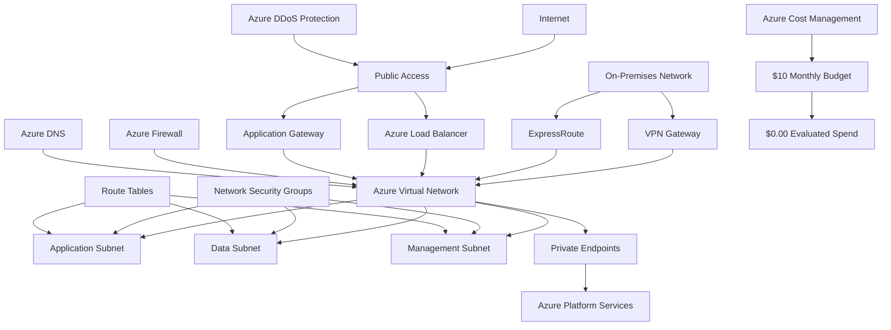
```mermaid
flowchart TD
    Internet[Internet] --> PublicIP[Public Access]
    OnPrem[On-Premises Network] --> VPN[VPN Gateway]
    OnPrem --> ER[ExpressRoute]

    PublicIP --> LB[Azure Load Balancer]
    PublicIP --> AG[Application Gateway]

    VPN --> VNet[Azure Virtual Network]
    ER --> VNet
    LB --> VNet
    AG --> VNet

    VNet --> SubnetA[Application Subnet]
    VNet --> SubnetB[Data Subnet]
    VNet --> SubnetC[Management Subnet]

    NSG[Network Security Groups] --> SubnetA
    NSG --> SubnetB
    NSG --> SubnetC

    RT[Route Tables] --> SubnetA
    RT --> SubnetB
    RT --> SubnetC

    Firewall[Azure Firewall] --> VNet
    DDoS[Azure DDoS Protection] --> PublicIP
    DNS[Azure DNS] --> VNet

    VNet --> PrivateEndpoints[Private Endpoints]
    PrivateEndpoints --> AzureServices[Azure Platform Services]

    Cost[Azure Cost Management] --> Budget[$10 Monthly Budget]
    Budget --> Validation[$0.00 Evaluated Spend]
```

---

## Steps Performed

### Step 1: Review Azure Virtual Networking Concepts

1. Opened Microsoft Learn.
2. Reviewed how Azure Virtual Networks allow resources to communicate.
3. Reviewed public and private endpoints.
4. Reviewed internet connectivity.
5. Reviewed on-premises connectivity.
6. Reviewed traffic filtering and routing concepts.
7. Documented Azure Virtual Network as the primary private networking boundary in Azure.

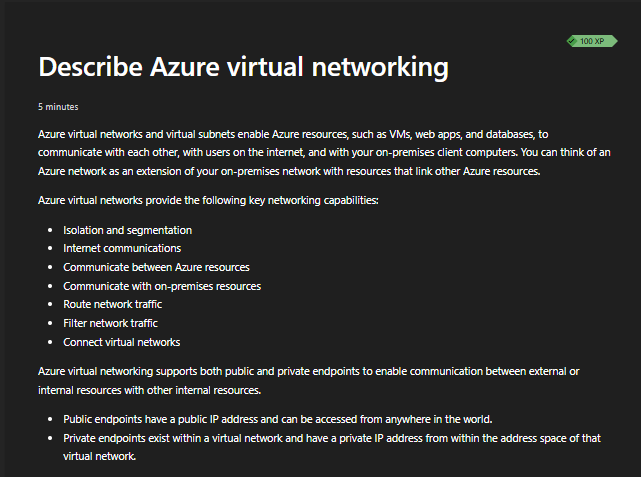

**Validation:** Microsoft Learn displayed Azure Virtual Network concepts, including subnets, endpoints, routing, filtering, internet access, and hybrid connectivity.

---

### Step 2: Review VPN Gateway Connectivity Models

1. Opened the VPN Gateway connectivity section.
2. Reviewed point-to-site VPN connectivity.
3. Reviewed site-to-site VPN connectivity.
4. Reviewed network-to-network connectivity.
5. Documented VPN Gateway as an encrypted hybrid connectivity option.
6. Reviewed the relationship between VPN Gateway, Azure Virtual Network, and on-premises infrastructure.

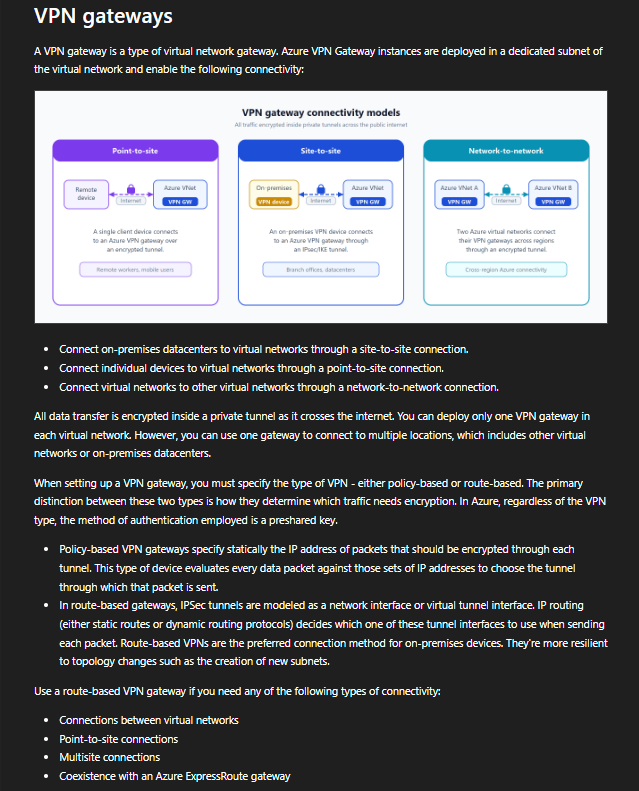

**Validation:** Microsoft Learn displayed point-to-site, site-to-site, and network-to-network VPN connectivity models.

---

### Step 3: Review Azure ExpressRoute

1. Opened the Azure ExpressRoute section.
2. Documented ExpressRoute as a private connectivity service.
3. Confirmed that ExpressRoute does not send traffic through the public internet.
4. Reviewed its use for enterprise and regulated environments.
5. Compared ExpressRoute with internet-based VPN connectivity.

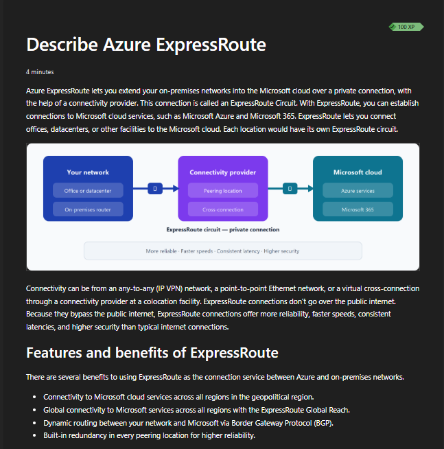

**Validation:** Microsoft Learn described private connectivity between on-premises infrastructure and Microsoft cloud services through ExpressRoute.

---

### Step 4: Review Azure DNS

1. Opened the Azure DNS section.
2. Reviewed DNS zone and record management.
3. Documented that Azure DNS uses Microsoft Azure infrastructure.
4. Reviewed Azure DNS availability, performance, security, and management benefits.
5. Documented the relationship between DNS and application name resolution.

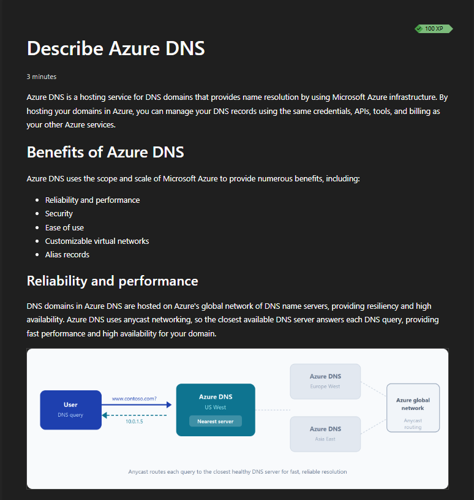

**Validation:** Microsoft Learn described Azure DNS hosting, zone management, reliability, and performance capabilities.

---

### Step 5: Review Azure DNS Security and Alias Records

1. Continued reviewing Azure DNS.
2. Reviewed Azure RBAC integration.
3. Reviewed Azure Activity Log support.
4. Reviewed resource-lock support.
5. Reviewed private DNS zones.
6. Reviewed alias records.
7. Documented that Azure DNS does not directly purchase domain names.

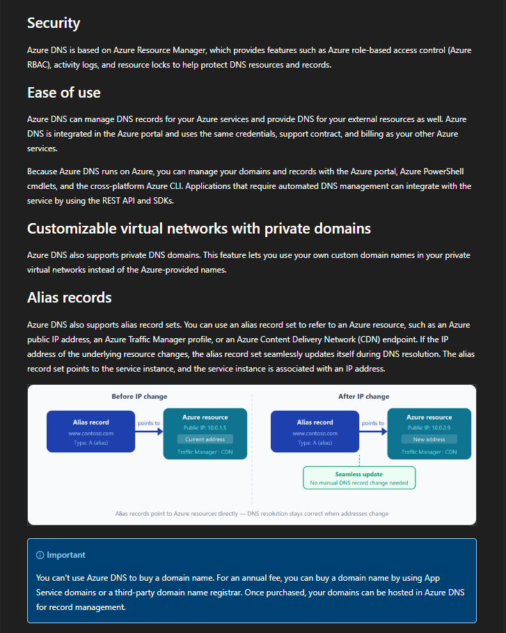

**Validation:** Microsoft Learn displayed Azure DNS security features, private domain support, and alias-record capabilities.

---

### Step 6: Review Azure Load Balancer

1. Opened the Azure Load Balancer section.
2. Reviewed public load-balancer use cases.
3. Reviewed internal load-balancer use cases.
4. Reviewed backend pools.
5. Reviewed health probes.
6. Documented Azure Load Balancer as a Layer 4 service.
7. Documented that it distributes TCP and UDP traffic.

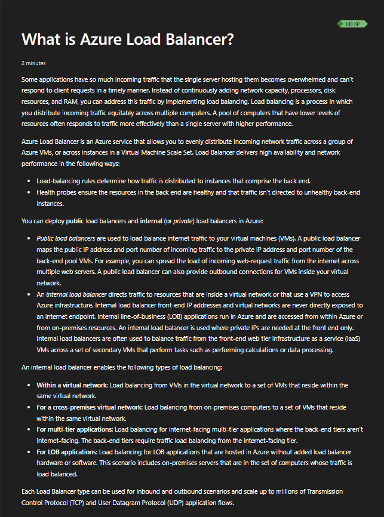

**Validation:** Microsoft Learn described public and internal load balancing, health probes, and backend traffic distribution.

---

### Step 7: Review Azure Virtual Network Design Considerations

1. Reviewed Azure Virtual Network capabilities.
2. Documented communication between Azure resources.
3. Documented internet connectivity.
4. Documented on-premises connectivity.
5. Reviewed traffic filtering.
6. Reviewed custom routing.
7. Connected VNet design to security and application architecture.

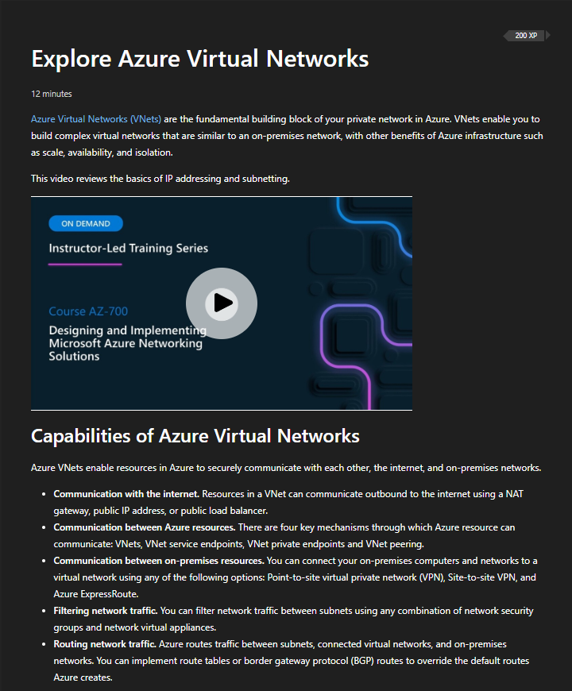

**Validation:** Microsoft Learn displayed Azure Virtual Network communication, connectivity, filtering, and routing capabilities.

---

### Step 8: Review Address Spaces and Subnets

1. Reviewed Azure Virtual Network address spaces.
2. Reviewed private RFC 1918 address ranges.
3. Reviewed Classless Inter-Domain Routing notation.
4. Reviewed subnet planning.
5. Documented that subnet address ranges cannot overlap within a VNet.
6. Documented that Azure address spaces should not overlap with connected on-premises networks.
7. Connected address planning to future hybrid connectivity.

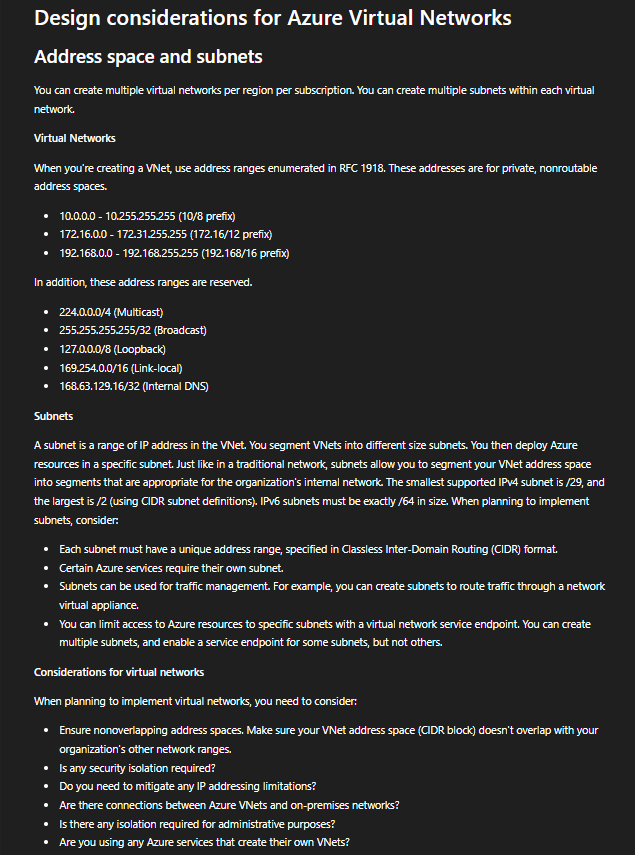

**Validation:** Microsoft Learn displayed private address ranges, CIDR notation, VNet address-space planning, and subnet design.

---

### Step 9: Validate Virtual Networks in the Azure Portal

1. Opened the Azure Portal.
2. Navigated to **Virtual networks**.
3. Confirmed that no virtual networks existed.
4. Did not select **Create**.
5. Did not create a VNet, subnet, public IP address, or related resource.

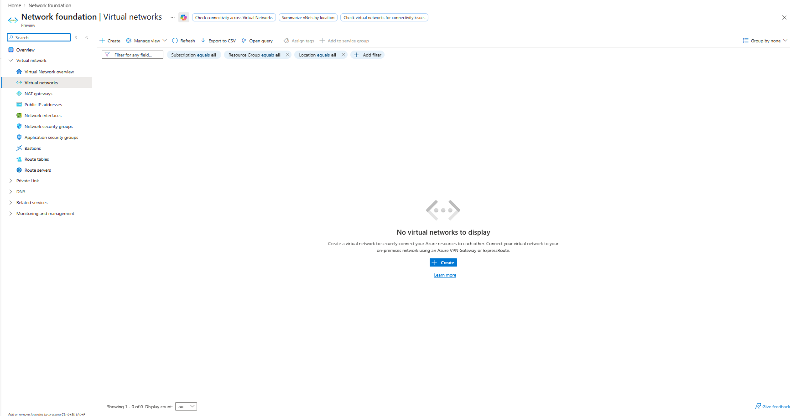

**Validation:** The Azure Portal displayed the Virtual Networks page with no VNets deployed.

---

### Step 10: Validate Network Security Groups in the Azure Portal

1. Opened **Network security groups** in the Azure Portal.
2. Confirmed that no Network Security Groups existed.
3. Did not create an NSG.
4. Documented NSGs as traffic-filtering controls.
5. Confirmed that no security rules were created or modified.

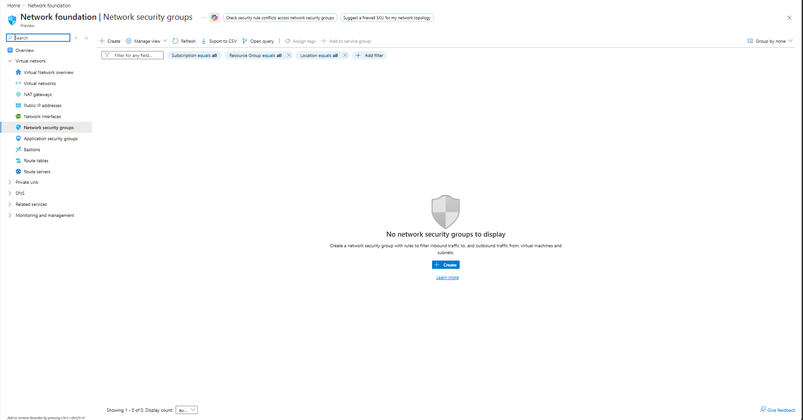

**Validation:** The Azure Portal displayed the Network Security Groups page with no NSGs deployed.

---

### Step 11: Validate Route Tables in the Azure Portal

1. Opened **Route tables** in the Azure Portal.
2. Confirmed that no route tables existed.
3. Did not create a route table.
4. Did not create a custom route.
5. Documented route tables as custom traffic-path controls.

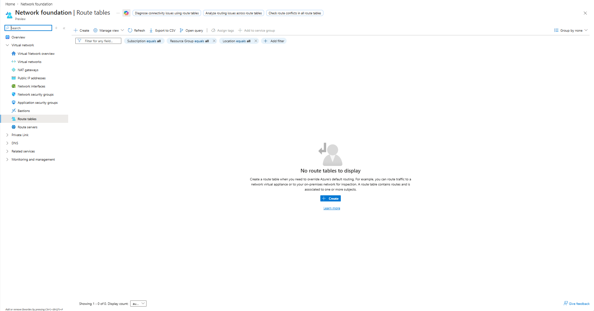

**Validation:** The Azure Portal displayed the Route Tables page with no route tables deployed.

---

### Step 12: Validate DNS Zones in the Azure Portal

1. Opened **DNS zones** in the Azure Portal.
2. Confirmed that no DNS zones existed.
3. Did not create a public or private DNS zone.
4. Did not create DNS records.
5. Documented Azure DNS as a name-resolution and DNS-hosting service.

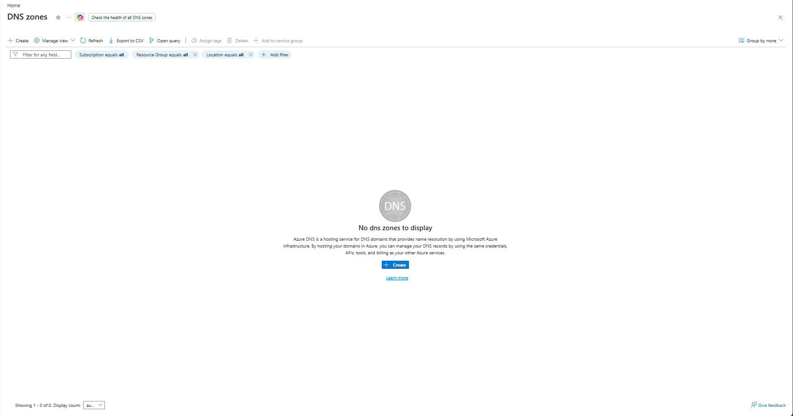

**Validation:** The Azure Portal displayed the DNS Zones page with no DNS zones deployed.

---

### Step 13: Validate ExpressRoute Gateways in the Azure Portal

1. Opened the gateway service view in the Azure Portal.
2. Selected the ExpressRoute gateway type.
3. Confirmed that no ExpressRoute gateways existed.
4. Did not create a gateway.
5. Documented an ExpressRoute Gateway as a component supporting private enterprise connectivity.

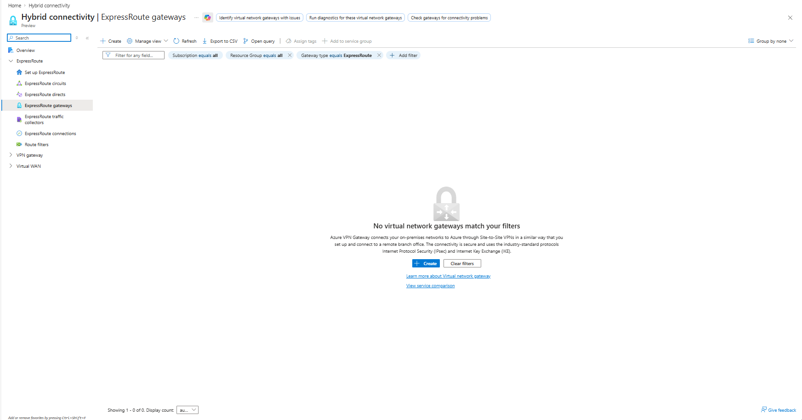

**Validation:** The Azure Portal displayed the ExpressRoute Gateway view with no gateways deployed.

---

### Step 14: Validate VPN Gateways in the Azure Portal

1. Opened the gateway service view in the Azure Portal.
2. Selected the VPN gateway type.
3. Confirmed that no VPN gateways existed.
4. Did not create a VPN Gateway.
5. Did not create a public IP address or supporting virtual network.
6. Documented VPN Gateway as an encrypted hybrid connectivity option.

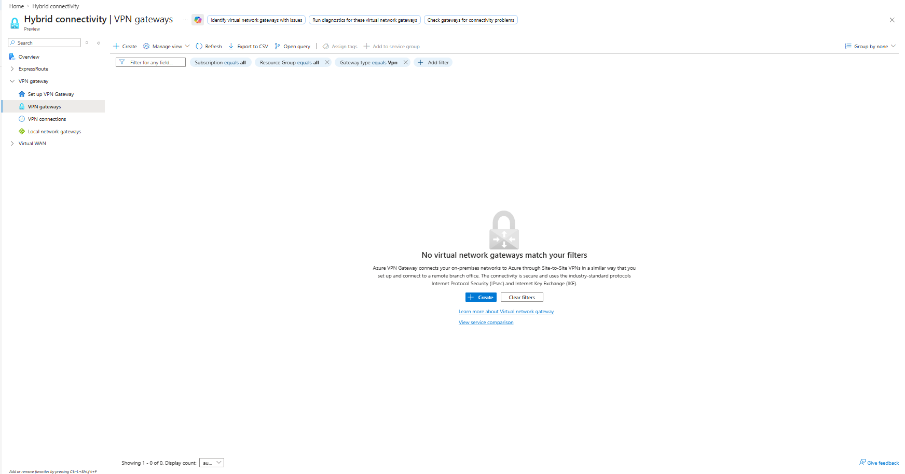

**Validation:** The Azure Portal displayed the VPN Gateway view with no gateways deployed.

---

### Step 15: Validate ExpressRoute Circuits in the Azure Portal

1. Opened **ExpressRoute circuits** in the Azure Portal.
2. Confirmed that no ExpressRoute circuits existed.
3. Did not create an ExpressRoute circuit.
4. Documented ExpressRoute circuits as private connectivity resources provided through supported connectivity providers.

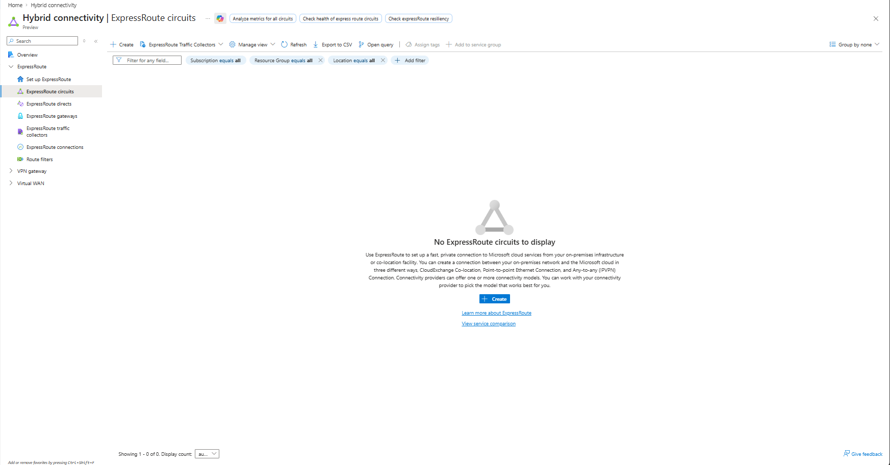

**Validation:** The Azure Portal displayed the ExpressRoute Circuits page with no circuits deployed.

---

### Step 16: Validate Load Balancers in the Azure Portal

1. Opened **Load balancers** in the Azure Portal.
2. Confirmed that no load balancers existed.
3. Did not create a Load Balancer.
4. Did not create frontend IP configurations, backend pools, health probes, or load-balancing rules.
5. Documented Azure Load Balancer as a Layer 4 traffic-distribution service.

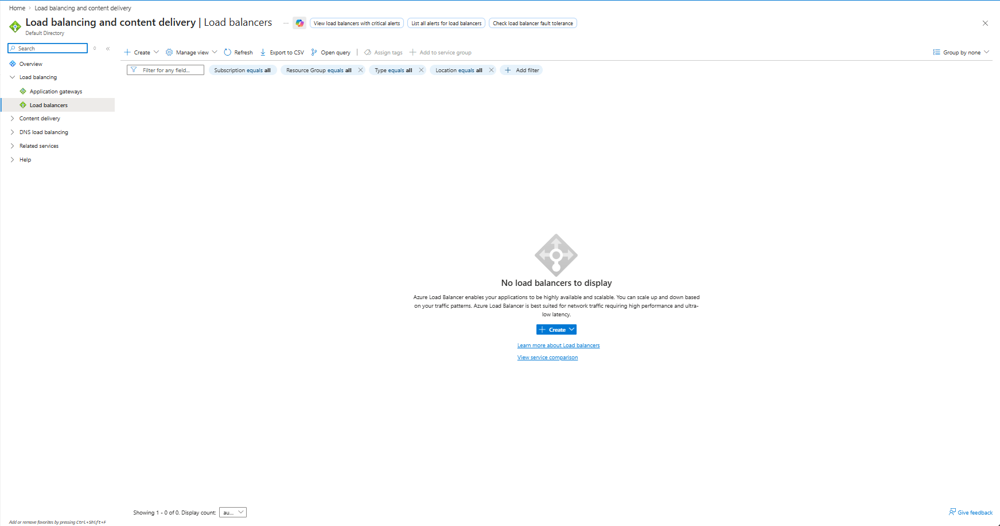

**Validation:** The Azure Portal displayed the Load Balancers page with no load balancers deployed.

---

### Step 17: Validate Application Gateways in the Azure Portal

1. Opened **Application gateways** in the Azure Portal.
2. Confirmed that no Application Gateways existed.
3. Did not create an Application Gateway.
4. Did not create a Web Application Firewall configuration.
5. Documented Application Gateway as a Layer 7 application-routing and load-balancing service.

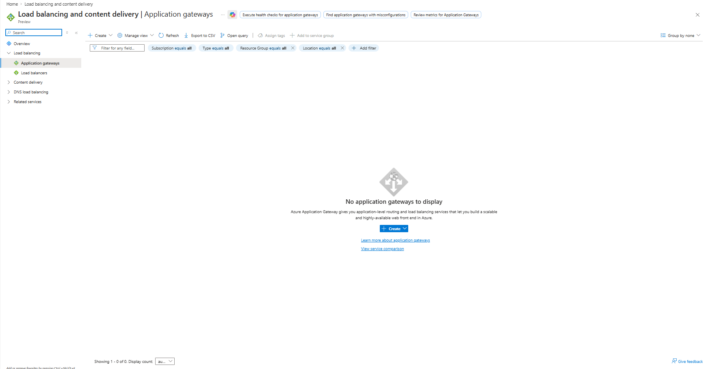

**Validation:** The Azure Portal displayed the Application Gateways page with no gateways deployed.

---

### Step 18: Validate Azure Firewall in the Azure Portal

1. Opened **Azure Firewall** in the Azure Portal.
2. Confirmed that no Azure Firewalls existed.
3. Did not create an Azure Firewall.
4. Did not create a Firewall Policy.
5. Did not create a dedicated subnet or public IP address.
6. Documented Azure Firewall as a centralized managed network-security service.

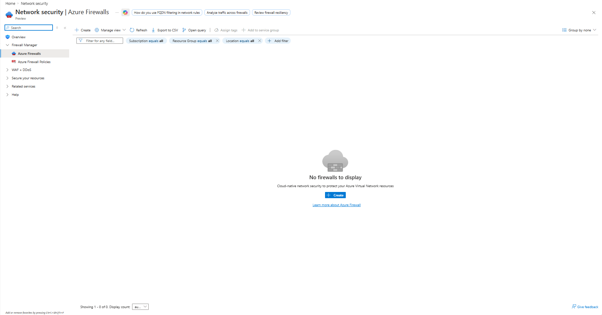

**Validation:** The Azure Portal displayed the Azure Firewall page with no firewalls deployed.

---

### Step 19: Validate Azure DDoS Protection in the Azure Portal

1. Opened **DDoS Protection** in the Azure Portal.
2. Confirmed that no DDoS Protection plans existed.
3. Did not create a DDoS Protection plan.
4. Did not associate a protection plan with a virtual network.
5. Documented Azure DDoS Protection as a network-security service for internet-facing resources.

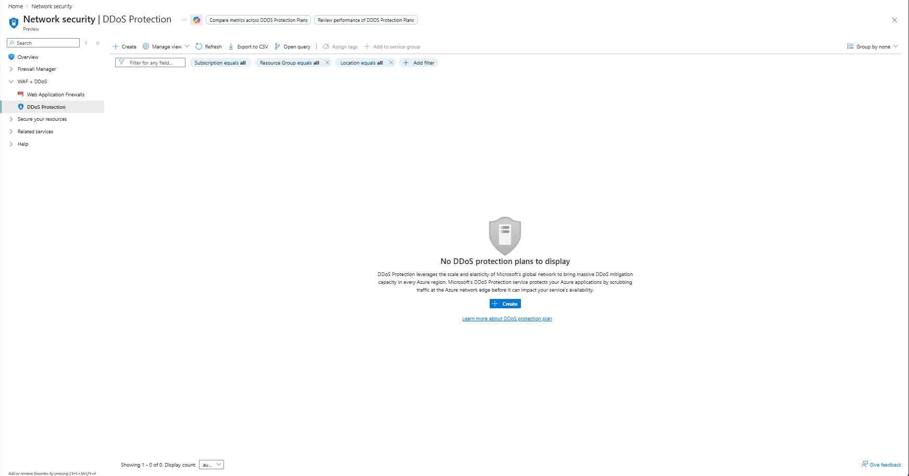

**Validation:** The Azure Portal displayed the DDoS Protection page with no protection plans deployed.

---

### Step 20: Perform Final Cost Validation

1. Opened Azure Cost Management.
2. Opened the existing subscription budget.
3. Confirmed that the monthly budget remained active.
4. Confirmed that evaluated spend remained `$0.00`.
5. Confirmed that budget progress remained `0.00%`.
6. Confirmed that no billable networking or supporting resources were created.
7. Redacted sensitive subscription and scope information.

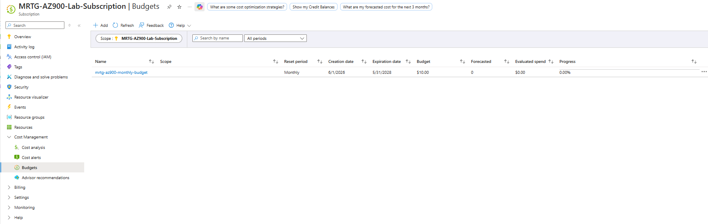

**Validation:** The final Cost Management review showed the active `$10.00` monthly budget, `$0.00` evaluated spend, and `0.00%` progress.

---

## Azure Virtual Network Summary

Azure Virtual Network provides the foundation for private Azure networking.

A VNet can support:

- Private communication between Azure resources
- Communication with the internet
- Communication with on-premises networks
- Communication between virtual networks
- Subnet segmentation
- Traffic filtering
- Custom routing
- Private endpoints
- DNS integration

A virtual network is scoped to an Azure region.

Resources in different regions require supported cross-region connectivity methods.

---

## Address Spaces and Subnets

### Address Space

A VNet address space defines the private IP address ranges available to resources inside the virtual network.

Common private IPv4 address ranges include:

```text
10.0.0.0/8
172.16.0.0/12
192.168.0.0/16
```

### Subnets

Subnets divide a VNet address space into smaller segments.

Example design:

```text
VNet: 10.10.0.0/16

Application subnet: 10.10.10.0/24
Data subnet: 10.10.20.0/24
Management subnet: 10.10.30.0/24
Private endpoint subnet: 10.10.40.0/24
```

### Address-Planning Requirements

Address planning should consider:

- Future growth
- On-premises connectivity
- VNet peering
- Hub-and-spoke architecture
- Azure service subnet requirements
- Private endpoint placement
- Network segmentation
- Avoiding overlapping address spaces

Overlapping address ranges can prevent or complicate:

- VNet peering
- VPN connectivity
- ExpressRoute connectivity
- Routing
- Network integration

---

## Public and Private Access

| Access Type | Description | Example |
|---|---|---|
| Public access | A resource can be reached through the public internet when permitted | Public IP address or public load balancer |
| Private access | A resource is reached through a private IP address or private network path | VNet, private IP address, or private endpoint |
| Hybrid access | Azure connects with on-premises or remote networks | VPN Gateway or ExpressRoute |
| Filtered access | Traffic is allowed or denied according to security rules | Network Security Group or Azure Firewall |
| Peered access | Separate Azure VNets communicate through private Azure networking | VNet peering |

### Key Takeaway

Public exposure should always be intentional.

A secure design should prefer private communication where practical and apply filtering, segmentation, monitoring, and least privilege to all network paths.

---

## Network Security Groups

Network Security Groups contain security rules that allow or deny traffic.

A rule can evaluate:

| Rule Component | Purpose |
|---|---|
| Priority | Determines rule-processing order |
| Source | Identifies where traffic originates |
| Source port | Identifies the originating port |
| Destination | Identifies where traffic is going |
| Destination port | Identifies the target service |
| Protocol | Identifies TCP, UDP, ICMP, or other supported traffic |
| Action | Allows or denies the traffic |

### NSG Scope

An NSG can be associated with:

- A subnet
- A network interface

Using both requires careful documentation because multiple rules can affect the same traffic flow.

### Least Privilege Networking

NSG rules should:

- Allow only required traffic
- Use specific ports
- Use approved sources
- Avoid unrestricted administrative access
- Use clear descriptions
- Follow standardized priorities
- Be reviewed regularly

---

## Route Tables

Azure automatically creates system routes for virtual networks.

Custom route tables can change traffic behavior.

Common custom-routing scenarios include:

- Sending outbound traffic through Azure Firewall
- Sending traffic through a network virtual appliance
- Controlling hybrid traffic paths
- Implementing hub-and-spoke routing
- Preventing direct internet access
- Supporting centralized inspection

A custom route can include:

- Address prefix
- Next-hop type
- Next-hop address
- Route name

Incorrect routing can cause:

- Lost connectivity
- Asymmetric routing
- Unintended internet access
- Bypassed security controls
- Hybrid connectivity failures

---

## Hybrid Connectivity

### Point-to-Site VPN

Point-to-site VPN connects an individual client device to an Azure Virtual Network.

Common use cases include:

- Remote administration
- Developer access
- Temporary secure access
- Small remote-user deployments

### Site-to-Site VPN

Site-to-site VPN connects an on-premises network to an Azure Virtual Network.

It commonly requires:

- VPN Gateway
- Local network gateway
- Public IP address
- Compatible on-premises VPN device
- Shared configuration
- Routing

### VNet-to-VNet VPN

VNet-to-VNet connectivity links Azure virtual networks through VPN gateways.

VNet peering is often simpler for supported Azure-to-Azure scenarios, but VPN connectivity may be selected for specific requirements.

### ExpressRoute

ExpressRoute provides private connectivity through a supported connectivity provider.

It can offer:

- Private network paths
- Higher bandwidth options
- Predictable connectivity
- Enterprise integration
- Reduced reliance on the public internet

ExpressRoute does not automatically encrypt all traffic at the network layer. Encryption requirements must be evaluated separately.

---

## Load Balancer vs Application Gateway

| Feature | Azure Load Balancer | Application Gateway |
|---|---|---|
| Network layer | Layer 4 | Layer 7 |
| Protocol focus | TCP and UDP | HTTP and HTTPS |
| Routing basis | IP address and port | URL, hostname, path, and HTTP properties |
| Public deployment | Supported | Supported |
| Internal deployment | Supported | Supported |
| Health probes | Supported | Supported |
| TLS termination | Not an application-layer feature | Supported |
| Web Application Firewall | Not included | Available |
| Primary use | General network traffic distribution | Web application traffic routing |

### Selection Guidance

Use Azure Load Balancer when:

- TCP or UDP traffic must be distributed
- Application-aware routing is unnecessary
- Backend resources require Layer 4 balancing

Use Application Gateway when:

- Web traffic requires Layer 7 routing
- URL or hostname routing is required
- TLS termination is required
- Web Application Firewall capabilities are required

---

## Network Security Service Comparison

| Service | Security Purpose |
|---|---|
| Network Security Group | Distributed inbound and outbound traffic filtering |
| Azure Firewall | Centralized managed network traffic inspection and control |
| Application Gateway Web Application Firewall | Protection for HTTP and HTTPS applications |
| Azure DDoS Protection | Protection against distributed denial-of-service attacks |
| Private Endpoint | Private access to supported Azure platform services |
| VPN Gateway | Encrypted hybrid connectivity over the public internet |
| ExpressRoute | Private enterprise connectivity through a provider |

These services solve different security problems and may be combined in a production architecture.

---

## Networking Service Summary

| Service | Primary Use | Typical Cost Risk |
|---|---|---|
| Azure Virtual Network | Private network boundary | No direct VNet charge in many standard scenarios |
| Subnet | Segmentation inside a VNet | No direct subnet charge |
| Network Security Group | Inbound and outbound traffic filtering | No direct NSG charge |
| Route Table | Custom routing | No direct route-table charge |
| Azure DNS | DNS zone and record hosting | Low to moderate |
| VPN Gateway | Encrypted hybrid connectivity | High |
| ExpressRoute Gateway | ExpressRoute virtual network connectivity | High |
| ExpressRoute Circuit | Private enterprise connectivity | High |
| Azure Load Balancer | Layer 4 traffic distribution | Low to moderate depending on tier and usage |
| Application Gateway | Layer 7 application routing | Medium to high |
| Azure Firewall | Centralized network security | High |
| Azure DDoS Protection | Enhanced DDoS protection | High |

Actual pricing depends on region, tier, usage, data processing, bandwidth, and configuration.

---

## Networking Selection Mental Model

```text
Azure Virtual Network
Use as the private network boundary for Azure resources.

Subnet
Use to divide a VNet into smaller network segments.

Network Security Group
Use to allow or deny traffic at subnet or network-interface scope.

Route Table
Use to define custom traffic paths.

Azure DNS
Use to host public or private DNS zones.

VPN Gateway
Use for encrypted tunnel-based hybrid connectivity.

ExpressRoute
Use for private enterprise connectivity through a provider.

Azure Load Balancer
Use for Layer 4 TCP and UDP traffic distribution.

Application Gateway
Use for Layer 7 web application routing.

Azure Firewall
Use for centralized managed network traffic control.

Azure DDoS Protection
Use for enhanced protection of eligible public-facing Azure resources.
```

---

## Validation

| Validation Item | Expected Result | Actual Result |
|---|---|---|
| Azure networking concepts | Core networking concepts are reviewed | Passed |
| Azure Virtual Network | VNet purpose and capabilities are documented | Passed |
| Address spaces and subnets | Address planning and segmentation are documented | Passed |
| VPN Gateway | VPN connectivity models are reviewed | Passed |
| ExpressRoute | Private connectivity is reviewed | Passed |
| Azure DNS | DNS hosting and security capabilities are reviewed | Passed |
| Azure Load Balancer | Layer 4 traffic distribution is reviewed | Passed |
| Virtual Networks portal page | No VNets are deployed | Passed |
| Network Security Groups portal page | No NSGs are deployed | Passed |
| Route Tables portal page | No route tables are deployed | Passed |
| DNS Zones portal page | No DNS zones are deployed | Passed |
| ExpressRoute Gateway portal page | No ExpressRoute gateways are deployed | Passed |
| VPN Gateway portal page | No VPN gateways are deployed | Passed |
| ExpressRoute Circuits portal page | No ExpressRoute circuits are deployed | Passed |
| Load Balancers portal page | No load balancers are deployed | Passed |
| Application Gateways portal page | No Application Gateways are deployed | Passed |
| Azure Firewall portal page | No Azure Firewalls are deployed | Passed |
| Azure DDoS Protection portal page | No DDoS Protection plans are deployed | Passed |
| Networking resources | No billable networking resources are created | Passed |
| Supporting resources | No networking dependencies are created | Passed |
| Monthly budget | Existing budget remains active | Passed |
| Evaluated spend | Spend remains `$0.00` | Passed |
| Budget progress | Progress remains `0.00%` | Passed |
| Estimated cost | Lab remains within the `$0.00` estimate | Passed |

---

## Completion Checklist

- [x] Reviewed Azure virtual networking concepts
- [x] Reviewed Azure Virtual Network
- [x] Reviewed VNet address spaces
- [x] Reviewed subnets
- [x] Reviewed public and private connectivity
- [x] Reviewed Network Security Groups
- [x] Reviewed route tables
- [x] Reviewed VPN Gateway connectivity models
- [x] Reviewed Azure ExpressRoute
- [x] Reviewed Azure DNS
- [x] Reviewed Azure DNS security and alias records
- [x] Reviewed Azure Load Balancer
- [x] Reviewed Application Gateway
- [x] Reviewed Azure Firewall
- [x] Reviewed Azure DDoS Protection
- [x] Opened the Virtual Networks page in the Azure Portal
- [x] Opened the Network Security Groups page
- [x] Opened the Route Tables page
- [x] Opened the DNS Zones page
- [x] Opened the ExpressRoute Gateway view
- [x] Opened the VPN Gateway view
- [x] Opened the ExpressRoute Circuits page
- [x] Opened the Load Balancers page
- [x] Opened the Application Gateways page
- [x] Opened the Azure Firewall page
- [x] Opened the Azure DDoS Protection page
- [x] Did not create networking resources
- [x] Did not create supporting public IP addresses
- [x] Validated that the monthly budget remained active
- [x] Validated that evaluated spend remained `$0.00`
- [x] Validated that budget progress remained `0.00%`
- [x] Sanitized screenshots before upload
- [x] Avoided exposing sensitive account, tenant, subscription, or scope information

---

## AZ-900 Exam Objective Coverage

### Primary Exam Domain

```text
Describe Azure architecture and services
```

### Supporting Exam Domain

```text
Describe Azure management and governance
```

### Skills Measured

This lab supports the ability to:

- Describe Azure Virtual Network
- Describe Azure subnets
- Describe public and private IP addressing concepts
- Describe public and private endpoints
- Describe Network Security Groups
- Describe route tables
- Describe Azure DNS
- Describe VPN Gateway
- Describe ExpressRoute
- Describe Azure Load Balancer
- Describe Application Gateway
- Describe Azure Firewall
- Describe Azure DDoS Protection
- Describe public, private, and hybrid connectivity
- Describe networking cost considerations

### How This Lab Supports the Objectives

This lab connected Azure networking concepts to practical Azure Portal service discovery.

It demonstrated:

- How VNets provide private networking
- How subnets create segmentation
- How address planning supports future connectivity
- How Network Security Groups filter traffic
- How route tables control custom traffic paths
- How Azure DNS provides name resolution
- How VPN Gateway and ExpressRoute support hybrid connectivity
- How Load Balancer and Application Gateway distribute traffic
- How Azure Firewall and Azure DDoS Protection support network security
- How Cost Management validates cost-safe lab execution

---

## Mini Objective Coverage

By completing this lab, I can:

- Explain the purpose of Azure Virtual Network
- Explain how subnets segment a VNet
- Explain why address planning matters
- Identify common private IPv4 address ranges
- Explain how Network Security Groups filter traffic
- Explain how route tables affect traffic flow
- Explain what Azure DNS provides
- Explain point-to-site VPN connectivity
- Explain site-to-site VPN connectivity
- Explain when ExpressRoute may be selected
- Compare Azure Load Balancer and Application Gateway
- Explain the purpose of Azure Firewall
- Explain the purpose of Azure DDoS Protection
- Describe public, private, and hybrid network access
- Identify networking services in the Azure Portal
- Validate Azure networking services without deploying resources
- Confirm cost impact after networking-service review

---

## IAM / Security Relevance

Azure networking is directly connected to identity and access management because secure access depends on both identity controls and network controls.

Identity controls determine:

- Who can authenticate
- Who can administer network resources
- Which Azure RBAC role an identity receives
- Which services a workload identity can access
- Whether privileged access is allowed

Network controls determine:

- Where traffic can originate
- Where traffic can travel
- Which ports are reachable
- Whether resources are publicly exposed
- Whether traffic must pass through inspection
- Whether hybrid networks can communicate
- Whether platform services use public or private endpoints

### Azure RBAC for Networking

Azure RBAC controls who can manage networking resources.

Examples of management activities include:

- Creating VNets
- Modifying subnets
- Changing NSG rules
- Adding routes
- Creating gateways
- Managing public IP addresses
- Configuring load balancers
- Managing Azure Firewall policies
- Creating private endpoints

Assignments should follow:

- Least privilege
- Group-based access
- Narrow scope
- Separation of duties
- Privileged access approval
- Regular access review

### Network and Identity Security

| Security Layer | Primary Question |
|---|---|
| Authentication | Who is requesting access? |
| Authorization | What is the identity allowed to do? |
| Network filtering | Is the traffic path allowed? |
| Routing | Where should the traffic travel? |
| Segmentation | Which network boundary contains the workload? |
| Inspection | Should traffic pass through a firewall or security service? |
| Monitoring | Can administrative and traffic activity be investigated? |

### Private Access

Private endpoints can allow supported Azure platform services to receive private IP addresses inside a VNet.

This can reduce public exposure for services such as:

- Storage accounts
- Databases
- Key vaults
- Application services
- Other supported platform services

Private networking does not replace:

- Authentication
- Authorization
- Encryption
- Logging
- Data governance
- Least privilege

### Regulated Environment Relevance

In government, defense, healthcare, finance, and other regulated environments, networking decisions affect:

- Security boundaries
- Data residency
- System authorization
- Segmentation
- Auditability
- Remote administration
- Hybrid access
- Incident response
- Public exposure
- Traffic inspection
- Compliance evidence

### Security Takeaway

Identity controls decide who can access or administer resources.

Network controls decide where traffic can flow.

Strong Azure security requires both.

---

## Governance Notes

### Governance Decisions

| Decision | Implementation | Reason |
|---|---|---|
| Discovery-only lab | Networking services were reviewed without deployment | Prevented unnecessary cost |
| Microsoft Learn used | Certification-aligned networking content reviewed | Supported AZ-900 preparation |
| Azure Portal used | Networking services were located in the live environment | Connected theory to practical administration |
| Cost Management reviewed | Monthly budget and spending state validated | Confirmed cost-safe execution |
| Screenshots sanitized | Sensitive identifiers were redacted | Protected cloud-environment information |
| High-cost services not enabled | Gateways, firewall, and DDoS plans were not deployed | Maintained the `$0.00` cost target |

### Governance Lesson

Networking should be designed before deployment.

A production network design should define:

- IP address ownership
- Address-space standards
- Approved Azure regions
- VNet naming
- Subnet naming
- Subnet purpose
- Public-access requirements
- Private-endpoint requirements
- NSG standards
- Route-table standards
- Firewall placement
- DNS ownership
- Hybrid-connectivity ownership
- Logging requirements
- Change-control procedures
- Cost ownership
- Decommission procedures

### Example Network Governance Standard

| Requirement | Example |
|---|---|
| VNet owner | Cloud Network Operations |
| Approved region | Central US |
| VNet address space | `10.10.0.0/16` |
| Application subnet | `10.10.10.0/24` |
| Data subnet | `10.10.20.0/24` |
| Management subnet | `10.10.30.0/24` |
| Public exposure | Prohibited unless approved |
| Administrative access | Private or approved secure path |
| NSG ownership | Cloud Network Operations |
| Route changes | Change approval required |
| Logging | Centralized |
| Cost center | Workload owner |

### Segmentation

Subnets should be aligned with:

- Workload type
- Trust level
- Security requirements
- Administrative ownership
- Service requirements
- Routing requirements
- Monitoring requirements

Subnets should not be created only to mirror organizational departments without considering traffic and security requirements.

---

## Cost Considerations

### Estimated Lab Cost

```text
Estimated cost: $0.00
```

### Why Cost Remained at Zero

This lab did not create:

- Virtual networks
- Subnets
- Network Security Groups
- Route tables
- Public IP addresses
- DNS zones
- VPN Gateways
- ExpressRoute Gateways
- ExpressRoute circuits
- Load Balancers
- Application Gateways
- Azure Firewalls
- Firewall Policies
- DDoS Protection plans
- Private endpoints
- Network monitoring resources

### Common Networking Cost Drivers

- VPN Gateway runtime
- VPN Gateway tier
- ExpressRoute circuits
- ExpressRoute gateways
- ExpressRoute provider charges
- Azure Firewall runtime
- Azure Firewall data processing
- Application Gateway runtime
- Web Application Firewall tier
- Load Balancer rules and processing
- Public IP address tiers
- DDoS Protection plans
- DNS zones and queries
- Data transfer
- Inter-region traffic
- VNet peering traffic
- Log ingestion
- Network monitoring

### Cost-Risk Summary

| Networking Service | Typical Cost Risk |
|---|---|
| Virtual Network | Low by itself |
| Subnet | Low by itself |
| Network Security Group | Low |
| Route Table | Low |
| Azure DNS | Low to moderate |
| VPN Gateway | High |
| ExpressRoute Gateway | High |
| ExpressRoute Circuit | High |
| Azure Load Balancer | Low to moderate |
| Application Gateway | Medium to high |
| Azure Firewall | High |
| Azure DDoS Protection | High |

### Budget Validation

The final Cost Management review showed:

```text
Budget: $10.00
Forecasted spend: 0
Evaluated spend: $0.00
Progress: 0.00%
```

### Budget Limitation

Azure budgets:

- Monitor actual and forecasted costs
- Generate notifications
- Do not stop gateways
- Do not disable firewalls
- Do not remove public IP addresses
- Do not delete resources
- Do not prevent additional charges
- Do not replace regular Cost Management review

---

## Troubleshooting Notes

### Issue 1: Networking Create Options Were Prominent

**Symptom**

Azure Portal networking pages displayed prominent **Create** options.

**Risk**

Completing a creation workflow could deploy billable resources and dependencies.

High-cost examples include:

- VPN Gateway
- ExpressRoute Gateway
- ExpressRoute circuit
- Azure Firewall
- Application Gateway
- Azure DDoS Protection

**Resolution**

Each service page was opened for discovery only.

No creation workflow was completed.

**Result**

No networking or supporting resources were deployed.

---

### Issue 2: Most Networking Pages Displayed No Resources

**Symptom**

The Azure Portal displayed empty networking service pages.

**Explanation**

This was expected because the lab focused on service discovery rather than infrastructure deployment.

**Result**

The empty pages provided valid evidence that no networking resources were deployed.

---

### Issue 3: Gateway Pages Were Similar

**Symptom**

Azure provides several gateway-related views, including:

- VPN Gateway
- ExpressRoute Gateway
- Virtual Network Gateway
- ExpressRoute circuits

**Explanation**

These services are related but serve different purposes.

| Service | Purpose |
|---|---|
| VPN Gateway | Encrypted VPN connectivity |
| ExpressRoute Gateway | Connects a VNet to ExpressRoute |
| Virtual Network Gateway | Azure resource type used for VPN or ExpressRoute gateway configurations |
| ExpressRoute Circuit | Private connectivity service obtained through a provider |

**Resolution**

VPN and ExpressRoute gateway views were documented separately.

**Result**

Hybrid connectivity concepts were documented without deploying gateways.

---

### Issue 4: Address-Space Overlap Could Break Future Connectivity

**Symptom**

An Azure VNet can be created with an address range that overlaps an existing on-premises or Azure network.

**Risk**

Overlapping address spaces can prevent routing, peering, or hybrid connectivity.

**Resolution**

The lab documented address planning as a requirement before VNet deployment.

**Result**

No address spaces were assigned during this discovery-only lab.

---

### Issue 5: Public Access Can Be Enabled Easily

**Symptom**

Many Azure deployment workflows offer public IP addresses or public endpoints.

**Risk**

Accepting default public-access settings can expose services unnecessarily.

**Resolution**

The lab documented public exposure as a design and approval decision rather than a default requirement.

**Result**

No public IP address or public-facing service was created.

---

## What I Would Do Differently in Production

A production Azure network deployment would require formal architecture, identity, security, hybrid connectivity, monitoring, and cost planning.

### Architecture

- Develop an enterprise IP address plan
- Prevent overlap with on-premises networks
- Use a documented hub-and-spoke architecture where appropriate
- Separate production and non-production networks
- Define subnet purposes
- Reserve address space for growth
- Define regional connectivity
- Plan VNet peering
- Document traffic flows
- Define public and private access requirements
- Evaluate Azure Virtual WAN where appropriate

### Identity and Access

- Use Microsoft Entra work accounts
- Assign networking roles through groups
- Use the narrowest practical Azure RBAC scope
- Separate network administration from workload administration
- Use Privileged Identity Management
- Require approval for high-impact network changes
- Perform recurring access reviews
- Monitor privileged network operations

### Network Security

- Avoid unnecessary public IP addresses
- Apply least-privilege NSG rules
- Use service tags and application security groups where appropriate
- Use Azure Firewall for centralized inspection when required
- Use private endpoints for supported platform services
- Configure secure administrative access
- Restrict management ports
- Use Web Application Firewall for public web applications
- Evaluate DDoS Protection for critical public workloads
- Monitor network flows and security events

### Hybrid Connectivity

- Compare VPN Gateway and ExpressRoute requirements
- Document bandwidth requirements
- Document availability requirements
- Use redundant connections
- Define routing ownership
- Validate encryption requirements
- Test failover
- Monitor connectivity
- Document escalation procedures
- Coordinate with on-premises network teams

### DNS

- Define public and private DNS ownership
- Plan hybrid DNS resolution
- Document conditional forwarding
- Protect DNS administration
- Use private DNS zones for private endpoints
- Monitor DNS changes
- Apply resource locks where appropriate

### Operations

- Use Infrastructure as Code
- Store network templates in source control
- Require peer review
- Validate route changes before deployment
- Configure centralized logging
- Configure network alerts
- Establish backup procedures for configurations
- Maintain network diagrams
- Document dependencies
- Apply formal change management

### Cost Management

- Estimate networking costs before deployment
- Require approval for gateways and firewalls
- Apply cost-center tags
- Configure workload-level budgets
- Review data-transfer costs
- Monitor idle gateways
- Review unused public IP addresses
- Review unused load balancers
- Remove abandoned networking resources
- Review spending regularly

The lab intentionally avoided deployment because its purpose was networking service discovery and AZ-900 concept validation.

---

## Lessons Learned

- Azure Virtual Network provides the primary private networking boundary in Azure.
- Subnets divide a VNet address space into smaller segments.
- Address planning must account for future growth and hybrid connectivity.
- Overlapping address spaces can prevent routing and peering.
- Network Security Groups filter inbound and outbound traffic.
- Route tables define custom traffic paths.
- Azure DNS supports public and private name resolution.
- VPN Gateway supports encrypted tunnel-based hybrid connectivity.
- ExpressRoute supports private provider-based connectivity.
- Azure Load Balancer distributes Layer 4 traffic.
- Application Gateway provides Layer 7 application routing.
- Azure Firewall provides centralized managed network security.
- Azure DDoS Protection helps protect public-facing workloads.
- Public exposure should be an approved design decision.
- Networking services can create significant recurring costs.
- Cost validation should be performed after every Azure lab.

### Technical Takeaway

Azure networking controls how cloud resources communicate with users, other resources, the internet, and on-premises systems.

### Business Takeaway

A planned network architecture reduces security risk, prevents connectivity problems, supports reliability, and improves cloud adoption.

### Security Takeaway

Identity controls determine who can access or administer resources.

Network controls determine where traffic can flow.

One does not replace the other.

### Exam Takeaway

For AZ-900, remember:

- Azure Virtual Network provides private Azure networking.
- Subnets divide VNet address space.
- Network Security Groups filter traffic.
- Route tables control custom routing.
- Azure DNS hosts DNS zones and records.
- VPN Gateway supports encrypted hybrid connectivity.
- ExpressRoute supports private enterprise connectivity.
- Azure Load Balancer operates at Layer 4.
- Application Gateway operates at Layer 7.
- Azure Firewall provides centralized network security.
- Azure DDoS Protection helps protect public-facing resources.

---

## Cleanup

### Resources Retained

| Resource or Configuration | Reason |
|---|---|
| MRTG Azure subscription | Required for the remaining labs |
| Monthly Azure budget | Required for ongoing cost visibility |
| Lab 01 resource group | Retained as the foundational resource group |
| Lab 06 documentation | Retained as project evidence |
| Lab 06 screenshots | Retained as validation evidence |

### Resources Removed

No Azure networking resources were created during this lab.

### Cleanup Validation

- [x] No virtual networks were created
- [x] No subnets were created
- [x] No Network Security Groups were created
- [x] No route tables were created
- [x] No DNS zones were created
- [x] No VPN Gateways were created
- [x] No ExpressRoute Gateways were created
- [x] No ExpressRoute circuits were created
- [x] No Load Balancers were created
- [x] No Application Gateways were created
- [x] No Azure Firewalls were created
- [x] No Firewall Policies were created
- [x] No DDoS Protection plans were created
- [x] No public IP addresses were created
- [x] No private endpoints were created
- [x] No network-monitoring resources were created
- [x] No networking-related billable resources were deployed
- [x] Monthly budget remained active
- [x] Evaluated spend remained `$0.00`
- [x] Budget progress remained `0.00%`
- [x] Screenshot data was sanitized

---

## Outcome

This lab documented the Azure networking foundation required for secure cloud architecture.

The completed lab demonstrated:

- Understanding of Azure Virtual Network
- Understanding of address spaces and subnets
- Understanding of public and private access
- Understanding of Network Security Groups
- Understanding of route tables
- Understanding of Azure DNS
- Understanding of VPN Gateway
- Understanding of ExpressRoute
- Understanding of Azure Load Balancer
- Understanding of Application Gateway
- Understanding of Azure Firewall
- Understanding of Azure DDoS Protection
- Awareness of networking cost risks
- Awareness of networking security responsibilities
- Practical Azure Portal validation
- No deployed billable networking resources
- Final evaluated spend of `$0.00`

---

## Screenshot Inventory

| Screenshot | Description |
|---|---|
| `01-azure-virtual-networking-overview.png` | Azure virtual networking concepts |
| `02-vpn-gateway-connectivity-models.png` | VPN Gateway connectivity models |
| `03-azure-expressroute-overview.png` | Azure ExpressRoute overview |
| `04-azure-dns-overview.png` | Azure DNS overview |
| `05-azure-dns-security-and-alias-records.png` | Azure DNS security controls and alias records |
| `06-azure-load-balancer-overview.png` | Azure Load Balancer overview |
| `07-explore-azure-virtual-networks.png` | Azure Virtual Network capabilities and design considerations |
| `08-vnet-address-space-and-subnets.png` | VNet address-space and subnet planning |
| `09-virtual-networks-portal.png` | Azure Portal Virtual Networks page |
| `10-network-security-groups-portal.png` | Azure Portal Network Security Groups page |
| `11-route-tables-portal.png` | Azure Portal Route Tables page |
| `12-dns-zones-portal.png` | Azure Portal DNS Zones page |
| `13-virtual-network-gateways-portal.png` | Azure Portal ExpressRoute Gateway view |
| `14-virtual-network-gateways-portal.png` | Azure Portal VPN Gateway view |
| `15-expressroute-circuits-portal.png` | Azure Portal ExpressRoute Circuits page |
| `16-load-balancers-portal.png` | Azure Portal Load Balancers page |
| `17-application-gateways-portal.png` | Azure Portal Application Gateways page |
| `18-azure-firewall-portal.png` | Azure Portal Azure Firewall page |
| `19-ddos-protection-portal.png` | Azure Portal Azure DDoS Protection page |
| `20-cost-management-final-validation.png` | Final Cost Management validation |

---

## Screenshots

### Azure Virtual Networking Overview


### VPN Gateway Connectivity Models


### Azure ExpressRoute Overview


### Azure DNS Overview


### Azure DNS Security and Alias Records


### Azure Load Balancer Overview


### Explore Azure Virtual Networks


### VNet Address Space and Subnets


### Virtual Networks Portal


### Network Security Groups Portal


### Route Tables Portal


### DNS Zones Portal


### ExpressRoute Gateways Portal


### VPN Gateways Portal


### ExpressRoute Circuits Portal


### Load Balancers Portal


### Application Gateways Portal


### Azure Firewall Portal


### Azure DDoS Protection Portal


### Cost Management Final Validation


---

## Next Lab

The next lab is:

```text
Lab 07 - Azure Storage Services
```

The next lab builds on this networking foundation by examining:

- Azure Storage accounts
- Azure Blob Storage
- Azure Files
- Azure Queue Storage
- Azure Table Storage
- Azure managed disks
- Storage redundancy
- Storage access tiers
- Storage migration tools
- Storage security
- Cost-aware storage planning
