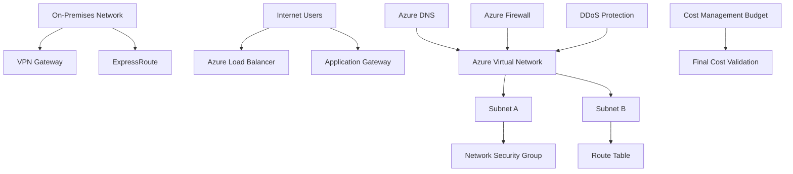

# Lab 06 - Azure Networking Foundation

## Objective

The objective of this lab was to understand the core Azure networking services covered by AZ-900 and validate where those services are located in the Azure portal without deploying billable networking resources.

By completing this lab, I:

- Reviewed Azure virtual networking concepts
- Documented virtual networks, subnets, and address spaces
- Reviewed Network Security Groups and traffic filtering
- Reviewed route tables and custom routing
- Reviewed Azure DNS
- Reviewed VPN Gateway and ExpressRoute
- Reviewed Azure Load Balancer and Application Gateway
- Reviewed Azure Firewall and DDoS Protection
- Validated Azure networking service locations in the portal
- Confirmed that no billable networking resources were deployed
- Confirmed that evaluated spend remained `$0.00`

---

## Business Problem Solved

Cloud networking is one of the most important foundations for secure Azure environments.

Before deploying workloads, organizations need to understand how Azure resources communicate, how traffic is filtered, how hybrid connectivity works, and which services can introduce cost or security risk if deployed incorrectly.

Monroe Redstone Technology Group needed to understand Azure networking before deploying compute, storage, identity, or hybrid services.

This lab helped answer:

- What is an Azure Virtual Network?
- What are subnets used for?
- How does Azure handle private and public connectivity?
- What do Network Security Groups do?
- What are route tables used for?
- How does Azure DNS fit into cloud networking?
- When would VPN Gateway or ExpressRoute be used?
- What is the difference between Load Balancer and Application Gateway?
- Why are Azure Firewall and DDoS Protection important?
- Which Azure networking services can create cost quickly?

This lab solved the problem of building networking awareness before deployment.

---

## Scenario

MRTG is preparing to expand from an on-premises identity and infrastructure environment into Azure.

Before deploying cloud workloads, the cloud operations team needs to understand the networking foundation that will support future Azure services.

The team reviewed Azure networking concepts and explored the Azure portal to identify the services that would support:

- Private cloud networking
- Network segmentation
- Traffic filtering
- DNS resolution
- Hybrid connectivity
- Load balancing
- Application routing
- Network security
- DDoS protection
- Cost-safe exploration

No Azure networking resources were created in this lab.

---

## Azure Services Used

| Service | Purpose |
|---|---|
| Azure Virtual Network | Provides private network isolation for Azure resources |
| Subnets | Segment address space inside a virtual network |
| Network Security Groups | Filter inbound and outbound traffic |
| Route Tables | Control custom routing paths |
| Azure DNS | Host and manage DNS zones and records |
| VPN Gateway | Connect Azure networks to on-premises networks over encrypted tunnels |
| ExpressRoute | Provide private connectivity between on-premises networks and Microsoft cloud services |
| Azure Load Balancer | Distribute network traffic across backend resources |
| Application Gateway | Provide application-level routing and web traffic load balancing |
| Azure Firewall | Provide centralized cloud-native network security |
| DDoS Protection | Help protect Azure resources against large-scale network attacks |
| Azure Cost Management | Validate budget and confirm no unexpected spend |

---

## Why These Services Were Used

These services were reviewed because they represent the core networking building blocks that support Azure infrastructure.

| Networking Area | Azure Service |
|---|---|
| Private networking | Azure Virtual Network |
| Segmentation | Subnets |
| Traffic filtering | Network Security Groups |
| Routing | Route Tables |
| Name resolution | Azure DNS |
| Hybrid connectivity | VPN Gateway and ExpressRoute |
| Traffic distribution | Load Balancer and Application Gateway |
| Network security | Azure Firewall and DDoS Protection |
| Cost control | Azure Cost Management |

---

## Environment

| Component | Value |
|---|---|
| Organization | Monroe Redstone Technology Group |
| Project | MRTG Azure Fundamentals: The Bridge |
| Lab | Lab 06 |
| Subscription | `MRTG-AZ900-Lab-Subscription` |
| Azure region focus | `Central US` |
| Resource deployment model | Read-only portal exploration |
| Cost control | `$10.00` monthly budget |
| Billable resources created | None |
| Estimated lab cost | `$0.00` |
| Documentation platform | GitHub |

---

## Architecture / Concept Diagram



---

## Steps Performed

### Step 1: Review Azure Virtual Networking Concepts

1. Reviewed how Azure Virtual Networks allow Azure resources to communicate with each other.
2. Reviewed public and private endpoints.
3. Reviewed how Azure resources can communicate with the internet.
4. Reviewed how Azure resources can communicate with on-premises networks.
5. Reviewed routing and filtering concepts.


**Screenshot evidence:** Microsoft Learn shows Azure virtual networking concepts, including VNets, subnets, endpoints, routing, filtering, and connectivity.

---

### Step 2: Review VPN Gateway Connectivity Models

1. Reviewed VPN Gateway connectivity options.
2. Compared point-to-site VPN connectivity.
3. Compared site-to-site VPN connectivity.
4. Compared network-to-network VPN connectivity.
5. Documented VPN Gateway as an encrypted hybrid connectivity option.


**Screenshot evidence:** Microsoft Learn shows point-to-site, site-to-site, and network-to-network VPN gateway models.

---

### Step 3: Review Azure ExpressRoute

1. Reviewed Azure ExpressRoute as a private connectivity option.
2. Documented that ExpressRoute connects on-premises networks to Microsoft cloud services.
3. Documented that ExpressRoute does not use the public internet.
4. Reviewed why ExpressRoute may be used in enterprise or regulated environments.


**Screenshot evidence:** Microsoft Learn explains ExpressRoute private connectivity between on-premises infrastructure and Microsoft cloud services.

---

### Step 4: Review Azure DNS

1. Reviewed Azure DNS as a DNS hosting service.
2. Reviewed DNS zone and record management.
3. Documented that Azure DNS uses Azure infrastructure.
4. Reviewed DNS reliability, performance, security, and ease-of-use benefits.


**Screenshot evidence:** Microsoft Learn explains Azure DNS benefits and DNS hosting capabilities.

---

### Step 5: Review Azure DNS Security and Alias Records

1. Reviewed Azure DNS integration with Azure RBAC.
2. Reviewed activity logs and resource locks.
3. Reviewed private domain support.
4. Reviewed alias records and how they can point to Azure resources.
5. Documented that Azure DNS does not purchase domain names directly.


**Screenshot evidence:** Microsoft Learn shows Azure DNS security controls, private domain support, and alias records.

---

### Step 6: Review Azure Load Balancer

1. Reviewed Azure Load Balancer as a traffic distribution service.
2. Reviewed public load balancer use cases.
3. Reviewed internal load balancer use cases.
4. Reviewed health probes.
5. Documented Load Balancer as a Layer 4 traffic distribution service.


**Screenshot evidence:** Microsoft Learn explains Azure Load Balancer, public and internal load balancing, health probes, and backend traffic distribution.

---

### Step 7: Review Azure Virtual Network Design Considerations

1. Reviewed Azure Virtual Network capabilities.
2. Documented that VNets support communication between Azure resources.
3. Documented that VNets support internet communication.
4. Documented that VNets support on-premises connectivity.
5. Reviewed traffic filtering and routing.


**Screenshot evidence:** Microsoft Learn shows Azure Virtual Network capabilities and design considerations.

---

### Step 8: Review Address Space and Subnets

1. Reviewed VNet address spaces.
2. Reviewed private RFC 1918 address ranges.
3. Reviewed subnet planning.
4. Documented that subnet address spaces must not overlap.
5. Documented that Azure VNet address spaces should not overlap with on-premises networks.


**Screenshot evidence:** Microsoft Learn shows VNet address space planning, private address ranges, CIDR usage, and subnet design.

---

### Step 9: Validate Virtual Networks in Azure Portal

1. Opened the Azure portal.
2. Navigated to **Virtual networks**.
3. Confirmed that no virtual networks existed.
4. Did not create a virtual network.
5. Verified that no VNet-related cost was introduced.


**Screenshot evidence:** The Azure portal shows the Virtual Networks page with no VNets deployed.

---

### Step 10: Validate Network Security Groups in Azure Portal

1. Opened **Network security groups** in the Azure portal.
2. Confirmed that no NSGs existed.
3. Did not create a Network Security Group.
4. Documented NSGs as traffic filtering controls.


**Screenshot evidence:** The Azure portal shows the Network Security Groups page with no NSGs deployed.

---

### Step 11: Validate Route Tables in Azure Portal

1. Opened **Route tables** in the Azure portal.
2. Confirmed that no route tables existed.
3. Did not create a route table.
4. Documented route tables as custom routing controls.


**Screenshot evidence:** The Azure portal shows the Route Tables page with no route tables deployed.

---

### Step 12: Validate DNS Zones in Azure Portal

1. Opened **DNS zones** in the Azure portal.
2. Confirmed that no DNS zones existed.
3. Did not create a DNS zone.
4. Documented Azure DNS as a name-resolution service.


**Screenshot evidence:** The Azure portal shows the DNS Zones page with no DNS zones deployed.

---

### Step 13: Validate ExpressRoute Gateways in Azure Portal

1. Opened the ExpressRoute gateway view in the Azure portal.
2. Confirmed that no ExpressRoute gateways existed.
3. Did not create a gateway.
4. Documented ExpressRoute Gateway as a hybrid connectivity component.


**Screenshot evidence:** The Azure portal shows the gateway view with no ExpressRoute gateways deployed.

---

### Step 14: Validate VPN Gateways in Azure Portal

1. Opened the VPN gateway view in the Azure portal.
2. Confirmed that no VPN gateways existed.
3. Confirmed that the gateway type filter was set to VPN.
4. Did not create a VPN gateway.
5. Documented VPN Gateway as a hybrid connectivity option.


**Screenshot evidence:** The Azure portal shows the VPN gateway view with no VPN gateways deployed.

---

### Step 15: Validate ExpressRoute Circuits in Azure Portal

1. Opened **ExpressRoute circuits** in the Azure portal.
2. Confirmed that no ExpressRoute circuits existed.
3. Did not create an ExpressRoute circuit.
4. Documented ExpressRoute as a private connectivity service.


**Screenshot evidence:** The Azure portal shows the ExpressRoute Circuits page with no circuits deployed.

---

### Step 16: Validate Load Balancers in Azure Portal

1. Opened **Load balancers** in the Azure portal.
2. Confirmed that no load balancers existed.
3. Did not create a load balancer.
4. Documented Load Balancer as a network traffic distribution service.


**Screenshot evidence:** The Azure portal shows the Load Balancers page with no load balancers deployed.

---

### Step 17: Validate Application Gateways in Azure Portal

1. Opened **Application gateways** in the Azure portal.
2. Confirmed that no application gateways existed.
3. Did not create an Application Gateway.
4. Documented Application Gateway as an application-level routing and load balancing service.


**Screenshot evidence:** The Azure portal shows the Application Gateways page with no application gateways deployed.

---

### Step 18: Validate Azure Firewall in Azure Portal

1. Opened **Azure Firewall** in the Azure portal.
2. Confirmed that no Azure Firewalls existed.
3. Did not create an Azure Firewall.
4. Documented Azure Firewall as a cloud-native network security service.


**Screenshot evidence:** The Azure portal shows the Azure Firewall page with no firewalls deployed.

---

### Step 19: Validate DDoS Protection in Azure Portal

1. Opened **DDoS Protection** in the Azure portal.
2. Confirmed that no DDoS Protection plans existed.
3. Did not create a DDoS Protection plan.
4. Documented DDoS Protection as a network security service.


**Screenshot evidence:** The Azure portal shows the DDoS Protection page with no DDoS Protection plans deployed.

---

### Step 20: Perform Final Cost Validation

1. Opened Azure Cost Management.
2. Opened the subscription budget view.
3. Confirmed that the monthly budget remained active.
4. Confirmed that evaluated spend remained `$0.00`.
5. Confirmed that progress remained `0.00%`.
6. Confirmed that no billable networking resources were created.


**Screenshot evidence:** The final Cost Management screenshot shows the budget is active, evaluated spend is `$0.00`, and progress is `0.00%`.

---

## Networking Service Summary

| Service | Primary Use | Cost Risk if Deployed |
|---|---|---|
| Azure Virtual Network | Private network boundary for Azure resources | Low by itself |
| Subnet | Network segmentation inside a VNet | Low by itself |
| Network Security Group | Inbound and outbound traffic filtering | Low |
| Route Table | Custom routing control | Low |
| Azure DNS | DNS zone and record hosting | Low to moderate |
| VPN Gateway | Encrypted hybrid connectivity | High |
| ExpressRoute | Private enterprise connectivity | High |
| Azure Load Balancer | Layer 4 traffic distribution | Medium |
| Application Gateway | Layer 7 web traffic routing | Medium to high |
| Azure Firewall | Centralized network security | High |
| DDoS Protection | DDoS protection for public-facing resources | High |

---

## Networking Mental Model

```text
Virtual Network
Private network boundary for Azure resources.

Subnet
Smaller network segment inside a virtual network.

Network Security Group
Traffic filtering control.

Route Table
Custom traffic path control.

Azure DNS
Name resolution and DNS zone hosting.

VPN Gateway
Encrypted tunnel-based hybrid connectivity.

ExpressRoute
Private provider-based hybrid connectivity.

Load Balancer
Layer 4 traffic distribution.

Application Gateway
Layer 7 web application routing.

Azure Firewall
Centralized managed network security.

DDoS Protection
Protection against distributed denial-of-service attacks.
```

---

## Public vs Private Access

| Access Type | Description | Example |
|---|---|---|
| Public access | Resource can be reached from the public internet if allowed | Public IP, public load balancer |
| Private access | Resource is reachable through private network paths | Private IP, VNet, private endpoint |
| Hybrid access | Azure connects to on-premises or remote networks | VPN Gateway, ExpressRoute |
| Filtered access | Traffic is allowed or denied based on rules | NSG, Azure Firewall |

### Key Takeaway

Public exposure should be intentional.

Private access, segmentation, traffic filtering, and least privilege network design are critical for secure cloud environments.

---

## Validation

| Validation Check | Expected Result | Actual Result | Status |
|---|---|---|---|
| Azure networking concepts reviewed | Concepts reviewed successfully | Virtual networking, hybrid connectivity, DNS, and load balancing concepts reviewed | Passed |
| Virtual Networks page reviewed | Portal page accessible | No virtual networks displayed | Passed |
| Network Security Groups page reviewed | Portal page accessible | No NSGs displayed | Passed |
| Route Tables page reviewed | Portal page accessible | No route tables displayed | Passed |
| DNS Zones page reviewed | Portal page accessible | No DNS zones displayed | Passed |
| ExpressRoute Gateway reviewed | Portal page accessible | No ExpressRoute gateways displayed | Passed |
| VPN Gateway reviewed | Portal page accessible | No VPN gateways displayed | Passed |
| ExpressRoute circuits reviewed | Portal page accessible | No ExpressRoute circuits displayed | Passed |
| Load Balancer reviewed | Portal page accessible | No load balancers displayed | Passed |
| Application Gateway reviewed | Portal page accessible | No application gateways displayed | Passed |
| Azure Firewall reviewed | Portal page accessible | No firewalls displayed | Passed |
| DDoS Protection reviewed | Portal page accessible | No DDoS Protection plans displayed | Passed |
| Cost validation completed | No unexpected spend | Budget showed `$0.00` evaluated spend and `0.00%` progress | Passed |

---

## Completion Checklist

- [x] Reviewed Azure virtual networking concepts
- [x] Reviewed VPN Gateway connectivity models
- [x] Reviewed Azure ExpressRoute
- [x] Reviewed Azure DNS
- [x] Reviewed Azure DNS security and alias records
- [x] Reviewed Azure Load Balancer
- [x] Reviewed VNet design considerations
- [x] Reviewed VNet address spaces and subnets
- [x] Validated Virtual Networks portal page
- [x] Validated Network Security Groups portal page
- [x] Validated Route Tables portal page
- [x] Validated DNS Zones portal page
- [x] Validated ExpressRoute Gateway portal page
- [x] Validated VPN Gateway portal page
- [x] Validated ExpressRoute Circuits portal page
- [x] Validated Load Balancers portal page
- [x] Validated Application Gateways portal page
- [x] Validated Azure Firewall portal page
- [x] Validated DDoS Protection portal page
- [x] Did not create networking resources
- [x] Validated evaluated spend remained `$0.00`
- [x] Sanitized screenshots before upload

---

## AZ-900 Exam Objective Coverage

### Primary Exam Domain

```text
Describe Azure architecture and services
```

### Supporting Exam Domain

```text
Describe Azure management and governance
```

### Skills Measured

This lab supports the ability to:

- Describe Azure Virtual Network
- Describe subnets
- Describe public and private IP addressing concepts
- Describe Network Security Groups
- Describe route tables
- Describe Azure DNS
- Describe VPN Gateway
- Describe ExpressRoute
- Describe Azure Load Balancer
- Describe Application Gateway
- Describe Azure Firewall
- Describe DDoS Protection
- Describe public and private network access
- Describe hybrid connectivity options
- Describe cost risks related to Azure networking services

---

## Mini Objective Coverage

By completing this lab, I can now:

- Explain the purpose of an Azure Virtual Network
- Explain how subnets segment a VNet
- Explain why address planning matters
- Explain how NSGs filter traffic
- Explain how route tables affect traffic flow
- Explain what Azure DNS provides
- Explain when VPN Gateway may be used
- Explain when ExpressRoute may be used
- Explain the difference between Load Balancer and Application Gateway
- Explain why Azure Firewall and DDoS Protection are security services
- Identify networking services in the Azure portal
- Validate cost impact after networking service review

---

## IAM / Security Relevance

Networking is directly connected to identity and access management because secure access depends on more than user authentication.

In a regulated environment, identity controls must work alongside network controls.

Examples:

- IAM determines who can access resources.
- Networking determines where resources can communicate.
- NSGs and firewalls restrict traffic paths.
- Private endpoints reduce public exposure.
- VPN and ExpressRoute support controlled hybrid access.
- DNS supports reliable service discovery.
- RBAC controls who can manage networking resources.
- Activity logs support auditability.

For government, healthcare, finance, and defense contractor environments, networking decisions affect:

- Security boundaries
- Compliance posture
- Logging
- Segmentation
- Incident response
- Auditability
- Hybrid access
- Remote administration
- Public exposure

### Security Takeaway

Identity controls decide who can access resources.

Network controls decide where traffic can flow.

Strong Azure security requires both.

---

## Governance Notes

Important governance considerations from this lab:

- Networking resources should follow naming standards.
- Address spaces should be planned before deployment.
- VNet address ranges should not overlap with on-premises networks.
- Subnets should align with workload, security, and operational boundaries.
- NSG rules should follow least privilege.
- Route tables should be documented.
- Hybrid connectivity should be approved and monitored.
- High-cost resources such as Azure Firewall, VPN Gateway, ExpressRoute, and DDoS Protection should require change approval.
- Budgets and alerts should be configured before deploying billable networking services.

### Governance Lesson

Networking should be designed before deployment.

Poor network design can create public exposure, routing problems, cost issues, and weak segmentation.

---

## Cost Considerations

### Estimated Lab Cost

```text
Estimated cost: $0.00
```

No networking resources were created in this lab.

Cost-sensitive services reviewed included:

- VPN Gateway
- ExpressRoute Gateway
- ExpressRoute circuits
- Azure Firewall
- DDoS Protection
- Application Gateway
- Load Balancer

The final budget validation confirmed:

```text
Budget amount: $10.00
Forecasted cost: 0
Evaluated spend: $0.00
Progress: 0.00%
```

This confirmed that the lab remained cost-safe.

### Cost Reminder

Some Azure networking services can generate cost quickly once deployed.

Services such as gateways, firewalls, and DDoS Protection plans should not be created casually in a lab environment.

---

## Troubleshooting Notes

### Issue 1: Avoiding Accidental Networking Costs

**Symptom:**

Several Azure networking services include **Create** buttons directly on their portal pages.

**Risk:**

Some networking services can generate cost quickly if deployed, especially gateways, firewalls, and DDoS Protection plans.

**Resolution:**

Each service was opened for review only. No resources were created.

**Result:**

The lab was completed without creating billable networking resources.

---

### Issue 2: Portal Pages Displayed No Resources

**Symptom:**

Most networking service pages displayed no resources.

**Explanation:**

This was expected because the lab focused on identifying services and validating the current environment, not deploying networking infrastructure.

**Result:**

The empty resource views became validation evidence that no networking resources were deployed.

---

### Issue 3: Gateway Pages Can Be Confusing

**Symptom:**

Azure portal has multiple gateway-related views, including VPN gateways, ExpressRoute gateways, and virtual network gateways.

**Explanation:**

These services are related to connectivity, but they represent different deployment and connectivity models.

**Resolution:**

Gateway pages were documented separately for VPN and ExpressRoute concepts.

**Result:**

The lab documented hybrid connectivity without deploying gateway resources.

---

## What I Would Do Differently in Production

In a production Azure environment, I would not treat networking as a click-through exercise.

I would define the network design before deployment, including:

- IP address plan
- Hub-and-spoke architecture
- Subnet design
- DNS strategy
- NSG rule standards
- Route table strategy
- Private endpoint usage
- Firewall placement
- Hybrid connectivity model
- Logging and monitoring requirements
- RBAC permissions for network administration
- Cost controls and approval workflows
- Traffic-flow documentation
- Change-control requirements
- Incident-response visibility
- Compliance mapping

For regulated environments, traffic flows, ownership, change control, audit requirements, and segmentation boundaries should be documented before deployment.

---

## Lessons Learned

This lab reinforced that Azure networking is foundational to secure cloud architecture.

Key lessons:

- Virtual networks are the base private networking layer in Azure.
- Subnets create segmentation inside VNets.
- NSGs filter traffic and support least privilege networking.
- Route tables control custom traffic paths.
- Azure DNS supports name resolution and resource integration.
- VPN Gateway and ExpressRoute support hybrid connectivity.
- Load Balancer and Application Gateway support availability and traffic distribution.
- Azure Firewall and DDoS Protection support network security.
- Some networking resources can create significant cost.
- Cost validation should be part of every Azure lab.

### Technical Takeaway

Azure networking controls how resources communicate.

### Business Takeaway

Good network design reduces risk, improves reliability, and supports secure cloud adoption.

### Security Takeaway

Network controls and IAM controls work together. One does not replace the other.

### Exam Takeaway

For AZ-900, remember:

- VNets provide private networking.
- Subnets segment VNets.
- NSGs filter traffic.
- Route tables control routing.
- VPN Gateway and ExpressRoute support hybrid connectivity.
- Load Balancer works at Layer 4.
- Application Gateway works at Layer 7.
- Azure Firewall and DDoS Protection support network security.

---

## Cleanup

No cleanup was required because no networking resources were created.

### Resources Retained

| Resource or Configuration | Reason |
|---|---|
| Azure subscription | Required for future labs |
| Monthly budget | Required for ongoing cost visibility |
| Existing Lab 01 resource group | Retained as the foundational lab resource group |
| Cost Management configuration | Required for continued budget validation |

### Resources Removed

No Azure networking resources were created during this lab.

### Cleanup Validation

- [x] No virtual networks were created
- [x] No subnets were created
- [x] No Network Security Groups were created
- [x] No route tables were created
- [x] No DNS zones were created
- [x] No VPN gateways were created
- [x] No ExpressRoute gateways were created
- [x] No ExpressRoute circuits were created
- [x] No load balancers were created
- [x] No application gateways were created
- [x] No Azure Firewalls were created
- [x] No DDoS Protection plans were created
- [x] Evaluated spend remained `$0.00`
- [x] Budget progress remained `0.00%`

---

## Outcome

Lab 06 successfully established a foundational understanding of Azure networking services while maintaining a cost-safe lab environment.

The lab demonstrated how to identify and validate core networking services in Azure without deploying billable resources.

The completed lab demonstrates:

- Understanding of Azure Virtual Networks
- Understanding of subnets and address spaces
- Understanding of traffic filtering with NSGs
- Understanding of custom routing with route tables
- Understanding of Azure DNS
- Understanding of VPN Gateway
- Understanding of ExpressRoute
- Understanding of Load Balancer
- Understanding of Application Gateway
- Understanding of Azure Firewall
- Understanding of DDoS Protection
- Awareness of networking cost risks
- Awareness of networking security responsibilities
- Final evaluated spend of `$0.00`

---

## Screenshot Inventory

| Screenshot | Description |
|---|---|
| `01-azure-virtual-networking-overview.png` | Azure virtual networking concepts |
| `02-vpn-gateway-connectivity-models.png` | VPN Gateway connectivity models |
| `03-azure-expressroute-overview.png` | Azure ExpressRoute overview |
| `04-azure-dns-overview.png` | Azure DNS overview |
| `05-azure-dns-security-and-alias-records.png` | Azure DNS security and alias records |
| `06-azure-load-balancer-overview.png` | Azure Load Balancer overview |
| `07-explore-azure-virtual-networks.png` | Azure Virtual Network design considerations |
| `08-vnet-address-space-and-subnets.png` | VNet address space and subnet planning |
| `09-virtual-networks-portal.png` | Azure portal Virtual Networks page |
| `10-network-security-groups-portal.png` | Azure portal Network Security Groups page |
| `11-route-tables-portal.png` | Azure portal Route Tables page |
| `12-dns-zones-portal.png` | Azure portal DNS Zones page |
| `13-virtual-network-gateways-portal.png` | Azure portal ExpressRoute Gateways view |
| `14-virtual-network-gateways-portal.png` | Azure portal VPN Gateways view |
| `15-expressroute-circuits-portal.png` | Azure portal ExpressRoute Circuits page |
| `16-load-balancers-portal.png` | Azure portal Load Balancers page |
| `17-application-gateways-portal.png` | Azure portal Application Gateways page |
| `18-azure-firewall-portal.png` | Azure portal Azure Firewall page |
| `19-ddos-protection-portal.png` | Azure portal DDoS Protection page |
| `20-cost-management-final-validation.png` | Final Cost Management validation |

---

## Next Lab

The next lab is:

```text
Lab 07 - Azure Storage Services
```

The next lab will build on this networking foundation by reviewing:

- Storage accounts
- Blob storage
- Azure Files
- Queue storage
- Table storage
- Disk storage
- Storage redundancy options
- Access tiers
- Storage security
- Cost-aware storage planning
