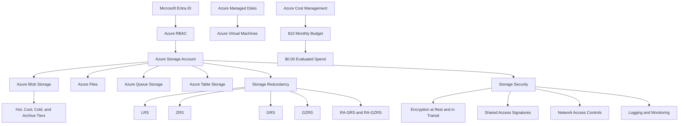
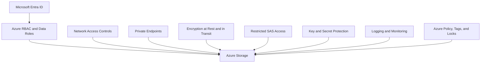

# Lab 07 - Azure Storage Services

## Objective

Document the primary Microsoft Azure storage services and explain how storage type, redundancy, access tier, identity, security, and cost affect Azure storage design.

By completing this lab, I:

- Reviewed Azure storage accounts
- Reviewed Azure Blob Storage
- Reviewed Azure Files
- Reviewed Azure Queue Storage
- Reviewed Azure Table Storage
- Reviewed Azure managed disks
- Compared Azure storage account types
- Reviewed storage redundancy options
- Compared blob access tiers
- Reviewed Azure Storage security controls
- Reviewed shared access signatures
- Validated Azure storage services in the Azure Portal
- Confirmed that no billable storage resources were created
- Confirmed that evaluated Azure spend remained `$0.00`

This was a discovery-only lab. No Azure storage resources or configurations were created or modified.

---

## Business Problem Solved

Cloud storage is a foundational part of most Azure architectures.

Before deploying applications or storing organizational data, cloud administrators must understand:

- Which storage service fits each data type
- How storage accounts organize Azure Storage services
- How data is replicated
- How frequently data will be accessed
- How users and applications receive access
- How public exposure is controlled
- How stored data is encrypted
- How storage activity is monitored
- How storage choices affect cost
- How data should be retained or deleted

Poor storage design can create:

- Excessive cost
- Unnecessary public exposure
- Weak access controls
- Data-loss risk
- Inadequate redundancy
- Overuse of shared keys
- Long-lived shared access signatures
- Compliance findings
- Unmanaged data retention
- Orphaned disks and snapshots

Monroe Redstone Technology Group needed to understand Azure storage services before deploying application data, file shares, queues, tables, virtual machine disks, or storage-backed workloads.

This lab established the storage knowledge required to make secure, resilient, and cost-conscious design decisions.

---

## Scenario

MRTG is preparing to use Microsoft Azure for future workloads.

Before creating storage accounts or uploading data, the cloud operations team must understand the storage services available in Azure and how each service supports different technical and business requirements.

The team reviews Azure storage concepts and explores the Azure Portal to identify services supporting:

- Unstructured object storage
- Managed cloud file shares
- Asynchronous application messaging
- Structured NoSQL data
- Virtual machine disks
- Data redundancy
- Storage access tiers
- Identity-based authorization
- Delegated storage access
- Encryption
- Cost-safe service discovery

No Azure storage resources are created during this lab.

---

## Azure Services and Resources Used

| Azure Service, Resource, or Platform | Purpose |
|---|---|
| Microsoft Learn | Provided certification-aligned Azure Storage instruction |
| Azure Portal | Supported practical storage-service discovery |
| Azure Storage Account | Provides a namespace and management boundary for Azure Storage data |
| Azure Blob Storage | Stores unstructured object data |
| Azure Files | Provides managed cloud file shares |
| Azure Queue Storage | Stores messages for asynchronous processing |
| Azure Table Storage | Stores structured, non-relational data |
| Azure Managed Disks | Provides block-level storage for Azure virtual machines |
| Azure Storage Redundancy | Protects data through local, zonal, and geographic replication |
| Blob Access Tiers | Aligns storage cost with data-access frequency |
| Microsoft Entra ID | Supports identity-based authorization to Azure Storage |
| Azure RBAC | Controls management and data access at Azure scopes |
| Shared Access Signatures | Provides restricted delegated access to storage resources |
| Azure Cost Management | Supported final spending validation |
| Azure Budgets | Confirmed that evaluated spend remained `$0.00` |

---

## Why These Services Were Used

### Microsoft Learn

Microsoft Learn was used as the primary certification-aligned source for Azure Storage concepts.

It provided structured coverage of:

- Storage accounts
- Storage account types
- Azure Blob Storage
- Azure Files
- Azure Queue Storage
- Azure Table Storage
- Azure managed disks
- Storage redundancy
- Blob access tiers
- Storage security
- Shared access signatures

### Azure Portal

The Azure Portal was used to connect Microsoft Learn concepts to real Azure services.

It supported:

- Blob Storage discovery
- File Storage discovery
- Block Storage discovery
- Azure managed disk discovery
- Confirmation that no storage resources were deployed
- Cost Management validation

The Azure Portal was used only for review and validation.

### Azure Storage Account

An Azure storage account provides a unique namespace and management boundary for Azure Storage data.

A general-purpose storage account can contain services such as:

- Blob containers
- File shares
- Queues
- Tables

Storage account configuration can affect:

- Performance
- Redundancy
- Region
- Network access
- Encryption
- Authorization
- Cost

### Azure Blob Storage

Azure Blob Storage was reviewed as Azure object storage for unstructured data.

Common use cases include:

- Documents
- Images
- Video
- Audio
- Log files
- Backups
- Archives
- Data lakes
- Static website content

### Azure Files

Azure Files was reviewed as a managed file-sharing service.

It can provide:

- SMB file shares
- NFS file shares
- Shared access from multiple systems
- Hybrid file-sharing scenarios
- Cloud-hosted replacements for traditional file servers
- Integration with Azure File Sync

### Azure Queue Storage

Azure Queue Storage was reviewed as a messaging service for asynchronous application communication.

Queues can help:

- Separate application components
- Store work until it can be processed
- Support background tasks
- Improve application resiliency
- Handle variable workloads

### Azure Table Storage

Azure Table Storage was reviewed as a NoSQL service for structured, non-relational data.

It can support:

- Key-value data
- High-volume structured records
- Applications that do not require relational database features
- Flexible schema designs

### Azure Managed Disks

Azure managed disks were reviewed as block-level storage for Azure virtual machines.

Managed disks can provide:

- Operating system disks
- Data disks
- Different performance tiers
- Snapshot support
- Redundancy options
- Platform-managed disk infrastructure

### Azure Storage Redundancy

Storage redundancy was reviewed because it affects:

- Data durability
- Availability
- Zone protection
- Regional recovery
- Read access to secondary copies
- Cost

### Blob Access Tiers

Blob access tiers were reviewed because storage cost depends partly on how frequently data is accessed.

The following tiers were compared:

- Hot
- Cool
- Cold
- Archive

### Microsoft Entra ID and Azure RBAC

Microsoft Entra ID and Azure RBAC were reviewed as preferred identity-based access methods for supported Azure Storage scenarios.

Identity-based authorization can reduce dependence on:

- Shared account keys
- Embedded credentials
- Broad connection strings
- Long-lived access tokens

### Shared Access Signatures

Shared access signatures were reviewed as a delegated access method.

A SAS can restrict access by:

- Resource
- Permission
- Start time
- Expiration time
- Protocol
- IP address range

SAS tokens must be protected because possession of a valid SAS can provide access within the permissions it grants.

### Azure Cost Management

Azure Cost Management was reviewed because storage costs can increase through:

- Data volume
- Transactions
- Retrieval
- Replication
- Snapshots
- Managed disks
- Network transfer
- Premium performance tiers

### Azure Budgets

The existing monthly budget provided evidence that:

- The `$10.00` monthly budget remained active
- Evaluated spend remained `$0.00`
- Budget progress remained `0.00%`

---

## Environment

| Item | Value |
|---|---|
| Organization | Monroe Redstone Technology Group |
| Project | MRTG Azure Fundamentals: The Bridge |
| Lab | Lab 07 - Azure Storage Services |
| Cloud Platform | Microsoft Azure |
| Management Interface | Azure Portal |
| Learning Platform | Microsoft Learn |
| Subscription | `MRTG-AZ900-Lab-Subscription` |
| Regional Focus | `Central US` |
| New Resource Group | None |
| Storage Accounts Created | None |
| Storage Resources Created | None |
| Managed Disks Created | None |
| Monthly Budget | `$10.00` |
| Evaluated Spend | `$0.00` |
| Budget Progress | `0.00%` |
| Documentation Platform | GitHub |
| Lab Type | Discovery-only |
| Estimated Cost | `$0.00` |

---

## Architecture / Concept Diagram



---

## Steps Performed

### Step 1: Review Azure Storage Accounts

1. Opened Microsoft Learn.
2. Reviewed the purpose of Azure storage accounts.
3. Documented that a storage account provides a unique namespace for Azure Storage data.
4. Reviewed the relationship between storage accounts, storage services, performance, and redundancy.
5. Identified that general-purpose storage accounts can contain:
   - Blobs
   - Files
   - Queues
   - Tables


**Validation:** Microsoft Learn described Azure storage accounts, unique namespaces, supported services, and redundancy options.

---

### Step 2: Review Storage Account Types

1. Reviewed standard and premium storage account types.
2. Compared the services supported by each account type.
3. Reviewed available redundancy options.
4. Reviewed common usage scenarios.
5. Documented general-purpose v2 as the recommended standard account type for most Azure Storage scenarios.


**Validation:** Microsoft Learn displayed Azure storage account types, supported services, redundancy options, and recommended scenarios.

---

### Step 3: Review Azure Storage Services

1. Reviewed the primary Azure Storage data services.
2. Identified Blob Storage as object storage.
3. Identified Azure Files as managed file storage.
4. Identified Queue Storage as message storage.
5. Identified Table Storage as NoSQL structured storage.
6. Identified Azure managed disks as block-level virtual machine storage.


**Validation:** Microsoft Learn displayed Azure Blobs, Azure Files, Azure Queues, Azure Tables, and Azure managed disks.

---

### Step 4: Review Azure Blob Storage

1. Opened the Azure Blob Storage section.
2. Documented Blob Storage as unstructured object storage.
3. Reviewed access through HTTP or HTTPS.
4. Reviewed common Blob Storage use cases:
   - Documents
   - Images
   - Video
   - Audio
   - Backups
   - Logs
   - Archives
   - Analytics data
5. Documented that Blob Storage supports large volumes of text or binary data.


**Validation:** Microsoft Learn described Blob Storage and its common object-storage use cases.

---

### Step 5: Review Blob Storage Access Tiers

1. Opened the blob access-tier section.
2. Compared:
   - Hot
   - Cool
   - Cold
   - Archive
3. Documented how access tiers balance:
   - Storage cost
   - Access cost
   - Retrieval time
   - Minimum retention period
4. Connected tier selection to data lifecycle and cost management.


**Validation:** Microsoft Learn compared the Hot, Cool, Cold, and Archive access tiers.

---

### Step 6: Review Azure Files

1. Opened the Azure Files section.
2. Documented Azure Files as a managed cloud file-sharing service.
3. Reviewed SMB support.
4. Reviewed NFS support.
5. Reviewed access from Windows, Linux, and macOS.
6. Reviewed benefits such as:
   - Shared access
   - Managed infrastructure
   - Resiliency
   - Automation support
   - Hybrid file sharing


**Validation:** Microsoft Learn described Azure Files, SMB and NFS support, shared access, resiliency, and management benefits.

---

### Step 7: Review Azure Queue Storage

1. Opened the Azure Queue Storage section.
2. Documented Queue Storage as an asynchronous messaging service.
3. Reviewed authenticated HTTP and HTTPS access.
4. Reviewed how queues separate application producers and consumers.
5. Documented how Azure Functions can process queue messages.
6. Connected queue-based design to application resiliency and scalability.


**Validation:** Microsoft Learn described Queue Storage, asynchronous messaging, and background-processing scenarios.

---

### Step 8: Review Azure Table Storage

1. Opened the Azure Table Storage section.
2. Documented Table Storage as a NoSQL service.
3. Reviewed support for structured, non-relational data.
4. Reviewed authenticated access.
5. Documented that Table Storage is appropriate for large sets of key-value or structured records that do not require relational database features.


**Validation:** Microsoft Learn described Azure Table Storage as a NoSQL store for structured, non-relational data.

---

### Step 9: Review Azure Managed Disks

1. Opened the Azure managed disks section.
2. Documented managed disks as block-level storage for Azure virtual machines.
3. Reviewed how Azure manages the underlying storage infrastructure.
4. Reviewed operating system and data disk use cases.
5. Connected disk type and performance tier to workload performance and cost.


**Validation:** Microsoft Learn described Azure managed disks as block-level storage for Azure virtual machines.

---

### Step 10: Review Storage Redundancy

1. Opened the Azure Storage redundancy section.
2. Documented that redundancy protects data from:
   - Hardware failures
   - Datacenter failures
   - Availability zone failures
   - Regional failures
3. Reviewed locally redundant storage.
4. Connected redundancy selection to durability, availability, recovery, and cost.


**Validation:** Microsoft Learn described storage redundancy and locally redundant storage.

---

### Step 11: Review Zone-Redundant Storage

1. Opened the zone-redundant storage section.
2. Documented that ZRS replicates data across availability zones in the primary region.
3. Reviewed how ZRS can maintain access when one zone becomes unavailable.
4. Documented that ZRS can support scenarios where data must remain within one region or country.
5. Connected ZRS to zone-level resilience.


**Validation:** Microsoft Learn described replication across availability zones through zone-redundant storage.

---

### Step 12: Review Secondary-Region Redundancy

1. Reviewed secondary-region redundancy.
2. Documented that geo-redundant options replicate data to a secondary Azure region.
3. Reviewed failover considerations.
4. Reviewed recovery-point considerations.
5. Documented that recent writes may not be present in the secondary region during a major failure.


**Validation:** Microsoft Learn described secondary-region replication and recovery-point considerations.

---

### Step 13: Review Geo-Redundant Storage Options

1. Reviewed geo-redundant storage.
2. Reviewed geo-zone-redundant storage.
3. Compared:
   - GRS
   - GZRS
4. Documented that GRS replicates data locally in the primary region and to a secondary region.
5. Documented that GZRS combines zone redundancy in the primary region with geographic replication.
6. Connected higher redundancy to increased resiliency and potential cost.


**Validation:** Microsoft Learn displayed geo-redundant and geo-zone-redundant replication models.

---

### Step 14: Review Read Access to Secondary-Region Data

1. Reviewed read-access geo-redundant options.
2. Compared:
   - RA-GRS
   - RA-GZRS
3. Documented that read-access options permit reads from the secondary endpoint.
4. Reviewed recovery-point considerations.
5. Documented that the secondary copy may not contain the most recent writes.


**Validation:** Microsoft Learn described read-access geo-redundant options and secondary-region data considerations.

---

### Step 15: Review Azure Storage Security

1. Opened the Azure Storage security section.
2. Reviewed encryption at rest.
3. Reviewed encryption in transit.
4. Reviewed Microsoft Entra ID authorization.
5. Reviewed managed identities.
6. Reviewed Azure RBAC.
7. Reviewed storage analytics and logging.
8. Connected the controls through a defense-in-depth model.


**Validation:** Microsoft Learn described Azure Storage encryption, identity-based authorization, Azure RBAC, managed identities, and logging.

---

### Step 16: Review Shared Access Signatures

1. Opened the shared access signature section.
2. Documented that SAS provides restricted delegated access.
3. Reviewed:
   - User delegation SAS
   - Service SAS
   - Account SAS
   - Stored access policies
4. Reviewed how permissions and expiration reduce exposure.
5. Documented that SAS tokens must be protected as sensitive credentials.


**Validation:** Microsoft Learn described shared access signatures and restricted delegated access to Azure Storage resources.

---

### Step 17: Validate Blob Storage in the Azure Portal

1. Opened Azure Storage Center.
2. Opened the Blob Storage view.
3. Confirmed that no storage accounts existed.
4. Did not select **Create**.
5. Did not create a storage account, blob container, or blob.
6. Documented that blob containers require a storage account.


**Validation:** The Azure Portal displayed the Blob Storage view with no storage accounts deployed.

---

### Step 18: Validate File Storage in the Azure Portal

1. Opened the File Storage section in Azure Storage Center.
2. Reviewed:
   - Azure Files
   - Azure File Sync
   - Azure NetApp Files
   - Azure Managed Lustre
3. Confirmed that no storage accounts or file services were deployed.
4. Did not create a storage account, file share, synchronization service, or premium file platform.


**Validation:** The Azure Portal displayed file-storage services without deployed storage resources.

---

### Step 19: Validate Block Storage in the Azure Portal

1. Opened the Block Storage section in Azure Storage Center.
2. Reviewed:
   - Azure managed disks
   - Azure Elastic SAN
3. Confirmed that no block-storage resources were deployed.
4. Did not create disks, snapshots, storage accounts, or SAN resources.


**Validation:** The Azure Portal displayed block-storage options without deployed resources.

---

### Step 20: Validate Azure Managed Disks in the Azure Portal

1. Opened the Azure managed disks page.
2. Confirmed that no managed disks existed.
3. Confirmed that disk counts were zero.
4. Reviewed available views for:
   - Disk type
   - Disk state
   - Redundancy
   - Region
5. Did not create a managed disk or snapshot.


**Validation:** The Azure Portal displayed zero managed disks.

---

### Step 21: Perform Final Cost Validation

1. Opened Azure Cost Management.
2. Opened the existing subscription budget.
3. Confirmed that the monthly budget remained active.
4. Confirmed that evaluated spend remained `$0.00`.
5. Confirmed that budget progress remained `0.00%`.
6. Confirmed that no billable storage or supporting resources were created.
7. Redacted sensitive subscription and scope information.


**Validation:** The final Cost Management review showed the active `$10.00` monthly budget, `$0.00` evaluated spend, and `0.00%` progress.

---

## Storage Service Summary

| Storage Service | Primary Use | Example Scenario |
|---|---|---|
| Azure Storage Account | Namespace and management boundary | Central configuration boundary for Azure Storage services |
| Azure Blob Storage | Unstructured object storage | Documents, images, logs, backups, media, and archives |
| Azure Files | Managed file shares | Shared files for cloud and hybrid workloads |
| Azure Queue Storage | Asynchronous message storage | Messages between application components |
| Azure Table Storage | Structured NoSQL data | High-volume key-value or non-relational records |
| Azure Managed Disks | Virtual machine block storage | Operating system and data disks |
| Blob Access Tiers | Storage cost optimization | Hot, Cool, Cold, and Archive data |
| Storage Redundancy | Data durability and availability | LRS, ZRS, GRS, GZRS, RA-GRS, and RA-GZRS |
| Shared Access Signatures | Restricted delegated access | Time-limited access to selected storage resources |

---

## Storage Selection Mental Model

```text
Azure Storage Account
Use as the namespace and management boundary for Azure Storage data.

Azure Blob Storage
Use for unstructured object data.

Azure Files
Use for managed SMB or NFS file shares.

Azure Queue Storage
Use for asynchronous application messages.

Azure Table Storage
Use for structured, non-relational data.

Azure Managed Disks
Use as block storage for Azure virtual machines.

Storage Redundancy
Use to determine how and where Azure replicates data.

Blob Access Tiers
Use to align storage cost with access frequency.

Shared Access Signature
Use for restricted and time-limited delegated access.
```

---

## Storage Account Types

| Account Type | Typical Use |
|---|---|
| Standard general-purpose v2 | Recommended standard account for blobs, files, queues, and tables |
| Premium block blob | High-performance block and append blob workloads |
| Premium file share | High-performance Azure Files workloads |
| Premium page blob | Page blobs and specialized high-performance workloads |

Storage account availability, supported services, redundancy options, and performance features depend on the selected account type.

---

## Blob Types

Azure Blob Storage supports different blob types.

| Blob Type | Primary Use |
|---|---|
| Block blob | Documents, images, video, backups, and general object data |
| Append blob | Append-focused workloads such as logging |
| Page blob | Random read-and-write workloads such as virtual hard disks |

---

## Access Tier Summary

| Access Tier | Best Fit | General Cost Pattern |
|---|---|---|
| Hot | Frequently accessed data | Higher storage cost and lower access cost |
| Cool | Infrequently accessed data | Lower storage cost and higher access cost |
| Cold | Rarely accessed data that still requires online access | Lower storage cost and higher access cost |
| Archive | Long-term data that can tolerate rehydration delay | Lowest storage cost and highest retrieval delay |

### Tier Selection Considerations

Access-tier selection should consider:

- How frequently data is accessed
- How quickly data must be retrieved
- Minimum retention periods
- Read and write transaction cost
- Retrieval cost
- Early deletion charges
- Data lifecycle
- Compliance requirements

Lifecycle management can move supported blob data between tiers based on rules.

---

## Storage Redundancy Options

| Redundancy Option | Protection Scope | Secondary Read Access |
|---|---|---|
| LRS | Replication within one primary-region datacenter | No |
| ZRS | Replication across availability zones in the primary region | No |
| GRS | Local replication plus asynchronous replication to a secondary region | No |
| GZRS | Zone replication in the primary region plus replication to a secondary region | No |
| RA-GRS | GRS with read access to the secondary endpoint | Yes |
| RA-GZRS | GZRS with read access to the secondary endpoint | Yes |

### Redundancy Selection Considerations

Redundancy selection should consider:

- Data criticality
- Availability requirements
- Zone-failure requirements
- Regional disaster requirements
- Recovery objectives
- Data residency
- Application read behavior
- Supported account type
- Service availability
- Cost

Higher redundancy does not replace:

- Backup
- Versioning
- Soft delete
- Application-level recovery
- Access control
- Data-retention planning

Replication can copy accidental deletion, corruption, or unauthorized changes to additional replicas.

---

## Azure Storage Security Model

Azure Storage security should use multiple layers.



### Authentication and Authorization

Preferred controls can include:

- Microsoft Entra ID
- Azure RBAC
- Storage data roles
- Managed identities
- Workload identities

Shared keys and connection strings should be protected and avoided when identity-based authorization meets the requirement.

### Network Security

Storage network controls can include:

- Public network-access settings
- Selected virtual networks
- IP restrictions
- Service endpoints
- Private endpoints
- Azure Firewall
- DNS controls

### Encryption

Azure Storage supports encryption at rest.

Secure transfer helps protect data in transit through HTTPS.

Additional encryption requirements may depend on:

- Data classification
- Regulatory requirements
- Key ownership
- Customer-managed key requirements
- Application architecture

### Logging and Monitoring

Storage activity can be monitored through supported Azure logging and monitoring capabilities.

Logs can support:

- Security investigations
- Access review
- Troubleshooting
- Compliance evidence
- Usage analysis
- Incident response

---

## Shared Access Signatures

A shared access signature provides delegated access to Azure Storage.

### SAS Types

| SAS Type | Description |
|---|---|
| User delegation SAS | Secured through Microsoft Entra credentials and limited to supported blob services |
| Service SAS | Grants access to a resource within one storage service |
| Account SAS | Grants access across one or more services in a storage account |

### SAS Security Requirements

A SAS should be:

- Limited to required permissions
- Limited to required resources
- Short-lived
- Restricted to HTTPS
- Restricted by IP address when appropriate
- Stored securely
- Removed or rotated when no longer needed
- Avoided when identity-based access is more appropriate

A SAS token should be treated as sensitive because it can authorize access without requiring the recipient to authenticate separately.

---

## Managed Disk Considerations

Managed disks support Azure virtual machines.

Common disk categories can include:

- Standard HDD
- Standard SSD
- Premium SSD
- Premium SSD v2
- Ultra Disk

Disk selection can affect:

- Performance
- Input/output operations
- Throughput
- Availability
- Redundancy
- Cost

Managed disks can continue generating charges even when a virtual machine is stopped or deleted if the disks are retained.

Disk cleanup must include review of:

- Operating system disks
- Data disks
- Snapshots
- Images
- Unattached disks

---

## Validation

| Validation Item | Expected Result | Actual Result |
|---|---|---|
| Azure storage accounts | Storage account purpose is reviewed | Passed |
| Storage account types | Standard and premium options are reviewed | Passed |
| Azure Storage services | Blobs, Files, Queues, Tables, and Disks are identified | Passed |
| Azure Blob Storage | Object-storage use cases are reviewed | Passed |
| Blob access tiers | Hot, Cool, Cold, and Archive tiers are compared | Passed |
| Azure Files | Managed file-share use cases are reviewed | Passed |
| Azure Queue Storage | Asynchronous messaging is reviewed | Passed |
| Azure Table Storage | Structured NoSQL storage is reviewed | Passed |
| Azure managed disks | Virtual machine block storage is reviewed | Passed |
| Storage redundancy | LRS, ZRS, GRS, GZRS, and read-access options are reviewed | Passed |
| Storage security | Encryption, identity, Azure RBAC, and monitoring are reviewed | Passed |
| Shared access signatures | Delegated storage access is reviewed | Passed |
| Blob Storage portal view | No storage accounts are deployed | Passed |
| File Storage portal view | No file-storage resources are deployed | Passed |
| Block Storage portal view | No block-storage resources are deployed | Passed |
| Managed Disks portal view | No managed disks are deployed | Passed |
| Storage resources | No billable storage resources are created | Passed |
| Supporting resources | No storage dependencies are created | Passed |
| Monthly budget | Existing budget remains active | Passed |
| Evaluated spend | Spend remains `$0.00` | Passed |
| Budget progress | Progress remains `0.00%` | Passed |
| Estimated cost | Lab remains within the `$0.00` estimate | Passed |

---

## Completion Checklist

- [x] Reviewed Azure storage accounts
- [x] Reviewed storage account types
- [x] Reviewed Azure Storage services
- [x] Reviewed Azure Blob Storage
- [x] Reviewed Blob Storage access tiers
- [x] Reviewed Azure Files
- [x] Reviewed Azure Queue Storage
- [x] Reviewed Azure Table Storage
- [x] Reviewed Azure managed disks
- [x] Reviewed locally redundant storage
- [x] Reviewed zone-redundant storage
- [x] Reviewed geo-redundant storage
- [x] Reviewed geo-zone-redundant storage
- [x] Reviewed read-access redundancy options
- [x] Reviewed Azure Storage security
- [x] Reviewed Microsoft Entra ID authorization
- [x] Reviewed Azure RBAC for storage
- [x] Reviewed shared access signatures
- [x] Opened the Blob Storage view in the Azure Portal
- [x] Opened the File Storage view
- [x] Opened the Block Storage view
- [x] Opened the Azure managed disks page
- [x] Did not create a storage account
- [x] Did not create storage resources
- [x] Did not create managed disks
- [x] Validated that the monthly budget remained active
- [x] Validated that evaluated spend remained `$0.00`
- [x] Validated that budget progress remained `0.00%`
- [x] Sanitized screenshots before upload
- [x] Avoided exposing sensitive account, tenant, subscription, or storage information

---

## AZ-900 Exam Objective Coverage

### Primary Exam Domain

```text
Describe Azure architecture and services
```

### Supporting Exam Domain

```text
Describe Azure management and governance
```

### Skills Measured

This lab supports the ability to:

- Describe Azure storage accounts
- Describe Azure Blob Storage
- Describe Azure Files
- Describe Azure Queue Storage
- Describe Azure Table Storage
- Describe Azure managed disks
- Describe Azure Storage redundancy options
- Describe Azure Blob Storage access tiers
- Describe Azure Storage security concepts
- Describe Microsoft Entra authorization for storage
- Describe Azure RBAC for storage
- Describe shared access signatures
- Describe storage cost considerations
- Describe how Azure Cost Management supports spending validation

### How This Lab Supports the Objectives

This lab connected Azure Storage concepts to practical Azure Portal service discovery.

It demonstrated:

- How storage accounts organize Azure Storage services
- How storage services support different data types
- How access tiers align cost with data-access frequency
- How redundancy affects durability and availability
- How Microsoft Entra ID and Azure RBAC support storage authorization
- How shared access signatures provide delegated access
- How managed disks support Azure virtual machines
- How Azure Cost Management validates cost-safe lab execution

---

## Mini Objective Coverage

By completing this lab, I can:

- Explain the purpose of an Azure storage account
- Identify the primary Azure Storage services
- Explain when Azure Blob Storage is appropriate
- Explain when Azure Files is appropriate
- Explain when Azure Queue Storage is appropriate
- Explain when Azure Table Storage is appropriate
- Explain when Azure managed disks are used
- Compare storage account types
- Compare storage redundancy options
- Compare Blob Storage access tiers
- Explain Microsoft Entra authorization for storage
- Explain Azure RBAC data access
- Explain the purpose of shared access signatures
- Describe common storage security controls
- Identify storage cost drivers
- Validate Azure storage services without deploying resources
- Confirm cost impact after storage-service review

---

## IAM / Security Relevance

Azure Storage is closely connected to identity and access management because storage services commonly contain sensitive organizational data.

### Management-Plane and Data-Plane Access

Storage access can involve two different control areas.

| Access Area | Purpose |
|---|---|
| Management plane | Controls configuration of the storage account and related Azure resources |
| Data plane | Controls access to blobs, files, queues, and tables |

An identity may have permission to manage a storage account without automatically having permission to read all stored data.

Likewise, an identity may receive data access without having permission to change the storage account configuration.

### Microsoft Entra ID

Microsoft Entra ID can authenticate users, groups, applications, and managed identities accessing supported Azure Storage services.

Identity-based authorization supports:

- Centralized identity lifecycle management
- Multifactor authentication for users
- Conditional Access where supported
- Managed identities
- Group-based access
- Auditable role assignments
- Reduced dependence on shared secrets

### Azure RBAC

Azure RBAC can control:

- Storage account administration
- Blob data access
- Queue data access
- Table data access
- File-share access in supported configurations

Role assignments should use:

- The correct built-in role
- The narrowest practical scope
- Group-based assignments
- Temporary privileged access where appropriate
- Regular access reviews

### Shared Keys

Storage account keys can provide broad access.

They should be:

- Protected
- Rotated
- Restricted
- Avoided when identity-based authorization meets the requirement
- Stored outside source code
- Excluded from screenshots and repositories

### Shared Access Signatures

SAS tokens provide delegated access but can create risk if they are:

- Overly broad
- Long-lived
- Shared through insecure channels
- Stored in code
- Logged accidentally
- Committed to source control
- Not revoked when no longer needed

### Managed Identities

Managed identities can allow Azure workloads to access storage without storing credentials.

Potential examples include:

- Azure Functions processing queue messages
- App Service reading Blob Storage
- Virtual machines accessing files or blobs
- Container Apps accessing storage
- Automation services writing logs

### Network Access

Storage security can also include:

- Disabling unnecessary public access
- Restricting allowed networks
- Using private endpoints
- Using private DNS
- Requiring secure transfer
- Monitoring network and access activity

### Regulated Environment Relevance

In government, defense, healthcare, finance, and other regulated environments, storage design affects:

- Data confidentiality
- Data integrity
- Data availability
- Access control
- Auditability
- Data residency
- Retention
- Legal holds
- Incident response
- Recovery
- Compliance evidence
- Cost governance

### Security Takeaway

Storage security is not limited to encryption.

It also requires:

- Strong identity
- Least-privilege authorization
- Network controls
- Credential protection
- Logging
- Monitoring
- Key management
- Data lifecycle governance

---

## Governance Notes

### Governance Decisions

| Decision | Implementation | Reason |
|---|---|---|
| Discovery-only lab | Storage services were reviewed without deployment | Prevented unnecessary cost |
| Microsoft Learn used | Certification-aligned storage content reviewed | Supported AZ-900 preparation |
| Azure Portal used | Storage services were located in the live environment | Connected theory to practical administration |
| Cost Management reviewed | Monthly budget and spending state validated | Confirmed cost-safe execution |
| Screenshots sanitized | Sensitive identifiers were redacted | Protected cloud-environment information |
| No storage accounts created | Storage concepts were documented without deployment | Maintained the `$0.00` cost target |

### Governance Lesson

Storage should be designed around data requirements before deployment.

A production storage design should define:

- Data owner
- Service owner
- Data classification
- Approved region
- Data residency
- Storage account type
- Redundancy
- Access tier
- Authentication method
- Authorization model
- Public-access policy
- Private-endpoint requirements
- Encryption requirements
- Logging requirements
- Retention requirements
- Backup requirements
- Recovery requirements
- Cost ownership
- Deletion procedures

### Example Storage Governance Standard

| Requirement | Example |
|---|---|
| Data owner | Application team |
| Service owner | Cloud Operations |
| Data classification | Confidential |
| Region | Central US |
| Storage service | Blob Storage |
| Redundancy | ZRS |
| Access tier | Hot |
| Public access | Disabled |
| Authorization | Microsoft Entra ID and Azure RBAC |
| Network access | Private endpoint |
| Secure transfer | Required |
| Logging | Centralized |
| Retention | Seven years |
| Cost center | Application department |

### Naming

Storage account names have specific restrictions.

They generally require:

- Globally unique names
- Lowercase letters
- Numbers
- No hyphens
- Length restrictions

The standard MRTG naming pattern may need adjustment to meet storage account naming requirements.

### Tagging

Storage resources should include approved tags such as:

- Project
- Environment
- Owner
- Cost center
- Data classification
- Application
- Managed by
- Retention category

Tags support organization but do not replace data-plane access controls.

---

## Cost Considerations

### Estimated Lab Cost

```text
Estimated cost: $0.00
```

### Why Cost Remained at Zero

This lab did not create:

- Storage accounts
- Blob containers
- Blobs
- File shares
- Queues
- Tables
- Managed disks
- Snapshots
- Images
- Azure NetApp Files resources
- Azure Managed Lustre resources
- Azure Elastic SAN resources
- Private endpoints
- Lifecycle-management policies
- Backup services
- Storage monitoring resources

### Common Storage Cost Drivers

- Data capacity
- Storage account type
- Performance tier
- Blob access tier
- Read and write transactions
- Data retrieval
- Early deletion
- Geo-replication
- Read-access replication
- Managed disk size
- Managed disk performance
- Snapshots
- File-share capacity
- File-share transactions
- Data transfer
- Private endpoints
- Backup
- Monitoring-data ingestion

### Access Tier Cost Considerations

| Tier | Storage Cost | Access Cost | Retrieval Time |
|---|---|---|---|
| Hot | Higher | Lower | Immediate |
| Cool | Lower | Higher | Immediate |
| Cold | Lower | Higher | Immediate |
| Archive | Lowest | Highest | Delayed rehydration |

### Redundancy Cost Considerations

Higher redundancy generally creates higher cost.

| Redundancy | General Cost Pattern |
|---|---|
| LRS | Lowest |
| ZRS | Higher than LRS |
| GRS | Higher due to geographic replication |
| GZRS | Higher due to zone and geographic replication |
| RA-GRS | Higher due to secondary read access |
| RA-GZRS | Higher due to zone, geographic, and read-access capabilities |

### Managed Disk Cost Considerations

Managed disks can generate cost based on:

- Provisioned size
- Disk tier
- Performance level
- Snapshots
- Regional configuration
- Redundancy
- Retention after VM deletion

Stopping or deleting a virtual machine does not always remove its managed disks.

### Budget Validation

The final Cost Management review showed:

```text
Budget: $10.00
Forecasted spend: 0
Evaluated spend: $0.00
Progress: 0.00%
```

### Budget Limitation

Azure budgets:

- Monitor actual and forecasted costs
- Generate notifications
- Do not delete storage accounts
- Do not remove disks
- Do not change access tiers
- Do not disable replication
- Do not prevent additional charges
- Do not replace regular Cost Management review

---

## Troubleshooting Notes

### Issue 1: Storage Create Options Were Prominent

**Symptom**

Azure Portal storage pages displayed prominent **Create** options.

**Risk**

Completing a creation workflow could deploy billable storage resources.

**Resolution**

Each service page was opened for discovery only.

No creation workflow was completed.

**Result**

No storage or supporting resource was deployed.

---

### Issue 2: Storage Services Required a Storage Account

**Symptom**

Blob containers, file shares, queues, and tables could not be fully managed because no storage account existed.

**Explanation**

These services exist within an Azure storage account.

Without a storage account, the portal can display the service categories but cannot display deployed containers, shares, queues, or tables.

**Result**

The service locations were documented without creating a storage account.

---

### Issue 3: Redundancy Names Were Similar

**Symptom**

Azure Storage includes several similar redundancy abbreviations:

- LRS
- ZRS
- GRS
- GZRS
- RA-GRS
- RA-GZRS

**Explanation**

Each option defines where replicas are stored and whether the secondary endpoint is readable.

**Resolution**

The redundancy models were documented in a comparison table.

**Result**

The relationship between durability, availability, regional protection, read access, and cost became easier to understand.

---

### Issue 4: Replication Could Be Mistaken for Backup

**Symptom**

Storage replication can appear to provide complete data recovery.

**Risk**

Replication can copy accidental deletion, corruption, or unauthorized changes to additional replicas.

**Resolution**

The lab documented redundancy and backup as separate controls.

**Result**

Storage replication was treated as an availability and durability feature rather than a complete backup strategy.

---

### Issue 5: SAS Tokens Can Be Exposed Easily

**Symptom**

A SAS token can be copied into URLs, scripts, configuration files, or screenshots.

**Risk**

Anyone possessing an active SAS token may receive the access granted by that token.

**Resolution**

No SAS token was created during the lab.

The README documents SAS tokens as sensitive credentials.

**Result**

No delegated-access credential was exposed.

---

## What I Would Do Differently in Production

A production Azure Storage deployment would require formal data, identity, network, security, recovery, operations, and cost planning.

### Data Architecture

- Classify data before storage
- Identify the data owner
- Select the correct storage service
- Define data residency
- Define retention requirements
- Define deletion requirements
- Define legal-hold requirements
- Separate workloads where appropriate
- Document data flows
- Document recovery requirements

### Identity and Access

- Use Microsoft Entra ID authorization
- Assign Azure RBAC through groups
- Use storage data roles
- Use the narrowest practical scope
- Use managed identities for workloads
- Avoid shared keys where possible
- Limit SAS permissions and duration
- Use Privileged Identity Management
- Perform recurring access reviews
- Monitor privileged storage operations

### Network Security

- Disable unnecessary public access
- Require secure transfer
- Use private endpoints where appropriate
- Configure private DNS
- Restrict network access
- Review trusted service exceptions
- Monitor access attempts
- Protect administrative paths

### Encryption and Key Management

- Confirm encryption at rest
- Require encryption in transit
- Evaluate customer-managed keys
- Protect key-management permissions
- Define key-rotation procedures
- Monitor key access
- Document recovery procedures

### Resiliency and Recovery

- Select redundancy based on business requirements
- Configure soft delete
- Configure versioning where appropriate
- Configure backups where required
- Test data recovery
- Document failover procedures
- Define recovery-time objectives
- Define recovery-point objectives
- Avoid treating replication as backup

### Governance

- Apply Azure Policy
- Require secure transfer
- Restrict public access
- Require approved redundancy
- Require approved regions
- Require tags
- Apply resource locks where appropriate
- Document exemptions
- Monitor policy compliance

### Operations

- Use Infrastructure as Code
- Store templates in source control
- Require peer review
- Configure lifecycle management
- Configure logging
- Configure alerts
- Monitor capacity and transactions
- Review unused storage
- Remove orphaned disks and snapshots
- Document support ownership

### Cost Management

- Estimate storage cost before deployment
- Select the correct access tier
- Review transaction patterns
- Review retrieval costs
- Review replication costs
- Configure workload-level budgets
- Apply cost-center tags
- Monitor unused storage
- Review orphaned disks
- Review snapshots
- Use lifecycle-management policies
- Review spending regularly

The lab intentionally avoided deployment because its purpose was storage-service discovery and AZ-900 concept validation.

---

## Lessons Learned

- Azure storage accounts provide namespaces and management boundaries for Azure Storage services.
- Azure Blob Storage stores unstructured object data.
- Azure Files provides managed SMB and NFS file shares.
- Azure Queue Storage supports asynchronous application messaging.
- Azure Table Storage provides structured NoSQL storage.
- Azure managed disks provide block-level storage for virtual machines.
- Storage account type affects performance, services, redundancy, and cost.
- Blob access tiers align storage cost with access frequency.
- Redundancy affects data durability, availability, recovery, and cost.
- Replication is not the same as backup.
- Microsoft Entra ID and Azure RBAC support identity-based storage access.
- Shared access signatures provide delegated access and must be protected.
- Public storage access should be an intentional design decision.
- Managed disks can continue generating cost after virtual machine deletion.
- Cost validation should be performed after every Azure lab.

### Technical Takeaway

Azure Storage services are selected based on data type, access pattern, performance, resiliency, security, and application requirements.

### Business Takeaway

A planned storage architecture protects organizational data, controls cost, supports recovery, and reduces operational risk.

### Security Takeaway

Storage security requires identity, authorization, encryption, network controls, credential protection, logging, and lifecycle governance.

### Exam Takeaway

For AZ-900, remember:

- Storage accounts provide namespaces and management boundaries.
- Blob Storage stores unstructured object data.
- Azure Files provides managed file shares.
- Queue Storage stores asynchronous messages.
- Table Storage provides NoSQL structured storage.
- Managed disks support Azure virtual machines.
- LRS protects within one datacenter.
- ZRS protects across availability zones.
- GRS and GZRS add secondary-region replication.
- RA options provide secondary read access.
- Access tiers align cost with access frequency.
- SAS provides restricted delegated access.
- Microsoft Entra ID and Azure RBAC can secure storage access.

---

## Cleanup

### Resources Retained

| Resource or Configuration | Reason |
|---|---|
| MRTG Azure subscription | Required for the remaining labs |
| Monthly Azure budget | Required for ongoing cost visibility |
| Lab 01 resource group | Retained as the foundational resource group |
| Lab 07 documentation | Retained as project evidence |
| Lab 07 screenshots | Retained as validation evidence |

### Resources Removed

No Azure storage resources were created during this lab.

### Cleanup Validation

- [x] No storage accounts were created
- [x] No blob containers were created
- [x] No blobs were uploaded
- [x] No file shares were created
- [x] No queues were created
- [x] No tables were created
- [x] No managed disks were created
- [x] No snapshots were created
- [x] No Azure Elastic SAN resources were created
- [x] No Azure NetApp Files resources were created
- [x] No Azure Managed Lustre resources were created
- [x] No private endpoints were created
- [x] No lifecycle-management policies were created
- [x] No redundancy settings were changed
- [x] No shared access signatures were created
- [x] No storage-related billable resources were deployed
- [x] Monthly budget remained active
- [x] Evaluated spend remained `$0.00`
- [x] Budget progress remained `0.00%`
- [x] Screenshot data was sanitized

---

## Outcome

This lab documented the Azure Storage foundation required for secure and cost-conscious cloud architecture.

The completed lab demonstrated:

- Understanding of Azure storage accounts
- Understanding of storage account types
- Understanding of Azure Blob Storage
- Understanding of Azure Files
- Understanding of Azure Queue Storage
- Understanding of Azure Table Storage
- Understanding of Azure managed disks
- Understanding of storage redundancy
- Understanding of blob access tiers
- Understanding of Azure Storage security
- Understanding of Microsoft Entra authorization
- Understanding of Azure RBAC for storage
- Understanding of shared access signatures
- Awareness of storage cost risks
- Awareness of storage security responsibilities
- Practical Azure Portal validation
- No deployed billable storage resources
- Final evaluated spend of `$0.00`

---

## Screenshot Inventory

| Screenshot | Description |
|---|---|
| `01-azure-storage-accounts-overview.png` | Azure storage account overview |
| `02-storage-account-types-overview.png` | Azure storage account types |
| `03-azure-storage-services-overview.png` | Azure Storage services overview |
| `04-blob-storage-overview.png` | Azure Blob Storage overview |
| `05-blob-storage-access-tiers.png` | Blob Storage access tiers |
| `06-azure-files-overview.png` | Azure Files overview |
| `07-queue-storage-overview.png` | Azure Queue Storage overview |
| `08-table-storage-overview.png` | Azure Table Storage overview |
| `09-azure-disks-overview.png` | Azure managed disks overview |
| `10-storage-redundancy-overview.png` | Azure Storage redundancy overview |
| `11-zone-redundant-storage.png` | Zone-redundant storage |
| `12-secondary-region-redundancy.png` | Secondary-region redundancy |
| `13-geo-redundant-storage-options.png` | Geo-redundant and geo-zone-redundant storage |
| `14-read-access-secondary-region.png` | Read access to secondary-region data |
| `15-storage-security-overview.png` | Azure Storage security strategies |
| `16-shared-access-signatures-overview.png` | Shared access signatures |
| `17-storage-center-blob-storage-portal.png` | Azure Portal Blob Storage view |
| `18-storage-center-file-storage-portal.png` | Azure Portal File Storage view |
| `19-storage-center-block-storage-portal.png` | Azure Portal Block Storage view |
| `20-azure-disks-portal.png` | Azure Portal managed disks view |
| `21-cost-management-final-validation.png` | Final Cost Management validation |

---

## Screenshots

### Azure Storage Accounts Overview


### Storage Account Types Overview


### Azure Storage Services Overview


### Azure Blob Storage Overview


### Blob Storage Access Tiers


### Azure Files Overview


### Azure Queue Storage Overview


### Azure Table Storage Overview


### Azure Managed Disks Overview


### Storage Redundancy Overview


### Zone-Redundant Storage


### Secondary-Region Redundancy


### Geo-Redundant Storage Options


### Read Access to Secondary Region


### Azure Storage Security Overview


### Shared Access Signatures Overview


### Storage Center Blob Storage Portal


### Storage Center File Storage Portal


### Storage Center Block Storage Portal


### Azure Managed Disks Portal


### Cost Management Final Validation


---

## Next Lab

The next lab is:

```text
Lab 08 - Microsoft Entra ID, RBAC, and Zero Trust
```

The next lab builds on this storage foundation by examining:

- Microsoft Entra ID
- Authentication
- Authorization
- Azure role-based access control
- Built-in Azure roles
- Azure RBAC scope
- Least privilege
- Conditional Access
- Zero Trust
- Defense in depth
- Identity and access security in Azure
