# Lab 07 - Azure Storage Services

## Objective

The objective of this lab was to understand the core Azure storage services covered by AZ-900 and validate where those services are located in the Azure portal without deploying billable storage resources.

By completing this lab, I:

- Reviewed Azure storage accounts
- Reviewed Azure Blob Storage
- Reviewed Azure Files
- Reviewed Azure Queue Storage
- Reviewed Azure Table Storage
- Reviewed Azure managed disks
- Reviewed storage redundancy options
- Reviewed storage access tiers
- Reviewed Azure Storage security strategies
- Reviewed shared access signatures
- Validated Azure storage service locations in the Azure portal
- Confirmed that no billable storage resources were deployed
- Confirmed that evaluated spend remained `$0.00`

---

## Business Problem Solved

Cloud storage is a foundational Azure service. Before deploying workloads, organizations need to understand which storage service fits each data requirement, how storage is protected, how access is controlled, and which storage choices can affect cost.

Monroe Redstone Technology Group needed to understand Azure storage before deploying application data, file shares, queues, tables, disks, or storage-backed services.

This lab helped answer:

- What is an Azure storage account?
- What services can a storage account contain?
- When should Blob Storage be used?
- When should Azure Files be used?
- When should Queue Storage be used?
- When should Table Storage be used?
- When are Azure managed disks used?
- How do redundancy options protect data?
- How do access tiers affect cost?
- How is Azure Storage secured?
- What are shared access signatures?
- Which storage services can create cost if deployed incorrectly?

This lab solved the problem of building storage awareness before deployment.

---

## Scenario

MRTG is preparing to use Azure for future workloads.

Before creating storage accounts or uploading data, the cloud operations team needs to understand the storage services available in Azure and how those services support different technical and business requirements.

The team reviewed Azure storage concepts and explored the Azure portal to identify services that would support:

- Object storage
- Managed file shares
- Application messaging
- NoSQL table storage
- Virtual machine disks
- Data redundancy
- Access tiers
- Storage security
- Shared access delegation
- Cost-safe exploration

No Azure storage resources were created in this lab.

---

## Azure Services and Resources Used

| Service | Purpose |
|---|---|
| Azure Storage Account | Provides a unique namespace and management boundary for Azure Storage data |
| Azure Blob Storage | Stores unstructured object data such as documents, images, backups, logs, and media |
| Azure Files | Provides managed cloud file shares using SMB or NFS |
| Azure Queue Storage | Stores messages for asynchronous application processing |
| Azure Table Storage | Provides NoSQL storage for structured, non-relational data |
| Azure Managed Disks | Provides block-level storage volumes for Azure virtual machines |
| Storage Redundancy | Protects data through replication options such as LRS, ZRS, GRS, and GZRS |
| Blob Access Tiers | Balances storage cost against access frequency |
| Shared Access Signatures | Provides restricted delegated access to storage resources |
| Azure Cost Management | Validates budget status and confirms no unexpected spend |

---

## Why These Services Were Used

These services were reviewed because they represent the main Azure storage options covered by AZ-900.

| Storage Requirement | Azure Service |
|---|---|
| Store files, images, logs, backups, and media | Blob Storage |
| Provide cloud file shares | Azure Files |
| Store messages between application components | Queue Storage |
| Store structured NoSQL data | Table Storage |
| Provide disks for virtual machines | Managed Disks |
| Protect data from hardware, datacenter, zone, or regional failures | Storage Redundancy |
| Reduce storage cost based on access frequency | Blob Access Tiers |
| Delegate limited access to storage resources | Shared Access Signatures |
| Control cost during lab work | Cost Management Budgets |

---

## Environment

| Component | Value |
|---|---|
| Organization | Monroe Redstone Technology Group |
| Project | MRTG Azure Fundamentals: The Bridge |
| Lab | Lab 07 |
| Subscription | `MRTG-AZ900-Lab-Subscription` |
| Azure region focus | `Central US` |
| Resource deployment model | Read-only portal exploration |
| Cost control | `$10.00` monthly budget |
| Billable resources created | None |
| Estimated lab cost | `$0.00` |
| Documentation platform | GitHub |

---

## Architecture / Concept Diagram

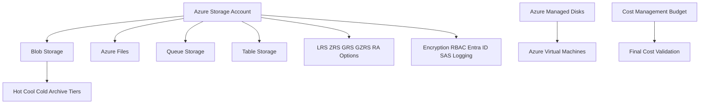

---

## Steps Performed

### Step 1: Review Azure Storage Accounts

1. Reviewed the purpose of Azure storage accounts.
2. Documented that a storage account provides a unique namespace for Azure Storage data.
3. Reviewed the relationship between storage accounts, storage services, and redundancy options.
4. Identified that storage accounts can contain blobs, files, queues, and tables.

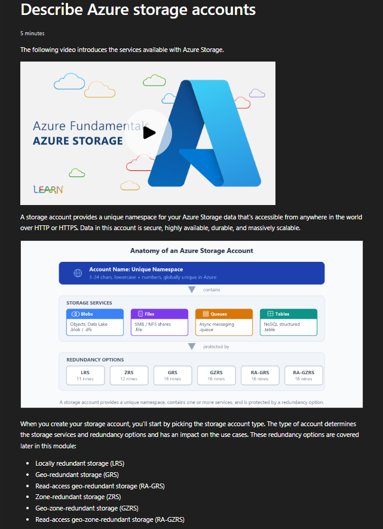

**Screenshot evidence:** Microsoft Learn explains Azure storage accounts, unique namespaces, storage services, and redundancy options.

---

### Step 2: Review Storage Account Types

1. Reviewed standard and premium storage account types.
2. Compared supported services for each account type.
3. Reviewed redundancy options available for each account type.
4. Documented that standard general-purpose v2 is recommended for most scenarios.

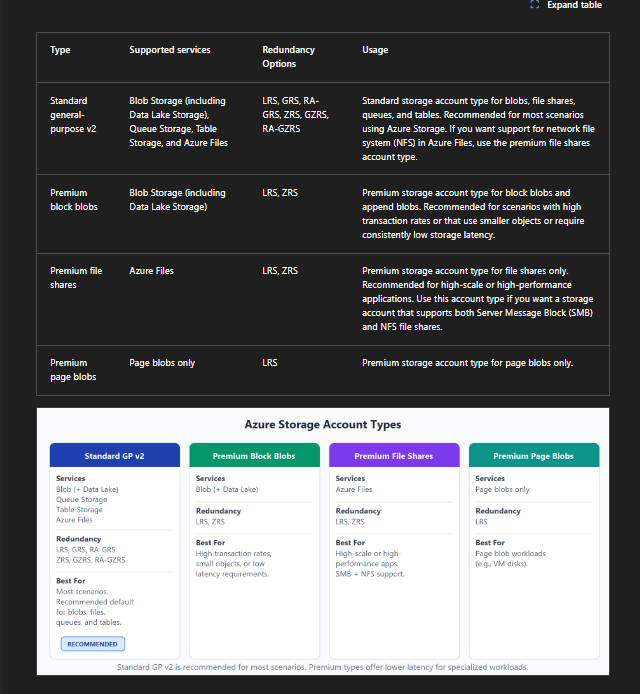

**Screenshot evidence:** Microsoft Learn shows storage account types, supported services, redundancy options, and usage scenarios.

---

### Step 3: Review Azure Storage Services

1. Reviewed the main Azure Storage data services.
2. Identified Blob Storage as object storage.
3. Identified Azure Files as managed file shares.
4. Identified Queue Storage as message storage.
5. Identified Azure Disks as block-level VM storage.
6. Identified Azure Tables as NoSQL structured storage.

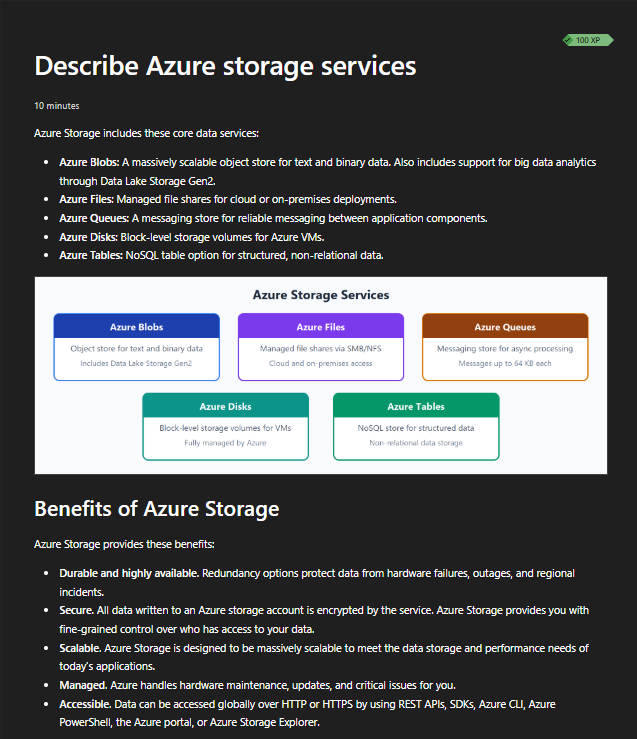

**Screenshot evidence:** Microsoft Learn shows Azure Blobs, Azure Files, Azure Queues, Azure Disks, and Azure Tables.

---

### Step 4: Review Azure Blob Storage

1. Reviewed Blob Storage as unstructured object storage.
2. Documented common Blob Storage use cases.
3. Reviewed how blob data can be accessed over HTTP or HTTPS.
4. Documented that Blob Storage supports large volumes of text or binary data.

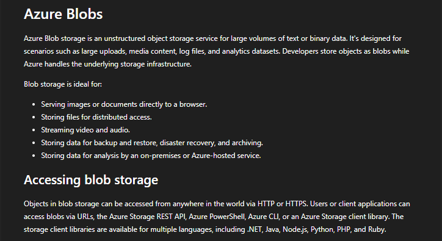

**Screenshot evidence:** Microsoft Learn explains Blob Storage use cases, including documents, images, media, backups, archives, and analytics.

---

### Step 5: Review Blob Storage Access Tiers

1. Reviewed the blob access tier model.
2. Compared hot, cool, cold, and archive tiers.
3. Documented that tiers balance storage cost against retrieval speed and access frequency.
4. Reviewed minimum retention considerations for infrequently accessed data.

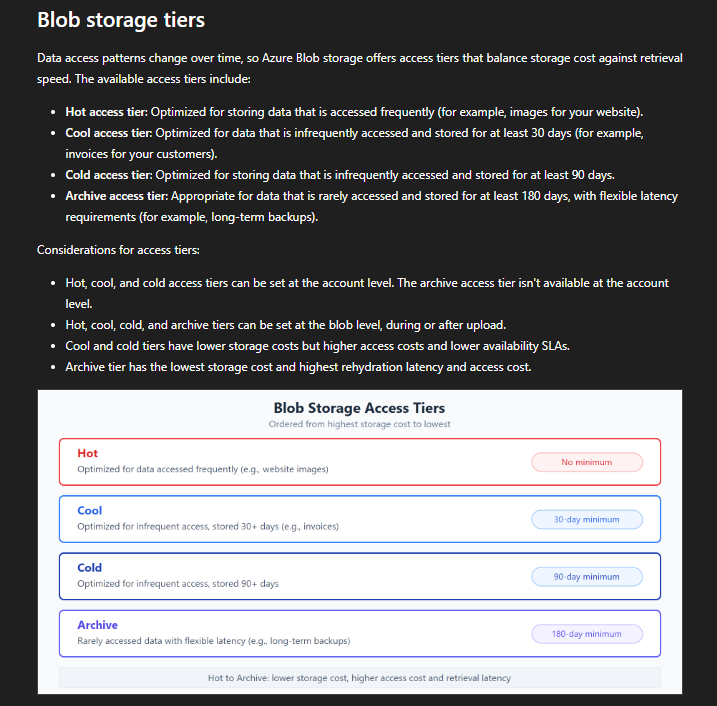

**Screenshot evidence:** Microsoft Learn compares hot, cool, cold, and archive access tiers.

---

### Step 6: Review Azure Files

1. Reviewed Azure Files as managed cloud file shares.
2. Documented SMB and NFS protocol support.
3. Documented support for Windows, Linux, and macOS clients.
4. Reviewed Azure Files benefits such as shared access, resiliency, scripting support, and managed infrastructure.

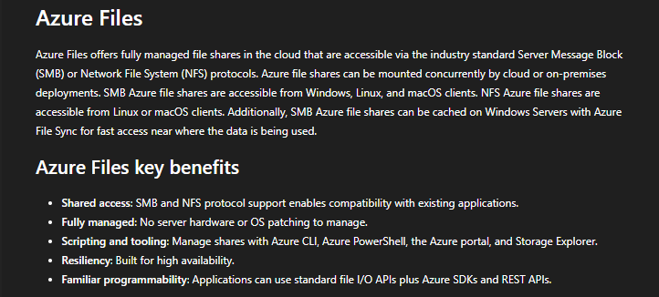

**Screenshot evidence:** Microsoft Learn explains Azure Files, SMB, NFS, shared access, resiliency, and management benefits.

---

### Step 7: Review Azure Queue Storage

1. Reviewed Azure Queue Storage as a messaging service.
2. Documented that queues support asynchronous processing.
3. Reviewed authenticated HTTP and HTTPS access.
4. Documented that Queue Storage is commonly paired with Azure Functions for background processing.

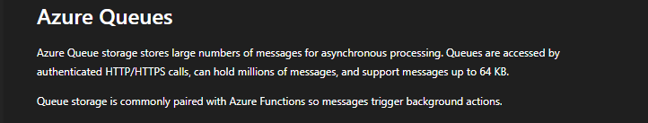

**Screenshot evidence:** Microsoft Learn explains Queue Storage, asynchronous messages, and integration with background processing.

---

### Step 8: Review Azure Table Storage

1. Reviewed Azure Table Storage as a NoSQL storage option.
2. Documented support for structured, non-relational data.
3. Reviewed access from cloud and hybrid environments.
4. Documented that access uses authenticated calls.

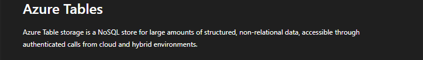

**Screenshot evidence:** Microsoft Learn explains Azure Table Storage as a NoSQL store for structured, non-relational data.

---

### Step 9: Review Azure Disks

1. Reviewed Azure Disk Storage.
2. Documented that managed disks provide block-level storage for Azure virtual machines.
3. Documented that Azure manages the underlying disk infrastructure.
4. Reviewed how managed disks simplify operations and improve resiliency.

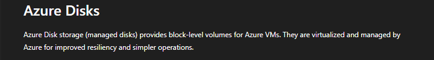

**Screenshot evidence:** Microsoft Learn explains Azure managed disks as block-level storage volumes for Azure virtual machines.

---

### Step 10: Review Storage Redundancy Overview

1. Reviewed Azure Storage redundancy concepts.
2. Documented that redundancy protects data from hardware failures, outages, and regional disasters.
3. Reviewed locally redundant storage.
4. Documented that redundancy affects durability, availability, and cost.

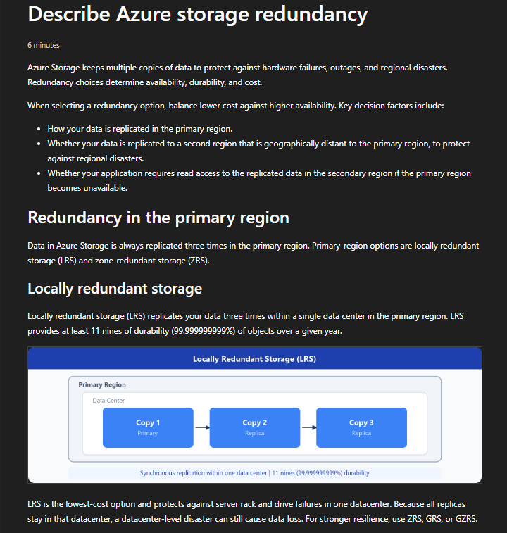

**Screenshot evidence:** Microsoft Learn explains storage redundancy and locally redundant storage.

---

### Step 11: Review Zone-Redundant Storage

1. Reviewed zone-redundant storage.
2. Documented that ZRS replicates data across availability zones in the primary region.
3. Reviewed how ZRS supports availability when one zone is unavailable.
4. Documented that ZRS can be useful when data must remain within a country or region.

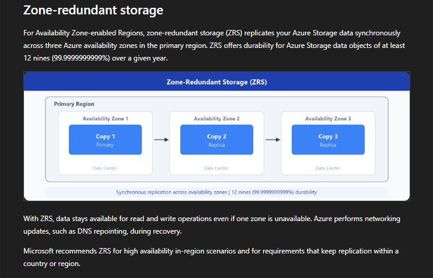

**Screenshot evidence:** Microsoft Learn explains zone-redundant storage across availability zones.

---

### Step 12: Review Secondary Region Redundancy

1. Reviewed secondary-region redundancy concepts.
2. Documented that some redundancy options replicate data to a paired secondary region.
3. Reviewed failover considerations.
4. Reviewed recovery point objective considerations.

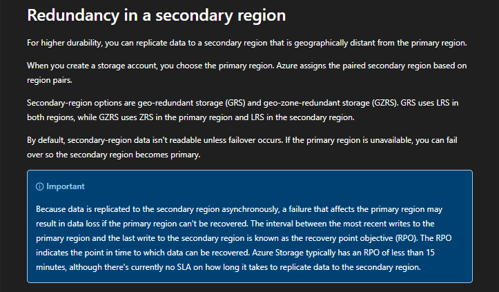

**Screenshot evidence:** Microsoft Learn explains secondary-region redundancy and recovery point objective considerations.

---

### Step 13: Review Geo-Redundant Storage Options

1. Reviewed geo-redundant storage.
2. Reviewed geo-zone-redundant storage.
3. Compared how GRS and GZRS protect data across primary and secondary regions.
4. Documented that higher redundancy options increase resilience and may affect cost.

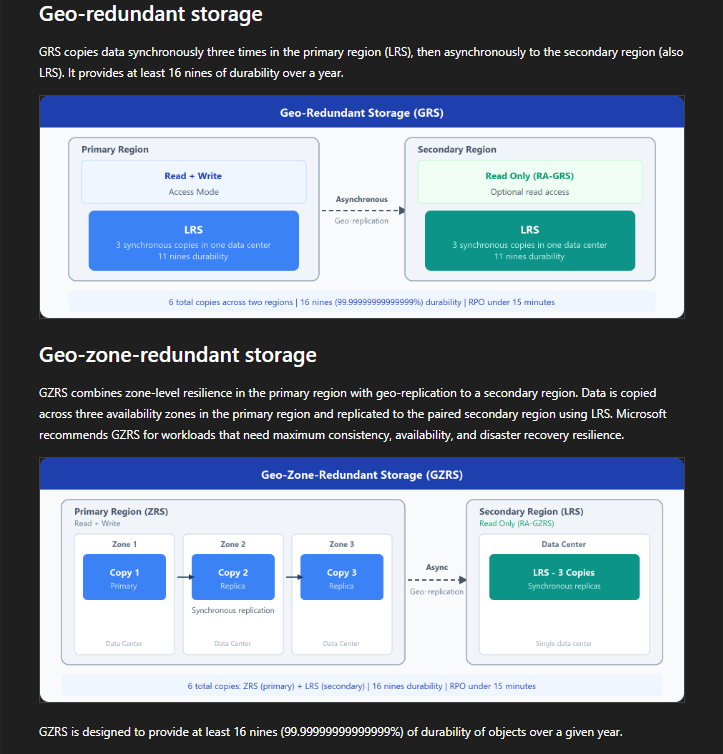

**Screenshot evidence:** Microsoft Learn shows geo-redundant storage and geo-zone-redundant storage replication models.

---

### Step 14: Review Read Access to Secondary Region

1. Reviewed read-access options for secondary-region data.
2. Documented that RA-GRS and RA-GZRS allow read access to replicated data in the secondary region.
3. Reviewed the importance of recovery point objective.
4. Documented that secondary data may not always be fully up to date.

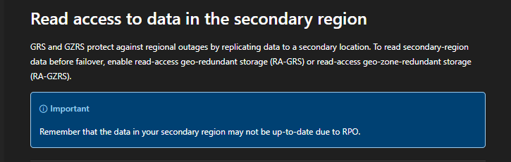

**Screenshot evidence:** Microsoft Learn explains read-access geo-redundant storage options and recovery point objective considerations.

---

### Step 15: Review Azure Storage Security Strategies

1. Reviewed storage security from a defense-in-depth perspective.
2. Reviewed encryption at rest.
3. Reviewed encryption in transit.
4. Reviewed storage authorization with Microsoft Entra ID and managed identities.
5. Reviewed RBAC for storage resources.
6. Reviewed storage analytics and logging.

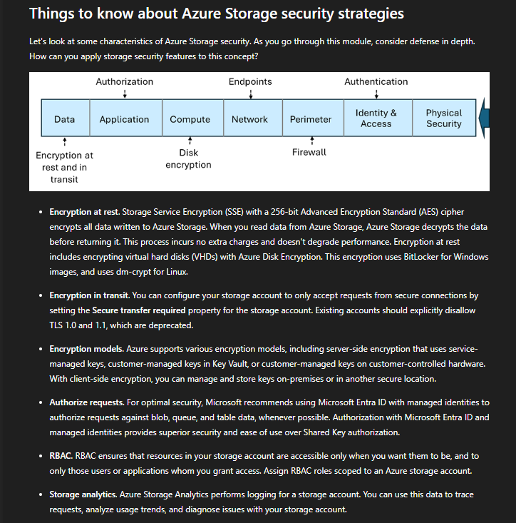

**Screenshot evidence:** Microsoft Learn explains Azure Storage security strategies, including encryption, authorization, RBAC, and analytics.

---

### Step 16: Review Shared Access Signatures

1. Reviewed shared access signatures.
2. Documented that SAS grants restricted access to Azure Storage resources.
3. Reviewed user delegation SAS.
4. Reviewed account-level SAS.
5. Reviewed service-level SAS.
6. Reviewed stored access policies.

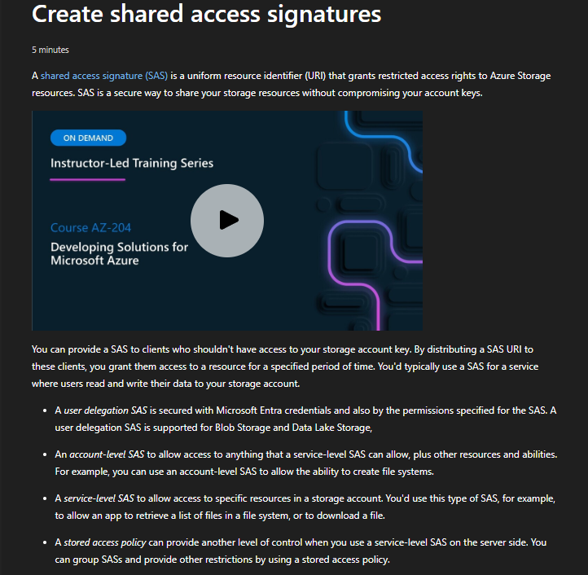

**Screenshot evidence:** Microsoft Learn explains shared access signatures and restricted delegated access to storage resources.

---

### Step 17: Validate Blob Storage in Azure Portal

1. Opened Azure Storage Center.
2. Reviewed the Blob Storage portal view.
3. Confirmed that no storage accounts existed.
4. Did not create a storage account.
5. Documented that blob containers require a storage account before they can be managed.

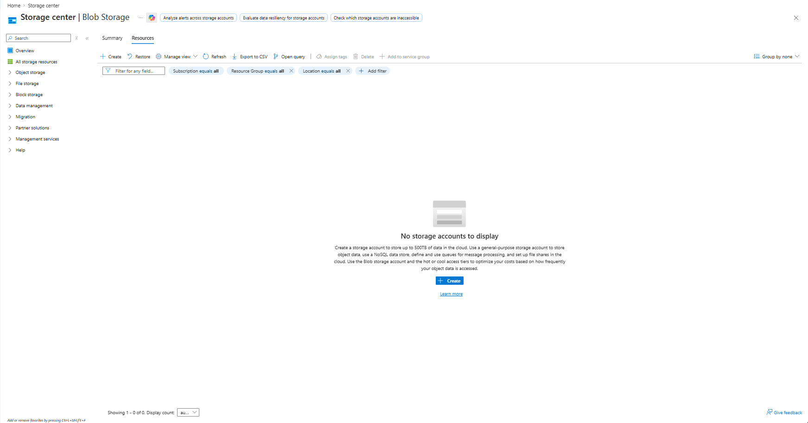

**Screenshot evidence:** The Azure portal shows the Storage Center Blob Storage view with no storage accounts deployed.

---

### Step 18: Validate File Storage in Azure Portal

1. Opened the File Storage section in Storage Center.
2. Reviewed Azure Files, File Sync, NetApp Files, and Managed Lustre options.
3. Confirmed that no storage accounts existed.
4. Did not create a storage account or file share.

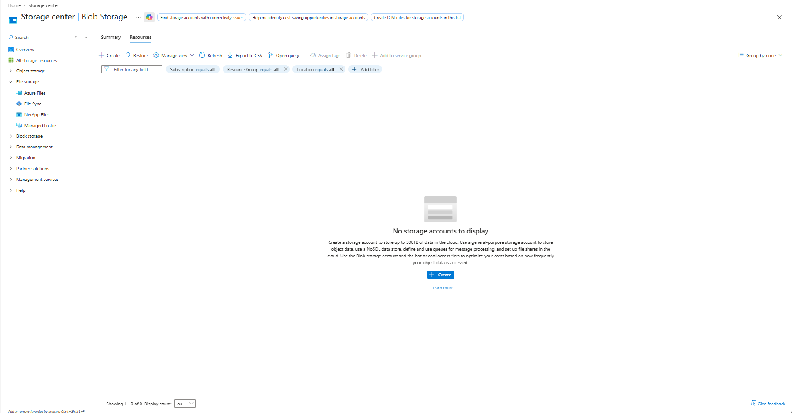

**Screenshot evidence:** The Azure portal shows file storage options without deployed storage accounts.

---

### Step 19: Validate Block Storage in Azure Portal

1. Opened the Block Storage section in Storage Center.
2. Reviewed Azure Disks and Elastic SAN options.
3. Confirmed that no storage accounts existed.
4. Did not create disks, storage accounts, or SAN resources.

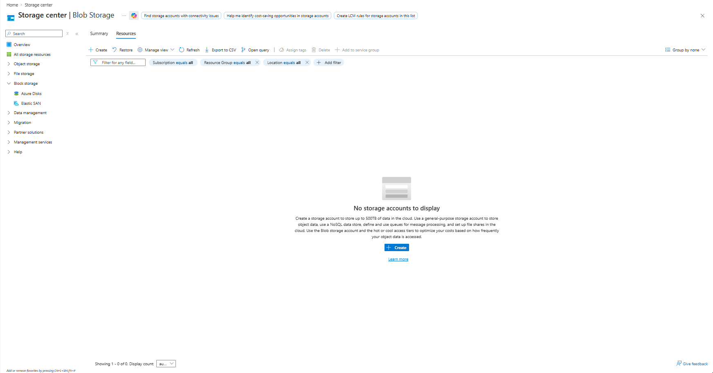

**Screenshot evidence:** The Azure portal shows block storage options without deployed storage resources.

---

### Step 20: Validate Azure Disks in Azure Portal

1. Opened the Azure Disks portal page.
2. Confirmed that no managed disks existed.
3. Confirmed that standard, premium, and ultra disk counts were zero.
4. Reviewed disk type, disk state, redundancy, and regional distribution views.
5. Did not create any disk resources.

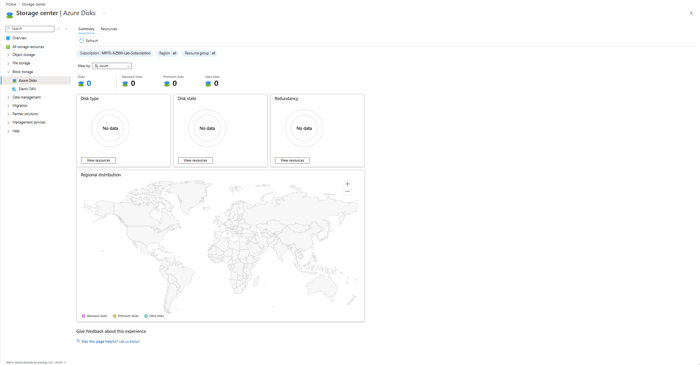

**Screenshot evidence:** The Azure portal shows zero Azure disks deployed.

---

### Step 21: Perform Final Cost Validation

1. Opened Azure Cost Management.
2. Opened the subscription budget view.
3. Confirmed that the monthly budget remained active.
4. Confirmed that evaluated spend remained `$0.00`.
5. Confirmed that progress remained `0.00%`.
6. Confirmed that no billable storage resources were created.

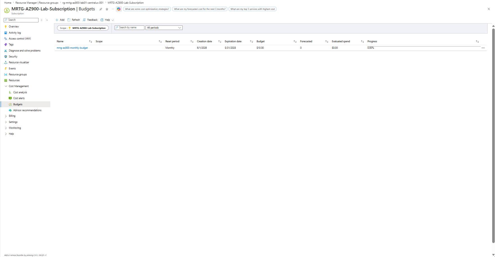

**Screenshot evidence:** The final Cost Management screenshot shows the budget is active, evaluated spend is `$0.00`, and progress is `0.00%`.

---

## Storage Service Summary

| Service | Primary Use | Example Scenario |
|---|---|---|
| Storage Account | Namespace and management boundary | Central location for Azure Storage services |
| Blob Storage | Object storage | Images, documents, backups, logs, media, archives |
| Azure Files | Managed file shares | Shared files for cloud or hybrid workloads |
| Queue Storage | Message storage | Asynchronous messages between application components |
| Table Storage | NoSQL structured data | Simple key-value or structured non-relational data |
| Managed Disks | VM block storage | Operating system and data disks for Azure VMs |
| Access Tiers | Cost optimization | Hot, cool, cold, and archive data |
| Redundancy | Data durability and availability | LRS, ZRS, GRS, GZRS, RA-GRS, RA-GZRS |
| SAS | Delegated access | Time-limited access to storage resources |

---

## Storage Mental Model

```text
Storage Account
The management boundary and namespace for Azure Storage data.

Blob Storage
Object storage for unstructured data.

Azure Files
Managed cloud file shares using SMB or NFS.

Queue Storage
Message storage for asynchronous application processing.

Table Storage
NoSQL storage for structured, non-relational data.

Managed Disks
Block-level storage for Azure virtual machines.

Redundancy
How Azure copies data for durability and availability.

Access Tiers
How Azure balances storage cost and access frequency.

SAS
A way to grant limited, delegated access to storage resources.
```

---

## Redundancy Options Reviewed

| Redundancy Option | Description |
|---|---|
| LRS | Replicates data within a single datacenter in the primary region |
| ZRS | Replicates data across availability zones in the primary region |
| GRS | Replicates data to a secondary region |
| GZRS | Combines zone redundancy in the primary region with geo-replication to a secondary region |
| RA-GRS | Provides read access to geo-replicated secondary-region data |
| RA-GZRS | Provides read access to geo-zone-replicated secondary-region data |

---

## Access Tier Summary

| Access Tier | Best For | Cost Pattern |
|---|---|---|
| Hot | Frequently accessed data | Higher storage cost, lower access cost |
| Cool | Infrequently accessed data stored for at least 30 days | Lower storage cost, higher access cost |
| Cold | Infrequently accessed data stored for at least 90 days | Lower storage cost, higher access cost |
| Archive | Rarely accessed long-term data | Lowest storage cost, highest retrieval latency and access cost |

---

## Validation

| Validation Check | Expected Result | Actual Result | Status |
|---|---|---|---|
| Azure storage accounts reviewed | Storage account concepts understood | Storage accounts and account types reviewed | Passed |
| Azure Storage services reviewed | Main storage services identified | Blobs, Files, Queues, Tables, and Disks reviewed | Passed |
| Blob Storage reviewed | Blob use cases understood | Object storage and access tiers reviewed | Passed |
| Azure Files reviewed | File share use cases understood | SMB, NFS, and managed file shares reviewed | Passed |
| Queue Storage reviewed | Queue use cases understood | Asynchronous message storage reviewed | Passed |
| Table Storage reviewed | Table use cases understood | NoSQL structured storage reviewed | Passed |
| Azure Disks reviewed | Disk use cases understood | Managed disks and block storage reviewed | Passed |
| Redundancy reviewed | Redundancy options understood | LRS, ZRS, GRS, GZRS, and read-access options reviewed | Passed |
| Storage security reviewed | Security strategies understood | Encryption, RBAC, Entra ID, SAS, and analytics reviewed | Passed |
| Storage Center reviewed | Portal page accessible | Storage Center opened and reviewed | Passed |
| Azure Disks portal reviewed | Portal page accessible | Zero disks displayed | Passed |
| Cost validation completed | No unexpected spend | Budget showed `$0.00` evaluated spend and `0.00%` progress | Passed |

---

## Completion Checklist

- [x] Reviewed Azure storage accounts
- [x] Reviewed storage account types
- [x] Reviewed Azure Storage services
- [x] Reviewed Azure Blob Storage
- [x] Reviewed Blob Storage access tiers
- [x] Reviewed Azure Files
- [x] Reviewed Azure Queue Storage
- [x] Reviewed Azure Table Storage
- [x] Reviewed Azure managed disks
- [x] Reviewed storage redundancy
- [x] Reviewed zone-redundant storage
- [x] Reviewed secondary-region redundancy
- [x] Reviewed geo-redundant storage options
- [x] Reviewed read-access redundancy options
- [x] Reviewed Azure Storage security strategies
- [x] Reviewed shared access signatures
- [x] Validated Storage Center Blob Storage view
- [x] Validated Storage Center File Storage view
- [x] Validated Storage Center Block Storage view
- [x] Validated Azure Disks portal view
- [x] Did not create storage resources
- [x] Validated evaluated spend remained `$0.00`
- [x] Sanitized screenshots before upload

---

## AZ-900 Exam Objective Coverage

### Primary Exam Domain

```text
Describe Azure architecture and services
```

### Supporting Exam Domain

```text
Describe Azure management and governance
```

### Skills Measured

This lab supports the ability to:

- Describe Azure storage accounts
- Describe Azure Blob Storage
- Describe Azure Files
- Describe Azure Queue Storage
- Describe Azure Table Storage
- Describe Azure managed disks
- Describe storage redundancy options
- Describe storage access tiers
- Describe Azure Storage security concepts
- Describe shared access signatures
- Describe storage-related cost considerations
- Describe how Azure Cost Management validates spend

---

## Mini Objective Coverage

By completing this lab, I can now:

- Explain the purpose of an Azure storage account
- Identify the main Azure Storage services
- Explain when Blob Storage is appropriate
- Explain when Azure Files is appropriate
- Explain when Queue Storage is appropriate
- Explain when Table Storage is appropriate
- Explain when managed disks are used
- Compare storage redundancy options
- Compare blob access tiers
- Explain basic Azure Storage security controls
- Explain what shared access signatures provide
- Validate storage service locations in the Azure portal
- Confirm cost impact after storage service review

---

## IAM / Security Relevance

Azure Storage is closely connected to identity and access management because storage often contains sensitive data.

In a regulated environment, storage access must be controlled, monitored, and limited by role.

Important security and IAM connections:

- Microsoft Entra ID can be used for storage authorization.
- Managed identities can reduce reliance on shared keys.
- RBAC controls who can manage or access storage resources.
- SAS tokens provide delegated access but must be scoped carefully.
- Encryption at rest protects stored data.
- Encryption in transit protects data moving over the network.
- Storage analytics and logging support auditing.
- Public access should be intentionally controlled.
- Storage access should follow least privilege.

For government, healthcare, finance, and defense contractor environments, storage decisions affect:

- Data confidentiality
- Auditability
- Access control
- Retention
- Incident response
- Compliance posture
- Cost governance

### Security Takeaway

Storage security is not just encryption.

It also includes identity, access control, network boundaries, logging, key management, and data lifecycle decisions.

---

## Governance Notes

Important governance considerations from this lab:

- Storage accounts should follow naming standards.
- Storage accounts should use appropriate redundancy settings.
- Public access should be disabled unless explicitly required.
- RBAC should be preferred over shared keys when possible.
- SAS tokens should be short-lived and narrowly scoped.
- Storage accounts should use secure transfer.
- Sensitive screenshots should not expose tenant names, subscription IDs, object IDs, or user emails.
- Storage resources should be tagged for ownership, environment, and cost tracking.
- Lifecycle management should be considered for cost control.
- High-cost storage options should require review before deployment.
- Managed disks should not be created without workload justification.

### Governance Lesson

Storage should be designed around data sensitivity, access requirements, recovery needs, and cost expectations before deployment.

---

## Cost Considerations

### Estimated Lab Cost

```text
Estimated cost: $0.00
```

No storage resources were created in this lab.

Cost-sensitive areas reviewed included:

- Storage accounts
- Blob data
- Blob access tiers
- Archive retrieval
- Geo-redundant replication
- Read-access geo-redundant replication
- Managed disks
- Premium storage
- Large file shares
- Transaction volume
- Data transfer and retrieval patterns

The final budget validation confirmed:

```text
Budget amount: $10.00
Forecasted cost: 0
Evaluated spend: $0.00
Progress: 0.00%
```

This confirmed that the lab remained cost-safe.

### Cost Reminder

Azure Storage can appear inexpensive at first, but cost can increase through:

- Large data volumes
- Frequent transactions
- Premium performance tiers
- Geo-redundant replication
- Archive retrieval
- Snapshots
- Managed disks
- Unused storage resources

Storage costs should be reviewed before deployment and monitored after deployment.

---

## Troubleshooting Notes

### Issue 1: Avoiding Accidental Storage Costs

**Symptom:**

Several Azure storage pages include **Create** buttons.

**Risk:**

Creating a storage account, disk, file share, or premium storage resource can introduce cost.

**Resolution:**

Each service was opened for review only. No resources were created.

**Result:**

The lab was completed without creating billable storage resources.

---

### Issue 2: Storage-Dependent Services Require a Storage Account

**Symptom:**

Blob containers, file shares, queues, and tables cannot be fully managed without a storage account.

**Explanation:**

These services exist inside a storage account. Without a storage account, the portal shows storage service categories but no deployed resources.

**Resolution:**

The lab documented the service locations without creating a storage account.

**Result:**

Storage services were reviewed while maintaining `$0.00` evaluated spend.

---

### Issue 3: Redundancy Options Can Be Confusing

**Symptom:**

Storage redundancy includes several similar names, such as LRS, ZRS, GRS, GZRS, RA-GRS, and RA-GZRS.

**Explanation:**

The redundancy option determines where Azure stores copies of data and whether secondary-region reads are available.

**Resolution:**

Each redundancy model was reviewed and documented separately.

**Result:**

The lab clarified how redundancy affects durability, availability, recovery, and cost.

---

## What I Would Do Differently in Production

In a production Azure environment, I would not create storage resources without a storage design.

I would define the storage design before deployment, including:

- Data classification
- Storage account naming standards
- Region selection
- Redundancy requirements
- Access tier strategy
- Public access policy
- RBAC role assignments
- Managed identity usage
- SAS token policy
- Key management requirements
- Network access restrictions
- Private endpoint requirements
- Logging and monitoring requirements
- Lifecycle management rules
- Backup and recovery requirements
- Cost alerting and ownership tags

For regulated environments, I would also document data retention, encryption requirements, access reviews, audit logging, and incident response procedures before production use.

---

## Lessons Learned

This lab reinforced that Azure Storage is more than a place to put files.

Key lessons:

- Storage accounts provide the namespace and management boundary for Azure Storage data.
- Blob Storage is used for unstructured object data.
- Azure Files provides managed SMB and NFS file shares.
- Queue Storage supports asynchronous messaging.
- Table Storage provides NoSQL structured storage.
- Azure managed disks provide block-level storage for virtual machines.
- Redundancy affects durability, availability, recovery, and cost.
- Access tiers help balance cost and access frequency.
- Storage security includes encryption, RBAC, Entra ID, SAS, and logging.
- Shared access signatures are useful but must be carefully scoped.
- Storage resources can create cost if deployed carelessly.
- Cost validation should be part of every Azure lab.

### Technical Takeaway

Azure Storage services are selected based on data type, access pattern, availability requirement, and security requirement.

### Business Takeaway

Good storage design reduces cost, protects data, and supports operational reliability.

### Security Takeaway

Storage access must be controlled with least privilege, monitored with logs, and protected through encryption and identity-based authorization.

### Exam Takeaway

For AZ-900, remember:

- Blob Storage is for object data.
- Azure Files is for managed file shares.
- Queue Storage is for messages.
- Table Storage is for NoSQL structured data.
- Managed disks are for Azure VMs.
- Redundancy protects data availability and durability.
- Access tiers help control cost.
- SAS provides delegated access.
- RBAC and Microsoft Entra ID help secure storage access.

---

## Cleanup

No cleanup was required because no storage resources were created.

### Resources Retained

| Resource or Configuration | Reason |
|---|---|
| Azure subscription | Required for future labs |
| Monthly budget | Required for ongoing cost visibility |
| Existing Lab 01 resource group | Retained as the foundational lab resource group |
| Cost Management configuration | Required for continued budget validation |

### Resources Removed

No Azure storage resources were created during this lab.

### Cleanup Validation

- [x] No storage accounts were created
- [x] No blob containers were created
- [x] No blobs were uploaded
- [x] No file shares were created
- [x] No queues were created
- [x] No tables were created
- [x] No managed disks were created
- [x] No snapshots were created
- [x] No lifecycle management policies were created
- [x] No redundancy settings were changed
- [x] No SAS tokens were created
- [x] Evaluated spend remained `$0.00`
- [x] Budget progress remained `0.00%`

---

## Outcome

Lab 07 successfully established a foundational understanding of Azure Storage services while maintaining a cost-safe lab environment.

The lab demonstrated how to identify and validate core storage services in Azure without deploying billable resources.

The completed lab demonstrates:

- Understanding of Azure storage accounts
- Understanding of storage account types
- Understanding of Blob Storage
- Understanding of Azure Files
- Understanding of Queue Storage
- Understanding of Table Storage
- Understanding of Azure managed disks
- Understanding of storage redundancy options
- Understanding of blob access tiers
- Understanding of Azure Storage security strategies
- Understanding of shared access signatures
- Awareness of storage cost risks
- Awareness of storage security responsibilities
- Final evaluated spend of `$0.00`

---

## Screenshot Inventory

| Screenshot | Description |
|---|---|
| `01-azure-storage-accounts-overview.png` | Azure storage account overview |
| `02-storage-account-types-overview.png` | Azure storage account types |
| `03-azure-storage-services-overview.png` | Azure Storage services overview |
| `04-blob-storage-overview.png` | Azure Blob Storage overview |
| `05-blob-storage-access-tiers.png` | Blob Storage access tiers |
| `06-azure-files-overview.png` | Azure Files overview |
| `07-queue-storage-overview.png` | Azure Queue Storage overview |
| `08-table-storage-overview.png` | Azure Table Storage overview |
| `09-azure-disks-overview.png` | Azure Disks overview |
| `10-storage-redundancy-overview.png` | Storage redundancy overview |
| `11-zone-redundant-storage.png` | Zone-redundant storage |
| `12-secondary-region-redundancy.png` | Secondary-region redundancy |
| `13-geo-redundant-storage-options.png` | Geo-redundant and geo-zone-redundant storage |
| `14-read-access-secondary-region.png` | Read access to secondary-region data |
| `15-storage-security-overview.png` | Azure Storage security strategies |
| `16-shared-access-signatures-overview.png` | Shared access signatures |
| `17-storage-center-blob-storage-portal.png` | Storage Center Blob Storage portal view |
| `18-storage-center-file-storage-portal.png` | Storage Center File Storage portal view |
| `19-storage-center-block-storage-portal.png` | Storage Center Block Storage portal view |
| `20-azure-disks-portal.png` | Azure Disks portal view |
| `21-cost-management-final-validation.png` | Final Cost Management validation |

---

## Next Lab

The next lab is:

```text
Lab 08 - Microsoft Entra ID, RBAC, and Zero Trust
```

The next lab will build on this storage foundation by reviewing:

- Microsoft Entra ID
- Authentication
- Authorization
- Role-Based Access Control
- Built-in roles
- Scope
- Least privilege
- Zero Trust
- Conditional Access concepts
- Identity and access security in Azure
