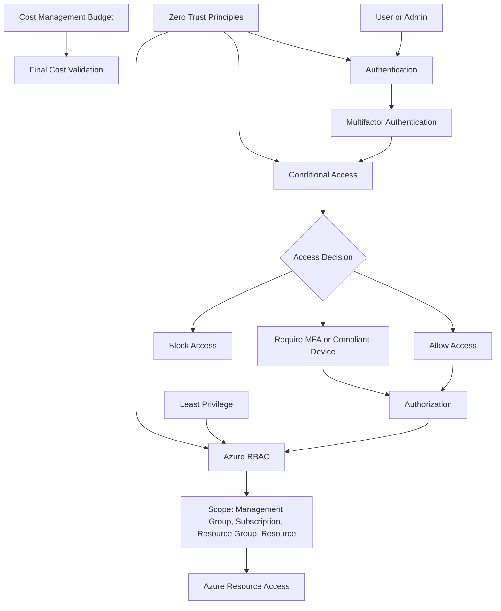

# Lab 08 - Microsoft Entra ID, RBAC, and Zero Trust

## Objective

The objective of this lab was to understand Microsoft Entra ID, authentication, authorization, Azure role-based access control, least privilege, and Zero Trust concepts covered by AZ-900.

This lab was completed as a discovery-only lab. No users, groups, role assignments, Conditional Access policies, app registrations, or tenant settings were created or changed.

By completing this lab, I:

- Reviewed Microsoft Entra ID
- Reviewed authentication concepts
- Reviewed authorization concepts
- Reviewed multifactor authentication
- Reviewed Conditional Access
- Reviewed the Zero Trust model
- Reviewed Azure role-based access control
- Reviewed RBAC scope and inheritance
- Reviewed least privilege access
- Reviewed Microsoft Entra ID portal areas
- Reviewed users, groups, roles, and administrators
- Reviewed subscription Access control (IAM)
- Reviewed role assignments
- Reviewed my access at the subscription scope
- Confirmed that no billable identity or access resources were created
- Confirmed that evaluated spend remained `$0.00`

---

## Business Problem Solved

Identity is one of the most important security boundaries in Azure.

Before deploying workloads, organizations need to understand how users authenticate, how access is authorized, how roles are assigned, and how least privilege and Zero Trust reduce risk.

Monroe Redstone Technology Group needed to understand the identity and access foundation before building more advanced Azure environments.

This lab helped answer:

- What is Microsoft Entra ID?
- What is authentication?
- What is authorization?
- How does multifactor authentication improve security?
- What does Conditional Access do?
- What are the core principles of Zero Trust?
- How does Azure RBAC control access to resources?
- What is role scope?
- How does inheritance work in Azure RBAC?
- Why does least privilege matter?
- Where are users, groups, and administrator roles reviewed?
- How is access reviewed at the subscription level?
- How can access be validated without changing the environment?

This lab solved the problem of understanding Azure identity and access control before making tenant or subscription changes.

---

## Scenario

MRTG is preparing to manage Azure resources in a more secure and controlled way.

Before assigning roles, creating users, inviting guests, or configuring policies, the cloud operations team needs to understand how Microsoft Entra ID and Azure RBAC work together.

The team reviewed identity concepts and explored Azure portal identity and access areas to identify:

- Authentication controls
- Authorization models
- Multifactor authentication methods
- Conditional Access concepts
- Zero Trust principles
- Built-in administrative roles
- Azure RBAC scope
- Role assignments
- Least privilege access
- Subscription-level access review
- Cost-safe validation

No identity or access configuration changes were made in this lab.

---

## Azure Services and Resources Used

| Service or Feature | Purpose |
|---|---|
| Microsoft Entra ID | Cloud identity and access management service |
| Authentication | Verifies identity before access is granted |
| Authorization | Determines what an identity can access |
| Multifactor Authentication | Adds extra verification beyond a password |
| Conditional Access | Uses identity signals to allow, deny, or challenge access |
| Zero Trust | Security model based on verify explicitly, least privilege, and assume breach |
| Azure RBAC | Controls access to Azure resources through role assignments |
| Azure Roles | Built-in permissions assigned to users, groups, or service principals |
| RBAC Scope | Defines where a role assignment applies |
| Microsoft Entra Users | Shows user identities in the tenant |
| Microsoft Entra Groups | Shows group-based identity management options |
| Roles and Administrators | Shows built-in Microsoft Entra administrative roles |
| Access Control (IAM) | Shows Azure resource access management |
| Cost Management | Confirms budget status and validates no unexpected spend |

---

## Why These Services Were Used

These services were reviewed because they represent the identity and access control foundation for Azure.

| Security Requirement | Azure Capability |
|---|---|
| Manage cloud identities | Microsoft Entra ID |
| Verify users and devices | Authentication |
| Control access to resources | Authorization |
| Reduce password-only risk | Multifactor Authentication |
| Make access decisions based on signals | Conditional Access |
| Reduce implicit trust | Zero Trust |
| Assign Azure resource permissions | Azure RBAC |
| Limit access to only what is needed | Least privilege |
| Review administrative privileges | Roles and administrators |
| Validate subscription access | Access control (IAM) |
| Prevent accidental cost | Cost Management Budgets |

---

## Environment

| Component | Value |
|---|---|
| Organization | Monroe Redstone Technology Group |
| Project | MRTG Azure Fundamentals: The Bridge |
| Lab | Lab 08 |
| Subscription | `MRTG-AZ900-Lab-Subscription` |
| Azure region focus | `Central US` |
| Resource deployment model | Read-only portal exploration |
| Cost control | `$10.00` monthly budget |
| Billable identity resources created | None |
| Tenant settings changed | None |
| Role assignments created | None |
| Estimated lab cost | `$0.00` |
| Documentation platform | GitHub |

---

## Architecture / Concept Diagram



---

## Steps Performed

### Step 1: Review Microsoft Entra ID

1. Reviewed who uses Microsoft Entra ID.
2. Reviewed Microsoft Entra ID capabilities for IT administrators, app developers, users, and online service subscribers.
3. Documented Microsoft Entra ID services such as authentication, single sign-on, application management, and device management.
4. Reviewed the Microsoft Entra ID ecosystem diagram.


**Screenshot evidence:** Microsoft Learn explains Microsoft Entra ID users, capabilities, authentication, single sign-on, application management, and device management.

---

### Step 2: Review Authentication

1. Reviewed authentication as the process of validating identity.
2. Documented that authentication verifies users, apps, or devices.
3. Reviewed identity providers, sources, protocols, and assurance.
4. Connected authentication to secure sign-in decisions.


**Screenshot evidence:** Microsoft Learn explains authentication as identity validation before access is granted.

---

### Step 3: Review Authorization

1. Reviewed authorization as the process of determining access.
2. Compared authentication and authorization.
3. Reviewed common authorization approaches.
4. Documented ACL, RBAC, ABAC, and PBAC.
5. Identified RBAC as a common authorization model in Azure.


**Screenshot evidence:** Microsoft Learn explains authorization and access control approaches, including RBAC.

---

### Step 4: Review Multifactor Authentication

1. Reviewed multifactor authentication.
2. Documented that MFA requires two or more verification factors.
3. Reviewed Microsoft Authenticator push notifications.
4. Reviewed Microsoft Authenticator TOTP codes.
5. Reviewed OATH hardware tokens.
6. Reviewed SMS and voice verification as lower-security legacy methods.
7. Reviewed passwordless methods such as FIDO2 security keys and passkeys.


**Screenshot evidence:** Microsoft Learn shows MFA methods and compares security levels.

---

### Step 5: Review Conditional Access

1. Reviewed Conditional Access as a Microsoft Entra ID feature.
2. Documented that Conditional Access uses identity signals.
3. Reviewed signals such as user, location, device, application, and sign-in risk.
4. Reviewed possible decisions such as allow access, require MFA, or block access.
5. Reviewed enforcement controls such as compliant device requirements and session controls.


**Screenshot evidence:** Microsoft Learn explains Conditional Access signal evaluation, access decisions, and enforcement.

---

### Step 6: Review Zero Trust

1. Reviewed the Zero Trust model.
2. Documented that Zero Trust assumes breach.
3. Reviewed the principle of verify explicitly.
4. Reviewed the principle of least privilege access.
5. Reviewed the principle of assume breach.
6. Connected Zero Trust to identity, device, application, and data protection.


**Screenshot evidence:** Microsoft Learn explains Zero Trust guiding principles.

---

### Step 7: Review Azure RBAC

1. Reviewed Azure role-based access control.
2. Documented that Azure RBAC controls access to cloud resources.
3. Reviewed built-in roles.
4. Reviewed custom roles.
5. Reviewed role scope and inheritance.
6. Reviewed management group, subscription, resource group, and resource scopes.
7. Reviewed Owner, Contributor, and Reader role concepts.


**Screenshot evidence:** Microsoft Learn explains Azure RBAC, scope hierarchy, inheritance, and example roles.

---

### Step 8: Review Least Privilege Access

1. Reviewed least privilege access with Microsoft Entra ID Governance.
2. Documented that least privilege grants only the access required to perform duties.
3. Reviewed RBAC as a least privilege control.
4. Reviewed Just-In-Time privilege.
5. Reviewed Privileged Identity Management.
6. Reviewed access reviews.
7. Reviewed default deny.


**Screenshot evidence:** Microsoft Learn explains least privilege, RBAC, Just-In-Time privilege, access reviews, and default deny.

---

### Step 9: Validate Microsoft Entra ID Portal Overview

1. Opened Microsoft Entra ID in the Azure portal.
2. Reviewed the Entra ID overview page.
3. Identified users, groups, applications, and devices summary areas.
4. Reviewed Microsoft Entra ID Free licensing.
5. Reviewed feature areas such as Identity Protection, Access Reviews, Authentication Methods, and Tenant Restrictions.
6. Redacted tenant and directory identifiers before saving the screenshot.


**Screenshot evidence:** The Azure portal shows the Microsoft Entra ID overview page with sensitive tenant details redacted.

---

### Step 10: Validate Microsoft Entra Users

1. Opened Microsoft Entra ID users.
2. Reviewed the All users page.
3. Confirmed that one user account existed in the tenant.
4. Reviewed user-related columns such as display name, user principal name, user type, identity source, and sync status.
5. Did not create, edit, or delete any users.
6. Redacted user-identifying information before saving the screenshot.


**Screenshot evidence:** The Azure portal shows the Microsoft Entra users page with sensitive user details redacted.

---

### Step 11: Validate Microsoft Entra Groups

1. Opened Microsoft Entra ID groups.
2. Reviewed the All groups page.
3. Confirmed that no groups existed in the tenant.
4. Reviewed group columns such as name, object ID, group type, membership type, email, and source.
5. Did not create any groups.


**Screenshot evidence:** The Azure portal shows the Microsoft Entra groups page with no groups present.

---

### Step 12: Validate Roles and Administrators

1. Opened Roles and administrators in Microsoft Entra ID.
2. Reviewed built-in administrative roles.
3. Reviewed privileged role indicators.
4. Reviewed role descriptions.
5. Reviewed assigned role counts.
6. Did not create custom roles.
7. Did not assign or activate any roles.


**Screenshot evidence:** The Azure portal shows Microsoft Entra administrative roles and role metadata without exposing tenant or user details.

---

### Step 13: Validate Subscription Access Control IAM

1. Opened the Azure subscription.
2. Opened Access control (IAM).
3. Reviewed the Check access view.
4. Identified My access.
5. Identified Check access.
6. Reviewed options for role assignments, deny assignments, and custom roles.
7. Did not create or assign any roles.


**Screenshot evidence:** The Azure portal shows subscription-level Access control (IAM) options.

---

### Step 14: Validate Subscription Role Assignments

1. Opened the Role assignments tab.
2. Reviewed the number of role assignments at the subscription scope.
3. Reviewed privileged access indicators.
4. Reviewed the Owner role assignment.
5. Reviewed the scope as this resource.
6. Did not add, delete, or modify role assignments.


**Screenshot evidence:** The Azure portal shows subscription role assignments with sensitive identity details redacted.

---

### Step 15: Validate View My Access

1. Opened View my access.
2. Reviewed current role assignments.
3. Reviewed the Owner role.
4. Reviewed the role description.
5. Reviewed the scope as this resource.
6. Reviewed eligible assignments.
7. Reviewed deny assignments.
8. Redacted user-identifying information before saving the screenshot.


**Screenshot evidence:** The Azure portal shows the current access view with sensitive identity details redacted.

---

### Step 16: Perform Final Cost Validation

1. Opened Azure Cost Management.
2. Opened the subscription budget view.
3. Confirmed that the monthly budget remained active.
4. Confirmed that evaluated spend remained `$0.00`.
5. Confirmed that progress remained `0.00%`.
6. Confirmed that no billable identity or access resources were created.


**Screenshot evidence:** The final Cost Management screenshot shows the budget is active, evaluated spend is `$0.00`, and progress is `0.00%`.

---

## Identity and Access Summary

| Concept | Purpose |
|---|---|
| Microsoft Entra ID | Cloud identity and access management |
| Authentication | Proves who or what is signing in |
| Authorization | Determines what access is allowed |
| MFA | Adds additional verification beyond a password |
| Conditional Access | Uses identity signals to make access decisions |
| Zero Trust | Assumes breach and verifies access continuously |
| RBAC | Assigns permissions through roles |
| Scope | Defines where a role assignment applies |
| Least privilege | Grants only required access |
| PIM | Supports time-bound privileged access |
| Access Reviews | Validate whether access is still needed |

---

## Identity Mental Model

```text
Authentication
Proves who you are.

Authorization
Determines what you can access.

Microsoft Entra ID
The cloud identity provider for Azure and Microsoft cloud services.

MFA
Adds another verification factor beyond password.

Conditional Access
Uses signals to make access decisions.

RBAC
Controls access to Azure resources.

Scope
Defines where a role assignment applies.

Least privilege
Give only the access required.

Zero Trust
Never trust automatically, always verify.
```

---

## Authentication vs Authorization

| Concept | Question Answered | Example |
|---|---|---|
| Authentication | Who are you? | Signing in with username, password, and MFA |
| Authorization | What can you access? | Having Reader access to a subscription |
| RBAC | What role do you have? | Owner, Contributor, Reader |
| Scope | Where does the role apply? | Subscription, resource group, or resource |

---

## Zero Trust Principles

| Principle | Meaning |
|---|---|
| Verify explicitly | Always authenticate and authorize using available signals |
| Use least privilege access | Grant only the access required |
| Assume breach | Design security as though compromise is possible |

---

## RBAC Scope Summary

| Scope | Description |
|---|---|
| Management group | Organizes multiple subscriptions |
| Subscription | Billing and access boundary |
| Resource group | Logical container for resources |
| Resource | Individual Azure service or object |

Permissions assigned at a parent scope can be inherited by child scopes.

---

## Validation

| Validation Check | Expected Result | Actual Result | Status |
|---|---|---|---|
| Microsoft Entra ID reviewed | Identity service concepts understood | Entra ID capabilities reviewed | Passed |
| Authentication reviewed | Authentication concepts understood | Identity validation reviewed | Passed |
| Authorization reviewed | Authorization concepts understood | Access control models reviewed | Passed |
| MFA reviewed | MFA methods understood | Authenticator, TOTP, hardware token, SMS, and voice reviewed | Passed |
| Conditional Access reviewed | Signal-based access decisions understood | Conditional Access signals and enforcement reviewed | Passed |
| Zero Trust reviewed | Zero Trust principles understood | Verify explicitly, least privilege, and assume breach reviewed | Passed |
| Azure RBAC reviewed | RBAC concepts understood | Roles, scope, and inheritance reviewed | Passed |
| Least privilege reviewed | Access minimization understood | JIT, PIM, access reviews, and default deny reviewed | Passed |
| Entra portal reviewed | Portal identity areas identified | Overview, users, groups, roles, and administrators reviewed | Passed |
| Subscription IAM reviewed | Resource access controls identified | Access control IAM reviewed | Passed |
| Role assignments reviewed | Subscription access reviewed | Owner role assignment observed | Passed |
| View my access reviewed | Current access reviewed | Role, scope, eligible assignments, and deny assignments reviewed | Passed |
| Cost validation completed | No unexpected spend | Budget showed `$0.00` evaluated spend and `0.00%` progress | Passed |

---

## Completion Checklist

- [x] Reviewed Microsoft Entra ID
- [x] Reviewed authentication
- [x] Reviewed authorization
- [x] Reviewed multifactor authentication
- [x] Reviewed Conditional Access
- [x] Reviewed Zero Trust
- [x] Reviewed Azure RBAC
- [x] Reviewed least privilege access
- [x] Reviewed Microsoft Entra ID portal overview
- [x] Reviewed Microsoft Entra users
- [x] Reviewed Microsoft Entra groups
- [x] Reviewed Roles and administrators
- [x] Reviewed subscription Access control IAM
- [x] Reviewed subscription role assignments
- [x] Reviewed View my access
- [x] Did not create users
- [x] Did not create groups
- [x] Did not invite guest users
- [x] Did not create app registrations
- [x] Did not create Conditional Access policies
- [x] Did not create role assignments
- [x] Did not change tenant settings
- [x] Validated evaluated spend remained `$0.00`
- [x] Sanitized screenshots before upload

---

## AZ-900 Exam Objective Coverage

### Primary Exam Domain

```text
Describe Azure management and governance
```

### Supporting Exam Domain

```text
Describe Azure architecture and services
```

### Skills Measured

This lab supports the ability to:

- Describe Microsoft Entra ID
- Describe authentication
- Describe authorization
- Describe multifactor authentication
- Describe Conditional Access
- Describe Zero Trust
- Describe Azure RBAC
- Describe role scope
- Describe least privilege
- Describe built-in roles
- Describe identity and access management concepts
- Describe how Azure Cost Management validates spend

---

## Mini Objective Coverage

By completing this lab, I can now:

- Explain what Microsoft Entra ID provides
- Explain the difference between authentication and authorization
- Explain why MFA improves identity security
- Explain how Conditional Access uses signals
- Explain the core principles of Zero Trust
- Explain how Azure RBAC controls resource access
- Explain how scope affects role assignments
- Explain why least privilege matters
- Identify where users are reviewed in Microsoft Entra ID
- Identify where groups are reviewed in Microsoft Entra ID
- Identify where administrative roles are reviewed
- Identify where subscription IAM is reviewed
- Validate role assignments without changing access
- Confirm cost impact after identity and access review

---

## IAM / Security Relevance

This lab is directly connected to identity and access management.

Identity is often the control plane for cloud security. If identity is weak, resource security becomes weak.

Important IAM and security connections:

- Microsoft Entra ID manages cloud identities.
- Authentication verifies who is signing in.
- Authorization determines what access is allowed.
- MFA reduces password-only risk.
- Conditional Access supports risk-based decisions.
- RBAC controls access to Azure resources.
- Scope determines how far permissions apply.
- Least privilege reduces unnecessary access.
- Zero Trust reduces implicit trust.
- Access reviews help confirm access is still needed.
- Privileged roles require extra attention.
- Admin access should be monitored and minimized.

For government, healthcare, finance, and defense contractor environments, identity decisions affect:

- Auditability
- Access control
- Privileged access
- Incident response
- Compliance posture
- Segregation of duties
- Least privilege enforcement
- Administrative accountability

### Security Takeaway

Identity is not just a login system.

Identity controls who can access resources, what they can do, and how much risk the organization accepts.

---

## Governance Notes

Important governance considerations from this lab:

- Administrative roles should be assigned intentionally.
- Owner access should be limited.
- Role assignments should be reviewed regularly.
- RBAC should follow least privilege.
- Groups should be used for scalable access management.
- Guest users should require approval and review.
- Conditional Access policies should be tested before enforcement.
- MFA should be required for privileged users.
- Privileged roles should use Just-In-Time access where possible.
- Access reviews should be part of the governance lifecycle.
- Tenant and identity information should be protected in public documentation.
- Screenshots should be redacted before publishing.

### Governance Lesson

Identity governance should be designed before access is granted.

Access that is easy to grant but hard to review becomes a long-term security risk.

---

## Cost Considerations

### Estimated Lab Cost

```text
Estimated cost: $0.00
```

No billable identity or access resources were created in this lab.

Cost-sensitive areas reviewed included:

- Microsoft Entra ID licensing
- Conditional Access
- Microsoft Entra ID Governance
- Privileged Identity Management
- Access reviews
- Premium identity features

The final budget validation confirmed:

```text
Budget amount: $10.00
Forecasted cost: 0
Evaluated spend: $0.00
Progress: 0.00%
```

This confirmed that the lab remained cost-safe.

### Cost Reminder

Some identity governance and Conditional Access capabilities may require premium Microsoft Entra licensing.

For this lab, features were reviewed only. No licenses, policies, users, groups, or role assignments were created.

---

## Troubleshooting Notes

### Issue 1: Identity Screenshots Can Expose Sensitive Information

**Symptom:**

Microsoft Entra ID pages can show user names, tenant names, domains, and role information.

**Risk:**

Publishing identity details in a public GitHub repository can expose information about the tenant and administrative account structure.

**Resolution:**

Sensitive tenant, directory, user, and account details were redacted before upload.

**Result:**

The screenshots remained useful for documentation while reducing exposure risk.

---

### Issue 2: Role Assignment Screenshots Can Reveal Privileged Access

**Symptom:**

Subscription IAM pages can show role assignments and privileged access.

**Risk:**

Role assignments can reveal who has administrative control over resources.

**Resolution:**

User-identifying information was redacted while leaving role, scope, and access model evidence visible.

**Result:**

The lab documented RBAC concepts without exposing user identity details.

---

### Issue 3: Discovery Pages Include Create or Assign Buttons

**Symptom:**

Identity and IAM pages include buttons such as New user, New group, Add role assignment, and Add.

**Risk:**

Creating users, groups, roles, or policies would change the tenant and could introduce security or governance issues.

**Resolution:**

All pages were reviewed in read-only mode. No changes were made.

**Result:**

The lab remained discovery-only and cost-safe.

---

## What I Would Do Differently in Production

In a production Azure environment, I would not manage identity and access manually without a governance plan.

I would define the identity and access strategy before assigning permissions, including:

- Identity source of authority
- Admin role ownership
- MFA requirements
- Conditional Access policy design
- Break-glass account strategy
- Role assignment standards
- Group-based access model
- Least privilege access model
- Privileged Identity Management usage
- Access review schedule
- Guest access governance
- Logging and monitoring requirements
- Incident response process
- Naming standards
- Approval workflow for privileged roles
- Documentation for administrative access

For regulated environments, I would also require periodic access reviews, privileged access monitoring, and documented approval for role changes.

---

## Lessons Learned

This lab reinforced that identity is central to Azure security.

Key lessons:

- Microsoft Entra ID provides cloud identity and access management.
- Authentication proves identity.
- Authorization determines access.
- MFA reduces password-only risk.
- Conditional Access uses signals to make access decisions.
- Zero Trust assumes breach and verifies every request.
- Azure RBAC controls access to Azure resources.
- Scope determines where role assignments apply.
- Least privilege reduces unnecessary access.
- Administrative roles should be reviewed carefully.
- Public documentation should not expose tenant or user details.
- Cost validation should be part of every Azure lab.

### Technical Takeaway

Azure access is controlled through identity, roles, scope, and policy.

### Business Takeaway

Strong identity governance reduces security risk and supports compliance.

### Security Takeaway

The safest access is the minimum access required, assigned intentionally, reviewed regularly, and monitored continuously.

### Exam Takeaway

For AZ-900, remember:

- Microsoft Entra ID is Azure identity and access management.
- Authentication verifies identity.
- Authorization determines access.
- MFA adds extra verification.
- Conditional Access uses signals.
- Zero Trust means verify explicitly, use least privilege, and assume breach.
- Azure RBAC assigns permissions through roles.
- Scope controls where permissions apply.
- Least privilege reduces risk.

---

## Cleanup

No cleanup was required because no identity or access resources were created.

### Resources Retained

| Resource or Configuration | Reason |
|---|---|
| Azure subscription | Required for future labs |
| Monthly budget | Required for ongoing cost visibility |
| Existing Lab 01 resource group | Retained as the foundational lab resource group |
| Cost Management configuration | Required for continued budget validation |
| Existing Microsoft Entra tenant | Required for Azure identity and access management |

### Resources Removed

No Azure identity or access resources were created during this lab.

### Cleanup Validation

- [x] No users were created
- [x] No groups were created
- [x] No guest users were invited
- [x] No app registrations were created
- [x] No enterprise applications were created
- [x] No Conditional Access policies were created
- [x] No role assignments were created
- [x] No custom roles were created
- [x] No tenant settings were changed
- [x] No MFA settings were changed
- [x] No security defaults were changed
- [x] Evaluated spend remained `$0.00`
- [x] Budget progress remained `0.00%`

---

## Outcome

Lab 08 successfully established a foundational understanding of Microsoft Entra ID, Azure RBAC, least privilege, and Zero Trust while maintaining a cost-safe lab environment.

The lab demonstrated how to identify and validate core identity and access management services in Azure without making tenant or subscription changes.

The completed lab demonstrates:

- Understanding of Microsoft Entra ID
- Understanding of authentication
- Understanding of authorization
- Understanding of multifactor authentication
- Understanding of Conditional Access
- Understanding of Zero Trust
- Understanding of Azure RBAC
- Understanding of role scope and inheritance
- Understanding of least privilege access
- Awareness of privileged access risk
- Awareness of identity screenshot redaction requirements
- Awareness of identity governance responsibilities
- Final evaluated spend of `$0.00`

---

## Screenshot Inventory

| Screenshot | Description |
|---|---|
| `01-microsoft-entra-id-overview.png` | Microsoft Entra ID overview |
| `02-authentication-overview.png` | Authentication overview |
| `03-authorization-overview.png` | Authorization overview |
| `04-multifactor-authentication-overview.png` | Multifactor authentication overview |
| `05-conditional-access-overview.png` | Conditional Access overview |
| `06-zero-trust-overview.png` | Zero Trust overview |
| `07-azure-rbac-overview.png` | Azure RBAC overview |
| `08-least-privilege-access-overview.png` | Least privilege access overview |
| `09-entra-id-portal-overview-redacted.png` | Microsoft Entra ID portal overview |
| `10-entra-users-portal-redacted.png` | Microsoft Entra users portal view |
| `11-entra-groups-portal-redacted.png` | Microsoft Entra groups portal view |
| `12-entra-roles-and-admins-portal-redacted.png` | Microsoft Entra roles and administrators portal view |
| `13-subscription-access-control-iam-overview.png` | Subscription Access control IAM overview |
| `14-subscription-role-assignments-redacted.png` | Subscription role assignments view |
| `15-view-my-access-redacted.png` | View my access role assignment view |
| `16-cost-management-final-validation.png` | Final Cost Management validation |

---

## Next Lab

The next lab is:

```text
Lab 09 - Azure Cost Management and Resource Organization
```

The next lab will build on this identity and access foundation by reviewing:

- Cost analysis
- Budgets
- Cost alerts
- Tags
- Resource organization
- Resource groups
- Pricing calculator
- Total cost of ownership
- Azure Advisor cost recommendations
- Cost governance
```
