# Lab 08 - Microsoft Entra ID, RBAC, and Zero Trust

## Objective

Document the identity, authentication, authorization, access-control, least-privilege, and Zero Trust concepts used to secure Microsoft Azure environments.

By completing this lab, I:

- Reviewed Microsoft Entra ID
- Reviewed authentication and authorization
- Reviewed multifactor authentication
- Reviewed Conditional Access
- Reviewed Zero Trust principles
- Reviewed Azure role-based access control
- Reviewed Azure RBAC roles, scopes, and inheritance
- Reviewed least-privilege access
- Reviewed Microsoft Entra users, groups, roles, and administrators
- Reviewed subscription-level Access control (IAM)
- Reviewed existing role assignments
- Validated the current subscription access assignment
- Confirmed that no identity, tenant, or access configurations were changed
- Confirmed that evaluated Azure spend remained `$0.00`

This was a discovery-only lab. No users, groups, guest accounts, app registrations, role assignments, Conditional Access policies, or tenant settings were created or modified.

---

## Business Problem Solved

Identity is one of the most important security boundaries in Microsoft Azure.

Before deploying workloads or delegating administrative access, organizations must understand:

- How users and workloads authenticate
- How access is authorized
- How multifactor authentication reduces account risk
- How Conditional Access evaluates identity signals
- How Zero Trust reduces implicit trust
- How Azure RBAC controls resource access
- How role-assignment scope affects permissions
- How inherited access can expand administrative reach
- How least privilege reduces unnecessary access
- How privileged roles are reviewed and governed

Weak identity and access controls can result in:

- Unauthorized resource access
- Excessive administrative privileges
- Privilege escalation
- Account compromise
- Unmonitored role assignments
- Weak separation of duties
- Difficult access reviews
- Audit findings
- Data exposure
- Unauthorized configuration changes

Monroe Redstone Technology Group needed to understand the Azure identity and access model before creating identities or delegating permissions.

This lab established that foundation without changing the tenant or subscription configuration.

---

## Scenario

MRTG is preparing to manage Azure resources through a secure and controlled identity model.

Before assigning roles, creating users, inviting external identities, registering applications, or enforcing access policies, the cloud operations team must understand how Microsoft Entra ID and Azure RBAC work together.

The team reviews:

- Cloud identity management
- Authentication
- Authorization
- Multifactor authentication
- Conditional Access
- Zero Trust
- Microsoft Entra administrative roles
- Azure RBAC roles
- Role-assignment scope
- Permission inheritance
- Least privilege
- Privileged access
- Subscription-level access validation

The Azure Portal is used to review the existing tenant and subscription configuration.

No identity or access changes are made during this lab.

---

## Azure Services and Resources Used

| Azure Service, Resource, or Feature | Purpose |
|---|---|
| Microsoft Learn | Provided certification-aligned identity and security instruction |
| Azure Portal | Supported practical identity and access review |
| Microsoft Entra ID | Provided cloud identity and access management |
| Microsoft Entra Users | Displayed user identities in the tenant |
| Microsoft Entra Groups | Displayed group-based identity-management capabilities |
| Microsoft Entra Roles and Administrators | Displayed tenant-level administrative roles |
| Authentication | Verified the identity requesting access |
| Authorization | Determined what an authenticated identity could access |
| Multifactor Authentication | Added verification beyond a password |
| Conditional Access | Evaluated identity signals and applied access decisions |
| Zero Trust | Applied verify explicitly, least privilege, and assume breach principles |
| Azure RBAC | Controlled management access to Azure resources |
| Azure RBAC Built-In Roles | Defined common Azure management permissions |
| Azure RBAC Scope | Defined where role assignments applied |
| Access control (IAM) | Displayed Azure resource access and role assignments |
| Azure Cost Management | Supported final spending validation |
| Azure Budgets | Confirmed that evaluated spend remained `$0.00` |

---

## Why These Services Were Used

### Microsoft Learn

Microsoft Learn was used as the primary certification-aligned source for identity and access concepts.

It provided structured coverage of:

- Microsoft Entra ID
- Authentication
- Authorization
- Multifactor authentication
- Conditional Access
- Zero Trust
- Azure RBAC
- Least privilege
- Privileged Identity Management
- Access reviews

### Azure Portal

The Azure Portal was used to connect identity and access concepts to the existing MRTG environment.

It supported review of:

- Microsoft Entra ID overview
- Tenant licensing
- Users
- Groups
- Roles and administrators
- Subscription Access control (IAM)
- Role assignments
- Current subscription access
- Cost Management

The Azure Portal was used only for review and validation.

### Microsoft Entra ID

Microsoft Entra ID provides cloud identity and access management for Microsoft Azure and other Microsoft cloud services.

It can support:

- User identities
- Group identities
- External identities
- Application identities
- Authentication
- Single sign-on
- Multifactor authentication
- Conditional Access
- Device identity
- Identity governance
- Administrative roles

### Authentication

Authentication verifies the identity attempting to sign in.

An identity can include:

- A user
- An application
- A service principal
- A managed identity
- A device
- A workload identity

Authentication methods can include:

- Passwords
- Microsoft Authenticator
- Time-based one-time passwords
- Security keys
- Passkeys
- Certificates
- Windows Hello for Business

### Authorization

Authorization determines what an authenticated identity is permitted to access or perform.

Authorization can be based on:

- Roles
- Groups
- Attributes
- Policies
- Resource ownership
- Scope
- Explicit permissions

Azure RBAC is the primary authorization system for Azure resource management.

### Multifactor Authentication

Multifactor authentication requires more than one verification factor.

Factors can include:

- Something the user knows
- Something the user possesses
- Something the user is
- Device or location signals

MFA helps reduce risk when a password is compromised.

### Conditional Access

Conditional Access evaluates identity and access signals before allowing or blocking access.

Signals can include:

- User or group
- Application
- Device state
- Location
- Sign-in risk
- User risk
- Authentication strength

Access decisions can include:

- Allow access
- Block access
- Require multifactor authentication
- Require a compliant device
- Require an approved application
- Apply session controls

No Conditional Access policy was created during this lab.

### Zero Trust

Zero Trust is a security model built on three principles:

- Verify explicitly
- Use least-privilege access
- Assume breach

Zero Trust does not automatically trust an identity because it is inside a network boundary.

Access should be continuously evaluated using identity, device, application, data, location, and risk signals.

### Azure Role-Based Access Control

Azure RBAC controls access to Azure resources.

A role assignment includes:

```text
Security principal
+
Role definition
+
Scope
=
Role assignment
```

The security principal can be:

- A user
- A group
- A service principal
- A managed identity

### Microsoft Entra Roles and Azure RBAC Roles

Microsoft Entra administrative roles and Azure RBAC roles control different areas.

| Role System | Primary Purpose |
|---|---|
| Microsoft Entra roles | Manage tenant identities, applications, authentication, and directory settings |
| Azure RBAC roles | Manage Azure subscriptions, resource groups, and resources |

A Microsoft Entra Global Administrator does not automatically receive full access to every Azure subscription.

An Azure subscription Owner does not automatically receive full Microsoft Entra tenant administration rights.

### Access Control (IAM)

Access control (IAM) was reviewed at the subscription scope to validate:

- Existing role assignments
- Current access
- Role scope
- Eligible assignments
- Deny assignments
- Custom-role options

No role assignment was added, removed, or modified.

### Azure Cost Management

Azure Cost Management was reviewed to confirm that identity and access discovery did not increase Azure spending.

### Azure Budgets

The existing monthly budget provided evidence that:

- The `$10.00` monthly budget remained active
- Evaluated spend remained `$0.00`
- Budget progress remained `0.00%`

---

## Environment

| Item | Value |
|---|---|
| Organization | Monroe Redstone Technology Group |
| Project | MRTG Azure Fundamentals: The Bridge |
| Lab | Lab 08 - Microsoft Entra ID, RBAC, and Zero Trust |
| Cloud Platform | Microsoft Azure |
| Management Interface | Azure Portal |
| Learning Platform | Microsoft Learn |
| Subscription | `MRTG-AZ900-Lab-Subscription` |
| Subscription Role Reviewed | Owner |
| Microsoft Entra License Reviewed | Microsoft Entra ID Free |
| Tenant Users Reviewed | 1 |
| Tenant Groups Reviewed | 0 |
| New Users Created | None |
| New Groups Created | None |
| Guest Users Invited | None |
| Role Assignments Created | None |
| Conditional Access Policies Created | None |
| Tenant Settings Changed | None |
| Monthly Budget | `$10.00` |
| Evaluated Spend | `$0.00` |
| Budget Progress | `0.00%` |
| Documentation Platform | GitHub |
| Lab Type | Discovery-only |
| Estimated Cost | `$0.00` |

---

## Architecture / Concept Diagram

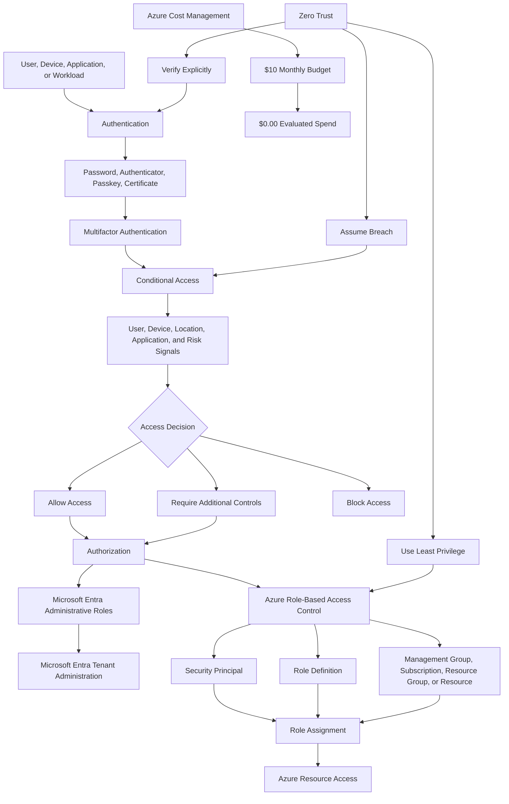

---

## Steps Performed

### Step 1: Review Microsoft Entra ID

1. Opened Microsoft Learn.
2. Reviewed the purpose of Microsoft Entra ID.
3. Reviewed how Microsoft Entra ID supports:
   - IT administrators
   - Application developers
   - End users
   - Microsoft cloud-service subscribers
4. Documented Microsoft Entra capabilities:
   - Authentication
   - Single sign-on
   - Application management
   - Device management
   - Identity protection
5. Reviewed the Microsoft Entra identity ecosystem.

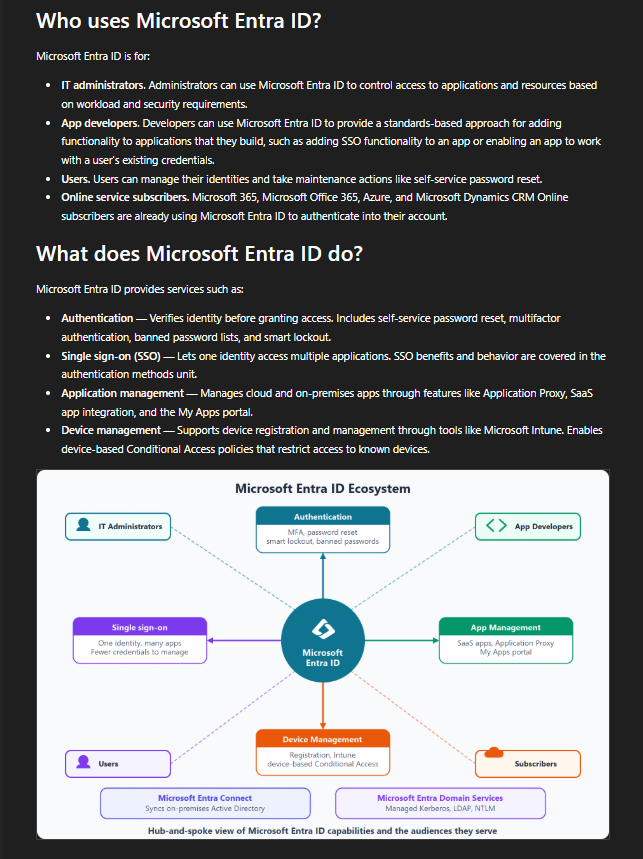

**Validation:** Microsoft Learn described Microsoft Entra ID users, capabilities, authentication, single sign-on, application management, and device management.

---

### Step 2: Review Authentication

1. Opened the authentication section.
2. Documented authentication as the process of validating identity.
3. Reviewed authentication for:
   - Users
   - Applications
   - Devices
   - Workloads
4. Reviewed identity providers, sources, protocols, and authentication assurance.
5. Connected authentication to secure sign-in decisions.

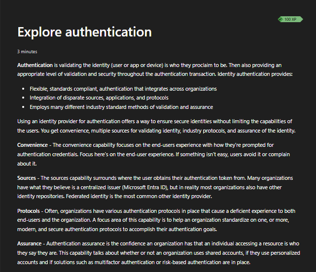

**Validation:** Microsoft Learn described authentication as identity verification before access is granted.

---

### Step 3: Review Authorization

1. Opened the authorization section.
2. Documented authorization as the process of determining permitted access.
3. Compared authentication and authorization.
4. Reviewed authorization models:
   - Access control lists
   - Role-based access control
   - Attribute-based access control
   - Policy-based access control
5. Identified Azure RBAC as the primary Azure resource authorization system.

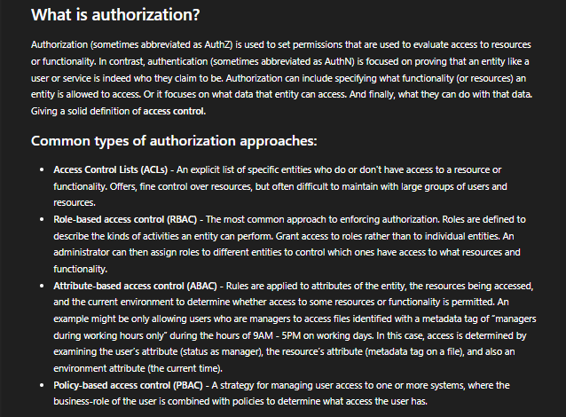

**Validation:** Microsoft Learn described authorization and common access-control models, including RBAC.

---

### Step 4: Review Multifactor Authentication

1. Opened the multifactor authentication section.
2. Documented that MFA requires two or more verification factors.
3. Reviewed:
   - Microsoft Authenticator notifications
   - Time-based one-time passwords
   - OATH hardware tokens
   - SMS
   - Voice verification
   - FIDO2 security keys
   - Passkeys
4. Documented that passwordless and phishing-resistant methods can provide stronger protection than passwords or SMS.
5. Confirmed that no authentication methods were changed.

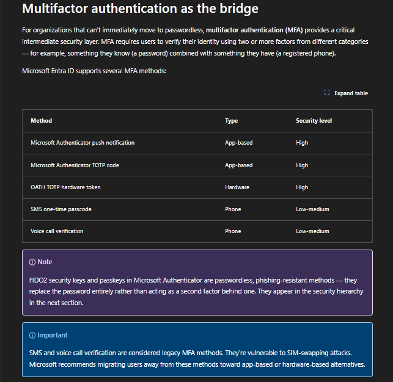

**Validation:** Microsoft Learn displayed Microsoft Entra multifactor and passwordless authentication methods.

---

### Step 5: Review Conditional Access

1. Opened the Conditional Access section.
2. Documented Conditional Access as a Microsoft Entra access-control capability.
3. Reviewed signals such as:
   - User
   - Group
   - Location
   - Device
   - Application
   - Sign-in risk
4. Reviewed possible decisions:
   - Allow
   - Block
   - Require MFA
   - Require a compliant device
5. Reviewed session and enforcement controls.
6. Confirmed that no Conditional Access policy was created or modified.

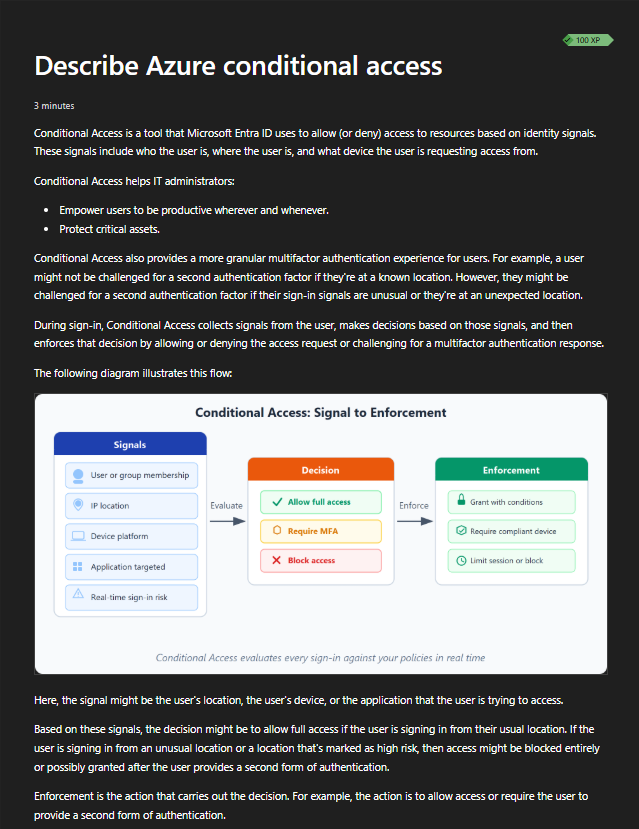

**Validation:** Microsoft Learn described Conditional Access signals, access decisions, and enforcement controls.

---

### Step 6: Review Zero Trust

1. Opened the Zero Trust section.
2. Reviewed the principle of verify explicitly.
3. Reviewed the principle of least-privilege access.
4. Reviewed the principle of assume breach.
5. Connected Zero Trust to:
   - Identity
   - Devices
   - Applications
   - Networks
   - Infrastructure
   - Data

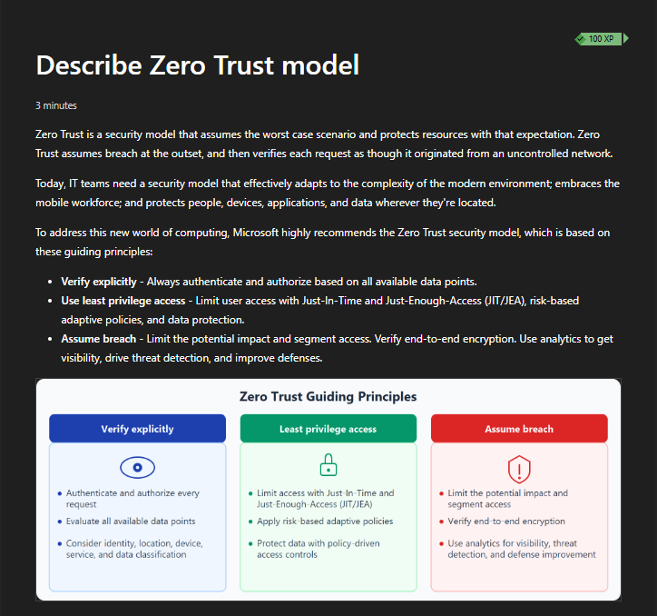

**Validation:** Microsoft Learn displayed the three primary Zero Trust principles.

---

### Step 7: Review Azure Role-Based Access Control

1. Opened the Azure RBAC section.
2. Documented Azure RBAC as the authorization system for Azure resources.
3. Reviewed:
   - Built-in roles
   - Custom roles
   - Security principals
   - Scope
   - Inheritance
4. Reviewed common built-in roles:
   - Owner
   - Contributor
   - Reader
5. Reviewed Azure RBAC scopes:
   - Management group
   - Subscription
   - Resource group
   - Resource

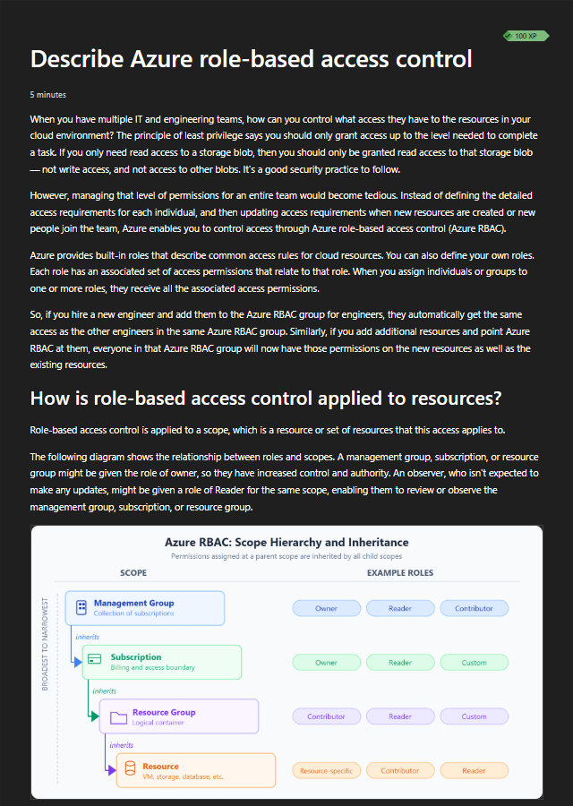

**Validation:** Microsoft Learn described Azure RBAC roles, scope, hierarchy, and inheritance.

---

### Step 8: Review Least-Privilege Access

1. Opened the least-privilege section.
2. Documented least privilege as granting only the access required to perform assigned duties.
3. Reviewed:
   - Role-based access control
   - Just-in-Time access
   - Privileged Identity Management
   - Access reviews
   - Default deny
4. Connected least privilege to privileged-role governance.
5. Confirmed that no privileged role was activated or assigned.

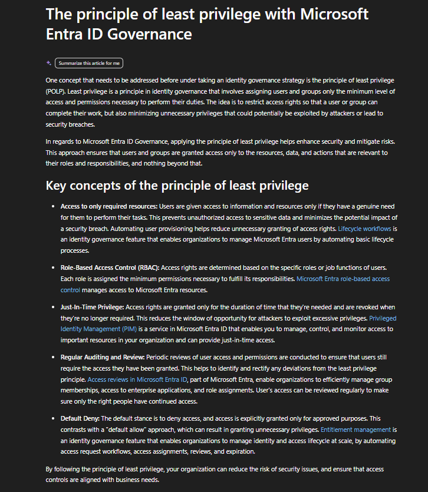

**Validation:** Microsoft Learn described least privilege, Just-in-Time access, Privileged Identity Management, access reviews, and default deny.

---

### Step 9: Validate the Microsoft Entra ID Overview

1. Opened Microsoft Entra ID in the Azure Portal.
2. Reviewed the tenant overview.
3. Reviewed the summary areas for:
   - Users
   - Groups
   - Applications
   - Devices
4. Confirmed that Microsoft Entra ID Free was displayed.
5. Reviewed available identity areas such as:
   - Identity Protection
   - Access Reviews
   - Authentication Methods
   - Tenant Restrictions
6. Did not change tenant settings.
7. Redacted tenant, directory, domain, and identifier information.

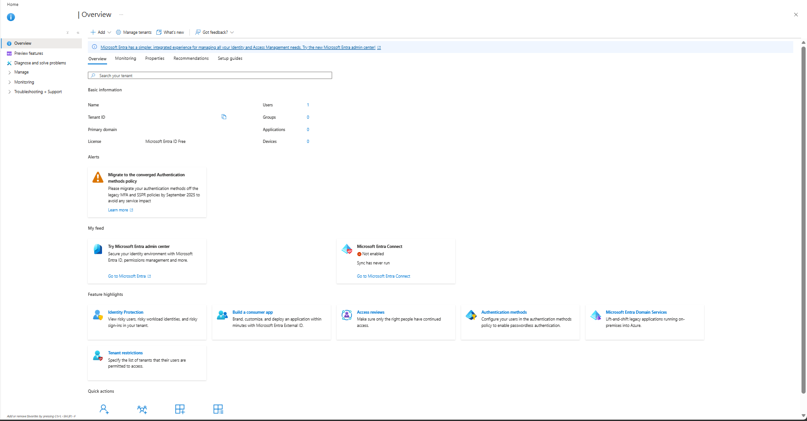

**Validation:** The Azure Portal displayed the Microsoft Entra ID overview with sensitive tenant information redacted.

---

### Step 10: Validate Microsoft Entra Users

1. Opened **Users** in Microsoft Entra ID.
2. Opened **All users**.
3. Confirmed that one user existed in the tenant.
4. Reviewed available identity information:
   - Display name
   - User principal name
   - User type
   - Identity source
   - Synchronization status
5. Did not create, edit, disable, or delete any user.
6. Redacted user-identifying information.

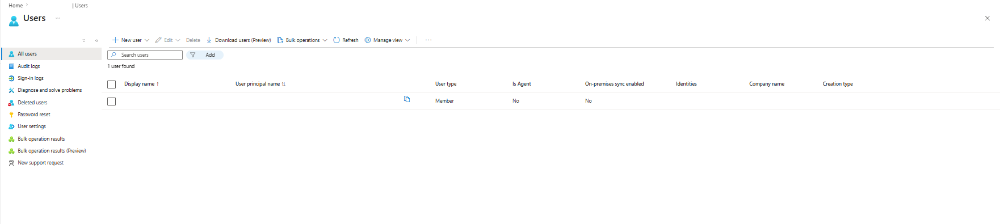

**Validation:** The Azure Portal displayed the existing Microsoft Entra user with sensitive identity information redacted.

---

### Step 11: Validate Microsoft Entra Groups

1. Opened **Groups** in Microsoft Entra ID.
2. Opened **All groups**.
3. Confirmed that no groups existed in the tenant.
4. Reviewed group information fields:
   - Group name
   - Object ID
   - Group type
   - Membership type
   - Email
   - Source
5. Did not create or modify a group.

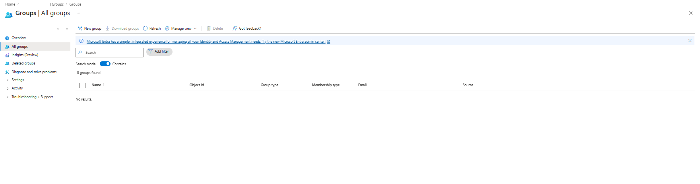

**Validation:** The Azure Portal displayed the Microsoft Entra Groups page with no groups present.

---

### Step 12: Validate Microsoft Entra Roles and Administrators

1. Opened **Roles and administrators** in Microsoft Entra ID.
2. Reviewed built-in tenant administrative roles.
3. Reviewed:
   - Role names
   - Privileged-role indicators
   - Role descriptions
   - Assignment counts
4. Distinguished Microsoft Entra administrative roles from Azure RBAC roles.
5. Did not create a custom role.
6. Did not assign, remove, or activate a role.

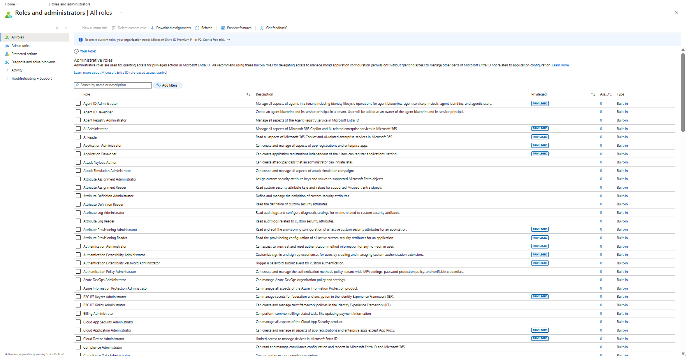

**Validation:** The Azure Portal displayed Microsoft Entra administrative roles without exposing tenant or user identifiers.

---

### Step 13: Validate Subscription Access Control

1. Opened `MRTG-AZ900-Lab-Subscription`.
2. Opened **Access control (IAM)**.
3. Reviewed the access-management options:
   - Check access
   - Role assignments
   - Deny assignments
   - Custom roles
4. Reviewed the **My access** option.
5. Did not add or modify role assignments.

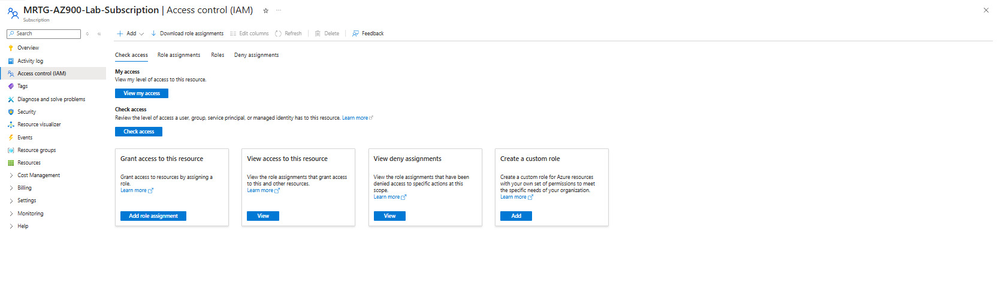

**Validation:** The Azure Portal displayed subscription-level Access control (IAM) options.

---

### Step 14: Validate Subscription Role Assignments

1. Opened the **Role assignments** tab.
2. Reviewed the existing subscription-level assignment.
3. Confirmed that the Owner role was assigned.
4. Reviewed the assignment scope as the current subscription.
5. Reviewed privileged-access indicators.
6. Did not add, remove, or modify a role assignment.
7. Redacted identity information.

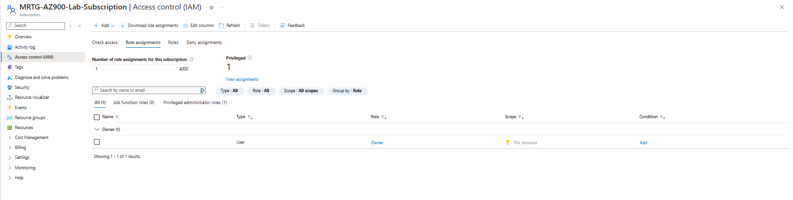

**Validation:** The Azure Portal displayed the existing subscription Owner assignment with sensitive identity information redacted.

---

### Step 15: Validate Current Subscription Access

1. Opened **View my access**.
2. Reviewed the current Azure RBAC assignment.
3. Confirmed the Owner role.
4. Reviewed the role description.
5. Confirmed that the scope was the current subscription.
6. Reviewed:
   - Active assignments
   - Eligible assignments
   - Deny assignments
7. Did not change the assignment.
8. Redacted user-identifying information.

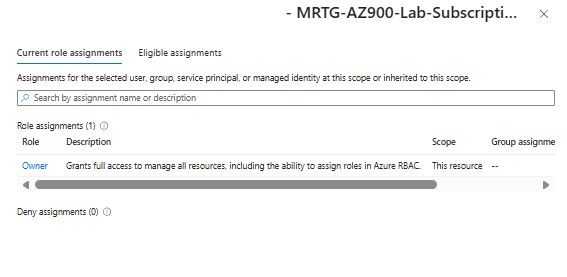

**Validation:** The Azure Portal displayed the current subscription access assignment with sensitive identity information redacted.

---

### Step 16: Perform Final Cost Validation

1. Opened Azure Cost Management.
2. Opened the existing subscription budget.
3. Confirmed that the monthly budget remained active.
4. Confirmed that evaluated spend remained `$0.00`.
5. Confirmed that budget progress remained `0.00%`.
6. Confirmed that no paid identity feature, resource, or license was enabled.
7. Redacted sensitive subscription and scope information.

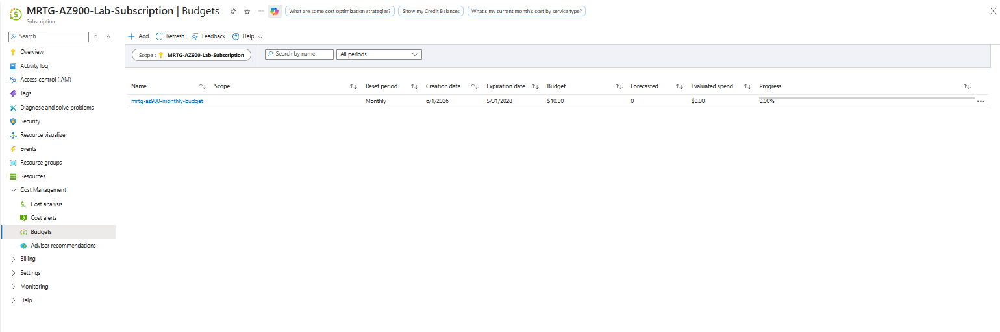

**Validation:** The final Cost Management review showed the active `$10.00` monthly budget, `$0.00` evaluated spend, and `0.00%` progress.

---

## Identity and Access Summary

| Concept | Purpose |
|---|---|
| Microsoft Entra ID | Provides cloud identity and access management |
| Authentication | Verifies the identity requesting access |
| Authorization | Determines what the authenticated identity can access |
| Multifactor Authentication | Adds verification beyond a password |
| Conditional Access | Uses signals to make access decisions |
| Zero Trust | Applies verify explicitly, least privilege, and assume breach |
| Microsoft Entra Roles | Control tenant and directory administration |
| Azure RBAC | Controls access to Azure resources |
| Role Definition | Describes the permissions included in a role |
| Security Principal | Identifies the user, group, service principal, or managed identity receiving access |
| Scope | Defines where an Azure role assignment applies |
| Role Assignment | Connects a principal, role, and scope |
| Least Privilege | Grants only the access required |
| Privileged Identity Management | Supports time-limited privileged access |
| Access Reviews | Validate whether access is still required |

---

## Identity Selection Mental Model

```text
Microsoft Entra ID
Use to manage cloud identities and authentication.

Authentication
Use to confirm who or what is requesting access.

Multifactor Authentication
Use to reduce password-only risk.

Conditional Access
Use to evaluate access signals and apply controls.

Microsoft Entra Roles
Use to delegate tenant and directory administration.

Azure RBAC
Use to authorize access to Azure resources.

Scope
Use to define where an Azure RBAC assignment applies.

Least Privilege
Use to grant only the permissions required.

Zero Trust
Use to verify explicitly, limit privilege, and assume compromise is possible.
```

---

## Authentication vs Authorization

| Concept | Question Answered | Example |
|---|---|---|
| Authentication | Who or what is requesting access? | A user signs in with a password and Microsoft Authenticator |
| Authorization | What is the authenticated identity allowed to do? | The user receives Reader access to a resource group |
| Azure RBAC role | Which Azure actions are permitted? | Owner, Contributor, or Reader |
| Scope | Where do those permissions apply? | Subscription, resource group, or resource |
| Conditional Access | Under what conditions should access be allowed? | Require MFA for a risky sign-in |

Authentication occurs before authorization.

Successful authentication does not guarantee access to every resource.

---

## Microsoft Entra Roles vs Azure RBAC Roles

| Area | Microsoft Entra Roles | Azure RBAC Roles |
|---|---|---|
| Primary target | Tenant identities and directory services | Azure resources |
| Example role | Global Administrator | Owner |
| Common scope | Microsoft Entra tenant | Management group, subscription, resource group, or resource |
| Manages | Users, groups, applications, authentication, tenant settings | Azure resources and resource configuration |
| Assignment system | Microsoft Entra administrative roles | Azure role-based access control |

### Key Takeaway

Microsoft Entra roles and Azure RBAC roles are separate authorization systems.

An identity may require both types of access depending on its responsibilities.

---

## Azure RBAC Role Assignment Model

An Azure RBAC role assignment contains three required parts.

| Component | Description |
|---|---|
| Security principal | The identity receiving access |
| Role definition | The permissions being granted |
| Scope | The Azure boundary where the permissions apply |

```text
User or Group
+
Reader Role
+
Resource Group Scope
=
Read Access to Resources in That Resource Group
```

### Common Built-In Roles

| Role | General Capability |
|---|---|
| Owner | Full resource management and permission delegation |
| Contributor | Full resource management without permission delegation |
| Reader | View resources without making changes |
| User Access Administrator | Manage user access to Azure resources |

Specific resource services can also provide specialized roles.

---

## Azure RBAC Scope

The Azure RBAC scope hierarchy is:

```text
Management Group
└── Subscription
    └── Resource Group
        └── Resource
```

| Scope | Access Impact |
|---|---|
| Management group | Can affect multiple subscriptions |
| Subscription | Can affect all resource groups and resources in the subscription |
| Resource group | Can affect resources inside one resource group |
| Resource | Applies to one specific resource |

Permissions assigned at a parent scope can be inherited by child scopes.

### Scope Security Principle

Use the narrowest practical scope.

A role assigned at subscription scope should not be used when resource-group or resource scope meets the requirement.

---

## Zero Trust Principles

| Principle | Meaning | Identity Example |
|---|---|---|
| Verify explicitly | Authenticate and authorize using all available signals | Evaluate identity, device, location, application, and risk |
| Use least-privilege access | Grant only the access required | Assign Reader instead of Owner when read access is sufficient |
| Assume breach | Design as though compromise is possible | Monitor sign-ins, restrict access, and limit lateral movement |

### Zero Trust Layers

Zero Trust applies across:

- Identities
- Devices
- Applications
- Data
- Infrastructure
- Networks

Zero Trust is not a single product or configuration.

It is a security strategy supported by multiple controls.

---

## Least-Privilege Access

Least privilege means granting only the access required to complete assigned responsibilities.

Least-privilege practices include:

- Assigning the smallest appropriate role
- Assigning access at the narrowest practical scope
- Using groups instead of repeated direct assignments
- Avoiding permanent privileged access
- Using Just-in-Time activation
- Reviewing access regularly
- Removing access when no longer needed
- Monitoring privileged actions
- Separating administrative duties

### Example

```text
Requirement:
A user needs to view resources inside one project resource group.

Excessive access:
Owner at subscription scope.

Appropriate access:
Reader at resource group scope.
```

---

## Conditional Access Model

Conditional Access evaluates signals and applies access controls.

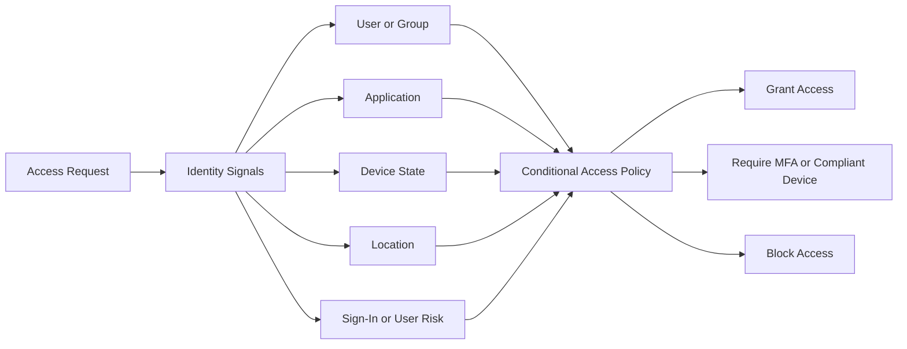

Conditional Access policies should be tested carefully before broad enforcement to avoid administrative lockout.

---

## Validation

| Validation Item | Expected Result | Actual Result |
|---|---|---|
| Microsoft Entra ID | Identity-service purpose is reviewed | Passed |
| Authentication | Identity verification is documented | Passed |
| Authorization | Access determination is documented | Passed |
| Multifactor authentication | Additional verification methods are reviewed | Passed |
| Conditional Access | Signal-based access decisions are reviewed | Passed |
| Zero Trust | Verify explicitly, least privilege, and assume breach are documented | Passed |
| Azure RBAC | Roles, assignments, scope, and inheritance are reviewed | Passed |
| Least privilege | Access-minimization practices are reviewed | Passed |
| Microsoft Entra overview | Tenant summary is visible | Passed |
| Microsoft Entra users | Existing user count is reviewed | Passed |
| Microsoft Entra groups | No groups are present | Passed |
| Roles and administrators | Tenant administrative roles are reviewed | Passed |
| Subscription Access control | IAM interface is accessible | Passed |
| Subscription role assignments | Existing Owner assignment is visible | Passed |
| Current access | Owner role and subscription scope are confirmed | Passed |
| User creation | No new users are created | Passed |
| Group creation | No new groups are created | Passed |
| Role assignment changes | No role assignments are created or modified | Passed |
| Conditional Access changes | No policies are created or modified | Passed |
| Tenant changes | No tenant settings are modified | Passed |
| Monthly budget | Existing budget remains active | Passed |
| Evaluated spend | Spend remains `$0.00` | Passed |
| Budget progress | Progress remains `0.00%` | Passed |
| Estimated cost | Lab remains within the `$0.00` estimate | Passed |

---

## Completion Checklist

- [x] Reviewed Microsoft Entra ID
- [x] Reviewed authentication
- [x] Reviewed authorization
- [x] Reviewed multifactor authentication
- [x] Reviewed Conditional Access
- [x] Reviewed Zero Trust
- [x] Reviewed Azure RBAC
- [x] Reviewed Azure RBAC scope
- [x] Reviewed permission inheritance
- [x] Reviewed least-privilege access
- [x] Reviewed Privileged Identity Management concepts
- [x] Reviewed access-review concepts
- [x] Opened the Microsoft Entra ID overview
- [x] Reviewed Microsoft Entra users
- [x] Reviewed Microsoft Entra groups
- [x] Reviewed Microsoft Entra roles and administrators
- [x] Opened subscription Access control (IAM)
- [x] Reviewed subscription role assignments
- [x] Reviewed current subscription access
- [x] Did not create users
- [x] Did not create groups
- [x] Did not invite guest users
- [x] Did not create app registrations
- [x] Did not create Conditional Access policies
- [x] Did not create or modify role assignments
- [x] Did not create custom roles
- [x] Did not modify tenant settings
- [x] Did not modify authentication settings
- [x] Validated that the monthly budget remained active
- [x] Validated that evaluated spend remained `$0.00`
- [x] Validated that budget progress remained `0.00%`
- [x] Sanitized screenshots before upload
- [x] Avoided exposing sensitive account, user, tenant, directory, subscription, or role information

---

## AZ-900 Exam Objective Coverage

### Primary Exam Domain

```text
Describe Azure architecture and services
```

### Supporting Exam Domain

```text
Describe Azure management and governance
```

### Skills Measured

This lab supports the ability to:

- Describe Microsoft Entra ID
- Describe authentication
- Describe authorization
- Describe multifactor authentication
- Describe Conditional Access
- Describe external identities
- Describe Azure RBAC
- Describe Azure RBAC scope
- Describe role inheritance
- Describe least privilege
- Describe Zero Trust
- Describe defense in depth
- Describe identity and access-management concepts
- Describe how Azure Cost Management supports spending validation

### How This Lab Supports the Objectives

This lab connected identity and access concepts to practical Azure Portal review.

It demonstrated:

- How Microsoft Entra ID manages cloud identities
- How authentication differs from authorization
- How MFA strengthens identity verification
- How Conditional Access evaluates identity signals
- How Zero Trust guides access decisions
- How Microsoft Entra roles control tenant administration
- How Azure RBAC controls Azure resource management
- How role assignments combine a principal, role, and scope
- How permission inheritance affects access
- How least privilege reduces risk
- How Azure Cost Management validates cost-safe lab execution

---

## Mini Objective Coverage

By completing this lab, I can:

- Explain what Microsoft Entra ID provides
- Explain the difference between authentication and authorization
- Explain why multifactor authentication improves identity security
- Identify common authentication methods
- Explain how Conditional Access evaluates signals
- Explain the three Zero Trust principles
- Explain how Azure RBAC controls resource access
- Describe the components of an Azure role assignment
- Explain how scope affects an Azure RBAC assignment
- Explain how permissions inherit through Azure scopes
- Distinguish Microsoft Entra roles from Azure RBAC roles
- Explain why least privilege matters
- Explain the purpose of Privileged Identity Management
- Explain the purpose of access reviews
- Identify where users and groups are reviewed
- Identify where tenant administrative roles are reviewed
- Identify where subscription role assignments are reviewed
- Validate current access without modifying permissions
- Confirm the cost impact of identity and access review

---

## IAM / Security Relevance

This lab is directly connected to identity and access management.

Identity acts as a major control plane for Microsoft Azure.

Weak identity controls can weaken every resource protected by those identities.

### Identity Lifecycle

A production identity lifecycle should include:

```text
Request
-> Approval
-> Provisioning
-> Authentication
-> Authorization
-> Monitoring
-> Access Review
-> Modification
-> Deprovisioning
```

Access should not remain permanent simply because it was once approved.

### Authentication Security

Authentication controls should consider:

- Multifactor authentication
- Phishing-resistant methods
- Passwordless authentication
- Sign-in risk
- User risk
- Device state
- Location
- Application sensitivity
- Session controls

### Authorization Security

Authorization controls should consider:

- Correct role
- Correct security principal
- Correct scope
- Inherited permissions
- Direct assignments
- Group membership
- Deny assignments
- Temporary access
- Separation of duties

### Privileged Access

Privileged accounts require stronger controls because they can:

- Create or delete resources
- Assign permissions
- Modify security settings
- Change network configuration
- Access sensitive information
- Disable monitoring
- Affect billing
- Modify governance controls

Privileged-access protections should include:

- Separate administrative identities
- Multifactor authentication
- Conditional Access
- Privileged Identity Management
- Just-in-Time activation
- Approval workflows
- Time limits
- Access reviews
- Activity monitoring
- Emergency-access accounts

### Owner Role Risk

The Owner role can manage Azure resources and delegate access.

Owner assignments should be limited because they can:

- Create resources
- Delete resources
- Modify configurations
- Assign roles
- Remove role assignments
- Affect the entire assigned scope

A production environment should avoid unnecessary permanent Owner assignments.

### Group-Based Access

Groups should be used for scalable access management.

Example:

```text
User
-> Microsoft Entra Security Group
-> Azure RBAC Role Assignment
-> Azure Resource Scope
```

This simplifies:

- Onboarding
- Role changes
- Offboarding
- Access reviews
- Audit documentation
- Consistent permission assignment

### Service and Workload Identities

Applications should not rely on personal user credentials.

Azure workloads can use:

- Managed identities
- Service principals
- Workload identities
- Certificates
- Federated identity credentials

Credentials should not be stored in source code or public repositories.

### Regulated Environment Relevance

In government, defense, healthcare, finance, and other regulated environments, identity decisions affect:

- Auditability
- Least privilege
- Separation of duties
- Privileged access
- Access approval
- Incident response
- Authentication assurance
- Data access
- Administrative accountability
- Compliance evidence

### Security Takeaway

Identity is not only a sign-in system.

Identity determines:

- Who can access resources
- What actions they can perform
- Where those actions apply
- Under which conditions access is allowed
- How access is reviewed
- How access is removed

---

## Governance Notes

### Governance Decisions

| Decision | Implementation | Reason |
|---|---|---|
| Discovery-only lab | Identity and access services were reviewed without modification | Prevented unintended security changes |
| Microsoft Learn used | Certification-aligned identity content reviewed | Supported AZ-900 preparation |
| Azure Portal used | Existing tenant and subscription access were reviewed | Connected theory to practical administration |
| Existing access retained | No role assignments were changed | Preserved the lab environment |
| Conditional Access not configured | Concepts were reviewed only | Prevented accidental administrative lockout |
| Cost Management reviewed | Monthly budget and spending state validated | Confirmed cost-safe execution |
| Screenshots sanitized | Sensitive identity and tenant information was redacted | Protected environment information |

### Governance Lesson

Identity governance should be designed before access is granted.

A production identity-governance plan should define:

- Identity source of authority
- Account naming
- User lifecycle
- Group lifecycle
- Guest-user lifecycle
- Application identity ownership
- Administrative-role ownership
- Role-assignment standards
- Conditional Access requirements
- Multifactor authentication requirements
- Privileged-access procedures
- Access-review schedules
- Emergency-access procedures
- Logging requirements
- Incident-response procedures
- Approval requirements

### Example Access Standard

| Requirement | Example |
|---|---|
| Access request | Submitted through approved workflow |
| Approval | Manager and resource owner |
| Assignment method | Microsoft Entra security group |
| Azure role | Reader |
| Scope | Project resource group |
| Duration | Based on job responsibility |
| MFA | Required |
| Privileged role | Just-in-Time activation |
| Review schedule | Quarterly |
| Removal trigger | Role change or termination |
| Logging | Centralized |

### Separation of Duties

Administrative responsibilities should be separated where practical.

Examples include:

- Identity administration
- Subscription administration
- Network administration
- Security monitoring
- Billing administration
- Application administration
- Audit review

One person should not automatically receive every administrative privilege.

---

## Cost Considerations

### Estimated Lab Cost

```text
Estimated cost: $0.00
```

### Why Cost Remained at Zero

This lab did not create or enable:

- New Microsoft Entra users
- External identities
- Microsoft Entra groups
- App registrations
- Enterprise applications
- New Azure role assignments
- Custom roles
- Conditional Access policies
- Privileged Identity Management assignments
- Access-review campaigns
- Premium identity licenses
- Paid identity-governance features
- Azure resources

### Identity Licensing Considerations

Some Microsoft Entra capabilities may require premium licensing.

Potential premium areas include:

- Conditional Access
- Identity Protection
- Privileged Identity Management
- Access reviews
- Entitlement management
- Advanced identity governance
- Risk-based access controls

Licensing should be reviewed before designing a production identity-control strategy.

### Budget Validation

The final Cost Management review showed:

```text
Budget: $10.00
Forecasted spend: 0
Evaluated spend: $0.00
Progress: 0.00%
```

### Budget Limitation

Azure budgets:

- Monitor Azure resource spending
- Generate cost notifications
- Do not prevent identity changes
- Do not revoke access
- Do not block role assignments
- Do not disable premium licensing
- Do not replace identity-governance controls
- Do not replace regular Cost Management review

---

## Troubleshooting Notes

### Issue 1: Identity Pages Exposed Sensitive Information

**Symptom**

Microsoft Entra ID pages displayed:

- User names
- Email addresses
- User principal names
- Tenant names
- Directory names
- Tenant IDs
- Domains
- Object IDs
- Role assignments

**Risk**

Publishing unreviewed screenshots could expose identity and tenant structure.

**Resolution**

Sensitive information was covered with solid opaque redaction before screenshots were committed.

**Result**

The screenshots remained useful while reducing public exposure.

---

### Issue 2: Role Assignment Pages Revealed Privileged Access

**Symptom**

Subscription Access control (IAM) displayed the identity holding Owner access.

**Risk**

Publishing the identity could reveal which account controls the subscription.

**Resolution**

The identity was redacted while leaving the role and scope visible.

**Result**

The screenshot documented Azure RBAC without exposing the administrative identity.

---

### Issue 3: Identity Pages Included Create and Assign Actions

**Symptom**

Microsoft Entra and IAM pages displayed options such as:

- New user
- New group
- Add role assignment
- New registration
- Create policy

**Risk**

Selecting and completing these workflows could change the tenant or subscription security configuration.

**Resolution**

The pages were reviewed without completing any creation or assignment workflow.

**Result**

No identity or access configuration was changed.

---

### Issue 4: Microsoft Entra Roles and Azure Roles Appeared Similar

**Symptom**

Both Microsoft Entra ID and Azure subscriptions use role-based administration.

**Risk**

The two authorization systems can be confused.

**Resolution**

The lab documented the distinction:

- Microsoft Entra roles manage tenant and directory capabilities.
- Azure RBAC roles manage Azure resources.

**Result**

Tenant administration and Azure resource administration were treated as separate access systems.

---

### Issue 5: Conditional Access Could Cause Administrative Lockout

**Symptom**

Conditional Access can block or challenge access based on policy conditions.

**Risk**

An incorrectly configured policy can prevent administrators from signing in.

**Resolution**

Conditional Access was reviewed conceptually only.

No policy was created.

**Result**

The lab documented Conditional Access without introducing tenant-access risk.

---

## What I Would Do Differently in Production

A production identity and access environment would require formal identity architecture, governance, security, monitoring, and lifecycle management.

### Identity Architecture

- Use Microsoft Entra work accounts
- Use a verified organizational domain
- Define the identity source of authority
- Document account naming standards
- Separate administrative and standard-user accounts
- Use groups for role assignment
- Define guest-user requirements
- Define service-principal ownership
- Use managed identities where supported
- Document application identity lifecycles

### Authentication

- Require multifactor authentication
- Prefer phishing-resistant methods
- Use passwordless authentication where appropriate
- Configure authentication-method policies
- Disable weak or unnecessary methods
- Monitor sign-in risk
- Monitor user risk
- Protect account recovery
- Maintain emergency-access accounts

### Conditional Access

- Design policies before enforcement
- Exclude emergency-access accounts
- Use report-only mode
- Test with pilot groups
- Require MFA for administrators
- Require compliant devices where appropriate
- Block legacy authentication
- Apply location or risk controls
- Document exclusions
- Monitor policy results

### Authorization

- Use Microsoft Entra groups for Azure RBAC
- Apply least privilege
- Use the narrowest practical scope
- Avoid unnecessary Owner assignments
- Avoid direct user assignments where possible
- Review inherited access
- Use custom roles only when required
- Document deny assignments
- Separate identity and resource administration

### Privileged Access

- Use Privileged Identity Management
- Require role activation
- Set activation time limits
- Require approval for critical roles
- Require justification
- Require MFA during activation
- Send activation notifications
- Perform recurring access reviews
- Monitor privileged actions
- Remove permanent access where possible

### Governance

- Define access-request workflows
- Require resource-owner approval
- Review access regularly
- Document role standards
- Review guest access
- Review application permissions
- Maintain separation of duties
- Establish offboarding procedures
- Document emergency-access procedures
- Map controls to compliance requirements

### Monitoring

- Review sign-in logs
- Review audit logs
- Review Azure Activity Log
- Alert on privileged-role changes
- Alert on risky sign-ins
- Alert on emergency-account use
- Monitor failed authentication
- Monitor application-consent activity
- Retain logs according to requirements
- Integrate logs with security operations

The lab intentionally avoided configuration changes because its purpose was identity-service discovery and AZ-900 concept validation.

---

## Lessons Learned

- Microsoft Entra ID provides cloud identity and access management.
- Authentication confirms who or what is requesting access.
- Authorization determines what the authenticated identity can do.
- Multifactor authentication reduces password-only risk.
- Conditional Access uses identity and device signals to make access decisions.
- Zero Trust requires explicit verification, least privilege, and an assume-breach mindset.
- Microsoft Entra roles manage tenant and directory capabilities.
- Azure RBAC manages Azure resource access.
- Azure RBAC assignments combine a security principal, role definition, and scope.
- Permission scope determines how broadly access applies.
- Parent-scope assignments can be inherited by child scopes.
- Least privilege reduces administrative risk.
- Owner access should be limited and reviewed.
- Privileged access should be temporary where possible.
- Identity screenshots require careful redaction.
- Cost validation should be performed after every Azure lab.

### Technical Takeaway

Microsoft Entra ID authenticates identities, while authorization systems such as Microsoft Entra roles and Azure RBAC determine permitted actions.

### Business Takeaway

Strong identity governance reduces unauthorized access, supports compliance, and improves administrative accountability.

### Security Takeaway

The safest access is the minimum access required, assigned at the narrowest practical scope, protected with strong authentication, reviewed regularly, and monitored continuously.

### Exam Takeaway

For AZ-900, remember:

- Microsoft Entra ID provides cloud identity and access management.
- Authentication verifies identity.
- Authorization determines access.
- MFA adds additional verification.
- Conditional Access evaluates access signals.
- Zero Trust means verify explicitly, use least privilege, and assume breach.
- Microsoft Entra roles manage tenant administration.
- Azure RBAC manages Azure resource access.
- A role assignment includes a principal, role, and scope.
- Scope determines where permissions apply.
- Parent-scope permissions can be inherited.
- Least privilege reduces risk.

---

## Cleanup

### Resources Retained

| Resource or Configuration | Reason |
|---|---|
| Microsoft Entra tenant | Required for Azure identity and access management |
| MRTG Azure subscription | Required for the remaining labs |
| Existing Owner role assignment | Required to administer the lab subscription |
| Monthly Azure budget | Required for ongoing cost visibility |
| Lab 01 resource group | Retained as the foundational resource group |
| Lab 08 documentation | Retained as project evidence |
| Lab 08 screenshots | Retained as validation evidence |

### Resources Removed

No identity, access, tenant, or Azure resources were created during this lab.

### Cleanup Validation

- [x] No users were created
- [x] No users were modified
- [x] No users were deleted
- [x] No groups were created
- [x] No guest users were invited
- [x] No app registrations were created
- [x] No enterprise applications were created
- [x] No Conditional Access policies were created
- [x] No role assignments were created
- [x] No role assignments were modified
- [x] No custom roles were created
- [x] No tenant settings were changed
- [x] No authentication methods were changed
- [x] No security defaults were changed
- [x] No premium identity features were enabled
- [x] No identity-related billable resources were deployed
- [x] Monthly budget remained active
- [x] Evaluated spend remained `$0.00`
- [x] Budget progress remained `0.00%`
- [x] Screenshot data was sanitized

---

## Outcome

This lab documented the Microsoft Azure identity and access foundation.

The completed lab demonstrated:

- Understanding of Microsoft Entra ID
- Understanding of authentication
- Understanding of authorization
- Understanding of multifactor authentication
- Understanding of Conditional Access
- Understanding of Zero Trust
- Understanding of Microsoft Entra administrative roles
- Understanding of Azure RBAC
- Understanding of role definitions
- Understanding of security principals
- Understanding of Azure RBAC scope
- Understanding of permission inheritance
- Understanding of least privilege
- Awareness of privileged-access risk
- Awareness of identity-governance responsibilities
- Practical Azure Portal validation
- No identity, tenant, or access changes
- Final evaluated spend of `$0.00`

---

## Screenshot Inventory

| Screenshot | Description |
|---|---|
| `01-microsoft-entra-id-overview.png` | Microsoft Entra ID capabilities and identity ecosystem |
| `02-authentication-overview.png` | Authentication and identity-verification concepts |
| `03-authorization-overview.png` | Authorization and access-control models |
| `04-multifactor-authentication-overview.png` | Multifactor and passwordless authentication methods |
| `05-conditional-access-overview.png` | Conditional Access signals, decisions, and enforcement |
| `06-zero-trust-overview.png` | Zero Trust principles |
| `07-azure-rbac-overview.png` | Azure RBAC roles, scopes, and inheritance |
| `08-least-privilege-access-overview.png` | Least privilege, PIM, Just-in-Time access, and access reviews |
| `09-entra-id-portal-overview-redacted.png` | Microsoft Entra ID Portal overview |
| `10-entra-users-portal-redacted.png` | Microsoft Entra users view |
| `11-entra-groups-portal-redacted.png` | Microsoft Entra groups view |
| `12-entra-roles-and-admins-portal-redacted.png` | Microsoft Entra roles and administrators |
| `13-subscription-access-control-iam-overview.png` | Subscription Access control (IAM) overview |
| `14-subscription-role-assignments-redacted.png` | Subscription role assignments |
| `15-view-my-access-redacted.png` | Current subscription access assignment |
| `16-cost-management-final-validation.png` | Final Cost Management validation |

---

## Screenshots

### Microsoft Entra ID Overview


### Authentication Overview


### Authorization Overview


### Multifactor Authentication Overview


### Conditional Access Overview


### Zero Trust Overview


### Azure RBAC Overview


### Least-Privilege Access Overview


### Microsoft Entra ID Portal Overview


### Microsoft Entra Users Portal


### Microsoft Entra Groups Portal


### Microsoft Entra Roles and Administrators


### Subscription Access Control Overview


### Subscription Role Assignments


### View My Access


### Cost Management Final Validation


---

## Next Lab

The next lab is:

```text
Lab 09 - Azure Cost Management and Resource Organization
```

The next lab builds on this identity and access foundation by examining:

- Azure Cost Management
- Cost Analysis
- Azure budgets
- Cost alerts
- Azure Pricing Calculator
- Total Cost of Ownership Calculator
- Resource tags
- Resource groups
- Resource organization
- Cost allocation
- Azure Advisor cost recommendations
- Cost governance
