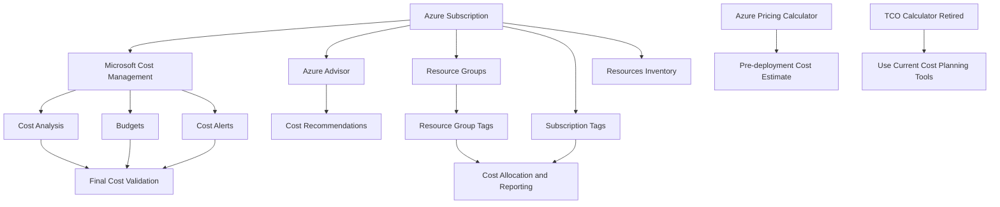

# Lab 09 - Azure Cost Management and Resource Organization

## Objective

The objective of this lab was to understand Azure Cost Management, budgets, cost alerts, Azure Advisor cost recommendations, resource groups, tags, and resource organization concepts covered by AZ-900.

This lab was completed as a discovery-only lab. No new budgets, alerts, resource groups, resources, tags, billing settings, cost exports, or Advisor recommendations were created or changed.

By completing this lab, I:

- Reviewed Microsoft Cost Management
- Reviewed Cost Analysis
- Reviewed Cost Alerts
- Reviewed Budgets
- Reviewed the Azure Pricing Calculator
- Reviewed the retired Total Cost of Ownership calculator note
- Reviewed Azure Advisor cost recommendations
- Reviewed resource tag use cases
- Reviewed resource groups
- Reviewed resource group tags
- Reviewed subscription-level tags
- Reviewed resource organization filters
- Validated the existing subscription budget
- Confirmed that evaluated spend remained `$0.00`

---

## Business Problem Solved

Cloud spend can grow quickly when resources are created without cost visibility, ownership, tagging, budget controls, or resource organization standards.

Monroe Redstone Technology Group needed a repeatable way to understand how Azure supports cost tracking and resource organization before deploying more advanced resources.

This lab helped answer:

- How does Azure Cost Management help monitor spending?
- What is Cost Analysis used for?
- What are cost alerts?
- What are budget alerts?
- How can pricing be estimated before deployment?
- What happened to the Total Cost of Ownership calculator?
- How can Azure Advisor help with cost optimization?
- How do tags support cost management and governance?
- How are resource groups used to organize Azure resources?
- How can subscription-level and resource-group-level tags be reviewed?
- How can final cost validation confirm a lab stayed cost-safe?

This lab solved the problem of understanding cost governance before creating additional Azure services.

---

## Scenario

MRTG is continuing its Azure Fundamentals lab series and preparing for future workloads.

Before deploying more services, the cloud operations team needs to understand how cost visibility, budgets, alerts, tagging, and resource organization work together.

The team reviewed Azure cost management tools and explored portal areas related to:

- Cost analysis
- Budgets
- Cost alerts
- Pricing estimates
- Azure Advisor cost recommendations
- Resource groups
- Resource tags
- Subscription tags
- Resource organization
- Final cost validation

No cost settings or resource organization settings were changed during this lab.

---

## Azure Services and Resources Used

| Service or Feature | Purpose |
|---|---|
| Microsoft Cost Management | Analyze, monitor, and manage Azure costs |
| Cost Analysis | Review Azure costs by scope, service, region, resource, or time period |
| Cost Alerts | Review alerts related to budgets, credits, and spending thresholds |
| Budgets | Track spending against a defined budget amount |
| Azure Pricing Calculator | Estimate Azure costs before deployment |
| Total Cost of Ownership Calculator | Previously used to compare on-premises and Azure costs, now retired |
| Azure Advisor | Review cost optimization recommendations |
| Resource Groups | Organize related Azure resources |
| Tags | Add metadata for ownership, environment, cost center, project, and governance |
| Subscription Tags | Review tags applied at the subscription level |
| Resources View | Review resource organization filters and resource inventory |
| Cost Management Budget Validation | Confirm final spend remained `$0.00` |

---

## Why These Services Were Used

These services were reviewed because cost governance depends on visibility, ownership, alerts, budgets, and consistent organization.

| Requirement | Azure Capability |
|---|---|
| Understand current cloud spend | Cost Analysis |
| Define spending limits | Budgets |
| Detect spending threshold events | Cost Alerts |
| Estimate costs before deployment | Azure Pricing Calculator |
| Identify cost optimization opportunities | Azure Advisor |
| Organize resources logically | Resource Groups |
| Assign ownership and business metadata | Tags |
| Support reporting by cost center or environment | Tagging strategy |
| Validate cost-safe labs | Cost Management budget view |

---

## Environment

| Component | Value |
|---|---|
| Organization | Monroe Redstone Technology Group |
| Project | MRTG Azure Fundamentals: The Bridge |
| Lab | Lab 09 |
| Subscription | `MRTG-AZ900-Lab-Subscription` |
| Existing resource group reviewed | `rg-mrtg-az900-lab01-centralus-001` |
| Azure region observed | `Central US` |
| Resource deployment model | Read-only portal exploration |
| Cost control | `$10.00` monthly budget |
| New resources created | None |
| New budgets created | None |
| New alerts created | None |
| New tags applied | None |
| Estimated lab cost | `$0.00` |
| Documentation platform | GitHub |

---

## Architecture / Concept Diagram



---

## Steps Performed

### Step 1: Review Microsoft Cost Management

1. Reviewed the Microsoft Cost Management tool.
2. Identified Cost Analysis, Cost Alerts, and Budgets as major cost management capabilities.
3. Reviewed common tasks such as spotting spending increases, finding idle resources, and validating tagging and budgets.
4. Documented that Cost Management helps analyze, monitor, allocate, and optimize Azure spending.


**Screenshot evidence:** Microsoft Learn explains Microsoft Cost Management, Cost Analysis, Cost Alerts, Budgets, and common cost management tasks.

---

### Step 2: Review Cost Alerts and Budgets

1. Reviewed cost alerts.
2. Reviewed budget alerts.
3. Reviewed credit alerts.
4. Reviewed department spending quota alerts.
5. Reviewed budgets as spending limits for Azure.
6. Documented how budget alerts notify stakeholders when spending reaches configured thresholds.


**Screenshot evidence:** Microsoft Learn explains cost alerts, budget alerts, credit alerts, department spending quota alerts, and budgets.

---

### Step 3: Review Azure Pricing Calculator

1. Reviewed the Azure Pricing Calculator.
2. Documented that the calculator estimates potential Azure expenses before deployment.
3. Reviewed that pricing estimates can include compute, storage, networking, storage options, access tiers, and redundancy.
4. Documented that adding items to the pricing calculator does not create billable Azure resources.


**Screenshot evidence:** Microsoft Learn explains how the Azure Pricing Calculator estimates costs before resources are provisioned.

---

### Step 4: Review Total Cost of Ownership Calculator Status

1. Reviewed the note about the Total Cost of Ownership calculator.
2. Documented that the Total Cost of Ownership calculator has been retired.
3. Connected this to the importance of using current Azure pricing and cost planning tools.


**Screenshot evidence:** Microsoft Learn states that the Total Cost of Ownership calculator has been retired.

---

### Step 5: Review Azure Advisor Cost Recommendations Overview

1. Opened Azure Advisor.
2. Reviewed the Advisor overview page.
3. Identified the Cost recommendation area.
4. Confirmed that the environment was following current cost recommendations.
5. Did not apply, dismiss, remediate, or change any Advisor recommendations.


**Screenshot evidence:** The Azure portal shows Azure Advisor with cost recommendation status.

---

### Step 6: Review Resource Tags

1. Reviewed the purpose of resource tags.
2. Documented tag use cases for resource management.
3. Documented tag use cases for cost management.
4. Documented tag use cases for operations management.
5. Documented tag use cases for security.
6. Documented tag use cases for governance and compliance.
7. Documented tag use cases for workload automation.
8. Reviewed starter tag examples such as environment, owner, cost center, and workload.


**Screenshot evidence:** Microsoft Learn explains how tags support resource management, cost management, operations, security, governance, and automation.

---

### Step 7: Review Cost Analysis in the Azure Portal

1. Opened Cost Management.
2. Opened Cost Analysis.
3. Reviewed the accumulated cost view.
4. Reviewed actual cost and forecast areas.
5. Reviewed cost grouping options.
6. Confirmed that no cost was reported during the selected period.
7. Did not save, export, subscribe, download, or configure billing settings.


**Screenshot evidence:** The Azure portal shows Cost Analysis with no cost reported during the selected period.

---

### Step 8: Review Budgets at Billing Account Scope

1. Opened Cost Management Budgets.
2. Reviewed the budgets table.
3. Reviewed columns for scope, reset period, creation date, expiration date, budget, forecasted, evaluated spend, and progress.
4. Confirmed that no budgets existed at the selected billing account scope.
5. Did not create a budget.


**Screenshot evidence:** The Azure portal shows the Budgets page at the selected billing account scope with no budgets present.

---

### Step 9: Review Cost Alerts

1. Opened Cost Management Cost alerts.
2. Reviewed the Cost alerts page.
3. Confirmed that no alerts existed at the selected scope.
4. Did not create an alert.
5. Did not create or modify alert rules.


**Screenshot evidence:** The Azure portal shows the Cost alerts page with no alerts to display.

---

### Step 10: Review Azure Advisor Cost Recommendations

1. Opened Azure Advisor.
2. Navigated to the Cost recommendations area.
3. Reviewed active recommendation filters.
4. Confirmed that no active cost recommendations were available for the selected subscription and resources.
5. Did not create alerts, recommendation digests, or exports.
6. Did not apply, dismiss, or change recommendations.


**Screenshot evidence:** The Azure portal shows Azure Advisor Cost recommendations with no active cost recommendations for the selected subscription and resources.

---

### Step 11: Review Resource Groups

1. Opened Resource groups.
2. Reviewed existing resource group organization.
3. Confirmed the lab resource group existed.
4. Reviewed the subscription association.
5. Reviewed the resource group location as `Central US`.
6. Did not create, delete, or modify resource groups.


**Screenshot evidence:** The Azure portal shows the existing lab resource group, subscription association, and region.

---

### Step 12: Review Resource Group Tags

1. Opened the existing lab resource group.
2. Opened Tags.
3. Reviewed existing resource group tags.
4. Identified tags for cost center, delete-after date, environment, lab, management method, owner, and project.
5. Confirmed the page showed no unsaved changes.
6. Did not add, change, delete, or save any tags.


**Screenshot evidence:** The Azure portal shows resource group tags supporting cost allocation, ownership, project tracking, environment classification, and cleanup planning.

---

### Step 13: Review Subscription Tags

1. Opened the subscription-level Tags page.
2. Reviewed the subscription tag management area.
3. Confirmed no subscription-level tags were currently applied.
4. Confirmed no changes were pending.
5. Did not add, change, delete, or save any subscription tags.


**Screenshot evidence:** The Azure portal shows the subscription-level Tags page with no tags currently applied.

---

### Step 14: Review Resource Organization View

1. Opened the subscription Resources page.
2. Reviewed filtering by resource group, type, and location.
3. Confirmed that no resources matched the selected filters.
4. Did not create or delete any resources.
5. Did not assign or change tags.


**Screenshot evidence:** The Azure portal shows resource organization filters and no resources matching the selected filters.

---

### Step 15: Perform Final Cost Validation

1. Opened the subscription-level Budgets page.
2. Validated the existing monthly budget.
3. Confirmed the budget amount was `$10.00`.
4. Confirmed forecasted cost was `0`.
5. Confirmed evaluated spend was `$0.00`.
6. Confirmed progress was `0.00%`.
7. Confirmed no new cost management resources were created during Lab 09.


**Screenshot evidence:** The Azure portal shows the subscription-level monthly budget with `$0.00` evaluated spend and `0.00%` progress.

---

## Cost Management Mental Model

```text
Cost Analysis
Shows what Azure usage is costing.

Budgets
Track spending against a defined spending limit.

Cost Alerts
Notify when spending or budget thresholds are reached.

Pricing Calculator
Estimates Azure costs before deployment.

Azure Advisor
Identifies possible cost optimization opportunities.

Resource Groups
Organize related Azure resources.

Tags
Add metadata for ownership, cost allocation, environment, and governance.

Cost Governance
The practice of controlling cloud spend through visibility, ownership, tagging, budgets, and review.
```

---

## Resource Organization Mental Model

```text
Subscription
The billing and access boundary.

Resource Group
A logical container for related Azure resources.

Resource
An individual Azure service or object.

Tags
Metadata applied to resources, resource groups, or subscriptions.

Cost Center
Identifies who owns or funds the resource.

Environment
Identifies whether the resource supports lab, dev, test, staging, or production.

Owner
Identifies who is responsible for the resource.

DeleteAfter
Supports cleanup planning and cost control.
```

---

## Cost Governance Summary

| Governance Area | Purpose |
|---|---|
| Cost Analysis | Understand current and historical spend |
| Budgets | Define spending limits |
| Cost Alerts | Notify stakeholders when thresholds are reached |
| Pricing Calculator | Estimate costs before deployment |
| Azure Advisor | Review optimization recommendations |
| Resource Groups | Organize related resources |
| Tags | Add business and operational metadata |
| Final Cost Validation | Confirm no unexpected spend occurred |

---

## Tagging Strategy Reviewed

| Tag Key | Purpose |
|---|---|
| `CostCenter` | Supports cost allocation and reporting |
| `DeleteAfter` | Supports cleanup planning |
| `Environment` | Identifies lab, dev, test, staging, or production |
| `Lab` | Identifies the related lab |
| `ManagedBy` | Identifies how the resource is managed |
| `Owner` | Identifies responsible team or owner |
| `Project` | Identifies the related project or initiative |

---

## Validation

| Validation Check | Expected Result | Actual Result | Status |
|---|---|---|---|
| Cost Management reviewed | Cost tools understood | Cost Analysis, Cost Alerts, and Budgets reviewed | Passed |
| Cost alerts reviewed | Alert types understood | Budget, credit, and spending quota alerts reviewed | Passed |
| Budgets reviewed | Budget purpose understood | Budget limits and threshold alerts reviewed | Passed |
| Pricing Calculator reviewed | Pre-deployment estimates understood | Pricing Calculator reviewed | Passed |
| TCO Calculator status reviewed | Current tool status understood | TCO calculator retirement noted | Passed |
| Advisor overview reviewed | Advisor cost area identified | Cost recommendation status reviewed | Passed |
| Tags reviewed | Tagging use cases understood | Cost, owner, security, governance, and operations tags reviewed | Passed |
| Cost Analysis portal reviewed | Cost visibility confirmed | No cost reported during selected period | Passed |
| Budgets portal reviewed | Budget table reviewed | No budgets at selected billing account scope | Passed |
| Cost Alerts portal reviewed | Cost alert area reviewed | No alerts to display | Passed |
| Advisor Cost portal reviewed | Cost recommendations reviewed | No active cost recommendations available | Passed |
| Resource groups reviewed | Resource organization reviewed | Existing lab resource group visible | Passed |
| Resource group tags reviewed | Existing tags reviewed | Tags visible with no changes pending | Passed |
| Subscription tags reviewed | Subscription tag area reviewed | No subscription-level tags applied | Passed |
| Resources view reviewed | Resource filters reviewed | No resources matched selected filters | Passed |
| Final budget validation completed | Spend remained controlled | `$0.00` evaluated spend and `0.00%` progress | Passed |

---

## Completion Checklist

- [x] Reviewed Microsoft Cost Management
- [x] Reviewed Cost Analysis
- [x] Reviewed Cost Alerts
- [x] Reviewed Budgets
- [x] Reviewed Azure Pricing Calculator
- [x] Reviewed retired Total Cost of Ownership calculator note
- [x] Reviewed Azure Advisor cost recommendations
- [x] Reviewed resource tag use cases
- [x] Reviewed Cost Analysis portal
- [x] Reviewed Budgets portal
- [x] Reviewed Cost Alerts portal
- [x] Reviewed Advisor Cost recommendations portal
- [x] Reviewed Resource Groups portal
- [x] Reviewed Resource Group Tags portal
- [x] Reviewed Subscription Tags portal
- [x] Reviewed Resources organization view
- [x] Validated subscription-level budget
- [x] Did not create new budgets
- [x] Did not create new alerts
- [x] Did not create new resource groups
- [x] Did not create new resources
- [x] Did not add, change, delete, or save tags
- [x] Did not change billing settings
- [x] Did not export cost data
- [x] Did not download invoices
- [x] Confirmed evaluated spend remained `$0.00`

---

## AZ-900 Exam Objective Coverage

### Primary Exam Domain

```text
Describe Azure management and governance
```

### Supporting Exam Domain

```text
Describe Azure architecture and services
```

### Skills Measured

This lab supports the ability to:

- Describe factors that can affect costs in Azure
- Describe the Azure Pricing Calculator
- Describe Microsoft Cost Management
- Describe budgets
- Describe cost alerts
- Describe Azure Advisor cost recommendations
- Describe resource groups
- Describe tags
- Describe how tags support cost management
- Describe how resource organization supports governance
- Describe basic cost optimization concepts

---

## Mini Objective Coverage

By completing this lab, I can now:

- Explain what Microsoft Cost Management is used for
- Explain what Cost Analysis shows
- Explain what cost alerts are
- Explain how budgets help control Azure spending
- Explain why pricing estimates should happen before deployment
- Explain that the Total Cost of Ownership calculator has been retired
- Explain how Azure Advisor supports cost optimization
- Explain how resource groups organize Azure resources
- Explain how tags support cost allocation and governance
- Identify subscription-level and resource-group-level tag areas
- Validate that no unexpected cost occurred during a lab

---

## IAM / Security Relevance

Cost management and resource organization are directly connected to security and IAM.

Poor resource organization makes it harder to determine ownership, apply access controls, review permissions, and investigate incidents.

Important IAM and security connections:

- Tags can identify resource owners.
- Tags can identify environments such as lab, dev, test, and production.
- Tags can support cleanup and reduce unused resource exposure.
- Resource groups can align resources to teams, workloads, and access boundaries.
- Cost anomalies can indicate misconfiguration, abuse, or forgotten resources.
- Budget alerts can help detect unexpected deployment activity.
- Azure Advisor can surface optimization and operational improvement opportunities.
- Consistent resource naming and tagging support audits.
- Cost governance supports accountability.

For government, healthcare, finance, and defense contractor environments, cost and resource organization support:

- Audit readiness
- Ownership tracking
- Access review
- Change management
- Environment separation
- Least privilege assignment
- Incident response
- Compliance reporting
- Budget accountability

### Security Takeaway

A resource without ownership is a governance risk.

A resource without cost visibility is an operational risk.

A resource without tags is harder to secure, manage, and clean up.

---

## Governance Notes

Important governance considerations from this lab:

- Budgets should be configured early.
- Cost alerts should be tied to action owners.
- Resource groups should follow a naming standard.
- Tags should be standardized before large deployments.
- Tags should not contain sensitive personal information.
- Subscription-level tags can support high-level reporting.
- Resource-group-level tags can support workload ownership.
- Cost Analysis should be reviewed regularly.
- Advisor recommendations should be reviewed before applying changes.
- Pricing estimates should be completed before production deployments.
- Cost governance should be part of the deployment lifecycle.

### Governance Lesson

Cost control is not only a billing task.

It is part of operational governance.

---

## Cost Considerations

### Estimated Lab Cost

```text
Estimated cost: $0.00
```

No billable resources were created in this lab.

No new budgets, alerts, exports, resource groups, resources, or tags were created.

The final budget validation confirmed:

```text
Budget amount: $10.00
Forecasted cost: 0
Evaluated spend: $0.00
Progress: 0.00%
```

This confirmed that the lab remained cost-safe.

---

## Troubleshooting Notes

### Issue 1: Billing Account Scope Can Show Personal or Billing Names

**Symptom:**

Cost Management pages at billing account scope can show personal names or billing account names.

**Risk:**

Publishing billing account names in a public repository can expose personal or account information.

**Resolution:**

Sensitive billing scope names were redacted before screenshots were saved.

**Result:**

The screenshots remained useful while protecting account details.

---

### Issue 2: Budget Views Can Show Subscription IDs

**Symptom:**

Budget pages can expose subscription GUIDs in the Scope column.

**Risk:**

Subscription IDs should not be published in a public GitHub repository.

**Resolution:**

The subscription GUID was redacted in the final budget validation screenshot.

**Result:**

The screenshot still showed budget name, budget amount, forecasted cost, evaluated spend, and progress.

---

### Issue 3: Portal Pages Include Create and Save Buttons

**Symptom:**

Cost Management, Resource Groups, Tags, and Advisor pages include buttons such as Add, Create, Save, Create alert, and Create recommendation digest.

**Risk:**

Clicking these options could change cost settings, create resources, or modify governance metadata.

**Resolution:**

All portal pages were reviewed in discovery-only mode. No changes were saved.

**Result:**

The lab remained safe and non-invasive.

---

### Issue 4: Resource Filters Can Hide Existing Resources

**Symptom:**

The Resources page showed no resources matching the selected filters.

**Risk:**

A filtered view can be mistaken for an empty subscription.

**Resolution:**

The screenshot was documented as a filtered organization view, not a full resource inventory statement.

**Result:**

The lab accurately documented resource organization filters.

---

## What I Would Do Differently in Production

In a production Azure environment, I would not rely on manual cost review alone.

I would define a cost governance model before deployment, including:

- Required tagging standards
- Naming standards
- Resource group design
- Budget thresholds
- Cost alert recipients
- Cost review cadence
- Azure Advisor review cadence
- Approval workflow for expensive services
- Cleanup rules for lab and temporary resources
- Environment classification
- Owner identification
- Cost center mapping
- Subscription strategy
- Management group strategy
- Policy enforcement for required tags
- Dashboards for cost reporting

For regulated environments, I would also document who owns cost review, who approves budget changes, and how unexpected cost increases are investigated.

---

## Lessons Learned

This lab reinforced that cost management is part of cloud governance.

Key lessons:

- Microsoft Cost Management helps analyze, monitor, and manage Azure costs.
- Cost Analysis helps identify where costs are coming from.
- Budgets help define spending limits.
- Cost alerts help notify teams when thresholds are reached.
- The Pricing Calculator helps estimate costs before deployment.
- The Total Cost of Ownership calculator has been retired.
- Azure Advisor can help identify cost optimization opportunities.
- Resource groups organize related Azure resources.
- Tags support cost allocation, ownership, operations, security, governance, and automation.
- Subscription-level and resource-group-level tags support different reporting needs.
- Public screenshots should not expose billing account names or subscription IDs.
- Cost validation should be part of every Azure lab.

### Technical Takeaway

Azure cost governance depends on visibility, budgets, alerts, tags, and resource organization.

### Business Takeaway

Cost control is easier when resources have owners, environments, cost centers, and cleanup plans.

### Security Takeaway

Good resource organization supports stronger access control, auditability, and incident response.

### Exam Takeaway

For AZ-900, remember:

- Cost Management helps monitor and manage Azure spending.
- Budgets track spending against a limit.
- Cost alerts notify when thresholds are reached.
- Pricing Calculator estimates costs before deployment.
- Azure Advisor can provide cost recommendations.
- Tags organize resources and support cost reporting.
- Resource groups organize related resources.
- Governance and cost control should be planned before deployment.

---

## Cleanup

No cleanup was required because no new Azure resources or cost management configurations were created.

### Resources Retained

| Resource or Configuration | Reason |
|---|---|
| Azure subscription | Required for future labs |
| Existing monthly budget | Required for ongoing cost validation |
| Existing Lab 01 resource group | Required for lab series foundation |
| Existing resource group tags | Used for organization and cost governance evidence |
| Cost Management configuration | Required for spend tracking |
| Azure Advisor access | Used for recommendation review |

### Resources Removed

No resources were created or removed during this lab.

### Cleanup Validation

- [x] No new resources created
- [x] No new resource groups created
- [x] No new budgets created
- [x] No new cost alerts created
- [x] No Advisor recommendations applied
- [x] No cost exports created
- [x] No invoices downloaded
- [x] No billing settings changed
- [x] No tags added
- [x] No tags changed
- [x] No tags deleted
- [x] Evaluated spend remained `$0.00`
- [x] Budget progress remained `0.00%`

---

## Outcome

Lab 09 successfully established a foundational understanding of Azure Cost Management and resource organization while maintaining a cost-safe lab environment.

The lab demonstrated how to review cost tools, budgets, cost alerts, Azure Advisor recommendations, resource groups, tags, and resource inventory views without making changes to the Azure environment.

The completed lab demonstrates:

- Understanding of Microsoft Cost Management
- Understanding of Cost Analysis
- Understanding of Cost Alerts
- Understanding of Budgets
- Understanding of Azure Pricing Calculator
- Awareness that the Total Cost of Ownership calculator has been retired
- Understanding of Azure Advisor cost recommendations
- Understanding of resource groups
- Understanding of resource tags
- Understanding of subscription tags
- Understanding of resource organization filters
- Awareness of billing and subscription screenshot redaction requirements
- Final evaluated spend of `$0.00`

---

## Screenshot Inventory

| Screenshot | Description |
|---|---|
| `01-azure-cost-management-overview.png` | Microsoft Cost Management overview |
| `02-cost-alerts-and-budgets-overview.png` | Cost alerts and budgets overview |
| `03-azure-pricing-calculator-overview.png` | Azure Pricing Calculator overview |
| `04-total-cost-of-ownership-calculator-retired.png` | Total Cost of Ownership calculator retirement note |
| `05-azure-advisor-cost-recommendations-portal.png` | Azure Advisor overview cost recommendation status |
| `06-resource-groups-and-tags-overview.png` | Resource tag use cases |
| `07-cost-management-cost-analysis-portal.png` | Cost Management Cost Analysis portal |
| `08-cost-management-budgets-portal.png` | Cost Management Budgets portal |
| `09-cost-alerts-portal.png` | Cost Alerts portal |
| `10-advisor-cost-recommendations-portal.png` | Advisor Cost recommendations portal |
| `11-resource-groups-portal.png` | Resource Groups portal |
| `12-resource-group-tags-portal.png` | Resource Group Tags portal |
| `13-subscription-tags-portal.png` | Subscription Tags portal |
| `14-resources-portal-organization-view.png` | Resources portal organization view |
| `15-final-cost-management-validation.png` | Final subscription budget validation |

---

## Next Lab

The next lab is:

```text
Lab 10 - Azure Governance, Policy, and Compliance
```

The next lab will build on cost and resource organization by reviewing:

- Azure Policy
- Policy definitions
- Policy assignments
- Initiatives
- Resource locks
- Compliance
- Microsoft Purview
- Governance controls
- Policy-driven guardrails
