# Lab 09 - Azure Cost Management and Resource Organization

## Objective

Document the Microsoft Azure cost-management and resource-organization capabilities used to estimate, monitor, allocate, optimize, and govern cloud spending.

By completing this lab, I:

- Reviewed Azure Cost Management
- Reviewed Cost Analysis
- Reviewed Azure budgets
- Reviewed cost alerts
- Reviewed the Azure Pricing Calculator
- Reviewed the Microsoft Learn notice that the Total Cost of Ownership Calculator had been retired
- Reviewed Azure Advisor cost recommendations
- Reviewed Azure resource groups
- Reviewed resource-group tags
- Reviewed subscription-level tags
- Reviewed Azure resource inventory and filtering
- Validated the existing subscription-level monthly budget
- Confirmed that no cost-management or resource-organization settings were changed
- Confirmed that evaluated Azure spend remained `$0.00`

This was a discovery-only lab. No new budgets, alerts, exports, resource groups, resources, tags, billing settings, or Advisor changes were created or modified.

---

## Business Problem Solved

Cloud spending can increase quickly when resources are deployed without cost visibility, ownership, tagging, budget controls, or resource-organization standards.

Poor cost governance can result in:

- Unexpected charges
- Unidentified resource owners
- Unused or abandoned resources
- Inconsistent tagging
- Difficult financial reporting
- Weak accountability
- Incomplete cleanup
- Unclear environment separation
- Delayed response to cost anomalies
- Limited visibility into optimization opportunities

Monroe Redstone Technology Group needed a repeatable method for reviewing Azure spending, estimating future costs, organizing resources, and assigning business metadata before deploying more advanced services.

This lab addressed the following questions:

- How does Azure Cost Management support spending visibility?
- What information does Cost Analysis provide?
- What are Azure budgets?
- What are cost alerts?
- How can Azure costs be estimated before deployment?
- How does Azure Advisor identify cost-optimization opportunities?
- How do resource groups organize Azure resources?
- How do tags support ownership, cost allocation, governance, and cleanup?
- How can subscription and resource-group tags be reviewed?
- How can final cost validation confirm that a lab remained cost-safe?

---

## Scenario

MRTG is preparing to deploy additional Azure services.

Before expanding the environment, the cloud operations team must understand how Azure cost-management and resource-organization capabilities work together.

The team reviews:

- Cost Analysis
- Budgets
- Cost alerts
- Pre-deployment pricing estimates
- Azure Advisor cost recommendations
- Resource groups
- Resource-group tags
- Subscription-level tags
- Resource inventory filters
- Final subscription spending

The Azure Portal and Microsoft Learn are used for discovery and validation.

No cost, billing, tagging, or resource configuration changes are made during this lab.

---

## Azure Services and Resources Used

| Azure Service, Resource, or Feature | Purpose |
|---|---|
| Microsoft Learn | Provided certification-aligned cost-management and tagging instruction |
| Azure Portal | Supported practical cost and resource-organization review |
| Azure Cost Management | Provided cost visibility, budgets, alerts, and spending review |
| Cost Analysis | Displayed accumulated cost, forecast, grouping, and filtering options |
| Azure Budgets | Compared evaluated spending against a defined monthly amount |
| Cost Alerts | Displayed cost-related notification and alert information |
| Azure Pricing Calculator | Supported pre-deployment cost estimation |
| Azure Advisor | Displayed cost-optimization recommendations |
| Azure Resource Groups | Organized related Azure resources by purpose and lifecycle |
| Azure Tags | Added business, ownership, environment, and cleanup metadata |
| Subscription Tags | Supported metadata at the subscription scope |
| Azure Resources View | Supported inventory review and filtering |
| Existing Monthly Budget | Confirmed that evaluated spend remained `$0.00` |

---

## Why These Services Were Used

### Microsoft Learn

Microsoft Learn was used as the primary certification-aligned source for Azure cost and resource-organization concepts.

It provided structured coverage of:

- Azure Cost Management
- Cost Analysis
- Cost alerts
- Budgets
- Azure Pricing Calculator
- Azure Advisor
- Resource groups
- Resource tags
- Cost-management practices

### Azure Portal

The Azure Portal was used to connect conceptual learning to the existing MRTG Azure environment.

It supported review of:

- Cost Analysis
- Budgets at different scopes
- Cost alerts
- Azure Advisor cost recommendations
- Resource groups
- Resource-group tags
- Subscription-level tags
- Resource inventory filters
- Final budget status

The Azure Portal was used only for review and validation.

### Azure Cost Management

Azure Cost Management helps organizations:

- Analyze current spending
- Review historical spending
- Group costs by service or resource
- Filter costs by scope
- Create budgets
- Review cost alerts
- Identify spending trends
- Allocate costs
- Support financial accountability

Cost Management provides visibility and notifications. It does not replace operational ownership or automatically prevent additional charges.

### Cost Analysis

Cost Analysis provides visual and tabular information about Azure spending.

It can help organizations review cost by:

- Subscription
- Resource group
- Resource
- Service
- Meter
- Location
- Tag
- Time period

Cost Analysis can also support forecasting when sufficient usage data exists.

### Azure Budgets

Azure budgets compare actual or forecasted spending against a defined amount.

Budgets can:

- Track spending progress
- Evaluate actual cost
- Evaluate forecasted cost
- Trigger notifications
- Support accountability

Budgets do not automatically:

- Stop resources
- Deallocate virtual machines
- Delete resources
- Disable subscriptions
- Prevent additional charges

### Cost Alerts

Cost alerts provide visibility into cost-related notification events.

Depending on account type and scope, alerts can relate to:

- Budget thresholds
- Credit usage
- Department spending quotas
- Other supported cost conditions

Alert recipients should understand who is responsible for investigating and responding.

### Azure Pricing Calculator

The Azure Pricing Calculator supports cost estimation before deployment.

Estimates can include:

- Service type
- Region
- Resource size
- Runtime
- Storage
- Transactions
- Redundancy
- Data transfer
- Licensing
- Support options

Adding services to a pricing estimate does not deploy Azure resources.

### Total Cost of Ownership Calculator Review

Microsoft Learn displayed a notice that the Total Cost of Ownership Calculator had been retired.

The lab documented that organizations should use currently supported Azure pricing, migration, and financial-planning resources when evaluating cloud costs.

### Azure Advisor

Azure Advisor analyzes supported Azure environments and can provide recommendations in categories such as:

- Cost
- Security
- Reliability
- Performance
- Operational excellence

Cost recommendations can help identify opportunities such as:

- Underused resources
- Oversized resources
- Reservation opportunities
- Savings-plan opportunities
- Unused services

Recommendations should be reviewed before changes are applied.

### Azure Resource Groups

Resource groups provide logical containers for Azure resources that share a common:

- Purpose
- Workload
- Owner
- Lifecycle
- Administrative boundary
- Cleanup schedule

Resource groups can also provide scopes for:

- Azure RBAC
- Azure Policy
- Resource locks
- Cost analysis
- Activity Log review

### Azure Tags

Tags provide key-value metadata for Azure resources, resource groups, and supported subscription scopes.

Tags can support:

- Ownership
- Cost allocation
- Environment classification
- Project identification
- Automation
- Cleanup planning
- Operations
- Governance reporting

Tags do not provide access control and do not replace Azure RBAC, Azure Policy, or resource locks.

### Azure Resources View

The Resources view provides an inventory of Azure resources and supports filtering by attributes such as:

- Subscription
- Resource group
- Resource type
- Location
- Tags

Filters must be reviewed carefully because a filtered view may not represent the complete subscription inventory.

### Existing Monthly Budget

The existing subscription-level budget provided final evidence that:

- The `$10.00` monthly budget remained active
- Forecasted cost remained `0`
- Evaluated spend remained `$0.00`
- Budget progress remained `0.00%`

---

## Environment

| Item | Value |
|---|---|
| Organization | Monroe Redstone Technology Group |
| Project | MRTG Azure Fundamentals: The Bridge |
| Lab | Lab 09 - Azure Cost Management and Resource Organization |
| Cloud Platform | Microsoft Azure |
| Management Interface | Azure Portal |
| Learning Platform | Microsoft Learn |
| Subscription | `MRTG-AZ900-Lab-Subscription` |
| Existing Resource Group | `rg-mrtg-az900-lab01-centralus-001` |
| Resource Group Location | `Central US` |
| New Resources Created | None |
| New Resource Groups Created | None |
| New Budgets Created | None |
| New Cost Alerts Created | None |
| New Tags Applied | None |
| Cost Exports Created | None |
| Billing Settings Changed | None |
| Monthly Budget | `$10.00` |
| Evaluated Spend | `$0.00` |
| Budget Progress | `0.00%` |
| Documentation Platform | GitHub |
| Lab Type | Discovery-only |
| Estimated Cost | `$0.00` |

---

## Architecture / Concept Diagram

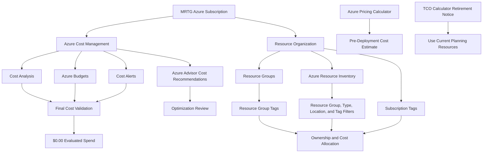

---

## Steps Performed

### Step 1: Review Azure Cost Management

1. Opened Microsoft Learn.
2. Reviewed Azure Cost Management.
3. Identified the primary cost-management capabilities:
   - Cost Analysis
   - Cost alerts
   - Budgets
4. Reviewed common cost-management tasks:
   - Identifying spending increases
   - Finding idle or unused resources
   - Reviewing tags
   - Reviewing budgets
   - Understanding cost allocation
5. Documented Azure Cost Management as a financial-governance capability.

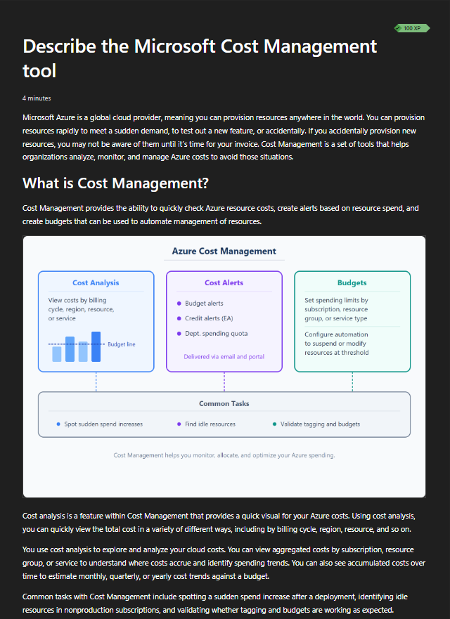

**Validation:** Microsoft Learn described Azure Cost Management, Cost Analysis, cost alerts, budgets, and common spending-management tasks.

---

### Step 2: Review Cost Alerts and Budgets

1. Opened the cost alerts and budgets section.
2. Reviewed:
   - Budget alerts
   - Credit alerts
   - Department spending quota alerts
3. Documented that budgets compare spending against a defined amount.
4. Documented that budget thresholds can notify selected recipients.
5. Documented that budgets are not automatic spending caps.
6. Confirmed that no alert or budget was created.

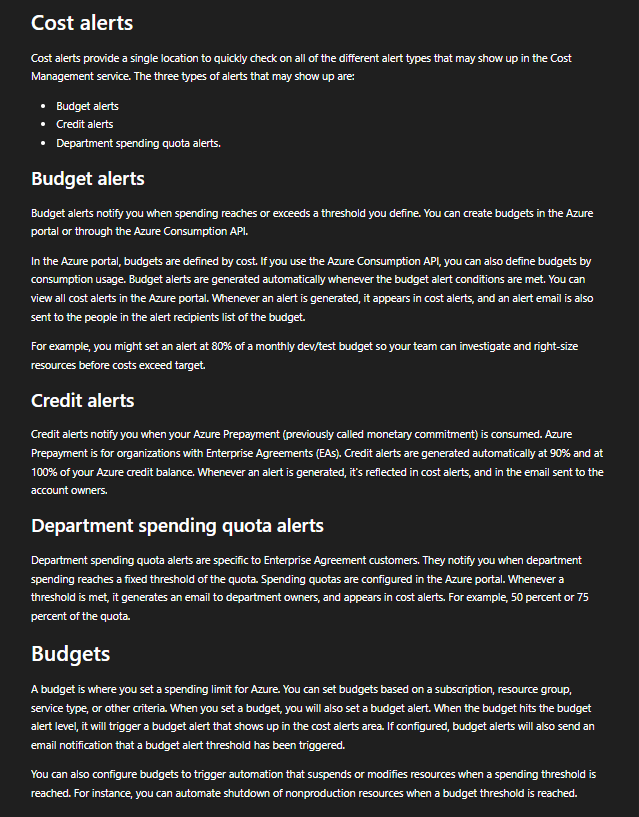

**Validation:** Microsoft Learn described cost alerts, budgets, and threshold-based notifications.

---

### Step 3: Review the Azure Pricing Calculator

1. Opened the Azure Pricing Calculator overview.
2. Documented that the calculator estimates potential Azure expenses before deployment.
3. Reviewed cost variables such as:
   - Compute size
   - Runtime
   - Storage
   - Networking
   - Redundancy
   - Access tier
   - Region
4. Confirmed that calculator estimates do not create Azure resources.

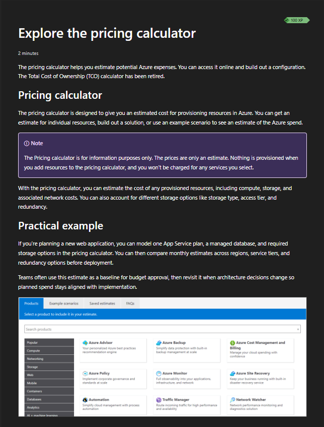

**Validation:** Microsoft Learn described the Azure Pricing Calculator as a pre-deployment estimation tool.

---

### Step 4: Review the Total Cost of Ownership Calculator Notice

1. Reviewed the Microsoft Learn notice related to the Total Cost of Ownership Calculator.
2. Documented that the calculator had been retired.
3. Connected the notice to the importance of verifying that financial-planning tools and documentation remain current.
4. Did not attempt to use retired functionality.


**Validation:** Microsoft Learn displayed the retirement notice for the Total Cost of Ownership Calculator.

---

### Step 5: Review the Azure Advisor Cost Overview

1. Opened Azure Advisor in the Azure Portal.
2. Reviewed the Advisor overview.
3. Located the Cost recommendation category.
4. Confirmed that the environment was following the available cost recommendations.
5. Did not apply, dismiss, postpone, or modify recommendations.

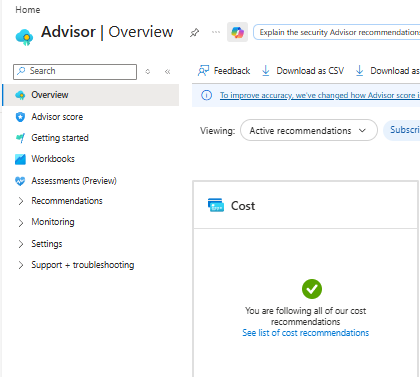

**Validation:** The Azure Portal displayed the Azure Advisor cost recommendation status.

---

### Step 6: Review Resource Groups and Tags

1. Opened the resource-group and tagging section in Microsoft Learn.
2. Reviewed tag use cases involving:
   - Resource management
   - Cost management
   - Operations
   - Security
   - Governance
   - Compliance
   - Automation
3. Reviewed common starter tags:
   - Environment
   - Owner
   - Cost center
   - Workload
4. Documented tags as metadata rather than access-control mechanisms.

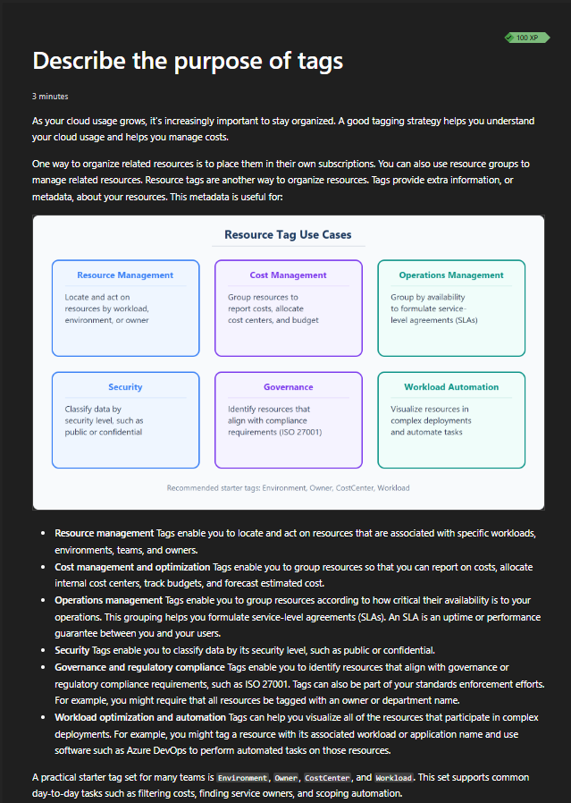

**Validation:** Microsoft Learn described how tags support resource management, cost allocation, operations, security, governance, and automation.

---

### Step 7: Review Cost Analysis in the Azure Portal

1. Opened Azure Cost Management.
2. Opened **Cost Analysis**.
3. Reviewed the accumulated-cost view.
4. Reviewed actual-cost and forecast areas.
5. Reviewed filtering and grouping options.
6. Confirmed that no cost was reported for the selected period.
7. Did not save, export, subscribe to, or download cost information.
8. Did not modify billing settings.

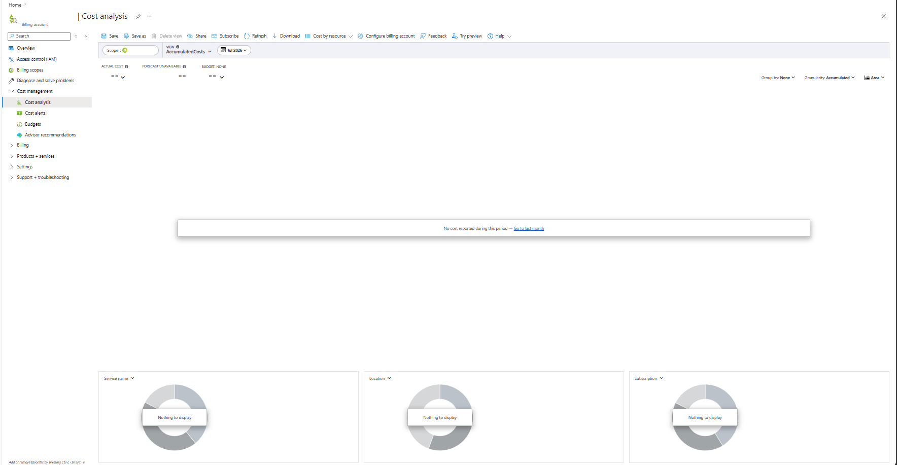

**Validation:** The Azure Portal displayed Cost Analysis with no reported cost for the selected period.

---

### Step 8: Review Budgets at Billing-Account Scope

1. Opened **Budgets** in Azure Cost Management.
2. Reviewed the selected billing-account scope.
3. Reviewed budget table columns:
   - Scope
   - Reset period
   - Creation date
   - Expiration date
   - Budget amount
   - Forecasted cost
   - Evaluated spend
   - Progress
4. Confirmed that no budgets existed at the selected billing-account scope.
5. Did not create a budget.
6. Redacted the billing-account name.

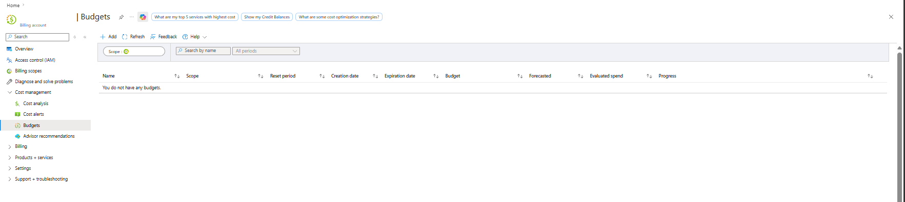

**Validation:** The Azure Portal displayed no budgets at the selected billing-account scope.

> The absence of a budget at billing-account scope did not conflict with the existing monthly budget at subscription scope. Azure budgets are scope-specific.

---

### Step 9: Review Cost Alerts

1. Opened **Cost alerts**.
2. Reviewed the Cost alerts interface.
3. Confirmed that no alerts existed at the selected scope.
4. Did not create an alert.
5. Did not create or modify an alert rule.
6. Redacted sensitive billing information.

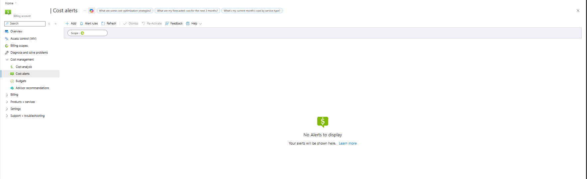

**Validation:** The Azure Portal displayed no cost alerts at the selected scope.

---

### Step 10: Review Azure Advisor Cost Recommendations

1. Opened Azure Advisor.
2. Selected the Cost recommendation category.
3. Reviewed the subscription and resource filters.
4. Confirmed that no active cost recommendations were available for the selected environment.
5. Did not create an alert or recommendation digest.
6. Did not apply, dismiss, or modify a recommendation.

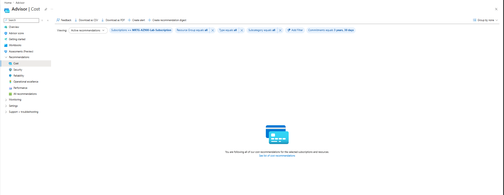

**Validation:** Azure Advisor displayed no active cost recommendations for the selected subscription and resources.

---

### Step 11: Review Azure Resource Groups

1. Opened **Resource groups**.
2. Reviewed the existing resource-group inventory.
3. Confirmed that the Lab 01 resource group existed.
4. Confirmed its subscription association.
5. Confirmed that its location was Central US.
6. Did not create, rename, move, or delete a resource group.
7. Redacted sensitive directory information.

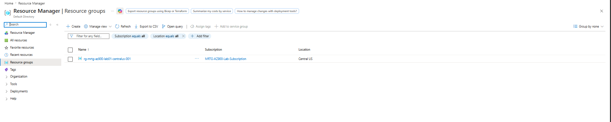

**Validation:** The Azure Portal displayed the existing Lab 01 resource group within the MRTG subscription.

---

### Step 12: Review Resource-Group Tags

1. Opened `rg-mrtg-az900-lab01-centralus-001`.
2. Opened **Tags**.
3. Reviewed the existing tag set:
   - `CostCenter`
   - `DeleteAfter`
   - `Environment`
   - `Lab`
   - `ManagedBy`
   - `Owner`
   - `Project`
4. Confirmed that the page displayed no unsaved changes.
5. Did not add, edit, delete, or save a tag.

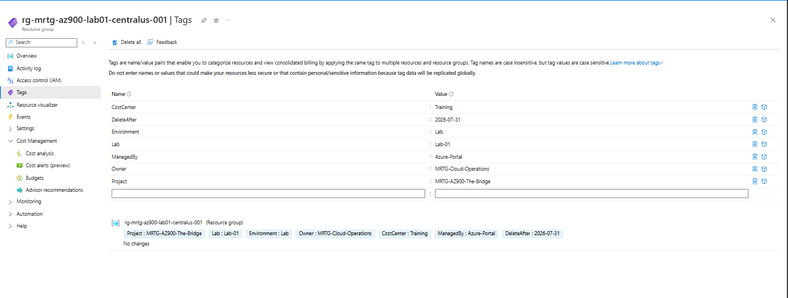

**Validation:** The Azure Portal displayed the existing MRTG resource-group tags with no pending changes.

---

### Step 13: Review Subscription-Level Tags

1. Opened the subscription-level **Tags** page.
2. Reviewed the subscription tag-management area.
3. Confirmed that no subscription-level tags were applied.
4. Confirmed that no changes were pending.
5. Did not add, edit, delete, or save a subscription tag.

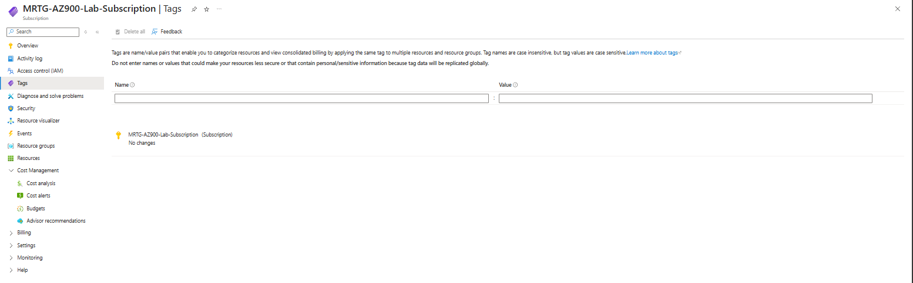

**Validation:** The Azure Portal displayed no subscription-level tags and no pending changes.

---

### Step 14: Review the Azure Resource-Organization View

1. Opened the subscription **Resources** page.
2. Reviewed filters for:
   - Resource group
   - Resource type
   - Location
3. Confirmed that no resources matched the selected filters.
4. Did not create, delete, move, or tag a resource.
5. Documented the view as a filtered inventory rather than proof that the subscription contained no resources.

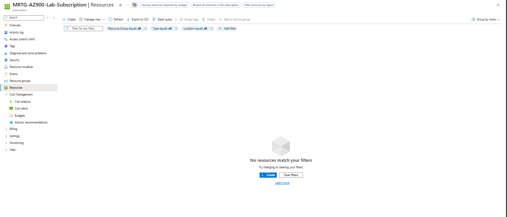

**Validation:** The Azure Portal displayed resource-organization filters with no resources matching the selected criteria.

---

### Step 15: Perform Final Cost Validation

1. Opened the subscription-level **Budgets** page.
2. Located the existing monthly budget.
3. Confirmed the budget name.
4. Confirmed that the budget amount was `$10.00`.
5. Confirmed that forecasted cost was `0`.
6. Confirmed that evaluated spend was `$0.00`.
7. Confirmed that budget progress was `0.00%`.
8. Confirmed that no cost-management or resource-organization changes were made.
9. Redacted the subscription ID and sensitive scope information.

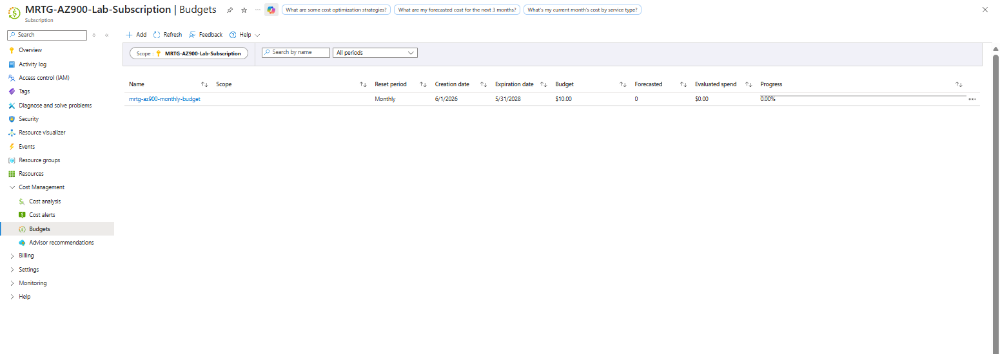

**Validation:** The Azure Portal displayed the active subscription-level monthly budget with `$0.00` evaluated spend and `0.00%` progress.

---

## Cost Management Summary

| Capability | Primary Purpose |
|---|---|
| Cost Analysis | Review current, historical, grouped, and filtered Azure spending |
| Azure Budgets | Compare actual or forecasted spending against a defined amount |
| Cost Alerts | Surface supported cost-related alert conditions |
| Azure Pricing Calculator | Estimate potential costs before deployment |
| Azure Advisor | Identify supported cost-optimization opportunities |
| Cost Exports | Support scheduled cost-data delivery |
| Tags | Support cost allocation and ownership reporting |
| Resource Groups | Organize resources by purpose and lifecycle |
| Final Cost Validation | Confirm that no unexpected spending occurred |

---

## Cost Management Mental Model

```text
Cost Analysis
Shows where Azure spending is occurring.

Azure Budget
Compares actual or forecasted spending against a defined amount.

Cost Alert
Notifies stakeholders about supported cost conditions.

Azure Pricing Calculator
Estimates potential cost before deployment.

Azure Advisor
Identifies supported cost-optimization opportunities.

Resource Group
Organizes related Azure resources.

Tag
Adds business, ownership, environment, and cost metadata.

Cost Governance
Combines visibility, ownership, budgets, alerts, organization, and review.
```

---

## Budget Scope

Azure budgets are associated with a selected scope.

Possible scopes can include supported:

- Billing accounts
- Billing profiles
- Invoices
- Departments
- Subscriptions
- Resource groups

A budget created at one scope does not automatically appear at another scope.

### MRTG Budget Review

```text
Billing-account scope:
No budget displayed.

Subscription scope:
mrtg-az900-monthly-budget
Budget amount: $10.00
Evaluated spend: $0.00
Progress: 0.00%
```

This demonstrated why scope must be confirmed when reviewing cost information.

---

## Resource Organization Summary

```text
Management Group
└── Subscription
    └── Resource Group
        └── Resource
```

Tags can be applied at supported scopes to add organizational metadata.

### Resource Group

A resource group is a logical container for Azure resources that share a common:

- Workload
- Purpose
- Owner
- Environment
- Lifecycle
- Cleanup schedule

### Resource

A resource is an individual Azure service instance, such as:

- Virtual machine
- Storage account
- Virtual network
- Database
- App Service
- Key vault

### Tags

Tags add metadata such as:

- Project
- Owner
- Environment
- Cost center
- Application
- Managed-by method
- Cleanup date

Tags do not automatically provide:

- Access control
- Data protection
- Encryption
- Policy enforcement
- Resource locking

---

## MRTG Tagging Strategy

| Tag Key | Example Value | Purpose |
|---|---|---|
| `Project` | `MRTG-AZ900-The-Bridge` | Identifies the related project |
| `Lab` | `Lab-01` | Identifies the related lab |
| `Environment` | `Lab` | Classifies the environment |
| `Owner` | `MRTG-Cloud-Operations` | Identifies operational ownership |
| `CostCenter` | `Training` | Supports cost allocation |
| `ManagedBy` | `Azure-Portal` | Identifies the management method |
| `DeleteAfter` | `2026-07-31` | Supports cleanup planning |

### Tagging Limitations

Tags should not contain:

- Passwords
- Access tokens
- Personal information
- Confidential data
- Secret values
- Sensitive system details

Tags applied to a resource group do not automatically propagate to contained resources unless policy or automation applies them.

---

## Cost Governance Lifecycle

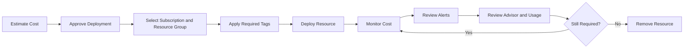

A cost-management process should continue throughout the entire resource lifecycle.

---

## Cost Optimization Areas

Azure cost optimization can include:

- Removing unused resources
- Resizing underused resources
- Shutting down non-production workloads
- Using reservations or savings plans
- Selecting appropriate service tiers
- Reviewing storage access tiers
- Removing orphaned disks and public IP addresses
- Reducing unnecessary data transfer
- Using autoscaling
- Applying lifecycle-management rules
- Reviewing premium features
- Consolidating appropriate workloads
- Monitoring spending trends

Cost optimization should not reduce required:

- Security
- Reliability
- Compliance
- Backup
- Recovery
- Performance

---

## Validation

| Validation Item | Expected Result | Actual Result |
|---|---|---|
| Azure Cost Management | Cost-management capabilities are reviewed | Passed |
| Cost Analysis | Cost views, filters, and grouping are reviewed | Passed |
| Azure budgets | Budget tracking and thresholds are reviewed | Passed |
| Cost alerts | Supported cost-alert concepts are reviewed | Passed |
| Azure Pricing Calculator | Pre-deployment estimation is reviewed | Passed |
| TCO Calculator notice | Microsoft Learn retirement notice is documented | Passed |
| Azure Advisor overview | Cost category is reviewed | Passed |
| Advisor cost recommendations | No active cost recommendations are present | Passed |
| Resource groups and tags | Organization and metadata concepts are reviewed | Passed |
| Cost Analysis portal | No cost is reported for the selected period | Passed |
| Billing-account budget scope | No budgets are displayed at the selected scope | Passed |
| Cost Alerts portal | No alerts are displayed at the selected scope | Passed |
| Existing resource group | Lab 01 resource group is visible | Passed |
| Resource-group tags | Existing MRTG tags are visible | Passed |
| Subscription tags | No subscription-level tags are applied | Passed |
| Resources view | No resources match the selected filters | Passed |
| Budget creation | No new budget is created | Passed |
| Cost-alert creation | No new alert is created | Passed |
| Tag changes | No tags are added, edited, or deleted | Passed |
| Billing changes | No billing settings are modified | Passed |
| Monthly budget | Existing subscription budget remains active | Passed |
| Evaluated spend | Spend remains `$0.00` | Passed |
| Budget progress | Progress remains `0.00%` | Passed |
| Estimated cost | Lab remains within the `$0.00` estimate | Passed |

---

## Completion Checklist

- [x] Reviewed Azure Cost Management
- [x] Reviewed Cost Analysis
- [x] Reviewed Azure budgets
- [x] Reviewed cost alerts
- [x] Reviewed Azure Pricing Calculator
- [x] Reviewed the TCO Calculator retirement notice
- [x] Reviewed Azure Advisor cost recommendations
- [x] Reviewed Azure resource groups
- [x] Reviewed Azure tags
- [x] Reviewed Cost Analysis in the Azure Portal
- [x] Reviewed Budgets at billing-account scope
- [x] Reviewed Cost alerts
- [x] Reviewed Advisor Cost recommendations
- [x] Reviewed the Resource Groups page
- [x] Reviewed resource-group tags
- [x] Reviewed subscription-level tags
- [x] Reviewed Azure resource inventory filters
- [x] Validated the existing subscription-level monthly budget
- [x] Did not create a budget
- [x] Did not create a cost alert
- [x] Did not create a resource group
- [x] Did not create an Azure resource
- [x] Did not add, edit, delete, or save tags
- [x] Did not apply or dismiss Advisor recommendations
- [x] Did not create cost exports
- [x] Did not modify billing settings
- [x] Did not download invoices
- [x] Validated that evaluated spend remained `$0.00`
- [x] Validated that budget progress remained `0.00%`
- [x] Sanitized screenshots before upload
- [x] Avoided exposing billing names, account details, subscription IDs, or scope identifiers

---

## AZ-900 Exam Objective Coverage

### Primary Exam Domain

```text
Describe Azure management and governance
```

### Supporting Exam Domain

```text
Describe Azure architecture and services
```

### Skills Measured

This lab supports the ability to:

- Describe factors that affect Azure costs
- Describe the Azure Pricing Calculator
- Describe Azure Cost Management
- Describe Cost Analysis
- Describe Azure budgets
- Describe cost alerts
- Describe Azure Advisor cost recommendations
- Describe Azure resource groups
- Describe Azure tags
- Describe how tags support cost allocation
- Describe how resource organization supports governance
- Describe basic Azure cost-optimization concepts
- Describe the importance of reviewing scope

### How This Lab Supports the Objectives

This lab connected Azure cost-management and resource-organization concepts to practical Azure Portal review.

It demonstrated:

- How Cost Analysis provides spending visibility
- How budgets compare spending against defined amounts
- How cost alerts support notification workflows
- How the Azure Pricing Calculator supports pre-deployment planning
- How Azure Advisor supports optimization review
- How resource groups organize Azure resources
- How tags support ownership and cost allocation
- How cost information changes by scope
- How final budget validation supports cost-safe lab execution

---

## Mini Objective Coverage

By completing this lab, I can:

- Explain the purpose of Azure Cost Management
- Explain what Cost Analysis displays
- Explain how Azure budgets work
- Explain why budgets are not hard spending caps
- Explain the purpose of cost alerts
- Explain how the Azure Pricing Calculator supports deployment planning
- Explain how Azure Advisor supports cost optimization
- Explain the purpose of Azure resource groups
- Explain how tags support cost allocation and ownership
- Identify subscription-level and resource-group-level tag areas
- Explain why budget scope matters
- Explain why a filtered resource view may not represent the complete subscription
- Identify common Azure cost drivers
- Describe a cost-governance lifecycle
- Validate Azure spending without modifying cost settings

---

## IAM / Security Relevance

Cost management and resource organization are directly connected to identity and access management.

Poor resource organization makes it more difficult to determine:

- Who owns a resource
- Who should administer it
- Which role assignments should apply
- Which environment it supports
- Whether it is still required
- Which team is responsible for cost
- Which incident-response team should investigate it

### Resource Groups and Azure RBAC

Resource groups can act as Azure RBAC scopes.

Example:

```text
Microsoft Entra Group
+
Virtual Machine Contributor
+
Application Resource Group
=
VM Management Access Within That Resource Group
```

A well-designed resource-group structure can support:

- Least privilege
- Workload separation
- Delegated administration
- Access reviews
- Ownership
- Cleanup
- Audit reporting

Resource groups should not be created only for billing purposes without considering lifecycle and access requirements.

### Tags and Ownership

Tags can help identify:

- Business owner
- Technical owner
- Cost center
- Environment
- Project
- Application
- Cleanup date

Tags support investigations and audits but do not grant or deny access.

### Cost Anomalies as Security Signals

Unexpected spending can indicate:

- Misconfigured autoscaling
- Forgotten resources
- Unauthorized deployment
- Compromised credentials
- Cryptocurrency mining
- Excessive data transfer
- Misused premium services
- Uncontrolled testing

Budget and cost alerts can provide an early signal that requires investigation.

### Privileged Cost Access

Access to billing and cost information should be controlled.

Cost data can reveal:

- Subscription structure
- Resource usage
- Business activity
- Service adoption
- Regional deployment
- Workload scale

Billing and cost roles should follow least privilege.

### Regulated Environment Relevance

In government, defense, healthcare, finance, and other regulated environments, cost and resource organization support:

- Audit readiness
- Ownership tracking
- Access review
- Environment separation
- Change management
- Incident response
- Compliance reporting
- Budget accountability
- Resource lifecycle governance
- Separation of duties

### Security Takeaway

A resource without an owner is a governance risk.

A resource without cost visibility is an operational risk.

A resource without clear organization is harder to secure, monitor, investigate, and remove.

---

## Governance Notes

### Governance Decisions

| Decision | Implementation | Reason |
|---|---|---|
| Discovery-only lab | Cost and organization features were reviewed without modification | Prevented unintended changes |
| Microsoft Learn used | Certification-aligned cost content reviewed | Supported AZ-900 preparation |
| Azure Portal used | Existing cost and organization settings were reviewed | Connected theory to practical administration |
| Existing budget retained | Subscription-level `$10.00` monthly budget | Maintained cost visibility |
| Existing tags retained | Lab 01 resource-group tags | Preserved established governance metadata |
| Advisor recommendations not changed | Review only | Prevented unapproved configuration changes |
| Billing settings not changed | Review only | Protected billing configuration |
| Screenshots sanitized | Sensitive identifiers and billing names were redacted | Protected account information |

### Governance Lesson

Cost management is not only a billing function.

It is part of operational governance and resource lifecycle management.

### Production Cost-Governance Requirements

A production cost-governance model should define:

- Subscription strategy
- Management group strategy
- Resource-group standards
- Naming standards
- Required tags
- Tag ownership
- Budget amounts
- Budget thresholds
- Alert recipients
- Review cadence
- Cost-center mappings
- Workload ownership
- Approval thresholds
- Optimization-review cadence
- Temporary-resource expiration
- Cleanup procedures
- Exception procedures

### Example Cost-Governance Standard

| Requirement | Example |
|---|---|
| Resource owner | Application team |
| Cost owner | Department manager |
| Cost center | `Finance-Operations` |
| Environment | `Production` |
| Monthly budget | `$2,000` |
| Warning threshold | `50%` |
| Critical threshold | `80%` |
| Forecast threshold | `100%` |
| Review cadence | Weekly |
| Advisor review | Monthly |
| Temporary-resource tag | `DeleteAfter` |
| Expensive-service approval | Required |
| Cost anomaly response | Cloud Operations and Security |

### Policy Enforcement

Azure Policy can help:

- Require tags
- Add or inherit tags
- Restrict approved regions
- Restrict resource types
- Audit missing metadata
- Enforce governance standards

Policy changes should be tested before enforcement.

---

## Cost Considerations

### Estimated Lab Cost

```text
Estimated cost: $0.00
```

### Why Cost Remained at Zero

This lab did not create or modify:

- Azure resources
- Resource groups
- Azure budgets
- Cost alerts
- Cost exports
- Scheduled reports
- Billing settings
- Subscription tags
- Resource-group tags
- Advisor configurations
- Recommendation digests
- Alert rules

### Common Azure Cost Drivers

- Resource type
- Resource size
- Service tier
- Runtime
- Region
- Storage capacity
- Storage redundancy
- Transactions
- Data retrieval
- Network transfer
- Monitoring-data ingestion
- Backup
- Licensing
- Premium security features
- Support plans
- Reservation commitments
- Scaling configuration

### Cost-Control Practices

- Estimate cost before deployment
- Assign a resource owner
- Assign a cost center
- Apply required tags
- Configure budgets
- Configure alerts
- Review Cost Analysis regularly
- Review Azure Advisor
- Remove unused resources
- Right-size workloads
- Shut down non-production resources
- Review orphaned disks and public IP addresses
- Use lifecycle-management rules
- Review expensive services before deployment

### Budget Validation

The final Cost Management review showed:

```text
Budget: $10.00
Forecasted cost: 0
Evaluated spend: $0.00
Progress: 0.00%
```

### Budget Limitation

Azure budgets:

- Monitor actual and forecasted spending
- Generate notifications
- Do not stop resources
- Do not disable services
- Do not delete resources
- Do not enforce a hard spending cap
- Do not replace resource ownership
- Do not replace regular cost review

---

## Troubleshooting Notes

### Issue 1: Billing Scope Displayed Sensitive Names

**Symptom**

Azure Cost Management pages at billing-account scope displayed billing or personal account names.

**Risk**

Publishing these values could expose account information.

**Resolution**

Sensitive billing names were covered with solid opaque redaction before screenshots were committed.

**Result**

The cost-management evidence remained useful without exposing billing identities.

---

### Issue 2: Budget Views Displayed Subscription Identifiers

**Symptom**

The subscription budget page displayed a subscription GUID in the Scope column.

**Risk**

Subscription IDs should not be published in a public repository.

**Resolution**

The subscription identifier was redacted while leaving the budget name, amount, forecast, evaluated spend, and progress visible.

**Result**

The screenshot documented budget status without exposing the subscription ID.

---

### Issue 3: Budget Results Differed by Scope

**Symptom**

The billing-account budget page displayed no budgets, while the subscription-level page displayed the existing MRTG budget.

**Explanation**

Azure budgets are scope-specific.

A budget at subscription scope does not automatically appear at billing-account scope.

**Resolution**

Both scope views were documented separately.

**Result**

The lab demonstrated why administrators must confirm the selected cost-management scope.

---

### Issue 4: Portal Pages Included Create and Save Actions

**Symptom**

Cost Management, Tags, Resource Groups, and Azure Advisor displayed options such as:

- Create
- Add
- Save
- Create alert
- Create recommendation digest
- Export

**Risk**

Completing these workflows could modify cost, governance, or reporting settings.

**Resolution**

All pages were reviewed without saving changes.

**Result**

The lab remained discovery-only.

---

### Issue 5: Resource Filters Hid Existing Items

**Symptom**

The Resources page displayed no resources matching the selected filters.

**Risk**

A filtered view could be mistaken for proof that the entire subscription was empty.

**Resolution**

The screenshot was documented as a filtered resource-organization view.

**Result**

The README accurately distinguished filtered results from the complete subscription inventory.

---

### Issue 6: Budgets Could Be Mistaken for Spending Limits

**Symptom**

Budget terminology can create the impression that Azure automatically stops spending at the budget amount.

**Risk**

Resources can continue generating charges after a budget threshold is reached.

**Resolution**

The lab documented budgets as monitoring and notification tools rather than hard spending caps.

**Result**

The cost-control limitation was clearly recorded.

---

## What I Would Do Differently in Production

A production Azure environment would require formal financial governance, resource organization, identity control, automation, and reporting.

### Cost Architecture

- Define a subscription strategy
- Define management-group ownership
- Map subscriptions to billing ownership
- Assign cost centers
- Define workload budgets
- Define environment budgets
- Establish spending thresholds
- Document financial accountability
- Create chargeback or showback reporting
- Establish cost-anomaly procedures

### Resource Organization

- Define resource-group standards
- Align resource groups with workload lifecycle
- Separate production and non-production resources
- Define approved regions
- Define naming conventions
- Define required tags
- Document ownership
- Define temporary-resource cleanup
- Review resource inventory regularly

### Identity and Access

- Assign cost roles through Microsoft Entra groups
- Apply least privilege
- Separate billing administration from resource administration
- Review inherited access
- Use Privileged Identity Management
- Perform recurring access reviews
- Monitor billing-role changes
- Restrict invoice and payment access

### Budgets and Alerts

- Create budgets at appropriate scopes
- Configure multiple thresholds
- Configure forecast alerts
- Assign action owners
- Document escalation procedures
- Test alert delivery
- Review recipient lists
- Update budgets when requirements change

### Tag Governance

- Require approved tags through Azure Policy
- Use consistent values
- Prevent sensitive data in tags
- Apply inheritance where appropriate
- Audit missing tags
- Remediate noncompliant resources
- Define tag ownership
- Review unused tag values

### Optimization

- Review Cost Analysis regularly
- Review Azure Advisor
- Identify idle resources
- Right-size workloads
- Evaluate reservations and savings plans
- Review storage tiers
- Remove orphaned resources
- Review data-transfer costs
- Evaluate premium services
- Track optimization results

### Automation and Reporting

- Create scheduled cost exports
- Integrate cost data with reporting tools
- Create dashboards
- Alert on anomalies
- Automate temporary-resource cleanup
- Use Infrastructure as Code
- Store governance configurations in source control
- Require peer review
- Document exceptions

The lab intentionally avoided configuration changes because its purpose was cost-management and resource-organization discovery.

---

## Lessons Learned

- Azure Cost Management provides visibility into cloud spending.
- Cost Analysis supports filtering, grouping, and historical review.
- Azure budgets compare actual or forecasted cost against a defined amount.
- Budgets do not automatically stop Azure spending.
- Cost alerts support notification and investigation workflows.
- The Azure Pricing Calculator supports pre-deployment estimation.
- Azure Advisor can identify cost-optimization opportunities.
- Cost-management results depend on the selected scope.
- Resource groups organize resources by purpose and lifecycle.
- Tags support ownership, cost allocation, environment classification, automation, and cleanup.
- Tags do not provide access control.
- Filtered resource views may not represent the complete subscription inventory.
- Cost anomalies can indicate operational or security problems.
- Billing and subscription identifiers require redaction.
- Cost validation should be performed after every Azure lab.

### Technical Takeaway

Azure cost governance combines Cost Analysis, budgets, alerts, Advisor recommendations, resource groups, and tags.

### Business Takeaway

Cloud cost control is easier when every resource has a clear owner, environment, cost center, purpose, and lifecycle.

### Security Takeaway

Resource organization and cost monitoring improve accountability, support investigations, and can reveal unauthorized or unexpected activity.

### Exam Takeaway

For AZ-900, remember:

- Azure Cost Management supports spending analysis and management.
- Cost Analysis shows where spending occurs.
- Azure budgets track spending against defined amounts.
- Budgets do not automatically stop resources.
- Cost alerts notify stakeholders about supported cost conditions.
- The Azure Pricing Calculator estimates cost before deployment.
- Azure Advisor can provide cost recommendations.
- Resource groups organize related resources.
- Tags provide metadata for ownership, organization, and cost reporting.
- Scope affects which cost information and budgets are displayed.

---

## Cleanup

### Resources Retained

| Resource or Configuration | Reason |
|---|---|
| MRTG Azure subscription | Required for the remaining labs |
| Existing monthly budget | Required for ongoing cost visibility |
| Lab 01 resource group | Retained as the foundational resource group |
| Existing resource-group tags | Retained as governance and cost-allocation metadata |
| Azure Cost Management configuration | Required for ongoing spending review |
| Azure Advisor access | Required for recommendation review |
| Lab 09 documentation | Retained as project evidence |
| Lab 09 screenshots | Retained as validation evidence |

### Resources Removed

No Azure resources, cost-management configurations, or governance metadata were created or removed during this lab.

### Cleanup Validation

- [x] No Azure resources were created
- [x] No Azure resources were deleted
- [x] No resource groups were created
- [x] No resource groups were deleted
- [x] No budgets were created
- [x] No budgets were modified
- [x] No cost alerts were created
- [x] No cost exports were created
- [x] No scheduled reports were created
- [x] No billing settings were changed
- [x] No invoices were downloaded
- [x] No Advisor recommendations were applied
- [x] No Advisor recommendations were dismissed
- [x] No tags were added
- [x] No tags were modified
- [x] No tags were deleted
- [x] Monthly budget remained active
- [x] Evaluated spend remained `$0.00`
- [x] Budget progress remained `0.00%`
- [x] Screenshot data was sanitized

---

## Outcome

This lab documented the Azure cost-management and resource-organization foundation required for responsible cloud administration.

The completed lab demonstrated:

- Understanding of Azure Cost Management
- Understanding of Cost Analysis
- Understanding of Azure budgets
- Understanding of cost alerts
- Understanding of the Azure Pricing Calculator
- Awareness of the TCO Calculator retirement notice
- Understanding of Azure Advisor cost recommendations
- Understanding of Azure resource groups
- Understanding of resource-group tags
- Understanding of subscription-level tags
- Understanding of resource-inventory filters
- Understanding of cost-management scope
- Awareness of cost-governance responsibilities
- Awareness of cost-related security signals
- Practical Azure Portal validation
- No cost, billing, tagging, or resource changes
- Final evaluated spend of `$0.00`

---

## Screenshot Inventory

| Screenshot | Description |
|---|---|
| `01-azure-cost-management-overview.png` | Azure Cost Management capabilities |
| `02-cost-alerts-and-budgets-overview.png` | Cost alerts, budgets, and threshold notifications |
| `03-azure-pricing-calculator-overview.png` | Azure Pricing Calculator |
| `04-total-cost-of-ownership-calculator-retired.png` | Total Cost of Ownership Calculator retirement notice |
| `05-azure-advisor-cost-recommendations-portal.png` | Azure Advisor cost recommendation overview |
| `06-resource-groups-and-tags-overview.png` | Resource-group and tag use cases |
| `07-cost-management-cost-analysis-portal.png` | Azure Cost Analysis |
| `08-cost-management-budgets-portal.png` | Budgets at billing-account scope |
| `09-cost-alerts-portal.png` | Cost alerts at the selected scope |
| `10-advisor-cost-recommendations-portal.png` | Azure Advisor Cost recommendations |
| `11-resource-groups-portal.png` | Existing Azure resource group |
| `12-resource-group-tags-portal.png` | Existing resource-group tags |
| `13-subscription-tags-portal.png` | Subscription-level Tags page |
| `14-resources-portal-organization-view.png` | Filtered Azure resource-inventory view |
| `15-final-cost-management-validation.png` | Final subscription-level budget validation |

---

## Screenshots

### Azure Cost Management Overview


### Cost Alerts and Budgets Overview


### Azure Pricing Calculator Overview


### Total Cost of Ownership Calculator Retirement Notice


### Azure Advisor Cost Recommendation Overview


### Resource Groups and Tags Overview


### Azure Cost Analysis Portal


### Cost Management Budgets Portal


### Cost Alerts Portal


### Azure Advisor Cost Recommendations Portal


### Resource Groups Portal


### Resource Group Tags Portal


### Subscription Tags Portal


### Resources Organization View


### Final Cost Management Validation


---

## Next Lab

The next lab is:

```text
Lab 10 - Azure Governance, Policy, and Compliance
```

The next lab builds on cost management and resource organization by examining:

- Azure Policy
- Policy definitions
- Policy assignments
- Policy initiatives
- Policy compliance
- Resource locks
- Microsoft Purview
- Governance controls
- Compliance management
- Policy-driven guardrails
