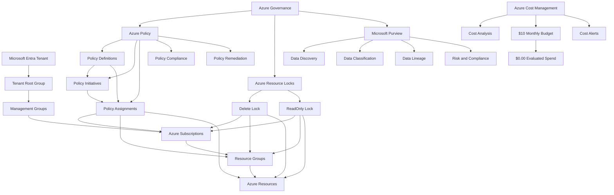
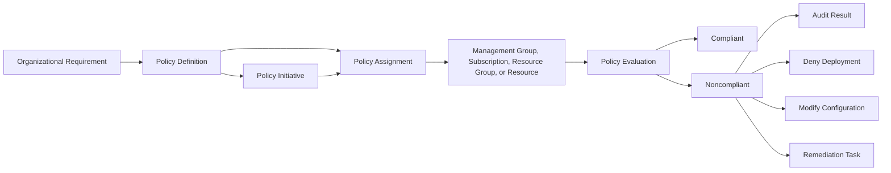
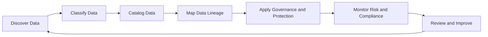

# Lab 10 - Azure Governance, Policy, and Compliance

## Objective

Document the Microsoft Azure governance, policy, compliance, resource-protection, and data-governance capabilities used to establish organizational guardrails across cloud environments.

By completing this lab, I:

- Reviewed Microsoft Purview
- Reviewed Azure Policy
- Reviewed policy definitions
- Reviewed policy initiatives
- Reviewed policy assignments
- Reviewed policy compliance
- Reviewed policy remediation
- Reviewed Azure resource locks
- Reviewed Azure management groups
- Reviewed governance hierarchy and inheritance
- Validated Azure governance services in the Azure Portal
- Validated Cost Analysis, budgets, and cost alerts
- Confirmed that no governance settings or resources were changed
- Confirmed that evaluated Azure spend remained `$0.00`

This was a discovery-only lab. No policies, initiatives, assignments, remediation tasks, resource locks, management groups, Microsoft Purview accounts, or governance settings were created or modified.

---

## Business Problem Solved

Cloud environments can become difficult to secure and manage when resources are deployed without organizational standards, compliance controls, ownership requirements, resource protection, or centralized governance.

Poor governance can result in:

- Resources deployed in unapproved regions
- Missing ownership or cost metadata
- Unrestricted public access
- Inconsistent security configurations
- Accidental resource deletion
- Excessive administrative access
- Configuration drift
- Untracked compliance failures
- Weak subscription organization
- Limited data visibility
- Audit findings
- Unexpected cost

Monroe Redstone Technology Group needed to understand how Azure governance services help organizations:

- Define cloud standards
- Apply controls at scale
- Audit resource configuration
- Prevent noncompliant deployments
- Group related policies into larger compliance goals
- Review compliance status
- Correct supported noncompliant configurations
- Protect critical resources from accidental changes
- Organize subscriptions
- Discover and govern sensitive data
- Validate that governance activity remains cost-safe

This lab established the governance foundation required before applying controls to larger Azure environments.

---

## Scenario

MRTG is preparing to expand its Microsoft Azure environment.

Before deploying additional workloads, the cloud operations team must understand how Azure governance capabilities can be used to enforce standards, monitor compliance, protect resources, organize subscriptions, and govern data.

The team reviews:

- Microsoft Purview
- Azure Policy
- Policy definitions
- Policy initiatives
- Policy assignments
- Policy compliance
- Policy remediation
- Resource locks
- Management groups
- Governance inheritance
- Cost Management validation

The Azure Portal and Microsoft Learn are used for discovery and documentation.

No governance configurations are created or changed during this lab.

---

## Azure Services and Resources Used

| Azure Service, Resource, or Feature | Purpose |
|---|---|
| Microsoft Learn | Provided certification-aligned governance and compliance instruction |
| Azure Portal | Supported practical governance-service review |
| Microsoft Purview | Provided data governance, discovery, classification, lineage, risk, and compliance capabilities |
| Azure Policy | Audited or enforced organizational standards |
| Policy Definitions | Defined individual governance rules |
| Policy Initiatives | Grouped related policy definitions |
| Policy Assignments | Applied policies or initiatives to Azure scopes |
| Policy Compliance | Displayed compliant and noncompliant resources |
| Policy Remediation | Supported correction of certain noncompliant configurations |
| Azure Resource Locks | Protected resources against accidental deletion or modification |
| Azure Management Groups | Organized subscriptions and governance at scale |
| Tenant Root Group | Provided the highest management-group scope in the tenant |
| Azure Cost Management | Supported final spending validation |
| Azure Budgets | Confirmed that the subscription-level budget remained active |
| Cost Alerts | Confirmed that no cost alerts were displayed |

---

## Why These Services Were Used

### Microsoft Learn

Microsoft Learn was used as the primary certification-aligned source for Azure governance concepts.

It provided structured coverage of:

- Microsoft Purview
- Azure Policy
- Policy definitions
- Policy initiatives
- Policy assignments
- Policy compliance
- Policy remediation
- Resource locks
- Management groups
- Governance inheritance

### Azure Portal

The Azure Portal was used to connect conceptual learning to the existing MRTG Azure environment.

It supported review of:

- Azure Policy overview
- Policy definitions
- Policy assignments
- Policy compliance
- Policy remediation
- Subscription resource locks
- Management groups
- Microsoft Purview accounts
- Cost Analysis
- Azure budgets
- Cost alerts

The Azure Portal was used only for review and validation.

### Microsoft Purview

Microsoft Purview provides data governance, risk, and compliance capabilities across supported data environments.

It can help organizations:

- Discover data
- Classify sensitive information
- Understand data lineage
- Create a data catalog
- Manage data risk
- Support compliance activities
- Govern data across on-premises, multicloud, and software-as-a-service environments

Microsoft Purview governance capabilities support organizational visibility into where data exists, how it is classified, and how it moves.

No Microsoft Purview account was created during this lab.

### Azure Policy

Azure Policy evaluates Azure resources against organizational rules.

Azure Policy can help:

- Audit resource configuration
- Deny noncompliant deployments
- Require approved settings
- Restrict locations
- Restrict resource types
- Require or inherit tags
- Deploy required configurations
- Monitor compliance
- Remediate supported resources

Azure Policy focuses on resource compliance.

Azure RBAC focuses on who can perform actions.

### Policy Definitions

A policy definition describes:

- The condition being evaluated
- The Azure resource properties involved
- The effect applied when the condition is met

Common policy effects can include:

- Audit
- Deny
- Modify
- Append
- DeployIfNotExists
- AuditIfNotExists
- Disabled

Built-in policy definitions can be used directly or reviewed as examples for custom governance requirements.

### Policy Initiatives

A policy initiative groups multiple policy definitions into one governance package.

Initiatives can support:

- Security baselines
- Monitoring requirements
- Regulatory standards
- Tagging requirements
- Data-protection requirements
- Organization-wide compliance goals

An initiative allows related policy results to be reviewed together.

### Policy Assignments

A policy assignment applies a policy definition or initiative to a selected Azure scope.

Common assignment scopes include:

- Management group
- Subscription
- Resource group
- Resource

Assignments can include:

- Parameters
- Exclusions
- Enforcement settings
- Managed identities
- Remediation configuration

No policy assignment was created or modified during this lab.

### Policy Compliance

Policy Compliance displays how evaluated resources compare with assigned policies and initiatives.

Compliance views can show:

- Compliant resources
- Noncompliant resources
- Noncompliant policies
- Noncompliant initiatives
- Evaluation results
- Resource details
- Remediation availability

Compliance information provides visibility but does not automatically correct every issue.

### Policy Remediation

Policy remediation can correct certain noncompliant configurations when supported policy effects are used.

Examples can include:

- Adding required tags
- Deploying required monitoring settings
- Updating supported resource properties
- Applying required configuration

Remediation should be reviewed and approved because it can modify multiple resources.

No remediation task was created during this lab.

### Azure Resource Locks

Azure resource locks help protect Azure resources against accidental deletion or modification.

Azure supports two primary lock types:

| Lock Type | Effect |
|---|---|
| Delete | Allows authorized modifications but blocks deletion |
| ReadOnly | Allows reading but blocks modification and deletion |

Locks can be applied at:

- Subscription scope
- Resource-group scope
- Resource scope

Locks applied at a parent scope can be inherited by child resources.

A user with broad Azure RBAC permissions may still be prevented from deleting or modifying a locked resource until the lock is removed.

### Azure Management Groups

Management groups provide governance scopes above Azure subscriptions.

They can support:

- Policy assignment across multiple subscriptions
- Azure RBAC assignment across multiple subscriptions
- Organizational hierarchy
- Environment separation
- Compliance boundaries
- Centralized governance

Each Microsoft Entra tenant includes a Tenant Root Group.

Subscriptions can be organized beneath additional management groups based on organizational requirements.

### Azure Cost Management

Azure Cost Management was reviewed to confirm that governance discovery did not introduce Azure spending.

### Azure Budgets

The existing monthly budget provided evidence that:

- The `$10.00` monthly budget remained active
- Forecasted cost remained `0`
- Evaluated spend remained `$0.00`
- Budget progress remained `0.00%`

### Cost Alerts

The subscription-level Cost Alerts page was reviewed to confirm that no cost alerts were displayed.

---

## Environment

| Item | Value |
|---|---|
| Organization | Monroe Redstone Technology Group |
| Project | MRTG Azure Fundamentals: The Bridge |
| Lab | Lab 10 - Azure Governance, Policy, and Compliance |
| Cloud Platform | Microsoft Azure |
| Management Interface | Azure Portal |
| Learning Platform | Microsoft Learn |
| Subscription | `MRTG-AZ900-Lab-Subscription` |
| Policies Created | None |
| Policy Definitions Created | None |
| Policy Initiatives Created | None |
| Policy Assignments Created | None |
| Remediation Tasks Created | None |
| Resource Locks Created | None |
| Management Groups Created | None |
| Subscriptions Moved | None |
| Microsoft Purview Accounts Created | None |
| Governance Settings Changed | None |
| Monthly Budget | `$10.00` |
| Evaluated Spend | `$0.00` |
| Budget Progress | `0.00%` |
| Documentation Platform | GitHub |
| Lab Type | Discovery-only |
| Estimated Cost | `$0.00` |

---

## Architecture / Concept Diagram



---

## Steps Performed

### Step 1: Review Microsoft Purview

1. Opened Microsoft Learn.
2. Reviewed Microsoft Purview as a family of data-governance, risk, and compliance solutions.
3. Reviewed capabilities involving:
   - Data governance
   - Risk management
   - Compliance
   - Automated data discovery
   - Sensitive-data classification
   - Data lineage
4. Documented that Microsoft Purview can support governance across on-premises, multicloud, and SaaS data environments.


**Validation:** Microsoft Learn described Microsoft Purview data-governance, risk, compliance, discovery, classification, and lineage capabilities.

---

### Step 2: Review Microsoft Purview Risk, Compliance, and Data Governance

1. Continued reviewing Microsoft Purview.
2. Reviewed unified data-governance capabilities.
3. Reviewed risk and compliance solutions.
4. Reviewed:
   - Data discovery
   - Data classification
   - Data cataloging
   - Data lineage
   - Data risk
5. Connected Microsoft Purview to regulated and data-sensitive environments.


**Validation:** Microsoft Learn displayed Microsoft Purview governance, risk, compliance, discovery, classification, and lineage solution areas.

---

### Step 3: Review Azure Policy

1. Opened the Azure Policy section in Microsoft Learn.
2. Documented Azure Policy as a governance service for evaluating Azure resources.
3. Reviewed:
   - Creating policies
   - Assigning policies
   - Managing policies
   - Auditing resource configurations
   - Enforcing organizational standards
4. Connected Azure Policy to governance at scale.


**Validation:** Microsoft Learn described Azure Policy as a service for auditing and enforcing organizational standards.

---

### Step 4: Review Policy Definitions

1. Opened the policy-definition section.
2. Reviewed built-in policy definitions.
3. Reviewed policy conditions and effects.
4. Reviewed policy inheritance.
5. Reviewed how noncompliant resources are identified.
6. Reviewed policies that can prevent noncompliant resources from being created.
7. Reviewed automatic remediation concepts.


**Validation:** Microsoft Learn described policy definitions, inheritance, compliance evaluation, enforcement, and remediation.

---

### Step 5: Review Policy Initiatives

1. Opened the policy-initiative section.
2. Documented an initiative as a group of related policy definitions.
3. Reviewed how initiatives support larger compliance goals.
4. Reviewed examples involving:
   - Monitoring
   - Endpoint protection
   - Vulnerability management
   - Security configuration
5. Documented that initiatives simplify assignment and compliance reporting.


**Validation:** Microsoft Learn described policy initiatives as grouped policy definitions supporting broader governance goals.

---

### Step 6: Review Azure Resource Locks

1. Opened the resource-lock section.
2. Documented the purpose of Azure resource locks.
3. Compared:
   - Delete locks
   - ReadOnly locks
4. Reviewed lock scopes:
   - Subscription
   - Resource group
   - Resource
5. Reviewed lock inheritance.
6. Documented that locks apply even when an identity has Azure RBAC permission to modify or delete the protected resource.


**Validation:** Microsoft Learn described Delete locks, ReadOnly locks, lock scopes, and inheritance.

---

### Step 7: Review Resource-Lock Management

1. Continued reviewing resource locks.
2. Reviewed lock management through:
   - Azure Portal
   - Azure PowerShell
   - Azure CLI
   - ARM templates
3. Reviewed lock modification and removal requirements.
4. Documented that locks should include ownership and removal procedures.
5. Connected resource locks to operational change control.


**Validation:** Microsoft Learn described resource-lock management methods and lock-modification considerations.

---

### Step 8: Review Azure Management Groups

1. Opened the management-groups section.
2. Documented management groups as governance containers above subscriptions.
3. Reviewed how management groups support:
   - Azure Policy assignments
   - Azure RBAC assignments
   - Compliance
   - Subscription organization
4. Reviewed downward inheritance.


**Validation:** Microsoft Learn described management groups and inherited governance across subscriptions.

---

### Step 9: Review Management-Group Hierarchy Design

1. Reviewed the Tenant Root Group.
2. Reviewed how subscriptions can be placed beneath management groups.
3. Reviewed policy inheritance.
4. Reviewed Azure RBAC inheritance.
5. Connected hierarchy design to governance scope.


**Validation:** Microsoft Learn displayed management-group hierarchy, subscription placement, and inherited governance.

---

### Step 10: Review Management-Group Design Considerations

1. Reviewed management-group design patterns.
2. Reviewed possible structures based on:
   - Departments
   - Geography
   - Production workloads
   - Non-production workloads
   - Sandbox environments
   - Sensitive workloads
3. Documented that management-group design should be completed before large-scale subscription growth.
4. Connected hierarchy planning to access, policy, compliance, and cost ownership.


**Validation:** Microsoft Learn displayed common management-group design patterns and planning considerations.

---

### Step 11: Review Azure Policy Overview in the Azure Portal

1. Opened Azure Policy in the Azure Portal.
2. Reviewed the Policy overview dashboard.
3. Reviewed:
   - Overall resource compliance
   - Initiative compliance
   - Pending remediation
   - Recommended assignments
   - Built-in policy categories
4. Observed the existing default security initiative.
5. Did not create a policy assignment.
6. Did not begin remediation.
7. Redacted sensitive scope and assignment information.


**Validation:** The Azure Portal displayed the Policy compliance overview and existing initiative information without any changes being made.

---

### Step 12: Review Policy Definitions in the Azure Portal

1. Opened **Definitions** in Azure Policy.
2. Reviewed:
   - Built-in policy definitions
   - Policy categories
   - Policy types
   - Definition types
   - Initiative definitions
3. Did not create a policy definition.
4. Did not create an initiative definition.
5. Did not duplicate or modify a built-in definition.


**Validation:** The Azure Portal displayed built-in policy and initiative definitions.

---

### Step 13: Review Policy Assignments in the Azure Portal

1. Opened **Assignments** in Azure Policy.
2. Reviewed:
   - Existing assignment count
   - Existing initiative assignments
   - Direct policy assignments
   - Assignment scope
3. Observed the existing default security initiative assignment.
4. Did not create, modify, delete, or exempt an assignment.
5. Redacted sensitive assignment and scope information.


**Validation:** The Azure Portal displayed the existing assignment information without configuration changes.

---

### Step 14: Review Policy Compliance in the Azure Portal

1. Opened **Compliance** in Azure Policy.
2. Reviewed:
   - Overall compliance
   - Resources by compliance state
   - Noncompliant initiatives
   - Noncompliant policies
   - Existing default initiative results
3. Did not modify an assignment.
4. Did not create an exemption.
5. Did not start remediation.
6. Redacted sensitive assignment and scope information.


**Validation:** The Azure Portal displayed current policy-compliance results without any remediation or configuration changes.

---

### Step 15: Review Policy Remediation in the Azure Portal

1. Opened **Remediation** in Azure Policy.
2. Reviewed:
   - Policies available for remediation
   - Existing remediation tasks
   - Remediation status
3. Did not create a remediation task.
4. Did not deploy a managed identity.
5. Did not modify noncompliant resources.


**Validation:** The Azure Portal displayed the Policy Remediation interface without any remediation task being created.

---

### Step 16: Review Subscription Resource Locks

1. Opened the MRTG Azure subscription.
2. Opened **Resource locks**.
3. Reviewed:
   - Lock name
   - Lock type
   - Scope
   - Notes
   - Add lock option
4. Confirmed that no subscription-level locks existed.
5. Did not create, modify, or delete a resource lock.


**Validation:** The Azure Portal displayed the subscription Resource Locks page with no locks configured.

---

### Step 17: Review Management Groups in the Azure Portal

1. Opened **Management groups**.
2. Reviewed the Tenant Root Group.
3. Confirmed that the MRTG subscription appeared beneath the Tenant Root Group.
4. Reviewed:
   - Create management group
   - Add subscription
   - Hierarchy navigation
5. Did not create a management group.
6. Did not move the subscription.
7. Redacted sensitive tenant and management-group identifiers.


**Validation:** The Azure Portal displayed the Tenant Root Group and existing MRTG subscription hierarchy.

---

### Step 18: Review Microsoft Purview Accounts in the Azure Portal

1. Opened **Microsoft Purview accounts**.
2. Reviewed the Purview account-management interface.
3. Confirmed that no Microsoft Purview accounts existed.
4. Reviewed the account-creation option.
5. Did not create a Microsoft Purview account.
6. Redacted tenant, directory, and domain information.


**Validation:** The Azure Portal displayed the Microsoft Purview accounts page with no accounts deployed.

---

### Step 19: Perform Final Cost Analysis

1. Opened Azure Cost Management.
2. Opened **Cost Analysis**.
3. Reviewed the selected period.
4. Confirmed:
   - No reported cost
   - No service cost breakdown
   - No location cost breakdown
   - No subscription cost breakdown
5. Did not save, export, subscribe to, or download cost information.
6. Redacted the billing-account name.


**Validation:** Azure Cost Analysis displayed no reported cost for the selected period.

---

### Step 20: Validate the Existing Monthly Budget

1. Opened the subscription-level **Budgets** page.
2. Located `mrtg-az900-monthly-budget`.
3. Confirmed:
   - Budget amount of `$10.00`
   - Forecasted cost of `0`
   - Evaluated spend of `$0.00`
   - Budget progress of `0.00%`
4. Did not create or modify a budget.
5. Redacted the subscription ID and sensitive scope information.


**Validation:** The existing monthly budget remained active with `$0.00` evaluated spend and `0.00%` progress.

---

### Step 21: Validate Cost Alerts

1. Opened the subscription-level **Cost alerts** page.
2. Confirmed that no cost alerts were displayed.
3. Did not create an alert.
4. Did not create or modify an alert rule.
5. Did not change notification recipients.


**Validation:** The Azure Portal displayed no subscription-level cost alerts.

---

## Azure Governance Summary

| Governance Capability | Primary Purpose |
|---|---|
| Management Groups | Organize subscriptions and apply governance at scale |
| Azure Policy | Audit or enforce Azure resource standards |
| Policy Definitions | Describe individual governance rules |
| Policy Initiatives | Group related policies into larger compliance goals |
| Policy Assignments | Apply policies or initiatives to a scope |
| Policy Compliance | Display resource compliance results |
| Policy Remediation | Correct supported noncompliant configurations |
| Resource Locks | Protect resources against accidental deletion or modification |
| Microsoft Purview | Discover, classify, catalog, trace, and govern data |
| Cost Management | Monitor the financial impact of the environment |

---

## Governance Mental Model

```text
Management Group
Organizes subscriptions and provides a high-level governance scope.

Azure Policy
Evaluates whether Azure resources follow organizational standards.

Policy Definition
Describes one governance rule.

Policy Initiative
Groups related policy definitions.

Policy Assignment
Applies a policy or initiative to an Azure scope.

Policy Compliance
Shows whether evaluated resources follow assigned policies.

Policy Remediation
Corrects supported noncompliant configurations.

Resource Lock
Protects resources from accidental deletion or modification.

Microsoft Purview
Supports data discovery, classification, lineage, risk, and compliance.
```

---

## Azure Policy Model



---

## Policy Components

| Component | Purpose |
|---|---|
| Policy condition | Defines which resources or properties are evaluated |
| Policy effect | Defines what happens when the condition is met |
| Parameters | Allow reusable configuration values |
| Assignment scope | Defines where the policy applies |
| Exclusion | Removes selected child scopes from the assignment |
| Exemption | Documents an approved exception |
| Compliance result | Shows whether the evaluated resource meets the requirement |
| Remediation | Corrects supported existing noncompliant resources |

---

## Common Azure Policy Effects

| Effect | General Purpose |
|---|---|
| Audit | Records noncompliant resources without blocking deployment |
| Deny | Blocks noncompliant resource creation or modification |
| Modify | Changes supported resource properties |
| Append | Adds supported fields during deployment |
| AuditIfNotExists | Audits when a related configuration is missing |
| DeployIfNotExists | Deploys a required related configuration |
| Disabled | Prevents the policy effect from being evaluated |

Policy effects should be tested before production enforcement.

---

## Policy Definition vs Initiative

| Feature | Policy Definition | Policy Initiative |
|---|---|---|
| Purpose | Represents one governance rule | Groups multiple policy definitions |
| Example | Require a tag | Apply a security baseline |
| Assignment | Can be assigned directly | Can be assigned as one package |
| Compliance view | Displays compliance for one rule | Displays combined compliance across included rules |
| Best fit | Individual requirement | Broader governance or compliance objective |

---

## Azure Policy vs Azure RBAC

| Capability | Azure Policy | Azure RBAC |
|---|---|---|
| Primary question | Is the resource configured correctly? | Is the identity allowed to perform the action? |
| Focus | Resource compliance | Identity authorization |
| Example | Require approved regions | Assign Reader access |
| Prevent deployment | Can deny noncompliant configuration | Can deny the user permission to deploy |
| Scope inheritance | Supported | Supported |
| Identity-based | Not primarily | Yes |

### Key Takeaway

Azure RBAC controls who can perform actions.

Azure Policy controls which configurations are allowed or considered compliant.

They are complementary governance controls.

---

## Resource Locks

### Delete Lock

A Delete lock:

- Allows authorized users to read the resource
- Allows many authorized modifications
- Blocks deletion
- Must be removed before the resource can be deleted

### ReadOnly Lock

A ReadOnly lock:

- Allows resource reads
- Blocks modifications
- Blocks deletion
- Can interfere with operations that require write access

### Lock Inheritance

A lock applied at subscription or resource-group scope can affect child resources.

```text
Subscription Delete Lock
└── Resource Group
    └── Resource
```

### Lock Limitations

Resource locks:

- Protect Azure control-plane operations
- Do not replace backups
- Do not prevent all data-plane deletion
- Do not replace Azure RBAC
- Do not prevent an authorized identity from removing the lock if it has permission
- Can interrupt automation or management processes

Locks should include documented ownership and removal procedures.

---

## Management-Group Hierarchy

```text
Tenant Root Group
├── Platform
│   ├── Identity
│   ├── Connectivity
│   └── Management
├── Landing Zones
│   ├── Production
│   └── Non-Production
├── Sensitive Workloads
└── Sandbox
```

### Management-Group Design Considerations

A management-group hierarchy can be based on:

- Environment
- Business unit
- Geography
- Security classification
- Regulatory boundary
- Workload type
- Platform function
- Administrative ownership

Management groups should not simply duplicate an organizational chart without considering governance requirements.

---

## Microsoft Purview Summary

Microsoft Purview can support:

- Data discovery
- Data cataloging
- Data classification
- Sensitive-information identification
- Data lineage
- Data ownership
- Risk management
- Compliance management
- Multicloud data governance
- On-premises data governance
- SaaS data governance

### Data Governance Lifecycle



### Microsoft Purview and Azure Policy

Microsoft Purview and Azure Policy address different governance needs.

| Service | Primary Focus |
|---|---|
| Microsoft Purview | Data governance, discovery, classification, lineage, risk, and compliance |
| Azure Policy | Azure resource configuration and compliance |

---

## Governance Hierarchy and Inheritance

Governance controls can be assigned at different Azure scopes.

```text
Tenant Root Group
└── Management Group
    └── Subscription
        └── Resource Group
            └── Resource
```

Assignments made at higher scopes can affect lower scopes.

Examples include:

- A policy assigned at management-group scope can evaluate subscriptions below it.
- An Azure RBAC role assigned at subscription scope can apply to resource groups and resources below it.
- A resource lock assigned at resource-group scope can affect contained resources.

Broad-scope assignments should be reviewed carefully because they can affect large portions of the environment.

---

## Validation

| Validation Item | Expected Result | Actual Result |
|---|---|---|
| Microsoft Purview | Data-governance concepts are reviewed | Passed |
| Purview risk and compliance | Risk, compliance, classification, and lineage are reviewed | Passed |
| Azure Policy | Policy purpose is documented | Passed |
| Policy definitions | Built-in policy concepts are reviewed | Passed |
| Policy initiatives | Grouped-policy concepts are reviewed | Passed |
| Resource locks | Delete and ReadOnly locks are reviewed | Passed |
| Lock management | Portal, CLI, PowerShell, and template methods are reviewed | Passed |
| Management groups | Higher-level governance is reviewed | Passed |
| Management-group design | Hierarchy and design considerations are reviewed | Passed |
| Policy overview | Azure Policy dashboard is accessible | Passed |
| Policy definitions portal | Built-in definitions are visible | Passed |
| Policy assignments portal | Existing assignments are visible | Passed |
| Policy compliance portal | Compliance results are visible | Passed |
| Policy remediation portal | Remediation interface is accessible | Passed |
| Subscription Resource Locks | No locks are configured | Passed |
| Management Groups portal | Tenant Root Group and subscription are visible | Passed |
| Microsoft Purview accounts | No Purview accounts are deployed | Passed |
| Policy creation | No policy definition is created | Passed |
| Initiative creation | No initiative is created | Passed |
| Policy assignment | No assignment is created or modified | Passed |
| Remediation | No remediation task is created | Passed |
| Resource locks | No lock is created or modified | Passed |
| Management groups | No management group is created | Passed |
| Subscription hierarchy | No subscription is moved | Passed |
| Microsoft Purview | No Purview account is created | Passed |
| Cost Analysis | No cost is reported | Passed |
| Monthly budget | Existing budget remains active | Passed |
| Evaluated spend | Spend remains `$0.00` | Passed |
| Budget progress | Progress remains `0.00%` | Passed |
| Cost alerts | No alerts are displayed | Passed |
| Estimated cost | Lab remains within the `$0.00` estimate | Passed |

---

## Completion Checklist

- [x] Reviewed Microsoft Purview
- [x] Reviewed Microsoft Purview risk and compliance solutions
- [x] Reviewed unified data governance
- [x] Reviewed data discovery
- [x] Reviewed data classification
- [x] Reviewed data lineage
- [x] Reviewed Azure Policy
- [x] Reviewed policy definitions
- [x] Reviewed policy effects
- [x] Reviewed policy initiatives
- [x] Reviewed policy assignments
- [x] Reviewed policy inheritance
- [x] Reviewed policy compliance
- [x] Reviewed policy remediation
- [x] Reviewed Azure resource locks
- [x] Reviewed Delete locks
- [x] Reviewed ReadOnly locks
- [x] Reviewed lock inheritance
- [x] Reviewed lock-management methods
- [x] Reviewed Azure management groups
- [x] Reviewed Tenant Root Group
- [x] Reviewed management-group hierarchy design
- [x] Reviewed management-group design considerations
- [x] Opened Azure Policy in the Azure Portal
- [x] Opened Policy Definitions
- [x] Opened Policy Assignments
- [x] Opened Policy Compliance
- [x] Opened Policy Remediation
- [x] Opened subscription Resource Locks
- [x] Opened Management Groups
- [x] Opened Microsoft Purview accounts
- [x] Reviewed Cost Analysis
- [x] Validated the existing monthly budget
- [x] Reviewed Cost Alerts
- [x] Did not create policy definitions
- [x] Did not create policy initiatives
- [x] Did not create or modify policy assignments
- [x] Did not create policy exemptions
- [x] Did not create remediation tasks
- [x] Did not create resource locks
- [x] Did not create management groups
- [x] Did not move subscriptions
- [x] Did not create a Microsoft Purview account
- [x] Did not change governance settings
- [x] Validated that evaluated spend remained `$0.00`
- [x] Validated that budget progress remained `0.00%`
- [x] Sanitized screenshots before upload
- [x] Avoided exposing tenant, directory, subscription, assignment, scope, billing, or domain information

---

## AZ-900 Exam Objective Coverage

### Primary Exam Domain

```text
Describe Azure management and governance
```

### Supporting Exam Domain

```text
Describe Azure architecture and services
```

### Skills Measured

This lab supports the ability to:

- Describe Microsoft Purview
- Describe the purpose of Azure Policy
- Describe policy definitions
- Describe policy initiatives
- Describe policy assignments
- Describe policy compliance
- Describe policy remediation
- Describe Azure resource locks
- Compare Delete and ReadOnly locks
- Describe Azure management groups
- Describe the Azure governance hierarchy
- Describe governance inheritance
- Describe how Azure Policy differs from Azure RBAC
- Describe Azure Cost Management
- Describe Azure budgets
- Describe cost alerts
- Describe cloud-governance concepts

### How This Lab Supports the Objectives

This lab connected Azure governance concepts to practical Azure Portal review.

It demonstrated:

- How Microsoft Purview supports data governance
- How Azure Policy evaluates resource compliance
- How policy definitions describe individual rules
- How initiatives group related policies
- How assignments apply governance at a selected scope
- How Policy Compliance displays evaluation results
- How remediation can correct supported configurations
- How resource locks protect against accidental changes
- How management groups organize subscriptions
- How governance controls inherit through Azure scopes
- How Azure Cost Management validates cost-safe lab execution

---

## Mini Objective Coverage

By completing this lab, I can:

- Explain what Microsoft Purview provides
- Explain the purpose of data discovery
- Explain the purpose of data classification
- Explain the purpose of data lineage
- Explain how Azure Policy supports governance
- Explain what a policy definition contains
- Explain what a policy initiative provides
- Explain how policy assignments apply to scopes
- Explain what Policy Compliance displays
- Explain how remediation works
- Compare Audit and Deny effects
- Compare Delete and ReadOnly locks
- Explain how locks inherit
- Explain why locks do not replace backups
- Explain how management groups organize subscriptions
- Explain how policies inherit through management groups
- Compare Azure Policy and Azure RBAC
- Identify governance services in the Azure Portal
- Validate governance services without changing the environment
- Confirm the cost impact of governance-service review

---

## IAM / Security Relevance

Azure governance is closely connected to identity and access management.

Identity determines who can administer the environment.

Governance determines which configurations are permitted, required, protected, or considered compliant.

### Azure RBAC and Azure Policy

Azure RBAC and Azure Policy provide complementary controls.

```text
Azure RBAC:
Can this identity perform the action?

Azure Policy:
Is this resource configuration permitted or compliant?
```

A user may have permission to deploy a resource but still be blocked by Azure Policy if the configuration violates an organizational standard.

### Policy Administration

Access to create or modify policies should be restricted because policy changes can affect:

- Large numbers of resources
- Multiple subscriptions
- Resource deployment
- Security configuration
- Monitoring
- Network exposure
- Approved regions
- Required tags

Policy administration should use:

- Least privilege
- Group-based access
- Privileged Identity Management
- Approval workflows
- Change management
- Peer review
- Activity monitoring

### Resource-Lock Administration

Resource locks can prevent destructive changes, but access to remove locks must also be governed.

A user who can remove a lock and delete a resource can bypass the protection unless:

- Permissions are separated
- Changes are monitored
- Approval is required
- Locks are reviewed regularly

### Management-Group Access

Management-group permissions can affect multiple subscriptions.

Assignments at high scopes should be limited because inherited permissions may provide broad access.

### Microsoft Purview Access

Microsoft Purview may provide visibility into:

- Sensitive data
- Data locations
- Data owners
- Classification
- Lineage
- Compliance risks

Purview roles and data-governance responsibilities should follow least privilege.

### Separation of Duties

Governance responsibilities can be separated across roles such as:

- Identity administrator
- Policy administrator
- Security administrator
- Subscription administrator
- Resource owner
- Compliance reviewer
- Auditor
- Data steward
- Billing administrator

### Regulated Environment Relevance

In government, defense, healthcare, finance, and other regulated environments, governance controls support:

- Least privilege
- Audit readiness
- Data protection
- Configuration standards
- Change control
- Compliance reporting
- Resource ownership
- Separation of duties
- Data classification
- Incident response
- Policy enforcement
- Administrative accountability

### Security Takeaway

Azure governance provides guardrails beyond identity permissions.

Strong cloud security requires:

- Authentication
- Authorization
- Policy
- Resource protection
- Monitoring
- Data governance
- Compliance review

---

## Governance Notes

### Governance Decisions

| Decision | Implementation | Reason |
|---|---|---|
| Discovery-only lab | Governance services were reviewed without modification | Prevented unintended environment changes |
| Microsoft Learn used | Certification-aligned governance content reviewed | Supported AZ-900 preparation |
| Azure Portal used | Existing governance configuration was reviewed | Connected theory to practical administration |
| Existing assignments retained | No policy assignment changes | Preserved the Azure environment |
| Remediation not started | Review only | Prevented unapproved resource modification |
| Resource locks not created | Review only | Avoided interrupting later lab operations |
| Management groups not created | Existing hierarchy reviewed | Preserved tenant structure |
| Purview account not created | Service discovery only | Avoided unnecessary deployment and cost |
| Cost Management reviewed | Budget and alerts validated | Confirmed cost-safe execution |
| Screenshots sanitized | Sensitive governance and tenant information was redacted | Protected environment information |

### Governance Lesson

Governance should be designed before enforcement.

Applying controls without planning can:

- Block valid deployments
- Interrupt automation
- Prevent administrative operations
- Create large remediation workloads
- Cause subscription-management issues
- Introduce unexpected compliance failures

### Governance Design Requirements

A production governance plan should define:

- Management-group hierarchy
- Subscription placement
- Policy ownership
- Assignment scopes
- Required initiatives
- Policy parameters
- Approved exclusions
- Exemption procedures
- Enforcement modes
- Remediation procedures
- Resource-lock ownership
- Purview ownership
- Compliance-review cadence
- Change-management requirements
- Cost ownership
- Audit requirements

### Example Governance Standard

| Requirement | Example |
|---|---|
| Approved regions | Central US and East US |
| Required tags | Project, Environment, Owner, CostCenter |
| Public IP addresses | Audit or deny unless approved |
| Storage public access | Disabled |
| Diagnostic settings | Required |
| Resource locks | Required for critical production resources |
| Policy testing | Audit mode before Deny |
| Exemption approval | Security and workload owner |
| Compliance review | Weekly |
| Remediation | Approved change window |
| Policy ownership | Cloud Governance Team |
| Audit evidence | Retained centrally |

### Policy Assignment Strategy

Policies should be assigned at the highest appropriate scope without becoming unnecessarily broad.

Examples:

- Organization-wide security controls at management-group scope
- Subscription-specific requirements at subscription scope
- Workload-specific policies at resource-group scope
- Exceptions documented through approved exemptions

### Audit Before Deny

A common production rollout pattern is:

```text
Design
-> Test
-> Assign in Audit Mode
-> Review Compliance
-> Remediate Existing Resources
-> Communicate Requirements
-> Enforce with Deny
-> Monitor Continuously
```

---

## Cost Considerations

### Estimated Lab Cost

```text
Estimated cost: $0.00
```

### Why Cost Remained at Zero

This lab did not create or modify:

- Microsoft Purview accounts
- Data maps
- Policy definitions
- Policy initiatives
- Policy assignments
- Policy exemptions
- Remediation tasks
- Managed identities for remediation
- Resource locks
- Management groups
- Subscription hierarchy
- Budgets
- Cost alerts
- Azure resources

### Potential Governance Cost Drivers

Governance services can introduce direct or indirect costs through:

- Microsoft Purview deployment and data scanning
- Log Analytics ingestion
- Diagnostic settings
- Monitoring storage
- Policy remediation deployments
- Required supporting resources
- Premium compliance capabilities
- Additional security services
- Data retention
- Automation
- Reporting platforms

Azure Policy and resource locks do not normally create resource charges by themselves, but policies can require or deploy billable resources.

### Remediation Cost Considerations

A DeployIfNotExists or Modify policy can cause changes across many resources.

Potential cost impact can include:

- Diagnostic settings
- Monitoring agents
- Log Analytics ingestion
- Storage accounts
- Security services
- Network configuration
- Backup configuration

Remediation should be reviewed before execution.

### Budget Validation

The final Cost Management review showed:

```text
Budget: $10.00
Forecasted cost: 0
Evaluated spend: $0.00
Progress: 0.00%
```

### Budget Limitation

Azure budgets:

- Monitor actual and forecasted spending
- Generate notifications
- Do not prevent policy changes
- Do not block remediation
- Do not remove governance resources
- Do not stop Microsoft Purview scans
- Do not prevent additional charges
- Do not replace governance approval

---

## Troubleshooting Notes

### Issue 1: Azure Policy Displayed an Existing Default Assignment

**Symptom**

Azure Policy displayed an existing default security initiative assignment.

**Risk**

The existing assignment could be mistaken for a policy created during this lab.

**Resolution**

The assignment was documented as a pre-existing default configuration.

No assignment was created, modified, or removed.

**Result**

The lab accurately distinguished existing Azure configuration from lab-created configuration.

---

### Issue 2: Compliance Results Showed Noncompliant Resources

**Symptom**

The Policy Compliance page displayed noncompliant results.

**Risk**

The results could create the impression that the lab introduced a compliance failure.

**Resolution**

The compliance information was reviewed as an existing evaluation state.

No resource, assignment, exemption, or remediation change was made.

**Result**

The lab documented policy-compliance visibility without modifying the environment.

---

### Issue 3: Resource Locks Included an Add Option

**Symptom**

The Resource Locks page displayed an option to add a lock.

**Risk**

Creating a lock could interfere with later labs or prevent resource cleanup.

**Resolution**

The interface was reviewed without creating a lock.

**Result**

No resource operation was restricted.

---

### Issue 4: Management Groups Included Create and Move Options

**Symptom**

The Management Groups page displayed options to create management groups or add subscriptions.

**Risk**

Changing the hierarchy could affect inherited policy and Azure RBAC assignments.

**Resolution**

The hierarchy was reviewed without creating a management group or moving the subscription.

**Result**

The existing Tenant Root Group hierarchy remained unchanged.

---

### Issue 5: Microsoft Purview Displayed Tenant Information

**Symptom**

The Microsoft Purview accounts page displayed tenant, directory, or domain information.

**Risk**

Publishing the screenshot could expose Azure environment identifiers.

**Resolution**

Sensitive directory and `onmicrosoft.com` domain information was covered with solid opaque redaction.

**Result**

The screenshot remained suitable for public documentation.

---

### Issue 6: Cost Analysis Displayed Billing Information

**Symptom**

Cost Analysis displayed a billing-account name.

**Risk**

The value could expose personal or billing information.

**Resolution**

The billing-account name was redacted before the screenshot was committed.

**Result**

Cost validation remained visible without exposing billing details.

---

### Issue 7: Policy Enforcement Can Affect Large Scopes

**Symptom**

Azure Policy assignments can be made at management-group or subscription scope.

**Risk**

An incorrectly configured assignment can affect large numbers of resources.

**Resolution**

No policy assignment was created.

The lab documented audit-first testing and scoped deployment as production practices.

**Result**

No Azure resource deployment or configuration was affected.

---

## What I Would Do Differently in Production

A production Azure environment would require formal governance, identity, security, compliance, data, operations, and cost planning.

### Governance Architecture

- Design the management-group hierarchy
- Define subscription placement
- Separate production and non-production environments
- Create dedicated platform management groups
- Define sensitive-workload boundaries
- Document governance ownership
- Define approved Azure regions
- Define approved service types
- Define tagging requirements
- Define exception procedures

### Azure Policy

- Use built-in policies where appropriate
- Create custom policies only when required
- Group related policies into initiatives
- Assign policies at the highest appropriate scope
- Test policies in Audit mode
- Review compliance before enforcing Deny
- Use parameters for reusable assignments
- Document exclusions
- Require approved exemptions
- Review policy changes through source control

### Policy Remediation

- Review affected resources
- Estimate cost impact
- Test remediation in non-production
- Use approved maintenance windows
- Assign managed identities with least privilege
- Monitor remediation progress
- Validate completed changes
- Maintain rollback procedures
- Document failed remediation

### Resource Locks

- Apply locks only where justified
- Protect critical production resources
- Document lock ownership
- Document lock-removal procedures
- Avoid breaking automation
- Review inherited locks
- Monitor lock changes
- Separate lock administration from workload administration where practical

### Management Groups

- Limit high-scope access
- Use Microsoft Entra groups
- Apply Privileged Identity Management
- Review inherited role assignments
- Review inherited policy assignments
- Document subscription-movement procedures
- Monitor management-group changes
- Maintain emergency administrative procedures

### Microsoft Purview

- Define data-governance ownership
- Identify data stewards
- Register approved data sources
- Configure classification
- Review sensitive-data findings
- Document data lineage
- Define scanning schedules
- Control Purview administrative access
- Integrate compliance requirements
- Monitor data-governance changes

### Identity and Access

- Use Microsoft Entra work accounts
- Separate administrative and standard-user accounts
- Apply least privilege
- Use group-based assignments
- Use Privileged Identity Management
- Require multifactor authentication
- Configure Conditional Access
- Perform access reviews
- Monitor privileged governance actions

### Compliance and Audit

- Map initiatives to compliance requirements
- Retain compliance evidence
- Review noncompliant resources regularly
- Document approved exceptions
- Monitor configuration drift
- Integrate compliance results with reporting
- Define ownership for remediation
- Establish audit-review procedures

### Operations

- Use Infrastructure as Code
- Store governance definitions in source control
- Require peer review
- Automate policy testing
- Maintain governance documentation
- Monitor policy changes
- Configure centralized logging
- Define incident-response procedures
- Review governance effectiveness regularly

### Cost Management

- Estimate remediation costs
- Review Purview costs
- Monitor logging and scanning costs
- Configure budgets
- Assign cost ownership
- Review expensive policy-driven deployments
- Monitor governance-service usage
- Review Cost Analysis regularly

The lab intentionally avoided governance changes because its purpose was governance-service discovery and AZ-900 concept validation.

---

## Lessons Learned

- Azure governance includes hierarchy, policy, compliance, resource protection, data governance, and cost control.
- Azure Policy audits or enforces resource standards.
- Policy definitions describe individual governance rules.
- Policy initiatives group related definitions.
- Policy assignments apply definitions or initiatives to Azure scopes.
- Policy Compliance shows evaluation results.
- Policy remediation can correct supported noncompliant configurations.
- Azure Policy and Azure RBAC solve different problems.
- Resource locks help prevent accidental deletion or modification.
- Delete and ReadOnly locks provide different protection levels.
- Locks do not replace backups or Azure RBAC.
- Management groups organize subscriptions and provide inherited governance.
- Broad-scope assignments require careful planning.
- Microsoft Purview supports data discovery, classification, lineage, risk, and compliance.
- Governance controls can introduce indirect costs through required deployments or monitoring.
- Existing policy assignments must be distinguished from lab-created configuration.
- Governance screenshots require careful redaction.
- Cost validation should be performed after every Azure lab.

### Technical Takeaway

Azure governance combines management groups, Azure Policy, resource locks, Microsoft Purview, and compliance reporting.

### Business Takeaway

Governance creates repeatable standards, protects critical resources, supports compliance, and reduces operational risk.

### Security Takeaway

Identity permissions determine who can act, while policies and locks provide additional guardrails over what configurations and operations are allowed.

### Exam Takeaway

For AZ-900, remember:

- Microsoft Purview supports data governance, risk, and compliance.
- Azure Policy audits or enforces resource standards.
- Policy definitions describe individual rules.
- Initiatives group related policies.
- Assignments apply policies to scopes.
- Policy Compliance shows compliance status.
- Remediation can correct supported noncompliant resources.
- Delete locks block deletion.
- ReadOnly locks block modification and deletion.
- Management groups organize subscriptions.
- Governance assignments can inherit through Azure scopes.
- Azure Policy controls resource configuration.
- Azure RBAC controls identity permissions.

---

## Cleanup

### Resources Retained

| Resource or Configuration | Reason |
|---|---|
| Microsoft Entra tenant | Required for Azure identity and governance |
| Tenant Root Group | Existing top-level governance scope |
| MRTG Azure subscription | Required for the remaining labs |
| Existing default policy assignment | Pre-existing Azure configuration |
| Existing monthly budget | Required for ongoing cost visibility |
| Lab 01 resource group | Retained as the foundational resource group |
| Lab 10 documentation | Retained as project evidence |
| Lab 10 screenshots | Retained as validation evidence |

### Resources Removed

No governance, policy, compliance, or data-governance resources were created during this lab.

### Cleanup Validation

- [x] No Microsoft Purview accounts were created
- [x] No policy definitions were created
- [x] No policy definitions were modified
- [x] No policy initiatives were created
- [x] No policy assignments were created
- [x] No policy assignments were modified
- [x] No policy exemptions were created
- [x] No remediation tasks were created
- [x] No remediation was started
- [x] No managed identities were created for remediation
- [x] No resource locks were created
- [x] No resource locks were modified
- [x] No management groups were created
- [x] No subscriptions were moved
- [x] No governance settings were changed
- [x] No budgets were created or modified
- [x] No cost alerts were created
- [x] No billable governance resources were deployed
- [x] Monthly budget remained active
- [x] Evaluated spend remained `$0.00`
- [x] Budget progress remained `0.00%`
- [x] Screenshot data was sanitized

---

## Outcome

This lab documented the Azure governance, policy, compliance, resource-protection, and data-governance foundation.

The completed lab demonstrated:

- Understanding of Microsoft Purview
- Understanding of Azure Policy
- Understanding of policy definitions
- Understanding of policy initiatives
- Understanding of policy assignments
- Understanding of Policy Compliance
- Understanding of policy remediation
- Understanding of Azure resource locks
- Understanding of Delete and ReadOnly locks
- Understanding of Azure management groups
- Understanding of governance hierarchy and inheritance
- Understanding of Azure Policy and Azure RBAC differences
- Awareness of governance cost considerations
- Awareness of policy-enforcement risk
- Practical Azure Portal validation
- No governance changes
- No billable governance resources deployed
- Final evaluated spend of `$0.00`

---

## Screenshot Inventory

| Screenshot | Description |
|---|---|
| `01-microsoft-purview-overview.png` | Microsoft Purview data-governance overview |
| `02-microsoft-purview-risk-compliance-and-data-governance.png` | Microsoft Purview risk, compliance, classification, and lineage |
| `03-azure-policy-overview.png` | Azure Policy purpose and governance capabilities |
| `04-policy-definitions-overview.png` | Policy definitions, inheritance, compliance, and remediation |
| `05-policy-initiatives-overview.png` | Azure Policy initiatives |
| `06-resource-locks-overview.png` | Delete locks, ReadOnly locks, and inheritance |
| `07-resource-locks-management-overview.png` | Resource-lock management methods |
| `08-management-groups-overview.png` | Azure management-group capabilities |
| `09-management-group-hierarchy-design-overview.png` | Management-group hierarchy design |
| `10-management-group-design-considerations.png` | Management-group design patterns |
| `11-azure-policy-overview-portal.png` | Azure Policy overview dashboard |
| `12-policy-definitions-portal.png` | Azure Policy Definitions page |
| `13-policy-assignments-portal.png` | Azure Policy Assignments page |
| `14-policy-compliance-portal.png` | Azure Policy Compliance page |
| `15-policy-remediation-portal.png` | Azure Policy Remediation page |
| `16-subscription-resource-locks-portal.png` | Subscription Resource Locks page |
| `17-management-groups-portal.png` | Tenant Root Group and subscription hierarchy |
| `18-microsoft-purview-portal.png` | Microsoft Purview accounts page |
| `19-final-cost-analysis.png` | Final Cost Analysis validation |
| `20-final-budget-validation.png` | Final subscription-level budget validation |
| `21-final-cost-alerts.png` | Final subscription-level Cost Alerts validation |

---

## Screenshots

### Microsoft Purview Overview


### Microsoft Purview Risk, Compliance, and Data Governance


### Azure Policy Overview


### Policy Definitions Overview


### Policy Initiatives Overview


### Azure Resource Locks Overview


### Resource-Lock Management Overview


### Management Groups Overview


### Management-Group Hierarchy Design


### Management-Group Design Considerations


### Azure Policy Overview Portal


### Policy Definitions Portal


### Policy Assignments Portal


### Policy Compliance Portal


### Policy Remediation Portal


### Subscription Resource Locks Portal


### Management Groups Portal


### Microsoft Purview Portal


### Final Cost Analysis


### Final Budget Validation


### Final Cost Alerts


---

## Next Lab

The next lab is:

```text
Lab 11 - Azure Management and Deployment Tools
```

The next lab builds on this governance foundation by examining:

- Azure Portal
- Azure Cloud Shell
- Azure CLI
- Azure PowerShell
- Azure Resource Manager
- ARM templates
- Bicep
- Infrastructure as Code
- Azure Arc
- Deployment history
- Repeatable Azure management
