# Lab 10 - Azure Governance, Policy, and Compliance

## Objective

The objective of this lab was to explore Azure governance, policy, and compliance services without creating or modifying production-impacting resources.

This lab focused on:

- Microsoft Purview
- Azure Policy
- Policy definitions
- Policy initiatives
- Policy assignments
- Policy compliance
- Policy remediation
- Resource locks
- Management groups
- Cost Management validation

This lab was completed as a discovery-only lab. No policies, locks, management groups, Microsoft Purview accounts, remediation tasks, or governance settings were created or changed.

---

## Business Problem Solved

Cloud environments can become difficult to manage when resources are created without standards, ownership, cost controls, compliance checks, or protection against accidental changes.

This lab demonstrates how Azure governance tools help organizations:

- Standardize resource configuration
- Monitor compliance
- Prevent or detect noncompliant resources
- Organize subscriptions at scale
- Protect critical resources from accidental deletion or modification
- Support data governance and compliance requirements
- Validate that governance review activity does not increase cloud cost

These controls are especially important in IAM, cybersecurity, government, and regulated IT environments where access, compliance, auditing, and change control must be clearly documented.

---

## Scenario

Monroe Redstone Technology Group is continuing its Azure Fundamentals lab series by reviewing Azure governance and compliance capabilities.

The organization needs to understand how Azure can enforce standards, organize cloud environments, protect resources, and support compliance reporting before larger workloads are deployed.

This lab was completed as a discovery and documentation exercise.

No policies, locks, management groups, Microsoft Purview accounts, or remediation tasks were created.

---

## Azure Services and Resources Used

| Service or Feature | Purpose |
|---|---|
| Microsoft Learn | Reviewed Azure governance, compliance, and policy concepts |
| Azure Portal | Reviewed governance-related Azure service pages |
| Microsoft Purview | Reviewed data governance, risk, compliance, discovery, classification, and lineage capabilities |
| Azure Policy | Reviewed how Azure can enforce or audit organizational standards |
| Policy Definitions | Reviewed individual policy rules and built-in policy categories |
| Policy Initiatives | Reviewed how related policies can be grouped for larger compliance goals |
| Policy Assignments | Reviewed how policies and initiatives are assigned to a scope |
| Policy Compliance | Reviewed visibility into compliant and noncompliant resources |
| Policy Remediation | Reviewed where remediation tasks would be managed |
| Resource Locks | Reviewed protection against accidental deletion or modification |
| Management Groups | Reviewed governance hierarchy across subscriptions |
| Cost Management | Validated that no cost was introduced by the lab |
| Budgets | Confirmed the subscription-level monthly budget remained active |
| Cost Alerts | Confirmed no cost alerts were triggered |

---

## Why These Services Were Used

| Governance Requirement | Azure Capability |
|---|---|
| Govern data across environments | Microsoft Purview |
| Enforce standards | Azure Policy |
| Define governance rules | Policy Definitions |
| Group related governance rules | Policy Initiatives |
| Apply rules to a scope | Policy Assignments |
| Review configuration drift | Policy Compliance |
| Correct noncompliant resources | Policy Remediation |
| Prevent accidental deletion or modification | Resource Locks |
| Organize subscriptions at scale | Management Groups |
| Validate no unexpected cost | Cost Management, Budgets, and Cost Alerts |

---

## Environment

| Item | Value |
|---|---|
| Organization | Monroe Redstone Technology Group |
| Project | MRTG Azure Fundamentals: The Bridge |
| Lab | Lab 10 - Azure Governance, Policy, and Compliance |
| Cloud Platform | Microsoft Azure |
| Portal Used | Azure Portal |
| Learning Platform | Microsoft Learn |
| Subscription | MRTG-AZ900-Lab-Subscription |
| Resource Group Created | None |
| Policies Created | None |
| Policy Assignments Created | None |
| Initiatives Created | None |
| Resource Locks Created | None |
| Management Groups Created | None |
| Microsoft Purview Accounts Created | None |
| Remediation Tasks Created | None |
| Estimated Cost | $0.00 |

---

## Architecture / Concept Diagram

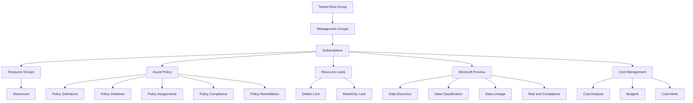

---

## Steps Performed

### Step 1: Reviewed Microsoft Purview Overview

Microsoft Learn was used to review Microsoft Purview as a family of data governance, risk, and compliance solutions.

Key concepts reviewed:

- Data governance
- Risk and compliance
- Automated data discovery
- Sensitive data classification
- End-to-end data lineage
- Governance across on-premises, multicloud, and SaaS data

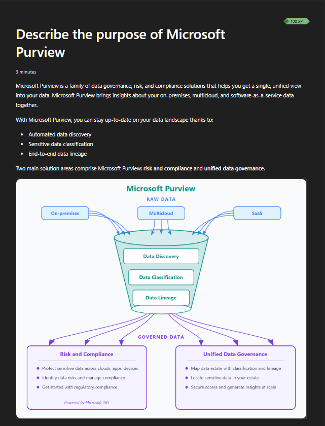

---

### Step 2: Reviewed Microsoft Purview Risk, Compliance, and Data Governance

Microsoft Learn was used to review Microsoft Purview solution areas.

Key concepts reviewed:

- Unified data governance
- Risk and compliance solutions
- Data discovery
- Data classification
- Data lineage
- Governance across multiple data environments

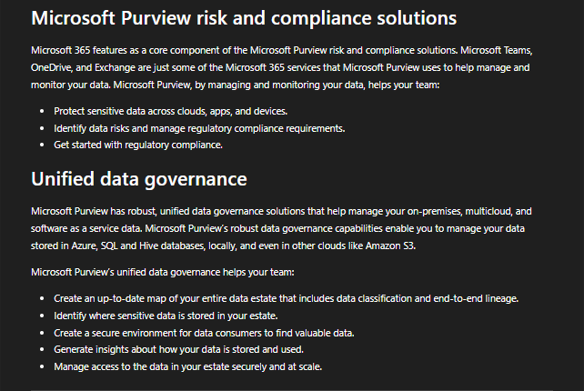

---

### Step 3: Reviewed Azure Policy Overview

Microsoft Learn was used to review the purpose of Azure Policy.

Key concepts reviewed:

- Creating policies
- Assigning policies
- Managing policies
- Auditing resource configurations
- Enforcing organizational standards
- Applying governance at scale

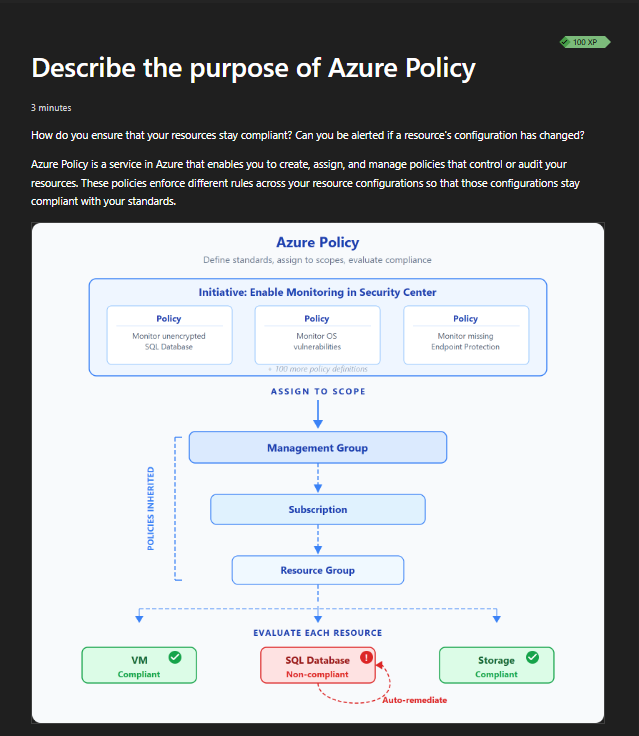

---

### Step 4: Reviewed Policy Definitions

Microsoft Learn was used to review policy definitions and compliance behavior.

Key concepts reviewed:

- Policy definitions
- Built-in policies
- Policy inheritance
- Policy evaluation
- Noncompliant resources
- Automatic remediation concepts
- Preventing noncompliant resources from being created

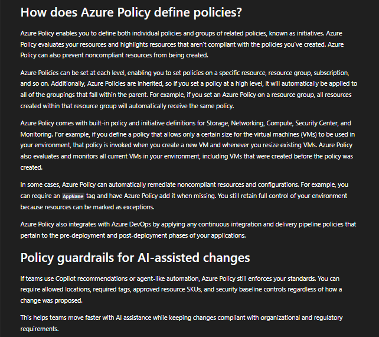

---

### Step 5: Reviewed Policy Initiatives

Microsoft Learn was used to review Azure Policy initiatives.

Key concepts reviewed:

- Grouping related policies together
- Tracking compliance for a larger goal
- Using built-in initiatives
- Reviewing examples such as monitoring, endpoint protection, and vulnerability-related policies

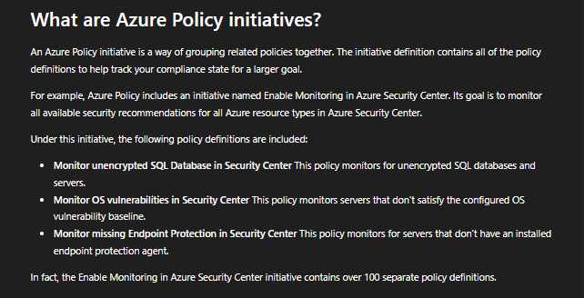

---

### Step 6: Reviewed Resource Locks

Microsoft Learn was used to review the purpose of resource locks.

Key concepts reviewed:

- Resource locks help prevent accidental deletion or modification
- Delete locks allow read and modify actions but block deletion
- ReadOnly locks allow reading but block modification and deletion
- Locks can be applied at resource, resource group, or subscription scope
- Locks are inherited by child resources
- Locks apply regardless of RBAC permissions

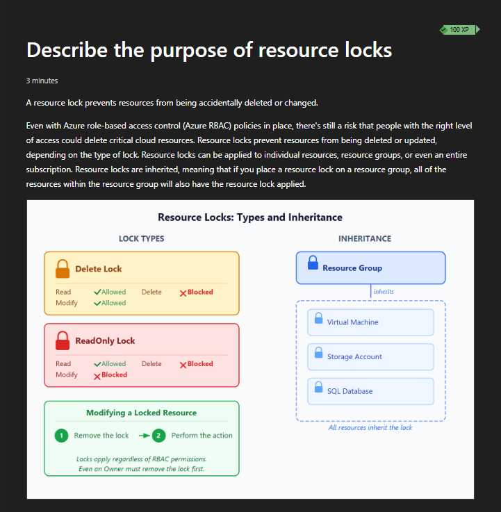

---

### Step 7: Reviewed Resource Lock Management

Microsoft Learn was used to review resource lock management methods.

Key concepts reviewed:

- Managing locks in the Azure portal
- Managing locks with PowerShell
- Managing locks with Azure CLI
- Managing locks with ARM templates
- Lock inheritance
- Lock modification and removal considerations

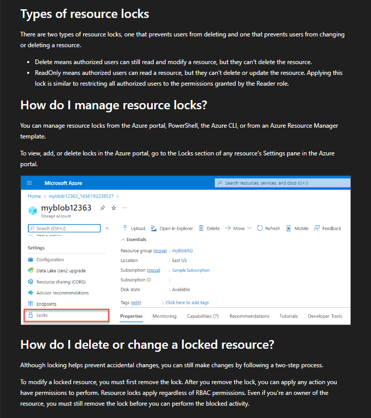

---

### Step 8: Reviewed Management Groups

Microsoft Learn was used to review management groups.

Key concepts reviewed:

- Management groups organize access, policy, and compliance across subscriptions
- Management groups support inherited role assignments
- Management groups support policy assignment across multiple subscriptions
- Management groups help structure enterprise governance

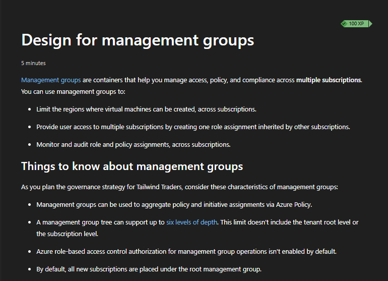

---

### Step 9: Reviewed Management Group Hierarchy Design

Microsoft Learn was used to review management group hierarchy design.

Key concepts reviewed:

- Tenant root group
- Subscription hierarchy
- Governance structure
- Policy inheritance
- Role assignment inheritance

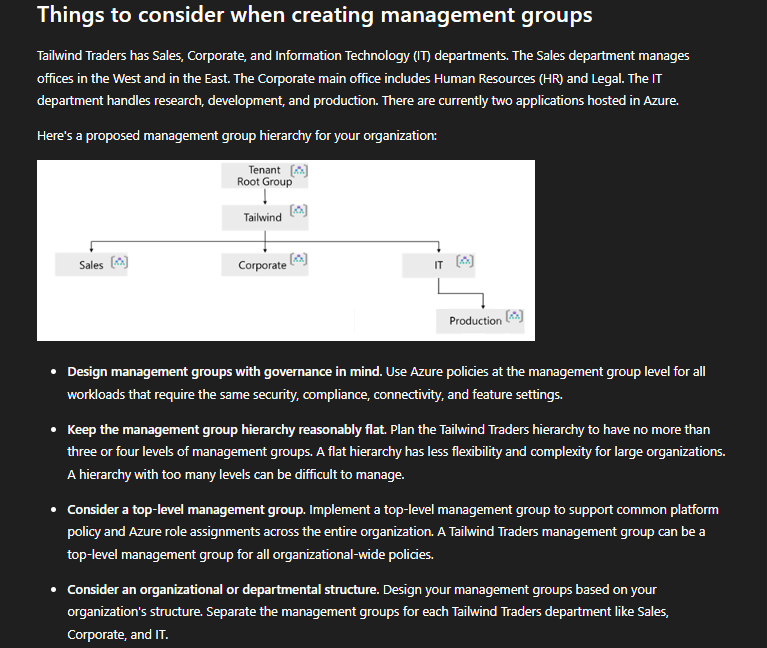

---

### Step 10: Reviewed Management Group Design Considerations

Microsoft Learn was used to review management group design patterns.

Key concepts reviewed:

- Department-based hierarchy
- Geography-based hierarchy
- Production hierarchy
- Sandbox hierarchy
- Sensitive-data hierarchy
- Governance planning before scale

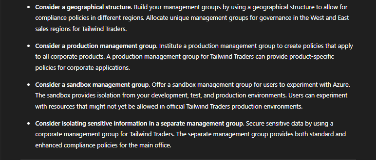

---

### Step 11: Opened Azure Policy Overview in the Azure Portal

The Azure Policy overview page was opened in the Azure Portal.

Reviewed:

- Policy compliance dashboard
- Initiative compliance
- Overall resource compliance
- Pending remediation
- Recommended assignments
- Built-in policy categories

No policy assignment was created.

No remediation was started.

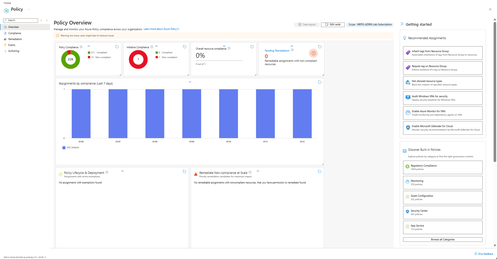

---

### Step 12: Opened Azure Policy Definitions

The Azure Policy Definitions page was opened in the Azure Portal.

Reviewed:

- Built-in policy definitions
- Policy categories
- Policy types
- Definition types
- Policy definition options
- Initiative definition options

No policy definition was created.

No initiative definition was created.

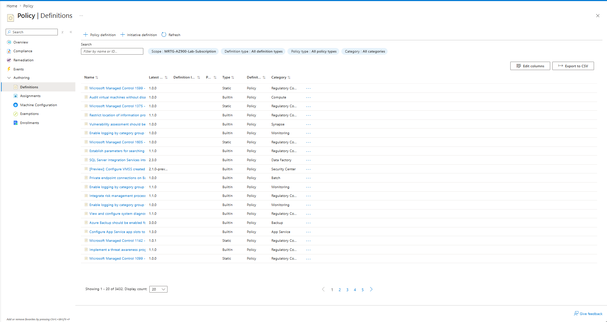

---

### Step 13: Opened Azure Policy Assignments

The Azure Policy Assignments page was opened in the Azure Portal.

Reviewed:

- Existing assignment count
- Existing initiative assignment count
- Direct policy assignment count
- Assignment scope
- ASC Default initiative assignment visibility

No policy assignment was created.

No initiative assignment was created.

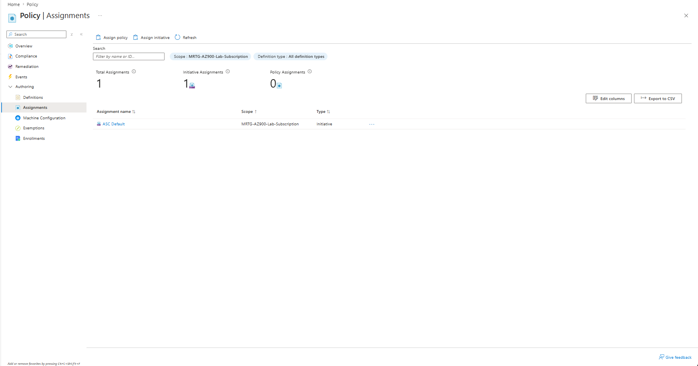

---

### Step 14: Opened Azure Policy Compliance

The Azure Policy Compliance page was opened in the Azure Portal.

Reviewed:

- Overall resource compliance
- Resources by compliance state
- Noncompliant initiatives
- Noncompliant policies
- Existing ASC Default compliance status

No remediation was started.

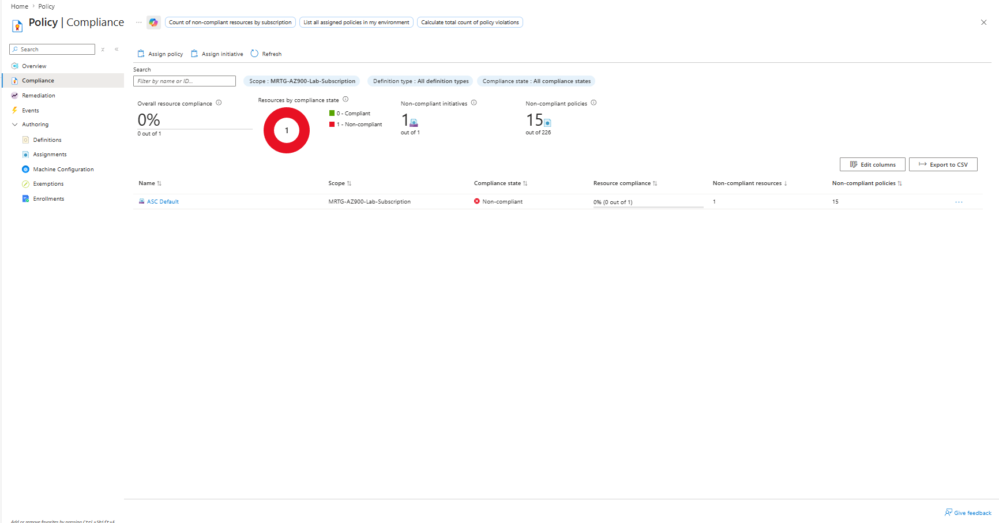

---

### Step 15: Opened Azure Policy Remediation

The Azure Policy Remediation page was opened in the Azure Portal.

Reviewed:

- Policies to remediate
- Remediation tasks
- Remediation availability

No remediation task was created.

No remediation was started.

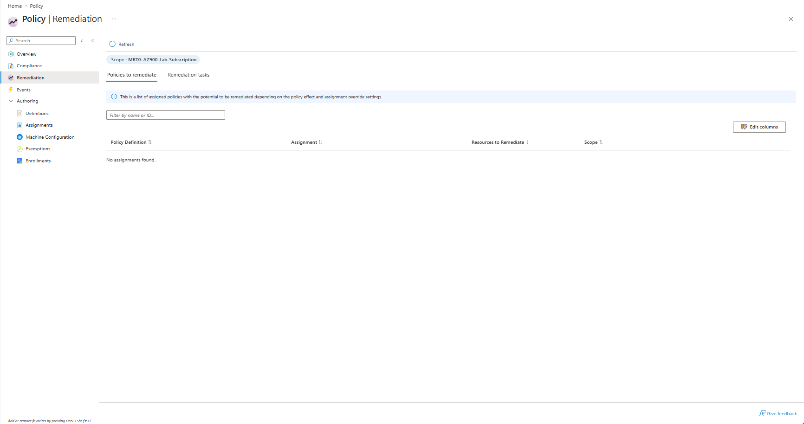

---

### Step 16: Opened Subscription Resource Locks

The subscription-level Resource Locks page was opened.

Reviewed:

- Lock name column
- Lock type column
- Scope column
- Notes column
- Add lock option

No lock was created.

No lock was deleted.

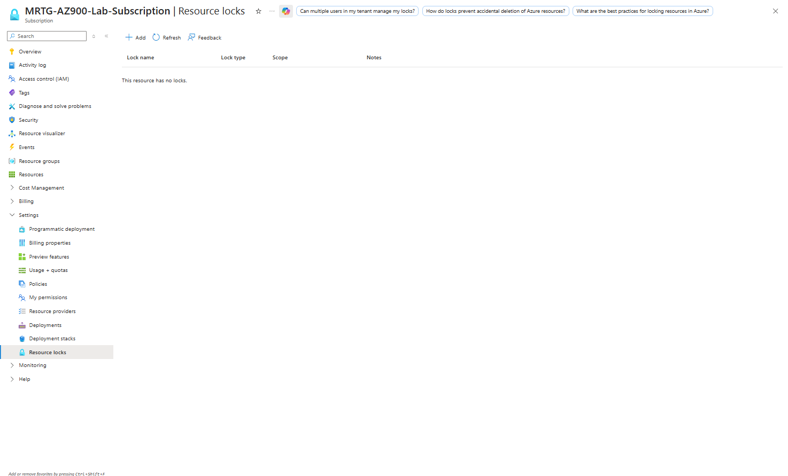

---

### Step 17: Opened Management Groups in the Azure Portal

The Management Groups page was opened in the Azure Portal.

Reviewed:

- Tenant Root Group
- Subscription placement under the tenant root group
- Management group hierarchy
- Create option
- Add subscription option

No management group was created.

No subscription was moved.

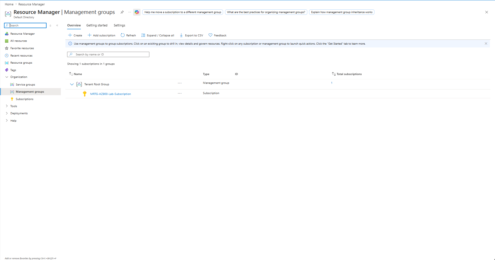

---

### Step 18: Opened Microsoft Purview Accounts

The Microsoft Purview accounts page was opened in the Azure Portal.

Reviewed:

- Microsoft Purview accounts blade
- Empty state showing no Purview accounts
- Create option

No Microsoft Purview account was created.

Directory and domain information were redacted before upload.

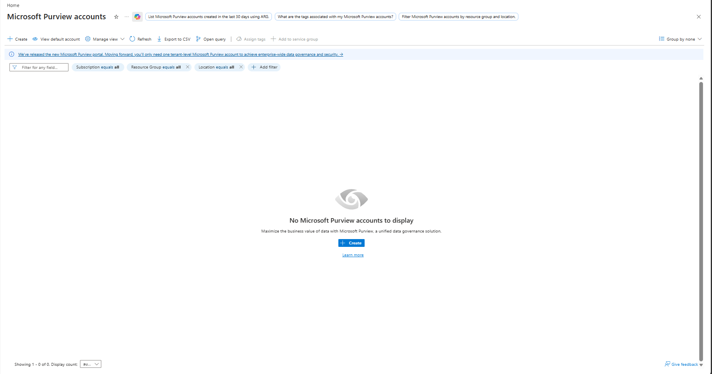

---

### Step 19: Validated Cost Analysis

Cost Analysis was opened to confirm that no cost was introduced during the lab.

Observed:

- No cost reported during the selected period
- No cost breakdown by service
- No cost breakdown by location
- No cost breakdown by subscription

Billing account information was redacted before upload.

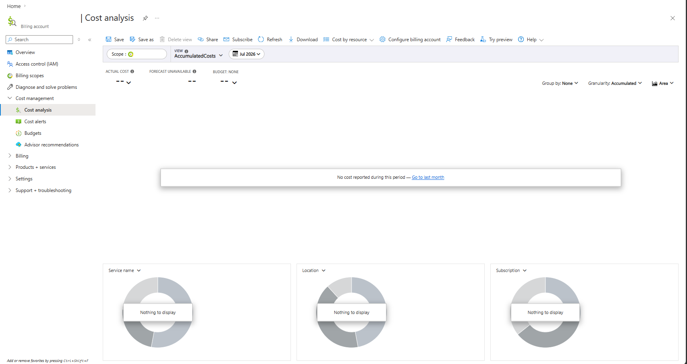

---

### Step 20: Validated Budget Protection

The subscription-level Budgets page was opened to confirm the existing monthly budget.

Observed:

- Existing budget: `mrtg-az900-monthly-budget`
- Budget amount: `$10.00`
- Forecasted cost: `0`
- Evaluated spend: `$0.00`
- Progress: `0.00%`

No budget was created.

No budget was modified.

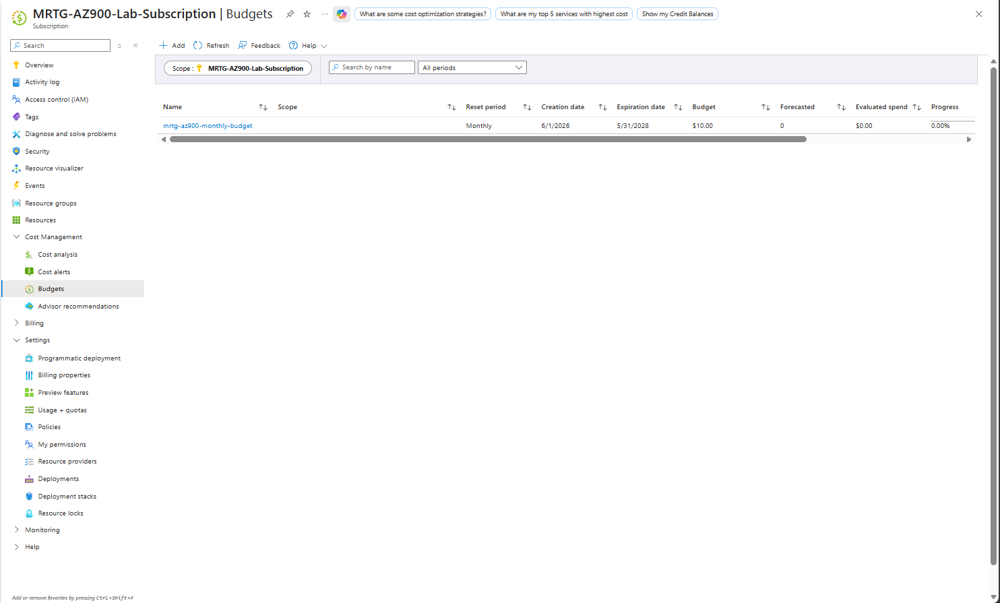

---

### Step 21: Validated Cost Alerts

The subscription-level Cost Alerts page was opened.

Observed:

- No cost alerts displayed
- No alert rule created
- No cost alert created

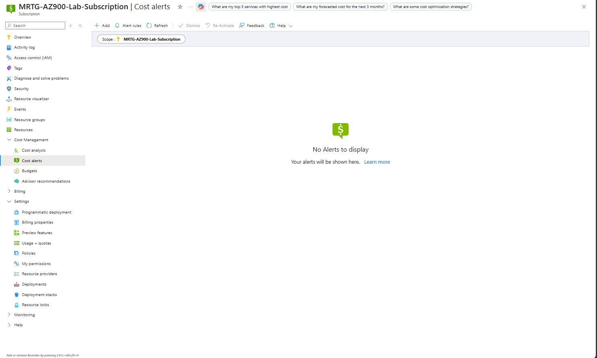

---

## Validation

| Validation Item | Expected Result | Actual Result |
|---|---|---|
| Microsoft Purview reviewed | Purview concepts documented | Passed |
| Azure Policy reviewed | Policy purpose documented | Passed |
| Policy definitions reviewed | Built-in definitions visible | Passed |
| Policy initiatives reviewed | Initiative concept documented | Passed |
| Policy assignments reviewed | Assignments page opened only | Passed |
| Policy compliance reviewed | Compliance page opened only | Passed |
| Policy remediation reviewed | Remediation page opened only | Passed |
| Resource locks reviewed | Locks page opened only | Passed |
| Management groups reviewed | Hierarchy visible | Passed |
| Purview account deployment avoided | No Purview account created | Passed |
| Policy assignment avoided | No policy assignment created | Passed |
| Lock creation avoided | No resource lock created | Passed |
| Management group creation avoided | No management group created | Passed |
| Remediation avoided | No remediation task created | Passed |
| Cost validated | No cost reported | Passed |
| Budget validated | `$10.00` budget remained active | Passed |
| Cost alerts validated | No alerts displayed | Passed |

---

## Completion Checklist

- [x] Reviewed Microsoft Purview
- [x] Reviewed Microsoft Purview risk and compliance solutions
- [x] Reviewed Microsoft Purview unified data governance
- [x] Reviewed Azure Policy
- [x] Reviewed policy definitions
- [x] Reviewed policy initiatives
- [x] Reviewed policy inheritance
- [x] Reviewed policy compliance
- [x] Reviewed policy remediation
- [x] Reviewed resource locks
- [x] Reviewed lock types
- [x] Reviewed lock inheritance
- [x] Reviewed management groups
- [x] Reviewed management group hierarchy design
- [x] Opened Azure Policy in the Azure Portal
- [x] Opened Policy Definitions
- [x] Opened Policy Assignments
- [x] Opened Policy Compliance
- [x] Opened Policy Remediation
- [x] Opened subscription Resource Locks
- [x] Opened Management Groups
- [x] Opened Microsoft Purview accounts
- [x] Validated Cost Analysis
- [x] Validated Budgets
- [x] Validated Cost Alerts
- [x] Confirmed no resources were deployed
- [x] Confirmed no governance settings were modified
- [x] Confirmed no unexpected cost

---

## AZ-900 Exam Objective Coverage

This lab supports AZ-900 knowledge areas related to:

- Azure governance and compliance tools
- Microsoft Purview
- Azure Policy
- Policy definitions
- Policy initiatives
- Policy assignments
- Policy compliance
- Policy remediation
- Resource locks
- Management groups
- Cost Management
- Budgets
- Cost alerts
- Cloud governance concepts

---

## Mini Objective Coverage

| Topic | Covered |
|---|---|
| Microsoft Purview | Yes |
| Risk and compliance | Yes |
| Unified data governance | Yes |
| Data discovery | Yes |
| Data classification | Yes |
| Data lineage | Yes |
| Azure Policy | Yes |
| Policy definitions | Yes |
| Policy initiatives | Yes |
| Policy assignments | Yes |
| Policy compliance | Yes |
| Policy remediation | Yes |
| Resource locks | Yes |
| Delete locks | Yes |
| ReadOnly locks | Yes |
| Management groups | Yes |
| Subscription hierarchy | Yes |
| Cost validation | Yes |
| Budget validation | Yes |
| Cost alert validation | Yes |

---

## IAM / Security Relevance

Governance and compliance are tightly connected to identity and access management.

This lab reinforced several IAM and security concepts:

- Policy helps enforce security standards across Azure resources.
- Management groups help apply governance across multiple subscriptions.
- Resource locks help prevent accidental or unauthorized destructive changes.
- Microsoft Purview helps identify and govern sensitive data.
- Compliance dashboards help teams identify configuration drift.
- Remediation workflows support operational response to noncompliant resources.
- RBAC controls access, but locks and policies add additional guardrails.
- Governance scope matters because assignments can inherit from higher levels.

In a government or regulated environment, these controls help support least privilege, audit readiness, data protection, operational consistency, and compliance reporting.

---

## Governance Notes

This lab was intentionally performed as a review-only activity.

No governance controls were created or changed.

The following actions were avoided:

- No Azure Policy definitions were created.
- No Azure Policy initiatives were created.
- No Azure Policy assignments were created.
- No remediation tasks were started.
- No resource locks were created.
- No management groups were created.
- No subscriptions were moved.
- No Microsoft Purview accounts were deployed.
- No budget changes were made.
- No cost alert rules were created.

This approach allowed governance capabilities to be reviewed safely without changing the lab environment.

---

## Cost Considerations

This lab was designed to avoid cost.

No billable governance resources were deployed.

Cost validation confirmed:

- No reported cost during the selected period
- Existing subscription budget remained active
- Evaluated spend remained `$0.00`
- Budget progress remained `0.00%`
- No cost alerts were displayed

---

## Troubleshooting Notes

| Issue | Resolution |
|---|---|
| Billing account scope showed no budgets | Navigated back to the subscription scope to validate the active lab budget |
| Cost Analysis showed billing account name | Redacted billing account name before saving final screenshot |
| Microsoft Purview portal displayed tenant information | Redacted directory and onmicrosoft.com information before saving final screenshot |
| Azure Policy showed existing ASC Default assignment | Treated as an existing default assignment and made no changes |
| Resource locks page had an Add option | Confirmed the option was visible but did not create a lock |
| Management Groups page had Create and Add subscription options | Confirmed the options were visible but did not create or move anything |

---

## What I Would Do Differently in Production

In a production environment, governance planning would require a formal design before policies, locks, or management groups are applied.

Production considerations would include:

- Define a management group hierarchy before adding subscriptions.
- Separate production, development, sandbox, and sensitive workloads.
- Use Azure Policy to enforce required tags.
- Use Azure Policy to restrict allowed regions.
- Use Azure Policy to restrict public exposure.
- Use Azure Policy to require approved SKUs.
- Assign policies at the highest appropriate scope.
- Test policies in audit mode before enforcing deny effects.
- Use initiatives for broader compliance frameworks.
- Use remediation carefully with change control.
- Apply resource locks only to critical resources.
- Document lock ownership and removal procedures.
- Use Microsoft Purview for sensitive data discovery and classification.
- Monitor compliance drift regularly.
- Review governance assignments through access reviews and change management.
- Use Infrastructure as Code for repeatable governance deployment.

---

## Lessons Learned

This lab reinforced that governance is not a single Azure feature. It is a combination of policy, hierarchy, compliance visibility, resource protection, data governance, and cost validation.

Key takeaways:

- Azure Policy helps enforce or audit standards across Azure resources.
- Policy definitions describe individual rules.
- Initiatives group related policies together.
- Compliance dashboards help identify noncompliant resources.
- Remediation provides a path to correct some noncompliant configurations.
- Resource locks protect resources from accidental deletion or modification.
- Management groups help scale governance across subscriptions.
- Microsoft Purview supports data governance, classification, lineage, risk, and compliance.
- Cost validation should still be performed after governance labs.
- Governance controls must be planned carefully because they can affect large scopes.

---

## Cleanup

No cleanup was required because no resources were created.

No policy assignments, locks, management groups, Purview accounts, or remediation tasks were created during this lab.

---

## Outcome

Lab 10 successfully documented Azure governance, policy, and compliance capabilities.

The lab demonstrated how Azure supports:

- Data governance through Microsoft Purview
- Standard enforcement through Azure Policy
- Compliance visibility through Policy Compliance
- Grouped compliance goals through initiatives
- Accidental change protection through resource locks
- Enterprise hierarchy through management groups
- Cost safety through Cost Management, Budgets, and Cost Alerts

The subscription remained protected by the existing monthly budget, and no unexpected cost was introduced.

---

## Screenshot Inventory

| Screenshot | Description |
|---|---|
| `01-microsoft-purview-overview.png` | Microsoft Purview overview from Microsoft Learn |
| `02-microsoft-purview-risk-compliance-and-data-governance.png` | Purview risk, compliance, and unified data governance overview |
| `03-azure-policy-overview.png` | Azure Policy purpose and scope overview |
| `04-policy-definitions-overview.png` | Azure Policy definitions, inheritance, compliance, and remediation concepts |
| `05-policy-initiatives-overview.png` | Azure Policy initiatives overview |
| `06-resource-locks-overview.png` | Resource locks purpose, lock types, and inheritance |
| `07-resource-locks-management-overview.png` | Resource lock management and lock modification process |
| `08-management-groups-overview.png` | Management group purpose and key characteristics |
| `09-management-group-hierarchy-design-overview.png` | Management group hierarchy design example |
| `10-management-group-design-considerations.png` | Management group design patterns and considerations |
| `11-azure-policy-overview-portal.png` | Azure Policy overview dashboard in the Azure Portal |
| `12-policy-definitions-portal.png` | Azure Policy Definitions page in the Azure Portal |
| `13-policy-assignments-portal.png` | Azure Policy Assignments page in the Azure Portal |
| `14-policy-compliance-portal.png` | Azure Policy Compliance page in the Azure Portal |
| `15-policy-remediation-portal.png` | Azure Policy Remediation page in the Azure Portal |
| `16-subscription-resource-locks-portal.png` | Subscription Resource Locks page in the Azure Portal |
| `17-management-groups-portal.png` | Management Groups page in the Azure Portal |
| `18-microsoft-purview-portal.png` | Microsoft Purview accounts page in the Azure Portal |
| `19-final-cost-analysis.png` | Final Cost Analysis validation |
| `20-final-budget-validation.png` | Final subscription budget validation |
| `21-final-cost-alerts.png` | Final Cost Alerts validation |

---

## Screenshots

### Microsoft Purview Overview


### Microsoft Purview Risk, Compliance, and Data Governance


### Azure Policy Overview


### Policy Definitions Overview


### Policy Initiatives Overview


### Resource Locks Overview


### Resource Locks Management Overview


### Management Groups Overview


### Management Group Hierarchy Design Overview


### Management Group Design Considerations


### Azure Policy Overview Portal


### Policy Definitions Portal


### Policy Assignments Portal


### Policy Compliance Portal


### Policy Remediation Portal


### Subscription Resource Locks Portal


### Management Groups Portal


### Microsoft Purview Portal


### Final Cost Analysis


### Final Budget Validation


### Final Cost Alerts


---

## Next Lab

The next lab will be:

```text
Lab 11 - Azure Management and Deployment Tools
```

Lab 11 will focus on Azure Portal, Cloud Shell, Azure CLI, Azure PowerShell, ARM templates, Infrastructure as Code concepts, and Azure Arc.
```
