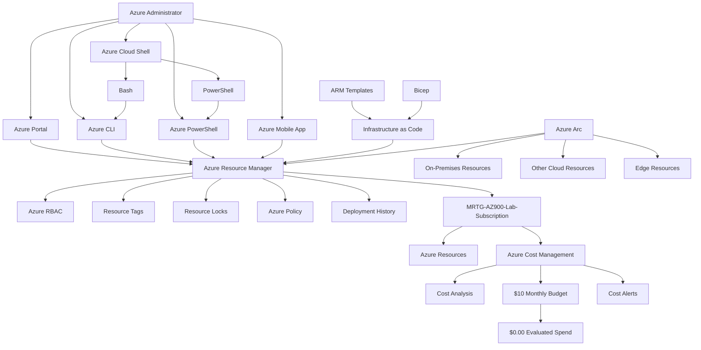
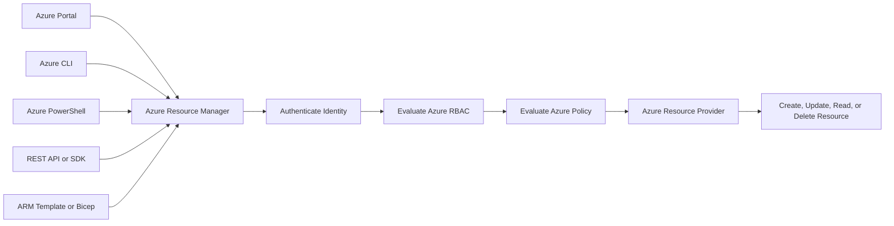
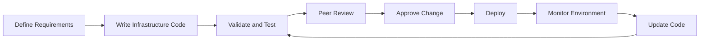

# Lab 11 - Azure Management and Deployment Tools

## Objective

Document the Microsoft Azure management and deployment tools used to create, configure, automate, govern, and monitor Azure resources.

By completing this lab, I:

- Reviewed the Azure Portal
- Reviewed Azure Cloud Shell
- Reviewed Azure CLI
- Reviewed Azure PowerShell
- Reviewed Azure Resource Manager
- Reviewed ARM templates
- Reviewed Bicep concepts
- Reviewed Infrastructure as Code
- Reviewed Azure Arc
- Reviewed the Azure Mobile App
- Reviewed subscription deployment history
- Reviewed the Azure Custom Deployment interface
- Validated Azure management services without deploying resources
- Confirmed that no resources, deployments, or management configurations were changed
- Confirmed that evaluated Azure spend remained `$0.00`

This was a discovery-only lab. No resources were created, deployed, modified, onboarded, or deleted.

---

## Business Problem Solved

Organizations need reliable and repeatable methods for managing cloud infrastructure across users, teams, subscriptions, environments, and geographic locations.

Relying only on manual configuration can create:

- Inconsistent deployments
- Configuration drift
- Weak change control
- Difficult troubleshooting
- Limited deployment history
- Repeated administrative effort
- Unclear ownership
- Unauthorized resource creation
- Poor documentation
- Increased security risk
- Unexpected cloud spending

Monroe Redstone Technology Group needed to understand the management tools available in Azure before deploying larger workloads.

This lab addressed the following questions:

- How can administrators manage Azure through a graphical interface?
- How can Azure commands be executed from a browser?
- What is the difference between Azure CLI and Azure PowerShell?
- What role does Azure Resource Manager perform?
- How do ARM templates support repeatable deployments?
- How does Bicep simplify Azure infrastructure definitions?
- What is Infrastructure as Code?
- How can Azure manage hybrid and multicloud resources?
- How can administrators monitor Azure from mobile devices?
- Where can deployment history be reviewed?
- How can management tools be explored without creating cost?

This lab established the management and deployment foundation required for consistent Azure administration.

---

## Scenario

MRTG is preparing to deploy and manage additional Azure workloads.

Before creating resources, the cloud operations team must understand the tools available for:

- Graphical administration
- Browser-based command-line access
- Cross-platform scripting
- PowerShell automation
- Declarative resource deployment
- Infrastructure version control
- Hybrid and multicloud management
- Mobile monitoring
- Deployment-history review
- Cost-safe administration

The team reviews Microsoft Learn content and explores related Azure Portal interfaces.

No Cloud Shell storage account, ARM deployment, Bicep deployment, Azure Arc resource, resource group, virtual machine, storage account, or other Azure resource is created.

---

## Azure Services and Resources Used

| Azure Service, Resource, or Feature | Purpose |
|---|---|
| Microsoft Learn | Provided certification-aligned management and deployment instruction |
| Azure Portal | Provided browser-based graphical Azure administration |
| Azure Cloud Shell | Provided browser-based Bash and PowerShell access |
| Azure CLI | Provided cross-platform command-line Azure management |
| Azure PowerShell | Provided PowerShell-based Azure administration |
| Azure Resource Manager | Provided the Azure management and deployment layer |
| ARM Templates | Provided declarative JSON-based resource definitions |
| Bicep | Provided a simplified declarative language for Azure deployments |
| Infrastructure as Code | Supported repeatable, version-controlled infrastructure management |
| Azure Deployments | Displayed Azure Resource Manager deployment history |
| Custom Deployment | Provided an interface for deploying ARM templates |
| Azure Arc | Extended Azure management to hybrid, multicloud, and edge resources |
| Azure Mobile App | Supported mobile monitoring and selected management operations |
| Azure Cost Management | Supported final spending validation |
| Azure Budgets | Confirmed that the subscription-level budget remained active |
| Cost Alerts | Confirmed that no cost alerts were displayed |

---

## Why These Services Were Used

### Microsoft Learn

Microsoft Learn was used as the primary certification-aligned source for Azure management and deployment concepts.

It provided structured coverage of:

- Azure Portal
- Azure Cloud Shell
- Azure CLI
- Azure PowerShell
- Azure Resource Manager
- ARM templates
- Bicep
- Infrastructure as Code
- Azure Arc
- Azure Mobile App

### Azure Portal

The Azure Portal provides a browser-based graphical interface for Azure administration.

It can be used to:

- Create resources
- Configure resources
- Review subscriptions
- Manage identity and access
- Review deployments
- Configure governance
- Review monitoring information
- Review Cost Management
- Open Azure Cloud Shell

The Azure Portal is useful for interactive administration and service discovery.

Manual Portal configuration can become difficult to reproduce at scale, making Infrastructure as Code preferable for repeatable production deployments.

### Azure Cloud Shell

Azure Cloud Shell provides an authenticated browser-based shell experience.

It supports:

- Bash
- PowerShell
- Azure CLI
- Azure PowerShell
- Common cloud-management tools
- Access through the Azure Portal
- Access without installing tools locally

Cloud Shell may use temporary session storage or mounted persistent storage depending on the selected configuration.

No Cloud Shell storage account was created or mounted during this lab.

### Azure CLI

Azure CLI is a cross-platform command-line tool for managing Azure.

It can be used:

- Interactively
- In scripts
- In automation pipelines
- Through Azure Cloud Shell
- From locally installed terminals
- Across Windows, Linux, and macOS

Azure CLI commands commonly use the `az` command structure.

Example:

```bash
az group list
```

No Azure CLI command was executed against the MRTG environment during this lab.

### Azure PowerShell

Azure PowerShell is a collection of Microsoft PowerShell modules for Azure administration.

It can be used:

- Interactively
- In scripts
- Through Azure Cloud Shell
- From a local PowerShell installation
- In administrative automation

Azure PowerShell commands commonly use approved PowerShell verb-noun naming.

Example:

```powershell
Get-AzResourceGroup
```

No Azure PowerShell command was executed against the MRTG environment during this lab.

### Azure Resource Manager

Azure Resource Manager is the Azure management and deployment layer.

Management requests from tools such as the following are processed through Azure Resource Manager:

- Azure Portal
- Azure CLI
- Azure PowerShell
- REST APIs
- Software development kits
- ARM templates
- Bicep

Azure Resource Manager supports:

- Resource creation
- Resource updates
- Resource deletion
- Azure RBAC
- Resource tags
- Resource locks
- Policy integration
- Deployment history
- Declarative infrastructure deployment

### ARM Templates

ARM templates are declarative JSON files that define Azure infrastructure and configuration.

ARM templates can support:

- Repeatable deployments
- Dependency management
- Parameterization
- Consistent configuration
- Source control
- Automated deployment
- Deployment validation
- Environment standardization

A declarative template describes the desired result rather than listing every manual step required to reach that result.

### Bicep

Bicep is a declarative language for deploying Azure resources through Azure Resource Manager.

It provides a more concise authoring experience than raw ARM template JSON.

Bicep can support:

- Parameters
- Variables
- Modules
- Resource dependencies
- Reusable infrastructure definitions
- Source control
- Repeatable Azure deployments

No Bicep file or deployment was created during this lab.

### Infrastructure as Code

Infrastructure as Code manages infrastructure through versioned configuration files.

It can support:

- Repeatability
- Consistency
- Source control
- Peer review
- Change history
- Automated testing
- Environment standardization
- Faster recovery
- Reduced manual configuration

Infrastructure as Code does not eliminate the need for security review, testing, approval, monitoring, or rollback planning.

### Azure Arc

Azure Arc extends Azure management and governance capabilities to supported resources outside Azure.

Azure Arc can support:

- On-premises servers
- Other cloud environments
- Kubernetes clusters
- Data services
- Edge environments
- Centralized inventory
- Azure Policy integration
- Monitoring
- Security management
- Azure Resource Manager organization

No server, cluster, database, or other resource was onboarded to Azure Arc during this lab.

### Azure Mobile App

The Azure Mobile App supports monitoring and selected administration from a mobile device.

It can provide access to:

- Resource status
- Health information
- Performance information
- Alerts
- Notifications
- Azure Cloud Shell
- Selected management operations

Mobile administrative access should be protected with Microsoft Entra authentication, multifactor authentication, secure device configuration, and least privilege.

### Azure Deployments

The subscription-level Deployments page provides visibility into Azure Resource Manager deployment history.

Deployment information can include:

- Deployment name
- Status
- Timestamp
- Duration
- Related events
- Deployment operations
- Template information

No deployments were displayed or initiated during this lab.

### Custom Deployment

The Custom Deployment interface provides access to:

- Custom ARM templates
- Azure Quickstart Templates
- Template Specs
- Template editing
- Parameter entry
- Validation
- Deployment review

The interface was reviewed without selecting or deploying a template.

### Azure Cost Management

Azure Cost Management was reviewed to confirm that management-tool discovery did not introduce spending.

### Azure Budgets

The existing monthly budget provided evidence that:

- The `$10.00` monthly budget remained active
- Forecasted cost remained `0`
- Evaluated spend remained `$0.00`
- Budget progress remained `0.00%`

### Cost Alerts

The subscription-level Cost Alerts page was reviewed to confirm that no cost alerts were displayed.

---

## Environment

| Item | Value |
|---|---|
| Organization | Monroe Redstone Technology Group |
| Project | MRTG Azure Fundamentals: The Bridge |
| Lab | Lab 11 - Azure Management and Deployment Tools |
| Cloud Platform | Microsoft Azure |
| Management Interface | Azure Portal |
| Learning Platform | Microsoft Learn |
| Subscription | `MRTG-AZ900-Lab-Subscription` |
| Cloud Shell Sessions Started | None |
| Cloud Shell Storage Created | None |
| Cloud Shell Storage Mounted | None |
| Azure CLI Commands Executed | None |
| Azure PowerShell Commands Executed | None |
| ARM Template Deployments Created | None |
| Bicep Deployments Created | None |
| Azure Arc Resources Created | None |
| Resources Created | None |
| Resources Modified | None |
| Resources Deleted | None |
| Monthly Budget | `$10.00` |
| Evaluated Spend | `$0.00` |
| Budget Progress | `0.00%` |
| Documentation Platform | GitHub |
| Lab Type | Discovery-only |
| Estimated Cost | `$0.00` |

---

## Architecture / Concept Diagram



---

## Steps Performed

### Step 1: Review the Azure Portal

1. Opened Microsoft Learn.
2. Reviewed the purpose of the Azure Portal.
3. Documented the Azure Portal as a web-based unified console.
4. Reviewed how the Portal can be used to:
   - Create resources
   - Configure resources
   - Monitor resources
   - Manage subscriptions
   - Review identity and access
   - Access management services
5. Reviewed Portal resiliency and availability concepts.


**Validation:** Microsoft Learn described the Azure Portal as a browser-based interface for creating, managing, and monitoring Azure resources.

---

### Step 2: Review Azure Cloud Shell

1. Opened the Azure Cloud Shell section.
2. Documented Azure Cloud Shell as a browser-based terminal.
3. Reviewed:
   - Authenticated Azure access
   - Bash support
   - PowerShell support
   - Preinstalled management tools
   - Azure Portal integration
4. Documented that Cloud Shell can reduce local tool-installation requirements.


**Validation:** Microsoft Learn described Azure Cloud Shell as an authenticated browser-based shell supporting Bash and PowerShell.

---

### Step 3: Review Azure CLI

1. Opened the Azure CLI section.
2. Documented Azure CLI as a cross-platform Azure management tool.
3. Reviewed:
   - Interactive command execution
   - Scripted administration
   - Local installation
   - Cloud Shell access
   - Automation use cases
4. Confirmed that no Azure CLI command was executed during the lab.


**Validation:** Microsoft Learn described Azure CLI as a cross-platform command-line tool for interactive and scripted Azure administration.

---

### Step 4: Review Azure PowerShell

1. Opened the Azure PowerShell section.
2. Documented Azure PowerShell as a collection of Microsoft PowerShell modules.
3. Reviewed:
   - Interactive administration
   - Scripted administration
   - Local installation
   - Cloud Shell access
   - Automation use cases
4. Confirmed that no Azure PowerShell command was executed during the lab.


**Validation:** Microsoft Learn described Azure PowerShell as a PowerShell-based Azure administration tool.

---

### Step 5: Review Azure Resource Manager

1. Opened the Azure Resource Manager section.
2. Documented Azure Resource Manager as the Azure management and deployment service.
3. Reviewed how Azure Resource Manager supports:
   - Creating resources
   - Updating resources
   - Deleting resources
   - Azure RBAC
   - Resource locks
   - Resource tags
   - Deployment history
4. Connected Azure management tools to the Azure Resource Manager control plane.


**Validation:** Microsoft Learn described Azure Resource Manager as the management layer used to deploy and administer Azure resources.

---

### Step 6: Review ARM Templates

1. Opened the ARM templates section.
2. Documented ARM templates as declarative JSON files.
3. Reviewed:
   - Infrastructure as Code
   - Repeatable deployment
   - Parameters
   - Resource definitions
   - Dependencies
   - Source control
4. Reviewed Bicep as a more concise authoring option for Azure Resource Manager deployments.
5. Confirmed that no template was created or deployed.


**Validation:** Microsoft Learn described ARM templates as declarative and repeatable Azure infrastructure definitions.

---

### Step 7: Review Infrastructure as Code

1. Opened the Infrastructure as Code section.
2. Documented Infrastructure as Code as the practice of managing infrastructure through configuration files.
3. Reviewed:
   - Version control
   - Descriptive configuration
   - Repeatability
   - Automation
   - Consistency
   - DevOps integration
4. Connected Infrastructure as Code to reliable Azure deployment at scale.


**Validation:** Microsoft Learn described Infrastructure as Code as a versioned and repeatable method for defining infrastructure.

---

### Step 8: Review Azure Arc

1. Opened the Azure Arc section.
2. Documented Azure Arc as a hybrid, multicloud, and edge management service.
3. Reviewed supported use cases involving:
   - On-premises machines
   - Other cloud environments
   - Kubernetes clusters
   - Databases
   - Edge systems
4. Reviewed how Azure Arc projects supported non-Azure resources into Azure Resource Manager.
5. Confirmed that no resource was onboarded.


**Validation:** Microsoft Learn described Azure Arc as a centralized governance and management platform for hybrid, multicloud, and edge resources.

---

### Step 9: Review the Azure Mobile App

1. Opened the Azure Mobile App section.
2. Reviewed mobile capabilities involving:
   - Resource status
   - Health
   - Performance
   - Notifications
   - Alerts
   - Common resource operations
   - Azure Cloud Shell
3. Reviewed Microsoft Entra authentication and multifactor authentication support.
4. Documented mobile administration as a convenience that still requires strong identity and device security.


**Validation:** Microsoft Learn described the Azure Mobile App and its monitoring, notification, Cloud Shell, and management capabilities.

---

### Step 10: Review the Azure Portal Home Page

1. Opened the Azure Portal.
2. Reviewed:
   - Navigation menu
   - Global search
   - Common service shortcuts
   - Create a resource
   - Template deployment
   - Cost Management and Billing
3. Confirmed that no resource-creation workflow was completed.
4. Redacted sensitive account and directory information.


**Validation:** The Azure Portal home page displayed common Azure management and deployment entry points.

---

### Step 11: Review the Cloud Shell Launcher

1. Selected the Cloud Shell icon in the Azure Portal header.
2. Reviewed:
   - Bash
   - PowerShell
   - Browser-based shell access
3. Did not begin an administrative command workflow.
4. Did not execute commands against Azure resources.


**Validation:** The Azure Portal displayed the Azure Cloud Shell Bash and PowerShell options.

---

### Step 12: Review the Cloud Shell Storage Prompt

1. Continued into the Cloud Shell setup interface.
2. Reviewed:
   - No storage account required option
   - Mount storage account option
   - Subscription selection
   - Setup confirmation
3. Did not create a storage account.
4. Did not mount persistent storage.
5. Did not create a Cloud Shell resource.
6. Redacted sensitive subscription information.


**Validation:** The Cloud Shell setup interface was reviewed without creating or mounting storage.

---

### Step 13: Review Subscription Deployment History

1. Opened `MRTG-AZ900-Lab-Subscription`.
2. Opened **Deployments**.
3. Reviewed deployment-history fields:
   - Deployment name
   - Status
   - Last modified
   - Duration
   - Related events
4. Confirmed that no deployments were displayed.
5. Did not begin a deployment or redeployment.
6. Redacted sensitive scope information.


**Validation:** The subscription Deployments page displayed no Azure Resource Manager deployments.

---

### Step 14: Review the Custom Deployment Interface

1. Opened **Custom deployment**.
2. Reviewed:
   - Build your own template
   - Common templates
   - Quickstart templates
   - Template Specs
   - Basics
   - Review and create
3. Did not select a deployment template.
4. Did not enter deployment parameters.
5. Did not validate or deploy a template.
6. Did not create an Azure resource.


**Validation:** The Custom Deployment interface was reviewed without beginning an ARM template deployment.

---

### Step 15: Review Azure Arc in the Azure Portal

1. Opened Azure Arc.
2. Reviewed:
   - Azure Arc overview
   - Machine onboarding
   - Hybrid management
   - Multicloud management
   - Edge management
3. Did not onboard:
   - A server
   - A virtual machine
   - A Kubernetes cluster
   - A database
   - A data service
4. Did not create an Azure Arc resource.


**Validation:** The Azure Portal displayed Azure Arc onboarding options without any resource being onboarded.

---

### Step 16: Perform Final Cost Analysis

1. Opened Azure Cost Management.
2. Opened **Cost Analysis**.
3. Reviewed the selected period.
4. Confirmed:
   - No reported cost
   - No service cost breakdown
   - No location cost breakdown
   - No subscription cost breakdown
5. Did not save, export, subscribe to, or download cost information.
6. Redacted the billing-account name.


**Validation:** Azure Cost Analysis displayed no reported cost for the selected period.

---

### Step 17: Validate the Existing Monthly Budget

1. Opened the subscription-level **Budgets** page.
2. Located `mrtg-az900-monthly-budget`.
3. Confirmed:
   - Budget amount of `$10.00`
   - Forecasted cost of `0`
   - Evaluated spend of `$0.00`
   - Budget progress of `0.00%`
4. Did not create or modify a budget.
5. Redacted the subscription ID and sensitive scope information.


**Validation:** The existing monthly budget remained active with `$0.00` evaluated spend and `0.00%` progress.

---

### Step 18: Validate Cost Alerts

1. Opened the subscription-level **Cost alerts** page.
2. Confirmed that no cost alerts were displayed.
3. Did not create an alert.
4. Did not create or modify an alert rule.
5. Did not change notification recipients.


**Validation:** The Azure Portal displayed no subscription-level cost alerts.

---

## Azure Management Tools Summary

| Management Tool | Primary Use | Interface Type |
|---|---|---|
| Azure Portal | Interactive graphical administration | Web interface |
| Azure Cloud Shell | Browser-based command-line administration | Bash or PowerShell |
| Azure CLI | Cross-platform Azure command-line management | Command line |
| Azure PowerShell | PowerShell-based Azure administration | PowerShell |
| Azure Resource Manager | Azure resource management and deployment layer | Control plane |
| ARM Templates | Declarative JSON-based Azure deployment | Infrastructure as Code |
| Bicep | Concise declarative Azure deployment language | Infrastructure as Code |
| Azure Arc | Hybrid, multicloud, and edge management | Azure Resource Manager integration |
| Azure Mobile App | Mobile monitoring and selected administration | Mobile application |

---

## Management Tool Selection Mental Model

```text
Azure Portal
Use for visual, interactive Azure administration.

Azure Cloud Shell
Use for browser-based Bash or PowerShell access.

Azure CLI
Use for cross-platform command-line administration and scripting.

Azure PowerShell
Use for PowerShell-based administration and automation.

Azure Resource Manager
Use as the management and deployment layer for Azure resources.

ARM Templates
Use for declarative JSON-based Azure deployments.

Bicep
Use for concise and reusable declarative Azure deployments.

Infrastructure as Code
Use for repeatable, version-controlled infrastructure management.

Azure Arc
Use to extend Azure management to supported non-Azure resources.

Azure Mobile App
Use for mobile monitoring, alerts, and selected management tasks.
```

---

## Azure CLI vs Azure PowerShell

| Area | Azure CLI | Azure PowerShell |
|---|---|---|
| Command style | `az` commands | PowerShell cmdlets |
| Example | `az group list` | `Get-AzResourceGroup` |
| Cross-platform | Yes | Yes with supported PowerShell versions |
| Interactive use | Yes | Yes |
| Scripted use | Yes | Yes |
| Cloud Shell support | Bash or PowerShell session | PowerShell session |
| Common audience | Administrators, developers, DevOps teams | Windows and PowerShell administrators, automation teams |

Both tools communicate with Azure management services and require appropriate authentication and authorization.

---

## Imperative vs Declarative Management

### Imperative Management

Imperative management describes the commands or steps required to reach a result.

Example:

```bash
az group create \
  --name rg-example-centralus-001 \
  --location centralus
```

### Declarative Management

Declarative management describes the desired final state.

Example:

```bicep
resource resourceGroupExample 'Microsoft.Resources/resourceGroups@2024-03-01' = {
  name: 'rg-example-centralus-001'
  location: 'centralus'
}
```

### Comparison

| Management Style | Focus |
|---|---|
| Imperative | How to perform the task |
| Declarative | What the final environment should contain |

Declarative management is commonly used for repeatable Infrastructure as Code deployments.

---

## Azure Resource Manager Request Flow



Azure Resource Manager provides a consistent control plane regardless of the management interface used.

---

## ARM Template and Bicep Comparison

| Area | ARM Template | Bicep |
|---|---|---|
| File format | JSON | Bicep language |
| Syntax length | More verbose | More concise |
| Declarative | Yes | Yes |
| Azure Resource Manager deployment | Yes | Yes |
| Parameters | Supported | Supported |
| Modules | Supported through linked or nested templates | Native module support |
| Source control | Supported | Supported |
| Repeatable deployment | Supported | Supported |

Bicep deployments are processed through Azure Resource Manager.

---

## Infrastructure as Code Lifecycle



### Infrastructure as Code Benefits

Infrastructure as Code can improve:

- Repeatability
- Consistency
- Change tracking
- Documentation
- Peer review
- Automation
- Recovery
- Environment replication
- Governance
- Deployment speed

### Infrastructure as Code Risks

Infrastructure as Code can also deploy mistakes consistently and at scale.

Templates and pipelines require:

- Security review
- Testing
- Least privilege
- Secret protection
- Approval
- Monitoring
- Rollback planning

---

## Azure Arc Summary

Azure Arc projects supported external resources into Azure Resource Manager.

Potential Azure Arc resource types include:

- Servers
- Kubernetes clusters
- Data services
- VMware environments
- System Center Virtual Machine Manager environments
- Edge systems

Azure Arc can extend supported Azure capabilities involving:

- Inventory
- Tags
- Azure Policy
- Monitoring
- Security
- Configuration
- Resource organization
- Azure RBAC

Azure Arc does not move every connected resource into an Azure datacenter.

It extends Azure management capabilities to resources that remain in their existing environments.

---

## Deployment History

Azure Resource Manager deployment history can help administrators review:

- Who initiated a deployment
- When the deployment occurred
- Whether the deployment succeeded
- Which resources were affected
- Which template was used
- Which operations failed
- Which error messages were generated

Deployment history supports troubleshooting and auditing but does not replace:

- Source control
- Change tickets
- Approval records
- Activity logs
- Centralized monitoring
- Infrastructure documentation

---

## Validation

| Validation Item | Expected Result | Actual Result |
|---|---|---|
| Azure Portal | Graphical management concepts are reviewed | Passed |
| Azure Cloud Shell | Browser-based shell concepts are reviewed | Passed |
| Azure CLI | Cross-platform command-line management is reviewed | Passed |
| Azure PowerShell | PowerShell-based management is reviewed | Passed |
| Azure Resource Manager | Azure management-layer concepts are reviewed | Passed |
| ARM templates | Declarative JSON deployment is reviewed | Passed |
| Bicep | Simplified declarative deployment concepts are reviewed | Passed |
| Infrastructure as Code | Repeatable infrastructure management is reviewed | Passed |
| Azure Arc | Hybrid, multicloud, and edge management is reviewed | Passed |
| Azure Mobile App | Mobile monitoring and management are reviewed | Passed |
| Azure Portal home | Common navigation and management options are visible | Passed |
| Cloud Shell launcher | Bash and PowerShell options are visible | Passed |
| Cloud Shell storage | No storage account is created or mounted | Passed |
| Subscription Deployments | No deployments are displayed | Passed |
| Custom Deployment | No template deployment is started | Passed |
| Azure Arc Portal | No resource is onboarded | Passed |
| Azure CLI commands | No commands are executed against resources | Passed |
| Azure PowerShell commands | No commands are executed against resources | Passed |
| Azure resources | No resources are created, modified, or deleted | Passed |
| Cost Analysis | No cost is reported | Passed |
| Monthly budget | Existing budget remains active | Passed |
| Evaluated spend | Spend remains `$0.00` | Passed |
| Budget progress | Progress remains `0.00%` | Passed |
| Cost alerts | No alerts are displayed | Passed |
| Estimated cost | Lab remains within the `$0.00` estimate | Passed |

---

## Completion Checklist

- [x] Reviewed Azure Portal
- [x] Reviewed Azure Cloud Shell
- [x] Reviewed Bash in Azure Cloud Shell
- [x] Reviewed PowerShell in Azure Cloud Shell
- [x] Reviewed Azure CLI
- [x] Reviewed Azure PowerShell
- [x] Reviewed Azure Resource Manager
- [x] Reviewed ARM templates
- [x] Reviewed Bicep concepts
- [x] Reviewed Infrastructure as Code
- [x] Reviewed Azure Arc
- [x] Reviewed hybrid-management concepts
- [x] Reviewed multicloud-management concepts
- [x] Reviewed edge-management concepts
- [x] Reviewed Azure Mobile App
- [x] Opened the Azure Portal home page
- [x] Opened the Cloud Shell launcher
- [x] Reviewed the Cloud Shell storage prompt
- [x] Opened subscription Deployments
- [x] Opened the Custom Deployment interface
- [x] Opened Azure Arc in the Azure Portal
- [x] Reviewed Cost Analysis
- [x] Validated the existing monthly budget
- [x] Reviewed Cost Alerts
- [x] Did not create Cloud Shell storage
- [x] Did not mount Cloud Shell storage
- [x] Did not execute Azure CLI commands against resources
- [x] Did not execute Azure PowerShell commands against resources
- [x] Did not create an ARM deployment
- [x] Did not create a Bicep deployment
- [x] Did not onboard Azure Arc resources
- [x] Did not create Azure resources
- [x] Did not modify Azure resources
- [x] Did not delete Azure resources
- [x] Validated that evaluated spend remained `$0.00`
- [x] Validated that budget progress remained `0.00%`
- [x] Sanitized screenshots before upload
- [x] Avoided exposing account, directory, subscription, billing, or scope information

---

## AZ-900 Exam Objective Coverage

### Primary Exam Domain

```text
Describe Azure management and governance
```

### Supporting Exam Domain

```text
Describe Azure architecture and services
```

### Skills Measured

This lab supports the ability to:

- Describe the Azure Portal
- Describe Azure Cloud Shell
- Describe Azure CLI
- Describe Azure PowerShell
- Describe Azure Resource Manager
- Describe ARM templates
- Describe Bicep
- Describe Infrastructure as Code
- Describe Azure Arc
- Describe the Azure Mobile App
- Describe Azure Resource Manager deployment history
- Compare Azure management tools
- Describe repeatable Azure deployment concepts
- Describe hybrid and multicloud management
- Describe Azure Cost Management
- Describe Azure budgets
- Describe cost alerts

### How This Lab Supports the Objectives

This lab connected Azure management and deployment concepts to practical Azure Portal review.

It demonstrated:

- How the Azure Portal supports graphical administration
- How Cloud Shell provides browser-based command-line access
- How Azure CLI supports cross-platform scripting
- How Azure PowerShell supports PowerShell-based administration
- How Azure Resource Manager provides a consistent management layer
- How ARM templates and Bicep support declarative deployments
- How Infrastructure as Code improves consistency and repeatability
- How Azure Arc extends management beyond Azure
- How the Azure Mobile App supports mobile administration
- How deployment history supports troubleshooting
- How Azure Cost Management validates cost-safe lab execution

---

## Mini Objective Coverage

By completing this lab, I can:

- Explain the purpose of the Azure Portal
- Explain what Azure Cloud Shell provides
- Identify Bash and PowerShell Cloud Shell options
- Explain the purpose of Azure CLI
- Explain the purpose of Azure PowerShell
- Compare Azure CLI and Azure PowerShell
- Explain the role of Azure Resource Manager
- Explain what an ARM template provides
- Explain how Bicep relates to Azure Resource Manager
- Explain Infrastructure as Code
- Compare imperative and declarative management
- Explain why source control matters for infrastructure
- Explain what Azure Arc provides
- Explain how Azure Arc supports hybrid and multicloud environments
- Explain what the Azure Mobile App provides
- Identify where Azure deployment history is reviewed
- Explain why management tools require strong access controls
- Validate management tools without changing Azure resources
- Confirm the cost impact of management-tool review

---

## IAM / Security Relevance

Azure management and deployment tools are closely connected to identity and access management because each tool can perform privileged actions when used by an authorized identity.

### Authentication

Management tools require an authenticated identity.

The identity can be:

- A user
- A service principal
- A managed identity
- A workload identity
- An automation account

Strong authentication should include:

- Multifactor authentication
- Phishing-resistant methods
- Conditional Access
- Secure device configuration
- Sign-in monitoring

### Authorization

Azure Resource Manager evaluates Azure RBAC before allowing resource-management actions.

An authenticated identity can perform only the operations allowed by its assigned roles and scopes.

Examples include:

- Reader
- Contributor
- Owner
- Resource-specific roles
- Custom roles

### Least Privilege

Management tools should use:

- The smallest appropriate role
- The narrowest practical scope
- Temporary elevation
- Group-based access
- Managed identities for automation
- Separate administrative accounts
- Regular access reviews

### Command-Line Security

Azure CLI and Azure PowerShell can make rapid and large-scale changes.

Security considerations include:

- Review commands before execution
- Protect authentication tokens
- Avoid secrets in command history
- Avoid credentials in scripts
- Validate the selected subscription
- Confirm the target resource group
- Use test environments
- Log administrative activity
- Use source control for scripts
- Require peer review for high-impact automation

### Cloud Shell Security

Cloud Shell security considerations include:

- Session access
- Mounted storage
- File persistence
- Command history
- Uploaded scripts
- Authentication context
- Subscription context
- Sensitive output

Administrators should not store secrets in Cloud Shell files or scripts.

### Infrastructure as Code Security

Infrastructure code can define:

- Public network access
- Role assignments
- Security rules
- Storage configuration
- Monitoring
- Resource locks
- Policy assignments
- Managed identities

Templates should be reviewed for:

- Hard-coded secrets
- Excessive permissions
- Public exposure
- Unapproved regions
- Unapproved service tiers
- Missing logging
- Missing tags
- Expensive resources
- Unsafe default parameters

### Deployment Identity

Automated deployments should use dedicated workload identities rather than personal user credentials.

Deployment identities should receive:

- Only required permissions
- Limited scope
- Credential rotation where applicable
- Federated credentials where supported
- Monitoring
- Ownership
- Expiration or review procedures

### Azure Arc Security

Azure Arc extends Azure administration to resources outside Azure.

Arc-connected resources require governance for:

- Onboarding permissions
- Agent installation
- Resource ownership
- Azure RBAC
- Policy assignment
- Network communication
- Logging
- Certificate or identity management
- Offboarding

### Mobile Administration

Mobile Azure access should require:

- Strong device security
- Microsoft Entra authentication
- Multifactor authentication
- Conditional Access
- Device compliance
- Screen-lock protection
- Remote-wipe capability where appropriate
- Minimal administrative permissions

### Regulated Environment Relevance

In government, defense, healthcare, finance, and other regulated environments, management tools affect:

- Administrative accountability
- Change control
- Least privilege
- Deployment approval
- Configuration management
- Audit evidence
- Separation of duties
- Incident response
- Infrastructure consistency
- Privileged-access monitoring

### Security Takeaway

Azure management tools are powerful interfaces to the same Azure control plane.

Security depends on:

- Strong identity
- Least privilege
- Correct scope
- Secure scripts
- Reviewed templates
- Protected credentials
- Change control
- Monitoring

---

## Governance Notes

### Governance Decisions

| Decision | Implementation | Reason |
|---|---|---|
| Discovery-only lab | Management tools were reviewed without deployment | Prevented unintended changes |
| Microsoft Learn used | Certification-aligned content reviewed | Supported AZ-900 preparation |
| Azure Portal used | Live management interfaces were reviewed | Connected theory to practical administration |
| Cloud Shell storage not created | Setup interface reviewed only | Avoided unnecessary storage resources |
| Commands not executed | Azure CLI and PowerShell reviewed conceptually | Preserved the environment |
| Templates not deployed | Custom Deployment interface reviewed only | Prevented resource creation |
| Azure Arc onboarding avoided | Service reviewed without connected resources | Prevented hybrid-management changes |
| Cost Management reviewed | Budget and alerts validated | Confirmed cost-safe execution |
| Screenshots sanitized | Sensitive identifiers were redacted | Protected environment information |

### Governance Lesson

Management tools should be governed because they can create, modify, and delete resources at scale.

### Production Management Standard

A production management standard should define:

- Approved management tools
- Administrative account requirements
- Azure RBAC role standards
- Privileged Identity Management requirements
- Approved subscriptions
- Approved deployment regions
- Required resource tags
- Source-control requirements
- Peer-review requirements
- Deployment approval
- Logging requirements
- Emergency-change procedures
- Rollback procedures
- Cost review
- Resource-cleanup procedures

### Portal Governance

Manual Portal deployment should require:

- Approved change request
- Correct subscription selection
- Correct region
- Correct resource group
- Required tags
- Cost estimate
- Security review
- Validation
- Documentation

### Infrastructure as Code Governance

Infrastructure code should be:

- Stored in source control
- Reviewed through pull requests
- Validated before deployment
- Scanned for secrets
- Tested in non-production
- Deployed through approved identities
- Monitored
- Versioned
- Documented
- Associated with a rollback plan

### Azure Arc Governance

Azure Arc onboarding should define:

- Supported resource types
- Administrative ownership
- Azure region
- Resource group placement
- Required tags
- Agent-management procedures
- Network requirements
- Policy assignments
- Monitoring requirements
- Offboarding procedures

---

## Cost Considerations

### Estimated Lab Cost

```text
Estimated cost: $0.00
```

### Why Cost Remained at Zero

This lab did not create or modify:

- Cloud Shell storage accounts
- Cloud Shell file shares
- ARM template deployments
- Bicep deployments
- Resource groups
- Virtual machines
- Storage accounts
- Azure Arc-connected resources
- Azure Arc-enabled services
- Monitoring resources
- Cost alerts
- Budgets
- Azure resources

### Potential Cost Drivers

Management tools may not create cost by themselves, but the resources deployed through them can generate charges.

Potential cost drivers include:

- Virtual machines
- Managed disks
- Storage accounts
- Public IP addresses
- App Service plans
- Databases
- Network gateways
- Azure Firewall
- Monitoring-data ingestion
- Azure Arc-enabled services
- Defender plans
- Backup
- Automation services

### Infrastructure as Code Cost Risk

Infrastructure as Code can deploy many resources quickly.

Potential risks include:

- Large resource counts
- Expensive SKUs
- Multiple environments
- Unnecessary replicas
- Public IP addresses
- Premium storage
- Monitoring resources
- Regional duplication
- Forgotten test deployments

Templates should include cost-aware defaults and require review before deployment.

### Cloud Shell Cost Considerations

Cloud Shell access may involve storage configuration depending on the selected setup.

Potential resources can include:

- Storage account
- File share
- Associated storage transactions
- Retained scripts and files

No Cloud Shell storage was created during this lab.

### Azure Arc Cost Considerations

Basic onboarding and inventory may differ from paid Arc-enabled services.

Potential cost can arise from:

- Monitoring
- Security services
- Data services
- Policy-driven deployments
- Log ingestion
- Extended support
- Connected service features

Cost should be reviewed before enabling Azure Arc capabilities.

### Budget Validation

The final Cost Management review showed:

```text
Budget: $10.00
Forecasted cost: 0
Evaluated spend: $0.00
Progress: 0.00%
```

### Budget Limitation

Azure budgets:

- Monitor actual and forecasted spending
- Generate notifications
- Do not block Portal deployments
- Do not stop CLI commands
- Do not prevent PowerShell changes
- Do not reject ARM templates
- Do not prevent Azure Arc onboarding
- Do not automatically delete resources
- Do not replace deployment governance

---

## Troubleshooting Notes

### Issue 1: Cloud Shell Requested Setup

**Symptom**

Azure Cloud Shell displayed a setup prompt.

**Risk**

Completing persistent-storage setup could create a storage account and file share.

**Resolution**

The setup options were reviewed without creating or mounting storage.

**Result**

No Cloud Shell storage resource was deployed.

---

### Issue 2: Cloud Shell Offered Multiple Storage Options

**Symptom**

The setup interface displayed temporary and mounted-storage options.

**Risk**

Selecting the wrong option could create or retain resources unintentionally.

**Resolution**

No storage option was applied.

**Result**

The lab remained discovery-only.

---

### Issue 3: Custom Deployment Displayed Ready-to-Use Templates

**Symptom**

The Custom Deployment page displayed common and Quickstart templates.

**Risk**

Selecting a template and completing the workflow could create multiple billable resources.

**Resolution**

The interface was reviewed without selecting or deploying a template.

**Result**

No Azure Resource Manager deployment was started.

---

### Issue 4: Azure Arc Displayed Onboarding Options

**Symptom**

Azure Arc displayed options for onboarding machines and other resources.

**Risk**

Onboarding could install agents, create Azure resource records, apply policy, or enable paid services.

**Resolution**

The onboarding interface was reviewed without connecting a resource.

**Result**

No Azure Arc resource was created.

---

### Issue 5: Azure Mobile App Did Not Provide a Useful Portal Blade

**Symptom**

Azure Portal search did not provide a useful Azure Mobile App management page.

**Explanation**

The Azure Mobile App is primarily installed and used on supported mobile devices rather than managed through a standard Azure resource blade.

**Resolution**

Microsoft Learn evidence was used for the Azure Mobile App section.

**Result**

The service was documented without installing or configuring the application.

---

### Issue 6: Cost Analysis Displayed Billing Information

**Symptom**

Cost Analysis displayed a billing-account name.

**Risk**

The value could expose personal or billing information.

**Resolution**

The billing-account name was covered with solid opaque redaction.

**Result**

Cost validation remained visible without exposing billing details.

---

### Issue 7: Subscription Context Can Be Incorrect

**Symptom**

Azure CLI, PowerShell, Cloud Shell, and the Portal can operate against a selected subscription context.

**Risk**

Commands or deployments could affect the wrong subscription.

**Resolution**

No commands or deployments were executed.

The lab documented subscription validation as a required production step.

**Result**

No Azure environment was changed.

---

## What I Would Do Differently in Production

A production Azure environment would require formal management, deployment, identity, security, governance, automation, and cost controls.

### Administrative Access

- Use Microsoft Entra work accounts
- Separate standard-user and administrative identities
- Require multifactor authentication
- Configure Conditional Access
- Use Privileged Identity Management
- Assign the smallest appropriate Azure RBAC role
- Use the narrowest practical scope
- Perform recurring access reviews
- Monitor privileged activity

### Command-Line Administration

- Validate the active subscription before running commands
- Use test environments
- Review scripts before execution
- Store scripts in source control
- Avoid hard-coded credentials
- Use managed identities or workload identities
- Require peer review
- Log administrative commands
- Test rollback procedures
- Use error handling

### Infrastructure as Code

- Prefer Bicep or another approved Infrastructure as Code platform
- Store code in source control
- Use reusable modules
- Validate templates
- Run security scanning
- Run policy checks
- Use approved parameters
- Separate environment configuration
- Require pull requests
- Require deployment approval
- Maintain rollback plans
- Protect deployment identities

### Azure Resource Manager Deployments

- Use descriptive deployment names
- Retain deployment records
- Review failed operations
- Monitor Activity Logs
- Associate deployments with change records
- Review resource dependencies
- Validate resource locations
- Validate required tags
- Estimate cost before deployment

### Azure Arc

- Define onboarding ownership
- Approve connected resource types
- Define Azure region placement
- Define resource-group placement
- Apply approved tags
- Limit onboarding permissions
- Monitor connected agents
- Apply Azure Policy carefully
- Review paid Arc-enabled features
- Document offboarding

### Mobile Administration

- Require managed and compliant devices
- Enforce multifactor authentication
- Use Conditional Access
- Limit privileged mobile operations
- Configure device screen locks
- Protect notifications
- Support remote wipe
- Monitor mobile sign-ins

### Governance

- Restrict approved resource types
- Restrict approved regions
- Require tags
- Review deployment history
- Use Azure Policy
- Use resource locks where appropriate
- Separate production and non-production subscriptions
- Document exceptions
- Maintain change control
- Review management-tool access regularly

### Monitoring and Audit

- Review Azure Activity Log
- Centralize administrative logs
- Alert on resource creation
- Alert on role assignments
- Alert on policy changes
- Monitor deployment failures
- Monitor Azure Arc onboarding
- Retain audit evidence
- Integrate with security operations

### Cost Management

- Estimate cost before deployment
- Use cost-aware template defaults
- Configure budgets
- Configure forecast alerts
- Assign cost-center tags
- Review temporary resources
- Monitor Arc-enabled service costs
- Review Cost Analysis regularly
- Remove abandoned deployments and resources

The lab intentionally avoided management actions because its purpose was tool discovery and AZ-900 concept validation.

---

## Lessons Learned

- Azure Portal provides graphical Azure administration.
- Azure Cloud Shell provides authenticated browser-based Bash and PowerShell access.
- Azure CLI supports cross-platform Azure administration and scripting.
- Azure PowerShell supports PowerShell-based Azure administration and automation.
- Azure Resource Manager provides the Azure management and deployment layer.
- Azure management interfaces use the same Azure control plane.
- ARM templates provide declarative JSON-based deployments.
- Bicep provides a more concise declarative Azure authoring experience.
- Infrastructure as Code improves consistency, repeatability, and change tracking.
- Infrastructure as Code can also deploy mistakes at scale.
- Azure Arc extends Azure management to supported hybrid, multicloud, and edge resources.
- The Azure Mobile App supports mobile monitoring and selected administration.
- Deployment history supports troubleshooting and audit review.
- Command-line tools require strong identity protection and least privilege.
- Cloud Shell storage should not be created without understanding its purpose.
- Cost validation should be performed after every Azure lab.

### Technical Takeaway

Azure provides graphical, command-line, declarative, mobile, and hybrid management methods that use Azure Resource Manager as the common management layer.

### Business Takeaway

Standardized and repeatable management methods reduce configuration drift, improve deployment speed, and support operational accountability.

### Security Takeaway

Management tools are privileged interfaces. Their security depends on strong authentication, least privilege, secure automation, reviewed templates, and continuous monitoring.

### Exam Takeaway

For AZ-900, remember:

- Azure Portal provides graphical management.
- Azure Cloud Shell provides browser-based Bash and PowerShell.
- Azure CLI provides cross-platform command-line management.
- Azure PowerShell provides PowerShell-based management.
- Azure Resource Manager is the Azure management and deployment layer.
- ARM templates use declarative JSON.
- Bicep provides concise declarative Azure deployment.
- Infrastructure as Code supports repeatability and version control.
- Azure Arc extends Azure management to hybrid and multicloud resources.
- The Azure Mobile App supports mobile monitoring and management.
- Deployment history can be reviewed through Azure Resource Manager.

---

## Cleanup

### Resources Retained

| Resource or Configuration | Reason |
|---|---|
| Microsoft Entra tenant | Required for Azure authentication and administration |
| MRTG Azure subscription | Required for the remaining labs |
| Existing monthly budget | Required for ongoing cost visibility |
| Lab 01 resource group | Retained as the foundational resource group |
| Azure Resource Manager deployment interface | Required for future Azure administration |
| Azure Arc service access | Retained for future hybrid-management review |
| Lab 11 documentation | Retained as project evidence |
| Lab 11 screenshots | Retained as validation evidence |

### Resources Removed

No management, deployment, hybrid, or Azure resources were created during this lab.

### Cleanup Validation

- [x] No Cloud Shell storage account was created
- [x] No Cloud Shell file share was created
- [x] No Cloud Shell storage was mounted
- [x] No Azure CLI commands were executed against resources
- [x] No Azure PowerShell commands were executed against resources
- [x] No ARM templates were deployed
- [x] No Bicep deployments were created
- [x] No Custom Deployment was started
- [x] No Azure Arc machines were onboarded
- [x] No Azure Arc Kubernetes clusters were onboarded
- [x] No Azure Arc data services were created
- [x] No resource groups were created
- [x] No virtual machines were created
- [x] No storage accounts were created
- [x] No Azure resources were modified
- [x] No Azure resources were deleted
- [x] No budgets were created or modified
- [x] No cost alerts were created
- [x] No billable management resources were deployed
- [x] Monthly budget remained active
- [x] Evaluated spend remained `$0.00`
- [x] Budget progress remained `0.00%`
- [x] Screenshot data was sanitized

---

## Outcome

This lab documented the Azure management and deployment foundation required for repeatable cloud administration.

The completed lab demonstrated:

- Understanding of Azure Portal
- Understanding of Azure Cloud Shell
- Understanding of Azure CLI
- Understanding of Azure PowerShell
- Understanding of Azure Resource Manager
- Understanding of ARM templates
- Understanding of Bicep
- Understanding of Infrastructure as Code
- Understanding of Azure Resource Manager deployment history
- Understanding of Azure Arc
- Understanding of the Azure Mobile App
- Awareness of deployment security requirements
- Awareness of management-tool cost risks
- Practical Azure Portal validation
- No Azure resources created, modified, or deleted
- No deployments started
- Final evaluated spend of `$0.00`

---

## Screenshot Inventory

| Screenshot | Description |
|---|---|
| `01-azure-portal-overview.png` | Azure Portal overview |
| `02-azure-cloud-shell-overview.png` | Azure Cloud Shell overview |
| `03-azure-cli-overview.png` | Azure CLI overview |
| `04-azure-powershell-overview.png` | Azure PowerShell overview |
| `05-azure-resource-manager-overview.png` | Azure Resource Manager overview |
| `06-arm-templates-overview.png` | ARM templates and Bicep concepts |
| `07-infrastructure-as-code-overview.png` | Infrastructure as Code principles |
| `08-azure-arc-overview.png` | Azure Arc hybrid, multicloud, and edge management |
| `09-azure-mobile-app-overview.png` | Azure Mobile App monitoring and management |
| `10-azure-portal-home.png` | Azure Portal home page |
| `11-cloud-shell-launcher.png` | Azure Cloud Shell Bash and PowerShell launcher |
| `12-cloud-shell-storage-prompt.png` | Azure Cloud Shell storage setup prompt |
| `13-resource-manager-deployments.png` | Subscription Azure Resource Manager deployment history |
| `14-custom-deployment-template.png` | Azure Custom Deployment interface |
| `15-azure-arc-portal.png` | Azure Arc onboarding interface |
| `16-final-cost-analysis.png` | Final Cost Analysis validation |
| `17-final-budget-validation.png` | Final subscription-level budget validation |
| `18-final-cost-alerts.png` | Final subscription-level Cost Alerts validation |

---

## Screenshots

### Azure Portal Overview


### Azure Cloud Shell Overview


### Azure CLI Overview


### Azure PowerShell Overview


### Azure Resource Manager Overview


### ARM Templates Overview


### Infrastructure as Code Overview


### Azure Arc Overview


### Azure Mobile App Overview


### Azure Portal Home


### Azure Cloud Shell Launcher


### Azure Cloud Shell Storage Prompt


### Azure Resource Manager Deployments


### Azure Custom Deployment Interface


### Azure Arc Portal


### Final Cost Analysis


### Final Budget Validation


### Final Cost Alerts


---

## Next Lab

The next lab is:

```text
Lab 12 - Azure Monitoring, Health, and Optimization
```

The next lab builds on this management and deployment foundation by examining:

- Azure Monitor
- Azure Monitor Metrics
- Azure Monitor Logs
- Log Analytics
- Azure Alerts
- Application Insights
- Azure Service Health
- Azure Resource Health
- Azure Advisor
- Monitoring and optimization
