# Lab 11 - Azure Management and Deployment Tools

## Objective

The objective of this lab was to explore Azure management and deployment tools used to create, manage, automate, and monitor Azure resources.

This lab focused on:

- Azure Portal
- Azure Cloud Shell
- Azure CLI
- Azure PowerShell
- Azure Resource Manager
- ARM templates
- Infrastructure as Code
- Azure Arc
- Azure Mobile App
- Cost Management validation

This was a discovery-only lab. No resources were created, deployed, modified, or deleted.

---

## Business Problem Solved

Organizations need reliable ways to manage cloud resources consistently across teams, environments, subscriptions, and deployment methods.

Azure provides several management and deployment tools that allow administrators, engineers, and cloud teams to:

- Manage resources through a graphical portal
- Run administrative commands from a browser-based shell
- Automate tasks with command-line tools
- Deploy infrastructure using repeatable templates
- Manage hybrid and multicloud resources
- Monitor resources from mobile devices
- Validate that no unexpected cost was introduced

This lab demonstrates how Azure management tools support operational consistency, automation, governance, and secure cloud administration.

---

## Scenario

Monroe Redstone Technology Group is continuing its Azure Fundamentals lab series by reviewing Azure management and deployment tools.

The organization needs to understand how Azure resources can be managed through the portal, command-line tools, deployment templates, and hybrid management services before deploying larger workloads.

This lab was completed as a documentation and discovery exercise.

No Cloud Shell storage account, ARM deployment, Bicep deployment, Azure Arc onboarding, resource group, virtual machine, storage account, or other Azure resource was created.

---

## Azure Services and Resources Used

| Service or Feature | Purpose |
|---|---|
| Microsoft Learn | Reviewed Azure management and deployment tool concepts |
| Azure Portal | Reviewed the browser-based graphical interface for managing Azure |
| Azure Cloud Shell | Reviewed browser-based shell access for Azure administration |
| Azure CLI | Reviewed cross-platform command-line management |
| Azure PowerShell | Reviewed PowerShell-based Azure administration |
| Azure Resource Manager | Reviewed the Azure deployment and management layer |
| ARM Templates | Reviewed declarative Infrastructure as Code deployment concepts |
| Infrastructure as Code | Reviewed repeatable infrastructure deployment practices |
| Azure Arc | Reviewed hybrid, multicloud, and edge management capabilities |
| Azure Mobile App | Reviewed mobile resource monitoring and management capabilities |
| Cost Management | Validated that no cost was introduced by the lab |
| Budgets | Confirmed the subscription-level monthly budget remained active |
| Cost Alerts | Confirmed no cost alerts were triggered |

---

## Why These Services Were Used

| Management Requirement | Azure Capability |
|---|---|
| Manage Azure through a graphical interface | Azure Portal |
| Run browser-based administrative commands | Azure Cloud Shell |
| Automate Azure from a cross-platform terminal | Azure CLI |
| Automate Azure with PowerShell modules | Azure PowerShell |
| Provide a consistent deployment and management layer | Azure Resource Manager |
| Deploy infrastructure repeatedly and consistently | ARM Templates |
| Manage infrastructure through versioned code | Infrastructure as Code |
| Manage hybrid, multicloud, and edge resources | Azure Arc |
| Monitor and manage resources from a mobile device | Azure Mobile App |
| Validate no unexpected cost | Cost Analysis, Budgets, and Cost Alerts |

---

## Environment

| Item | Value |
|---|---|
| Organization | Monroe Redstone Technology Group |
| Project | MRTG Azure Fundamentals: The Bridge |
| Lab | Lab 11 - Azure Management and Deployment Tools |
| Cloud Platform | Microsoft Azure |
| Portal Used | Azure Portal |
| Learning Platform | Microsoft Learn |
| Subscription | MRTG-AZ900-Lab-Subscription |
| Cloud Shell Storage Created | None |
| ARM Template Deployments Created | None |
| Bicep Deployments Created | None |
| Azure Arc Resources Created | None |
| Resource Groups Created | None |
| Virtual Machines Created | None |
| Storage Accounts Created | None |
| Estimated Cost | $0.00 |

---

## Architecture / Concept Diagram

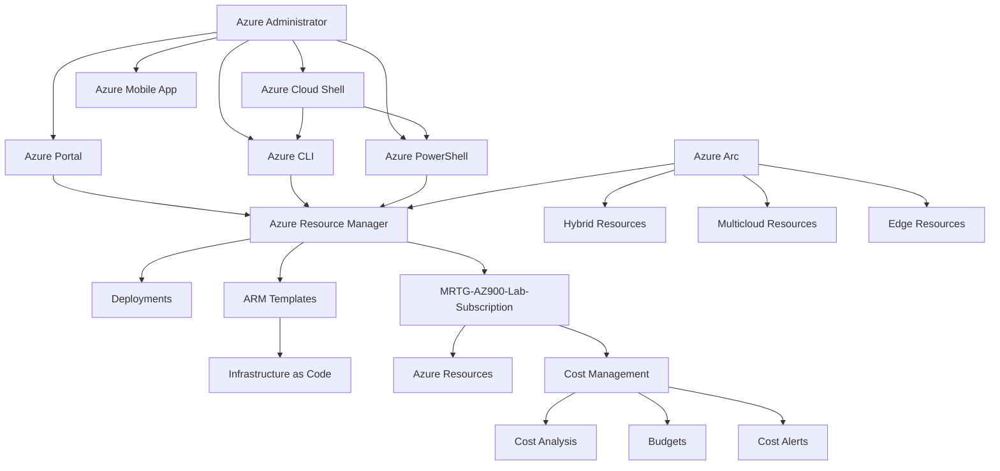

---

## Steps Performed

### Step 1: Reviewed Azure Portal Overview

Microsoft Learn was used to review the purpose of the Azure Portal.

Key concepts reviewed:

- Azure Portal is a web-based unified console
- Azure Portal can create and manage Azure resources
- Azure Portal provides a graphical user interface for Azure subscriptions
- Azure Portal can be used to build, manage, and monitor cloud resources
- Azure Portal is designed for resiliency and continuous availability

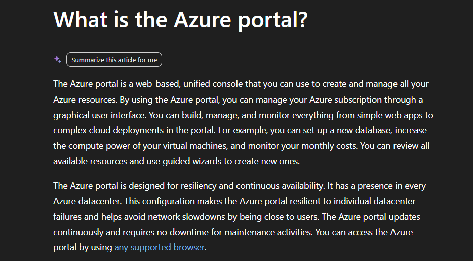

---

### Step 2: Reviewed Azure Cloud Shell Overview

Microsoft Learn was used to review Azure Cloud Shell.

Key concepts reviewed:

- Azure Cloud Shell is a browser-based terminal
- Cloud Shell provides an authenticated and preconfigured shell experience
- Cloud Shell is used to manage Azure resources
- Cloud Shell includes commonly needed tools
- Cloud Shell can use Bash or PowerShell

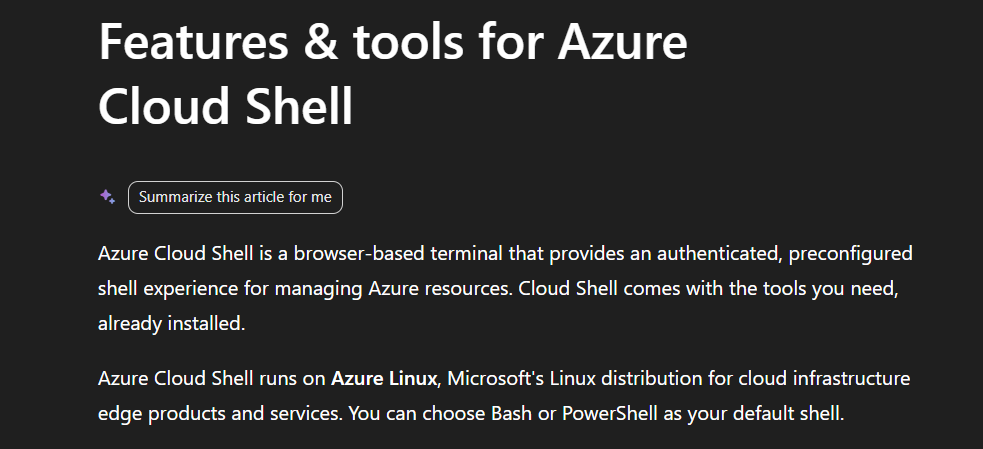

---

### Step 3: Reviewed Azure CLI Overview

Microsoft Learn was used to review the Azure Command-Line Interface.

Key concepts reviewed:

- Azure CLI is a cross-platform command-line tool
- Azure CLI connects to Azure
- Azure CLI can execute administrative commands on Azure resources
- Azure CLI commands can be run interactively
- Azure CLI commands can be used in scripts
- Azure CLI can be installed locally or used through Azure Cloud Shell

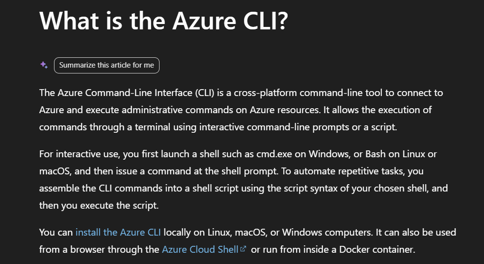

---

### Step 4: Reviewed Azure PowerShell Overview

Microsoft Learn was used to review Azure PowerShell.

Key concepts reviewed:

- Azure PowerShell is a collection of official Microsoft PowerShell modules
- Azure PowerShell is used to manage Azure resources
- Azure PowerShell requires PowerShell
- Azure PowerShell can be used interactively
- Azure PowerShell can be used in scripts

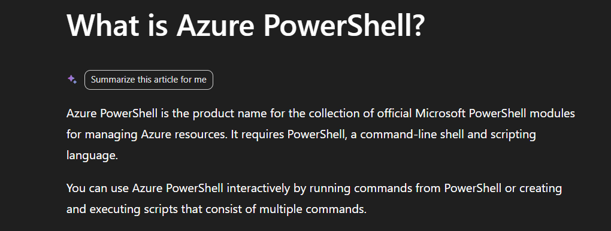

---

### Step 5: Reviewed Azure Resource Manager Overview

Microsoft Learn was used to review Azure Resource Manager.

Key concepts reviewed:

- Azure Resource Manager is the deployment and management service for Azure
- Azure Resource Manager provides a management layer for Azure resources
- Azure Resource Manager helps create, update, and delete Azure resources
- Azure Resource Manager supports management features such as access control, locks, and tags

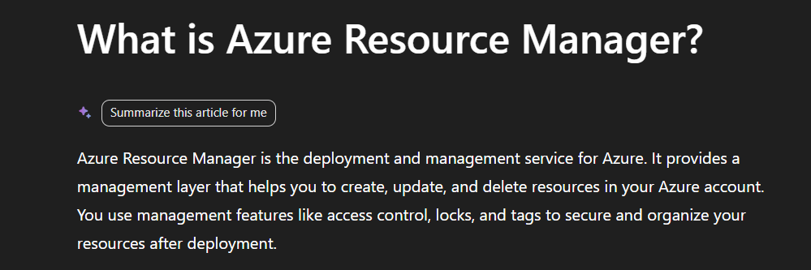

---

### Step 6: Reviewed ARM Templates

Microsoft Learn was used to review ARM templates.

Key concepts reviewed:

- ARM templates are used for Infrastructure as Code
- ARM templates define Azure infrastructure and configuration in JSON
- ARM templates use declarative syntax
- ARM templates allow repeatable deployments
- ARM templates can be stored in source control and versioned
- Bicep provides an easier authoring experience for ARM template deployments

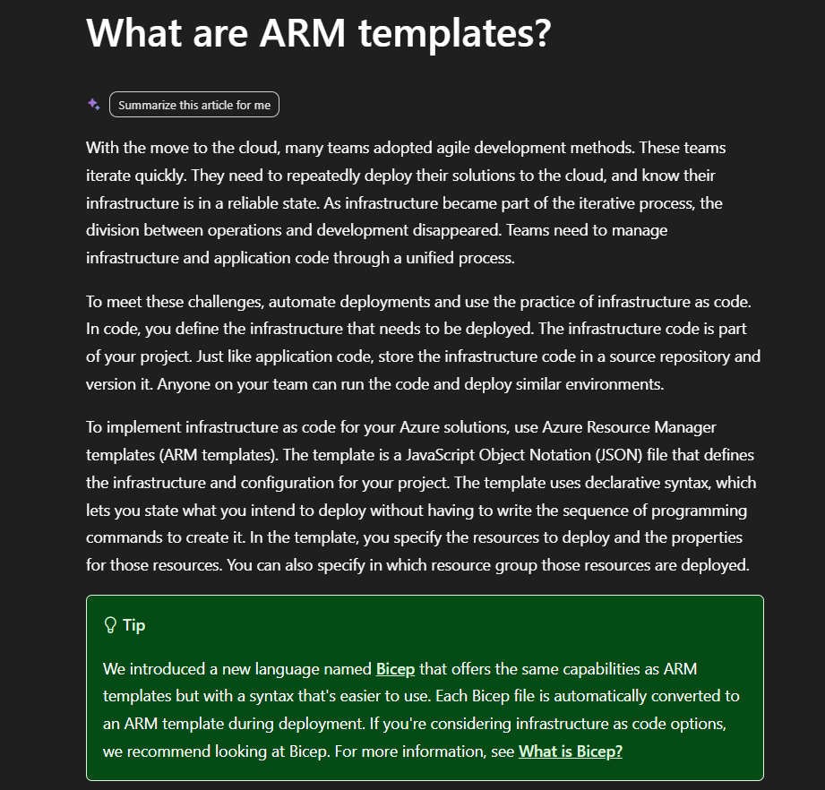

---

### Step 7: Reviewed Infrastructure as Code

Microsoft Learn was used to review Infrastructure as Code.

Key concepts reviewed:

- Infrastructure as Code uses DevOps methodology
- Infrastructure as Code uses versioning
- Infrastructure as Code uses a descriptive model
- Infrastructure as Code can define and deploy infrastructure
- Infrastructure as Code helps generate consistent environments
- Infrastructure as Code supports rapid and reliable infrastructure delivery at scale

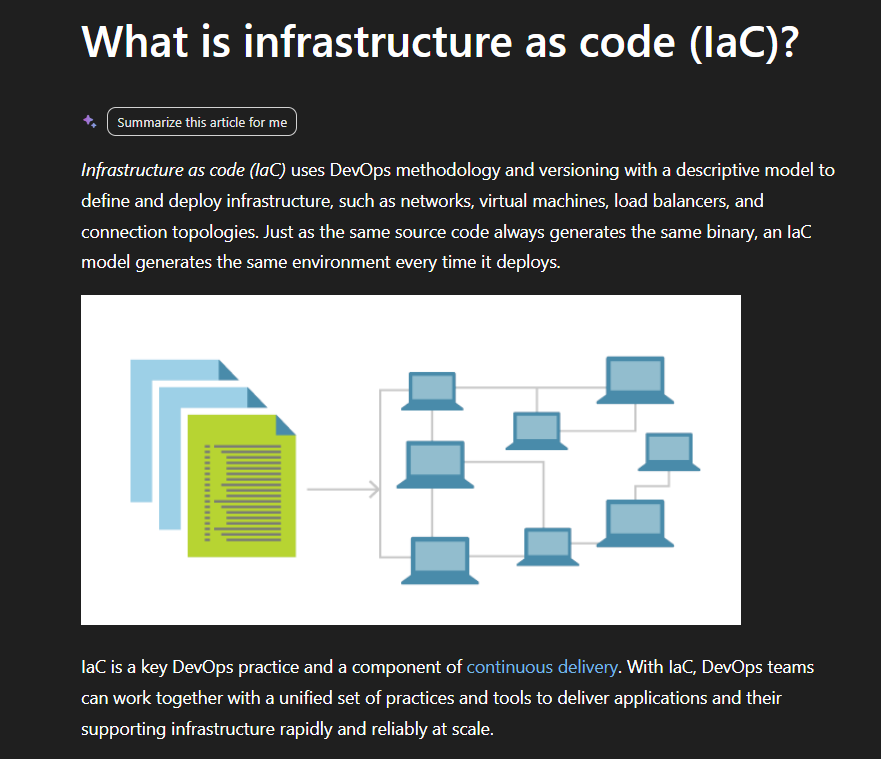

---

### Step 8: Reviewed Azure Arc Overview

Microsoft Learn was used to review Azure Arc.

Key concepts reviewed:

- Azure Arc provides centralized governance and management
- Azure Arc supports multicloud, on-premises, and edge environments
- Azure Arc projects non-Azure and on-premises resources into Azure Resource Manager
- Azure Arc can manage virtual machines, Kubernetes clusters, and databases
- Azure Arc uses familiar Azure services and management capabilities across environments

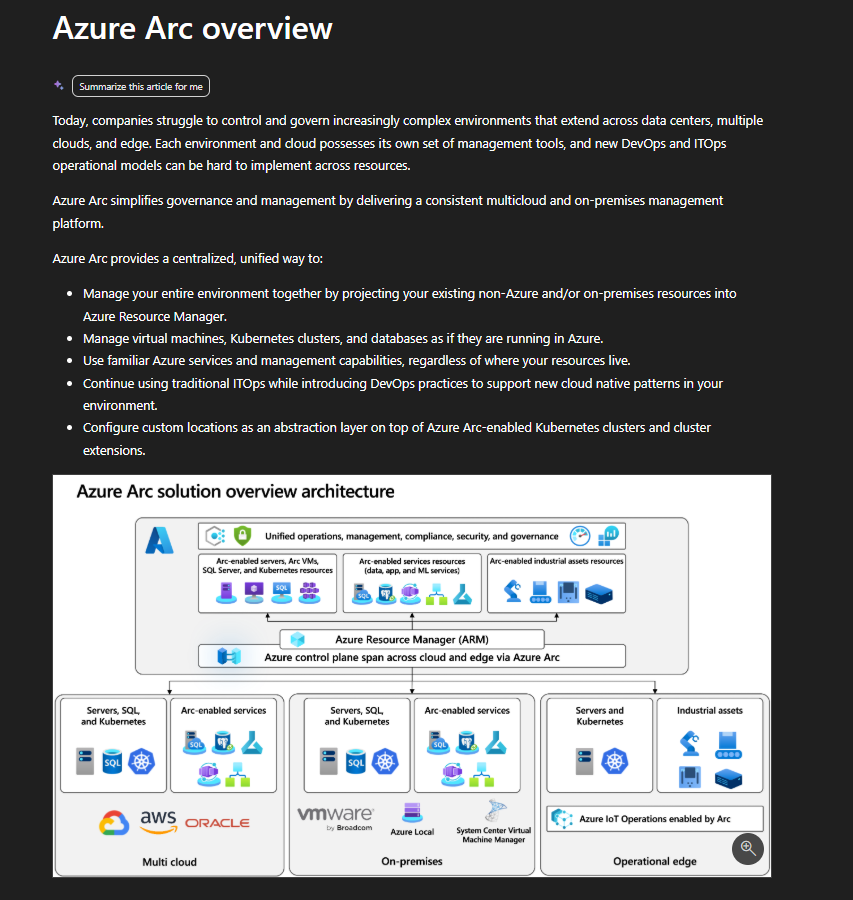

---

### Step 9: Reviewed Azure Mobile App Overview

Microsoft Learn was used to review the Azure Mobile App.

Key concepts reviewed:

- Azure Mobile App can monitor and manage Azure resources from a mobile device
- Azure Mobile App can show resource status, performance, and health
- Azure Mobile App can perform common operations on resources
- Azure Mobile App can access Azure Cloud Shell
- Azure Mobile App supports push notifications and alerts
- Azure Mobile App supports Microsoft Entra ID authentication and multifactor authentication

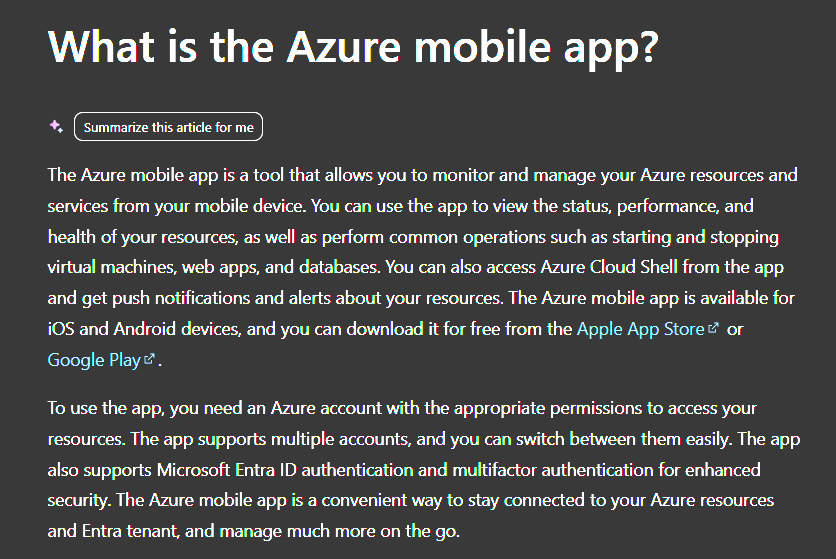

---

### Step 10: Opened Azure Portal Home

The Azure Portal home page was opened.

Reviewed:

- Portal navigation menu
- Global search
- Common Azure service shortcuts
- Template-based deployment option
- Create a resource option
- Cost Management and Billing navigation

No resource was created.

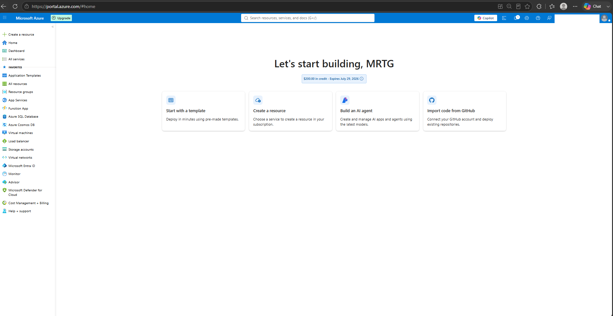

---

### Step 11: Launched Azure Cloud Shell

Azure Cloud Shell was launched from the Azure Portal header.

Reviewed:

- Cloud Shell launcher
- Bash option
- PowerShell option
- Browser-based Cloud Shell access

No shell session was started yet.

No storage account was created.

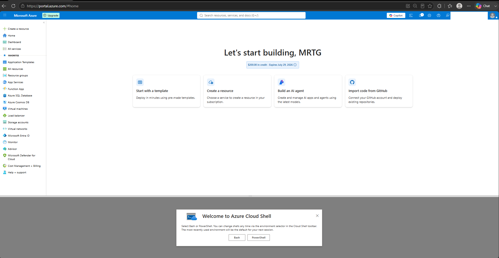

---

### Step 12: Reviewed Cloud Shell Storage Prompt

The Azure Cloud Shell setup prompt was reviewed.

Reviewed:

- No storage account required option
- Mount storage account option
- Subscription selection field
- Apply button

No storage account was created.

No storage account was mounted.

No Cloud Shell resource was deployed.

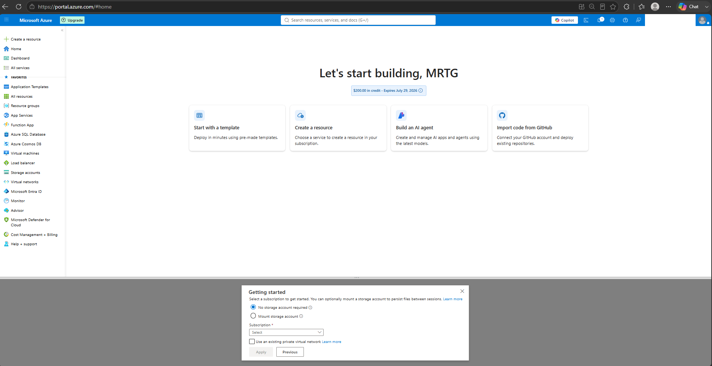

---

### Step 13: Opened Subscription Deployments

The subscription-level Deployments page was opened.

Reviewed:

- Azure Resource Manager deployment history
- Deployment name column
- Status column
- Last modified column
- Duration column
- Related events column

No deployments were displayed.

No deployment was started.

No redeployment was performed.

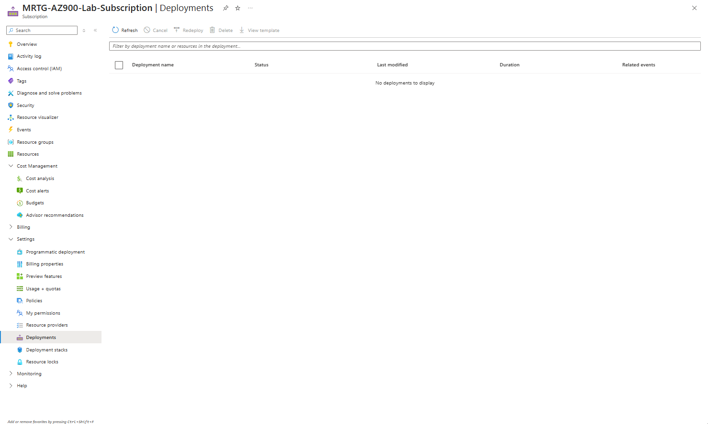

---

### Step 14: Opened Custom Deployment Template Page

The Custom Deployment page was opened in the Azure Portal.

Reviewed:

- ARM template deployment interface
- Build your own template option
- Common templates
- Quickstart template option
- Template spec option
- Basics tab
- Review + create tab

No template was selected.

No Basics page was completed.

No deployment was started.

No resource was created.

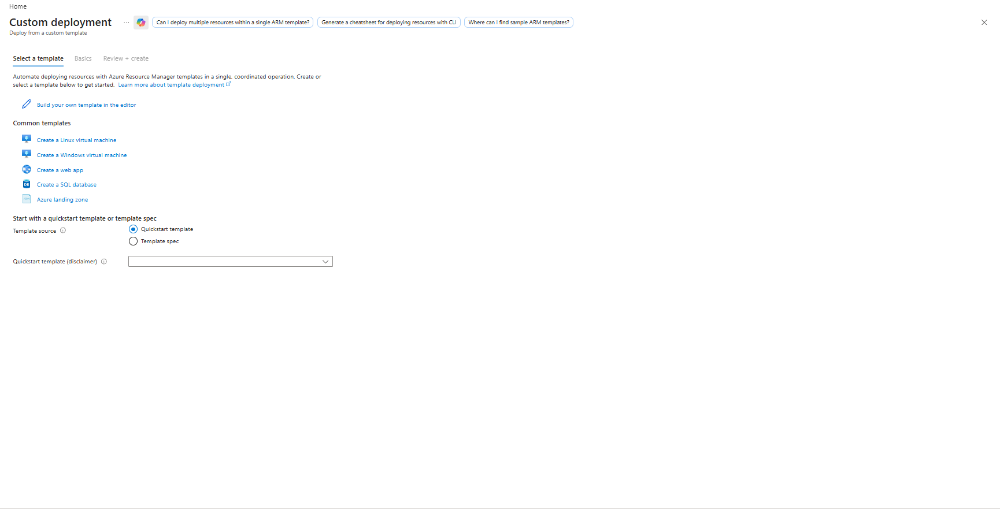

---

### Step 15: Opened Azure Arc in the Azure Portal

The Azure Arc page was opened in the Azure Portal.

Reviewed:

- Azure Arc overview
- Onboarding options
- Machine onboarding option
- Supported environments
- Hybrid, multicloud, and edge management messaging

No Azure Arc resource was created.

No machine, Kubernetes cluster, database, or service was onboarded.

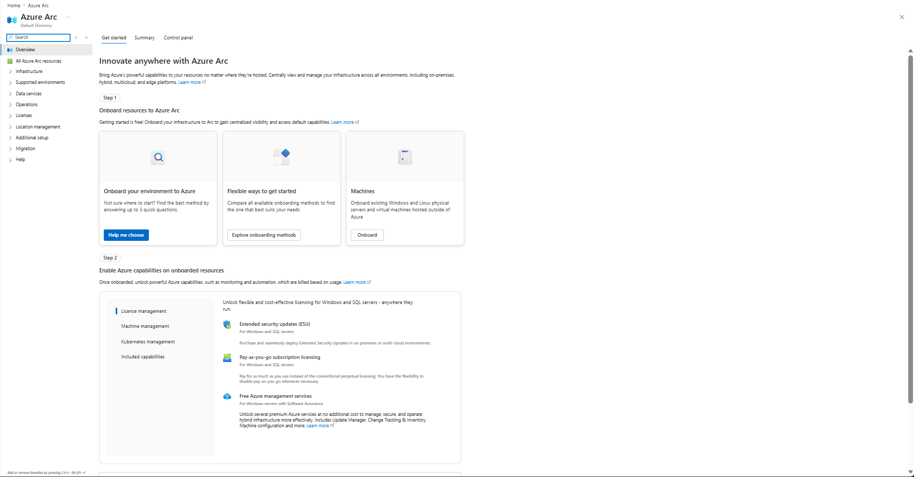

---

### Step 16: Validated Cost Analysis

Cost Analysis was opened to confirm that no cost was introduced during the lab.

Observed:

- No cost reported during the selected period
- No cost breakdown by service
- No cost breakdown by location
- No cost breakdown by subscription

Billing account information was redacted before upload.

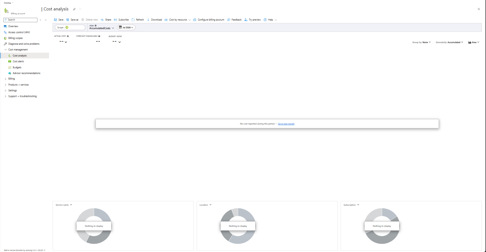

---

### Step 17: Validated Budget Protection

The subscription-level Budgets page was opened to confirm the existing monthly budget.

Observed:

- Existing budget: `mrtg-az900-monthly-budget`
- Budget amount: `$10.00`
- Forecasted cost: `0`
- Evaluated spend: `$0.00`
- Progress: `0.00%`

No budget was created.

No budget was modified.

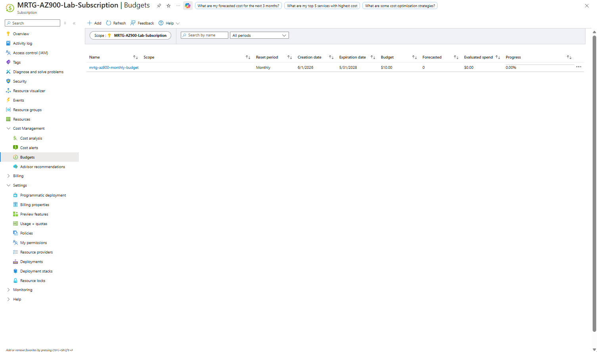

---

### Step 18: Validated Cost Alerts

The subscription-level Cost Alerts page was opened.

Observed:

- No cost alerts displayed
- No alert rule created
- No cost alert created

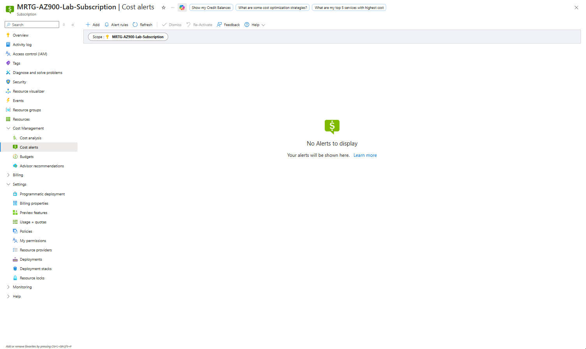

---

## Validation

| Validation Item | Expected Result | Actual Result |
|---|---|---|
| Azure Portal reviewed | Portal concepts documented | Passed |
| Azure Cloud Shell reviewed | Cloud Shell concepts documented | Passed |
| Azure CLI reviewed | CLI concepts documented | Passed |
| Azure PowerShell reviewed | PowerShell concepts documented | Passed |
| Azure Resource Manager reviewed | ARM management layer documented | Passed |
| ARM templates reviewed | Template deployment concepts documented | Passed |
| Infrastructure as Code reviewed | IaC concepts documented | Passed |
| Azure Arc reviewed | Hybrid and multicloud management concepts documented | Passed |
| Azure Mobile App reviewed | Mobile management concepts documented | Passed |
| Azure Portal home opened | Portal navigation reviewed | Passed |
| Cloud Shell launcher opened | Bash and PowerShell options reviewed | Passed |
| Cloud Shell storage creation avoided | No storage account created | Passed |
| Subscription deployments reviewed | No deployments displayed | Passed |
| Custom deployment page reviewed | No deployment started | Passed |
| Azure Arc portal reviewed | No resource onboarded | Passed |
| Cost Analysis validated | No cost reported | Passed |
| Budget validated | `$10.00` budget remained active | Passed |
| Cost alerts validated | No alerts displayed | Passed |

---

## Completion Checklist

- [x] Reviewed Azure Portal
- [x] Reviewed Azure Cloud Shell
- [x] Reviewed Azure CLI
- [x] Reviewed Azure PowerShell
- [x] Reviewed Azure Resource Manager
- [x] Reviewed ARM templates
- [x] Reviewed Infrastructure as Code
- [x] Reviewed Azure Arc
- [x] Reviewed Azure Mobile App
- [x] Opened Azure Portal home
- [x] Opened Cloud Shell launcher
- [x] Reviewed Cloud Shell storage prompt
- [x] Avoided creating Cloud Shell storage
- [x] Opened subscription Deployments
- [x] Opened Custom Deployment page
- [x] Avoided ARM template deployment
- [x] Opened Azure Arc portal
- [x] Avoided Azure Arc onboarding
- [x] Validated Cost Analysis
- [x] Validated Budgets
- [x] Validated Cost Alerts
- [x] Confirmed no resources were created
- [x] Confirmed no deployments were started
- [x] Confirmed no unexpected cost

---

## AZ-900 Exam Objective Coverage

This lab supports AZ-900 knowledge areas related to:

- Azure management tools
- Azure Portal
- Azure Cloud Shell
- Azure CLI
- Azure PowerShell
- Azure Resource Manager
- ARM templates
- Infrastructure as Code
- Azure Arc
- Azure Mobile App
- Cost Management
- Budgets
- Cost alerts

---

## Mini Objective Coverage

| Topic | Covered |
|---|---|
| Azure Portal | Yes |
| Azure Cloud Shell | Yes |
| Bash in Cloud Shell | Yes |
| PowerShell in Cloud Shell | Yes |
| Azure CLI | Yes |
| Azure PowerShell | Yes |
| Azure Resource Manager | Yes |
| ARM templates | Yes |
| Bicep concept | Yes |
| Infrastructure as Code | Yes |
| Azure Arc | Yes |
| Hybrid management | Yes |
| Multicloud management | Yes |
| Edge management | Yes |
| Azure Mobile App | Yes |
| Cost Analysis | Yes |
| Budget validation | Yes |
| Cost alert validation | Yes |

---

## IAM / Security Relevance

Management and deployment tools are closely connected to identity, access, and security operations.

This lab reinforced several IAM and security concepts:

- Azure Portal access depends on authenticated Azure identities.
- Azure Cloud Shell provides authenticated administrative access.
- Azure CLI and Azure PowerShell can perform privileged actions when granted the right permissions.
- Azure Resource Manager enforces access control through Azure RBAC.
- ARM templates can deploy resources consistently, but they must be reviewed before deployment.
- Infrastructure as Code supports change control, versioning, peer review, and repeatability.
- Azure Arc extends Azure governance and management to non-Azure resources.
- Azure Mobile App supports Microsoft Entra ID authentication and multifactor authentication.
- Management tools should be used with least privilege.
- Deployment tools should be monitored and governed to prevent unauthorized resource creation.

In a government or regulated environment, these tools support standardized administration, auditable deployments, controlled access, and repeatable infrastructure management.

---

## Governance Notes

This lab was intentionally performed as a review-only activity.

No management or deployment actions were completed.

The following actions were avoided:

- No Cloud Shell storage account was created.
- No Cloud Shell storage was mounted.
- No Azure CLI commands were executed against resources.
- No Azure PowerShell commands were executed against resources.
- No ARM template was deployed.
- No Bicep deployment was created.
- No custom deployment was started.
- No Azure Arc resource was onboarded.
- No resource group was created.
- No virtual machine was created.
- No storage account was created.
- No budget was modified.
- No cost alert rule was created.

This approach allowed Azure management and deployment tools to be reviewed safely without changing the lab environment.

---

## Cost Considerations

This lab was designed to remain at `$0.00`.

No billable resources were created.

Cost validation confirmed:

- No cost reported during the selected period
- Existing subscription budget remained active
- Evaluated spend remained `$0.00`
- Budget progress remained `0.00%`
- No cost alerts were displayed

---

## Troubleshooting Notes

| Issue | Resolution |
|---|---|
| Cloud Shell prompted for setup | Captured the setup prompt and did not create storage |
| Cloud Shell offered storage mounting | Left storage unmounted to avoid creating resources |
| Custom Deployment page displayed common templates | Reviewed the page only and did not select or deploy a template |
| Azure Arc page displayed onboarding options | Reviewed onboarding options only and did not onboard resources |
| Azure Mobile App portal search did not return a useful page | Used Microsoft Learn evidence for the Azure Mobile App topic |
| Cost Analysis showed billing account information | Redacted billing account information before upload |
| Budget validation needed subscription scope | Used `MRTG-AZ900-Lab-Subscription` scope to confirm the active monthly budget |

---

## What I Would Do Differently in Production

In a production environment, management and deployment tools should be governed carefully because they can create, modify, and delete cloud resources.

Production considerations would include:

- Use least privilege access for portal, CLI, PowerShell, and deployment operations.
- Require multifactor authentication for administrative users.
- Use Privileged Identity Management for elevated access.
- Store Infrastructure as Code in source control.
- Require pull requests and peer review for infrastructure changes.
- Use templates or Bicep instead of manual portal deployment where possible.
- Validate templates before deployment.
- Use separate subscriptions for development, test, and production.
- Use Azure Policy to restrict unauthorized resource types, regions, and SKUs.
- Monitor deployment history regularly.
- Use tags for ownership, environment, cost center, and workload tracking.
- Use Azure Arc only after planning hybrid management scope and permissions.
- Review Cloud Shell storage and command history handling.
- Centralize logging for administrative actions.
- Use budgets and cost alerts for deployment guardrails.

---

## Lessons Learned

This lab reinforced that Azure offers multiple tools for managing and deploying resources.

Key takeaways:

- Azure Portal provides a graphical interface for Azure administration.
- Azure Cloud Shell provides browser-based command-line access.
- Azure CLI supports cross-platform command-line automation.
- Azure PowerShell supports PowerShell-based Azure administration.
- Azure Resource Manager is the deployment and management layer for Azure.
- ARM templates support declarative and repeatable infrastructure deployment.
- Infrastructure as Code improves consistency, versioning, and repeatability.
- Azure Arc extends Azure management to hybrid, multicloud, and edge environments.
- Azure Mobile App provides mobile monitoring and management capabilities.
- Management tools must be protected with strong identity and access controls.
- Discovery-only labs can provide strong documentation without creating cost.

---

## Cleanup

No cleanup was required because no resources were created.

No Cloud Shell storage account, ARM deployment, Bicep deployment, Azure Arc resource, resource group, virtual machine, storage account, budget, or cost alert was created during this lab.

---

## Outcome

Lab 11 successfully documented Azure management and deployment tools.

The lab demonstrated how Azure supports:

- Portal-based administration
- Browser-based shell access
- CLI-based automation
- PowerShell-based automation
- Resource deployment through Azure Resource Manager
- Repeatable deployment through ARM templates
- Infrastructure as Code practices
- Hybrid and multicloud management through Azure Arc
- Mobile monitoring and management through Azure Mobile App
- Cost safety through Cost Management, Budgets, and Cost Alerts

The subscription remained protected by the existing monthly budget, and no unexpected cost was introduced.

---

## Screenshot Inventory

| Screenshot | Description |
|---|---|
| `01-azure-portal-overview.png` | Azure Portal overview from Microsoft Learn |
| `02-azure-cloud-shell-overview.png` | Azure Cloud Shell overview from Microsoft Learn |
| `03-azure-cli-overview.png` | Azure CLI overview from Microsoft Learn |
| `04-azure-powershell-overview.png` | Azure PowerShell overview from Microsoft Learn |
| `05-azure-resource-manager-overview.png` | Azure Resource Manager overview from Microsoft Learn |
| `06-arm-templates-overview.png` | ARM templates overview from Microsoft Learn |
| `07-infrastructure-as-code-overview.png` | Infrastructure as Code overview from Microsoft Learn |
| `08-azure-arc-overview.png` | Azure Arc overview from Microsoft Learn |
| `09-azure-mobile-app-overview.png` | Azure Mobile App overview from Microsoft Learn |
| `10-azure-portal-home.png` | Azure Portal home page |
| `11-cloud-shell-launcher.png` | Azure Cloud Shell launcher |
| `12-cloud-shell-storage-prompt.png` | Azure Cloud Shell storage prompt |
| `13-resource-manager-deployments.png` | Subscription-level deployments page |
| `14-custom-deployment-template.png` | Custom Deployment template page |
| `15-azure-arc-portal.png` | Azure Arc portal page |
| `16-final-cost-analysis.png` | Final Cost Analysis validation |
| `17-final-budget-validation.png` | Final subscription budget validation |
| `18-final-cost-alerts.png` | Final Cost Alerts validation |

---

## Screenshots

### Azure Portal Overview


### Azure Cloud Shell Overview


### Azure CLI Overview


### Azure PowerShell Overview


### Azure Resource Manager Overview


### ARM Templates Overview


### Infrastructure as Code Overview


### Azure Arc Overview


### Azure Mobile App Overview


### Azure Portal Home


### Cloud Shell Launcher


### Cloud Shell Storage Prompt


### Resource Manager Deployments


### Custom Deployment Template


### Azure Arc Portal


### Final Cost Analysis


### Final Budget Validation


### Final Cost Alerts


---

## Next Lab

The next lab will be:

```text
Lab 12 - Azure Monitoring, Health, and Optimization
```

Lab 12 will focus on Azure Monitor, alerts, Log Analytics, Service Health, Advisor, and optimization concepts.
