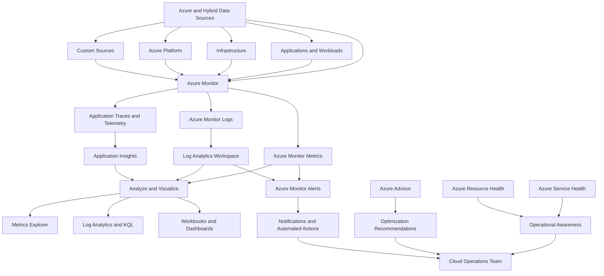

# Lab 12 - Azure Monitoring, Health, and Optimization

## Objective

The objective of this lab was to explore the Azure services used to monitor cloud resources, collect telemetry, investigate operational issues, review platform health, and identify optimization opportunities.

This lab focused on:

- Azure Monitor
- Azure Monitor Metrics
- Azure Monitor Logs
- Log Analytics workspaces
- Azure Monitor Alerts
- Application Insights
- Azure Service Health
- Azure Resource Health
- Azure Advisor

The lab combined Microsoft Learn documentation with discovery-based exploration in the Azure portal. No monitoring resources, alert rules, workspaces, or billable services were created.

---

## Business Problem Solved

Organizations need visibility into the performance, availability, reliability, and security of their cloud environments.

Without centralized monitoring, administrators may not know:

- When a resource becomes unavailable
- Whether an issue originates from Azure or from a customer configuration
- When performance begins to degrade
- Whether an application is generating errors
- When an Azure service outage affects the organization
- Which resources require operational or security improvements
- Whether alert conditions have been triggered
- Where monitoring data should be stored and analyzed

Azure Monitor and its related services provide a centralized observability platform for collecting metrics, logs, traces, and events across Azure and hybrid environments.

These capabilities help cloud teams detect problems, investigate incidents, respond to alerts, understand platform health, and improve their Azure deployments.

---

## Scenario

Monroe Redstone Technology Group is preparing to operate Azure workloads in a production environment.

Before deploying monitoring resources, the cloud operations team must understand the tools available for:

- Collecting performance metrics
- Storing and querying operational logs
- Creating alert conditions
- Monitoring application performance
- Reviewing Azure platform incidents
- Checking the health of individual resources
- Receiving optimization recommendations
- Supporting troubleshooting and incident response

The team used Microsoft Learn to review each monitoring concept and then located the corresponding services in the Azure portal.

This was a discovery-only lab. No Log Analytics workspace, Application Insights resource, alert rule, action group, workbook, dashboard, or monitoring agent was created.

---

## Azure Services and Resources Used

| Service or Feature | Purpose |
|---|---|
| Microsoft Learn | Reviewed Azure monitoring concepts and service capabilities |
| Azure Portal | Explored the monitoring and optimization interfaces |
| Azure Monitor | Centralized collection, analysis, visualization, and response for telemetry |
| Azure Monitor Metrics | Stores numerical time-series performance data |
| Azure Monitor Logs | Collects and analyzes detailed telemetry records |
| Log Analytics Workspace | Stores log tables and supports log queries |
| Azure Monitor Alerts | Evaluates telemetry and identifies conditions requiring attention |
| Application Insights | Provides application performance monitoring and diagnostics |
| Azure Service Health | Reports Azure service issues, maintenance, and advisories |
| Azure Resource Health | Reports the current and historical health of individual resources |
| Azure Advisor | Provides recommendations for cost, security, reliability, performance, and operational excellence |

### Resources Created

None.

### Resources Modified

None.

### Configuration Changes

None.

---

## Why These Services Were Used

### Azure Monitor

Azure Monitor provides the central observability platform for Azure.

It collects telemetry from:

- Azure resources
- Applications and workloads
- Virtual machines
- Network services
- Azure platform services
- Hybrid environments
- Custom data sources

The collected telemetry can be analyzed, visualized, queried, and used to trigger operational responses.

### Azure Monitor Metrics

Metrics provide numerical values collected over time.

Examples include:

- CPU utilization
- Disk operations
- Network throughput
- Request counts
- Availability percentages
- Response times

Metrics are useful for:

- Near real-time monitoring
- Performance charts
- Dashboards
- Trend analysis
- Metric-based alerts

### Azure Monitor Logs

Azure Monitor Logs provides centralized collection and analysis of detailed telemetry records.

Logs can support:

- Troubleshooting
- Security investigations
- Compliance reporting
- Operational analysis
- Historical review
- Dashboards and reports
- Log-based alerts

Azure Monitor Logs can retrieve data using Kusto Query Language, commonly called KQL.

### Log Analytics Workspace

A Log Analytics workspace is the primary data store for Azure Monitor Logs.

A workspace can contain:

- Azure resource logs
- Activity logs
- Virtual machine data
- Application telemetry
- Security data
- Custom tables
- Saved queries
- Alert-related data

Workspace access, retention, table plans, and data collection should be governed because log data may contain operational or security-sensitive information.

### Azure Monitor Alerts

Azure Monitor Alerts evaluates metrics or logs against defined conditions.

An alert rule normally includes:

- A monitored resource or scope
- A signal
- A condition
- An evaluation frequency
- An action group or response

Alerts help administrators detect and address issues before users are significantly affected.

### Application Insights

Application Insights is an application performance monitoring capability within Azure Monitor.

It can provide visibility into:

- Application availability
- Request performance
- Failures and exceptions
- Dependencies
- User activity
- Application usage
- Distributed traces
- Performance bottlenecks

Application Insights helps support, development, and operations teams investigate application issues.

### Azure Service Health

Azure Service Health provides information about events that may affect Azure services used by an organization.

Service Health includes:

- Service issues
- Planned maintenance
- Health advisories
- Security advisories
- Billing updates
- Health history

Unlike the public Azure Status page, Service Health provides a personalized view based on the subscriptions, services, and regions used by the organization.

### Azure Resource Health

Azure Resource Health reports the current and historical health of individual Azure resources.

It helps administrators determine whether an outage or degraded condition is related to:

- The Azure platform
- Planned maintenance
- Customer configuration
- A resource-specific problem

Resource Health can also help provide evidence when reviewing service availability and possible service-level agreement impacts.

### Azure Advisor

Azure Advisor analyzes resource configuration and usage data to provide recommendations in five categories:

- Cost
- Security
- Reliability
- Operational Excellence
- Performance

Advisor recommendations can help teams identify configuration gaps and prioritize improvements.

---

## Environment

| Item | Value |
|---|---|
| Organization | Monroe Redstone Technology Group |
| Project | MRTG Azure Fundamentals: The Bridge |
| Lab | Lab 12 - Azure Monitoring, Health, and Optimization |
| Subscription | `MRTG-AZ900-Lab-Subscription` |
| Lab Type | Discovery and portal exploration |
| Resources Created | None |
| Monitoring Resources Created | None |
| Log Analytics Workspaces Created | None |
| Application Insights Resources Created | None |
| Alert Rules Created | None |
| Action Groups Created | None |
| Estimated Incremental Cost | `$0.00` |

Sensitive identifiers were excluded or redacted from the screenshots, including:

- Subscription IDs
- Tenant IDs
- User email addresses
- Directory names
- Object identifiers
- Billing information

---

## Architecture / Concept Diagram

---

## Steps Performed

### Step 1 - Reviewed the Azure Monitor Overview

I reviewed the Azure Monitor overview in Microsoft Learn.

The documentation described Azure Monitor as Microsoft's unified observability service for collecting, analyzing, and acting on telemetry from cloud and hybrid environments.

The review identified the major types of telemetry used by Azure Monitor:

- Metrics
- Logs
- Traces
- Events

It also showed how Azure Monitor supports:

- Insights
- Workbooks
- Dashboards
- Grafana
- Metrics Explorer
- Log Analytics
- Alerts
- Actions
- Issue investigation

---

### Step 2 - Reviewed Azure Monitor Metrics

I reviewed Azure Monitor Metrics and learned that metrics are numerical values stored in a time-series database.

The documentation identified several metric types:

- Platform metrics
- Advanced platform metrics
- Custom metrics
- Prometheus metrics

Platform metrics are automatically collected from supported Azure resources and can be used for analysis and alerting.

Custom metrics can be collected from configured applications, agents, and other supported sources.

Prometheus metrics support monitoring for Kubernetes environments and can be analyzed using tools such as PromQL and Grafana.

---

### Step 3 - Reviewed Azure Monitor Logs

I reviewed Azure Monitor Logs and learned that it provides a centralized platform for collecting, analyzing, and acting on telemetry from Azure and non-Azure resources.

Azure Monitor Logs can be used to:

- Collect telemetry data
- Transform collected data
- Route data into workspace tables
- Manage log retention
- Control access to logs
- Optimize log-related costs
- Retrieve data using KQL
- Create dashboards and reports
- Support troubleshooting and alerting

The documentation also reinforced that Azure Monitor Metrics and Azure Monitor Logs form the two main parts of the Azure Monitor data platform.

---

### Step 4 - Reviewed Log Analytics Workspaces

I reviewed the purpose of a Log Analytics workspace.

A Log Analytics workspace stores tables containing collected monitoring data.

The documentation showed that administrators can use workspaces to:

- Define table plans
- Configure analytics retention
- Configure long-term retention
- Manage access to the workspace
- Manage access to individual tables
- Create summary rules
- Save queries
- Build visualizations
- Create alerts
- Configure network isolation
- Design regional workspace architectures

This review demonstrated that a Log Analytics workspace is not only a storage location. It is also an important governance, security, and operational boundary for monitoring data.

---

### Step 5 - Reviewed Azure Monitor Alerts

I reviewed how Azure Monitor Alerts detect and address operational issues.

The alert workflow included:

1. Azure resources emit telemetry.
2. Azure Monitor stores metrics or logs.
3. An alert rule evaluates a selected signal.
4. Azure compares the signal against a condition.
5. A fired alert is created when the condition is met.
6. An action group can notify administrators or start an automated response.

The review identified the main components of an alert rule:

- Scope
- Signal
- Condition
- Evaluation logic
- Actions

No alert rule or action group was created during this lab.

---

### Step 6 - Reviewed Application Insights

I reviewed Application Insights and its integration with Azure Monitor.

Application Insights stores application telemetry in Azure Monitor Logs and provides monitoring and diagnostic views for applications.

The documentation showed that Application Insights can help teams:

- Create application health dashboards
- Perform proactive monitoring
- Configure alerts
- Analyze application usage
- Track navigation patterns
- Investigate failures
- Investigate performance
- Query application telemetry

No Application Insights resource was created during the lab.

---

### Step 7 - Reviewed Azure Service Health

I reviewed Azure Service Health and its major components.

The documentation distinguished between:

- Azure Status
- Service Health
- Resource Health

Azure Status provides a broad public view of Azure service availability.

Service Health provides a personalized view of issues, maintenance, and advisories that may affect the services and regions used by an organization.

Resource Health provides health information for individual Azure resources.

---

### Step 8 - Reviewed Azure Resource Health

I reviewed Azure Resource Health and learned how it reports the current and historical health of individual resources.

Resource Health can help administrators:

- Diagnose resource availability problems
- Identify Azure platform issues
- Review historical health events
- Determine when a resource was unavailable
- Gather evidence for support cases
- Review possible SLA impacts

---

### Step 9 - Reviewed Azure Advisor

I reviewed Azure Advisor and learned how it analyzes Azure configurations and usage telemetry.

Advisor provides personalized recommendations across:

- Cost
- Security
- Reliability
- Operational Excellence
- Performance

The recommendations can help organizations improve cloud configurations and identify opportunities to reduce risk or unnecessary spending.

---

### Step 10 - Explored the Azure Monitor Portal

I opened Azure Monitor in the Azure portal.

The overview page provided centralized navigation to monitoring capabilities such as:

- Application Insights
- Container Insights
- VM Insights
- Network Insights
- Metrics
- Alerts
- Logs
- Workbooks
- Dashboards with Grafana
- Change Analysis
- Diagnostic Settings
- Managed Prometheus
- Health Model

This page demonstrated how Azure Monitor brings multiple observability capabilities into one management interface.

---

### Step 11 - Explored Azure Monitor Metrics

I opened the Metrics interface in the Azure portal.

The Metrics page displayed options to:

- Add a metric
- Select a monitored scope
- Apply filters
- Split data by dimensions
- Change chart types
- Drill into logs
- Create an alert rule
- Save a chart to a dashboard

No metric data was displayed because no monitored resource had been selected.

No chart, dashboard, or alert rule was created.

---

### Step 12 - Explored Azure Monitor Logs

I opened the Logs interface in Azure Monitor.

The portal displayed the Log Analytics query experience with options to:

- Select a resource
- Select a table
- Choose a time range
- Use simple mode
- Open the query interface
- Review available monitoring data

The page instructed me to select a resource before querying data.

No Log Analytics workspace was created, no resource was selected, and no query was executed.

---

### Step 13 - Explored Azure Monitor Alerts

I opened the Alerts page in Azure Monitor.

The interface provided access to:

- Fired alerts
- Alert rules
- Action groups
- Alert processing rules
- Prometheus rule groups
- Timeline views
- Alert filters
- Severity filters

The page showed zero fired alerts across all displayed severity levels.

The subscription identifier visible in the original portal view was redacted before the screenshot was included in the repository.

No alert rule, action group, or processing rule was created.

---

### Step 14 - Reviewed Azure Service Health in the Portal

I opened Service Health and reviewed the Service Issues page.

The portal was filtered to:

- Subscription: `MRTG-AZ900-Lab-Subscription`
- All regions
- All services
- All event levels
- All event tags

The portal reported that there were no active service issues affecting the selected subscription.

The page also provided navigation to:

- Planned maintenance
- Health advisories
- Security advisories
- Billing updates
- Health history
- Resource Health
- Health alerts

No Service Health alert was created.

---

### Step 15 - Reviewed Azure Resource Health in the Portal

I opened Resource Health under Service Health.

The portal showed the selected subscription but reported that there were no registered resources available for selection.

This was expected because the lab subscription did not contain a supported deployed resource for Resource Health evaluation.

No Resource Health alert was created.

---

### Step 16 - Reviewed Azure Advisor in the Portal

I opened Azure Advisor and reviewed its overview dashboard.

The page displayed the five Advisor recommendation categories:

- Cost
- Security
- Reliability
- Operational Excellence
- Performance

The displayed Advisor view showed:

- No active cost recommendations
- Seven active security recommendations
- A displayed security score of 100 percent
- No active reliability recommendations
- No active operational excellence recommendations
- No active performance recommendations

No recommendation was implemented during the lab.

---

### Step 17 - Reviewed Azure Advisor Recommendations

I opened the All Recommendations page in Azure Advisor.

The portal displayed seven active security recommendations for the subscription.

The recommendations included:

- Enable Microsoft Defender for Storage protections
- Assign more than one owner to the subscription
- Enable Microsoft Defender Cloud Security Posture Management
- Enable Microsoft Defender for Resource Manager
- Enable email notifications for high-severity alerts
- Configure subscription owner notifications
- Configure a contact email address for security issues

The recommendations were categorized by impact levels including:

- High
- Medium
- Low

These findings were reviewed for learning purposes only. No Defender plan, owner assignment, notification setting, or subscription contact setting was changed.

---

## Validation

| Validation Item | Result | Evidence |
|---|---|---|
| Azure Monitor purpose reviewed | Passed | `01-azure-monitor-overview.png` |
| Metrics concepts reviewed | Passed | `02-azure-monitor-metrics-overview.png` |
| Logs concepts reviewed | Passed | `03-azure-monitor-logs-overview.png` |
| Log Analytics workspace purpose reviewed | Passed | `04-log-analytics-overview.png` |
| Alert workflow reviewed | Passed | `05-azure-monitor-alerts-overview.png` |
| Application Insights reviewed | Passed | `06-application-insights-overview.png` |
| Service Health reviewed | Passed | `07-azure-service-health-overview.png` |
| Resource Health reviewed | Passed | `08-azure-resource-health-overview.png` |
| Azure Advisor reviewed | Passed | `09-azure-advisor-overview.png` |
| Azure Monitor portal opened | Passed | `10-azure-monitor-portal.png` |
| Metrics interface opened | Passed | `11-azure-monitor-metrics-portal.png` |
| Logs interface opened | Passed | `12-azure-monitor-logs-portal.png` |
| Alerts interface opened | Passed | `13-azure-monitor-alerts-portal.png` |
| Service Health checked | Passed | `14-azure-service-health-portal.png` |
| Resource Health checked | Passed | `15-azure-resource-health-portal.png` |
| Advisor overview reviewed | Passed | `16-azure-advisor-portal.png` |
| Advisor recommendations reviewed | Passed | `17-advisor-recommendations-portal.png` |
| Alert rules created | None |
| Action groups created | None |
| Log Analytics workspaces created | None |
| Application Insights resources created | None |
| Existing resources modified | None |
| New billable resources created | None |

---

## Completion Checklist

- [x] Reviewed Azure Monitor
- [x] Reviewed Azure Monitor Metrics
- [x] Reviewed Azure Monitor Logs
- [x] Reviewed Log Analytics workspaces
- [x] Reviewed Azure Monitor Alerts
- [x] Reviewed Application Insights
- [x] Reviewed Azure Service Health
- [x] Reviewed Azure Resource Health
- [x] Reviewed Azure Advisor
- [x] Opened Azure Monitor in the Azure portal
- [x] Opened Metrics Explorer
- [x] Opened the Logs interface
- [x] Opened the Alerts interface
- [x] Checked for active Azure service issues
- [x] Reviewed the Resource Health interface
- [x] Reviewed Advisor recommendation categories
- [x] Reviewed active Advisor recommendations
- [x] Confirmed no monitoring resources were created
- [x] Confirmed no alert rules were created
- [x] Confirmed no recommendations were implemented
- [x] Redacted sensitive subscription information where required

---

## AZ-900 Exam Objective Coverage

This lab supports the AZ-900 objective area covering Azure management and governance capabilities.

The lab specifically reinforced the ability to:

- Describe the purpose of Azure Monitor
- Describe Azure Monitor Metrics
- Describe Azure Monitor Logs
- Describe Log Analytics
- Describe Azure Monitor Alerts
- Describe Application Insights
- Describe Azure Service Health
- Describe Azure Resource Health
- Describe Azure Advisor

---

## Mini Objective Coverage

### Describe Azure Monitor

Azure Monitor is a centralized observability platform that collects, analyzes, visualizes, and responds to telemetry from Azure and hybrid environments.

### Describe Metrics

Metrics are numerical time-series values used for performance monitoring, visualization, trend analysis, and alerting.

### Describe Logs

Logs contain detailed telemetry records that support investigation, troubleshooting, reporting, auditing, and security analysis.

### Describe Log Analytics

Log Analytics provides the interface and query capabilities used to analyze data stored in a Log Analytics workspace.

### Describe Alerts

Alerts monitor selected signals and create notifications or automated responses when defined conditions are met.

### Describe Application Insights

Application Insights provides application performance monitoring, failure analysis, availability monitoring, dependency tracking, and user behavior insights.

### Describe Service Health

Service Health provides personalized information about Azure outages, planned maintenance, advisories, and service-impacting events.

### Describe Resource Health

Resource Health provides current and historical health information for individual Azure resources.

### Describe Azure Advisor

Azure Advisor provides personalized recommendations across cost, security, reliability, performance, and operational excellence.

---

## IAM / Security Relevance

Azure monitoring has direct relevance to Identity and Access Management and cloud security operations.

### Access Control for Monitoring Data

Monitoring data may contain:

- User names
- Authentication events
- IP addresses
- Device information
- Administrative actions
- Resource names
- Application errors
- Security events

Access to monitoring services should follow least-privilege principles.

Examples of access boundaries include:

- Azure Monitor permissions
- Log Analytics workspace permissions
- Table-level access
- Alert rule management
- Action group management
- Service Health access
- Azure Advisor access

### Authentication and Authorization Monitoring

Azure Monitor Logs can support the collection and analysis of identity-related activity such as:

- Sign-in activity
- Administrative changes
- Role assignment changes
- Authentication failures
- Conditional Access events
- Privileged activity

These logs can later support Microsoft Sentinel, security investigations, compliance reviews, and threat detection.

### Alerting for Identity Events

Alert rules can be used to notify administrators about:

- Repeated authentication failures
- Suspicious administrative activity
- Unexpected role assignments
- Changes to security settings
- Resource deletion
- Policy violations
- Service outages affecting identity services

### Azure Advisor Security Recommendations

The active recommendations reviewed in this lab demonstrated how Advisor can identify security configuration gaps.

Examples included:

- Missing Defender protections
- Insufficient subscription owner redundancy
- Missing security notification settings
- Missing security contact information

### Separation of Duties

In production, organizations should separate responsibilities for:

- Creating monitoring rules
- Responding to alerts
- Managing action groups
- Administering Log Analytics
- Reviewing security logs
- Implementing Advisor recommendations

This reduces the risk that one account can both perform an administrative action and alter the monitoring evidence associated with that action.

---

## Governance Notes

### Centralized Monitoring

Organizations should define a centralized monitoring strategy that identifies:

- Which resources must send logs
- Which metrics must be retained
- Which subscriptions use shared workspaces
- Which teams can access monitoring data
- Which alerts are mandatory
- Which events require escalation
- How long logs must be retained

### Diagnostic Settings

Azure resources do not automatically send every available log to a Log Analytics workspace.

Diagnostic settings should be configured to route supported telemetry to destinations such as:

- Log Analytics workspaces
- Storage accounts
- Event Hubs
- Partner monitoring solutions

### Retention

Log retention should balance:

- Operational needs
- Security investigation requirements
- Regulatory requirements
- Storage costs
- Privacy requirements

### Alert Governance

Alert rules should use:

- Consistent naming standards
- Approved severity levels
- Documented ownership
- Tested action groups
- Escalation procedures
- Maintenance windows
- Alert suppression where appropriate

### Advisor Governance

Advisor recommendations should be reviewed through a formal process.

Recommendations should not be implemented automatically without evaluating:

- Business impact
- Cost impact
- Security requirements
- Service dependencies
- Change-management approval
- Testing requirements

---

## Cost Considerations

This lab created no new resources and produced no expected incremental Azure charges.

Potential Azure Monitor costs in a production environment can include:

- Log ingestion
- Log retention
- Search queries
- Data export
- Managed Prometheus
- Application Insights telemetry
- Advanced metrics
- Alert evaluations
- Notification services
- Additional monitoring agents or integrations

Cost controls should include:

- Filtering unnecessary telemetry
- Selecting appropriate table plans
- Setting retention based on business requirements
- Using data collection rules
- Avoiding duplicate data collection
- Reviewing ingestion volume
- Creating monitoring budgets
- Reviewing Advisor cost recommendations

### Lab Cost Summary

| Item | Result |
|---|---|
| Resources Created | None |
| Log Analytics Workspace Created | No |
| Application Insights Created | No |
| Alert Rule Created | No |
| Action Group Created | No |
| Monitoring Agent Installed | No |
| Expected Incremental Cost | `$0.00` |

---

## Troubleshooting Notes

### Metrics Page Displayed No Data

The Metrics interface did not display telemetry because no monitored resource or metric had been selected.

In a production environment, the administrator would:

1. Select a resource scope.
2. Select a metric namespace.
3. Select a metric.
4. Select an aggregation.
5. Choose a time range.
6. Apply filters or dimensions.

### Logs Page Required a Resource

The Logs interface required a resource or workspace before a query could be performed.

No Log Analytics workspace was created because this lab was discovery-only.

### Alerts Page Exposed a Subscription Identifier

The Alerts page initially displayed the subscription identifier in a filter.

The identifier was redacted before the screenshot was included in the repository.

### Resource Health Had No Resource Types Available

Resource Health displayed no registered resources because the subscription did not contain a supported deployed resource for health evaluation.

### Service Health Showed No Active Issues

The absence of active service issues was an expected and valid result.

Service Health should still be reviewed regularly because service events can change over time.

### Advisor Showed Recommendations Without Deployed Workloads

Azure Advisor displayed subscription-level security recommendations even though no workload resources were deployed.

This demonstrated that Advisor can evaluate subscription configuration in addition to individual resources.

### Advisor Displayed a Security Score and Active Recommendations

The Advisor overview displayed a security score of 100 percent while also showing seven active recommendations.

Different Azure services and recommendation views may calculate or display scores using different scopes, evaluation methods, and refresh schedules.

The correct operational response is to review the detailed recommendations rather than rely only on the summary score.

---

## What I Would Do Differently in Production

In a production Azure environment, I would implement the following improvements.

### Deploy a Log Analytics Workspace Strategy

I would determine whether the organization requires:

- Centralized workspaces
- Regional workspaces
- Subscription-specific workspaces
- Security-specific workspaces
- Separate production and non-production workspaces

### Configure Diagnostic Settings

I would configure diagnostic settings for supported resources and route required telemetry to approved destinations.

### Use Data Collection Rules

I would use data collection rules to control:

- Which data is collected
- Which resources send data
- Which transformations are applied
- Which workspaces receive the data

### Create Action Groups

I would create standardized action groups for:

- Cloud operations
- Security operations
- Application support
- Network operations
- Executive incident notifications

### Build Alert Rules

I would create alert rules for high-value conditions such as:

- Resource unavailability
- High CPU usage
- Failed deployments
- Authentication anomalies
- Service Health events
- Resource deletion
- Application failures
- Capacity thresholds

### Implement Application Insights

I would enable Application Insights for supported production applications and define:

- Availability tests
- Performance thresholds
- Failure alerts
- Dependency monitoring
- Sampling settings
- Data retention requirements

### Configure Service Health Alerts

I would configure Service Health alerts for:

- Service issues
- Planned maintenance
- Health advisories
- Security advisories

### Review Advisor Regularly

I would schedule regular reviews of Azure Advisor recommendations and document whether each recommendation was:

- Implemented
- Deferred
- Accepted as risk
- Not applicable
- Assigned for further investigation

### Protect Monitoring Resources

I would use:

- Azure RBAC
- Least privilege
- Resource locks
- Azure Policy
- Privileged Identity Management
- Change management
- Infrastructure as code

to protect critical monitoring configurations.

### Integrate with Microsoft Sentinel

For a security-focused environment, I would evaluate integration with Microsoft Sentinel for:

- Security analytics
- Incident investigation
- Automated response
- Threat detection
- Identity monitoring
- Compliance reporting

---

## Lessons Learned

### Azure Monitor Is a Platform, Not a Single Dashboard

Azure Monitor combines multiple services and interfaces for collecting, analyzing, visualizing, and responding to telemetry.

### Metrics and Logs Serve Different Purposes

Metrics are optimized for numerical time-series monitoring and fast alerting.

Logs provide detailed records that support investigation, historical analysis, reporting, and complex queries.

### Log Analytics Workspaces Are Important Governance Boundaries

A workspace controls where log data is stored, how long it is retained, who can access it, and how it can be queried.

### Alerts Require More Than a Threshold

A complete alerting solution includes:

- Scope
- Signal
- Condition
- Evaluation
- Severity
- Action group
- Operational ownership

### Application Insights Extends Monitoring into Applications

Infrastructure can be healthy while an application still performs poorly. Application Insights helps expose application-level failures, dependencies, and performance problems.

### Service Health and Resource Health Answer Different Questions

Service Health answers whether Azure service events affect the organization.

Resource Health answers whether an individual Azure resource is healthy.

### Advisor Provides Actionable Recommendations

Advisor can identify improvements across multiple operational categories, including subscription-level security settings.

### Monitoring Supports Security and IAM

Monitoring provides the evidence needed to investigate access changes, detect suspicious activity, validate administrative actions, and support audit requirements.

### Empty Results Can Still Be Valid Evidence

No alerts, no active service issues, and no monitored resources were expected results in this discovery-only environment.

The empty views still demonstrated that the correct services were located and reviewed.

---

## Cleanup

No cleanup was required.

The lab did not create or modify:

- Azure resources
- Log Analytics workspaces
- Application Insights resources
- Alert rules
- Action groups
- Workbooks
- Dashboards
- Data collection rules
- Diagnostic settings
- Monitoring agents
- Service Health alerts
- Resource Health alerts
- Azure Advisor recommendations

---

## Outcome

This lab successfully demonstrated the Azure monitoring, health, and optimization services included in the AZ-900 learning path.

Through Microsoft Learn and the Azure portal, I reviewed how Azure:

- Collects metrics and logs
- Stores log data in Log Analytics workspaces
- Evaluates alert conditions
- Monitors application performance
- Reports Azure service incidents
- Reports individual resource health
- Provides operational and security recommendations

The lab remained discovery-only, created no new Azure resources, and introduced no expected incremental cost.

---

## Screenshot Inventory

| Number | Screenshot | Description |
|---:|---|---|
| 01 | `01-azure-monitor-overview.png` | Microsoft Learn overview of Azure Monitor |
| 02 | `02-azure-monitor-metrics-overview.png` | Microsoft Learn overview of Azure Monitor Metrics |
| 03 | `03-azure-monitor-logs-overview.png` | Microsoft Learn overview of Azure Monitor Logs |
| 04 | `04-log-analytics-overview.png` | Microsoft Learn overview of Log Analytics workspaces |
| 05 | `05-azure-monitor-alerts-overview.png` | Microsoft Learn overview of Azure Monitor Alerts |
| 06 | `06-application-insights-overview.png` | Microsoft Learn overview of Application Insights |
| 07 | `07-azure-service-health-overview.png` | Microsoft Learn overview of Azure Service Health |
| 08 | `08-azure-resource-health-overview.png` | Microsoft Learn overview of Azure Resource Health |
| 09 | `09-azure-advisor-overview.png` | Microsoft Learn overview of Azure Advisor |
| 10 | `10-azure-monitor-portal.png` | Azure Monitor overview in the Azure portal |
| 11 | `11-azure-monitor-metrics-portal.png` | Azure Monitor Metrics interface |
| 12 | `12-azure-monitor-logs-portal.png` | Azure Monitor Logs interface |
| 13 | `13-azure-monitor-alerts-portal.png` | Azure Monitor Alerts interface with no fired alerts |
| 14 | `14-azure-service-health-portal.png` | Service Health showing no active service issues |
| 15 | `15-azure-resource-health-portal.png` | Resource Health interface with no registered resources |
| 16 | `16-azure-advisor-portal.png` | Azure Advisor overview and recommendation categories |
| 17 | `17-advisor-recommendations-portal.png` | Azure Advisor active security recommendations |

---

## Screenshot Gallery

### Azure Monitor Overview

### Azure Monitor Metrics Overview

### Azure Monitor Logs Overview

### Log Analytics Workspace Overview

### Azure Monitor Alerts Overview

### Application Insights Overview

### Azure Service Health Overview

### Azure Resource Health Overview

### Azure Advisor Overview

### Azure Monitor Portal

### Azure Monitor Metrics Portal

### Azure Monitor Logs Portal

### Azure Monitor Alerts Portal

### Azure Service Health Portal

### Azure Resource Health Portal

### Azure Advisor Portal

### Azure Advisor Recommendations Portal

---

## Next Lab

**Lab 13 - MRTG Azure Fundamentals Capstone**
