# Lab 12 - Azure Monitoring, Health, and Optimization

## Objective

Document the Microsoft Azure services used to collect telemetry, analyze performance, investigate operational issues, review platform health, detect alert conditions, monitor applications, and identify optimization opportunities.

By completing this lab, I:

- Reviewed Azure Monitor
- Reviewed Azure Monitor Metrics
- Reviewed Azure Monitor Logs
- Reviewed Log Analytics workspaces
- Reviewed Azure Monitor Alerts
- Reviewed Application Insights
- Reviewed Azure Service Health
- Reviewed Azure Resource Health
- Reviewed Azure Advisor
- Explored Azure monitoring interfaces in the Azure Portal
- Reviewed active Azure Advisor security recommendations
- Confirmed that no monitoring resources or configurations were created
- Confirmed that no existing Azure resources were modified
- Confirmed that the expected incremental cost remained `$0.00`

This was a discovery-only lab. No Log Analytics workspaces, Application Insights resources, alert rules, action groups, workbooks, dashboards, diagnostic settings, data collection rules, or monitoring agents were created or modified.

---

## Business Problem Solved

Organizations need visibility into the performance, availability, reliability, security, and operational state of their cloud environments.

Without centralized monitoring, administrators may not know:

- When a resource becomes unavailable
- Whether an issue originates from Azure or customer configuration
- When application performance begins to degrade
- Whether an application is generating errors
- When an Azure service issue affects the organization
- Whether alert conditions have been triggered
- Which resources require operational improvement
- Which security recommendations require review
- Where monitoring data should be stored
- Who is responsible for responding to incidents

Poor monitoring can result in:

- Extended outages
- Delayed incident response
- Missed security events
- Unidentified performance problems
- Insufficient audit evidence
- Incomplete troubleshooting information
- Unclear operational ownership
- Excessive telemetry costs
- Alert fatigue
- Limited service-health awareness

Monroe Redstone Technology Group needed to understand Azure monitoring, health, and optimization capabilities before deploying production workloads.

This lab established the observability foundation required for future Azure operations.

---

## Scenario

MRTG is preparing to operate Azure workloads in a production environment.

Before deploying monitoring resources, the cloud operations team must understand the Azure services available for:

- Collecting numerical performance data
- Storing and querying operational logs
- Creating alerts
- Monitoring application performance
- Reviewing Azure service incidents
- Checking individual resource health
- Receiving optimization recommendations
- Supporting troubleshooting
- Supporting security investigations
- Supporting incident response

The team used Microsoft Learn to review each concept and then located the corresponding services in the Azure Portal.

No monitoring resources were deployed during this lab.

---

## Azure Services and Resources Used

| Azure Service, Resource, or Feature | Purpose |
|---|---|
| Microsoft Learn | Provided certification-aligned monitoring and optimization instruction |
| Azure Portal | Supported practical monitoring-service discovery |
| Azure Monitor | Provided centralized collection, analysis, visualization, and response for telemetry |
| Azure Monitor Metrics | Stored numerical time-series performance data |
| Azure Monitor Logs | Collected and analyzed detailed telemetry records |
| Log Analytics Workspace | Provided the primary data store for Azure Monitor Logs |
| Log Analytics | Provided the interface for querying log data with Kusto Query Language |
| Azure Monitor Alerts | Evaluated telemetry and identified conditions requiring attention |
| Action Groups | Defined notification and automated response targets for alerts |
| Application Insights | Provided application performance monitoring and diagnostics |
| Azure Service Health | Reported Azure service issues, maintenance, and advisories |
| Azure Resource Health | Reported current and historical health for individual resources |
| Azure Advisor | Provided cost, security, reliability, performance, and operational recommendations |

---

## Why These Services Were Used

### Microsoft Learn

Microsoft Learn was used as the primary certification-aligned source for Azure monitoring concepts.

It provided structured coverage of:

- Azure Monitor
- Metrics
- Logs
- Log Analytics workspaces
- Alerts
- Application Insights
- Service Health
- Resource Health
- Azure Advisor

### Azure Portal

The Azure Portal was used to connect monitoring concepts to actual Azure service interfaces.

It supported review of:

- Azure Monitor
- Metrics Explorer
- Azure Monitor Logs
- Azure Monitor Alerts
- Service Health
- Resource Health
- Azure Advisor
- Advisor recommendations

The Azure Portal was used only for discovery and validation.

### Azure Monitor

Azure Monitor is the centralized observability platform for Microsoft Azure.

It can collect telemetry from:

- Azure resources
- Applications
- Virtual machines
- Network services
- Azure platform services
- Hybrid systems
- Custom data sources

Azure Monitor can support:

- Analysis
- Visualization
- Alerting
- Investigation
- Automation
- Troubleshooting
- Operational reporting

### Azure Monitor Metrics

Metrics are numerical values collected over time.

Examples include:

- CPU utilization
- Memory usage
- Disk operations
- Network throughput
- Request counts
- Response time
- Availability percentage

Metrics are useful for:

- Near real-time monitoring
- Performance charts
- Dashboards
- Trend analysis
- Capacity planning
- Metric-based alerts

### Azure Monitor Logs

Azure Monitor Logs stores detailed telemetry records.

Logs can support:

- Troubleshooting
- Security investigations
- Compliance reporting
- Historical analysis
- Operational reporting
- Dashboards
- Log-based alerts
- Correlation across multiple resources

Azure Monitor Logs can be queried using Kusto Query Language, commonly called KQL.

### Log Analytics Workspace

A Log Analytics workspace is the primary storage and governance boundary for Azure Monitor Logs.

A workspace can contain:

- Azure resource logs
- Azure Activity Logs
- Virtual machine telemetry
- Application telemetry
- Security data
- Custom tables
- Saved queries
- Alert-related data

Workspace design affects:

- Data location
- Access control
- Retention
- Cost
- Network isolation
- Operational ownership

### Azure Monitor Alerts

Azure Monitor Alerts evaluates selected signals against defined conditions.

An alert rule commonly includes:

- Scope
- Signal
- Condition
- Evaluation logic
- Severity
- Action group

Alerts can notify teams or trigger supported automated responses.

### Action Groups

Action groups define what happens when an alert fires.

Potential actions can include:

- Email
- SMS
- Push notification
- Voice notification
- Webhook
- Azure Function
- Logic App
- Automation Runbook
- IT service-management integration

No action group was created during this lab.

### Application Insights

Application Insights provides application performance monitoring through Azure Monitor.

It can provide visibility into:

- Application availability
- Requests
- Response time
- Failures
- Exceptions
- Dependencies
- User activity
- Distributed traces
- Performance bottlenecks

### Azure Service Health

Azure Service Health provides personalized information about Azure events that may affect an organization.

It can include:

- Service issues
- Planned maintenance
- Health advisories
- Security advisories
- Billing updates
- Health history

Service Health differs from the public Azure Status page because it can provide information based on the subscriptions, services, and regions used by the organization.

### Azure Resource Health

Azure Resource Health reports the current and historical health of individual Azure resources.

It can help determine whether a problem is related to:

- Azure platform availability
- Planned maintenance
- Customer configuration
- Resource-specific conditions

### Azure Advisor

Azure Advisor analyzes supported Azure configurations and usage information.

It provides recommendations across:

- Cost
- Security
- Reliability
- Operational Excellence
- Performance

Recommendations should be reviewed before implementation because they may affect cost, access, configuration, or service behavior.

---

## Environment

| Item | Value |
|---|---|
| Organization | Monroe Redstone Technology Group |
| Project | MRTG Azure Fundamentals: The Bridge |
| Lab | Lab 12 - Azure Monitoring, Health, and Optimization |
| Cloud Platform | Microsoft Azure |
| Management Interface | Azure Portal |
| Learning Platform | Microsoft Learn |
| Subscription | `MRTG-AZ900-Lab-Subscription` |
| Azure Resources Created | None |
| Azure Resources Modified | None |
| Log Analytics Workspaces Created | None |
| Application Insights Resources Created | None |
| Alert Rules Created | None |
| Action Groups Created | None |
| Workbooks Created | None |
| Dashboards Created | None |
| Diagnostic Settings Created | None |
| Monitoring Agents Installed | None |
| Expected Incremental Cost | `$0.00` |
| Documentation Platform | GitHub |
| Lab Type | Discovery-only |

Sensitive identifiers were excluded or redacted from screenshots, including:

- Subscription IDs
- Tenant IDs
- Email addresses
- Directory names
- Object identifiers
- Billing information

---

## Architecture / Concept Diagram

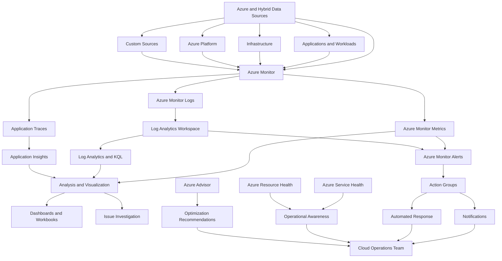
```mermaid
flowchart TD
    Sources[Azure and Hybrid Data Sources] --> Monitor[Azure Monitor]

    Sources --> Applications[Applications and Workloads]
    Sources --> Infrastructure[Infrastructure]
    Sources --> Platform[Azure Platform]
    Sources --> Custom[Custom Sources]

    Applications --> Monitor
    Infrastructure --> Monitor
    Platform --> Monitor
    Custom --> Monitor

    Monitor --> Metrics[Azure Monitor Metrics]
    Monitor --> Logs[Azure Monitor Logs]
    Monitor --> Traces[Application Traces]

    Logs --> Workspace[Log Analytics Workspace]
    Metrics --> Analysis[Analysis and Visualization]
    Workspace --> Analytics[Log Analytics and KQL]
    Traces --> Insights[Application Insights]

    Analytics --> Analysis
    Insights --> Analysis

    Analysis --> Dashboards[Dashboards and Workbooks]
    Analysis --> Investigation[Issue Investigation]

    Metrics --> Alerts[Azure Monitor Alerts]
    Workspace --> Alerts
    Alerts --> Actions[Action Groups]
    Actions --> Notifications[Notifications]
    Actions --> Automation[Automated Response]

    ServiceHealth[Azure Service Health] --> Operations[Operational Awareness]
    ResourceHealth[Azure Resource Health] --> Operations
    Advisor[Azure Advisor] --> Optimization[Optimization Recommendations]

    Notifications --> CloudTeam[Cloud Operations Team]
    Automation --> CloudTeam
    Operations --> CloudTeam
    Optimization --> CloudTeam
```

---

## Steps Performed

### Step 1: Review Azure Monitor

1. Opened Microsoft Learn.
2. Reviewed Azure Monitor as Microsoft Azure's centralized observability platform.
3. Reviewed the primary telemetry types:
   - Metrics
   - Logs
   - Traces
   - Events
4. Reviewed Azure Monitor capabilities:
   - Insights
   - Workbooks
   - Dashboards
   - Grafana
   - Metrics Explorer
   - Log Analytics
   - Alerts
   - Actions
   - Issue investigation

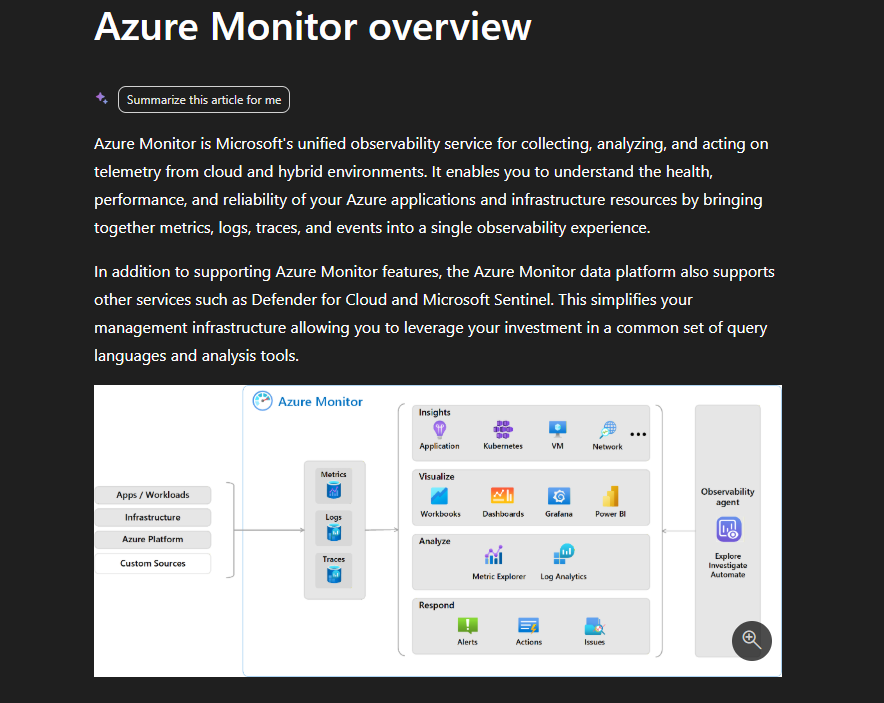

**Validation:** Microsoft Learn described Azure Monitor as a unified platform for collecting, analyzing, visualizing, and responding to telemetry.

---

### Step 2: Review Azure Monitor Metrics

1. Opened the Azure Monitor Metrics section.
2. Documented metrics as numerical values stored in a time-series database.
3. Reviewed metric categories:
   - Platform metrics
   - Advanced platform metrics
   - Custom metrics
   - Prometheus metrics
4. Reviewed how metrics support:
   - Performance analysis
   - Visualization
   - Dashboards
   - Alerts
5. Connected Prometheus metrics to Kubernetes monitoring and Grafana.

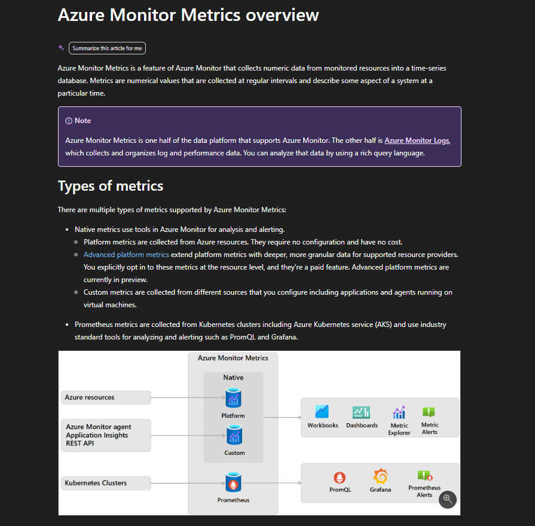

**Validation:** Microsoft Learn described numerical time-series metrics and the primary metric categories supported by Azure Monitor.

---

### Step 3: Review Azure Monitor Logs

1. Opened the Azure Monitor Logs section.
2. Reviewed centralized log collection from Azure and non-Azure sources.
3. Reviewed capabilities involving:
   - Data collection
   - Data transformation
   - Workspace tables
   - Retention
   - Access control
   - Cost optimization
   - KQL queries
   - Dashboards
   - Reports
   - Alerts
4. Documented Metrics and Logs as the two primary parts of the Azure Monitor data platform.

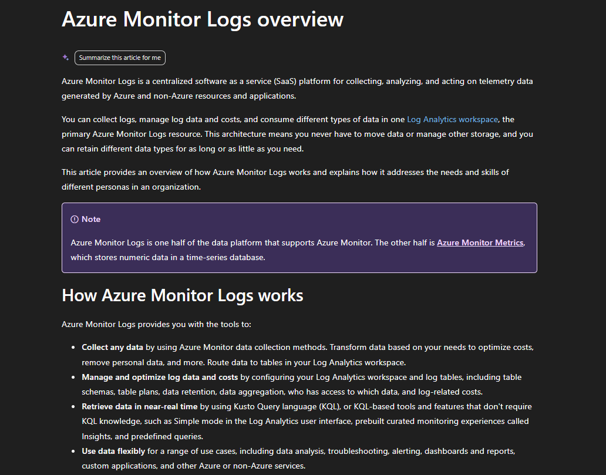

**Validation:** Microsoft Learn described Azure Monitor Logs as a centralized platform for collecting, storing, querying, and analyzing telemetry.

---

### Step 4: Review Log Analytics Workspaces

1. Opened the Log Analytics workspace section.
2. Documented a workspace as the primary data store for Azure Monitor Logs.
3. Reviewed:
   - Workspace tables
   - Table plans
   - Analytics retention
   - Long-term retention
   - Workspace access
   - Table-level access
   - Summary rules
   - Saved queries
   - Visualizations
   - Alerts
   - Network isolation
   - Regional architecture
4. Connected workspace design to governance, security, and cost.

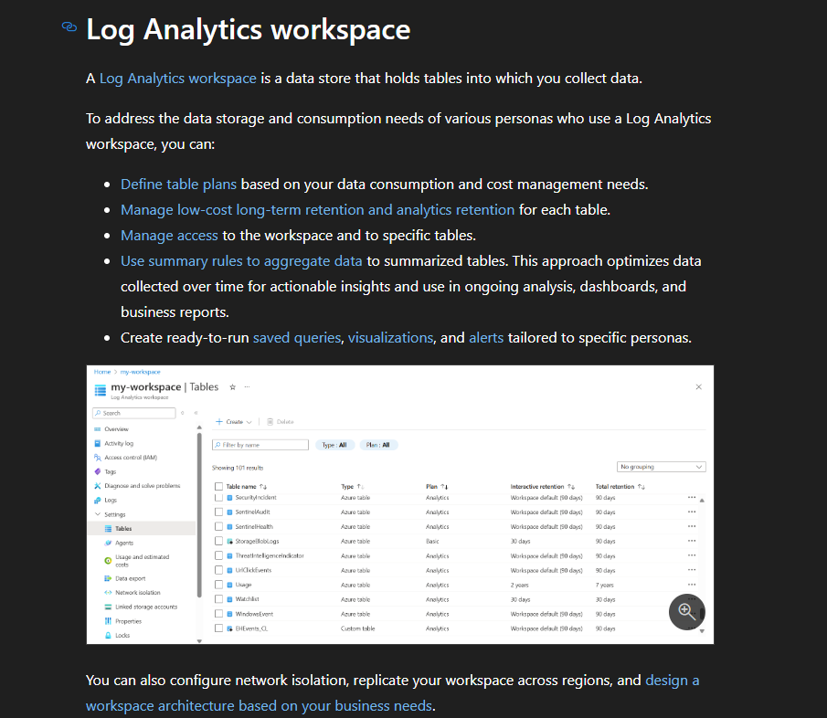

**Validation:** Microsoft Learn described Log Analytics workspaces as storage, access, retention, and governance boundaries for monitoring data.

---

### Step 5: Review Azure Monitor Alerts

1. Opened the Azure Monitor Alerts section.
2. Reviewed the alert workflow:
   1. A resource emits telemetry.
   2. Azure Monitor stores the metric or log.
   3. An alert rule evaluates a signal.
   4. Azure compares the signal against a condition.
   5. A fired alert is created when the condition is met.
   6. An action group can notify administrators or begin a response.
3. Reviewed alert-rule components:
   - Scope
   - Signal
   - Condition
   - Evaluation logic
   - Actions
4. Confirmed that no alert rule or action group was created.

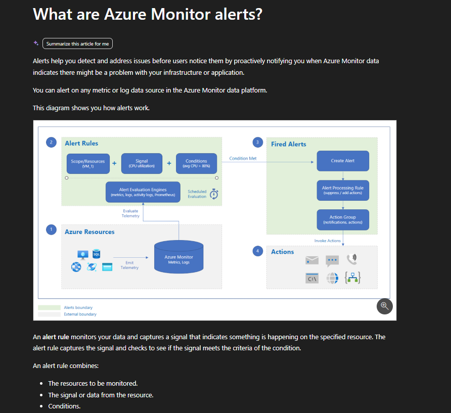

**Validation:** Microsoft Learn described the Azure Monitor alert workflow and the primary components of an alert rule.

---

### Step 6: Review Application Insights

1. Opened the Application Insights section.
2. Reviewed Application Insights as an application performance monitoring capability within Azure Monitor.
3. Reviewed capabilities involving:
   - Application health dashboards
   - Proactive monitoring
   - Alerts
   - Application usage
   - User navigation
   - Failures
   - Performance
   - Telemetry queries
4. Confirmed that no Application Insights resource was created.

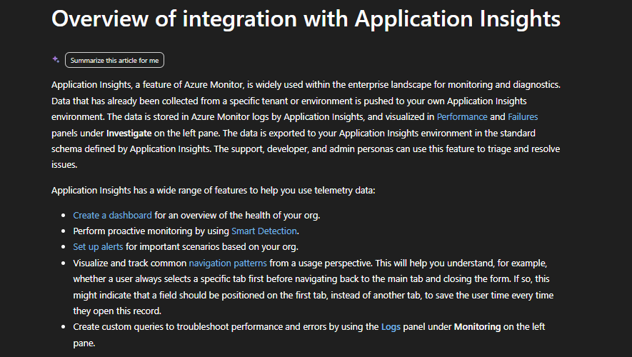

**Validation:** Microsoft Learn described Application Insights application-performance, failure-analysis, usage, and diagnostic capabilities.

---

### Step 7: Review Azure Service Health

1. Opened the Azure Service Health section.
2. Compared:
   - Azure Status
   - Service Health
   - Resource Health
3. Documented Azure Status as a broad public Azure availability view.
4. Documented Service Health as a personalized view of subscription-relevant service events.
5. Reviewed Service Health event categories:
   - Service issues
   - Planned maintenance
   - Health advisories
   - Security advisories
   - Billing updates
   - Health history

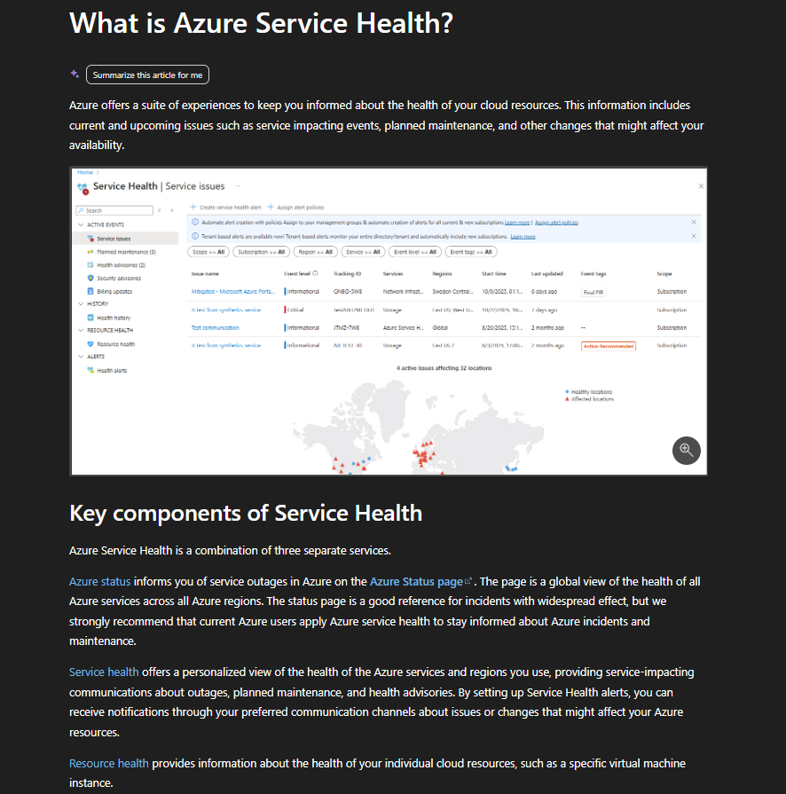

**Validation:** Microsoft Learn distinguished Azure Status, Service Health, and Resource Health.

---

### Step 8: Review Azure Resource Health

1. Opened the Azure Resource Health section.
2. Reviewed current and historical resource-health information.
3. Reviewed how Resource Health can help:
   - Diagnose availability problems
   - Identify platform issues
   - Review historical events
   - Determine when a resource was unavailable
   - Support service requests
   - Review possible service-level agreement impact

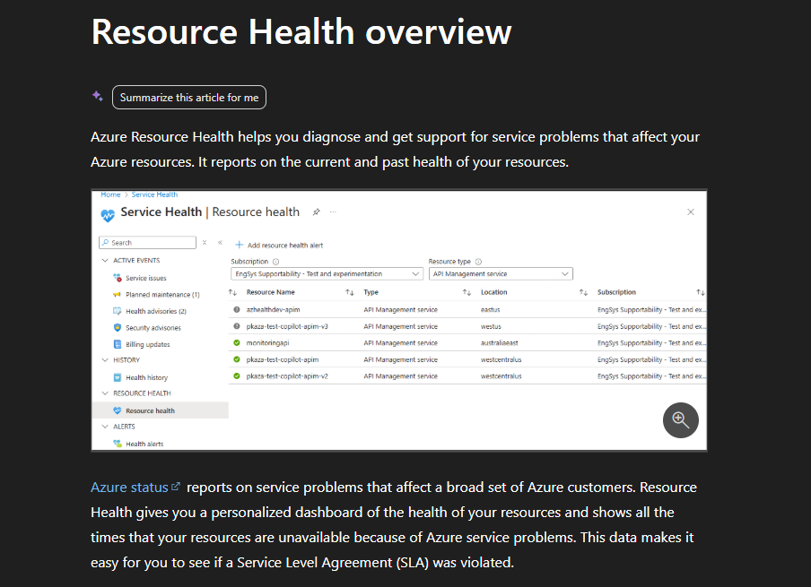

**Validation:** Microsoft Learn described Azure Resource Health as a service for reviewing current and historical health for individual resources.

---

### Step 9: Review Azure Advisor

1. Opened the Azure Advisor section.
2. Reviewed how Advisor analyzes Azure configuration and usage information.
3. Reviewed the five recommendation categories:
   - Cost
   - Security
   - Reliability
   - Operational Excellence
   - Performance
4. Documented Advisor recommendations as improvement opportunities requiring evaluation before implementation.

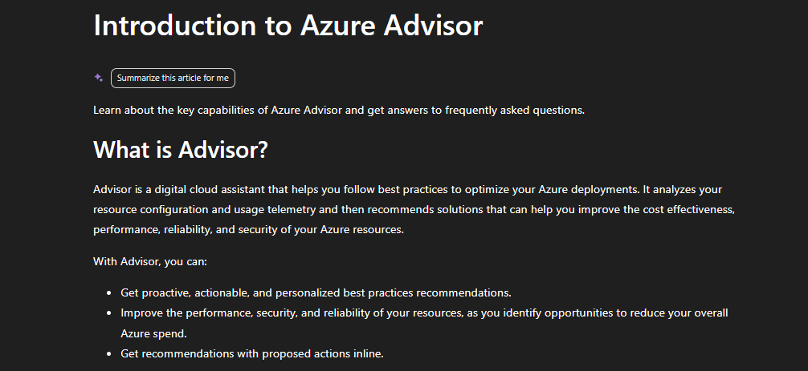

**Validation:** Microsoft Learn described Azure Advisor and its five recommendation categories.

---

### Step 10: Explore Azure Monitor in the Azure Portal

1. Opened Azure Monitor.
2. Reviewed centralized navigation to:
   - Application Insights
   - Container Insights
   - VM Insights
   - Network Insights
   - Metrics
   - Alerts
   - Logs
   - Workbooks
   - Grafana dashboards
   - Change Analysis
   - Diagnostic settings
   - Managed Prometheus
   - Health Model
3. Did not create a monitoring resource or configuration.

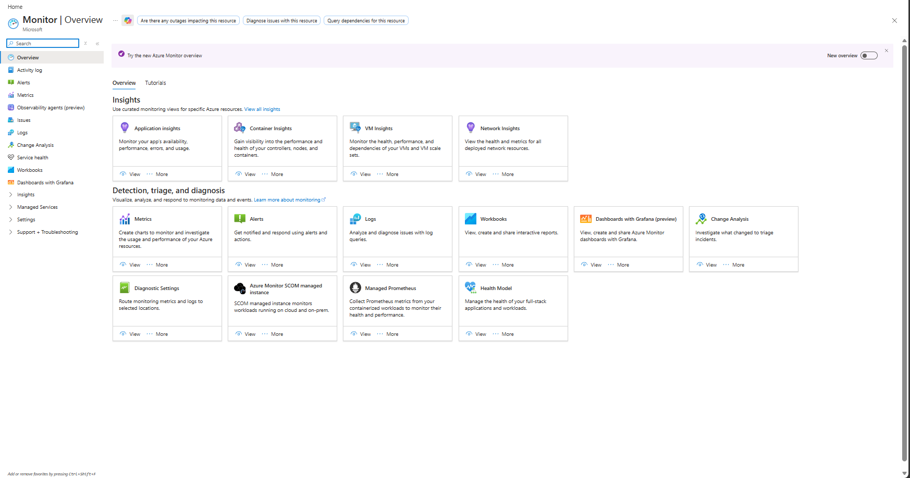

**Validation:** The Azure Portal displayed the centralized Azure Monitor management interface.

---

### Step 11: Explore Azure Monitor Metrics

1. Opened **Metrics** in Azure Monitor.
2. Reviewed options to:
   - Select a monitored scope
   - Add a metric
   - Apply filters
   - Split data by dimensions
   - Change chart types
   - Drill into logs
   - Create an alert rule
   - Save a chart to a dashboard
3. Confirmed that no metric data was displayed because no monitored resource was selected.
4. Did not create a chart, dashboard, or alert rule.

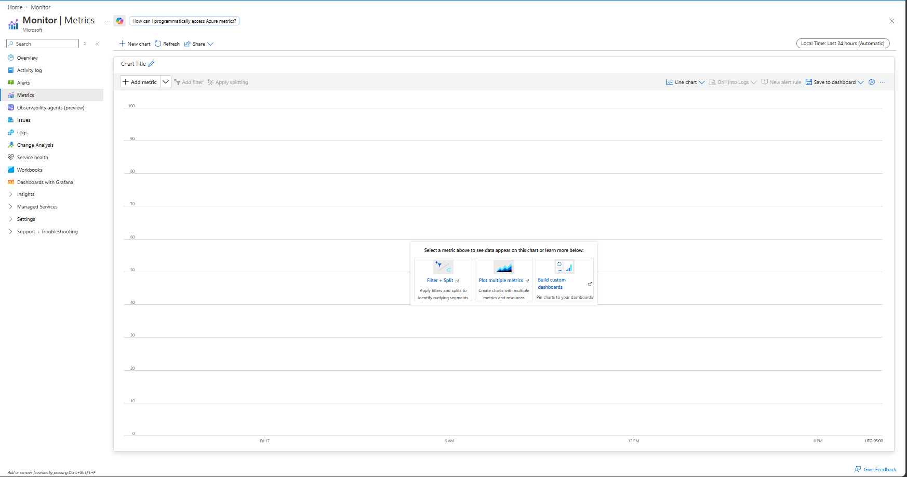

**Validation:** The Metrics interface was accessible and required a selected resource before displaying telemetry.

---

### Step 12: Explore Azure Monitor Logs

1. Opened **Logs** in Azure Monitor.
2. Reviewed the Log Analytics query interface.
3. Reviewed options to:
   - Select a resource
   - Select a table
   - Choose a time range
   - Use simple mode
   - Open the query interface
   - Review available monitoring data
4. Confirmed that the page required a selected resource before querying data.
5. Did not create a Log Analytics workspace.
6. Did not select a resource.
7. Did not execute a query.

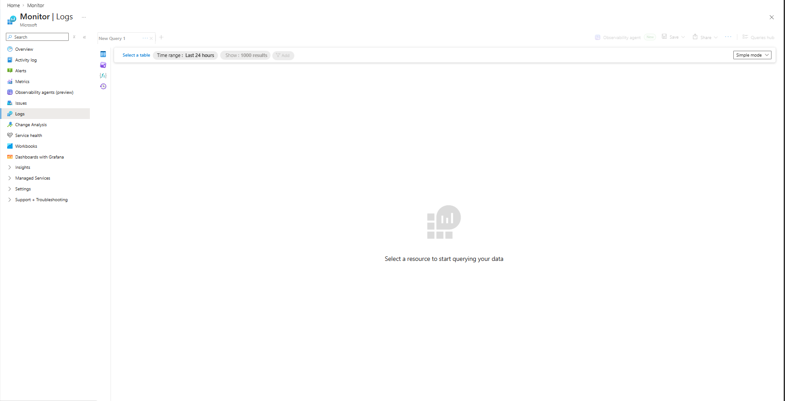

**Validation:** The Azure Monitor Logs interface was accessible and required a selected resource or workspace before querying telemetry.

---

### Step 13: Explore Azure Monitor Alerts

1. Opened **Alerts** in Azure Monitor.
2. Reviewed:
   - Fired alerts
   - Alert rules
   - Action groups
   - Alert processing rules
   - Prometheus rule groups
   - Timeline views
   - Alert filters
   - Severity filters
3. Confirmed that zero fired alerts were displayed across the listed severity levels.
4. Did not create an alert rule.
5. Did not create an action group.
6. Did not create an alert-processing rule.
7. Redacted the subscription identifier.

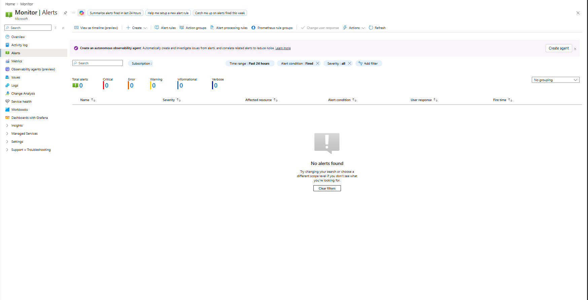

**Validation:** The Azure Portal displayed no fired Azure Monitor alerts.

---

### Step 14: Review Azure Service Health in the Azure Portal

1. Opened Azure Service Health.
2. Reviewed the **Service Issues** page.
3. Reviewed filters for:
   - Subscription
   - Region
   - Service
   - Event level
   - Event tags
4. Confirmed that no active service issues affected `MRTG-AZ900-Lab-Subscription`.
5. Reviewed navigation to:
   - Planned maintenance
   - Health advisories
   - Security advisories
   - Billing updates
   - Health history
   - Resource Health
   - Health alerts
6. Did not create a Service Health alert.

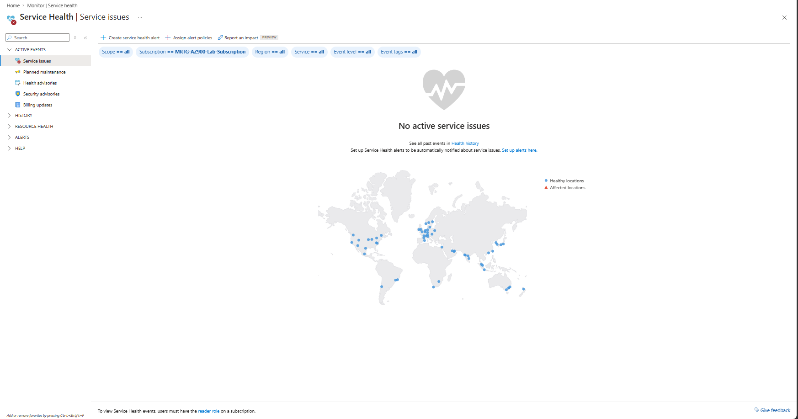

**Validation:** Azure Service Health displayed no active service issues affecting the selected subscription.

---

### Step 15: Review Azure Resource Health in the Azure Portal

1. Opened **Resource Health**.
2. Reviewed the selected subscription scope.
3. Confirmed that no registered resources were available for selection.
4. Documented that this was expected because the lab subscription did not contain a supported deployed resource for health evaluation.
5. Did not create a Resource Health alert.

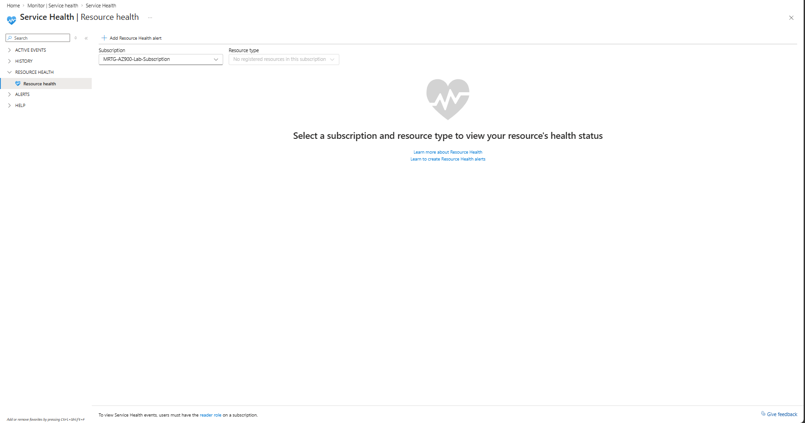

**Validation:** Azure Resource Health displayed no supported deployed resources available for health review.

---

### Step 16: Review Azure Advisor in the Azure Portal

1. Opened Azure Advisor.
2. Reviewed the five recommendation categories:
   - Cost
   - Security
   - Reliability
   - Operational Excellence
   - Performance
3. Reviewed the displayed results:
   - No active cost recommendations
   - Seven active security recommendations
   - Displayed security score of `100%`
   - No active reliability recommendations
   - No active Operational Excellence recommendations
   - No active performance recommendations
4. Did not implement a recommendation.

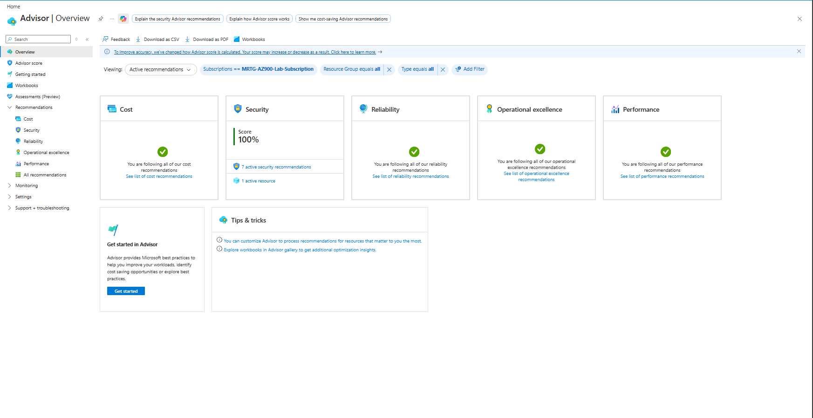

**Validation:** Azure Advisor displayed category-level recommendation information for the subscription.

---

### Step 17: Review Azure Advisor Recommendations

1. Opened **All Recommendations** in Azure Advisor.
2. Reviewed seven active security recommendations.
3. Reviewed recommendations involving:
   - Microsoft Defender for Storage
   - Additional subscription Owner assignment
   - Microsoft Defender Cloud Security Posture Management
   - Microsoft Defender for Resource Manager
   - Email notifications for high-severity alerts
   - Subscription Owner notifications
   - Security contact information
4. Reviewed recommendation impact levels:
   - High
   - Medium
   - Low
5. Did not:
   - Enable a Defender plan
   - Add a subscription Owner
   - Change notification settings
   - Change security contact information
   - Dismiss a recommendation
   - Implement a recommendation

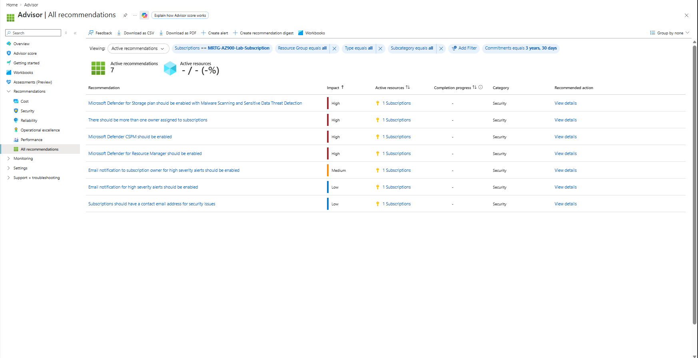

**Validation:** Azure Advisor displayed seven active security recommendations, and no recommendation was implemented.

---

## Monitoring Services Summary

| Service or Feature | Primary Purpose |
|---|---|
| Azure Monitor | Centralized observability platform |
| Azure Monitor Metrics | Numerical time-series performance monitoring |
| Azure Monitor Logs | Detailed telemetry collection and analysis |
| Log Analytics Workspace | Storage and governance boundary for log data |
| Log Analytics | Query interface for workspace data |
| Azure Monitor Alerts | Detect and respond to telemetry conditions |
| Action Groups | Define alert notifications and automated actions |
| Application Insights | Application performance monitoring |
| Azure Service Health | Personalized Azure service-event awareness |
| Azure Resource Health | Individual resource-health visibility |
| Azure Advisor | Configuration and optimization recommendations |

---

## Monitoring Mental Model

```text
Azure Monitor
Collects and analyzes telemetry.

Metrics
Provide numerical time-series data.

Logs
Provide detailed event and operational records.

Log Analytics Workspace
Stores log data and defines access, retention, and regional boundaries.

Log Analytics
Provides the interface for querying workspace data.

Alerts
Evaluate signals and identify conditions requiring attention.

Action Groups
Notify teams or begin automated responses.

Application Insights
Monitors application performance, failures, dependencies, and usage.

Service Health
Reports Azure platform events that may affect the organization.

Resource Health
Reports the health of individual Azure resources.

Azure Advisor
Provides recommendations for cost, security, reliability, performance, and operations.
```

---

## Metrics vs Logs

| Area | Metrics | Logs |
|---|---|---|
| Data type | Numerical time-series values | Detailed structured or unstructured records |
| Primary use | Fast performance monitoring | Investigation and historical analysis |
| Common examples | CPU percentage and request count | Activity records and application exceptions |
| Query method | Metrics Explorer and supported APIs | Kusto Query Language |
| Alerting | Metric alerts | Log-search alerts |
| Storage model | Metrics database | Log Analytics workspace tables |
| Best fit | Dashboards, trends, and thresholds | Correlation, troubleshooting, auditing, and security analysis |

### Key Takeaway

Metrics answer:

```text
What is happening numerically over time?
```

Logs answer:

```text
What detailed events occurred, and how are they related?
```

---

## Azure Monitor Data Flow

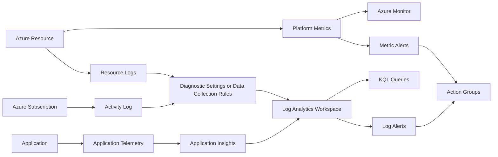
```mermaid
flowchart LR
    Resource[Azure Resource] --> Metrics[Platform Metrics]
    Resource --> Logs[Resource Logs]
    Subscription[Azure Subscription] --> Activity[Activity Log]
    Application[Application] --> Telemetry[Application Telemetry]

    Metrics --> Monitor[Azure Monitor]
    Logs --> DCR[Diagnostic Settings or Data Collection Rules]
    Activity --> DCR
    Telemetry --> Insights[Application Insights]

    DCR --> Workspace[Log Analytics Workspace]
    Insights --> Workspace

    Metrics --> Alerts[Metric Alerts]
    Workspace --> Queries[KQL Queries]
    Workspace --> LogAlerts[Log Alerts]

    Alerts --> Actions[Action Groups]
    LogAlerts --> Actions
```

---

## Alert Rule Components

| Component | Purpose |
|---|---|
| Scope | Defines the resource or resources being monitored |
| Signal | Defines the metric, log query, or event being evaluated |
| Condition | Defines when the alert should fire |
| Evaluation frequency | Defines how often the condition is checked |
| Lookback period | Defines the data window being evaluated |
| Severity | Defines the operational importance |
| Action group | Defines who or what receives the alert |
| Alert processing rule | Controls notification or alert-processing behavior |

### Example Alert

```text
Scope:
Production web application

Signal:
Failed requests

Condition:
More than 25 failed requests in 5 minutes

Severity:
Sev 2

Action group:
Application Support

Response:
Email notification and incident creation
```

---

## Service Health vs Resource Health

| Area | Azure Service Health | Azure Resource Health |
|---|---|---|
| Primary focus | Azure platform events affecting subscribed services and regions | Health of an individual Azure resource |
| Example issue | Regional Azure service outage | One virtual machine is unavailable |
| Planned maintenance | Included | Can appear when relevant to the resource |
| Historical information | Health history | Resource health history |
| Alert support | Service Health alerts | Resource Health alerts |
| Best question answered | Is Azure experiencing an event that affects us? | Is this specific resource healthy? |

---

## Azure Advisor Categories

| Category | Focus |
|---|---|
| Cost | Reduce or optimize Azure spending |
| Security | Improve security configuration |
| Reliability | Improve resiliency and availability |
| Operational Excellence | Improve management and operational processes |
| Performance | Improve workload performance |

Advisor recommendations should be evaluated for:

- Business impact
- Security impact
- Cost impact
- Service dependencies
- Licensing requirements
- Change-management requirements
- Testing requirements

---

## Validation

| Validation Item | Expected Result | Actual Result |
|---|---|---|
| Azure Monitor | Central monitoring concepts are reviewed | Passed |
| Azure Monitor Metrics | Time-series metric concepts are reviewed | Passed |
| Azure Monitor Logs | Detailed telemetry concepts are reviewed | Passed |
| Log Analytics workspace | Storage, retention, and access concepts are reviewed | Passed |
| Azure Monitor Alerts | Alert workflow and components are reviewed | Passed |
| Application Insights | Application monitoring concepts are reviewed | Passed |
| Azure Service Health | Personalized service-health concepts are reviewed | Passed |
| Azure Resource Health | Individual resource-health concepts are reviewed | Passed |
| Azure Advisor | Recommendation categories are reviewed | Passed |
| Azure Monitor Portal | Central monitoring interface is accessible | Passed |
| Metrics Explorer | Metrics interface is accessible | Passed |
| Metrics data | No data is displayed without a selected resource | Passed |
| Azure Monitor Logs | Logs interface is accessible | Passed |
| Log query | No query is executed | Passed |
| Alerts interface | Alert-management interface is accessible | Passed |
| Fired alerts | Zero fired alerts are displayed | Passed |
| Service Health | No active service issues affect the subscription | Passed |
| Resource Health | No supported resources are available for selection | Passed |
| Advisor overview | Recommendation categories are displayed | Passed |
| Advisor recommendations | Seven security recommendations are reviewed | Passed |
| Advisor changes | No recommendation is implemented | Passed |
| Log Analytics workspace | No workspace is created | Passed |
| Application Insights | No resource is created | Passed |
| Alert rules | No alert rule is created | Passed |
| Action groups | No action group is created | Passed |
| Monitoring configuration | No existing configuration is modified | Passed |
| Expected incremental cost | Lab remains within the `$0.00` estimate | Passed |

---

## Completion Checklist

- [x] Reviewed Azure Monitor
- [x] Reviewed Azure Monitor Metrics
- [x] Reviewed Azure Monitor Logs
- [x] Reviewed Log Analytics workspaces
- [x] Reviewed Log Analytics and KQL concepts
- [x] Reviewed Azure Monitor Alerts
- [x] Reviewed action groups
- [x] Reviewed Application Insights
- [x] Reviewed Azure Service Health
- [x] Reviewed Azure Resource Health
- [x] Reviewed Azure Advisor
- [x] Opened Azure Monitor in the Azure Portal
- [x] Opened Metrics Explorer
- [x] Opened the Azure Monitor Logs interface
- [x] Opened the Azure Monitor Alerts interface
- [x] Reviewed fired-alert counts
- [x] Checked for active Azure service issues
- [x] Reviewed the Resource Health interface
- [x] Reviewed Azure Advisor categories
- [x] Reviewed active Advisor recommendations
- [x] Did not create a Log Analytics workspace
- [x] Did not create an Application Insights resource
- [x] Did not create an alert rule
- [x] Did not create an action group
- [x] Did not create a workbook
- [x] Did not create a dashboard
- [x] Did not configure diagnostic settings
- [x] Did not create a data collection rule
- [x] Did not install a monitoring agent
- [x] Did not implement Advisor recommendations
- [x] Did not modify existing Azure resources
- [x] Confirmed expected incremental cost remained `$0.00`
- [x] Sanitized screenshots before upload
- [x] Avoided exposing subscription, tenant, directory, user, object, or billing information

---

## AZ-900 Exam Objective Coverage

### Primary Exam Domain

```text
Describe Azure management and governance
```

### Supporting Exam Domain

```text
Describe Azure architecture and services
```

### Skills Measured

This lab supports the ability to:

- Describe Azure Monitor
- Describe Azure Monitor Metrics
- Describe Azure Monitor Logs
- Describe Log Analytics
- Describe Log Analytics workspaces
- Describe Azure Monitor Alerts
- Describe action groups
- Describe Application Insights
- Describe Azure Service Health
- Describe Azure Resource Health
- Describe Azure Advisor
- Compare Metrics and Logs
- Compare Service Health and Resource Health
- Describe Azure monitoring and optimization concepts
- Describe monitoring cost considerations

### How This Lab Supports the Objectives

This lab connected Azure monitoring concepts to practical Azure Portal review.

It demonstrated:

- How Azure Monitor centralizes telemetry
- How Metrics provides numerical time-series data
- How Logs provides detailed operational records
- How Log Analytics workspaces store log data
- How alerts evaluate signals and trigger actions
- How Application Insights monitors application behavior
- How Service Health reports Azure platform events
- How Resource Health reports individual resource health
- How Azure Advisor identifies improvement opportunities
- How monitoring services can be reviewed without creating resources

---

## Mini Objective Coverage

By completing this lab, I can:

- Explain the purpose of Azure Monitor
- Explain what Azure Monitor Metrics provides
- Explain what Azure Monitor Logs provides
- Compare Metrics and Logs
- Explain the purpose of a Log Analytics workspace
- Explain the purpose of Log Analytics
- Explain how KQL relates to Azure Monitor Logs
- Identify the components of an alert rule
- Explain the purpose of an action group
- Explain what Application Insights monitors
- Compare Azure Status, Service Health, and Resource Health
- Explain the purpose of Azure Advisor
- Identify the five Advisor recommendation categories
- Explain why monitoring data requires governance
- Explain why empty monitoring views can still be valid evidence
- Identify common monitoring cost drivers
- Validate Azure monitoring interfaces without deploying resources

---

## IAM / Security Relevance

Azure monitoring is directly connected to identity and access management and cloud security operations.

### Monitoring Data Sensitivity

Monitoring data may contain:

- User names
- Authentication events
- IP addresses
- Device information
- Administrative actions
- Resource names
- Application errors
- Security events
- Query results
- Service-account activity

Access to monitoring data should follow least privilege.

### Monitoring Access Boundaries

Access can be controlled at areas such as:

- Azure Monitor
- Log Analytics workspaces
- Workspace tables
- Alert rules
- Action groups
- Application Insights
- Service Health
- Azure Advisor

An identity that can modify monitoring may be able to:

- Disable an alert
- Change alert thresholds
- Change notification recipients
- Remove diagnostic settings
- Change retention
- Modify queries
- Reduce audit evidence

### Authentication and Authorization Monitoring

Azure Monitor Logs can support analysis of identity-related activity such as:

- Sign-in events
- Authentication failures
- Administrative changes
- Role-assignment changes
- Conditional Access events
- Privileged activity
- Application-consent events

These logs can support:

- Security investigations
- Access reviews
- Threat detection
- Compliance reporting
- Incident response
- Microsoft Sentinel

### Identity Alerting

Alert rules can help detect:

- Repeated authentication failures
- Unexpected role assignments
- Privileged-role changes
- Changes to authentication settings
- Resource deletion
- Policy changes
- Monitoring changes
- Service outages affecting identity services

### Advisor Security Recommendations

The Advisor findings reviewed in this lab demonstrated that Azure can identify subscription-level security configuration opportunities even when workload resources are limited.

The recommendations included areas such as:

- Microsoft Defender plans
- Subscription Owner redundancy
- High-severity alert notifications
- Security contact information

### Separation of Duties

Production environments should separate responsibilities for:

- Creating monitoring rules
- Managing action groups
- Responding to alerts
- Administering Log Analytics
- Reviewing security logs
- Implementing Advisor recommendations
- Managing monitoring retention

An account should not automatically be able to perform a privileged action and remove the evidence or alert associated with that action.

### Regulated Environment Relevance

In government, defense, healthcare, finance, and other regulated environments, monitoring supports:

- Audit evidence
- Administrative accountability
- Incident response
- Access reviews
- Threat detection
- Compliance reporting
- Availability reporting
- Change management
- Service-level review
- Security investigations

### Security Takeaway

Monitoring provides the evidence required to understand what happened, who performed an action, when the action occurred, and whether the environment responded correctly.

---

## Governance Notes

### Governance Decisions

| Decision | Implementation | Reason |
|---|---|---|
| Discovery-only lab | Monitoring services were reviewed without deployment | Prevented unnecessary resources and cost |
| Microsoft Learn used | Certification-aligned monitoring content reviewed | Supported AZ-900 preparation |
| Azure Portal used | Monitoring interfaces were reviewed directly | Connected theory to practical administration |
| No workspace created | Log Analytics reviewed conceptually | Avoided ingestion and retention costs |
| No alerts created | Alert interfaces reviewed only | Prevented unnecessary notification configuration |
| Advisor recommendations not implemented | Review only | Prevented unapproved security or licensing changes |
| Screenshots sanitized | Sensitive identifiers were redacted | Protected environment information |

### Governance Lesson

Monitoring must be designed before resources are deployed.

A production monitoring strategy should define:

- Required telemetry
- Data owners
- Workspace architecture
- Data residency
- Access control
- Retention
- Table plans
- Diagnostic settings
- Data collection rules
- Alert ownership
- Severity standards
- Escalation procedures
- Service Health notifications
- Advisor review cadence
- Cost ownership
- Privacy requirements

### Diagnostic Settings

Azure resources do not automatically send every supported log to a Log Analytics workspace.

Diagnostic settings can route supported telemetry to:

- Log Analytics workspaces
- Storage accounts
- Event Hubs
- Partner monitoring services

Diagnostic settings should be standardized and reviewed through governance controls.

### Workspace Governance

A Log Analytics workspace strategy should consider:

- Centralized or distributed design
- Region
- Subscription
- Environment
- Security boundary
- Data classification
- Access model
- Retention
- Table plans
- Network isolation
- Microsoft Sentinel integration
- Cost allocation

### Alert Governance

Alert rules should use:

- Consistent naming
- Approved severity levels
- Documented ownership
- Tested action groups
- Escalation procedures
- Maintenance windows
- Suppression rules where appropriate
- Runbooks
- Periodic review

### Advisor Governance

Advisor recommendations should be reviewed through a formal process.

Each recommendation should be classified as:

- Implemented
- Planned
- Deferred
- Accepted risk
- Not applicable
- Assigned for investigation

Recommendations should not be implemented automatically without evaluating dependencies and operational impact.

---

## Cost Considerations

### Estimated Lab Cost

```text
Expected incremental cost: $0.00
```

### Why Cost Remained at Zero

This lab did not create or modify:

- Log Analytics workspaces
- Application Insights resources
- Alert rules
- Action groups
- Workbooks
- Dashboards
- Data collection rules
- Diagnostic settings
- Monitoring agents
- Managed Prometheus resources
- Service Health alerts
- Resource Health alerts
- Azure Advisor configurations
- Microsoft Defender plans

### Common Monitoring Cost Drivers

- Log ingestion
- Log retention
- Search jobs
- Data export
- Archive retrieval
- Application Insights telemetry
- Managed Prometheus
- Custom metrics
- Alert evaluations
- Notification services
- Storage destinations
- Event Hub destinations
- Monitoring agents
- Microsoft Sentinel
- Premium security services

### Monitoring Cost Controls

- Collect only required telemetry
- Avoid duplicate data collection
- Use data collection rules
- Select appropriate table plans
- Configure appropriate retention
- Filter unnecessary logs
- Review ingestion volume
- Review Application Insights sampling
- Review workspace usage
- Apply cost-center tags
- Configure monitoring budgets
- Review Azure Advisor recommendations

### Cost and Security Tradeoff

Reducing telemetry can lower cost, but removing required security or operational data can weaken:

- Incident response
- Troubleshooting
- Compliance evidence
- Threat detection
- Performance analysis
- Availability reporting

Monitoring cost optimization should preserve required evidence and visibility.

---

## Troubleshooting Notes

### Issue 1: Metrics Displayed No Data

**Symptom**

The Metrics interface did not display telemetry.

**Explanation**

No monitored resource or metric had been selected.

**Production Resolution**

1. Select a resource scope.
2. Select a metric namespace.
3. Select a metric.
4. Select an aggregation.
5. Choose a time range.
6. Apply filters or dimensions.

**Lab Result**

No chart or alert rule was created.

---

### Issue 2: Logs Required a Resource or Workspace

**Symptom**

The Logs interface required a selected resource or workspace before a query could be executed.

**Explanation**

No Log Analytics workspace or monitored resource was selected.

**Resolution**

The query interface was reviewed without creating a workspace or running a query.

**Result**

No log-ingestion cost was introduced.

---

### Issue 3: Alerts Displayed a Subscription Identifier

**Symptom**

The Alerts page displayed a subscription identifier in a filter.

**Risk**

Subscription IDs should not be published in a public repository.

**Resolution**

The identifier was covered with solid opaque redaction.

**Result**

The alert interface remained visible without exposing the subscription ID.

---

### Issue 4: Resource Health Displayed No Resources

**Symptom**

Resource Health displayed no registered resources available for selection.

**Explanation**

The subscription did not contain a supported deployed resource for Resource Health evaluation.

**Result**

The empty state was documented as an expected lab outcome.

---

### Issue 5: Service Health Displayed No Active Issues

**Symptom**

Service Health displayed no active service issues.

**Explanation**

No Azure platform event was affecting the selected subscription at the time of the review.

**Result**

The no-issue state was valid evidence that Service Health was located and reviewed.

---

### Issue 6: Advisor Displayed Recommendations Without Workloads

**Symptom**

Azure Advisor displayed security recommendations even though no workload resources were deployed.

**Explanation**

Advisor can evaluate subscription-level configuration in addition to deployed resource configuration.

**Result**

Seven subscription-level security recommendations were reviewed.

---

### Issue 7: Advisor Displayed a 100% Score With Active Recommendations

**Symptom**

The Advisor overview displayed a security score of `100%` while also showing seven active security recommendations.

**Explanation**

Different Azure views may use different:

- Scopes
- Scoring methods
- Refresh schedules
- Recommendation sources

**Resolution**

The detailed recommendations were reviewed instead of relying only on the summary score.

**Result**

The lab documented the apparent difference without changing the environment.

---

## What I Would Do Differently in Production

A production Azure environment would require formal monitoring, identity, security, operations, governance, and cost planning.

### Log Analytics Architecture

- Determine centralized or distributed workspace design
- Select approved regions
- Separate production and non-production data where required
- Define security-specific workspaces where appropriate
- Define Microsoft Sentinel integration
- Define table plans
- Define retention requirements
- Define archive requirements
- Configure private access where required
- Apply workspace-level and table-level access controls

### Diagnostic Settings

- Identify required resource logs
- Route Azure Activity Logs
- Route required platform logs
- Route required metrics
- Use approved destinations
- Validate diagnostic-setting coverage
- Apply Azure Policy where appropriate
- Monitor missing configurations
- Document exceptions

### Data Collection Rules

- Define which data should be collected
- Define which resources send data
- Apply filtering and transformation
- Control destination workspaces
- Review ingestion volume
- Prevent duplicate data collection
- Store configurations in source control

### Alert Rules

- Create alerts for resource unavailability
- Create alerts for failed deployments
- Create alerts for high resource utilization
- Create alerts for application failures
- Create alerts for capacity thresholds
- Create alerts for security events
- Create alerts for resource deletion
- Create alerts for policy changes
- Test all action groups
- Document alert ownership

### Action Groups

- Create separate action groups for:
  - Cloud Operations
  - Security Operations
  - Application Support
  - Network Operations
  - Executive Incident Notification
- Validate recipients
- Test notification methods
- Document escalation paths
- Review action groups regularly

### Application Insights

- Enable Application Insights for supported applications
- Configure availability tests
- Configure failure alerts
- Configure performance thresholds
- Review dependency monitoring
- Configure sampling
- Define retention
- Protect telemetry access
- Review sensitive application data

### Service Health

- Create alerts for:
  - Service issues
  - Planned maintenance
  - Health advisories
  - Security advisories
- Assign operational owners
- Document response procedures
- Review health history

### Azure Advisor

- Review recommendations regularly
- Assign recommendation owners
- Document implementation decisions
- Estimate cost and security impact
- Track accepted risks
- Validate changes
- Review recommendation refresh status

### Identity and Access

- Use Microsoft Entra work accounts
- Separate administrative and standard-user accounts
- Apply least privilege
- Use group-based assignments
- Use Privileged Identity Management
- Require multifactor authentication
- Configure Conditional Access
- Perform access reviews
- Monitor monitoring-configuration changes

### Governance

- Use Azure Policy for monitoring requirements
- Require diagnostic settings
- Require approved workspaces
- Require tags
- Apply resource locks to critical monitoring resources
- Use Infrastructure as Code
- Store configurations in source control
- Require peer review
- Maintain exception procedures

### Cost Management

- Estimate ingestion volume
- Review retention costs
- Review Application Insights volume
- Review alert evaluation costs
- Configure monitoring budgets
- Review workspace usage
- Apply cost-center tags
- Remove unnecessary telemetry
- Preserve required security and audit data

The lab intentionally avoided monitoring deployment because its purpose was service discovery and AZ-900 concept validation.

---

## Lessons Learned

- Azure Monitor is a platform containing multiple monitoring and analysis capabilities.
- Metrics provide numerical time-series values.
- Logs provide detailed records for investigation and historical analysis.
- Log Analytics workspaces are storage, access, retention, and governance boundaries.
- Azure Monitor Alerts require scope, signal, condition, evaluation, severity, and actions.
- Action groups define alert notifications and automated responses.
- Application Insights provides application-level monitoring.
- Azure Service Health reports Azure platform events affecting the organization.
- Azure Resource Health reports health information for individual resources.
- Azure Advisor identifies improvement opportunities across five categories.
- Advisor can provide subscription-level recommendations without deployed workloads.
- Empty monitoring results can still provide valid discovery evidence.
- Monitoring data can contain sensitive identity and operational information.
- Monitoring configuration requires least privilege and separation of duties.
- Monitoring can create significant ingestion and retention costs.
- Detailed recommendations should be reviewed instead of relying only on summary scores.

### Technical Takeaway

Azure Monitor combines Metrics, Logs, Alerts, Application Insights, and visualization tools to provide centralized observability.

### Business Takeaway

Centralized monitoring reduces downtime, improves incident response, supports service management, and provides evidence for operational decisions.

### Security Takeaway

Monitoring provides the evidence required to investigate authentication events, administrative changes, suspicious activity, and configuration drift.

### Exam Takeaway

For AZ-900, remember:

- Azure Monitor is the centralized observability platform.
- Metrics are numerical time-series values.
- Logs contain detailed telemetry records.
- Log Analytics workspaces store Azure Monitor Logs.
- Log Analytics provides log-query capabilities.
- Alerts evaluate signals and trigger responses.
- Action groups define notifications and actions.
- Application Insights monitors application performance.
- Service Health reports Azure service events affecting an organization.
- Resource Health reports health for individual resources.
- Azure Advisor provides cost, security, reliability, performance, and Operational Excellence recommendations.

---

## Cleanup

### Resources Retained

| Resource or Configuration | Reason |
|---|---|
| MRTG Azure subscription | Required for the final lab |
| Azure Monitor service access | Required for future monitoring review |
| Azure Service Health access | Required for platform-health awareness |
| Azure Advisor access | Required for recommendation review |
| Lab 12 documentation | Retained as project evidence |
| Lab 12 screenshots | Retained as validation evidence |

### Resources Removed

No monitoring, alerting, application-performance, health, or optimization resources were created during this lab.

### Cleanup Validation

- [x] No Log Analytics workspaces were created
- [x] No Application Insights resources were created
- [x] No alert rules were created
- [x] No action groups were created
- [x] No alert-processing rules were created
- [x] No workbooks were created
- [x] No dashboards were created
- [x] No diagnostic settings were created
- [x] No data collection rules were created
- [x] No monitoring agents were installed
- [x] No Managed Prometheus resources were created
- [x] No Service Health alerts were created
- [x] No Resource Health alerts were created
- [x] No Advisor recommendations were implemented
- [x] No Defender plans were enabled
- [x] No subscription owners were added
- [x] No security notification settings were changed
- [x] No Azure resources were modified
- [x] Expected incremental cost remained `$0.00`
- [x] Screenshot data was sanitized

---

## Outcome

This lab documented the Azure monitoring, health, and optimization foundation required for cloud operations.

The completed lab demonstrated:

- Understanding of Azure Monitor
- Understanding of Azure Monitor Metrics
- Understanding of Azure Monitor Logs
- Understanding of Log Analytics workspaces
- Understanding of Kusto Query Language concepts
- Understanding of Azure Monitor Alerts
- Understanding of action groups
- Understanding of Application Insights
- Understanding of Azure Service Health
- Understanding of Azure Resource Health
- Understanding of Azure Advisor
- Understanding of Metrics and Logs differences
- Understanding of Service Health and Resource Health differences
- Awareness of monitoring-data sensitivity
- Awareness of monitoring governance requirements
- Awareness of monitoring cost drivers
- Practical Azure Portal validation
- Review of seven active Advisor security recommendations
- No monitoring resources or configurations created
- Expected incremental cost of `$0.00`

---

## Screenshot Inventory

| Screenshot | Description |
|---|---|
| `01-azure-monitor-overview.png` | Azure Monitor overview |
| `02-azure-monitor-metrics-overview.png` | Azure Monitor Metrics overview |
| `03-azure-monitor-logs-overview.png` | Azure Monitor Logs overview |
| `04-log-analytics-overview.png` | Log Analytics workspace overview |
| `05-azure-monitor-alerts-overview.png` | Azure Monitor Alerts workflow |
| `06-application-insights-overview.png` | Application Insights overview |
| `07-azure-service-health-overview.png` | Azure Service Health overview |
| `08-azure-resource-health-overview.png` | Azure Resource Health overview |
| `09-azure-advisor-overview.png` | Azure Advisor overview |
| `10-azure-monitor-portal.png` | Azure Monitor Portal overview |
| `11-azure-monitor-metrics-portal.png` | Azure Monitor Metrics interface |
| `12-azure-monitor-logs-portal.png` | Azure Monitor Logs interface |
| `13-azure-monitor-alerts-portal.png` | Azure Monitor Alerts interface with zero fired alerts |
| `14-azure-service-health-portal.png` | Azure Service Health with no active service issues |
| `15-azure-resource-health-portal.png` | Azure Resource Health with no available resources |
| `16-azure-advisor-portal.png` | Azure Advisor category overview |
| `17-advisor-recommendations-portal.png` | Active Azure Advisor security recommendations |

---

## Screenshots

### Azure Monitor Overview


### Azure Monitor Metrics Overview


### Azure Monitor Logs Overview


### Log Analytics Workspace Overview


### Azure Monitor Alerts Overview


### Application Insights Overview


### Azure Service Health Overview


### Azure Resource Health Overview


### Azure Advisor Overview


### Azure Monitor Portal


### Azure Monitor Metrics Portal


### Azure Monitor Logs Portal


### Azure Monitor Alerts Portal


### Azure Service Health Portal


### Azure Resource Health Portal


### Azure Advisor Portal


### Azure Advisor Recommendations Portal


---

## Next Lab

The next lab is:

```text
Lab 13 - MRTG Azure Fundamentals Capstone
```

The final lab brings the series together by reviewing:

- Azure subscription structure
- Resource groups
- Azure resources
- Microsoft Entra ID
- Azure RBAC
- Resource tags
- Azure Policy
- Resource locks
- Management groups
- Azure deployments
- Cost Management
- Azure Monitor
- Azure Service Health
- Azure Resource Health
- Azure Advisor
- Overall Azure governance and operational readiness
