# Lab 13 - MRTG Azure Fundamentals Capstone

## Objective

The objective of this capstone was to perform a structured final review of the Azure environment used throughout the **MRTG Azure Fundamentals: The Bridge** project.

This lab brought together concepts from the complete AZ-900 lab series, including:

- Azure architecture and resource hierarchy
- Microsoft Entra ID
- Azure role-based access control
- Resource organization
- Azure Policy
- Resource locks
- Management groups
- Azure Resource Manager deployments
- Cost Management
- Budgets
- Cost alerts
- Azure Monitor
- Azure Service Health
- Azure Resource Health
- Azure Advisor

This was a discovery and validation lab. No Azure resources, role assignments, tags, policies, locks, deployments, alerts, or monitoring configurations were created, modified, or deleted.

---

## Business Problem Solved

Organizations need a repeatable process for reviewing a cloud environment before closing a project, transferring ownership, approving additional development, or preparing for an audit.

Without a structured environment review, cloud administrators may overlook:

- Unexpected resources
- Unapproved deployments
- Excessive permissions
- Missing resource organization
- Policy compliance findings
- Unprotected critical resources
- Cost exposure
- Active Azure service incidents
- Monitoring gaps
- Security recommendations
- Unnecessary cloud spending

This capstone demonstrated how an Azure administrator can review the identity, governance, cost, monitoring, and operational state of a subscription without changing the environment.

---

## Scenario

Monroe Redstone Technology Group completed its Azure Fundamentals lab series and required a final assessment of the Azure environment.

As part of the MRTG Cloud Operations review, the following areas were evaluated:

- Azure portal access
- Subscription status
- Resource organization
- Microsoft Entra ID
- Azure RBAC
- Subscription tags
- Azure Policy compliance
- Resource locks
- Management group hierarchy
- Deployment history
- Cost Management
- Azure Monitor
- Service Health
- Resource Health
- Azure Advisor

The goal was to verify that the environment remained documented, controlled, secure, and cost-conscious before completing the project.

---

## Azure Services and Resources Used

| Service or Feature | Purpose |
|---|---|
| Azure Portal | Provided the central interface for reviewing the Azure environment |
| Azure Subscription | Provided the administrative, billing, and resource boundary |
| Azure Resource Manager | Provided resource group, resource, deployment, and hierarchy management |
| Microsoft Entra ID | Provided identity and directory management |
| Azure RBAC | Provided subscription-level authorization and role assignments |
| Azure Tags | Provided resource organization and metadata capabilities |
| Azure Policy | Provided governance and compliance evaluation |
| Resource Locks | Provided protection against accidental deletion or modification |
| Management Groups | Provided subscription hierarchy and governance inheritance |
| Azure Deployments | Provided deployment history and template deployment visibility |
| Azure Cost Management | Provided cost analysis, budget, and cost alert capabilities |
| Azure Monitor | Provided centralized monitoring and observability |
| Azure Service Health | Provided subscription-specific Azure service incident information |
| Azure Resource Health | Provided health information for individual Azure resources |
| Azure Advisor | Provided cost, security, reliability, performance, and operational recommendations |

---

## Why These Services Were Used

| Review Requirement | Azure Capability |
|---|---|
| Review the Azure environment through a central interface | Azure Portal |
| Confirm the administrative and billing boundary | Azure Subscription |
| Review resource groups, resources, and deployments | Azure Resource Manager |
| Review the identity tenant | Microsoft Entra ID |
| Verify subscription access | Azure RBAC |
| Review organizational metadata | Azure Tags |
| Evaluate governance compliance | Azure Policy |
| Review deletion and modification protection | Resource Locks |
| Review subscription hierarchy | Management Groups |
| Confirm deployment history | Azure Deployments |
| Validate current spending and cost protections | Cost Management, Budgets, and Cost Alerts |
| Review monitoring status | Azure Monitor |
| Check for Azure platform incidents | Azure Service Health |
| Check individual resource health availability | Azure Resource Health |
| Review optimization and security findings | Azure Advisor |

---

## Environment

| Item | Value |
|---|---|
| Organization | Monroe Redstone Technology Group |
| Project | MRTG Azure Fundamentals: The Bridge |
| Lab | Lab 13 - MRTG Azure Fundamentals Capstone |
| Cloud Platform | Microsoft Azure |
| Portal Used | Azure Portal |
| Subscription | `MRTG-AZ900-Lab-Subscription` |
| Subscription Status | Active |
| Subscription Role | Owner |
| Parent Management Group | Tenant Root Group |
| Microsoft Entra License | Microsoft Entra ID Free |
| Microsoft Entra Users Displayed | One |
| Microsoft Entra Groups Displayed | Zero |
| Microsoft Entra Applications Displayed | Zero |
| Microsoft Entra Devices Displayed | Zero |
| Microsoft Entra Connect | Not enabled |
| Existing Resource Groups | One |
| Resource Group Region | Central US |
| Deployed Workload Resources | None |
| Subscription Tags | None |
| Resource Locks | None |
| Deployments | None |
| Monthly Budget | `$10.00` |
| Forecasted Spend | `0` |
| Evaluated Spend | `$0.00` |
| Budget Progress | `0.00%` |
| Cost Alerts | None |
| Active Azure Service Issues | None |
| Registered Resources for Resource Health | None |
| Azure Advisor Security Score | `100%` |
| Active Advisor Recommendations | Seven security recommendations |
| Resources Created During Capstone | None |
| Configuration Changes | None |
| Estimated Incremental Cost | `$0.00` |

---

## Architecture / Concept Diagram

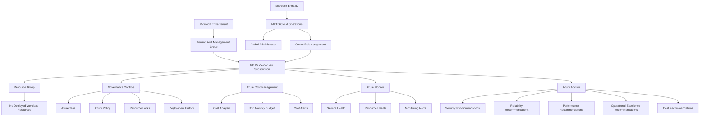

---

## Steps Performed

### Step 1: Opened the Azure Portal

The Azure Portal home page was opened to begin the capstone review.

Reviewed:

- Azure Portal navigation
- Global search
- Common Azure service shortcuts
- Azure credit information
- Access to the MRTG Azure environment

No resource was created from the portal.

The user email address was redacted before the screenshot was added to the repository.

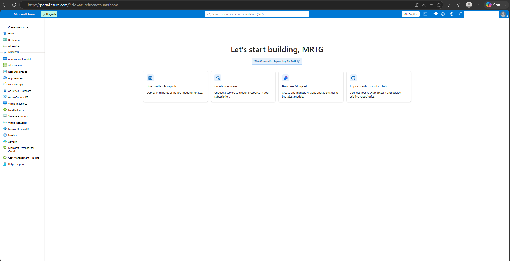

---

### Step 2: Reviewed the Azure Subscription

The Subscriptions page was opened and `MRTG-AZ900-Lab-Subscription` was reviewed.

Observed:

- Subscription status was Active
- Current role was Owner
- Current cost was `$0.00`
- Secure Score was displayed as `100%`
- Parent management group was Tenant Root Group
- No subscription changes were made

The subscription ID was not exposed.

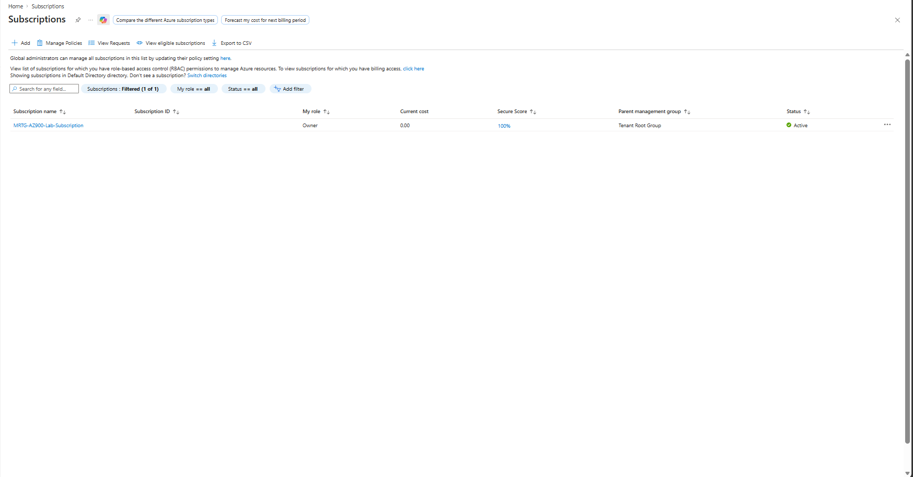

---

### Step 3: Reviewed Resource Groups

The Resource Groups page was opened.

Observed:

- One resource group existed
- The resource group was located in Central US
- The resource group was associated with `MRTG-AZ900-Lab-Subscription`
- The resource group name was redacted
- No resource group was created, modified, moved, tagged, or deleted

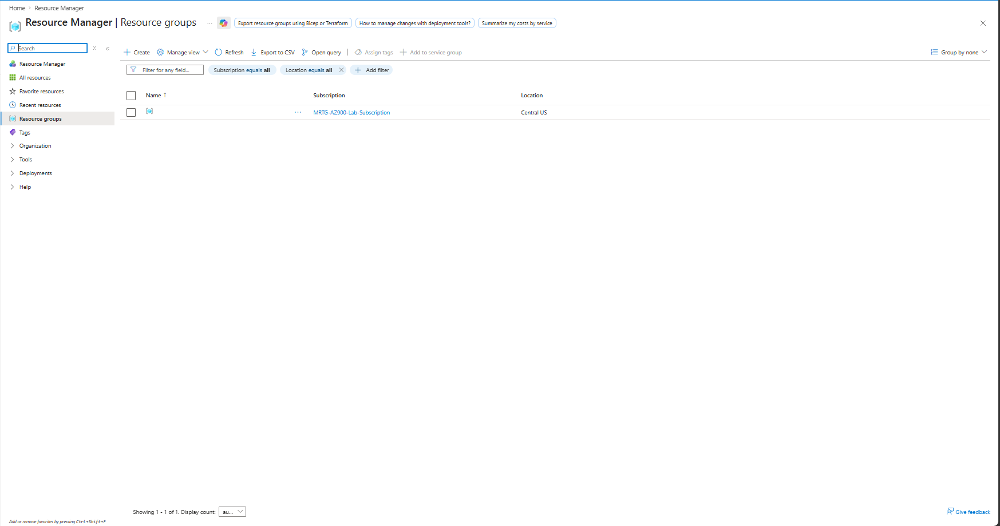

---

### Step 4: Reviewed All Resources

The All Resources page was opened at the subscription scope.

The portal returned no deployed Azure workload resources.

This confirmed that no active virtual machines, storage accounts, virtual networks, databases, application services, or other workload resources remained deployed.

No resource was created, modified, or deleted.

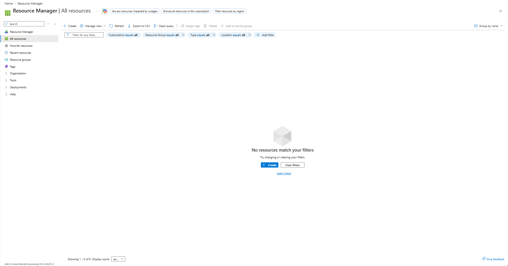

---

### Step 5: Reviewed Microsoft Entra ID

The Microsoft Entra ID overview page was opened.

Observed:

- Microsoft Entra ID Free was in use
- One user was displayed
- No groups were displayed
- No applications were displayed
- No registered devices were displayed
- Microsoft Entra Connect was not enabled
- MRTG Cloud Operations held the Global Administrator role

The directory name, tenant ID, primary domain, and user email address were redacted.

No identity configuration was changed.

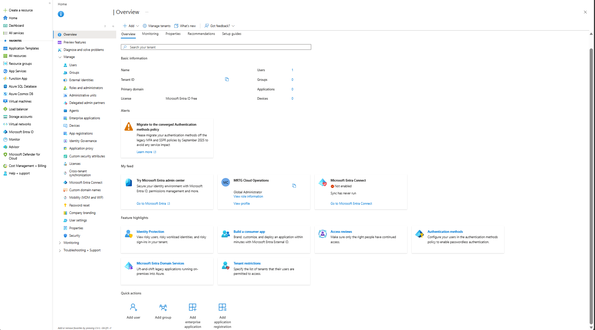

---

### Step 6: Reviewed Subscription IAM and RBAC

The subscription Access Control page was opened and the Role Assignments tab was reviewed.

Observed:

| Identity | Type | Role | Scope |
|---|---|---|---|
| MRTG Cloud Operations | User | Owner | This resource |

The review confirmed that one Owner assignment existed at the subscription scope.

No role assignment was added, modified, or removed.

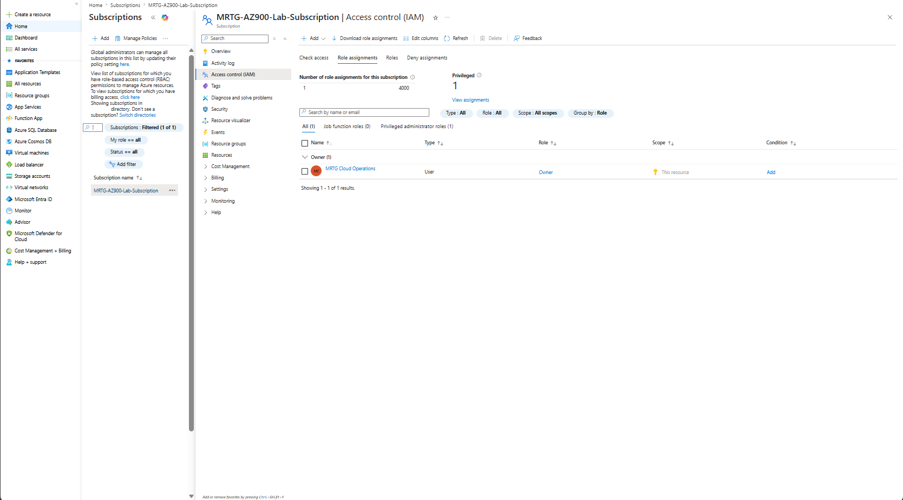

---

### Step 7: Reviewed Subscription Tags

The subscription Tags page was opened.

Observed:

- No subscription-level tags were configured
- No tag names were displayed
- No tag values were displayed
- No tag was created, modified, or deleted

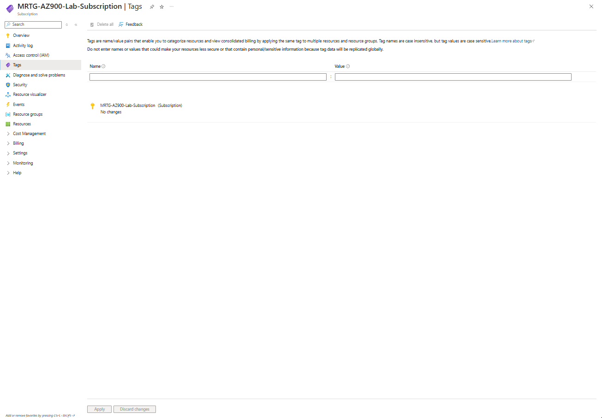

---

### Step 8: Reviewed Azure Policy Compliance

Azure Policy Compliance was opened at the subscription scope.

Observed:

- Overall resource compliance was `0%`
- One evaluated item was non-compliant
- One initiative was non-compliant
- Fifteen policies were non-compliant
- The existing initiative assignment was reviewed
- No policy assignment was created
- No initiative was created
- No exemption was created
- No remediation task was started

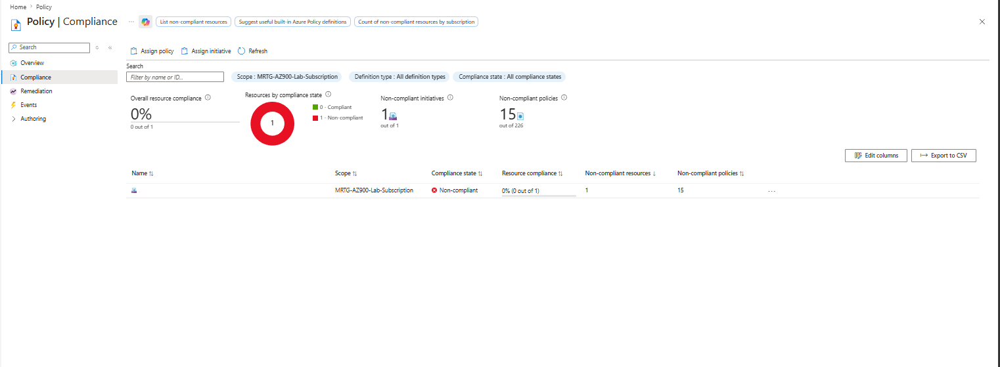

---

### Step 9: Reviewed Resource Locks

The subscription Resource Locks page was opened.

Observed:

- No resource locks were configured
- No Delete lock was present
- No ReadOnly lock was present
- No lock was created
- No lock was modified
- No lock was deleted

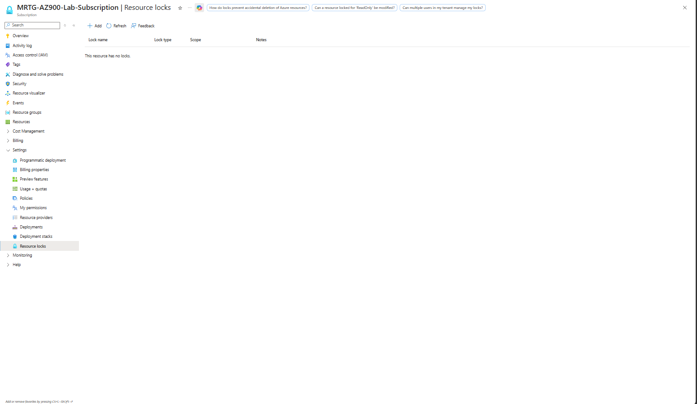

---

### Step 10: Reviewed Management Groups

The Management Groups page was opened.

The hierarchy showed:

```text
Tenant Root Group
└── MRTG-AZ900-Lab-Subscription
```

Observed:

- Tenant Root Group contained one subscription
- `MRTG-AZ900-Lab-Subscription` was located beneath the root group
- No management group was created
- No management group was renamed
- No management group was deleted
- The subscription was not moved

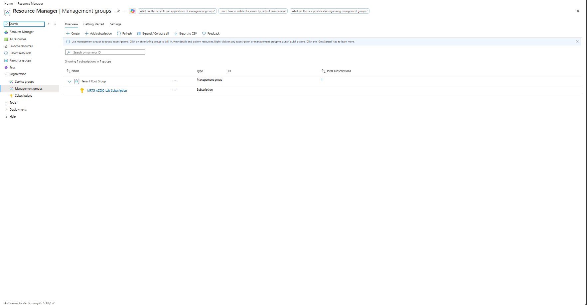

---

### Step 11: Reviewed Azure Deployments

The subscription Deployments page was opened.

Observed:

- No deployment records were displayed
- No deployment was started
- No template was deployed
- No deployment was redeployed
- No deployment was deleted

This confirmed that no subscription-level deployment activity remained visible.

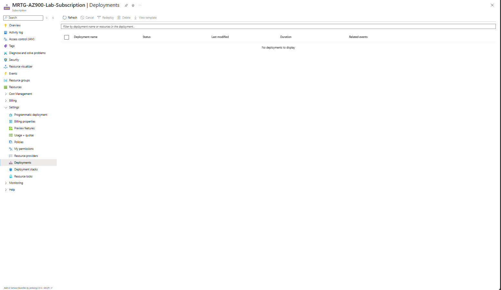

---

### Step 12: Reviewed Cost Analysis

Cost Analysis was opened at the subscription scope.

Observed:

- No cost was reported for the selected period
- No cost data was displayed by service
- No cost data was displayed by location
- No cost data was displayed by resource group
- Forecast data was unavailable because no cost history existed
- No Cost Management settings were changed

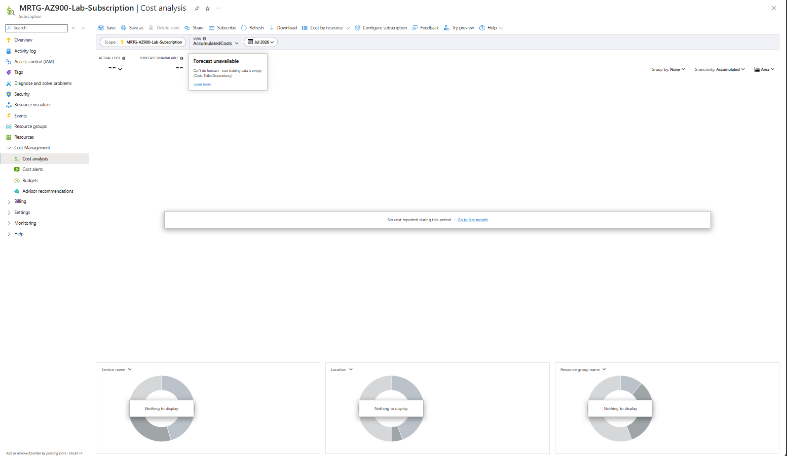

---

### Step 13: Reviewed the Monthly Budget

The subscription Budgets page was opened.

Observed:

| Setting | Value |
|---|---|
| Budget Name | `mrtg-az900-monthly-budget` |
| Reset Period | Monthly |
| Budget Amount | `$10.00` |
| Forecasted Spend | `0` |
| Evaluated Spend | `$0.00` |
| Progress | `0.00%` |

No budget was created, modified, or deleted.

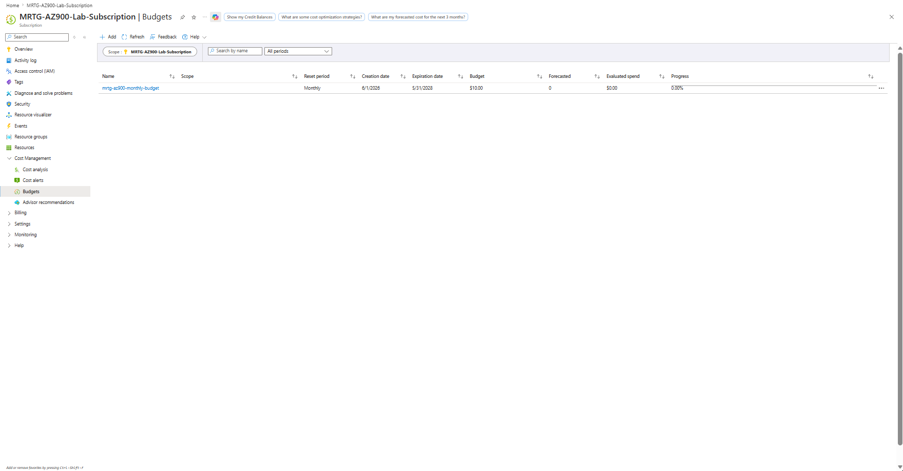

---

### Step 14: Reviewed Cost Alerts

The Cost Alerts page was opened at the subscription scope.

Observed:

- No cost alerts were displayed
- No cost alert was created
- No cost alert was dismissed
- No cost alert was reactivated
- No Cost Management configuration was changed

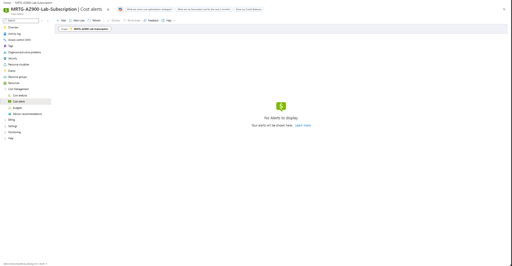

---

### Step 15: Reviewed Azure Monitor

Azure Monitor was opened at the subscription scope.

Observed:

- No Azure service incidents were reported
- No monitoring issues occurred during the previous 24 hours
- No critical alerts were displayed
- No error alerts were displayed
- No warning alerts were displayed
- No informational alerts were displayed
- No verbose alerts were displayed
- No recommendations were displayed in the monitoring summary
- No active or planned maintenance was reported

No monitoring resource, alert rule, action group, workbook, dashboard, or diagnostic setting was created.

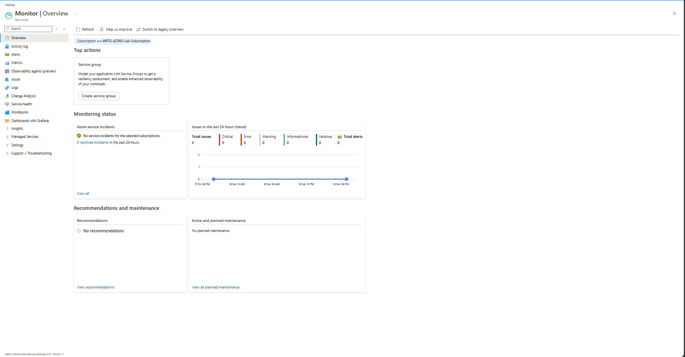

---

### Step 16: Reviewed Azure Service Health

Azure Service Health was opened at the subscription scope.

Observed:

- `MRTG-AZ900-Lab-Subscription` was selected
- No active service issues were reported
- Azure regions on the health map were displayed as healthy
- No Service Health alert was created
- No alert policy was assigned
- No Service Health configuration was changed

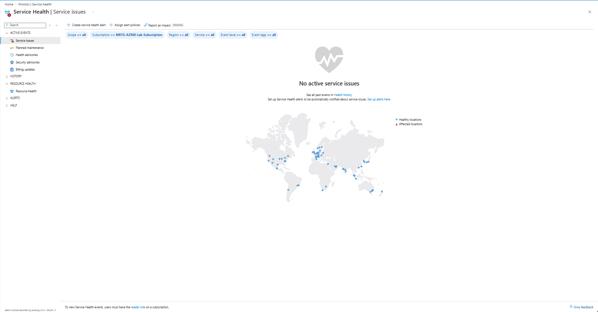

---

### Step 17: Reviewed Azure Resource Health

Azure Resource Health was opened at the subscription scope.

Observed:

- No registered resources were available for selection
- No resource health state could be evaluated
- No Resource Health alert was created
- No monitoring configuration was changed

The absence of Resource Health data was expected because no workload resources were deployed.

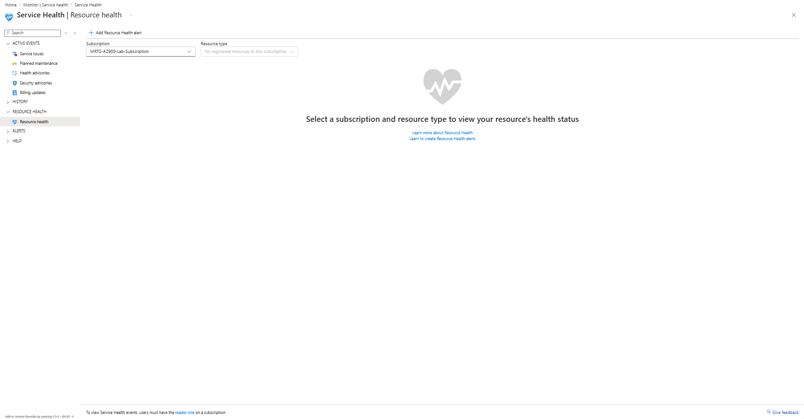

---

### Step 18: Reviewed Azure Advisor

Azure Advisor was opened for `MRTG-AZ900-Lab-Subscription`.

Observed:

- Security score was displayed as `100%`
- Seven active security recommendations were displayed
- One active item was represented in Advisor
- No active cost recommendations were displayed
- No active reliability recommendations were displayed
- No active operational excellence recommendations were displayed
- No active performance recommendations were displayed

No recommendation was applied.

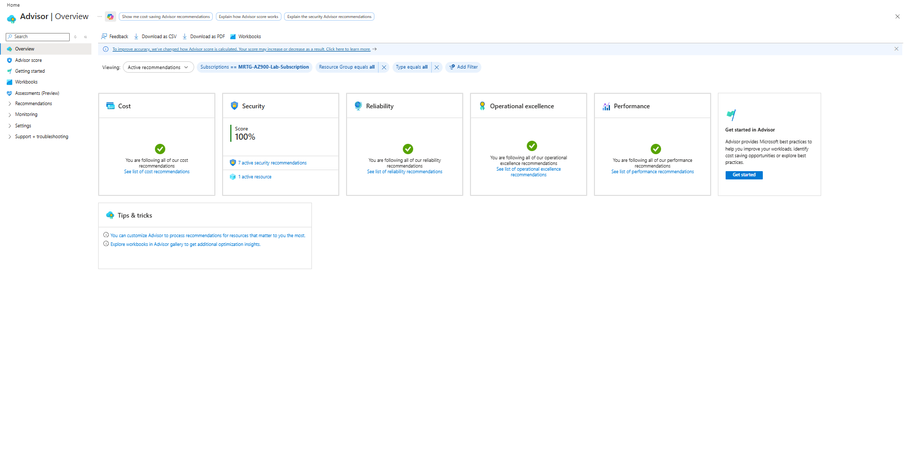

---

### Step 19: Reviewed Azure Advisor Recommendations

The Azure Advisor All Recommendations page was opened.

Seven active security recommendations were displayed.

The recommendations included:

- Enable Microsoft Defender for Storage protections
- Assign more than one Owner to the subscription
- Enable Microsoft Defender Cloud Security Posture Management
- Enable Microsoft Defender for Resource Manager
- Enable email notifications for high-severity security alerts
- Configure subscription Owner notifications
- Configure a contact email address for security issues

The recommendations included high, medium, and low impact levels.

Each recommendation affected one subscription.

No recommendation was applied, postponed, dismissed, or otherwise modified.

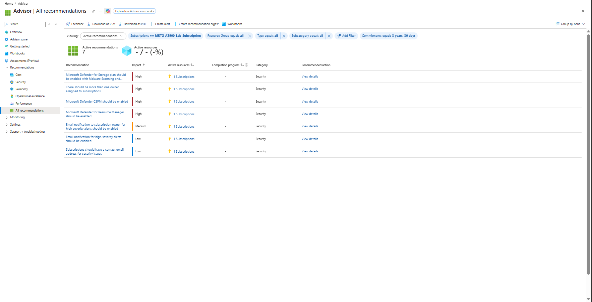

---

## Validation

| Validation Item | Expected Result | Actual Result |
|---|---|---|
| Azure Portal accessed | MRTG environment available | Passed |
| Subscription status reviewed | Subscription active | Passed |
| Subscription role reviewed | Owner role visible | Passed |
| Current subscription cost reviewed | `$0.00` | Passed |
| Resource groups reviewed | Existing resource group documented | Passed |
| Deployed resources reviewed | No workload resources found | Passed |
| Microsoft Entra ID reviewed | Tenant information documented | Passed |
| Subscription IAM reviewed | Owner assignment documented | Passed |
| Subscription tags reviewed | No tags configured | Passed |
| Azure Policy compliance reviewed | Compliance findings documented | Passed |
| Resource locks reviewed | No locks configured | Passed |
| Management group hierarchy reviewed | Subscription beneath Tenant Root Group | Passed |
| Deployment history reviewed | No deployments displayed | Passed |
| Cost Analysis reviewed | No cost reported | Passed |
| Monthly budget reviewed | `$10.00` budget active | Passed |
| Evaluated spend reviewed | `$0.00` | Passed |
| Budget progress reviewed | `0.00%` | Passed |
| Cost alerts reviewed | No alerts displayed | Passed |
| Azure Monitor reviewed | No active monitoring issues | Passed |
| Service Health reviewed | No active service issues | Passed |
| Resource Health reviewed | No registered workload resources | Passed |
| Azure Advisor reviewed | Security score and categories displayed | Passed |
| Advisor recommendations reviewed | Seven security recommendations documented | Passed |
| New resources created | None | Passed |
| Configuration changes made | None | Passed |
| Incremental cost introduced | `$0.00` | Passed |

---

## Completion Checklist

- [x] Opened the Azure Portal
- [x] Reviewed the Azure subscription
- [x] Confirmed the subscription was active
- [x] Confirmed the current role was Owner
- [x] Confirmed the subscription cost was `$0.00`
- [x] Reviewed resource groups
- [x] Reviewed all Azure resources
- [x] Confirmed no workload resources were deployed
- [x] Reviewed Microsoft Entra ID
- [x] Reviewed the Global Administrator identity
- [x] Reviewed subscription IAM
- [x] Reviewed the Owner role assignment
- [x] Reviewed subscription tags
- [x] Reviewed Azure Policy compliance
- [x] Reviewed resource locks
- [x] Reviewed management groups
- [x] Reviewed deployment history
- [x] Reviewed Cost Analysis
- [x] Reviewed the monthly budget
- [x] Reviewed evaluated spend
- [x] Reviewed cost alerts
- [x] Reviewed Azure Monitor
- [x] Reviewed Azure Service Health
- [x] Reviewed Azure Resource Health
- [x] Reviewed Azure Advisor
- [x] Reviewed Azure Advisor recommendations
- [x] Confirmed no resources were created
- [x] Confirmed no role assignments were changed
- [x] Confirmed no tags were changed
- [x] Confirmed no policies were changed
- [x] Confirmed no locks were changed
- [x] Confirmed no deployments were started
- [x] Confirmed no monitoring configurations were changed
- [x] Confirmed no unexpected cost was introduced
- [x] Redacted sensitive identifiers from screenshots

---

## AZ-900 Exam Objective Coverage

This capstone reinforced concepts from all major AZ-900 objective areas.

### Describe Cloud Concepts

- Cloud computing
- Shared responsibility
- Public, private, and hybrid cloud models
- Consumption-based pricing
- High availability
- Scalability
- Reliability
- Predictability
- Security
- Governance
- Manageability

### Describe Azure Architecture and Services

- Azure regions
- Availability zones
- Resource groups
- Subscriptions
- Management groups
- Azure Resource Manager
- Microsoft Entra ID
- Azure RBAC
- Compute services
- Networking services
- Storage services

### Describe Azure Management and Governance

- Azure Portal
- Azure Policy
- Resource locks
- Tags
- Cost Management
- Budgets
- Cost alerts
- Azure Monitor
- Service Health
- Resource Health
- Azure Advisor
- Azure Resource Manager deployments

---

## Mini Objective Coverage

| Topic | Covered |
|---|---|
| Azure Portal | Yes |
| Azure Subscription | Yes |
| Resource Groups | Yes |
| Azure Resources | Yes |
| Microsoft Entra ID | Yes |
| Global Administrator | Yes |
| Azure RBAC | Yes |
| Owner Role | Yes |
| Azure Tags | Yes |
| Azure Policy | Yes |
| Policy Compliance | Yes |
| Resource Locks | Yes |
| Management Groups | Yes |
| Azure Resource Manager Deployments | Yes |
| Cost Analysis | Yes |
| Budgets | Yes |
| Cost Alerts | Yes |
| Azure Monitor | Yes |
| Service Health | Yes |
| Resource Health | Yes |
| Azure Advisor | Yes |
| Advisor Recommendations | Yes |
| Cost Validation | Yes |
| Security Review | Yes |
| Governance Review | Yes |
| Operational Review | Yes |

---

## IAM / Security Relevance

The capstone reinforced the relationship between Azure administration, identity, authorization, governance, and monitoring.

### Microsoft Entra ID

Microsoft Entra ID provides the identity foundation for Azure.

The tenant review showed:

- One administrative identity
- Global Administrator access
- Microsoft Entra ID Free
- No groups
- No applications
- No registered devices
- No hybrid identity synchronization

### Azure RBAC

Azure RBAC determines what authenticated identities can do within Azure.

The subscription contained one Owner assignment for MRTG Cloud Operations.

The Owner role can manage Azure resources and assign Azure roles. Because of its broad permissions, production use of the Owner role should be limited and closely monitored.

### Least Privilege

The capstone identified several areas where least privilege would be important in production:

- Reduce permanent Owner access
- Separate Microsoft Entra administrative roles from Azure resource roles
- Use specialized roles for billing, security, monitoring, and resource administration
- Use Privileged Identity Management for temporary elevation
- Perform regular access reviews
- Use emergency access accounts for tenant recovery

### Separation of Duties

A production environment should separate responsibilities for:

- Identity administration
- Subscription administration
- Security operations
- Billing administration
- Policy administration
- Monitoring administration
- Deployment administration

This reduces the risk that one account can make a change, remove evidence, alter permissions, and approve the same action.

### Advisor Security Recommendations

Azure Advisor identified security recommendations related to:

- Microsoft Defender protections
- Subscription ownership
- Security notifications
- Security contact information

These findings demonstrated how Azure can identify subscription-level security gaps even when no workload resources are deployed.

### Monitoring and Security

Azure Monitor, Service Health, Resource Health, and Azure Advisor support security operations by providing:

- Visibility into Azure activity
- Alerting capabilities
- Service incident awareness
- Resource health information
- Configuration recommendations
- Operational evidence
- Incident investigation data

---

## Governance Notes

### Management Group Hierarchy

The subscription was located directly beneath the Tenant Root Group.

For a single-subscription lab, this structure was sufficient.

A larger production environment should use additional management groups for:

- Production
- Development
- Testing
- Sandbox
- Security
- Shared services
- Business units
- Geographic requirements

### Azure Policy

The subscription showed non-compliant policy findings.

A production governance process should:

1. Review the existing initiative assignment.
2. Identify the reason for each non-compliant policy.
3. Determine whether each finding is applicable.
4. Test changes in a non-production environment.
5. Document exceptions.
6. Remediate approved findings.
7. Monitor compliance continuously.

### Resource Locks

No resource locks were configured.

Production environments should consider:

- Delete locks for critical resources
- ReadOnly locks for highly controlled configurations
- Documented lock ownership
- Change approval before lock removal
- Emergency removal procedures

### Tags

No subscription tags were configured.

A production tagging standard could include:

| Tag | Example Value |
|---|---|
| `Environment` | `Production` |
| `Owner` | `CloudOperations` |
| `Department` | `IT` |
| `CostCenter` | `CC-1001` |
| `Application` | `IdentityPlatform` |
| `DataClassification` | `Confidential` |
| `ManagedBy` | `InfrastructureAsCode` |

### Deployments

No subscription-level deployments were displayed.

Production deployments should use:

- Infrastructure as Code
- Source control
- Pull requests
- Peer review
- Deployment validation
- Approved service connections
- Environment-specific parameters
- Deployment history monitoring

---

## Cost Considerations

The capstone confirmed that the subscription remained within the intended cost boundary.

### Cost Validation

| Cost Item | Result |
|---|---|
| Current Cost | `$0.00` |
| Monthly Budget | `$10.00` |
| Forecasted Spend | `0` |
| Evaluated Spend | `$0.00` |
| Budget Progress | `0.00%` |
| Active Cost Alerts | None |
| Workload Resources | None |
| Incremental Capstone Cost | `$0.00` |

### Production Cost Controls

A production Azure environment should use:

- Subscription budgets
- Resource group budgets
- Cost alerts
- Required cost-center tags
- Azure Advisor cost recommendations
- Spending reviews
- Reserved capacity analysis
- Savings Plans evaluation
- Resource lifecycle management
- Automated shutdown schedules
- Cost allocation reports

---

## Troubleshooting Notes

| Issue | Resolution |
|---|---|
| Resource group name was sensitive | Redacted the resource group name before adding the screenshot |
| Microsoft Entra ID exposed tenant information | Redacted the tenant name, tenant ID, primary domain, and user email |
| Subscription IAM initially displayed the directory name | Removed the directory name before saving the final screenshot |
| Resource locks were difficult to locate | Opened the subscription menu and navigated to Settings > Resource locks |
| All Resources returned no items | Confirmed that no workload resources were deployed |
| Cost forecast was unavailable | Confirmed that no historical cost data existed for forecasting |
| Resource Health displayed no resources | Confirmed that no supported workload resources were deployed |
| Azure Monitor displayed no issues | Treated the empty monitoring state as valid evidence |
| Service Health displayed no active incidents | Confirmed that the subscription was not affected by an active service issue |
| Advisor displayed a 100% score with recommendations | Reviewed the detailed recommendations instead of relying only on the summary score |
| Policy compliance displayed 0% | Documented the existing initiative and policy findings without starting remediation |

---

## What I Would Do Differently in Production

### Identity and Access

- Use separate day-to-day and administrative accounts.
- Reduce permanent Global Administrator assignments.
- Reduce permanent Owner assignments.
- Use Privileged Identity Management.
- Require multifactor authentication.
- Implement Conditional Access.
- Maintain emergency access accounts.
- Perform regular access reviews.
- Use groups for role assignments.
- Use managed identities for applications and automation.

### Governance

- Build a formal management group hierarchy.
- Apply Azure Policy at the appropriate scope.
- Test policies in audit mode before using deny effects.
- Use policy initiatives for organizational standards.
- Create a documented tagging strategy.
- Apply locks to critical resources.
- Document exemptions and remediation decisions.
- Use Azure Blueprints alternatives through policy and Infrastructure as Code.

### Resource Organization

- Separate production, development, testing, and security resources.
- Use standardized resource group naming.
- Use standardized Azure resource naming.
- Apply ownership and cost-center metadata.
- Establish regional deployment standards.

### Deployment Management

- Store Bicep or ARM templates in source control.
- Require peer review for infrastructure changes.
- Use deployment validation.
- Use separate deployment identities.
- Monitor deployment history.
- Use CI/CD pipelines.
- Protect production deployments with approvals.

### Monitoring

- Deploy Log Analytics workspaces.
- Configure diagnostic settings.
- Create Action Groups.
- Create alerts for critical services.
- Configure Service Health alerts.
- Configure Resource Health alerts.
- Integrate Azure Monitor with Microsoft Sentinel.
- Define log retention requirements.
- Protect monitoring resources with Azure RBAC.

### Security

- Review all Azure Advisor security recommendations.
- Evaluate Microsoft Defender for Cloud plans.
- Configure security contact information.
- Configure high-severity alert notifications.
- Review subscription ownership redundancy.
- Enable centralized security monitoring.
- Document accepted risks and exceptions.

### Cost Management

- Keep the existing monthly budget.
- Add alert thresholds.
- Apply cost-center tags.
- Review Azure Advisor cost recommendations.
- Use automated shutdown for non-production resources.
- Review spending on a scheduled basis.
- Define approval requirements for higher-cost resources.

---

## Lessons Learned

### Azure Administration Requires Multiple Control Layers

Azure security and management are not handled by one service.

The environment depends on:

- Microsoft Entra ID for authentication
- Azure RBAC for authorization
- Management groups for hierarchy
- Azure Policy for governance
- Resource locks for protection
- Tags for organization
- Cost Management for financial control
- Azure Monitor for visibility
- Azure Advisor for recommendations

### Subscription Scope Matters

The subscription acts as a boundary for:

- Resources
- Role assignments
- Policy assignments
- Cost Management
- Budgets
- Monitoring
- Advisor recommendations

### Identity Roles and Azure Roles Are Different

Global Administrator is a Microsoft Entra directory role.

Owner is an Azure RBAC resource role.

An identity may hold one, both, or neither role.

### Empty Results Can Be Valid Evidence

The capstone contained several empty states:

- No workload resources
- No deployments
- No tags
- No locks
- No cost alerts
- No active service issues
- No Resource Health entries

These results were valid because they documented the actual state of the environment.

### Summary Scores Need Context

Azure Advisor displayed a security score of `100%` while also showing seven active security recommendations.

The detailed recommendation list provided more useful operational information than the summary score alone.

### Governance Findings Require Review

The Policy Compliance page displayed one non-compliant initiative and fifteen non-compliant policies.

A compliance percentage should not be interpreted without reviewing:

- Policy scope
- Evaluation status
- Applicability
- Existing resource state
- Assignment purpose
- Remediation requirements

### Cost Controls Should Be Continuous

The `$10.00` monthly budget and `$0.00` evaluated spend confirmed that the lab environment remained within its expected cost boundary.

Cost validation should be performed throughout a project rather than only at the end.

### Redaction Is Part of Professional Documentation

Azure screenshots may expose:

- Subscription IDs
- Tenant IDs
- Directory names
- User email addresses
- Object IDs
- Domains
- Billing information
- Resource names

Reviewing and redacting screenshots before publication is an important cloud documentation skill.

---

## Cleanup

No cleanup was required because no resources or configurations were created during the capstone.

The capstone did not create or modify:

- Azure resources
- Resource groups
- Role assignments
- Microsoft Entra identities
- Tags
- Policy assignments
- Policy initiatives
- Policy exemptions
- Remediation tasks
- Resource locks
- Management groups
- Deployments
- Budgets
- Cost alerts
- Alert rules
- Action groups
- Diagnostic settings
- Service Health alerts
- Resource Health alerts
- Azure Advisor recommendations

---

## Outcome

Lab 13 successfully completed the **MRTG Azure Fundamentals: The Bridge** project.

The capstone validated:

- Azure Portal access
- Active subscription status
- Subscription-level Owner access
- Microsoft Entra ID configuration
- Azure RBAC assignments
- Resource organization
- Azure Policy compliance
- Resource lock status
- Management group hierarchy
- Deployment history
- Cost Analysis
- Budget protection
- Cost alert status
- Azure Monitor status
- Azure Service Health
- Azure Resource Health
- Azure Advisor recommendations

The environment contained no deployed workload resources, no active cost alerts, no active Azure service incidents, and no unexpected spending.

The final evaluated spend remained:

```text
$0.00
```

---

## Screenshot Inventory

| Screenshot | Description |
|---|---|
| `01-azure-portal-capstone-start.png` | Azure Portal home page and capstone starting point |
| `02-subscription-overview.png` | Active subscription status, Owner role, cost, Secure Score, and management group |
| `03-resource-groups-capstone-review.png` | Resource group review with sensitive name redacted |
| `04-all-resources-capstone-review.png` | All Resources page showing no deployed workload resources |
| `05-microsoft-entra-id-capstone-review.png` | Microsoft Entra ID tenant review with sensitive identifiers redacted |
| `06-subscription-iam-capstone-review.png` | Subscription-level Owner role assignment |
| `07-subscription-tags-capstone-review.png` | Subscription Tags page showing no configured tags |
| `08-policy-compliance-capstone-review.png` | Azure Policy compliance findings |
| `09-resource-locks-capstone-review.png` | Subscription Resource Locks page showing no locks |
| `10-management-groups-capstone-review.png` | Tenant Root Group and subscription hierarchy |
| `11-deployments-capstone-review.png` | Subscription Deployments page showing no deployments |
| `12-cost-analysis-capstone-review.png` | Subscription Cost Analysis showing no reported cost |
| `13-budget-capstone-review.png` | `$10.00` monthly budget with `$0.00` evaluated spend |
| `14-cost-alerts-capstone-review.png` | Cost Alerts page showing no active alerts |
| `15-azure-monitor-capstone-review.png` | Azure Monitor subscription overview |
| `16-service-health-capstone-review.png` | Service Health showing no active service issues |
| `17-resource-health-capstone-review.png` | Resource Health showing no registered workload resources |
| `18-azure-advisor-capstone-review.png` | Azure Advisor overview and security score |
| `19-azure-advisor-recommendations-capstone-review.png` | Seven active Azure Advisor security recommendations |

---

## Screenshots

### Azure Portal Capstone Start


### Subscription Overview


### Resource Groups Capstone Review


### All Resources Capstone Review


### Microsoft Entra ID Capstone Review


### Subscription IAM Capstone Review


### Subscription Tags Capstone Review


### Policy Compliance Capstone Review


### Resource Locks Capstone Review


### Management Groups Capstone Review


### Deployments Capstone Review


### Cost Analysis Capstone Review


### Budget Capstone Review


### Cost Alerts Capstone Review


### Azure Monitor Capstone Review


### Service Health Capstone Review


### Resource Health Capstone Review


### Azure Advisor Capstone Review


### Azure Advisor Recommendations Capstone Review


---

## Series Completion

Lab 13 completes the **MRTG Azure Fundamentals: The Bridge** project.

The completed series includes:

| Lab | Title |
|---:|---|
| 01 | Azure Environment and Cost Protection |
| 02 | Cloud Computing and Shared Responsibility |
| 03 | Cloud Models, Benefits, and Service Types |
| 04 | Azure Architecture and Resource Hierarchy |
| 05 | Azure Compute Services |
| 06 | Azure Networking Foundation |
| 07 | Azure Storage Services |
| 08 | Microsoft Entra ID, RBAC, and Zero Trust |
| 09 | Azure Cost Management and Resource Organization |
| 10 | Azure Governance, Policy, and Compliance |
| 11 | Azure Management and Deployment Tools |
| 12 | Azure Monitoring, Health, and Optimization |
| 13 | MRTG Azure Fundamentals Capstone |

The project established a documented foundation for future Azure identity, security, administration, and hybrid cloud labs.
