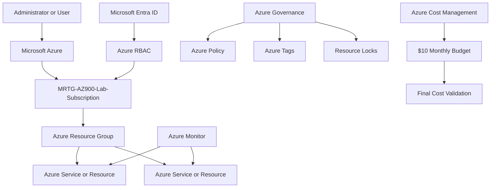

# Lab XX - Lab Title

## Objective

Describe the primary technical and learning objectives of the lab.

By completing this lab, I:

- Reviewed or configured objective one
- Reviewed or configured objective two
- Reviewed or configured objective three
- Validated objective four
- Confirmed the final resource and cost state

> Update this section to reflect completed work. Use past tense and avoid listing actions that were not performed.

---

## Business Problem Solved

Explain:

- The current business or technical challenge
- The operational, security, governance, or financial risk created by the challenge
- The Azure capability that addresses the requirement
- The expected technical and business outcome

Example:

Monroe Redstone Technology Group needed to understand or implement an Azure capability before expanding its cloud environment.

Without the capability, the organization could experience:

- Operational risk
- Security exposure
- Inconsistent administration
- Weak governance
- Unexpected cost

This lab established the knowledge or configuration required to address those concerns.

---

## Scenario

Monroe Redstone Technology Group is evaluating Microsoft Azure to support secure, governed, and cost-conscious cloud adoption.

In this lab, MRTG must:

- Requirement one
- Requirement two
- Requirement three
- Requirement four
- Validate the final environment state

State whether the lab was:

```text
Discovery-only
```

or:

```text
Deployment and configuration
```

For a discovery-only lab, use language such as:

> This was a discovery-only lab. No Azure resources or configurations were created or modified.

For a deployment lab, describe the resources or configurations that were created.

---

## Azure Services and Resources Used

| Azure Service, Resource, or Platform | Purpose |
|---|---|
| Microsoft Learn | Provided certification-aligned instruction |
| Azure Portal | Supported practical service review or configuration |
| Service or resource name | Explain how it was used |
| Service or resource name | Explain how it was used |
| Azure Cost Management | Supported final spending validation |
| Azure Budgets | Confirmed the final budget and spending state |

---

## Why These Services Were Used

### Microsoft Learn

Explain how Microsoft Learn supported:

- Certification-aligned instruction
- Concept review
- Service comparison
- Exam-objective preparation

### Azure Portal

Explain how the Azure Portal supported:

- Service discovery
- Resource configuration
- Validation
- Monitoring
- Cost review

### Service or Resource Name

Explain:

- What the service provides
- Why it was selected or reviewed
- What requirement it satisfies
- How it differs from similar Azure services
- Whether it was deployed or reviewed only
- What security, governance, and cost considerations apply

### Service or Resource Name

Explain:

- What the service provides
- Why it was selected or reviewed
- What requirement it satisfies
- How it differs from available alternatives
- Whether it was deployed or reviewed only

---

## Environment

| Item | Value |
|---|---|
| Organization | Monroe Redstone Technology Group |
| Project | MRTG Azure Fundamentals: The Bridge |
| Lab | Lab XX - Lab Title |
| Cloud Platform | Microsoft Azure |
| Management Interface | Azure Portal |
| Learning Platform | Microsoft Learn |
| Subscription | `MRTG-AZ900-Lab-Subscription` |
| Primary Region | `Central US` |
| Existing Resource Group | `rg-mrtg-az900-lab01-centralus-001` or None |
| New Resource Group | Resource group name or None |
| Resources Created | List resources or None |
| Resources Modified | List resources or None |
| Resources Deleted | List resources or None |
| Monthly Budget | `$10.00` |
| Evaluated Spend | `$0.00` |
| Budget Progress | `0.00%` |
| Documentation Platform | GitHub |
| Lab Type | Discovery-only or Deployment and configuration |
| Estimated Cost | `$0.00` or estimated amount |

> Remove environment rows that do not apply to the lab.

### Resource Naming Convention

Use this section only when the lab creates or documents Azure resources.

```text
<resource-type>-<organization>-<project>-<lab>-<region>-<instance>
```

### Example Resource Name

```text
rg-mrtg-az900-labxx-centralus-001
```

### Required Tags

Use this section only when tags are applied or reviewed.

| Tag | Value |
|---|---|
| `Project` | `MRTG-AZ900-The-Bridge` |
| `Lab` | `Lab-XX` |
| `Environment` | `Lab` |
| `Owner` | `MRTG-Cloud-Operations` |
| `CostCenter` | `Training` |
| `ManagedBy` | `Azure-Portal` |
| `DeleteAfter` | `YYYY-MM-DD` |

---

## Architecture / Concept Diagram



Update the diagram to represent the actual:

- Resources
- Identities
- Network paths
- Management scopes
- Governance controls
- Service relationships
- Monitoring paths
- Cost controls

For a discovery-only lab, use a concept diagram instead of implying that resources were deployed.

---

## Steps Performed

### Step 1: Step Title

1. Opened the required Azure service, Microsoft Learn module, or management interface.
2. Navigated to the appropriate page.
3. Reviewed or entered the required settings.
4. Confirmed the expected configuration or service state.
5. Did not create or modify resources unless required by the lab.

Configuration or observed state:

```text
Setting: Value
Setting: Value
Setting: Value
```


**Validation:** Explain what the screenshot confirms.

---

### Step 2: Step Title

1. Performed the required review or configuration.
2. Reviewed the relevant properties.
3. Compared the observed result with the expected result.
4. Recorded the final state.

Configuration or observed state:

```text
Setting: Value
Setting: Value
Setting: Value
```


**Validation:** Explain what the screenshot confirms.

---

### Step 3: Step Title

1. Opened the relevant Azure resource or service.
2. Reviewed its status and properties.
3. Confirmed the expected values.
4. Confirmed whether any changes were made.


**Validation:** Explain what the screenshot confirms.

---

### Step 4: Perform Final Cost Validation

1. Opened Azure Cost Management.
2. Reviewed Cost Analysis or the existing subscription budget.
3. Confirmed the current spending state.
4. Confirmed that no unexpected resources or charges were present.
5. Redacted sensitive billing, subscription, or scope information.


**Validation:** Document the budget, evaluated spend, budget progress, and final cost state.

> Add or remove steps to match the actual lab. Preserve the exact screenshot filenames used in the repository.

---

## Supporting Concept Summary

Use one or more supporting concept sections when the lab requires additional explanation.

Possible examples include:

- Service Comparison
- Shared Responsibility Model
- Resource Hierarchy
- Compute Selection
- Networking Summary
- Storage Redundancy
- Authentication vs Authorization
- Azure Policy vs Azure RBAC
- Metrics vs Logs
- Cost Management Scope

Example:

| Concept | Purpose |
|---|---|
| Concept one | Explain its purpose |
| Concept two | Explain its purpose |
| Concept three | Explain its purpose |

---

## Validation

| Validation Item | Expected Result | Actual Result |
|---|---|---|
| Service review | Required service is located and reviewed | Passed |
| Configuration review | Expected settings are visible | Passed |
| Access review | Required access is confirmed | Passed |
| Governance review | Required governance state is documented | Passed |
| Resource creation | Expected resources are created or no resources are created | Passed |
| Resource modification | Expected changes are completed or no changes are made | Passed |
| Cost validation | Final spending matches the lab estimate | Passed |
| Screenshot review | Sensitive information is redacted | Passed |

---

## Completion Checklist

- [x] Reviewed the required Microsoft Learn content
- [x] Opened the required Azure Portal services
- [x] Reviewed or completed the required configuration
- [x] Validated the final service or resource state
- [x] Confirmed whether resources were created
- [x] Confirmed whether resources were modified
- [x] Confirmed whether resources were deleted
- [x] Reviewed identity and access considerations
- [x] Reviewed governance considerations
- [x] Reviewed cost considerations
- [x] Reviewed Cost Management
- [x] Confirmed the final evaluated spend
- [x] Sanitized screenshots before upload
- [x] Avoided exposing sensitive Azure information

> Replace generic checklist items with the actual actions completed in the lab.

---

## AZ-900 Exam Objective Coverage

### Primary Exam Domain

Select the primary applicable domain:

```text
Describe cloud concepts
```

or:

```text
Describe Azure architecture and services
```

or:

```text
Describe Azure management and governance
```

### Supporting Exam Domain

Add a supporting domain when applicable:

```text
Describe cloud concepts
```

```text
Describe Azure architecture and services
```

```text
Describe Azure management and governance
```

### Skills Measured

This lab supports the ability to:

- Describe the relevant Azure service or concept
- Compare related Azure services
- Explain the business purpose of the service
- Describe identity and security considerations
- Describe governance considerations
- Describe cost considerations
- Identify where the service is managed in Azure

### How This Lab Supports the Objectives

Explain:

- The Azure concepts demonstrated
- The services reviewed or configured
- The business requirements addressed
- The differences between similar Azure services
- The decisions an AZ-900 candidate should understand
- How the Azure Portal review connected theory to practical administration

---

## Mini Objective Coverage

By completing this lab, I can:

- Explain the purpose of the Azure service
- Identify the business problem addressed by the service
- Explain where the service fits within Azure architecture
- Describe its identity and security considerations
- Describe its governance considerations
- Explain its cost considerations
- Compare it with relevant alternatives
- Recognize scenarios in which the service should be selected
- Locate the service in the Azure Portal
- Validate the service without making unnecessary changes

---

## IAM / Security Relevance

This lab relates to identity and security through applicable areas such as:

- Authentication
- Authorization
- Microsoft Entra ID
- Azure RBAC
- Least privilege
- Scope inheritance
- Resource ownership
- Administrative separation
- Shared responsibility
- Zero Trust
- Defense in depth
- Logging
- Monitoring
- Accountability

### On-Premises Connection

Use this section only when the comparison adds value.

| On-Premises Concept | Azure Concept |
|---|---|
| Active Directory identity | Microsoft Entra identity |
| Security group membership | Azure RBAC role assignment |
| Organizational structure | Management group, subscription, and resource-group hierarchy |
| Delegated administration | Scoped Azure role assignment |
| Group Policy | Azure Policy |
| Event logs | Azure Activity Log and Azure Monitor |
| Administrative boundaries | Azure scopes and resource organization |

### Security Analysis

Explain:

- Who can access or administer the service
- How access is authenticated
- How access is authorized
- Which Azure scope controls the permission
- Whether permissions are inherited
- What the minimum required access should be
- Which privileged roles are involved
- What security controls would be added in production
- What sensitive information was redacted from screenshots

---

## Governance Notes

Governance considerations may include:

- Resource naming
- Resource tagging
- Subscription organization
- Resource-group placement
- Management-group placement
- Role-assignment scope
- Azure Policy applicability
- Resource-lock applicability
- Cost ownership
- Activity logging
- Compliance requirements
- Resource lifecycle
- Cleanup responsibility
- Change management

### Governance Decisions

| Decision | Implementation | Reason |
|---|---|---|
| Lab type | Discovery-only or deployment | Explain why |
| Naming | Standard MRTG naming convention or not applicable | Improves consistency |
| Tagging | Standard MRTG tag set or not applicable | Supports ownership and cost tracking |
| Scope | Narrowest practical scope | Reduces unnecessary access |
| Region | `Central US` unless otherwise required | Maintains lab consistency |
| Cost review | Final Cost Management validation | Confirms cost-safe execution |
| Screenshot review | Sensitive identifiers redacted | Protects environment information |
| Cleanup | Resources removed or no cleanup required | Prevents abandoned resources |

### Governance Lesson

Summarize the primary governance lesson from the lab.

Example:

> Azure services should be deployed only after ownership, scope, access, cost, monitoring, and cleanup requirements are defined.

---

## Cost Considerations

### Estimated Lab Cost

```text
Estimated cost: $0.00
```

or:

```text
Estimated cost: $0.00 to $X.XX
```

### Why Cost Remained at Zero

Use this section for discovery-only labs.

This lab did not create:

- Billable resource
- Billable resource
- Supporting dependency
- Premium feature
- Monitoring resource

### Common Cost Drivers

Potential cost factors include:

- Resource type
- Service tier
- Region
- Runtime
- Storage capacity
- Data transfer
- Transaction volume
- Monitoring ingestion
- Backup retention
- Licensing
- Redundancy
- Optional premium features

### Cost Controls Applied

- Used free or low-cost services where practical
- Reviewed pricing before deployment
- Used discovery-only review where deployment was unnecessary
- Used the smallest practical resource size when applicable
- Applied cost-management tags when applicable
- Monitored subscription spending
- Confirmed that the budget remained active
- Avoided unnecessary premium features
- Defined a cleanup plan
- Removed resources when no longer required

### Budget Validation

Document the observed result:

```text
Budget: $10.00
Forecasted spend: 0
Evaluated spend: $0.00
Progress: 0.00%
```

### Budget Limitation

Azure budgets:

- Monitor actual and forecasted spending
- Generate notifications
- Do not automatically stop resources
- Do not delete resources
- Do not prevent deployments
- Do not enforce a hard spending cap
- Do not replace regular Cost Management review

Actual cost depends on:

- Region
- Service configuration
- Usage duration
- Free-service eligibility
- Current Azure pricing

---

## Troubleshooting Notes

### Issue 1: Issue Title

**Symptom**

Describe the error, unexpected behavior, confusing portal state, or failed validation.

**Cause**

Explain the confirmed or likely cause.

**Resolution**

1. Performed troubleshooting action.
2. Reviewed the relevant configuration.
3. Applied the corrective action or documented the expected state.
4. Repeated validation.

**Result**

Describe the final outcome.

---

### Issue 2: Issue Title

**Symptom**

Describe the issue.

**Cause**

Describe the cause.

**Resolution**

1. Performed troubleshooting action.
2. Reviewed the relevant configuration.
3. Completed the required correction or documentation.
4. Confirmed the final result.

**Result**

Describe the final outcome.

> Discovery-only labs can document expected empty states, similar service names, prominent Create options, redaction requirements, or scope-related confusion.

---

## What I Would Do Differently in Production

A production implementation could include applicable controls such as:

### Identity and Access

- Separate administrator and standard-user accounts
- Microsoft Entra groups instead of direct assignments
- Privileged Identity Management
- Conditional Access
- Multifactor authentication
- Emergency-access accounts
- Regular access reviews
- Managed identities

### Governance

- Formal approval workflows
- Azure Policy
- Resource locks
- Required tags
- Approved regions
- Management-group hierarchy
- Change management
- Documented exceptions

### Architecture and Deployment

- Infrastructure as Code
- Source control
- Peer review
- CI/CD pipelines
- Environment separation
- High-availability design
- Defined recovery objectives
- Rollback procedures

### Security

- Private endpoints
- Network segmentation
- Centralized logging
- SIEM integration
- Vulnerability management
- Microsoft Defender for Cloud
- Secret management
- Security monitoring

### Operations

- Alerting
- Backup
- Disaster recovery
- Incident-response procedures
- Service ownership
- Support escalation
- Compliance reporting

### Cost Management

- Formal cost ownership
- Workload-level budgets
- Forecast alerts
- Cost-center tags
- Right-sizing
- Automated shutdown
- Resource-lifecycle management
- Scheduled cost reviews

Explain which controls apply to this lab and why they were not required in the learning environment.

---

## Lessons Learned

Key lessons from this lab include:

- Lesson one
- Lesson two
- Lesson three
- Lesson four
- Lesson five

### Technical Takeaway

Summarize the most important technical lesson.

### Business Takeaway

Summarize the business value of the Azure service or concept.

### Security Takeaway

Summarize the identity, access, or security implication.

### Exam Takeaway

Summarize what should be remembered for the AZ-900 exam.

---

## Cleanup

### Resources Retained

| Resource or Configuration | Reason |
|---|---|
| Resource or configuration name | Required for the next lab, project evidence, or future validation |

### Resources Removed

Use this table only when resources were removed.

| Resource or Configuration | Reason |
|---|---|
| Resource or configuration name | No longer required and could generate cost or risk |

### Cleanup Procedure

Use this section only when cleanup was required.

1. Opened the relevant resource group or Azure service.
2. Reviewed all resources and dependencies.
3. Confirmed that no retained resource depended on the item being removed.
4. Deleted the unnecessary resource or resource group.
5. Monitored the deletion process.
6. Confirmed that the resource no longer appeared.
7. Reviewed Cost Management for remaining billable resources.

### Cleanup Validation

- [x] Required resources were retained
- [x] Unnecessary resources were deleted or no resources required deletion
- [x] No unattached disks remained
- [x] No unused public IP addresses remained
- [x] No unnecessary premium services remained enabled
- [x] Cost Management was reviewed
- [x] The final resource state was documented
- [x] Screenshot data was sanitized

---

## Outcome

This lab successfully demonstrated:

- Completed capability
- Completed capability
- Completed capability
- Completed capability
- Final validation result

The final environment or configuration met the defined:

- Technical requirements
- Security requirements
- Governance requirements
- Cost-management requirements

The lab also established a practical connection between AZ-900 concepts and their application within Microsoft Azure.

---

## Screenshot Inventory

| Screenshot | Description |
|---|---|
| `01-descriptive-screenshot-name.png` | Description of the first screenshot |
| `02-descriptive-screenshot-name.png` | Description of the second screenshot |
| `03-descriptive-screenshot-name.png` | Description of the third screenshot |
| `04-final-cost-validation.png` | Final Cost Management validation |

---

## Screenshots

### Screenshot One


### Screenshot Two


### Screenshot Three


### Final Cost Validation


---

## Next Lab

Use this section for Labs 01 through 12.

The next lab is:

```text
Lab XX - Next Lab Title
```

The next lab builds on this work by examining:

- Next objective
- Next objective
- Next objective
- Next objective

---

## Series Completion

Use this section instead of **Next Lab** for the final lab.

This lab completes the **MRTG Azure Fundamentals: The Bridge** project.

The completed series established a foundation for future work involving:

- Microsoft Entra ID
- Identity and Access Management
- Azure security
- Azure administration
- Azure governance
- Azure monitoring
- Hybrid identity
- Infrastructure as Code
- SC-900
- AI-901
- SC-300
- AZ-104
